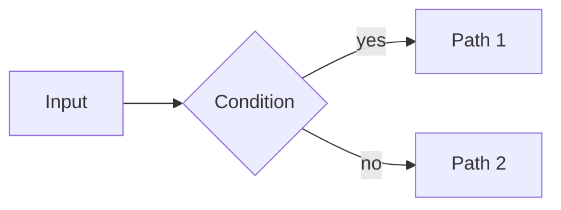

# Content Standards

Apply these standards whenever writing **issue descriptions** or **markdown documents**
(design docs, research findings, documentation, completion reports).

---

## Issue Descriptions

An issue description is a small standalone markdown document. A reader with no other
context — no access to the spec, no conversation history — must be able to read it and
understand what needs to be done and why.

### Required structure

```markdown
Brief 1–2 sentence summary of what this issue is and why it matters.

## Background

[For non-trivial issues: context a reader would need. Omit for simple leaf tasks
where the title is fully self-explanatory.]

## Success Criteria

- [ ] Criterion stated as an observable outcome, not an action
- [ ] Specific enough that a reviewer can verify it without ambiguity

## Notes

[Optional: constraints, references, open questions, links to related issues or docs.]
```

### Rules

- `## Success Criteria` is **mandatory** on every issue. Items must be verifiable — prefer
  outcomes ("function returns X for input Y") over actions ("implement X").
- Descriptions use second-level headings (`##`) — never `#` (reserved for the title if
  rendered standalone) or deeper than `###`.
- Write in present tense, imperative voice for criteria ("Returns…", "Handles…", "Emits…").
- If the issue involves math or a diagram, apply the standards below — do not defer to prose.

### Anti-patterns

The DAG is the source of truth for dependencies and containment. Do not duplicate it in markdown:

- ❌ No `## Depends on` section listing parent task IDs — `jit graph deps` is canonical.
- ❌ No `## Children` blow-by-blow that just lists child titles — a one-line summary of
  *purpose* is fine, but don't restate what `jit graph deps` already shows.
- ❌ No cross-references between sibling issues ("Same as A1", "Per A2's protocol").
  Issues must be standalone-readable; a worker reading the issue with no other context
  must understand it.

When existing repo issues conflict with these standards, this document is canonical. Apply
the standards to new issues; do not retroactively rename existing ones unless asked.

---

## Issue Titles

Titles are clean. Do not embed metadata in them:

- ❌ `babcf05e/S0: PPC measurement infrastructure`
- ❌ `feat(jit:abc1234): rewrite parser`
- ✅ `PPC measurement infrastructure`
- ✅ `Rewrite parser`

Position within an epic/story is encoded in dependency edges and labels, not in the title.

JIT escapes `<` and `>` in title strings (stored as `&lt;`/`&gt;`). Reword to avoid them
in titles — `Fp prime Montgomery batch` not `Fp<P> Montgomery batch`. Description bodies
render `<...>` correctly.

---

## Strategic Labels

For `epic:*`, `story:*`, `milestone:*`, and other strategic-grouping namespaces, use a
kebab-case slug describing the bucket — never the issue's JIT short ID:

- ❌ `epic:abc12345`, `story:def67890`, `milestone:b117c95e`
- ✅ `epic:user-auth`, `story:auth-rate-limiting`, `milestone:q3-perf`

Slugs are stable across renames, navigable from any view, and meaningful when grepped
from CI output. JIT short IDs are non-descriptive 8-char hashes.

---

## Diagrams

**Use Mermaid for all diagrams.** Do not use ASCII art (pipes, dashes, boxes drawn with
characters). Mermaid renders natively in GitHub, GitLab, and most markdown viewers.

````markdown

````

Common diagram types:
- **flowchart** — algorithms, decision trees, data flow
- **sequenceDiagram** — protocol interactions, call sequences
- **stateDiagram-v2** — state machines, lifecycle diagrams
- **graph TD/LR** — dependency DAGs, trees
- **classDiagram** — type relationships, module structure
- **gantt** — timelines, wave plans

---

## Mathematics

**Use LaTeX for all mathematical notation.** Do not write equations as plain text
(e.g. `I = sum_k ...`). Inline and display math are both supported in GitHub-flavored
markdown and most renderers.

**Inline math** — use `$...$` for variables and short expressions within a sentence:

> The symbol energy is $E_s = \frac{1}{M}\sum_{i=0}^{M-1} x_i^2$, where $M = 2^m$.

**Display math** — use `$$...$$` (on its own line) for standalone equations:

$$
I^{\mathrm{BI}}(\mathrm{SNR}) = \frac{1}{M} \sum_{k=1}^{m} \sum_{u \in \{0,1\}}
\sum_{i \in \mathcal{I}_{k,u}} \int p_{Y|X{=}x_i}(y)\,
\log_2 \frac{2\,\sum_{j \in \mathcal{I}_{k,u}} p_{Y|X{=}x_j}(y)}
           {\sum_{x} p_{Y|X{=}x}(y)}\, dy
$$

### Rules

- Variable names appearing in text must use math mode: write $x$ not `x`, $N_0$ not `N_0`.
- Use `\text{...}` for multi-letter labels inside math: $I^{\text{BI}}$ not $I^{BI}$.
- Prefer `\frac{a}{b}` over `a/b` for display fractions.
- For summations/integrals in inline context, use `\sum` / `\int` without display limits
  to keep line height reasonable; move to display math if the expression needs full limits.

---

## JIT-tooling pitfalls

These are JIT CLI / tooling quirks worth knowing while writing or editing issues:

- **`jit validate --fix` is the transitive-reduction tool.** `jit dep add` accepts
  redundant edges silently (no `Added 0` warning); `jit validate` flags them as
  "Transitive reduction violation" and `--fix` removes them. There is no separate
  `jit dep reduce`.
- **`jit issue update --label` appends; it does not replace.** To rename a label,
  pair it with `--remove-label`: `jit issue update <id> --label new --remove-label old`.
- **Title HTML-escaping.** See *Issue Titles* above — `<` and `>` are escaped only in
  the title field, not in the description body.
- **Strategic-heading matching is case-tolerant.** Tooling that scans for
  `## Success Criteria` should also accept lowercase `criteria`, plus the equivalents
  documented in `jit-manage` Workflow B2 (Acceptance Criteria, Definition of Done).
  Authors of new issues use the canonical capitalization; tooling stays robust to
  legacy variants.
