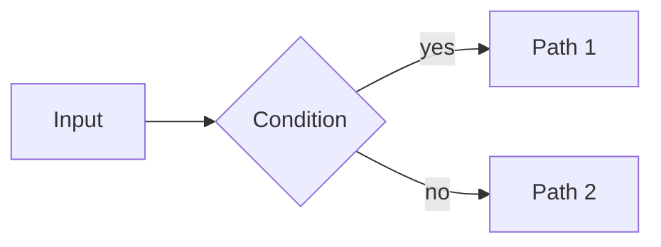

# Content Standards

Apply these standards whenever writing **issue descriptions** or **markdown documents**
(design docs, research findings, documentation, completion reports).

---

## Issue Descriptions

An issue description is a small standalone markdown document. A reader with no other
context — no access to the spec, no conversation history — must be able to read it and
understand what needs to be done and why.

### Required structure

```markdown
Brief 1–2 sentence summary of what this issue is and why it matters.

## Background

[For non-trivial issues: context a reader would need. Omit for simple leaf tasks
where the title is fully self-explanatory.]

## Success Criteria

- [ ] Criterion stated as an observable outcome, not an action
- [ ] Specific enough that a reviewer can verify it without ambiguity

## Notes

[Optional: constraints, references, open questions, links to related issues or docs.]
```

### Rules

- `## Success Criteria` is **mandatory** on every issue. Items must be verifiable — prefer
  outcomes ("function returns X for input Y") over actions ("implement X").
- Descriptions use second-level headings (`##`) — never `#` (reserved for the title if
  rendered standalone) or deeper than `###`.
- Write in present tense, imperative voice for criteria ("Returns…", "Handles…", "Emits…").
- If the issue involves math or a diagram, apply the standards below — do not defer to prose.

---

## Diagrams

**Use Mermaid for all diagrams.** Do not use ASCII art (pipes, dashes, boxes drawn with
characters). Mermaid renders natively in GitHub, GitLab, and most markdown viewers.

````markdown

````

Common diagram types:
- **flowchart** — algorithms, decision trees, data flow
- **sequenceDiagram** — protocol interactions, call sequences
- **stateDiagram-v2** — state machines, lifecycle diagrams
- **graph TD/LR** — dependency DAGs, trees
- **classDiagram** — type relationships, module structure
- **gantt** — timelines, wave plans

---

## Mathematics

**Use LaTeX for all mathematical notation.** Do not write equations as plain text
(e.g. `I = sum_k ...`). Inline and display math are both supported in GitHub-flavored
markdown and most renderers.

**Inline math** — use `$...$` for variables and short expressions within a sentence:

> The symbol energy is $E_s = \frac{1}{M}\sum_{i=0}^{M-1} x_i^2$, where $M = 2^m$.

**Display math** — use `$$...$$` (on its own line) for standalone equations:

$$
I^{\mathrm{BI}}(\mathrm{SNR}) = \frac{1}{M} \sum_{k=1}^{m} \sum_{u \in \{0,1\}}
\sum_{i \in \mathcal{I}_{k,u}} \int p_{Y|X{=}x_i}(y)\,
\log_2 \frac{2\,\sum_{j \in \mathcal{I}_{k,u}} p_{Y|X{=}x_j}(y)}
           {\sum_{x} p_{Y|X{=}x}(y)}\, dy
$$

### Rules

- Variable names appearing in text must use math mode: write $x$ not `x`, $N_0$ not `N_0`.
- Use `\text{...}` for multi-letter labels inside math: $I^{\text{BI}}$ not $I^{BI}$.
- Prefer `\frac{a}{b}` over `a/b` for display fractions.
- For summations/integrals in inline context, use `\sum` / `\int` without display limits
  to keep line height reasonable; move to display math if the expression needs full limits.
