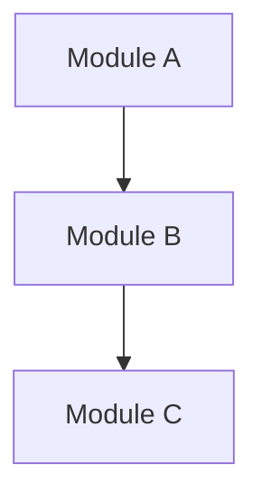

# Design Document Template

Use this template when creating design or implementation plan documents
in Workflow B3. Fill in the bracketed fields. Remove sections that do not
apply to the issue at hand.

**Formatting:** Follow `.claude/skills/jit-manage/references/content-standards.md`.
Use Mermaid (` ```mermaid `) for all diagrams. Use LaTeX (`$...$` inline, `$$...$$`
display) for all mathematical notation — never plaintext equations.

---

```markdown
# [TITLE]

**Issue:** [SHORT_ID]
**Type:** [TYPE]
**Priority:** [PRIORITY]
**Date:** [DATE]

## Problem Statement

[What problem does this solve and why is it needed? Include context that
a reader unfamiliar with the issue would need.]

## Success Criteria

[Copy verbatim from the issue description. These are the acceptance
criteria that must all be met before the issue can be closed.]

- [ ] [Criterion 1]
- [ ] [Criterion 2]

## Design

[Technical approach, architecture decisions, key trade-offs. Reference
existing code patterns and utilities where applicable.

For module/data-flow structure, prefer a Mermaid diagram:


For mathematical formulations, use LaTeX:
$$f(x) = \int_{-\infty}^{\infty} \hat{f}(\xi)\, e^{2\pi i \xi x}\, d\xi$$
]

## Implementation Steps

1. [Concrete step with file paths where applicable]
2. [Next step]

## Testing Approach

[How the implementation will be verified. Name specific tests to write,
commands to run, or manual verification steps.]

## Risks and Open Questions

- [Any unknowns, risks, or decisions deferred]
```
