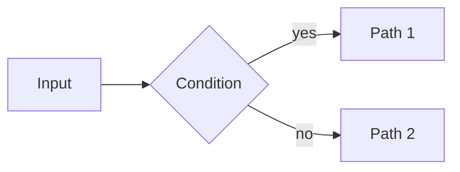

# JIT Content Standards

> **Diátaxis Type:** Reference

Canonical standards for content written into or alongside the jit tracker. Apply them
whenever writing **issue descriptions** or **markdown documents** (design docs, research
findings, documentation, completion reports).

---

## Issue Descriptions

An issue description is a small standalone markdown document. A reader with no other
context — no access to the spec, no conversation history — must be able to read it and
understand what needs to be done and why.

### Required structure

```markdown
Brief 1–2 sentence summary of what this issue is and why it matters.

## Background

[For non-trivial issues: context a reader would need. Omit for simple leaf tasks
where the title is fully self-explanatory.]

## Success Criteria

- Criterion stated as an observable outcome, not an action
- Specific enough that a reviewer can verify it without ambiguity

## Notes

[Optional: constraints, references, open questions, links to related issues or docs.]
```

### Rules

- `## Success Criteria` is **mandatory** on every issue. Items must be verifiable — prefer
  outcomes ("function returns X for input Y") over actions ("implement X").
- **Criticality markers.** Where the project distinguishes criterion maturity (the
  planning-bracket / coverage model — see
  `.agents/skills/jit-manage/references/issue-extraction-prompt.md`), prefix **every**
  criterion with `[hard]` or `[aspirational]` and a stable zero-padded `REQ-NN` id.
  A marked criterion is a plain bullet whose text opens with the marker — that exact
  shape is what registers the row as an addressable requirement item. A leading
  GitHub-style task-list checkbox (`- [ ]` / `- [x]`) ahead of the marker is
  tolerated the same way:

  ```markdown
  - [hard] REQ-01: Returns the resolved address for every configured kind
  - [ ] [hard] REQ-02: Also registers as a requirement item, checkbox and all
  ```

  **Default to `[hard]`.** Never leave a criterion unmarked or mix marked and unmarked
  items in one issue. `[hard]` criteria must be covered by a child and fail review if unmet;
  `[aspirational]` ones are amendable in-loop while the aggregate contract holds.
- Descriptions use second-level headings (`##`) — never `#` (reserved for the title if
  rendered standalone) or deeper than `###`.
- Write in present tense, imperative voice for criteria ("Returns…", "Handles…", "Emits…").
- If the issue involves math or a diagram, apply the standards below — do not defer to prose.

### Anti-patterns

The DAG is the source of truth for dependencies and containment. Do not duplicate it in markdown:

- ❌ No `## Depends on` section listing parent task IDs — `jit graph deps` is canonical.
- ❌ No `## Children` blow-by-blow that just lists child titles — a one-line summary of
  *purpose* is fine, but don't restate what `jit graph deps` already shows.
- ❌ No cross-references between sibling issues ("Same as A1", "Per A2's protocol").
  Issues must be standalone-readable; a worker reading the issue with no other context
  must understand it.
- ❌ No tracker mechanics in the description — don't instruct how to pass gates, don't
  spell out commands (`jit …`), and don't name the reviewer/checker (it is pluggable; the
  current one is incidental). That gates must pass to advance is implicit; describe the
  *work*, not how jit enforces it.

When existing repo issues conflict with these standards, this document is canonical. Apply
the standards to new issues; do not retroactively rename existing ones unless asked.

---

## Issue Titles

Titles are clean. Do not embed metadata in them:

- ❌ `<short-id>/S0: Measurement infrastructure`
- ❌ `feat(jit:abc1234): rewrite parser`
- ✅ `Measurement infrastructure`
- ✅ `Rewrite parser`

Position within an epic/story is encoded in dependency edges and labels, not in the title.

---

## Strategic Labels

For `epic:*`, `story:*`, `milestone:*`, and other strategic-grouping namespaces, use a
kebab-case slug describing the bucket — never the issue's JIT short ID:

- ❌ `epic:<short-id>`, `story:<short-id>`, `milestone:<short-id>`
- ✅ `epic:user-auth`, `story:auth-rate-limiting`, `milestone:q3-perf`

Slugs are stable across renames, navigable from any view, and meaningful when grepped
from CI output. JIT short IDs are non-descriptive
UUID prefixes.

---

## Diagrams

**Use Mermaid for all diagrams.** Do not use ASCII art (pipes, dashes, boxes drawn with
characters). Mermaid renders natively in GitHub, GitLab, and most markdown viewers.

````markdown

````

Common diagram types:
- **flowchart** — algorithms, decision trees, data flow
- **sequenceDiagram** — protocol interactions, call sequences
- **stateDiagram-v2** — state machines, lifecycle diagrams
- **graph TD/LR** — dependency DAGs, trees
- **classDiagram** — type relationships, module structure
- **gantt** — timelines, wave plans

---

## Mathematics

**Use LaTeX for all mathematical notation.** Do not write equations as plain text
(e.g. `I = sum_k ...`). Inline and display math are both supported in GitHub-flavored
markdown and most renderers.

**Inline math** — use `$...$` for variables and short expressions within a sentence:

> The mean is $\bar{x} = \frac{1}{n}\sum_{i=1}^{n} x_i$.

**Display math** — use `$$...$$` (on its own line) for standalone equations:

$$
R_{\text{avg}} = \frac{\sum_{i=1}^{n} w_i r_i}{\sum_{i=1}^{n} w_i}
$$

### Rules

- Variable names appearing in text must use math mode: write $x$ not `x`, $N_0$ not `N_0`.
- Use `\text{...}` for multi-letter labels inside math: $x_{\text{avg}}$ not $x_{avg}$.
- Prefer `\frac{a}{b}` over `a/b` for display fractions.
- For summations/integrals in inline context, use `\sum` / `\int` without display limits
  to keep line height reasonable; move to display math if the expression needs full limits.

---

## JIT-tooling pitfalls

These are JIT CLI / tooling quirks worth knowing while writing or editing issues:

- **`jit dep add` rejects transitively-redundant edges.** By default an edge that
  shadows an existing direct edge (or is itself already reachable) is rejected with
  a nonzero exit that names the offending pair; pass `--reduce` to add it and drop
  the now-redundant edge in the same operation. `jit validate` still flags any
  pre-existing "Transitive reduction violation" and `jit validate --fix` removes it.
- **`jit dep add` with multiple targets is all-or-nothing.** If any of the listed
  edges fails validation, none of them are added — even ones that would have
  succeeded alone — and the error names every rejected edge, not only the first.
- **`jit issue update --label` appends; it does not replace.** To rename a label,
  pair it with `--remove-label`: `jit issue update <id> --label new --remove-label old`.
- **Strategic-heading matching is case-tolerant.** Tooling that scans for
  `## Success Criteria` should also accept lowercase `criteria`, plus the equivalents
  documented in `jit-manage` Workflow B2 (Acceptance Criteria, Definition of Done).
  Authors of new issues use the canonical capitalization; tooling stays robust to
  legacy variants.
