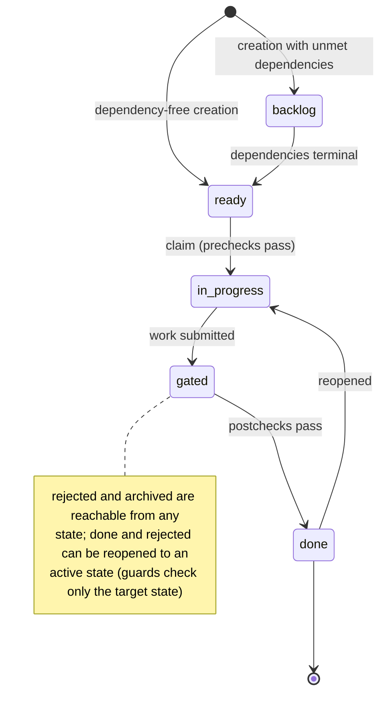

# Just-In-Time Issue Tracker

[](https://github.com/erankavija/just-in-time/actions/workflows/ci.yml)
[](https://github.com/erankavija/just-in-time/actions/workflows/docker.yml)
[](https://github.com/erankavija/just-in-time/actions/workflows/ci.yml)
[](https://github.com/erankavija/just-in-time/actions/workflows/ci.yml)
[](https://github.com/erankavija/just-in-time/actions/workflows/ci.yml)
[](#license)

**Orchestrate, automate and supervise the work of AI agents.** A repository-local CLI issue tracker that enables defining complex workflows, quality control and project planning with AI agents.

## The Problem

Working with AI agents on complex projects gives rise to a coordination problem: agents need to break down work, avoid conflicts, enforce quality, and track progress, both with and without human intervention. Traditional issue trackers are not designed for AI agents, making it difficult to manage multi-agent workflows effectively.

## Why JIT?

JIT is built from the ground up to support AI agent workflows:

- ✅ **Quality Gates**: Automated and manual checkpoints with recorded runs and structured, machine-readable findings
- 📊 **Orchestration Views**: Compact status projections, per-container rollups, and state aggregations in one command each
- 🔗 **Dependency DAG**: Cycle detection, transitive reduction, atomic edge operations, and DAG-authoritative hierarchy resolution
- 📝 **Document Lifecycle**: Link design docs, session notes, and context to issues with safe archival
- 📁 **Git-Friendly**: Repository state is plain, diffable JSON, JSONL, and TOML files; version, diff, and merge it like code
- 🤖 **Agent-First Design**: Uniform JSON envelopes, typed exit codes, short hashes, lifecycle timestamps, append-only event log
- 🔒 **Multi-Agent Coordination**: Atomic, file-locked writes keep concurrent `.jit/` updates from corrupting each other; advisory work leases (`jit claim acquire`) coordinate who holds an issue
- ⚙️ **Configurable**: Issue hierarchies, validation rules, gates, and graph templates are declared per repository

Canonical issue data lives in the `.jit/` directory within your project, versioned with git like code. Advisory lease coordination metadata is machine-local under `.git/jit/`. No external database, no cloud service, no API dependencies.

## Use Cases

- **Multi-agent software development**: A lead agent plans work and breaks it into tasks, workers claim ready tasks, quality gates enforce tests and review before completion.
- **Research projects**: Break analysis into parallel tasks, gate on peer review, preserve research context in linked documents.
- **Content generation**: Writing tasks depend on outline approval, editing depends on writing, publication gates on editor review.
- **Any workflow** where agents discover and create work dynamically.

## Quick Start

### Installation

**Pre-built binaries (Linux x64):**
```bash
wget https://github.com/erankavija/just-in-time/releases/latest/download/jit-linux-x64.tar.gz
tar -xzf jit-linux-x64.tar.gz
sudo mv jit /usr/local/bin/    # Core CLI tool
```

**From source:**
```bash
./scripts/install-jit.sh    # wraps cargo install with build provenance
```
The wrapper records the source commit in the binary so jit's stale-binary
guard can tell whether an installed binary matches the repository it
validates. A plain `cargo install --path crates/jit` also works but produces
a binary with unknown provenance, which the guard treats as unverifiable.

**Optional components:**
- `jit-server`: REST API server (http://localhost:3000). It also serves the Web UI when assets were embedded at build time or when you pass a built asset directory with `--web-dir`; see [Web UI installation](INSTALL.md#build-web-ui).
- **MCP Server**: Model Context Protocol server for AI agents (see [mcp-server/](mcp-server/))

See [INSTALL.md](INSTALL.md) for all installation options.

### Basic Usage

```bash
# Initialize in your project
jit init

# Create work; -q prints just the issue id for capture
EPIC=$(jit issue create --title "User authentication" --label type:epic --priority high -q)
TASK1=$(jit issue create --title "Create user model" --priority high -q)
TASK2=$(jit issue create --title "Implement login endpoint" --priority high -q)

# Containment: the epic depends on its children
jit dep add $EPIC $TASK1 $TASK2

# Link a design document for context
jit doc add $EPIC auth-design.md --label "Design Document"

# An agent claims a ready task and completes it
jit issue claim $TASK1 agent:worker-1
# ... do work ...
jit issue update $TASK1 --state done

# Where does everything stand?
jit query available                  # ready, unassigned work
jit issue status $EPIC $TASK2        # one line each: state, gates, unmet deps
jit issue progress $EPIC             # counts by state, done/total
```

Ordering between siblings is also a dependency edge: `jit dep add $TASK2 $TASK1 --reduce`. Edge operations are atomic and keep the graph transitively reduced. Here `--reduce` drops the epic's now-shortcut edge to `$TASK1` in the same step.

**See the [Quickstart Tutorial](docs/tutorials/quickstart.md) and [Complete Workflow Example](docs/tutorials/first-workflow.md) for full walkthroughs.**

## Core Concepts

JIT's workflow revolves around **issues** (units of work) that progress through **states** (lifecycle stages) with **dependencies** (execution order and containment) and **quality gates** (checkpoints). Labels provide advisory organization; the dependency DAG is authoritative.

### Issue Lifecycle



**States:**
- **backlog**: Has unmet dependencies
- **ready**: Every dependency is effectively terminal (done, rejected, or archived from one), available to claim
- **in_progress**: Work actively happening
- **gated**: Work complete, awaiting quality gate approval
- **done**: All gates passed, work complete; satisfies dependents. Can be reopened to an active state
- **rejected**: Closed without implementation; bypasses gates; satisfies dependents. Can be reopened
- **archived**: Parked out of active views; reachable from any state

Issues record lifecycle timestamps (first ready, claimed, done) as they transition. See [Core Model: States](docs/concepts/core-model.md#states) for transition rules.

### Dependencies Form a DAG

Issues depend on other issues. An issue is **blocked** until all its dependencies reach an effective terminal state (done, rejected, or archived from one), and containment (which epic a task belongs to) is derived from the same graph.

```bash
jit dep add <blocked-issue> <dependency-issue...>   # atomic, all-or-nothing
jit graph deps <issue>            # dependency tree with rollup summary
jit graph tree --json             # resolved parent/children/cluster per node
jit query blocked                 # what is blocked, and why
```

Cycles are rejected up front, redundant edges are refused (or reduced with `--reduce`), and `jit query divergence` reports any membership label that the DAG does not back.

### Quality Gates Enforce Standards

Gates are checkpoints that govern issue work and completion.

```bash
# Register an automated gate in this repository's gate registry
jit gate define unit-tests --title "Unit tests" --description "Test suite passes" \
  --mode auto --checker-command "cargo test"

# Require it at creation
jit issue create --title "Add feature" --gate unit-tests

# Run the gate and read the results
jit gate evaluate <issue> unit-tests      # executes the checker
jit gate status <issue> unit-tests        # latest recorded run
jit gate status <issue> unit-tests --all        # run history
jit gate status <issue> unit-tests --findings   # structured findings view
```

**Gate types:**
- **Automated**: Runs a configured checker command; the exit code decides pass/fail. Checkers can emit a machine-readable findings block (verdict, per-finding severity and file:line) that jit parses and stores with the run.
- **Manual**: Passed explicitly by a human or agent, like a checklist item.

**Gate stages:**
- **Precheck**: `jit issue claim` runs these when it moves a Ready issue into InProgress (e.g. "acknowledge TDD")
- **Postcheck**: Must pass before completion (tests, linting, reviews)

### Built for Orchestration

Machine output is first-class: `--json` throughout the day-to-day command surface, with list output in one envelope: `{"count": N, "<collection>": [...]}`. Exit codes are typed (invalid argument, not found, validation/gates, requires-git) and `jit --schema` documents each command's JSON shape and the full exit-code taxonomy.

```bash
jit issue status <id>...                 # state + gates + unmet deps, one line per issue
jit issue children <id>                  # per-child status rollup for a container
jit query count --by state --label epic:auth   # aggregate over a label bucket
jit config get type_hierarchy.types      # configuration by dotted key
jit graph export --json --full           # complete records + edges for external tooling
jit events tail                          # append-only event log, for verification
```

Structured lines in issue descriptions and project registries (requirements, invariants, rules, gates, definitions) are **addressable items** with stable qualified ids: `@/<kind>/<self-id>` project-wide (e.g. `@/invariant/event-log`, `@/rule/label-format`, `@/gate/code-review`), and `@/issue/<short-id>/<kind>/<self-id>` for a line inside an issue. `jit item show <address>` resolves one to its authoritative text; `jit item list` and `jit item search` query the set. Each kind declares its source of truth: description-embedded kinds (requirement, decision, risk) are markdown-first, while registry kinds (invariant, rule, gate) are TOML-first. The item index is always a projection.

The address is how project knowledge is cited: write each fact once in the registry or issue section that owns it, and everywhere else (docs, skills, code comments) cite its address rather than copying the text, so a single source stays authoritative. A kind may declare aliases in `[item_kinds]` config; the invariant kind declares `inv`, so `@/inv/<self-id>` is a shorthand for `@/invariant/<self-id>`. The project invariants registry (`.jit/invariants.toml`) renders into project docs via `jit invariant render`.

### Document Management

Preserve context and decisions alongside issues.

```bash
jit doc add <issue> design.md --label "Design Document"
jit doc list <issue>                          # discover linked context
jit doc check-links --scope issue:<issue>     # validate references
jit archive document <managed-document>       # dependency-aware archival preview
jit archive document <managed-document> --execute  # execute an eligible plan
```

Agents discover context from previous work, understand design decisions, and maintain institutional knowledge without external systems. See the [Document Commands Reference](docs/reference/cli-commands.md#document-commands) and [Archive planning and execution](docs/reference/cli-commands.md#archive-planning-and-execution).

### Organization with Labels

Labels provide advisory grouping on top of the authoritative DAG.

```bash
jit issue create --title "Q1 2026" --label "type:milestone"
jit issue create --title "Auth System" --label "type:epic" --label "milestone:q1-2026"

jit query strategic                              # milestones and epics
jit query all --label "epic:auth" --label "component:api"   # repeated labels AND
jit query all --label "milestone:*"              # wildcard per namespace
```

## Documentation

**→ [Full Documentation](docs/index.md)**: Tutorials, how-to guides, concepts, and reference.

Quick links:
- [Quickstart](docs/tutorials/quickstart.md): Get started in 10 minutes
- [CLI Commands](docs/reference/cli-commands.md): Complete command reference
- [Configuration](docs/reference/configuration.md): Customization options

## Configuration

JIT is configurable via `.jit/config.toml`:

- **Issue hierarchies**: Type levels (e.g. milestone → epic → story → task) drive strategic queries and hierarchy resolution
- **Validation rules**: Enforce or relax organizational requirements
- **Gates and templates**: Gate registry (`gates.toml`) and graph templates (`templates.toml`) live beside the config
- **Documentation lifecycle**: Managed, permanent, and archive-mirror paths

```toml
[version]
schema = 2

[type_hierarchy]
types = { milestone = 1, epic = 2, story = 3, task = 4 }
strategic_types = ["milestone", "epic"]

```

See the [Configuration Reference](docs/reference/configuration.md) and [Example Config](docs/reference/example-config.toml).

## Compatibility

Each repository records its format version in `.jit/index.json`; `jit` refuses an index written with a newer format version rather than misreading it ([storage source](crates/jit/src/storage/json.rs)). Run `jit version` to report the installed CLI version.

## License

MIT OR Apache-2.0
