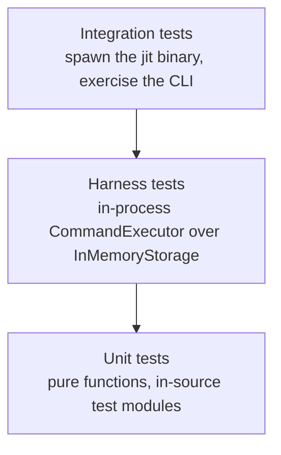

# JIT Testing Strategy

This document describes the testing approach for the Just-In-Time issue tracker. It is the
detailed elaboration of the three-layer strategy summarized in [CLAUDE.md](CLAUDE.md).

## Three Layers

Tests are organized by how much of the system they exercise and how much they cost to run.



Each layer answers a different question. Unit tests ask whether a function is correct.
Harness tests ask whether a workflow composes. Integration tests ask whether the CLI surface
matches the contract users and agents depend on.

Pick the cheapest layer that can observe the behavior you care about.

## 1. Unit Tests

Location: `#[cfg(test)] mod tests` blocks inside the source files under `crates/jit/src/`.

The crate's source is organized as directories, so unit tests sit next to the code they
cover:

```
crates/jit/src/
├── commands/       # Business logic per command (issue.rs, gate.rs, dependency.rs, …)
├── domain/         # Core types and pure query functions
├── graph/          # DAG construction, cycle detection, hierarchy resolution
├── storage/        # IssueStore implementations, locking, claim coordination
├── validation/     # Rules engine
├── document/       # Linked documents
└── query_engine/   # Query parsing and evaluation
```

Unit tests are the right home for edge cases: cycles, empty inputs, boundary values,
malformed configuration. They run in the same process as the code and report failures at the
exact function that broke.

Domain logic and graph algorithms are pure and free of I/O by design, so their tests need
nothing beyond the values they construct. Tests over `storage/` and over the command modules
that read repository configuration set up a `TempDir` and work against real files, which is
what those modules exist to do. When a behavior in `domain/` or `graph/` is hard to test
without a filesystem, that is a signal that side effects have leaked out of the storage
boundary.

Run them with `cargo test --lib`.

### Property-Based Tests

Property-based testing with [`proptest`](https://docs.rs/proptest) is current practice for
graph operations, identifier resolution, and concurrent claim coordination. Instead of
asserting one example, a property test states an invariant and lets proptest search for a
counterexample across generated inputs.

| Module | Properties covered |
| --- | --- |
| `crates/jit/src/graph/mod.rs` | Unlimited traversal equals the transitive dependency set; cycle detection reports none for DAGs |
| `crates/jit/src/graph/hierarchy.rs` | Resolution invariants hold on arbitrary DAGs; resolution is order-invariant |
| `crates/jit/src/type_hierarchy.rs` | Type-name extraction normalizes consistently; invalid labels are rejected |
| `crates/jit/src/storage/claim_coordinator_proptests.rs` | Index rebuild is idempotent and lossless; lease counts stay consistent; sequence numbers increase monotonically; concurrent claims stay exclusive |
| `crates/jit/tests/template_apply_tests.rs` | Template application yields an acyclic, transitively reduced graph; force-refresh is idempotent over nodes and edges |
| `crates/jit/tests/short_hash_tests.rs` | Any unique prefix resolves to its issue; shared prefixes are reported as ambiguous |

When proptest finds a counterexample it records the seed so the case is replayed on every
later run. Those seeds live in `crates/jit/proptest-regressions/` and, for the integration
target, in `crates/jit/tests/short_hash_tests.proptest-regressions`. Commit them: they are
regression tests.

Write a property test when you can name an invariant that must hold for all inputs. Write an
example test when you care about one specific input.

## 2. Harness Tests

Location: `crates/jit/tests/harness.rs` (the harness) and `crates/jit/tests/harness_demo.rs`
(tests that use it).

`TestHarness` backs a real `CommandExecutor` with `InMemoryStorage`, so a test drives command
logic end to end in the calling process, with issue state held in memory. Each harness gets
its own isolated storage. Repository configuration still lives on disk: `with_item_kinds()`
writes `config.toml` under the storage root.

### TestHarness API

```rust
pub struct TestHarness {
    pub executor: CommandExecutor<InMemoryStorage>,
    pub storage: InMemoryStorage,
}

impl TestHarness {
    // Setup
    pub fn new() -> Self;
    pub fn with_item_kinds(self) -> Self;

    // Issue creation helpers
    pub fn create_issue(&self, title: &str) -> String;
    pub fn create_issue_with_desc(&self, title: &str, desc: &str) -> String;
    pub fn create_issue_with_priority(&self, title: &str, priority: Priority) -> String;
    pub fn create_ready_issue(&self, title: &str) -> String;
    pub fn create_issue_with_gates(&self, title: &str, gates: Vec<String>) -> String;

    // Gate setup
    pub fn add_gate(&self, key: &str, title: &str, description: &str, auto: bool);

    // Queries
    pub fn all_issues(&self) -> Vec<Issue>;
    pub fn get_issue(&self, id: &str) -> Issue;
}

impl Default for TestHarness { /* delegates to new() */ }
```

`new()` initializes the storage and sets `JIT_TEST_MODE=1`. The helpers cover the common
shapes; anything else goes through `h.executor` (any command) or `h.storage` (direct
`IssueStore` calls).

`with_item_kinds()` writes the canonical `[item_kinds]` table into the harness repo's
`config.toml`. The engine bakes in no item kinds (`@/inv/domain-agnostic`), so a test that
exercises addressable items, item indexing, or link resolution must opt in. Call it on the
harness before creating issues:

```rust
let h = TestHarness::new().with_item_kinds();
```

### Usage

```rust
mod harness;

use harness::TestHarness;

#[test]
fn test_harness_query_ready() {
    let h = TestHarness::new();

    let ready_id = h.create_ready_issue("Ready task");
    let assigned_id = h.create_ready_issue("Assigned task");
    h.executor
        .claim_issue(&assigned_id, "agent:worker-1".to_string())
        .unwrap();

    let ready = h.executor.query_ready().unwrap();

    assert_eq!(ready.len(), 1);
    assert_eq!(ready[0].id, ready_id);
}
```

Harness tests in `harness_demo.rs` cover queries, the issue lifecycle, dependency blocking
and cycle detection, gates, container rollups, item resolution, response projections, and
behavior at scale.

Run them with `cargo test --test harness_demo`.

## 3. Integration Tests

Location: `crates/jit/tests/*.rs`, for example `crates/jit/tests/integration_test.rs` and
`crates/jit/tests/query_tests.rs`.

These spawn the compiled binary through `env!("CARGO_BIN_EXE_jit")` against a `TempDir` seeded
by `jit init`, then assert on exit status, stdout, and JSON payloads. They are the only layer
that can catch argument-parsing regressions, output-format drift, and exit-code changes.

```rust
#[test]
fn test_create_and_query() {
    let temp = setup_test_repo();
    let jit = jit_binary();

    Command::new(jit)
        .args(["issue", "create", "-t", "Task", "--priority", "high"])
        .current_dir(temp.path())
        .output()
        .unwrap();

    let output = Command::new(jit)
        .args(["query", "ready", "--json"])
        .current_dir(temp.path())
        .output()
        .unwrap();

    assert!(output.status.success());
    let json: serde_json::Value = serde_json::from_slice(&output.stdout).unwrap();
    assert!(json["issues"].is_array());
}
```

Reserve this layer for what only it can see: user-facing command contracts, `--json` envelope
shapes, flag combinations, and regression tests for reported CLI bugs. Workflow coverage
belongs in the harness layer, where it runs faster and fails more legibly.

`crates/server/tests/` holds the equivalent layer for the web UI server crate.

Run them with `cargo test --test integration_test` (or any other target name).

## Test Environment

Two environment behaviors matter when writing tests:

- **`JIT_TEST_MODE=1`** disables the git guards that global operations enforce in a live
  repository: the main-history divergence check (`enforce_main_only_operations`) and the
  claims-index validation inside `jit validate`. `TestHarness::new()` sets it. Integration
  tests that call these paths set it explicitly.
- **Doc examples** in `crates/jit/src/` compile and run under `cargo test --doc`. They are
  part of the contract, so an example that constructs a `CommandExecutor` must keep working.

## Running Tests

```bash
# Everything (unit + doc + harness + integration, all workspace crates)
cargo test

# Unit tests only, fastest feedback
cargo test --lib

# Harness tests
cargo test --test harness_demo

# One integration target
cargo test --test integration_test
cargo test --test query_tests

# Doc examples
cargo test --doc

# A single test by name
cargo test test_harness_query_ready

# With stdout captured from passing tests
cargo test -- --nocapture

# Serialized, for debugging cross-test interference
cargo test -- --test-threads=1
```

Lint and format alongside tests. Both must be clean before a commit:

```bash
cargo clippy --workspace --all-targets   # zero warnings required
cargo fmt --all -- --check
```

## Writing Tests

### Practice

1. **Write the test first.** TDD is the project default.
2. **Start at the cheapest layer.** Unit test the function, harness test the workflow, and
   add an integration test only when the CLI surface itself is the thing under test.
3. **Reach for a property test when you can state an invariant.** DAG operations, id
   resolution, and idempotent rebuilds are the recurring candidates.
4. **Assert specifically.** Compare against expected values rather than checking that a
   collection is non-empty.

### Naming

Test names follow `test_<function>_<scenario>` and describe the scenario in full:

```rust
// Names that tell you what broke
test_query_ready_returns_only_unassigned()
test_add_dependency_rejects_cycle()
test_gate_blocks_until_passed()

// Names that make you open the file
test_query()
test_dependencies()
test_it_works()
```

### Assertions

```rust
// Specific
assert_eq!(ready.len(), 1);
assert_eq!(ready[0].id, expected_id);

// Vague
assert!(ready.len() > 0);
assert!(ready.contains(&expected));
```

### Adding Coverage for a New Command

Take the layers in order and stop as soon as the behavior is pinned down. Sketched here for a
hypothetical `jit issue defer` that returns an issue to `Backlog`:

```rust
// 1. Unit test, in the command's module under crates/jit/src/commands/
#[test]
fn test_defer_issue_returns_issue_to_backlog() {
    let executor = CommandExecutor::new(InMemoryStorage::new());
    // ...assertions on the returned value and on storage...
}

// 2. Harness test, in crates/jit/tests/harness_demo.rs
#[test]
fn test_harness_defer_issue() {
    let h = TestHarness::new();
    let id = h.create_ready_issue("Task");

    h.executor.defer_issue(&id).unwrap();

    assert_eq!(h.get_issue(&id).state, State::Backlog);
}

// 3. Integration test, only if the CLI surface is user-facing
#[test]
fn test_cli_defer_issue() {
    let temp = setup_test_repo();
    let output = Command::new(jit_binary())
        .args(["issue", "defer", "abc12345"])
        .current_dir(temp.path())
        .output()
        .unwrap();

    assert!(output.status.success());
}
```

## See Also

- [CLAUDE.md](CLAUDE.md) - architecture, layer boundaries, coding conventions
- [.github/copilot-instructions.md](.github/copilot-instructions.md) - TDD guidelines and functional style
- [docs/reference/jit-content-standards.md](docs/reference/jit-content-standards.md) - content standards for docs and issues
- [crates/jit/tests/harness.rs](crates/jit/tests/harness.rs) - the harness implementation
- [crates/jit/tests/harness_demo.rs](crates/jit/tests/harness_demo.rs) - worked harness examples
