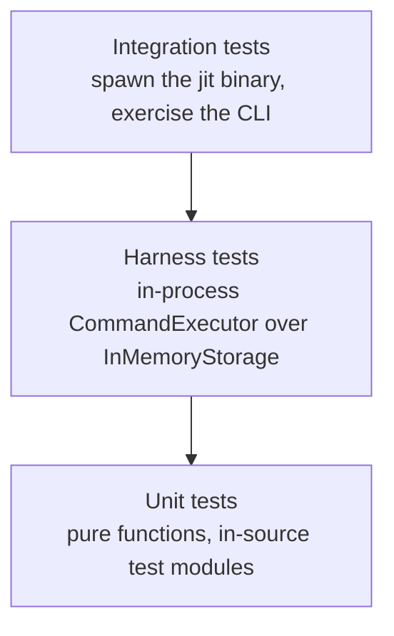

# JIT Testing Strategy

This document describes the testing approach for the Just-In-Time issue tracker. It is the
detailed elaboration of the three-layer strategy summarized in [AGENTS.md](../AGENTS.md).

## Three Layers

Tests are organized by how much of the system they exercise and how much they cost to run.



Each layer answers a different question. Unit tests ask whether a function is correct.
Harness tests ask whether a workflow composes. Integration tests ask whether the CLI surface
matches the contract users and agents depend on.

Pick the cheapest layer that can observe the behavior you care about.

## 1. Unit Tests

Location: `#[cfg(test)] mod tests` blocks inside the source files under `crates/jit/src/`.

The crate's source is organized as directories, so unit tests sit next to the code they
cover:

```
crates/jit/src/
├── commands/       # Business logic per command (issue.rs, gate.rs, dependency.rs, …)
├── domain/         # Core types and pure query functions
├── graph/          # DAG construction, cycle detection, hierarchy resolution
├── storage/        # IssueStore implementations, locking, claim coordination
├── validation/     # Rules engine
├── document/       # Linked documents
└── query_engine/   # Query parsing and evaluation
```

Unit tests are the right home for edge cases: cycles, empty inputs, boundary values,
malformed configuration. They run in the same process as the code and report failures at the
exact function that broke.

Domain logic and graph algorithms are pure and free of I/O by design, so their tests need
nothing beyond the values they construct. Tests over `storage/` and over the command modules
that read repository configuration set up a `TempDir` and work against real files, which is
what those modules exist to do. When a behavior in `domain/` or `graph/` is hard to test
without a filesystem, that is a signal that side effects have leaked out of the storage
boundary.

Run them with `cargo test --lib`.

### Property-Based Tests

Property-based testing with [`proptest`](https://docs.rs/proptest) is current practice for
graph operations, identifier resolution, and concurrent claim coordination. Instead of
asserting one example, a property test states an invariant and lets proptest search for a
counterexample across generated inputs.

| Module | Properties covered |
| --- | --- |
| `crates/jit/src/graph/mod.rs` | Unlimited traversal equals the transitive dependency set; cycle detection reports none for DAGs |
| `crates/jit/src/graph/hierarchy.rs` | Resolution invariants hold on arbitrary DAGs; resolution is order-invariant |
| `crates/jit/src/domain/type_taxonomy.rs` | Type-name extraction normalizes consistently; invalid labels are rejected |
| `crates/jit/src/storage/claim_coordinator_proptests.rs` | Index rebuild is idempotent and lossless; lease counts stay consistent; sequence numbers increase monotonically; concurrent claims stay exclusive |
| `crates/jit/tests/fast_docs_templates/template_apply_tests.rs` | Template application yields an acyclic, transitively reduced graph; force-refresh is idempotent over nodes and edges |
| `crates/jit/tests/fast_issue/readiness_coherence_tests.rs` | Stored readiness agrees with the graph-derived blocked predicate after any sequence of dependency additions and removals |
| `crates/jit/tests/fast_issue/short_hash_tests.rs` | Any unique prefix resolves to its issue; shared prefixes are reported as ambiguous |

When proptest finds a counterexample it records the seed so the case is replayed on every
later run. Those seeds live in `crates/jit/proptest-regressions/` and, for the integration
target, in `crates/jit/tests/fast_issue/short_hash_tests.proptest-regressions` (beside the
suite module that owns the property). Commit them: they are regression tests.

Write a property test when you can name an invariant that must hold for all inputs. Write an
example test when you care about one specific input.

## 2. Harness Tests

Location: `crates/jit/tests/common/harness.rs` (the harness, below Cargo's auto-discovery
boundary so it is never its own test target) and the in-process suites that use it, such as
`crates/jit/tests/fast_docs_templates/harness_demo.rs`.

`TestHarness` backs a real `CommandExecutor` with `InMemoryStorage`, so a test drives command
logic end to end in the calling process, with issue state held in memory. Each harness gets
its own isolated storage. Repository configuration still lives on disk: `with_item_kinds()`
writes `config.toml` under the storage root.

### TestHarness API

```rust
pub struct TestHarness {
    pub executor: CommandExecutor<InMemoryStorage>,
    pub storage: InMemoryStorage,
}

impl TestHarness {
    // Setup
    pub fn new() -> Self;
    pub fn with_item_kinds(self) -> Self;

    // Issue creation helpers
    pub fn create_issue(&self, title: &str) -> String;
    pub fn create_issue_with_desc(&self, title: &str, desc: &str) -> String;
    pub fn create_issue_with_priority(&self, title: &str, priority: Priority) -> String;
    pub fn create_ready_issue(&self, title: &str) -> String;
    pub fn create_issue_with_gates(&self, title: &str, gates: Vec<String>) -> String;

    // Gate setup
    pub fn add_gate(&self, key: &str, title: &str, description: &str, auto: bool);

    // Queries
    pub fn all_issues(&self) -> Vec<Issue>;
    pub fn get_issue(&self, id: &str) -> Issue;
}

impl Default for TestHarness { /* delegates to new() */ }
```

`new()` initializes the storage and sets `JIT_TEST_MODE=1`. The helpers cover the common
shapes; anything else goes through `h.executor` (any command) or `h.storage` (direct
`IssueStore` calls).

`with_item_kinds()` writes the canonical `[item_kinds]` table into the harness repo's
`config.toml`. The engine bakes in no item kinds (`@/inv/domain-agnostic`), so a test that
exercises addressable items, item indexing, or link resolution must opt in. Call it on the
harness before creating issues:

```rust
let h = TestHarness::new().with_item_kinds();
```

### Usage

A suite that runs in-process declares the shared harness once in its `main.rs`
(`#[path = "../common/harness.rs"] mod harness;`); each test module inside the suite reaches
it through the crate root:

```rust
use crate::harness::TestHarness;

#[test]
fn test_harness_query_ready() {
    let h = TestHarness::new();

    let ready_id = h.create_ready_issue("Ready task");
    let assigned_id = h.create_ready_issue("Assigned task");
    h.executor
        .claim_issue(&assigned_id, "agent:worker-1".to_string())
        .unwrap();

    let ready = h.executor.query_ready().unwrap();

    assert_eq!(ready.len(), 1);
    assert_eq!(ready[0].id, ready_id);
}
```

Harness tests in `fast_docs_templates/harness_demo.rs` cover queries, the issue lifecycle,
dependency blocking and cycle detection, gates, container rollups, item resolution, response
projections, and behavior at scale.

Run the whole suite with `cargo test --test fast_docs_templates`, or just the demo module
with `cargo test --test fast_docs_templates harness_demo`.

## 3. Integration Tests

Integration tests are grouped into cohesive **suites**. Each suite is one directory under
`crates/jit/tests/<suite>/` whose `main.rs` declares its test files as modules, so Cargo
links and runs one executable per suite instead of one per file. Suites divide by execution
model and subsystem:

| Suite | Execution model | Covers |
| --- | --- | --- |
| `fast_issue`, `fast_rules`, `fast_docs_templates` | in-process (`CommandExecutor`) | issue lifecycle/graph, rules/labels/config, documents/templates |
| `cli_issue`, `cli_gate`, `cli_query_graph`, `cli_item_validate`, `cli_repo_workflow` | CLI subprocess | the `jit` binary's command surface by area |
| `scratch_build` | heavyweight | tests that build scratch `cargo` projects (the merged-tree gate self-test), plus the build-footprint budget-checker fixtures and the manifest/source policy checks |

The `cargo-ci` gate runs `scripts/rust-build-budget.sh` as a `budget` step after
its test step, on warm Cargo artifacts, pointing it with `--root` at the
workspace that run compiled. The checker derives the integration-test
target count and unique active test-executable bytes from `cargo metadata` and
`cargo test --workspace --no-run --message-format=json`, and asserts the debug
profile, gate incremental, and dependency-feature policies, failing the gate when
a budget or policy is exceeded (jit:3f73423b). Its inputs are injectable
(`--metadata-json`, `--artifacts-json`, `--root`), so
`scratch_build/rust_build_budget_checker_tests.rs` exercises each failure mode
with synthetic JSON and sparse executables — no compilation. See "4. Build
Footprint Budget" below for the exact budgets, the build-profile and
dependency-feature policy they check, and how to diagnose a failure.

`scratch_build/merged_tree_gate_verification_tests.rs` runs
`scripts/cargo-ci-selftest.sh`, which is what keeps the `cargo-ci` gate honest as
the post-merge check (jit:3019eacd). A textually clean merge can leave `main`
broken in ways no per-issue gate saw, so the worktree dispatch protocol runs the
gate on the merged tree. The self-test seeds four merges in throwaway git repos —
one healthy, one declaring a deleted module, one whose `#[cfg(test)]` caller lost
an argument, one that compiles and fails at test time — runs the shipped
`scripts/cargo-ci.sh` against each, and asserts the verdict its build-and-test
step reports. The last two also assert that `cargo build --workspace` still
succeeds on the same tree: that is why a build-only merge check was vacuous, and
substituting one makes the self-test fail. Every fixture is a dependency-free
two-module crate with its own target directory, so the whole self-test costs
seconds and never rebuilds this workspace.

Shared helpers live below Cargo's auto-discovery boundary in `crates/jit/tests/common/`, so
they never surface as their own test targets. Add a new integration case to the file that
matches its subsystem, or add a module file plus a `mod` line in the suite's `main.rs`.

The CLI suites spawn the compiled binary through `env!("CARGO_BIN_EXE_jit")` against a
`TempDir` seeded by `jit init`, then assert on exit status, stdout, and JSON payloads. They
are the only layer that can catch argument-parsing regressions, output-format drift, and
exit-code changes.

```rust
#[test]
fn test_create_and_query() {
    let temp = setup_test_repo();
    let jit = jit_binary();

    Command::new(jit)
        .args(["issue", "create", "-t", "Task", "--priority", "high"])
        .current_dir(temp.path())
        .output()
        .unwrap();

    let output = Command::new(jit)
        .args(["query", "ready", "--json"])
        .current_dir(temp.path())
        .output()
        .unwrap();

    assert!(output.status.success());
    let json: serde_json::Value = serde_json::from_slice(&output.stdout).unwrap();
    assert!(json["issues"].is_array());
}
```

Reserve this layer for what only it can see: user-facing command contracts, `--json` envelope
shapes, flag combinations, and regression tests for reported CLI bugs. Workflow coverage
belongs in the harness layer, where it runs faster and fails more legibly.

`crates/server/tests/` holds the equivalent layer for the web UI server crate, organized
the same way: one `server_integration` suite whose `main.rs` declares the modules, covering
both the in-process API cases and the real-process shutdown cases that spawn the compiled
`jit-server` binary through `env!("CARGO_BIN_EXE_jit-server")`.

Run a whole suite with `cargo test --test cli_repo_workflow`, or filter to one module or case
with `cargo test --test cli_repo_workflow integration_test`.

## 4. Build Footprint Budget

The Rust workspace's test topology, build profiles, and dependency features are bounded by
the enforced `@/inv/bounded-rust-build-footprint` project invariant.

### Budgets

`cargo-ci`'s `budget` step (`scripts/rust-build-budget.sh`) enforces three budgets on every
gate run. Two are derived from `cargo metadata` and `cargo test --workspace --no-run
--message-format=json` rather than a `target/` directory scan (stale per-hash artifacts
there cannot describe the current build): a bounded count of integration-test targets and
a bounded total of unique active test-executable bytes. The third is derived from the measured
nextest-plus-doctest suite duration, which `scripts/cargo-ci.sh` passes in as
`--test-suite-ms`: the suite must finish under `MAX_TEST_SUITE_SECONDS`. All three
constants are declared once, in the script's own header comment
(`MAX_INTEGRATION_TARGETS`, `MAX_EXECUTABLE_BYTES`, `MAX_TEST_SUITE_SECONDS`); read them
there rather than assuming any has changed. All three are derived from a measurement of
this tree and a stated headroom rule in
[dev/benchmarks/rust-build-budgets/README.md](benchmarks/rust-build-budgets/README.md); see
[dev/benchmarks/suite-enforcement-4b7c06d0/README.md](benchmarks/suite-enforcement-4b7c06d0/README.md)
for the measured margin this budget leaves on an idle and a contended host. "5. Inherent
Test Costs" below attributes what the measured suite duration is spent on.

The measurement is taken over a target the `suite-build` step has already built and read
into the page cache, so a fresh target directory and a warm one reach the same verdict and
a duration failure is about the tree (jit:0708d692). Getting there took removing a hidden
compilation from inside the clock: a nextest setup script selected its Cargo packages
differently from the gate's build, which resolved a second feature-unification variant of
the dependency graph and compiled it mid-suite. Anything the suite runs from inside the
clock must therefore reuse the workspace build's resolution, which
`scratch_build/build_profile_policy_tests.rs` asserts over the setup scripts
`.config/nextest.toml` declares. What remains state-dependent is the suite's own per-target
fixture construction, worth about 4 s on its first run in a target directory; see
[dev/benchmarks/cold-warm-verdict-0708d692/README.md](benchmarks/cold-warm-verdict-0708d692/README.md)
for the cold and warm figures behind all of this. Note that re-measuring needs `--force`,
since `jit gate evaluate` reuses a recorded verdict over unchanged declared inputs and
`target/` is not one of them.

A fourth budget — at most 10 GiB for the complete fresh validation target directory — is the
acceptance threshold the benchmark protocol below validates against once per build-topology
change, not re-checked on every gate run: a full clean rebuild on every gate invocation would
defeat the point of the interactive incremental-build policy described next. See
[dev/benchmarks/rust-build-efficiency/report.md](benchmarks/rust-build-efficiency/report.md)
("Comparison and acceptance thresholds") for the acceptance criteria and the measured
comparison they were applied to; "Benchmarking a build-topology change" below describes the
harness that produces both.

### Build profile and dependency-feature policy

- **Debug info** — `[profile.dev]`/`[profile.test]` in the workspace `Cargo.toml` set
  `debug = "line-tables-only"`: enough for line-number backtraces on a local failure, without
  embedding the full debugger payload (type info, macro expansions) that dominates a test
  executable's size.
- **Dependency optimization** — `[profile.dev.package."*"]` sets `opt-level = 1`, so third-party
  crates are compiled optimized while workspace crates keep the debug profile's compile times.
  Level 1 is the measured selection over level 2, which ran no faster and cost about twice the
  build regression.
  The suite runs dependency code far more often than it compiles it: its CPU profile is spread
  across SHA-256 over whole build artifacts, TOML parsing, and JSON serialization, none of which
  is workspace code. A package override changes no other profile key, so `debug-assertions` and
  `overflow-checks` still hold everywhere. The measured build cost of the override, against the
  matched unoptimized arm and both fixed 25% ceilings, is in
  [dev/benchmarks/dependency-profile-6d10e5d4/](benchmarks/dependency-profile-6d10e5d4/).
- **Incremental compilation** — both profiles also state `incremental = true` explicitly, for
  ordinary interactive development, where the cost amortizes across many rebuilds of the same
  tree. `scripts/cargo-ci.sh` overrides this with `CARGO_INCREMENTAL=0` for every gate step,
  since a gate run compiles once and exits with no later rebuild to amortize against; a
  dedicated `incremental-state` gate step then fails the run on what this run's own
  compilation added to the target directory, measured against the baseline the
  `incremental-baseline` step records before the first compilation. Incremental state another
  process wrote is reported and ignored — an editor's rust-analyzer writes that directory
  continuously and repopulates it within seconds of it being cleared — so there is nothing to
  clear before a gate run.
- **Shared compiler cache** — when `sccache` is on `PATH`, `scripts/cargo-ci.sh` exports it as
  `RUSTC_WRAPPER` unless a wrapper is already set. Set `CARGO_CI_NO_SCCACHE=1` for a diagnostic
  run that must bypass the cache. Opting an existing target directory into a wrapper changes
  Cargo fingerprints, so remove its stale artifacts first if disk headroom is limited.
- **Host-wide serialization** — gate and benchmark builds default to the shared
  `${XDG_RUNTIME_DIR:-/tmp}/cargo-ci.lock`, allowing Cargo-heavy work in adjacent repositories
  to queue instead of competing for CPU and causing timeout-sensitive tests to become noisy.
  `CARGO_CI_BUILD_LOCK` overrides the path when an isolated host needs a different convention.
  Run compilation-heavy focused checks as `./scripts/cargo-ci.sh --cargo test ...` (or
  `--cargo clippy ...`) so they reuse the lock and cache without running the broad gate. Invoke
  `./scripts/cargo-ci.sh` without arguments only when the complete gate is intended.
- **Dependency features** — `jsonschema` (`crates/jit/Cargo.toml`) sets
  `default-features = false`: repository schemas only use local fragment refs
  (`#/types/Priority`, `#/types/State`), so the crate's remote `$ref`-resolution
  infrastructure is never exercised. `ureq` (the remote-document-access client) also sets
  `default-features = false` and enables exactly `rustls` and `gzip`: one deliberately chosen
  TLS backend, plus the content-decoding feature the remote-document path relies on.

### Benchmarking a build-topology change

`scripts/benchmark-rust-build.sh` is the committed benchmark harness; see its header comment
for the full contract and environment overrides. Each clean or rebuild sample runs in a
freshly created, isolated `CARGO_TARGET_DIR`, removed immediately after that sample's
measurements are recorded, so no sample inherits another's warm build state. It collects at
least three clean samples (zero-warning `cargo clippy --workspace --all-targets -- -D
warnings` followed by `cargo test --workspace --no-run`, each timed) and at least three
rebuild samples (the same sequence as setup, then one fixed, reversible, comment-only probe
line appended to `crates/jit/src/lib.rs`, a second timed `test --no-run` for the incremental
rebuild, and the file restored byte-for-byte and verified against `git show HEAD:...`), and
reports the median of each. Run it with `./scripts/benchmark-rust-build.sh`; see
[dev/benchmarks/rust-build-efficiency/report.md](benchmarks/rust-build-efficiency/report.md)
for the story's own recorded comparison and acceptance verdict.

### Diagnosing a budget-checker failure

On failure, `scripts/rust-build-budget.sh` reports the observed value, the limit, and a
corrective area for each violated check on stderr. Read that diagnostic before adding a new
test target or dependency feature:

- **Integration-test targets over budget** — a new top-level `crates/jit/tests/*.rs` file was
  added. Add the case to an existing suite's module instead (see the shared-helpers and
  case-placement guidance in "3. Integration Tests" above), or fold it into the suite whose
  execution model and subsystem it matches.
- **Active test-executable bytes over budget** — the linked executables grew past the
  ceiling. Check whether a new dependency pulled in unexpectedly large debug info, or whether
  the debug/incremental profile policy above regressed, before adding more test code to the
  same suites.
- **Profile drift** — `[profile.dev]` or `[profile.test]` in the workspace `Cargo.toml` no
  longer sets `debug = "line-tables-only"`. Restore it.
- **Incremental-policy drift** — `scripts/cargo-ci.sh` no longer exports
  `CARGO_INCREMENTAL=0` before its first step. Restore the export.
- **Remote resolver reintroduction** — `jsonschema` in `crates/jit/Cargo.toml` no longer sets
  `default-features = false`, or explicitly re-enables a `resolve-*`/`tls-*` feature. Disable
  default features (and drop the explicit feature) again.
- **Duplicate TLS backend / TLS backend drift** — `ureq` enables `native-tls` alongside
  `rustls`, or no longer enables `rustls`. Keep exactly the `rustls` feature (plus `gzip`).

## 5. Inherent Test Costs

`dev/benchmarks/suite-profile.json` (contract `suite-timing-evidence`) records a warm
per-test duration, `warm_duration_ms`, for every test nextest ran in the default
`cargo nextest run --workspace` invocation — 4,481 tests at revision `cb8d42c3`, cache
state warm, one warmup run ahead of the measured run, `ceil(exec_time_seconds * 1000)`.
Nothing in that profile is close to either enforced ceiling: the slowest single test,
5,324 ms, sits well under the per-test bound in
[`.config/nextest.toml`](../.config/nextest.toml), and the whole default run sits
comfortably under `MAX_TEST_SUITE_SECONDS` — see
[dev/benchmarks/suite-enforcement-4b7c06d0/README.md](benchmarks/suite-enforcement-4b7c06d0/README.md)
for the exact measured margin. The tables below attribute cost, not risk: for every test whose
measured cost is a direct consequence of the property it proves — a real subprocess, a
real transaction round trip through the storage journal, real filesystem publication,
genuine concurrency, or a property-based search over many generated cases — this names it,
its warm cost, and the mechanism. A cost this attribution does not find a mechanism for
belongs to a reducibility issue, not to this table.

### Real subprocess timing and signal semantics

Each of these spawns a real child process or binds a real socket and proves a bounded-time
property that cannot resolve faster than the real timeout, signal, or process teardown it
exercises: `test_execute_command_timeout` spawns `sleep 10` under a shorter enforced
timeout; `test_timeout_kills_process_group_and_does_not_deadlock` spawns a background
grandchild that would otherwise hold a pipe open for 60s; `test_start_server_bounds_a_child_that_neither_serves_nor_exits`
bounds a real child to a 2s startup window; `test_jit_server_shutdown_force_closes_a_stalled_connection_and_exits_zero`
and `test_open_registered_stalled_connection_waits_for_the_stopped_accept_loop` drive a
real `jit-server` process through a stalled connection and its shutdown deadline;
`test_command_exit_codes_broken_pipe_emits_141` writes a 2 MiB description so a real child
`jit` process is still writing to stdout when the parent closes its read end after the
first byte, forcing a real `SIGPIPE` — twice, once plain and once `--json`;
`test_unrelated_process_still_respects_bootstrap_lock` holds a real file lock in-process
while a competing real `jit` subprocess is denied it; `test_is_serving_on_port_reports_a_bound_socket_nobody_serves_as_not_serving`
must wait out a real connect-without-accept before it can conclude no one answered.

| Test | Warm (ms) |
| --- | ---: |
| `graceful_shutdown_tests::test_jit_server_shutdown_force_closes_a_stalled_connection_and_exits_zero` | 5,324 |
| `commands::serve::tests::test_start_server_bounds_a_child_that_neither_serves_nor_exits` | 2,012 |
| `command_exit_code_projection_tests::test_command_exit_codes_broken_pipe_emits_141` | 1,219 |
| `graceful_shutdown_tests::test_open_registered_stalled_connection_waits_for_the_stopped_accept_loop` | 1,121 |
| `nested_checker_recovery_test::test_unrelated_process_still_respects_bootstrap_lock` | 1,057 |
| `gate_execution::tests::test_execute_command_timeout` | 1,018 |
| `gate_execution::tests::test_timeout_kills_process_group_and_does_not_deadlock` | 1,014 |
| `commands::serve::tests::test_is_serving_on_port_reports_a_bound_socket_nobody_serves_as_not_serving` | 519 |

### Property-based tests over real production code paths

proptest's default is 256 generated cases per property. `crates/jit/src/storage/claim_coordinator_proptests.rs`
runs its concurrency and rebuild properties against a real on-disk store, with real file
locks and real threads per case. It sets `with_fsync(false)`: these properties verify index
and rebuild invariants rather than crash durability, so the cost is the file and lock work
itself. Its own comment records that each case creates a temp directory and does several
real filesystem writes and reads, so the default 256 cases pushed these tests to seconds —
and to minutes with fsync on — and it caps the file-touching properties at 64 cases while
leaving the pure-logic ones at the default. `crates/jit/tests/fast_docs_templates/template_apply_tests.rs`
and `crates/jit/tests/fast_issue/readiness_coherence_tests.rs` run each case through a
fresh in-memory `TestHarness`/`CommandExecutor` pipeline rather than a synthetic
data structure, and cap at 48 cases for the same reason. Both caps trade case count for
staying inside the per-test budget without dropping to example-based coverage; see those
files' own configuration comments for the exact rationale.

| Test | Warm (ms) |
| --- | ---: |
| `storage::claim_coordinator::proptests::prop_concurrent_different_issues_succeed` | 3,008 |
| `storage::claim_coordinator::proptests::prop_concurrent_claims_exclusive` | 2,931 |
| `template_apply_tests::prop_apply_yields_transitively_reduced_graph` | 2,430 |
| `template_apply_tests::prop_force_refresh_is_idempotent_on_node_and_edge_set` | 2,420 |
| `template_apply_tests::prop_apply_always_yields_acyclic_dag` | 2,262 |
| `readiness_coherence_tests::prop_stored_readiness_agrees_with_the_blocked_predicate_after_dependency_edits` | 1,732 |
| `storage::claim_coordinator::proptests::prop_sequence_numbers_monotonic` | 1,247 |
| `storage::claim_coordinator::proptests::prop_lease_count_invariant` | 571 |
| `storage::claim_coordinator::proptests::prop_no_data_loss_in_rebuild` | 524 |

### CLI subprocess publishing durable state

Each of these spawns the compiled `jit` binary, once or several times in the same test
(a dry run, an apply, then a second apply to prove the no-op; a plain-text and a `--json`
report of the same drift), to pack, apply, validate, or repair a profile package on disk.
`dev/benchmarks/test-suite-performance-4b7c06d0.json` (contract `transaction-benchmark-evidence`)
measures exactly that publication cost at the packaging fixture's model limits — 511
assets, 1,023 distinct source directories: a `profile add` against an existing data root
carries a median 249 ms and 1,046 directory fsync calls, and a `profiled init` publication
carries a median 419 ms. `test_profile_pack_and_add_carry_a_package_at_the_model_limits`
exercises that fixture directly through the CLI; the rest of this table pays the same
durable-publication machinery at smaller scale, often several times per test.

| Test | Warm (ms) |
| --- | ---: |
| `profile_cli_tests::test_profile_reapply_repairs_missing_and_stale_default_schemas_before_no_op` | 4,095 |
| `profile_acceptance_tests::test_profile_fresh_init_and_existing_apply_are_equivalent_without_git` | 2,894 |
| `profile_cli_tests::test_profile_apply_dry_run_is_read_only_then_apply_is_exact_no_op` | 2,828 |
| `derived_state_repair_tests::test_cli_validate_fix_repairs_each_owned_class_and_preserves_authored_bytes` | 2,635 |
| `profile_acceptance_tests::test_offline_public_cli_profile_reaches_implementation_ready_breakdown` | 2,129 |
| `profile_cli_tests::test_profile_pack_and_add_carry_a_package_at_the_model_limits` | 2,058 |
| `derived_state_repair_tests::test_cli_validate_fix_repairs_mode_only_profile_drift` | 2,002 |
| `profile_cli_tests::test_validate_plain_and_json_report_installed_profile_drift` | 1,575 |
| `derived_state_repair_tests::test_cli_validate_fix_preserves_permission_error_classification` | 1,370 |
| `profile_cli_tests::test_profiled_init_publishes_valid_repo_and_applied_inventory` | 1,328 |
| `profile_acceptance_tests::test_profile_application_contributes_workflow_invariants_to_scaffolded_registry` | 1,245 |
| `profile_cli_tests::test_existing_partial_profiled_init_atomically_completes_neutral_scaffold` | 1,224 |
| `repo_discovery_tests::test_explicit_non_ancestor_data_root_keeps_worktree_assets_at_cwd` | 980 |
| `repo_discovery_tests::test_nested_profile_init_keeps_data_and_assets_in_child` | 944 |
| `repo_discovery_tests::test_relative_data_root_override_keeps_worktree_assets_at_discovered_root` | 939 |
| `label_hierarchy_e2e_test::test_label_hierarchy_complete_workflow` | 824 |
| `workflow_tests::test_workflow_complex_epic` | 710 |
| `cross_substrate_generality_tests::test_all_four_kinds_through_one_generic_path` | 621 |
| `derived_state_repair_tests::test_cli_validate_fix_profile_provenance_failures_are_zero_write` | 543 |
| `failure_probe_fixture::test_failure_probe_fixture_reports_nonzero_status_for_each_setup_class` | 532 |

### Command-module tests publishing a full profile package's owned surface

These stay below the CLI subprocess boundary — unit tests over `commands::`, `storage::`,
and `profile::` modules that, per "1. Unit Tests" above, work against a real
`TempDir`-backed store because that is what those modules exist to do. Each applies,
composes, or repairs a real, complete profile package's owned surface (schemas, registries,
rules, generated docs) rather than a one-file fixture, so the cost scales with the
package's real owned-materialization count. `test_pack_package_archive_stays_within_its_bounds_for_a_package_at_the_model_limits`
packs the same `write_package_tree_at_model_limits` fixture the transaction benchmark's
`profile_pack`/`profile_add` measurements above use, directly through the library rather
than the CLI. `test_validate_fix_repairs_owned_materializations_in_memory` is the one
exception to the real-filesystem description above — it seeds an equivalently complete
in-memory repository fixture instead — but the property proven, and the cost, is the same:
repair correctness across every owned class of a real profile package.

| Test | Warm (ms) |
| --- | ---: |
| `commands::validate::tests::test_validate_fix_repairs_every_owned_materialization_and_preserves_unowned_files` | 1,967 |
| `commands::validate::tests::test_validate_fix_repairs_owned_materializations_in_memory` | 1,923 |
| `commands::profile::tests::test_apply_profile_selection_recovers_an_obsolete_default_schema_atomically` | 1,856 |
| `commands::profile::tests::test_apply_profile_package_jit_dogfood_composes_what_applying_both_packages_composes` | 1,830 |
| `derived_state_repair_tests::test_harness_validate_fix_repairs_each_owned_class_and_preserves_authored_bytes` | 1,568 |
| `profile::repository_package::tests::test_profile_applies_to_neutral_repo_and_ordinary_renderers_consume_config` | 1,460 |
| `derived_state_repair_tests::test_harness_validate_fix_repairs_mode_only_profile_drift` | 1,444 |
| `commands::init::tests::test_fresh_profile_init_records_every_package_of_the_selected_closure` | 1,222 |
| `commands::init::tests::test_fresh_profile_init_publishes_complete_valid_repo_without_git` | 1,199 |
| `commands::init::tests::test_reinit_profiled_over_existing_root_is_idempotent_unchanged` | 996 |
| `commands::profile::tests::test_apply_workflow_profile_to_bare_repository_contributes_hierarchy_rules` | 909 |
| `commands::profile::tests::test_profile_preparation_retries_when_final_proposed_closure_expands` | 892 |
| `profile::package_archive::tests::test_pack_package_archive_stays_within_its_bounds_for_a_package_at_the_model_limits` | 529 |

### Genuine concurrency: real threads, timers, and watchers

`test_concurrent_fresh_profile_init_publishes_one_coherent_repository` races real threads
through real initialization; `test_concurrent_writer_observes_failed_apply_preimage_then_publishes`
does the same across a real write barrier. `test_rebuild_index_filters_expired_leases`
acquires a lease with a real 1s TTL and sleeps 1.1s past it, because expiry is a real clock
property, not a mocked one. `test_start_watching_ignores_events_jsonl` starts a real
filesystem watcher and sleeps past its own real debounce window; it is compiled once into
the `jit-server` crate's library test target and once into its binary target, so it runs —
and is measured — twice.

| Test | Warm (ms) |
| --- | ---: |
| `commands::init::tests::test_concurrent_fresh_profile_init_publishes_one_coherent_repository` | 1,213 |
| `storage::claim_coordinator::tests::test_rebuild_index_filters_expired_leases` | 1,111 |
| `template_apply_atomicity_tests::test_concurrent_writer_observes_failed_apply_preimage_then_publishes` | 610 |
| `watcher::tests::test_start_watching_ignores_events_jsonl` (library target) | 513 |
| `watcher::tests::test_start_watching_ignores_events_jsonl` (binary target) | 512 |

### Data-driven tests bundling many real scenarios

`test_all_steering_scenarios` drives every scenario fixture under
`crates/jit/tests/fixtures/steering/` from one test function by design — its own doc
comment records the choice, made so adding a scenario needs a fixture, not a Rust change —
and each scenario runs multiple real `jit` subprocess invocations.
`test_cargo_ci_selftest_fails_seeded_broken_merges` is already explained in full under
"3. Integration Tests" above: it runs the real `scripts/cargo-ci.sh` against four seeded
merge fixtures, two of which also run a real `cargo build --workspace`.

| Test | Warm (ms) |
| --- | ---: |
| `steering_scenarios::test_all_steering_scenarios` | 2,519 |
| `merged_tree_gate_verification_tests::test_cargo_ci_selftest_fails_seeded_broken_merges` | 2,491 |

### Deliberate at-scale tests

`test_harness_scales_with_many_issues` is the harness suite's own worked example of
behavior-at-scale coverage (see "2. Harness Tests" above): 100 real issue creations through
the full command pipeline. `test_resolve_ambiguous` creates real issues the same way until
two land on the same 4-character id prefix — the property under test, ambiguous-prefix
rejection, cannot be observed without a real collision.
`test_lifecycle_precheck_captures_large_history_and_ignores_root_clutter` writes 257 real
gate-run directories to disk, plus a real named pipe via `mkfifo` alongside a stray file and
symlink, to prove the precheck's history capture holds at a real page-scale size rather than
a handful of examples, and ignores clutter mixed into the same directory that is not itself
a run.

| Test | Warm (ms) |
| --- | ---: |
| `harness_demo::test_harness_scales_with_many_issues` | 2,154 |
| `short_hash_tests::test_resolve_ambiguous` | 1,969 |
| `commands::gate_check::tests::test_lifecycle_precheck_captures_large_history_and_ignores_root_clutter` | 517 |

### Repeated real gate execution

`commands::gate_check::tests` runs gates defined with `GateChecker::Exec`, so every gate
check in these tests spawns a real shell command. Proving history compaction,
re-execution-on-change, and priority ordering takes several such checks per test — seven in
the slowest of the group, which repeats a failing gate to exercise history compaction.

| Test | Warm (ms) |
| --- | ---: |
| `commands::gate_check::tests::test_run_history_is_compacted_to_one_latest_run` | 1,848 |
| `commands::gate_check::tests::test_check_gate_reexecutes_for_new_same_issue_run_but_not_unrelated_run` | 550 |
| `commands::gate_check::tests::test_check_gate_run_history_keeps_only_latest_legacy_run` | 547 |
| `commands::gate_check::tests::test_check_all_gates_respects_priority_order` | 541 |
| `commands::gate_check::tests::test_check_all_gates_stable_sort_same_priority` | 537 |
| `commands::gate_check::tests::test_check_gate_executes_again_after_declared_inputs_change` | 515 |

### Excluded from the default run

Seven tests are marked `#[ignore]` and never run in the default `cargo nextest run
--workspace`, so `suite-profile.json` does not cover them; `cargo nextest run --workspace
--run-ignored ignored-only` at `cb8d42c3` measures them directly:

| Test | Warm (ms) |
| --- | ---: |
| `lock_tests::test_timeout_on_lock_contention` | 308 |
| `lock_tests::test_exclusive_lock_blocks_shared_locks` | 209 |
| `lock_tests::test_lock_released_on_drop` | 7 |
| `lock_tests::test_try_lock_non_blocking` | 7 |
| `lock_tests::test_exclusive_lock_prevents_concurrent_writes` | 7 |
| `lock_tests::test_shared_locks_allow_concurrent_reads` | 7 |
| `worktree_cli_tests::test_validate_branch_drift_detects_drifted_branch` | 6 |

Combined they run in 317 ms wall clock. That cost is not inherent, and the exclusion is not
a performance decision: the six `lock_tests` are TDD placeholders written before
`FileLocker` existed, with their real bodies commented out. Three still assert, but only
against the scaffolding that replaced the lock calls — a counter incremented for thread 0
only, a counter every thread increments, two booleans set unconditionally — and three
assert nothing, their assertions commented out along with the bodies. The seventh, the
branch-drift test, has an empty body. None of the seven can fail (jit:abe2c2bd).

## Test Environment

Two environment behaviors matter when writing tests:

- **`JIT_TEST_MODE=1`** disables the git guards that global operations enforce in a live
  repository: the branch-drift check against main history (`enforce_main_only_operations`) and the
  claims-index validation inside `jit validate`. `TestHarness::new()` sets it. Integration
  tests that call these paths set it explicitly.
- **Selected doc examples** in `crates/jit/src/` compile and run under `cargo test --doc`.
  Keep them for non-obvious workflows and material contracts, not as one-per-public-API
  coverage: each snippet carries a separate rustdoc compilation cost. When an example is
  warranted, it is part of the contract and must keep working.

## Running Tests

```bash
# Everything (unit + doc + harness + integration, all workspace crates)
cargo test

# Unit tests only, fastest feedback
cargo test --lib

# Harness tests
cargo test --test fast_docs_templates harness_demo

# One integration suite, or one module within it
cargo test --test cli_repo_workflow
cargo test --test cli_query_graph query_tests

# Doc examples
cargo test --doc

# A single test by name
cargo test test_harness_query_ready

# With stdout captured from passing tests
cargo test -- --nocapture

# Serialized, for debugging cross-test interference
cargo test -- --test-threads=1
```

### Nextest

The repository provisions cargo-nextest 0.9.133 for the workspace suite. Install that
version with:

```bash
cargo install cargo-nextest --locked --version 0.9.133
```

Run the workspace suite with nextest, then run doctests as a separate substep because
nextest does not cover them:

```bash
cargo nextest run --workspace
cargo test --doc --workspace
```

The committed nextest policy is documented in
[`.config/nextest.toml`](../.config/nextest.toml), which also pins a per-test ceiling: a
slow-timeout of 10s, terminated after a second 10s grace period, so any single test that
runs past 20s fails the run rather than hanging it.

Lint and format alongside tests. Both must be clean before a commit:

```bash
cargo clippy --workspace --all-targets   # zero warnings required
cargo fmt --all -- --check
```

## Writing Tests

### Practice

1. **Write the test first.** TDD is the project default.
2. **Start at the cheapest layer.** Unit test the function, harness test the workflow, and
   add an integration test only when the CLI surface itself is the thing under test.
3. **Reach for a property test when you can state an invariant.** DAG operations, id
   resolution, and idempotent rebuilds are the recurring candidates.
4. **Assert specifically.** Compare against expected values rather than checking that a
   collection is non-empty.

### Naming

Test names follow `test_<function>_<scenario>` and describe the scenario in full:

```rust
// Names that tell you what broke
test_query_ready_returns_only_unassigned()
test_add_dependency_rejects_cycle()
test_gate_blocks_until_passed()

// Names that make you open the file
test_query()
test_dependencies()
test_it_works()
```

### Assertions

```rust
// Specific
assert_eq!(ready.len(), 1);
assert_eq!(ready[0].id, expected_id);

// Vague
assert!(ready.len() > 0);
assert!(ready.contains(&expected));
```

### Adding Coverage for a New Command

Take the layers in order and stop as soon as the behavior is pinned down. Sketched here for a
hypothetical `jit issue defer` that returns an issue to `Backlog`:

```rust
// 1. Unit test, in the command's module under crates/jit/src/commands/
#[test]
fn test_defer_issue_returns_issue_to_backlog() {
    let executor = CommandExecutor::new(InMemoryStorage::new());
    // ...assertions on the returned value and on storage...
}

// 2. Harness test, in crates/jit/tests/fast_docs_templates/harness_demo.rs
#[test]
fn test_harness_defer_issue() {
    let h = TestHarness::new();
    let id = h.create_ready_issue("Task");

    h.executor.defer_issue(&id).unwrap();

    assert_eq!(h.get_issue(&id).state, State::Backlog);
}

// 3. Integration test, only if the CLI surface is user-facing
#[test]
fn test_cli_defer_issue() {
    let temp = setup_test_repo();
    let output = Command::new(jit_binary())
        .args(["issue", "defer", "abc12345"])
        .current_dir(temp.path())
        .output()
        .unwrap();

    assert!(output.status.success());
}
```

## See Also

- [AGENTS.md](../AGENTS.md) - architecture, layer boundaries, coding conventions
- [.github/copilot-instructions.md](../.github/copilot-instructions.md) - TDD guidelines and functional style
- [docs/reference/jit-content-standards.md](../docs/reference/jit-content-standards.md) - content standards for docs and issues
- [crates/jit/tests/common/harness.rs](../crates/jit/tests/common/harness.rs) - the harness implementation
- [crates/jit/tests/fast_docs_templates/harness_demo.rs](../crates/jit/tests/fast_docs_templates/harness_demo.rs) - worked harness examples
