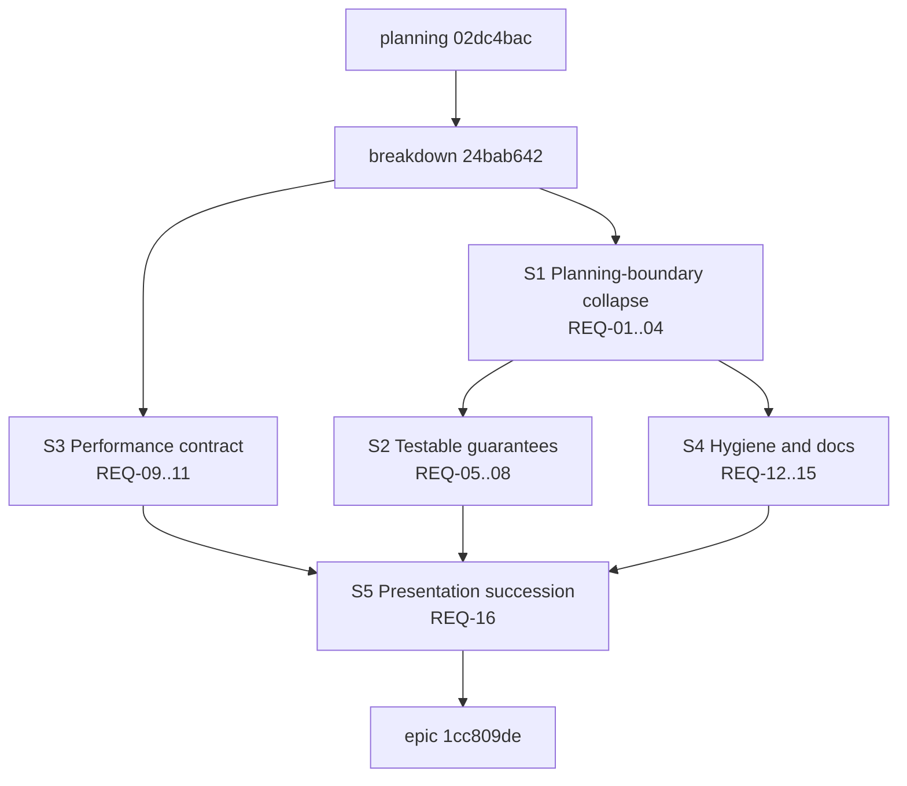

# Repository-state quality hardening — plan

**Issue:** 1cc809de (epic), planning node 02dc4bac
**Type:** epic
**Priority:** high
**Date:** 2026-07-23

## Problem Statement

The repository-materialization epic (cdc840ad) delivered a sound transaction kernel whose strongest guarantees are narrated rather than enforced. The adversarial audit `dev/studies/cdc840ad-audit-2026-07-23.md` graded the implementation B+ and its maintainability C+, and recorded:

- **Boundary drift** — the claimed single planning boundary is seven public plan-producing entry points across five error types; the capture/plan/apply/retry protocol is hand-copied at 29 sites with 65 conflict arms and 30 bespoke convergence messages (audit B2-1, B2-2, B2-3).
- **Latent panics** — two hand-aligned 4-variant action enums bridged by `unreachable!` on the publication path, after a journal exists (B2-4).
- **Narrated guarantees** — no property-based coverage of plan derivation, cutover guards implemented as source-text greps, no multi-threaded contention coverage, stringly path literals with a hand-maintained repair-path mirror (B2-5, B2-6, B2-8, B3).
- **Unmaintained performance claims** — every published timing is a single self-attested measurement; `apply_bulk_update` retains the O(n)-sessions pathology; 693 zero-byte lock files accumulate; nobody has profiled the ~1s per-session cost (C2).
- **Hygiene debt** — dead and over-broad exports, test-only API in the shipped surface, a 3,900-line inline test module, review-round test names, no contributor architecture doc, five advisory-debt items (B2-7, B2-9…B2-12).
- **Presentation debt** — nine falsifiable errors in the showcase deck and an epic-completion "independent" review performed by the building agent itself (A1, A2, A4).

This epic makes the implementation match its claims and makes every published claim trace to a repository artifact.

## Success Criteria

Copied from the epic; the audit finding IDs in parentheses are the traceability map.

- [hard] REQ-01: A single mutation-session combinator owns the capture/plan/apply/retry protocol — retry bound, conflict classification, and terminal conflict error live in one place, and command modules contain no hand-written retry loops or per-site conflict arms. (B2-1, C3-1)
- [hard] REQ-02: Every public plan-producing entry point returns a typed error, and producer failures reach exit-code mapping through typed variants with no stringify-then-downcast round-trip. (B2-2, B2-3, C3-2)
- [hard] REQ-03: Journal-action extraction in the transaction kernel is total; the publication path contains no `unreachable!` panic sites. (B2-4, C3-3)
- [hard] REQ-04: The initialize and profile-application request variants flow through the shared plan-identity tail, or a recorded decision item states why they are exempt. (C3-4)
- [hard] REQ-05: Property-based tests cover plan-hash determinism under action reordering and managed-document splice round-trip. (B2-5, C4-1)
- [hard] REQ-06: The cutover guard enforces publisher visibility restrictions instead of source-text substring matching, while the deleted-module assertions are retained. (B2-6, C4-2)
- [hard] REQ-07: Multi-threaded contention tests cover concurrent mutation-session opening and active-layout reentry rejection. (B3, C4-3)
- [hard] REQ-08: Well-known repository file paths are compile-time constants, and repair-path test coverage derives from the repair planner's own declaration rather than a hand-maintained list. (B2-8, C4-4)
- [hard] REQ-09: A checked-in benchmark harness records repeated runs with machine and cache-state metadata as artifacts at a stable path, and every published timing claim traces to such an artifact. (C2-1)
- [hard] REQ-10: Session-open budget tests bound bulk update to eligible work, matching the guarantee already tested for automatic transitions. (A2-4, C2-2)
- [hard] REQ-11: The per-session cost profile is recorded as an artifact, and the lock-hygiene approach chosen from that profile is implemented so zero-byte lock files no longer accumulate without bound. (C2-3, C2-4)
- [hard] REQ-12: Test-only failure-injection and fixture surfaces are feature-gated out of the default library surface, dead exports are removed, and public items with no external consumer are demoted to crate visibility. (B2-7, B2-10, C5-1, C5-2)
- [hard] REQ-13: The repository-state store's inline test module lives in a sibling file, and tests named after review rounds follow the `test_<function>_<scenario>` convention. (B2-9, B2-11, C5-3, C5-4)
- [hard] REQ-14: A contributor architecture document covers the repository-state/materialization subsystem, and the stale storage-abstraction pointer in the core system design document is swept. (B2-12, C5-5)
- [hard] REQ-15: The five advisory-debt items recorded at the predecessor epic's completion are cleared from the codebase and documentation. (C5-6)
- [hard] REQ-16: A corrected successor presentation of the repository-materialization story exists in which every falsifiable claim traces to a repository artifact, and the predecessor deck is archived with a tombstone pointing to the successor and the audit. (A1, A2, A4, C1)

## Design

### Story structure

Five stories, each a checkpoint for its criterion cluster per the story-as-checkpoint pattern. Implementation children live under their story; downstream stories depend on the story node, not on individual tasks.

*(Arrows read "is prerequisite work for"; in jit the DAG encodes them as the downstream issue depending on the upstream one, with the epic depending on every story.)*

- **S3 Performance contract** starts immediately and in parallel with S1: its first task profiles the per-session cost, which feeds the lock-hygiene decision (epic D-7). The benchmark harness (REQ-09) is a new `scripts/` entry with artifacts under a stable repository path; budget tests (REQ-10) mirror `test_check_auto_transitions_opens_sessions_only_for_eligible_backlog_issues`.
- **S1 Planning-boundary collapse** is the highest-leverage change: a `with_mutation_session` combinator in `crates/jit/src/commands/mod.rs` retiring the 29 copy-paste retry loops; typed errors for the two `anyhow` plan producers (`finalize_gate_registry_edit`, `finalize_archive_execution`) and the six `anyhow` producer signatures in `materialize.rs`; total journal-action extraction in `file_transaction.rs`; folding `Initialize`/`ApplyProfile` into the shared plan-identity tail or recording the exemption decision.
- **S2 Testable guarantees** follows S1 so property tests and contention tests target the settled surface: proptest for `plan_hash` reorder-invariance and splice round-trip, visibility-based cutover guard, contention tests over `open_mutation_session` and `ActiveLayoutTracker`, `VirtualPath` associated consts with `repair_paths()` derived from the repair planner's declaration.
- **S4 Hygiene and docs** follows S1 because the public-surface demotions (REQ-12) must not race the boundary refactor: feature-gate `FailurePoint`/`TransactionFailureInjector`/`test_support`, delete `issue_draft`, demote the 13 over-broad exports, split the store's inline test module, rename review-round tests, write the contributor architecture doc, sweep `core-system-design.md`, clear the five advisory-debt items.
- **S5 Presentation succession** is last: the corrected retelling deck re-derives its figures from S3's artifacts and the final tree, and the predecessor deck moves to the archive with a tombstone.

### Decisions pinned at epic creation

Recorded in the epic description (D-1…D-7): single-epic scope, milestone v1.0 with the production-readiness epic depending on this one, deck succession (corrected retelling only, predecessor archived with tombstone), audit imported as the evidence source, independent holistic review as a required epic gate, benchmark harness as a maintained contract, and lock-hygiene design chosen from profiling data before fan-out.

### Gate assignment

Per repository convention, gates are need-based per footprint: Rust-touching children carry `cargo-ci` and `code-review`; documentation children carry `doc-review`; stories carry the same baseline as their children's footprint. The epic carries `repo-validate` and `holistic-review` (independent reviewer distinct from the building agent, epic D-5).

## Implementation Steps

1. **Planning node 02dc4bac** — finalize this document, including the lock-hygiene decision once S3's profiling task design is settled (the decision itself may be recorded as amendable pending the first profile artifact); pass plan review.
2. **Breakdown node 24bab642** — decompose into the five stories and their children with `satisfies:REQ-NN` coverage labels; pass coverage preview and breakdown review.
3. **Fan-out** — S3 and S1 in parallel; S2 and S4 after S1; S5 after S2, S3, S4.
4. **Epic completion** — all stories done, `repo-validate` and the independent holistic review pass.

## Testing Approach

- Combinator refactor (S1) is behavior-preserving: the existing 35 failure-injection points and ~20 interruption tests must pass unchanged; conflict-classification unit tests move to the combinator.
- New property tests (S2) per `@/inv/semantic-test-assertions`; contention tests use real threads over a shared store, not injection.
- Budget tests (S3) count session opens via the existing `TransactionFailurePoint` probe, deterministic and machine-independent.
- Harness artifacts (S3) record n>1 runs, machine identity, and warm/cold state; the successor deck (S5) cites artifact paths for every number.
- Suite topology respects `@/inv/bounded-rust-build-footprint`: the store test split moves a module to a sibling file without adding integration-test targets.

## Risks and Open Questions

- **Lock-hygiene design is deliberately open** until the profile artifact exists (epic D-7); the breakdown encodes it as a decision-then-implement pair inside S3.
- **REQ-04 may end in a recorded exemption** if `Initialize`/`ApplyProfile` genuinely cannot share the plan-identity tail; the exit is a decision item, not silent scope drift.
- **Boundary refactor blast radius** — the combinator touches 16 command files; mitigated by landing it as mechanical per-file conversions behind an unchanged public behavior contract, verified by the untouched interruption suite.
- **Feature-gating test support** (REQ-12) changes how CI invokes tests; `cargo-ci` and `cargo-ci-features` gate configurations must be checked against the new feature before the change lands.
- **Timing figures are machine-specific**; the harness records machine identity rather than pretending portability, and the deck quotes figures with their recorded environment.
