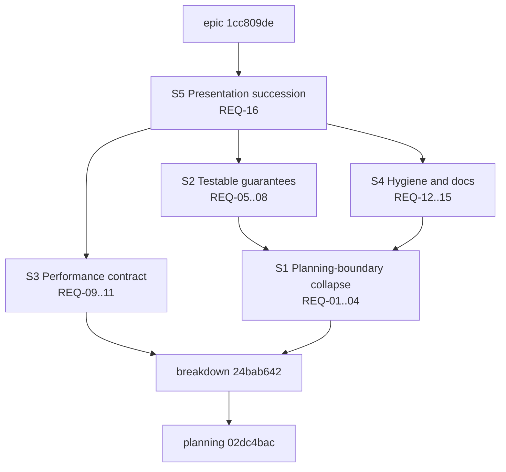

# Repository-state quality hardening — plan

**Issue:** 1cc809de (epic), planning node 02dc4bac
**Type:** epic
**Priority:** high
**Date:** 2026-07-23

## Problem Statement

The repository-materialization epic (cdc840ad) delivered a sound transaction kernel whose strongest guarantees are narrated rather than enforced. The adversarial audit `dev/studies/cdc840ad-audit-2026-07-23.md` graded the implementation B+ and its maintainability C+, and recorded:

- **Boundary drift** — the claimed single planning boundary is seven public plan-producing entry points across five error types; the capture/plan/apply/retry protocol is hand-copied at 29 sites with 65 conflict arms and 30 bespoke convergence messages (audit B2-1, B2-2, B2-3).
- **Latent panics** — two hand-aligned 4-variant action enums bridged by `unreachable!` on the publication path, after a journal exists (B2-4).
- **Narrated guarantees** — no property-based coverage of plan derivation, cutover guards implemented as source-text greps, no multi-threaded contention coverage, stringly path literals with a hand-maintained repair-path mirror (B2-5, B2-6, B2-8, B3).
- **Unmaintained performance claims** — every published timing is a single self-attested measurement; `apply_bulk_update` retains the O(n)-sessions pathology; 693 zero-byte lock files accumulate; nobody has profiled the ~1s per-session cost (C2).
- **Hygiene debt** — dead and over-broad exports, test-only API in the shipped surface, a 3,900-line inline test module, review-round test names, no contributor architecture doc, five advisory-debt items (B2-7, B2-9…B2-12).
- **Presentation debt** — nine falsifiable errors in the showcase deck and an epic-completion "independent" review performed by the building agent itself (A1, A2, A4).

This epic makes the implementation match its claims and makes every published claim trace to a repository artifact.

## Success Criteria

Copied from the epic; the audit finding IDs in parentheses are the traceability map.

- [hard] REQ-01: A single mutation-session combinator owns the capture/plan/apply/retry protocol — retry bound, conflict classification, and terminal conflict error live in one place, and command modules contain no hand-written retry loops or per-site conflict arms. (B2-1, C3-1)
- [hard] REQ-02: Every public plan-producing entry point returns a typed error, and producer failures reach exit-code mapping through typed variants with no stringify-then-downcast round-trip. (B2-2, B2-3, C3-2)
- [hard] REQ-03: Journal-action extraction in the transaction kernel is total; the publication path contains no `unreachable!` panic sites. (B2-4, C3-3)
- [hard] REQ-04: The initialize and profile-application request variants flow through the shared plan-identity tail, or a recorded decision item states why they are exempt. (C3-4)
- [hard] REQ-05: Property-based tests cover plan-hash determinism under action reordering and managed-document splice round-trip. (B2-5, C4-1)
- [hard] REQ-06: The cutover guard enforces publisher visibility restrictions instead of source-text substring matching, while the deleted-module assertions are retained. (B2-6, C4-2)
- [hard] REQ-07: Multi-threaded contention tests cover concurrent mutation-session opening and active-layout reentry rejection. (B3, C4-3)
- [hard] REQ-08: Well-known repository file paths are compile-time constants, and repair-path test coverage derives from the repair planner's own declaration rather than a hand-maintained list. (B2-8, C4-4)
- [hard] REQ-09: A checked-in benchmark harness records repeated runs with machine and cache-state metadata as artifacts at a stable path, and every published timing claim traces to such an artifact. (C2-1)
- [hard] REQ-10: Session-open budget tests bound bulk update to eligible work, matching the guarantee already tested for automatic transitions. (A2-4, C2-2)
- [hard] REQ-11: The per-session cost profile is recorded as an artifact, and the lock-hygiene approach chosen from that profile is implemented so zero-byte lock files no longer accumulate without bound. (C2-3, C2-4)
- [hard] REQ-12: Test-only failure-injection and fixture surfaces are feature-gated out of the default library surface, dead exports are removed, and public items with no external consumer are demoted to crate visibility. (B2-7, B2-10, C5-1, C5-2)
- [hard] REQ-13: The repository-state store's inline test module lives in a sibling file, and tests named after review rounds follow the `test_<function>_<scenario>` convention. (B2-9, B2-11, C5-3, C5-4)
- [hard] REQ-14: A contributor architecture document covers the repository-state/materialization subsystem, and the stale storage-abstraction pointer in the core system design document is swept. (B2-12, C5-5)
- [hard] REQ-15: The five advisory-debt items recorded at the predecessor epic's completion are cleared from the codebase and documentation. (C5-6)
- [hard] REQ-16: A corrected successor presentation of the repository-materialization story exists in which every falsifiable claim traces to a repository artifact, and the predecessor deck is archived with a tombstone pointing to the successor and the audit. (A1, A2, A4, C1)

## Design

### Story structure

Five stories, each a checkpoint for its criterion cluster per the story-as-checkpoint pattern. Implementation children live under their story; downstream stories depend on the story node, not on individual tasks.



*(Every arrow in this document — mermaid and prose "→" alike — reads "depends on", matching the direction of a jit dependency edge. The epic depends only on the sink story S5; the graph stays transitively reduced, which jit enforces on edge insertion.)*

- **S3 Performance contract** starts immediately and in parallel with S1: the lock-hygiene decision is already made from the planning-time profile (PD-1, epic D-7), so S3 implements it, builds the benchmark harness, and fixes the bulk-update session budget. The benchmark harness (REQ-09) is a new `scripts/` entry with artifacts under a stable repository path; budget tests (REQ-10) mirror `test_check_auto_transitions_opens_sessions_only_for_eligible_backlog_issues`.
- **S1 Planning-boundary collapse** is the highest-leverage change: a mutation-session retry contract in `crates/jit/src/commands/mod.rs` retiring the 30 copy-paste retry loops; typed errors for the two `anyhow` plan producers (`finalize_gate_registry_edit`, `finalize_archive_execution`) and the six `anyhow` producer signatures in `materialize.rs`; total journal-action extraction in `file_transaction.rs`; folding `Initialize`/`ApplyProfile` into the shared plan-identity tail or recording the exemption decision. The combinator and error designs are pinned in the two subsections below.
- **S2 Testable guarantees** follows S1 so property tests and contention tests target the settled surface: proptest for `plan_hash` reorder-invariance and splice round-trip, visibility-based cutover guard, contention tests over `open_mutation_session` and `ActiveLayoutTracker`, `VirtualPath` associated consts with `repair_paths()` derived from the repair planner's declaration.
- **S4 Hygiene and docs** follows S1 because the public-surface demotions (REQ-12) must not race the boundary refactor: feature-gate `FailurePoint`/`TransactionFailureInjector`/`test_support`, delete `issue_draft`, demote the 13 over-broad exports, split the store's inline test module, rename review-round tests, write the contributor architecture doc, sweep `core-system-design.md`, clear the four non-lock advisory-debt items (the zero-byte-lock item is cleared by S3's lock-hygiene implementation).
- **S5 Presentation succession** is last: the corrected retelling deck re-derives its figures from S3's artifacts and the final tree, and the predecessor deck moves to the archive with a tombstone.

### Mutation-session combinator (S1)

The audited surface is 30 hand-copied retry loops across 16 command files (29 `for _ in 0..8` plus `template.rs:176` under `TEMPLATE_RETRY_LIMIT`), 65 `RetryableConflict` match arms, and 30 bespoke "did not converge" messages. The sites split into **22 pure single-session** loops and **8 self-managed multi-session** loops that, within one attempt, release a preflight session and then acquire a `.git/jit` claims guard, run an external checker subprocess, or revalidate a cross-reopen invariant before opening the apply session (`dependency.rs:260,396`; `issue.rs:552`; `gate.rs:1357`; `mod.rs:2141,2353`; `gate_check.rs:909`; `template.rs:176`). A combinator-held session cannot serve the second group: it would hold `.repo-write.lock` across `claims_mutation_guard` (inverting today's lock order into a deadlock hazard) and across multi-second subprocess runs.

Resolution: one owner of the retry contract, two entry points that share it, and a session never held across between-session work:

```rust
const MUTATION_SESSION_RETRY_LIMIT: usize = 8;

#[derive(Debug, thiserror::Error)]
#[error("{operation} did not converge after {attempts} capture conflicts")]
pub struct MutationSessionExhausted { operation: &'static str, attempts: usize }

enum AttemptOutcome<T> { Done(T), Retry }

// The single apply-conflict classifier — the only place a RetryableConflict on
// apply is interpreted; no command module writes an arm.
fn classify_apply<T>(outcome: Result<impl Sized, RepositoryStateStoreError>, value: T)
    -> Result<AttemptOutcome<T>>;

// Retry driver: owns the bound and terminal error, holds NO session, so a
// closure may open/release sessions, take a claims guard, and run a subprocess
// between them exactly as today.
fn with_mutation_attempts<T>(operation: &'static str,
    attempt: impl FnMut() -> Result<AttemptOutcome<T>>) -> Result<T>;

// Session-passed convenience for the 22 pure single-session sites: opens one
// fresh recovered session per attempt, applies Apply(plan) via classify_apply.
enum SessionStep<T> { Apply(MaterializationPlan, T), Done(T), Retry }

fn with_mutation_session<S: RepositoryStateStore, T>(
    store: &S, layout: &RepositoryLayout, operation: &'static str,
    attempt: impl FnMut(&mut dyn RepositoryMutationSession) -> Result<SessionStep<T>>,
) -> Result<T>;  // implemented on top of with_mutation_attempts + classify_apply
```

`with_mutation_attempts` owns the bound (one named constant replacing every literal `8`) and the typed terminal `MutationSessionExhausted` (replacing all 30 bespoke bails; mapped to today's generic exit code in `main.rs`). `classify_apply` owns apply-conflict classification. Capture-conflict classification stays centralized in the existing `capture_*` helpers that already fold `RetryableConflict` into `Ok(None)`; the few sites with inline capture arms (`gate_check.rs:746,770`; `claim.rs:214`; `config.rs:317`) adopt a shared `capture_or_retry` helper. The 22 single-session sites use `with_mutation_session` (read-only sites return `Done`); `claim.rs:212` is a free function, which is why the entry points are free `fn`s generic over the store. The 8 self-managed sites use `with_mutation_attempts` directly, keeping their present structure — preflight, release, guard/subprocess, the same cross-reopen equality checks as today (`template.rs:217-227`, `mod.rs:2430-2444,2491`, `gate_check.rs:997`) returning `Retry`, then apply via `classify_apply`; guards are closure locals whose `Drop` runs after apply, preserving lock ordering byte-for-byte. Result: no `for _ in 0..8` and no per-site conflict arm anywhere in command modules — REQ-01 holds for all 30 sites with no exemptions. The refactor is behavior-preserving: the 35 failure-injection points and ~20 interruption tests pass unchanged, and conflict-classification unit tests move onto `classify_apply`/`with_mutation_attempts`.

### Typed-error boundary (S1)

Producer failures currently stringify through `RepositoryStateError::Producer(String)` (34 sites; sink at `repository_state/mod.rs:583` via `format!("{error:#}")`) and are re-typed by the runtime downcast chain `projection_producer` (`mod.rs:590-598`); the exit-code boundary (`main.rs:104,783`) probes with `downcast_ref` + `is_profile_target_conflict`. The design removes every string and every downcast:

1. New `ProducerError` (thiserror), each variant carrying its typed source: `MissingCapture(&'static str)`, `MalformedUtf8(#[from] FromUtf8Error)`, `UnknownProjection(String)`, `UnknownKind { projection, kind }`, plus transparent `#[from]` for `CaptureError`, `RepositoryLayoutError`, `ConfigurationDeclarationError`, `InvariantConfigError`, `ItemError`, `RuleConfigError`, `ProjectionError`, `ManagedDocumentError`. The six `materialize.rs` producers (`read_text`, `assemble_config`, `assemble_config_from_declarations`, `render_capture_closure`, `validate_capture_closure`, `compose_configured_projections`) **and** the two internal `anyhow` leaves — `render_projection_body` (`projection_render.rs:62`, whose injected read-closure becomes `FnMut(&str) -> Result<Option<String>, ProducerError>`) and `validate_proposed_layout` (`artifact_classifier.rs:515`) — change to `Result<_, ProducerError>`.
2. `RepositoryStateError::Producer(String)` becomes `Producer(#[from] ProducerError)`. `fn producer`, `fn projection_producer`, `fn is_profile_target_conflict`, and the twelve `.map_err(…producer…)` sites (`mod.rs:405,415,428,431,436,520,612,617,645,648,678,683`) are deleted in favor of `?`. The inline `Producer(format!)` sites (`mod.rs:501,508`) become `ProducerError::ConfigParse` and a new `RepositoryStateError::Overlay(#[from] OverlayError)`. The profile-application producer (`profile_apply.rs`, whose `Producer(String)`/`producer` sites live at `:397,:435,:469,:678` plus the `profile_registry_error` helper) joins the same retyping with profile-specific variants — `ProfileRegistryNotFile { target }`, `ProfileRegistryParse { target, #[source] source }`, `ProfileContributionConflict { identity, registry }` — and `compose_default_ruleset`, already typed, stays as is.
3. `finalize_gate_registry_edit` returns `Result<_, RepositoryStateError>` via a new `GateRegistryEditError { MissingEdit, MultipleEdits, DeclarationMismatch }` variant, with `#[from]` variants added for its eight `?`-propagated leaf classes (`MutationError`, `GateDeclarationError`, `OverlayError`, `SeedError` join the existing `Delta`/`PlanHash`/`Layout`).
4. `finalize_archive_execution` returns `Result<_, RepositoryStateError>` via a new `ArchiveExecutionError` enumerating the archive-specific classes found at their construction sites — `MissingDestination`, `MissingContentIdentity`, `ContentIdentityChanged`, `NonFileSource{role}`, `UnsafeOccupant{role}`, `MissingPlannedDocument`, `RelinkTargetsPinned`, `RelinkStale`, `MissingCapturedIssue`, `MalformedIssueJson(#[source] serde_json::Error)`, `IssueIdMismatch`, `CapturedIssueCacheLost`, `MissingChangedIssue` — plus `#[from]` for its typed leaves (`EventLogError`, `PlanError`, the retyped `validate_proposed_layout`); shared leaves reach exit mapping via the `RepositoryStateError` `#[from]` variants.
5. `main.rs::error_to_exit_code` replaces the two downcast probes with one **exhaustive** match over `RepositoryStateError` (no `_ =>` arm): projection/managed-document/profile-conflict/ambiguous-ownership/gate-registry-edit/archive-execution variants → validation-failed exit; capture/parse producer variants → generic exit; layout variants → invalid-argument exit. The profile `--json` boundary keeps its single sanctioned `downcast_ref::<RepositoryStateError>` on the anyhow CLI transport, but `profile_json_error` (`main.rs:770-791`) switches from the deleted `is_profile_target_conflict` bool to matching the `ProfileTargetConflict` variant (and the new profile producer variants map to `PROFILE_CONFLICT`/`PROFILE_ERROR` codes explicitly) — the round-trip being removed is stringify-then-downcast *inside* `repository_state`, not the boundary conversion itself.

**Totality mechanism:** deleting `Producer(String)` and the sink/downcast functions removes anyhow's blanket `From<E: Error>` from every producer signature, so each `?` must resolve to a concrete `#[from]` variant — an unmapped failure class is a compile error, not a silent stringification; and the exhaustive `main.rs` match means a future variant cannot default to the wrong exit code. The inventory above cannot silently miss a class because the build fails until it is complete.

### Cutover guard (S2)

The current guard is the substring test `tests/provenance_contract/repository_state_cutover_tests.rs:39-67`, which greps the production halves of the four cutover command modules for 14 forbidden substrings — defeated by reformatting or by moving a raw write one file over. The property it approximates: only the mutation-session API may publish into repository roots. The visibility replacement: `FileTransactionKernel` (+ `TransactionControlLocation`) and the in-repository writers `write_file_atomic`/`write_file_atomic_bytes` tighten from `pub(crate)` to `pub(in crate::storage)` — their only callers (`repository_state_store.rs`, `user_config_store.rs`, `file_transaction.rs`) live in `crate::storage`, so repository-owned publishers compile unchanged while `crate::commands` can no longer name them. The three external-export wrappers (`write_external_export_atomic`, `publish_external_file_noreplace`, `publish_external_directory_noreplace`) move to a `storage::external_publish` submodule re-exported `pub(crate)`: their legitimate callers (`commands/snapshot.rs`, `commands/graph.rs`) publish to caller-chosen paths outside repository roots (charter D-4), and the module name states that intent. The low-level rename primitive `rename_noreplace_cap` is a repository transaction primitive, not an export API: it stays `pub(in crate::storage)` alongside the in-repository writers, reachable by the external-publish wrappers only through their storage-internal implementation. The deleted-module and renderer-owner tests (`:69-139`, `:141-161`) are retained verbatim; only the substring test is deleted. Residual raw `std::fs` publishing, which visibility cannot restrict, keeps one narrow retained assertion (or a `clippy.toml` disallowed-methods entry) instead of the 14-string list.

### Path constants and repair targets (S2)

`VirtualPath` is `String`-backed through `RootRelativePath::Descendant(String)` (`path.rs:13-19`), which blocks `const`. The design changes the payload to `Cow<'static, str>`: `Cow::Borrowed` is const-constructible, so well-known paths become `pub const` associated items (`VirtualPath::GATES`, `EVENTS`, `CONFIG`, `INDEX`, `RULES`, …) and the ~100 fallible `VirtualPath::data("literal")?` sites become infallible const references. Parsing/deserialization produce `Cow::Owned`; `Ord`/`Hash`/`Eq` semantics are unchanged (`Borrowed("x") == Owned("x")`), so const and parsed keys collide correctly in the `BTreeMap`-keyed image. Because consts bypass the reserved-path `checked()` guard (`path.rs:173-186`), one test iterates every associated const (`VirtualPath::ALL_KNOWN`) asserting round-trip equality through the fallible constructor, proving each const canonical and non-reserved. Repair-target coverage stops mirroring by hand: a new `repository_state::repair_target_paths(image, declarations) -> Result<Vec<VirtualPath>>` takes the same inputs as `derive_repair` and enumerates the same target set — the `compose_complete(image, declarations)` walk plus the profile-claim targets from `compose_profile_targets` (`repository_state/mod.rs:660-668`) — and `derive_repair` itself is refactored to consume this function, making it the planner's shared authority rather than a parallel enumeration. The repair test (`derived_state_repair_tests.rs:85-110`) drops its 11 hand-typed literals and its loose `count >= 5` becomes exact set-equality against the declared targets, so a new derived target either gains coverage or fails the test.

### Performance contract (S3)

A new `scripts/benchmark-session-cost.sh` (naming after `scripts/benchmark-rust-build.sh`) builds the release binary, generates a fixture repository of a recorded issue count, and times each scenario with ≥3 warmup and ≥20 measured runs, emitting one JSON artifact at the stable path `dev/studies/perf/session-cost-<jit-commit>.json` (commit in the filename so history accumulates; the planning-time profile `session-cost-27ffbd2d.json` is the first instance and the schema template). Schema fields: `schema_version`; `jit{version,commit,dirty,profile}`; `machine{cpu_model,logical_cpus,ram_kb,kernel,measurement_fs,repo_real_fs}`; `corpus{issue_count}`; `method{samples_per_command,warmup_runs,warm,cache_state,timing_clock}`; `commands[]{name,argv,class,n,min_ms,median_ms,p95_ms,max_ms,lock_files_created}`; `mutation_syscall_summary{task_clock_ms,user_s,sys_s,page_faults,context_switches}`. Scenarios: baseline (`--version`), single read (`issue show`), read-all (`query available`, `issue list`), and mutation (`issue update --priority`); the bulk-mutation scenario is added by the bulk-update task after its fix lands, so its numbers measure the fixed behavior. Mutable scenarios have a reset protocol: the harness materializes a fresh fixture repository per measured sample (regenerate or restore from a pristine copy), so no sample observes a prior sample's mutations, and warmup runs use throwaway fixtures of the same shape. Cache-state contract: warm-only (cold needs root to drop the page cache and is not assumed); warm = page cache primed by the warmup runs against the pristine copy; timings are comparable only across artifacts sharing `measurement_fs`. Citation rule: every published timing cites artifact path + command name + stat (e.g. `session-cost-<commit>.json › issue_update_mutation › median_ms`); an uncited number is a staleness defect per `@/inv/single-source-prose`. The planning profile also pins the optimization target: a title-only mutation costs ~3.7 s median, dominated by system time and ~545k minor page faults (memory materialization of two full captures), not lock I/O and not subprocesses.

### Test-support feature gating (S4)

The injection seam is production code — `file_transaction.rs` threads `&dyn TransactionFailureInjector` through ~121 `repository_check` sites and both storage backends hold an `Arc<dyn TransactionFailureInjector>` defaulting to `NoTransactionFailures` — so the definitions stay unconditional; what gets feature-gated is the *public exposure*. A `test-support` feature in `crates/jit/Cargo.toml` gates: the sole public re-export of `TransactionFailurePoint`/`TransactionFailureInjector`/`NoTransactionFailures` (`storage/mod.rs:66-68`, with a `#[cfg(not(feature))] pub(crate) use` twin so internal resolution never changes), `mod test_support` (`seed_issue_fixture`), `pub mod test_helpers` (`commands/mod.rs:64`), the conflict-injection branch at `repository_state_store.rs:527-532` plus its `memory.rs` backing machinery (from `#[cfg(test)]` to `#[cfg(feature = "test-support")]`), and the file backend's only public fault-injection path, `JsonFileStorage::with_repository_state_failures` (`storage/json.rs:314`), with the same feature-on-`pub` / feature-off-`pub(crate)` twin pattern (the memory backend's injection twins are already `#[cfg(test)] pub(crate)` and need no change).

Tests keep compiling through a self dev-dependency — `[dev-dependencies] jit = { path = ".", features = ["test-support"] }` in `crates/jit`, and the same feature on `crates/server`'s dev-dependency — so `cargo test --workspace` unifies the feature into test builds while `cargo build`/release drops the surface. This adds zero integration-test targets and requires **no CI or gate-config changes**: `cargo-ci.sh` picks the feature up via the dev-dependency, and the standalone `clippy --lib` gate keeps verifying the feature-off public surface. It also dissolves the S3/S4 ordering conflict over the failure-injection probe: in-crate tests (including the S3 budget test) compile with the feature regardless of which story lands first.

### Bulk-update session budget (S3)

REQ-10 is a behavior fix plus its locking test. Today `apply_bulk_update` (`commands/bulk_update.rs:161-197`) opens preflight and publication sessions for **every** filter-matched issue before knowing whether anything changes (cost 2·|matched|), while `check_auto_transitions` already demonstrates the correct shape: a cheap in-memory eligibility prefilter that can only skip, never authorize, plus an authoritative recheck inside the session. The design: a pure `UpdateOperations::would_modify(&Issue) -> bool` prefilter over the already-listed issues (target state equal, labels already present/absent, priority, gate and assignee operations already satisfied → no-op, skipped); survivors still re-derive `outcome.changed` from the freshly captured preimage inside the session, preserving the TOCTOU property. The bound: sessions opened = C·|{matched issues the operations would modify}|, where C is the per-mutation session constant (currently 2: preflight + publication); the test derives C from a single-issue baseline run rather than hardcoding it, so S1's combinator work cannot invalidate it. The test reuses the `SessionOpenCounter` probe counting the once-per-session-open failure point exactly as the auto-transitions budget test does, seeding K matched issues of which only J require mutation and asserting C·J, not C·K.

### Task-level decomposition sketch

Types and edges below bind the breakdown (story children are `type:task` unless marked). "→" reads "depends on".

**Leaf wiring rule.** A story node is a checkpoint: it depends on its own task sinks and completes only when they do. Story-level prerequisite edges are *mirrored onto task sources* so leaves are actually blocked, not just their checkpoints: every S1 and S3 task source depends on the breakdown node B (releasing the fan-out only when both breakdown gates pass); every S2 and S4 task source depends on the S1 story node; every S5 task source depends on the S2, S3, and S4 story nodes. Intra-story edges (e.g. S1.b → S1.a) stay between siblings. With this rule no leaf can become Ready before the breakdown gate and its upstream story checkpoints are Done, and jit's transitive reduction keeps the redundant story→story edges only where they are not already implied.

**S1 Planning-boundary collapse** (rust tier)
- **S1.a** Retry-contract combinators and single-session migration — add `with_mutation_attempts`/`classify_apply`/`with_mutation_session` + `MutationSessionExhausted` per the combinator design; migrate the 22 single-session sites and the inline capture arms onto `capture_or_retry`; move conflict-classification unit tests onto the combinators. (REQ-01 part)
- **S1.b** Self-managed multi-session migration — move the 8 preflight/guard/subprocess sites onto `with_mutation_attempts` with their cross-reopen revalidation and lock ordering unchanged. → S1.a. (REQ-01 rest)
- **S1.c** Typed producer and finalizer errors — `ProducerError`, `Producer(#[from])`, the two finalizer error types, exit-code match, per the typed-error design. (REQ-02)
- **S1.d** Total journal-action extraction — replace the `unreachable!` bridge in `file_transaction.rs` with total extraction. (REQ-03)
- **S1.e** Plan-identity tail for initialize and profile application — fold `Initialize`/`ApplyProfile` into the shared tail or record the exemption decision item. (REQ-04)
- S1.a ∥ S1.c ∥ S1.d ∥ S1.e; S1.b closes the story. S1.a and S1.c both touch `commands/mod.rs`/`repository_state/mod.rs` — sequence-agnostic but coordinate merge order at dispatch.

**S2 Testable guarantees** (rust tier; story → S1)
- **S2.a** Property tests: plan-hash reorder-invariance and managed-document splice round-trip. (REQ-05)
- **S2.b** Visibility-enforced cutover guard per the cutover-guard design, retaining the deleted-module and renderer-owner assertions. (REQ-06)
- **S2.c** Contention tests: concurrent `open_mutation_session` and active-layout reentry rejection over a shared store with real threads. (REQ-07)
- **S2.d** Path constants and derived repair-path coverage per the path-constant and repair-target design. (REQ-08)
- All four parallel.

**S3 Performance contract** (rust tier; story parallel with S1)
- **S3.a** Benchmark harness and first artifact per the performance-contract design. (REQ-09)
- **S3.b** Bulk-update eligibility prefilter and session-budget test per the bulk-update design; after the fix, extends the harness with the bulk-mutation scenario and records the artifact. → S3.a. (REQ-10)
- **S3.c** Lock-hygiene implementation per PD-1: remove the sidecar read lock, keep the O(1) fixed lock set, one-time orphan-sidecar cleanup — this clears the zero-byte-lock advisory-debt item (its clearance is S3's, not S4's, so no cross-story task edge is needed). (REQ-11; the profile artifact half of REQ-11 is already committed at `dev/studies/perf/session-cost-27ffbd2d.json`)
- S3.a ∥ S3.c; S3.b follows the harness so its bulk scenario measures the fixed behavior. S3.b's test derives the per-mutation session constant from a single-issue baseline, so S1's combinator cannot invalidate it; the probe stays compilable regardless of S4's feature gating via the self dev-dependency.

**S4 Hygiene and docs** (story → S1; story gates: rust ∪ docs ∪ mcp-ci)
- **S4.a** Test-support feature gating per the feature-gating design. Carries the standalone `clippy` gate (which runs `cargo clippy --lib`, i.e. the feature-off surface) in addition to the rust tier, so the feature-off build is verified by a required gate rather than relied on implicitly. (REQ-12 part)
- **S4.b** Public-surface reduction per the audited disposition: delete `issue_draft` (zero callers); demote to `pub(crate)` the five clean items (`compose_managed_documents`, `finalize_audit_append`, `profile_applied_event`, `FixedMutationClock`, `default_rule_membership_diff_from_identities`) and the three items requiring co-demotion of their non-candidate producers (`ValidationCaptureClosure` + `validate_capture_closure`, `DefaultRuleMembershipDiff` + `default_rule_membership_diff`, `InjectivityProof` + `RepositoryLayout::injectivity_proof`); keep public the six items pinned by external contracts — the four `Contribution` variant payload types (`ProfileManifest.contributions` is a public JsonSchema wire contract) and `SerializedRuleSet`/`SchemaFile` (returned by `serialize_ruleset`, consumed from integration-test crates). This narrows the audit's 13/14-item list to 8 demotions + 6 justified keeps + 1 deletion, which is REQ-12's "no external consumer" clause applied literally. → S4.a (same files; gating first fixes the visibility baseline). (REQ-12 rest)
- **S4.c** Store test split and test renames: inline store test module to a sibling file; review-round test names to `test_<function>_<scenario>`. (REQ-13)
- **S4.d** Contributor architecture document for the repository-state/materialization subsystem at `dev/architecture/repository-state-materialization.md`, plus the stale storage-abstraction pointer sweep in `dev/architecture/core-system-design.md`. Docs tier. (REQ-14)
- **S4.e** Advisory-debt clearance of the four non-lock items: `output.rs:433,476`, `mcp-server/lib/tool-generator.js:161,173,179`, `docs/reference/cli-commands.md:3144`, `scripts/test-ci-manual.sh:66-90`. Gates: cargo-ci, code-review, doc-review, docs-mechanical, mcp-ci. (REQ-15)
- S4.b → S4.a; S4.c ∥ S4.d ∥ S4.e parallel with the pair.

**S5 Presentation succession** (docs tier; story → S2, S3, S4)
- **S5.a** Corrected successor deck at `dev/presentations/1cc809de/`: every falsifiable claim traces to a repository artifact; timings cite S3 artifacts per the citation rule; includes an explicit correction inventory mapping each of the audit's nine falsifiable predecessor-deck errors (A1, A2, A4) to its corrected claim and evidence; ships without KaTeX (A4-1: no slide contains math) and with all presentation assets vendored under the deck folder per PD-2, so it presents air-gapped (A4-2). (REQ-16 part)
- **S5.b** Predecessor deck moves from `dev/presentations/cdc840ad/` to the archive (`dev/archive/features/cdc840ad/showcase`, the established archive shape), leaving a tombstone at the original path pointing to the successor deck and the audit. → S5.a. (REQ-16 rest)

### Decisions pinned at epic creation

Recorded in the epic description (D-1…D-7): single-epic scope, milestone v1.0 with the production-readiness epic depending on this one, deck succession (corrected retelling only, predecessor archived with tombstone), audit imported as the evidence source, independent holistic review as a required epic gate, benchmark harness as a maintained contract, and lock-hygiene design chosen from profiling data before fan-out.

### Plan decisions

- **PD-1 (lock hygiene, satisfies epic D-7): eliminate the per-issue sidecar read lock; the surviving lock set is O(1).** Decided from the planning-time session-cost profile `dev/studies/perf/session-cost-27ffbd2d.json` (summary in the sibling `.md`). The profile shows the zero-byte locks originate on the *shared read path* — `load_issue` shared-locks a `<id>.lock` sidecar on every read (`storage/json.rs:918-919`, created O_CREAT at `storage/lock.rs:286-294`, never removed; 692 sidecars for 665 issues; a read-all command such as `jit query available` creates all 665) — so the initially considered lazy creation was refuted: deferring creation still yields one sidecar per issue ever read, O(issues) growth. The sidecar is redundant: issue JSON is published by atomic temp+rename (`atomic_write.rs:365`), so readers cannot observe torn files; writers serialize on `.jit/.repo-write.lock`; `list_issues` already holds `.index.lock` shared around the load loop (`json.rs:1028-1030`). `load_issue` therefore reads directly (defense-in-depth, if retained, takes the shared lock on the existing repo-scoped `.index.lock`). Retained fixed locks stay O_CREAT-without-O_EXCL and are never unlinked, so flock coordination remains race-safe. Post-fix bound: ~6 fixed lock files (`.repo-write`, `.index`, `.gates`, `.events`, per-worktree bootstrap, claims), independent of issue count; one-time deletion of orphaned sidecars is cleanup, not correctness.

- **PD-2 (successor-deck assets, resolves audit A4-2): vendor presentation assets under the deck folder.** The predecessor deck loads reveal.js, KaTeX, and three font families from CDNs and cannot present air-gapped; the successor vendors reveal.js and fonts locally (and drops KaTeX entirely per A4-1), so the deck is self-contained and its rendering is reproducible from the repository alone.

### Gate assignment

Per repository convention, gates are need-based per footprint: Rust-touching children carry `cargo-ci` and `code-review`; documentation children carry `doc-review` and `docs-mechanical`; children touching `mcp-server/` carry `mcp-ci` — the REQ-15 advisory-debt sweep edits `mcp-server/lib/tool-generator.js:161,173,179`, so the S4 child owning that item carries it. Stories carry the union of their children's footprint baselines. The epic carries `repo-validate` and `holistic-review` (independent reviewer distinct from the building agent, epic D-5).

## Implementation Steps

1. **Planning node 02dc4bac** — finalize this document, including the profile-backed lock-hygiene decision (PD-1); pass plan review.
2. **Breakdown node 24bab642** — decompose into the five stories and their children with `satisfies:REQ-NN` coverage labels; pass coverage preview and breakdown review.
3. **Fan-out** — S3 and S1 in parallel; S2 and S4 after S1; S5 after S2, S3, S4.
4. **Epic completion** — all stories done, `repo-validate` and the independent holistic review pass.

## Testing Approach

- Combinator refactor (S1) is behavior-preserving: the existing 35 failure-injection points and ~20 interruption tests must pass unchanged; conflict-classification unit tests move to the combinator.
- New property tests (S2) per `@/inv/semantic-test-assertions`; contention tests use real threads over a shared store, not injection.
- Budget tests (S3) count session opens via the existing `TransactionFailurePoint` probe, deterministic and machine-independent.
- Harness artifacts (S3) record n>1 runs, machine identity, and the warm-only cache-state contract; the successor deck (S5) cites artifact paths for every number.
- Suite topology respects `@/inv/bounded-rust-build-footprint`: the store test split moves a module to a sibling file without adding integration-test targets.

## Risks and Open Questions

- **Lock-hygiene is decided from planning-time data** (PD-1: sidecar elimination, profile-backed); the residual risk is an undiscovered reader that relies on the sidecar for more than torn-read protection — S3.c's review must check every `load_issue` caller before removing the lock.
- **REQ-04 may end in a recorded exemption** if `Initialize`/`ApplyProfile` genuinely cannot share the plan-identity tail; the exit is a decision item, not silent scope drift.
- **Boundary refactor blast radius** — the combinator touches 16 command files; mitigated by landing it as mechanical per-file conversions behind an unchanged public behavior contract, verified by the untouched interruption suite.
- **Feature-gating test support** (REQ-12) is designed to require no CI or gate-config changes (self dev-dependency unifies the feature into test builds); the S4 child still verifies `cargo-ci` and the standalone `clippy --lib` gate behave as designed before landing.
- **Timing figures are machine-specific**; the harness records machine identity rather than pretending portability, and the deck quotes figures with their recorded environment.
