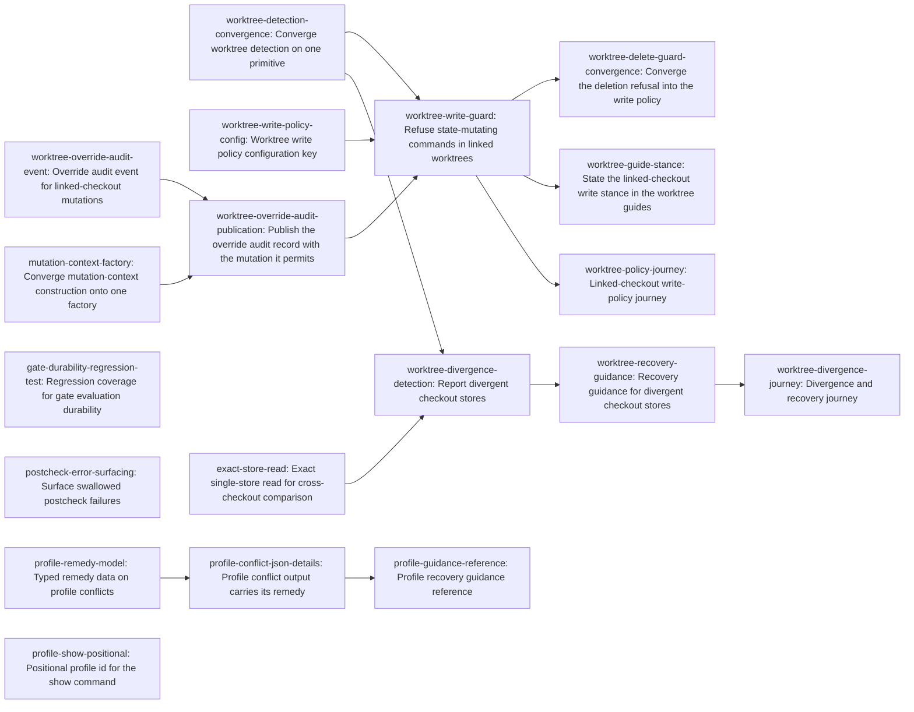

# Plan: gf2 adopter reliability — safe worktrees, durable gates, actionable profiles (4a559332)

> Planning node: 629c3d73. Authoritative graph:
> [breakdown.json](breakdown.json).

## Outcome and criterion approach

Three independent adopter hazards share one container: a linked checkout can build a
divergent authoritative store that routine cleanup destroys, a gate evaluation can look
successful with nothing recorded, and profile recovery advice reaches only human readers.
The investigation resolved the largest open question in the container's favour — the gate
durability primitive already holds on the automated path — and narrowed the largest design
question to a choice between three worktree authority models, settled below as OD-1.

| Criterion | Approach | Evidence / open gap |
|---|---|---|
| REQ-01 | The per-invocation mutation classifier already on the command enumeration — exhaustive over its delegating command families, with five wildcard-matched read-only families a new mutating leaf must join deliberately — combined with one converged worktree primitive, becomes a dispatch-time condition evaluated before the repository mutation session is opened. The stance is a typed configuration key defaulting to refusal, with an explicit per-invocation override, and the adopter guides that teach the linked-checkout workflow state the stance. | Classifier: `crates/jit/src/cli.rs:3232-3270`. Layout computed on every dispatch: `crates/jit/src/main.rs:2265-2279`; mutation session opens at `:2286-2303`. Narrow precedent already shipped for one command: `crates/jit/src/main.rs:3546-3550`. Key shape to follow: `crates/jit/src/config.rs:1308-1313`. Guides teaching the governed workflow: `docs/tutorials/parallel-work-worktrees.md:28-35,134-152`, `docs/how-to/multi-agent-coordination.md:193-203`. |
| REQ-02 | A new read-only check in the worktree command family compares issue records and event logs across two checkouts over a storage-owned exact single-store read, because the ordinary readers deliberately union local, versioned, and primary sources and would mask one-sided records. A documented procedure preserves both sides before any reconciliation. No merge subsystem (OD-2). | Both plausible names are taken by unrelated concepts (investigation §1 claim 7). Aggregating readers: `crates/jit/src/storage/json.rs:539-543,1178`. Events have no cross-checkout read path: `crates/jit/src/storage/json.rs:1216-1227`. Union merge already declared for the event log: `.gitattributes`. The unguarded cleanup recipe: `docs/how-to/multi-agent-coordination.md:303-312`. |
| REQ-03 | The durability guarantee already holds end to end on the automated path, so the remaining work is the missing regression coverage plus a separately-scoped fix for the postcheck loop that discards checker errors. | Coupled plan applied before success: `crates/jit/src/commands/gate_check.rs:1016-1034`. Discarded result: `:1618`. Injection pattern to follow: `crates/jit/src/commands/gate.rs:1884-1955`. |
| REQ-04 | The exhaustive remedy match already inside the conflict type becomes a serializable value, and the two refusal branches attach it using the details-and-suggestions pattern two neighbouring subcommands already prove. | Typed remedy match: `crates/jit/src/repository_state/profile_apply.rs:673-701`. Branches discarding the typed value: `crates/jit/src/main.rs:1174-1181`, `:1201-1210`. Proven attachment pattern: `:1121-1135`. |
| REQ-05 | A bare positional id is accepted on the show command alone and translated to an identity selector inside that command's own dispatch (OD-4). | Required repeatable selector: `crates/jit/src/cli.rs:2951-2960`. Other lifecycle commands pinned to flag-only: `crates/jit/tests/cli_repo_workflow/integration_schema.rs:144-185`. |
| REQ-06 | No gf2 artefact survives, so the reproduction is built live with real linked checkouts (OD-3), landing as modules of the integration target with the most remaining room. Profile and selector evidence rides in the tasks that change those surfaces, whose suites already run the real binary. | No preserved fixture (investigation §1, REQ-06 assessment). Live-checkout precedent: `crates/jit/tests/cli_repo_workflow/cross_worktree_integration_tests.rs`. Budget: `scripts/rust-build-budget.sh:41-43`, 10 of 12 targets used. |

## Shared architectural contracts

### `worktree-authority` [implementation-produced] — Single worktree detection primitive

The one answer to both halves of "where am I": whether the selected data root sits inside a
linked non-primary checkout, and where the primary checkout's store is. Outside version
control it reports a non-linked checkout rather than failing, preserving Git-optional core
commands (`@/charter/D-4`). When an environment override selects the data root, the answer
follows that selected root's location, not the process working directory. It replaces the
five independent implementations enumerated in investigation §1 claim 4.

### `worktree-write-policy` [implementation-produced] — Declared mutation stance

The typed value declaring whether state-mutating commands may run inside a linked non-primary
checkout, its refusing default when nothing is declared, and the precedence between the
declared stance and a per-invocation override. It follows the shape of the lease-enforcement
key in the same configuration section (`crates/jit/src/config.rs:1308-1313`) while stating its
own resolution explicitly rather than inheriting that key's present-section asymmetry.

### `worktree-refusal-audit` [implementation-produced] — Refusal semantics

A refused invocation performs no repository write and appends no event, and returns a refusal
naming the linked checkout, the stance that refused it, and how to permit the operation — in
both the rendered and the machine-readable form. Refusing before any repository delta is
constructed is what keeps the append-on-state-change guarantee intact rather than excepted.

### `context-construction-boundary` [implementation-produced] — One production-context factory

Production mutation contexts — today constructed by twenty-three independent
`MutationContext::production()` calls across fourteen command modules and one
integration-test helper — are constructed through one factory carrying an optional
dispatch-scoped annotation slot, empty by default
and behaviour-preserving when empty. It exists so a fact decided once at dispatch can reach
every finalized plan through the context the finalizer already receives
(`crates/jit/src/repository_state/mutation.rs:665`), without per-command threading; both
finalizer paths converge on the shared event-pass helper
(`crates/jit/src/repository_state/mutation.rs:1092-1094`), so a context-borne fact reaches
each of them.

### `worktree-override-record` [implementation-produced] — Durable override audit event

The distinct event variant recording that a permitted override, not a permissive stance,
allowed a mutation inside a linked checkout: it names the checkout, the stance that would have
refused, and the override. It joins the closed event vocabulary through the catalog and
rendered-reference freshness guard (`crates/jit/src/domain/event_catalog.rs`), and it becomes
durable through the same transactional publication as the mutation it permitted, so the
mutation and its audit record land together or not at all.

### `exact-store-snapshot` [implementation-produced] — Exact single-store read

The storage-owned read returning exactly the records one checkout's store holds — its issue
records and its event log — with no aggregation from version-control history or another
checkout's store, usable against a store other than the process's own. It exists because the
ordinary readers deliberately union local, versioned, and primary sources
(`crates/jit/src/storage/json.rs:539-543,1178`), which would mask exactly the one-sided
records a divergence comparison must surface.

### `store-divergence-report` [implementation-produced] — Cross-checkout divergence findings

The read-only finding model: issue records present in one checkout's store and absent from the
other in either direction, event records held by one log and missing from the other, and
records present in both whose values conflict — the last reported as its own class. Empty in
the primary checkout, in an agreeing linked checkout, and outside version control. The
machine-readable form carries the same findings, wrapped in the repository's list envelope.

### `gate-durability-boundary` [plan-fixed] — Gate success implies durable record

On the automated evaluation path, the issue update, the gate-run record, and the event are
built into one plan and applied through the recovering two-phase-commit kernel before success
is returned; a persistence failure propagates to the caller
(`crates/jit/src/commands/gate_check.rs:1016-1034`, `crates/jit/src/storage/file_transaction.rs:1004-1018`).
This container does not change that boundary — it covers it, and fixes the separate postcheck
path that discards a checker's result without surfacing it.

### `profile-remedy-data` [implementation-produced] — Serializable remedy vocabulary

The typed value naming each resolution that applies to a profile conflict or divergence,
distinguishing restoring recorded content from capturing repository content and marking
capture applicable only where it is valid. Rendered prose derives from it, so the sentence and
the data never disagree. gf2's own drift is the field case where capture is the valid remedy
and restore is not (investigation §2).

## Generated decomposition overview

<!-- jit:breakdown-overview:begin -->
| Key | Title | Type | Outcome | Contracts | Sources | Footprint | Landing | Depends on |
|---|---|---|---|---|---|---|---|---|
| worktree-detection-convergence | Converge worktree detection on one primitive | task | One primitive answers whether this checkout is linked and where the primary store lives. | — | REQ-01, OD-5 | touches 5 | worktree-safety | — |
| worktree-write-policy-config | Worktree write policy configuration key | task | A typed worktree policy key resolves the mutation stance for linked checkouts, defaulting to refusal. | — | REQ-01, OD-1 | touches 3 | worktree-safety | — |
| mutation-context-factory | Converge mutation-context construction onto one factory | task | One factory owns production mutation-context construction, replacing twenty-three scattered constructor calls. | — | REQ-01, OD-1 | touches 16 | worktree-safety | — |
| worktree-override-audit-event | Override audit event for linked-checkout mutations | task | The closed event vocabulary carries a distinct override-audit variant with catalog and reference conformance. | — | REQ-01, OD-1 | touches 3 | worktree-safety | — |
| worktree-override-audit-publication | Publish the override audit record with the mutation it permits | task | An override-permitted mutation and its audit record become durable through one finalized plan, or neither lands. | context-construction-boundary | REQ-01, OD-1 | touches 4 | worktree-safety | worktree-override-audit-event, mutation-context-factory |
| worktree-write-guard | Refuse state-mutating commands in linked worktrees | task | State-mutating dispatch refuses inside a linked checkout unless the stance or an explicit override permits it. | worktree-authority, worktree-write-policy, worktree-override-record | REQ-01, OD-1, OD-5 | touches 4 | worktree-safety | worktree-detection-convergence, worktree-write-policy-config, worktree-override-audit-publication |
| exact-store-read | Exact single-store read for cross-checkout comparison | task | Storage returns exactly what one checkout's store holds, unmasked by the aggregating read model. | — | REQ-02, OD-2 | touches 2 | worktree-safety | — |
| worktree-divergence-detection | Report divergent checkout stores | task | A read-only check reports the issue records and events one checkout holds without the other. | worktree-authority, exact-store-snapshot | REQ-02, OD-2 | touches 5, uncertain | worktree-safety | worktree-detection-convergence, exact-store-read |
| worktree-delete-guard-convergence | Converge the deletion refusal into the write policy | task | The standalone deletion refusal dissolves into the general linked-checkout write policy. | worktree-write-policy | REQ-01, OD-1, OD-5 | touches 2 | worktree-safety | worktree-write-guard |
| worktree-guide-stance | State the linked-checkout write stance in the worktree guides | task | The worktree guides state the write stance and its declaration point, so their steps succeed as instructed. | worktree-write-policy | REQ-01, OD-1 | touches 2 | worktree-safety | worktree-write-guard |
| worktree-recovery-guidance | Recovery guidance for divergent checkout stores | task | Adopters recover a divergent checkout store losslessly and screen for unmerged state before discarding one. | store-divergence-report | REQ-02, OD-2 | touches 2 | worktree-safety | worktree-divergence-detection |
| gate-durability-regression-test | Regression coverage for gate evaluation durability | task | Injected persistence failure during a gate evaluation returns failure and leaves no passing gate record. | gate-durability-boundary | REQ-03, REQ-06, D-02 | creates 1, touches 1 | gate-durability | — |
| postcheck-error-surfacing | Surface swallowed postcheck failures | task | A postcheck persistence failure reaches the caller instead of being silently discarded. | gate-durability-boundary | REQ-03, D-02 | touches 2 | gate-durability | — |
| profile-remedy-model | Typed remedy data on profile conflicts | task | Profile conflicts and divergences carry a serializable remedy naming which resolutions apply. | — | REQ-04 | touches 2 | profile-guidance | — |
| profile-conflict-json-details | Profile conflict output carries its remedy | task | Profile refusals and divergences reach machine consumers with structured details plus suggested resolutions. | profile-remedy-data | REQ-04, REQ-06 | touches 4 | profile-guidance | profile-remedy-model |
| profile-guidance-reference | Profile recovery guidance reference | task | The profile reference and the bridge tool descriptions state the machine-readable remedy contract. | profile-remedy-data | REQ-04 | touches 3, uncertain | profile-guidance | profile-conflict-json-details |
| profile-show-positional | Positional profile id for the show command | task | A bare positional id selects a recorded profile on the show command without touching the shared grammar. | — | REQ-05, REQ-06, OD-4 | touches 5 | profile-guidance | — |
| worktree-policy-journey | Linked-checkout write-policy journey | task | A live linked checkout proves refusal, permission, and the override audit record end to end. | worktree-write-policy, worktree-refusal-audit, worktree-override-record | REQ-06, OD-1, OD-3 | creates 1, touches 1 | worktree-safety | worktree-write-guard |
| worktree-divergence-journey | Divergence and recovery journey | task | A deliberately diverged linked checkout proves the divergence report and lossless recovery end to end. | store-divergence-report | REQ-06, OD-2, OD-3 | creates 1, touches 1 | worktree-safety | worktree-recovery-guidance |

<!-- jit:breakdown-overview:end -->

## Material risks and owner decisions

| Risk / decision | Resolution and rationale |
|---|---|
| OD-1 — worktree authority model (resolves epic D-01) | Chosen: refuse by default, with a declared configuration stance and an explicit audited override. Rejected: a repository-shared canonical store and a write-through redirect to the primary, because both contradict the documented per-checkout design that four independent sources confirm is deliberate (investigation §1 claim 5); rejected initialization-in-the-checkout as the opt-in signal, because the newer dispatch protocol instructs agents to skip it (investigation §2). |
| OD-2 — depth of REQ-02 | Chosen: detect, report, preserve. A read-only divergence surface plus a documented lossless recovery path that reports semantic conflicts. Rejected: automatic store reconciliation or a merge subsystem, a permanent maintenance burden guarding a state that OD-1 makes rare. |
| OD-3 — REQ-06 evidence base | Chosen: an equivalent linked-checkout reproduction built live in tests, which the criterion explicitly permits. Rejected: a committed gf2 fixture, because no backup survives and the live checkout is untouched field evidence rather than a test artefact. |
| OD-4 — REQ-05 shape | Chosen: accept an unambiguous positional id on the show command only, translated inside that command's dispatch. Rejected: loosening the shared selector parser, whose tag-required contract the other lifecycle commands depend on. |
| OD-5 — detection convergence | Chosen: the five detection implementations converge onto the layout primitive as part of this container, before the guard is written. Rejected: adding the guard as a sixth implementation, which `@/inv/convention-convergence` names a defect absent a cited exception. |
| D-02 — reproduce before remediating | Held. The investigation reproduced each defect at the planning tier and found REQ-03's durability property already satisfied on the automated path, which is why that criterion's work is coverage plus a separately-scoped postcheck fix rather than new durability machinery. |
| Risk — a refusing default breaks this repository's own agent fleet | The dogfood opt-in is declared in this repository's tracker configuration by the task that introduces the key, which the guard task depends on, so no ordering exists in which the fleet runs against a refusing default. |
| Risk — convergence narrows documented read-side fallback behaviour | The layered issue read fallback is adopter-facing documented behaviour with a known test and documentation blast radius (investigation §6). Its observable behaviour is held fixed; only the detection question underneath converges. |
| Risk — the worktree guides lag the guard by one ordered wave | Accepted deliberately for leaf purity: the stance statement is its own docs leaf, ordered by an explicit edge, in the guard's landing group. The lag is bounded because the container cannot complete before that leaf lands; scheduling should dispatch it in the wave immediately following the guard. |
| Risk — the postcheck swallow's reachability from today's CLI is unestablished | Enumerating the invocations that reach that loop is the first criterion of the task that fixes it, so the surfacing shape is chosen from evidence rather than assumed. |
| Risk — profile prose is pinned by unit assertions, including capture-only-where-applicable | The prose derives from the typed remedy rather than being replaced by it, so those assertions stay meaningful; the pinned command-boundary assertions are extended by the same tasks that change the surfaces (investigation §3.d). |

## Investigation sources

- [Investigation](investigation.md) — claim-by-claim verification, the exhaustive consumer
  sweeps for worktree detection, direct `.jit` writers, linked-checkout tests, and profile
  JSON consumers, plus the prior-art sweep behind OD-1 and OD-2.
