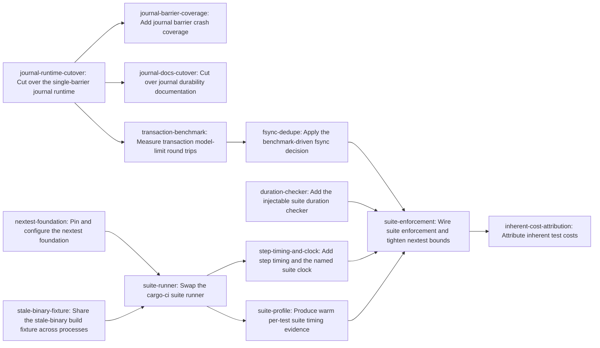

# Plan: The workspace test suite runs in under 30 seconds (4b7c06d0)

> Planning node: eebb3fee. Authoritative graph: [breakdown.json](breakdown.json).

## Outcome and criterion approach

| Criterion | Approach | Evidence / open gap |
|---|---|---|
| REQ-01 | Reduce transaction publication overhead with a benchmark-driven fsync decision, then enforce the measured suite clock after the transaction branch lands. | [Investigation](investigation.md#claim-classification) Claims 2, 4, and 5; [primitive verification](investigation.md#primitive-verification-and-required-crash-boundaries) |
| REQ-02 | Feed the named measured duration into the existing budget-checker boundary using `--test-suite-ms <integer>` and the canonical `MAX_TEST_SUITE_SECONDS` threshold. | [Investigation](investigation.md#consumer-inventories) Inventory C; [architecture fit](investigation.md#architecture-fit) |
| REQ-03 | Emit integer millisecond timing for each cargo-ci step and define the suite parent timer around nextest plus doctests. | [Investigation](investigation.md#claim-classification) Claim 1; [surprises](investigation.md#surprises-and-planning-consequences) 3 |
| REQ-04 | Preserve semantic coverage while provisioning pinned nextest, sharing the stale-binary fixture across processes, and removing only unused journal progress rewrites. | [Investigation](investigation.md#recommended-decomposition-constraints); [consumer inventories](investigation.md#consumer-inventories) A, B, and D |
| REQ-05 | Produce warm per-test timing evidence and attribute inherently costly tests from that profile and the transaction benchmark artifact. | [Investigation](investigation.md#claim-classification) Claim 5; [architecture fit](investigation.md#architecture-fit) |

## Shared architectural contracts

### `suite-clock` [plan-fixed] — Named inner suite clock

The budget clock starts immediately before the `cargo nextest run` invocation and ends after the separately reported doctest substep, spanning exactly nextest plus doctests; it excludes the flock wait and the incremental-preflight, fmt, and clippy steps that precede the suite. The measured value is passed as an integer millisecond value to enforcement. This resolves the ambiguity identified in the investigation’s Claim 1 and Surprise 3.

### `single-barrier-journal` [plan-fixed] — Transaction durability phases

The transaction journal publishes one discoverable initial record, one complete `Prepared` record before live mutation, then live mutations and distinct-parent durability barriers before one terminal decision. Identity-driven rollback remains idempotent, and the terminal `RolledBack` record is retained; only per-action progress rewrites are removed. This follows the verified primitive in [investigation.md](investigation.md#primitive-verification-and-required-crash-boundaries).

### `nextest-reporter-evidence` [implementation-produced] — Pinned nextest summary contract

The `suite-runner` task produces the repository’s tested parser-facing success and failure evidence for cargo-nextest pinned at 0.9.133, failing fast when the local version differs, while preserving stable cargo-ci summary prefixes. `step-timing-and-clock`, `suite-profile`, and `suite-enforcement` consume this contract. The exact reporter fields remain an implementation detail until the pinned version is exercised, as recorded in [investigation.md](investigation.md#claim-classification) Claim 9.

### `suite-timing-evidence` [implementation-produced] — Warm per-test timing artifact

The `suite-profile` task produces the machine-readable warm per-test timing artifact at its stable repository-owned location and shape, deriving timings from nextest machine-readable output. It has two consumers: `suite-enforcement` selects per-test nextest overrides mechanically from the recorded timings, and `inherent-cost-attribution` classifies inherent costs from those timings alongside the transaction benchmark artifact, reaching the producer transitively through enforcement.

## Generated decomposition overview

<!-- jit:breakdown-overview:begin -->
| Key | Title | Type | Outcome | Contracts | Sources | Footprint | Landing | Depends on |
|---|---|---|---|---|---|---|---|---|
| journal-runtime-cutover | Cut over the single-barrier journal runtime | task | The transaction runtime uses one prepared barrier and one terminal decision without per-action progress state. | single-barrier-journal | REQ-01, REQ-04, investigation.md | touches 5 | transaction-branch | — |
| journal-barrier-coverage | Add journal barrier crash coverage | task | Crash conformance covers the single-barrier protocol across remaining boundaries, backends, and root shapes. | single-barrier-journal | REQ-04, investigation.md | touches 1 | transaction-branch | journal-runtime-cutover |
| journal-docs-cutover | Cut over journal durability documentation | task | The architecture reference describes single-barrier decision and identity recovery without durable action progression. | single-barrier-journal | REQ-01, REQ-04, investigation.md | touches 1 | transaction-branch | journal-runtime-cutover |
| transaction-benchmark | Measure transaction model-limit round trips | task | A warm harness records model-limit transaction costs and a reproducible fsync-residual decision for both root shapes. | single-barrier-journal | REQ-01, investigation.md | creates 2 | transaction-branch | journal-runtime-cutover |
| fsync-dedupe | Apply the benchmark-driven fsync decision | task | The measured fsync decision is applied behind existing barriers and verified by a rerun without changing transaction semantics. | single-barrier-journal | REQ-01, investigation.md | touches 2 | transaction-branch | transaction-benchmark |
| stale-binary-fixture | Share the stale-binary build fixture across processes | task | Six stale-binary tests share one cross-process verified child artifact without losing test granularity or semantic assertions. | — | REQ-04, investigation.md | touches 2 | runner-branch | — |
| duration-checker | Add the injectable suite duration checker | task | The checker validates optional integer suite duration input against MAX_TEST_SUITE_SECONDS with five boundary fixtures. | — | REQ-02, investigation.md | touches 2 | runner-branch | — |
| nextest-foundation | Pin and configure the nextest foundation | task | Pinned cargo-nextest and an exact initial parallel policy are reproducible in CI before runner use. | — | REQ-04, investigation.md | creates 1, touches 2 | runner-branch | — |
| suite-runner | Swap the cargo-ci suite runner | task | cargo-ci runs the pinned nextest workspace suite with verified reporter evidence. | — | REQ-04, investigation.md | touches 2 | runner-branch | nextest-foundation, stale-binary-fixture |
| step-timing-and-clock | Add step timing and the named suite clock | task | cargo-ci reports integer-millisecond step timings and a suite-clock spanning exactly the nextest and doctest substeps. | suite-clock, nextest-reporter-evidence | REQ-03, investigation.md | touches 2 | runner-branch | suite-runner |
| suite-enforcement | Wire suite enforcement and tighten nextest bounds | task | Live suite-clock enforcement uses the exact checker flag and final bounded nextest policy after transaction optimization. | suite-clock, nextest-reporter-evidence, suite-timing-evidence | REQ-01, REQ-02, investigation.md | touches 2 | runner-branch | step-timing-and-clock, duration-checker, fsync-dedupe, suite-profile |
| suite-profile | Produce warm per-test suite timing evidence | task | A pinned-nextest profiler produces repository-owned warm per-test timing evidence at a stable JSON path. | nextest-reporter-evidence | REQ-05, investigation.md | creates 2 | runner-branch | suite-runner |
| inherent-cost-attribution | Attribute inherent test costs | task | Contributor guidance attributes named inherent test costs to warm profile and transaction evidence and cites MAX_TEST_SUITE_SECONDS. | suite-timing-evidence | REQ-05, investigation.md | touches 1 | runner-branch | suite-enforcement |

<!-- jit:breakdown-overview:end -->

## Material risks and owner decisions

| Risk / decision | Resolution and rationale |
|---|---|
| Container shape | Retype the chosen existing container rather than create a new epic; bigger JIT product defects remain in scope while this epic stays small with quick results. |
| Strict boundary | Treat a measured suite-clock value greater than or equal to `MAX_TEST_SUITE_SECONDS*1000` as failure, enforced over the `suite-clock` span alone. |
| Doctests | Keep `cargo test --doc --workspace` as a separately reported substep inside the suite clock because nextest does not cover doctests in the investigated design. |
| Runner sequencing | Keep the transaction and runner branches independent until the join; provision pinned nextest first, swap the runner next, add step timing and the suite clock, produce the warm profile, and then wire enforcement after that profile, the duration checker, and the fsync fix, because enforcement selects its per-test overrides from the profile’s timings. |
| Journal rollback marker | Retain the terminal `RolledBack` write; remove only per-action rewrites because recovery is identity-driven but the investigation does not prove marker removal safe. |
| Model-limit scale | Keep the 512-file, near-4 MiB model-limit scale because its scale is the property being proven. |
| Stale-binary granularity | Keep six independently reportable tests and one cross-process fixture with a lock, provenance-keyed artifact, and observable reuse marker; nextest groups do not substitute for fixture sharing. |
| Nextest reporter | Pin and provision cargo-nextest 0.9.133 before the runner swap; `suite-runner` produces tested reporter evidence for `step-timing-and-clock` and `suite-enforcement`. |
| Residual fsync cost | Measure directory-fsync cost in `transaction-benchmark`, then let dependent `fsync-dedupe` apply or record the bounded decision behind existing barriers. |
| Clock ambiguity | Resolve flock-versus-inner timing ambiguity by naming and enforcing `suite-clock`, while retaining the outer gate duration as separate history evidence. |
| Late timing evidence | Step timing lands after the runner swap in an ordered sequence of cargo-ci.sh changes; the transaction branch measures with its dedicated benchmark harness. |
| Ordered overlaps | `scripts/cargo-ci.sh`, `.config/nextest.toml`, `dev/TESTING.md` and the benchmark artifact are each touched by a strict dependency chain of tasks; every overlap is declared in footprints with its sequence. |
| Cross-process fixture | The stale-binary build fixture uses an advisory file lock plus provenance-keyed artifact because nextest isolates tests into processes. |
| Enforcement activation | The measured `suite-clock` wiring lands after the transaction fix, duration checker, timing contract, and warm profile, so the budget is enforced only once the suite can pass it. |

## Investigation sources

- [Investigation](investigation.md) — exhaustive consumer inventories A-D and the 36-variant FailurePoint vocabulary remain there.
