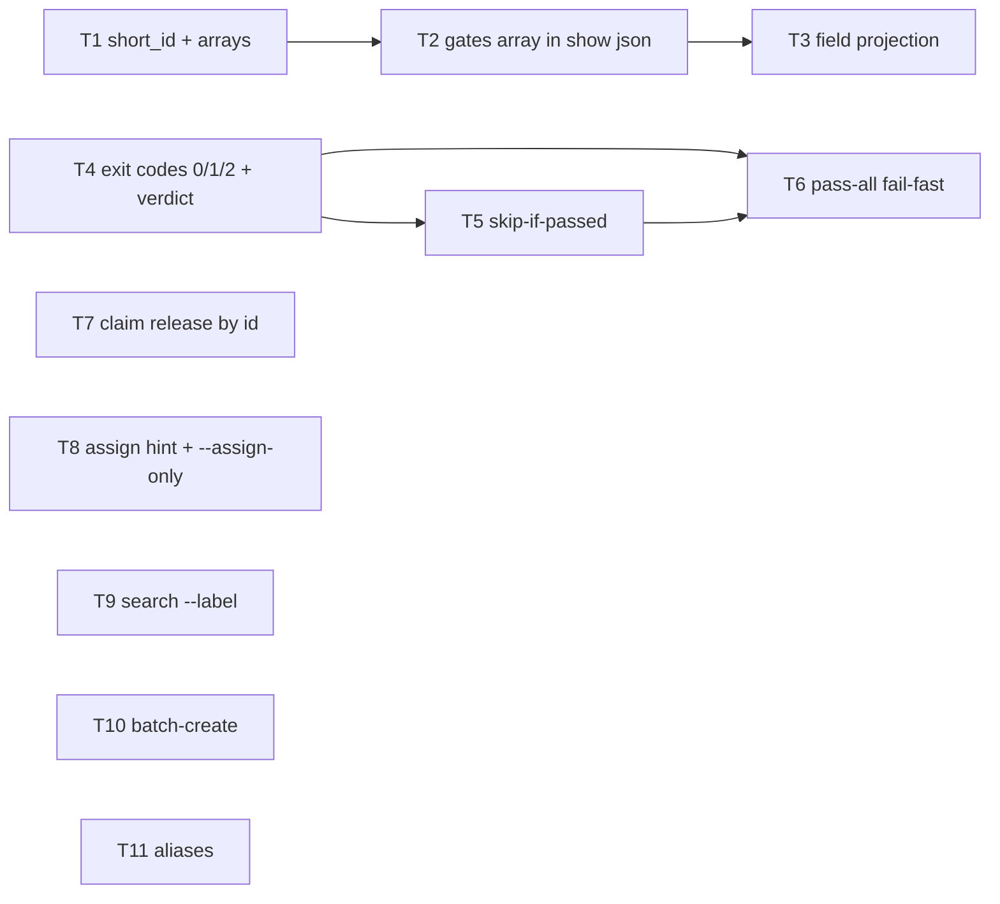

# Plan: Agent-facing CLI ergonomics (epic 53e3fa36)

Planning node: `2937919f` (type:planning, gate `plan-review`).
Source findings: `dev/studies/session-mining-jit-improvements.md` (209 findings, 37 sessions).

This plan does two things the gate requires before fan-out:
1. **Verifies every proposal against the newest jit** (working tree @ commit `6bb4567`+, binary rebuilt & installed 0.2.1) — separating already-shipped from still-broken.
2. **Specifies the decomposition** the breakdown node will fan out, scoped to what is actually still broken.

> Method: CLI-surface probes against the freshly-installed binary, `--json` shape inspection on real issues (read-only), behavioral write-tests in an isolated throwaway `jit init` repo (never prod `.jit`), and source reads in `crates/jit/src` for exit-code / validation / claim semantics. The installed binary was stale (predated commit `6bb4567` "bracket scaffolding command"); it was rebuilt via `cargo install --path crates/jit` before verifying.

## Verification results

### Already shipped — drop from breakdown

| # | Proposal | Verdict | Evidence (newest jit) |
|---|----------|---------|-----------------------|
| 12 | `issue create --gate` silently no-ops | **FIXED** | `create --gate plan-review` wired the gate; `gates_required: ['plan-review']`. Also `--with-planning` flag now exists. |
| — | `gate check` requires `.jit/gate-runs/` spelunking | **FIXED** | `gate check --json` root now includes `stdout, stderr, exit_code, run_id, duration_ms, status, commit, branch`. |
| 1 | `gate pass` exits 0 on FAIL | **CORE FIXED** | `pass_gate` returns `Err` on checker failure → process exits `4` (`ValidationFailed`); success → `0`. (`main.rs:1656`, `output.rs:262`). Residual → item R1. |
| — | `graph deps --transitive` rejected | **ADDRESSED** | `graph deps <id> --depth 0` = full transitive closure. `--flat` array still absent → item R5. |
| — | `recover` has no `--json`, noisy | **MOSTLY FIXED** | `recover --json` exists. stderr-routing / `Warning:` prefix unverified (minor, dropped). |
| — | `gate add` noisy on idempotent calls | **MOSTLY FIXED** | Second `gate add` re-prints `• <gate>`, exit 0, no `Already required` error. Acceptable; dropped. |

### Partially shipped — scope only the residual

| # | Proposal | Shipped | Residual (→ work item) |
|---|----------|---------|------------------------|
| 3 | Stable `--json` contract | `short_id` present on **list** items; `gate check` inlines fields | `issue show --json` has **no `short_id`**; list envelopes differ (`issues` vs `results`); `labels` presence unverified → **R2** |
| 4 | `gate check` structured verdict | `stdout/stderr/exit_code` at root; `check-all` includes failing output | No `verdict` field; no `[PASSED]/[FAILED]` human first-line; no `--tail N` → **R3** |
| 5 | `validate` scoping & terminal states | `validate [ID]` and `validate --scope <ID>` (bracket-subtree checker, exit 4) shipped | Isolated-node check has **no state filter** (`graph.rs:208` flags rejected/done/archived); no `--errors-only` → **R4** |

### Verified still broken — full work items

| # | Proposal | Verdict | Evidence |
|---|----------|---------|----------|
| F2 | `gate pass` failure shows no checker output inline | **BROKEN** | Non-json failure returns terse `Err` ("Inspect details with: jit gate check…"); stdout only via follow-up `gate check`. (`main.rs:1684`) |
| F6 | `gate status <ISSUE_ID>` | **MISSING** | No `status` under `gate`; `gate list <id>` rejects the positional id. |
| F7 | `gate pass-all` + already-passed skip | **MISSING** | No `pass-all`; no already-passed short-circuit in `pass_gate`. |
| S1 | `gate wait <ISSUE> <GATE>` | **MISSING** | No `wait` subcommand → bespoke `sleep N; poll` loops remain necessary. |
| S2 | claim-blocked error names `assign`; `--assign-only` | **BROKEN** | "blocked by dependencies" error (`bulk_update.rs:542`) omits assign hint; no `--assign-only` on `issue claim`. |
| S3 | `claim release <ISSUE_ID>` / `--agent-id` | **BROKEN** | `claim release` still takes `<LEASE_ID>` only; no `--agent-id`. |
| S4 | `issue delete` cleans dangling edges; `validate --fix` repairs | **BROKEN** | Isolated repo test: after deleting A, `validate` errors "Invalid dependency … which does not exist"; `issue show` silently hides the dangling edge. |
| S5 | `issue batch-create --from-json` | **MISSING** | `issue breakdown` exists but no declarative array+DAG batch create. |
| O1 | `issue show --field <name>` / `--fields` | **MISSING** | No field projection → the 25+ session python-reshape friction persists. |
| O2 | unified `gates` array | **MISSING** | `issue show --json` still splits `gates_required` / `gates_status`. |
| O3 | `issue search --label`; optional QUERY | **BROKEN** | `search` requires `<QUERY>`; no `--label`. |
| O4 | `issue delete --yes` / discoverable deletion | **BROKEN** | Deletion still env-var only (`JIT_ALLOW_DELETION`); not in `--help` or error. |
| O5 | aliases: `dependency`/`document`/`issue list`/`--add-label` | **MISSING** | None resolve. |
| O6 | `gate runs <ISSUE>` history | **MISSING** | No `runs` subcommand. |
| O7 | cargo-ci floods reviewer context; `pass_context_lines` | **OPEN** | Gate-template/registry concern, not core CLI; tracked separately. |

## Proposed decomposition (for the breakdown node to fan out)

Right-sized tasks, grouped by subsystem. Gates: `cargo-ci` + `code-review` on every implementation task (per repo convention). Suffix shows dependencies.

This is the **post-interview, decided** scope, revised to clear plan-review round 1 (12 tasks). The pre-interview 21-task draft was pruned by the decisions table; the round-1 reviewer findings are addressed inline and summarised in *Addressing plan-review (round 1)* below.

**Scope principle — presentation layer, not domain model.** The `--json` changes alter the serialization layer (`IssueShowResponse`, `crates/jit/src/output.rs:779`) only. The internal `Issue` domain fields `gates_required`/`gates_status` stay as-is. A full domain rename was rejected: `grep -rn "gates_required\|gates_status"` hits ~240 sites across ~20 Rust files, web, and docs; the agent-facing friction is entirely in the *emitted JSON*, so the fix is bounded to serialization + JSON consumers (web types, JSON-asserting tests, docs examples).

**Wave 1 — JSON contract (presentation layer)**
- T1 `issue show --json`: add `short_id` at root (from `id[0:8]`); `labels`/`dependencies` always arrays. Additive, low risk. Per-lifecycle-state contract tests.
- T2 `issue show --json`: project gate state as a `gates` array `[{key, status, last_run_at, exit_code}]` in `IssueShowResponse` (`output.rs:779`), **derived** from the existing domain fields (model unchanged). Update `--summary` help (`cli.rs:366`), the gate-checker context builder that consumes show output, web `types/models.ts` + `IssueDetail.tsx`, JSON-asserting tests, and `docs/` examples in the same change. *(dep T1)*
- T3 Field projection: `issue show <id> --field <name>` (plain text), `--fields a,b` (compact JSON), multi-id `issue show <id…> --json` (array). *(dep T2 for the gates shape)*

  *(The earlier "unify list envelopes" task was dropped: `jit issue search --json` already returns `issues`; only top-level `jit search --json` returns `results`, which is correct because it searches documents and issues together. See round-1 advisory.)*

**Wave 2 — gate workflow**
- T4 `gate pass` exit-code taxonomy. Map `GateRunStatus` (`domain/types.rs:680`): `Passed → 0`, `Failed → 1` (checker ran, verdict fail), `Error → 2` (timeout, command-not-found, crash). Any non-`GatePassFailed` `anyhow` error from the run path also exits `2`. Document the taxonomy in `--help`; add `verdict` (`pass|fail|error`) to `--json`; align the `GATE_FAILED`/`GATE_ERROR` JSON branches (`main.rs:1659`) with these codes.
- T5 `gate pass` skips re-running when the gate is already passed for the current HEAD commit (`already_passed: true`, exit 0); `--force` re-runs. *(dep T4 for the json/verdict shape)*
- T6 `gate pass-all <ISSUE>`: iterate the issue's required gates through the `pass_gate` path, **fail-fast** (stop at first non-pass), exit per the T4 taxonomy; inherit T5's skip-if-passed behavior. *(dep T4, T5)*

**Wave 3 — issue / dependency / claim**
- T7 `claim release <ISSUE_ID>`: resolve short→full id (`resolve_issue_id`), look up the issue's active lease via the claim coordinator, and release it through the existing `release_lease` path (`storage/claim_coordinator.rs:731`) **regardless of owner** — no new coordinator mechanism. Append a claim event recording the acting identity (`JIT_AGENT_ID`, else git user) so a non-owner release is auditable even though ownership is not enforced. Error clearly if the issue has no active lease.
- T8 `issue claim` blocked-by-deps error names `jit issue assign`; add `--assign-only` to claim (assign without the state transition).
- T9 `issue search --label <ns:val>`; make the positional QUERY optional when a filter flag is present.

**Wave 4 — batch & aliases**
- T10 `issue batch-create --from-json <file>`. **Schema:** array of `{key (required, unique within file), title (required), description?, type? (default from config), priority? (default normal), labels?[], gates?[], depends_on?[] (symbolic `key`s)}`. **Behavior:** full pre-validation before any write — duplicate/unknown `key`s, unknown `depends_on` refs, cycle detection via the existing graph check, and type/label/gate validity; then create issues and wire edges reusing `create_issue` + `add_dependency`. **Atomicity:** validation precedes all writes, so a malformed file makes zero changes and exits `2` listing the offending entries; a mid-write failure (rare) reports the partial `key→id` map and the failing step. **Output:** `{key: full_id}` on success.
- T11 Aliases: `dependency`→`dep`, `document`→`doc`, `issue list`→`query`, `--add-label`→`--label`.

Every task carries gates `cargo-ci` + `code-review`.

## Migration & test strategy (hard break)

The break lives in emitted JSON, not storage, so each output-changing task (T1, T2, T4) owns its full consumer sweep **in the same change**:
- Rust JSON-asserting tests in `tests/integration_test.rs` and the harness suite.
- `web/src/types/models.ts` and the components/tests that read the changed fields (`IssueDetail.tsx`, `useSearch.test.ts`, `clientSearch.test.ts`).
- `docs/` JSON examples (`reference/cli-commands.md`, `concepts/core-model.md`, `reference/storage-format.md`).

Per-field verification before marking a task done: `grep -rn "<old-field>" crates/jit/tests web/src docs` returns no stale references to the removed JSON shape (the domain-model occurrences in `crates/jit/src` are expected to remain).

## Addressing plan-review (round 1)

| Reviewer finding (blocking unless noted) | Resolution |
|---|---|
| T1 too large, crosses boundaries | Split into T1 (additive short_id/arrays) + T2 (gates projection); scoped to serialization, not the domain model. |
| Hard JSON break migration unaddressed | Added *Migration & test strategy*; each task sweeps tests/web/docs with a grep gate. |
| Wave-2 deps missing (T6 needs T4/T5) | DAG corrected: T4→T5→T6 and T4→T6; T1→T2→T3. |
| T4 runner/infra category not actionable | Mapped to `GateRunStatus` (Passed/Failed/Error) + non-`GatePassFailed` anyhow → exit 2. |
| T7 non-owner release design gap | Specified: resolve id, reuse `release_lease`, audit event for the actor; no new mechanism. |
| T10 under-specified | Added JSON schema, pre-validation, cycle detection, atomicity, partial-failure output. |
| (Advisory) T2 envelope rename | Dropped: `issue search` already returns `issues`; top-level `search` keeps `results` (mixed doc/issue results). |

## Decisions (resolved with the user)

| Topic | Decision |
|-------|----------|
| Scope | All 4 waves committed (12 tasks after pruning already-shipped/out-of-scope items and splitting the JSON-contract task per plan-review). |
| `--json` compatibility | **Hard break**, fix shapes directly. No deprecation aliases (single consumer). |
| `gate pass` exit codes | **Adopt 0/1/2** (pass / checker-failed / runner-error), replacing the current 0/4. |
| Output volume | **The checker's responsibility, not jit's.** Drops inline-fail-output and any `pass_context_lines` gate-template cap. |
| `gates` field shape | Array of objects `[{key,status,last_run_at,exit_code}]` (no `all_passed`). |
| `gate pass` re-run | Skip if already passed at HEAD; `--force` overrides. |
| `pass-all` | Fail-fast. |
| `claim release` | Drops the issue's active lease regardless of owner. |
| Batch create | New `issue batch-create --from-json`. |
| Aliases | All four (`dependency`, `document`, `issue list`, `--add-label`). |
| Milestone | `milestone:v1.0`. |

### Dropped (and why)
- **`gate wait`** — `gate pass` is synchronous (`gate.rs:240`) and now returns correct exit codes, so the `sleep N; poll` pattern is obsolete.
- **Inline checker output on `gate pass` fail / `pass_context_lines`** — output length is the checker script's job.
- **`gate status <id>`** — covered by `issue show --field gates`.
- **`gate runs <id>` history** — last run (now with inline stdout/stderr) is sufficient; passes are in the event log.
- **`gate check` `verdict` field / `[PASSED]` line / `--tail`** — `status` + `exit_code` already convey the verdict.
- **`validate` terminal-state exclusion + `--errors-only`** — issues living outside the DAG is intentional even when terminal; not a bug.
- **`graph deps --flat`** — `--depth 0` tree + jq is enough.
- **`issue delete --yes` / documenting `JIT_ALLOW_DELETION`** — the deletion friction is intentional and deliberately undocumented.

### Verified already-shipped (excluded from breakdown)
`create --gate` wiring; `gate check --json` inlining stdout/stderr/exit_code (no `.jit/gate-runs/` spelunking); `gate pass` non-zero on fail (core of the exit-code fix); `graph deps --depth 0` transitive; `recover --json`; idempotent `gate add`; `short_id` on list items; `issue delete` *display* hides dangling edges (note: storage still keeps them — see below).

### Carried as a known issue, not a task
`issue delete` leaves a dangling edge in storage that `jit validate` flags (reproduced). Not turned into a task this round; the DAG-integrity stance (no issues outside the DAG) means the right fix is wiring, and `validate` already surfaces it.
