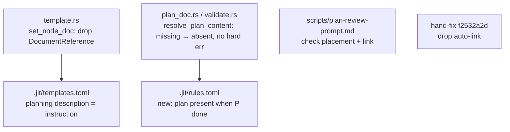

# Plan: fix `jit apply` dangling plan-doc reference

**Issue:** `57269494` (type:bug) — jit apply leaves a dangling doc reference; scaffolded bracket fails validation until the file is hand-created.

## Problem

Right after `jit apply plan <epic>`, `jit validate` hard-errors with `plan document for issue <epic> not found or unreadable at dev/active/<id>-plan.md`, and because validation runs repo-wide it blocks unrelated transitions until a file is hand-created at that path.

## Root cause (answers "is this link validation, or plan-doc-specific?")

Two independent mechanisms touch the plan doc; only one causes the error.

1. **The link (`DocumentReference`).** `jit apply` calls `set_node_doc` (`crates/jit/src/commands/template.rs:835`), which writes a `"plan"`-labeled `DocumentReference` onto the planning node `P`, pointing at the interpolated `doc` path. This is the link-to-a-nonexistent-file.

2. **The eager loader (the actual error source).** `resolve_plan_content` (`crates/jit/src/commands/validate.rs:456`) runs on every validate. For each **breakable container** (the epic, because `epic ∈ applies_to`) it resolves the template planning-node `doc`, substitutes `{container.id}`, and **reads the file from disk** via `load_plan_content` (`plan_doc.rs`), propagating `PlanDocError::Read` (a hard `?`) when it is missing.

So the error is **plan-doc-specific, keyed on the container, and never consults the `DocumentReference`**. It is not generic link validation: not creating the link would *not* silence it, because the loader re-derives the path from the template + container type. Confirmed by the message naming the container (`f2532a2d`), not the `P` node that carries the link.

### Why the loader matters beyond existence (coverage coupling)

`resolve_plan_content` feeds the graph-rule engine in all three validate paths (whole-repo `validate.rs:406`, scoped `validate.rs:737` used by the `coverage-preview` gate, and the closure path `mod.rs:657`). The `bracket:coverage-preview` rule (`.jit/rules.toml`) reads the container's `success_criteria` section; when those criteria live in the external plan, the loaded plan content *is* the criteria source. If the loader silently skipped a missing plan, a container whose criteria live only in the plan would coverage-pass **vacuously**. Any fix must preserve coverage enforcement, not just stop the eager error.

## Solution

Shift the plan-doc lifecycle from "tooling materialises a link" to "the planning node instructs placement + linking; review enforces it."

### 1. Stop auto-creating the link (`template.rs`)

`set_node_doc` no longer writes the `DocumentReference`. The `doc` field stays in `.jit/templates.toml` as the canonical path source for (a) description interpolation and (b) the loader/gate path resolution. Apply creates no doc reference; the author links the plan when they author it.

### 2. Make the planning-node description an explicit instruction (`.jit/templates.toml`)

Rewrite the planning node `description` from `… Plan document: {doc}.` to an explicit instruction: author the plan at `{doc}` and link it to this node once written. The `{doc}` token still interpolates the concrete path, so the author is told exactly where it goes.

### 3. Relax the eager loader; enforce presence by planning-node state (`plan_doc.rs`, `validate.rs`, `.jit/rules.toml`)

`resolve_plan_content` stops hard-erroring on a missing external plan: a missing file resolves to "absent" (skipped from the content map) rather than `Err`. To keep coverage honest, add a graph rule that flags a breakable container whose **planning node is `done`** but whose external plan is absent. Rationale for keying on `P.done`:

- Right after apply, `P` is `backlog` → plan legitimately not authored yet → no error. (Fixes the bug.)
- `coverage-preview` runs after `P` is `done` (bracket order P > B) → plan must exist → the rule fires if it is missing, closing the vacuous-coverage hole.
- `plan-review` (P's own gate, see step 4) already prevents `P` from reaching `done` without a good, present, linked plan — so the rule is a backstop, not the primary guard.

> Decision needed (refines the interview answer "remove the eager check entirely"): the eager error is removed as you chose, but I recommend re-expressing presence enforcement as the `P.done` rule above rather than dropping plan-doc enforcement from `jit validate` outright, because `coverage-preview` shares this loader and would otherwise pass vacuously. Confirm this refinement or say to drop structural enforcement entirely and rely on the gates alone.

### 4. Add an explicit placement/link check to `plan-review` (`scripts/plan-review-prompt.md`)

Amend the prompt so the reviewer explicitly confirms the plan lives at the instructed path **and is linked to the planning node**, failing the gate otherwise. This makes the shifted enforcement visible in the rubric and makes linking a checked part of the contract (per the interview: "Review shall have it as a thing to check").

### 5. Migration (go-forward only)

Single-user repo, no backward-compat. Change apply/validate behavior for new applies; hand-reconcile the one existing bracket `f2532a2d`: drop its auto-created plan link and either keep the current stub or replace it with the real plan when planning runs. No cross-repo migration pass for `../gf2`.

## Affected files

- `crates/jit/src/commands/template.rs` — `set_node_doc`: stop creating the plan `DocumentReference`; keep `doc` interpolation for the description.
- `.jit/templates.toml` — planning-node `description`: explicit place-and-link instruction.
- `crates/jit/src/commands/plan_doc.rs` / `validate.rs` — `resolve_plan_content`: missing external plan → absent (no hard error); surface presence to the engine.
- `.jit/rules.toml` — new graph rule: breakable container with a `done` planning node must have its external plan present.
- `scripts/plan-review-prompt.md` — reviewer verifies plan placement + link.
- `f2532a2d` — reconcile the existing bracket.

## Test plan

- **Regression (REQ-03):** `jit apply plan <epic>` then `jit validate` is clean with no plan file present (the bug's exact repro).
- **Coverage not weakened:** a bracket whose planning node is `done` but whose external plan is missing still produces a `coverage-preview`/presence finding (no vacuous pass).
- **Re-apply safety (REQ-02):** re-running apply with `--force` does not clobber an authored plan and re-creates no link; node prose refreshes in place.
- **Gate enforcement:** `plan-review` fails when the plan is absent or unlinked at the instructed path.

## Success-criteria mapping

- REQ-01 (validate passes post-apply, no manual step) → steps 1 + 3.
- REQ-02 (no clobber on re-apply) → step 1 keeps `doc` resolution idempotent; covered by the re-apply test.
- REQ-03 (regression test on apply-then-validate) → test plan item 1.
- Interview additions: linking checked by review → step 4 (+ presence rule step 3); placement check in prompt → step 4.

## Open decisions

1. **Presence enforcement shape** (flagged in step 3): `P.done` rule (recommended) vs. dropping structural enforcement entirely. **Resolved:** `P.done` gate, implemented at the boundary (see As-built).
2. Whether the `done`-keyed presence rule lives as a new `.jit/rules.toml` entry or extends `bracket:coverage-preview`. **Resolved:** neither — implemented at the loader boundary (`resolve_plan_content`), where plan location and presence are already known, avoiding injecting location-kind into the pure engine.

## As-built

Implemented across three coupled fixes (the third surfaced during live verification):

1. **No auto-link (`template.rs`).** Removed `set_node_doc`; apply attaches no `DocumentReference`. The `{doc}` token still interpolates into the planning node's description, now phrased "Author the plan at `{doc}` and link it to this node once written" in all three templates (`.jit/templates.toml`, `docs/examples/sdd`, `docs/examples/research`).

2. **Plan-doc presence gated on `P.done` (`validate.rs`).** `resolve_plan_content` no longer hard-errors on a missing external plan: a `NotFound` is tolerated unless the bracket's planning node is `done`, in which case it errors (other read/parse failures always error). The planning node is located against the full store via a new `planning_node_done` helper (the scoped slice bounds out the bracket infra, so the lookup reads all issues). Doc comment updated.

3. **`coverage-preview` gated on the breakdown node (`.jit/rules.toml` + `docs/examples/sdd/rules.toml`).** Added `state = ["in_progress", "gated", "done"]` to the rule's `when`, so it stays silent while `B` is in backlog (breakdown not started) and enforces once breakdown is underway / as the gate runs / after. This was the eager-validation twin of the plan-doc bug, exposed once the masking stub was removed; folded into this issue.

4. **`plan-review` (`scripts/plan-review-prompt.md`).** Added a blocking "plan present and linked" check.

5. **Migration.** Removed `f2532a2d`'s dangling auto-link and stub plan doc; live `jit validate` is clean (P backlog → plan-doc skipped; B backlog → coverage silent).

**Tests:** `template_apply_tests` (apply creates no link, path lands in description); `scope_validation_tests` (missing plan tolerated before `P.done`, errors after); `sdd_bracket_tests` (coverage silent while B backlog, enforcing in progress); steering fixtures `bracket-coverage-gap` / `bracket-happy-path` updated to claim B before the coverage gate. Full suite green (2094 passed), clippy + fmt clean.
