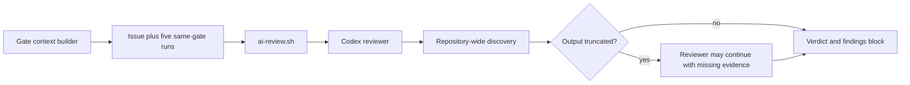

# Code-review reliability design

Issue: `71be6ae9` — Make code review issue-scoped, evidence-aware, and truncation-resistant

## Summary

The code-review gate will review the union of commits attributable to its context issue, consume only the latest useful prior-review evidence, and use a bounded inspection protocol that cannot silently lose relevant evidence to command-output truncation. The checker remains read-only and retains the existing `JIT-FINDINGS-JSON` wire format.

This design separates generic engine work from repository policy. Core jit compacts gate-local prior-run context without knowing anything about commit-message conventions. The repository prompt defines `jit:<short-id>` attribution because git is optional to the product and the tag convention belongs to this repository.

## Goals

- Give the reviewer an unambiguous, issue-attributable implementation footprint.
- Keep prior-review feedback useful without recursively injecting full prose from several rounds.
- Make the CI policy agree with the data actually present in gate context.
- Distinguish blocking issue-impact debt from advisory pre-existing debt.
- Prevent a verdict when relevant inspection evidence is still truncated.
- Preserve existing checker output parsing and stored gate-run compatibility.
- Produce deterministic policy tests and a durable live-run report.

## Non-goals

- Do not migrate to `codex exec --output-schema`.
- Do not make the jit engine depend on git or hardcode `jit:` tags.
- Do not attribute uncommitted changes to the issue automatically.
- Do not solve merged-commit build verification tracked by `45e1b7e8`.
- Do not turn code review into a repository-wide technical-debt audit.
- Do not change CI checkers to pass their complete stdout into code review; their latest status and exit code are sufficient.

## Current behavior and failure modes



The current context builder filters run history to the current gate, retains up to five complete `GateRunResult` values, clears stderr, and leaves full stdout intact. For AI review gates, this recursively carries several full review narratives even though `GateRunResult.findings` already stores the structured verdict, summary, and findings.

The current code-review prompt asks for provided test-run history, but the context contains only same-gate history. CI evidence is available through the issue's latest gate projections: gate key, status, exit code, and last-run time.

The prompt also lacks an attributable-footprint algorithm. Reviewers therefore improvise with working-tree diffs, broad commit ranges, or repository-wide searches. Large combined commands can truncate the exact patch or source evidence needed for a verdict.

## Decisions

### D-1: Repository policy owns commit attribution

For the context issue, construct the literal tag `jit:<short-id>`. Discover commits reachable from the current branch whose commit messages contain that literal tag. Inspect each tagged commit separately with rename and copy detection, and form the attributable footprint from the union of those individual patches.

Do not use one range from the earliest tagged commit to `HEAD`; unrelated commits may be interleaved. Do not automatically include working-tree changes. Tagged patches establish attribution, while the current tree establishes the behavior that will ship.

If no tagged commit exists, fall back to the issue description, success criteria, and linked documents. State that commit attribution was unavailable. The fallback remains issue-scoped and does not absorb uncommitted changes or become a whole-repository audit.

This logic belongs in `scripts/code-review-prompt.md`, not Rust domain or command code. That preserves git-optional operation and the domain-agnostic invariant.

### D-2: One compact prior run

Keep `GateContext.run_history` as `Vec<GateRunResult>` so schema consumers remain compatible, but emit at most the latest run for the current gate and issue.

Sanitize the selected run as follows:

1. Select the run with the greatest `started_at`; storage ordering must not be assumed.
2. Clear `stderr` unconditionally.
3. When `findings` is `Some`, retain `findings` and ordinary metadata but clear `stdout`.
4. When `findings` is `None`, retain `stdout` as the legacy compatibility fallback.
5. Do not include older runs.

The retained metadata includes the run id, gate key, status, timestamps, duration, exit code, commit, branch, command, actor, and optional message. The structured `GateFindings` value carries verdict, summary, and individual findings.

No stored `GateRunResult` is rewritten. Compaction applies only to the serialized checker context.

### D-3: Latest gate projection is CI evidence

The reviewer reads the latest status and exit code for required CI and validation gates from `context.issue.gates`. A latest successful run supersedes older failures. The prompt must not claim that cargo, clippy, or test stdout is present.

When a required CI gate is pending, failed, or errored, code review reports that current state. When it passed, the reviewer does not rerun it. Test adequacy is still reviewed from the attributable implementation and test changes. Test-first history is enforceable only when explicit evidence is available.

### D-4: Findings use issue-impact classification

Code-review findings use the classification fields already supported by `GateFinding`:

- `disposition`: `blocking` or `advisory`;
- `origin`: `issue-impact` or `pre-existing`.

An unresolved issue-impact defect or material issue-introduced technical debt is blocking. Useful unrelated existing debt is pre-existing advisory feedback and never changes a passing verdict to failure. An exhaustive pre-existing-debt search is not required.

The verdict is `fail` if and only if at least one unresolved issue-impact blocking finding exists. This mirrors documentation review while applying the code-review rubric.

### D-5: Review is explicitly read-only

The repository gate command in `.jit/gates.toml` invokes Codex with an explicit read-only sandbox. The prompt also states that the run is inspection-only: do not edit files, invoke issue-lifecycle skills, recover locks, claim or update issues, pass gates, or run other mutating commands.

Read-only commands such as `git log`, `git show`, `git diff`, `rg`, `sed`, `jit issue show`, `jit issue status`, `jit graph tree`, and `jit validate` remain allowed. If a supposedly read-only command fails because it attempts a write, report the limitation or use a genuinely read-only alternative; do not request wider permissions from inside the review.

### D-6: Inspection is staged and bounded

The prompt prescribes this order:

1. Read the issue, linked documents, latest gate projections, and latest prior structured findings.
2. Enumerate exact tagged commit hashes and subjects.
3. For each commit, inspect `--stat`, `--name-status`, and then its individual patch.
4. Build a unique changed-path list from all tagged patches.
5. Read current versions of those paths and directly affected callers, tests, docs, or configuration in bounded calls.
6. Search only relevant directories and patterns; never combine a full patch, full gate registry, and repository-wide search in one command.
7. If a response contains a truncation marker or omits a requested range, repeat the read with smaller path, commit, or line partitions.
8. Do not issue a verdict until every relevant truncated result has been recovered.

Truncation recovery means the reviewer obtains the missing evidence through narrower calls. Irrelevant output may be abandoned only after the reviewer explains why it is outside the attributable impact cone.

### D-7: Retain the findings protocol

Keep the `JIT-FINDINGS-JSON` markers and parser unchanged. `scripts/ai-review.sh` remains the canonical transport wrapper and appends the common findings/verdict contract. `scripts/code-review-prompt.md` defines code-review-specific classification and verdict rules without copying the full common block a second time.

Update `contrib/gates/ai-review.sh` in lockstep with the repository copy. The wrapper's common schema description must allow optional `disposition` and `origin`; the code-review prompt requires them for every code-review finding.

## Implementation map

### 1. Compact generic gate context

Primary file: `crates/jit/src/commands/gate_check.rs`

- Replace the five-run accumulation with latest-run selection by `started_at`.
- Extract a small pure helper, for example `compact_run_history_for_context`, taking an iterator or vector of runs plus the target gate key.
- Clone only the chosen run, clear stderr, and clear stdout when structured findings exist.
- Keep the serialized field name and type unchanged.
- Update rustdoc on `GateContext.run_history` in `crates/jit/src/domain/types.rs` to describe the compact latest-run contract.

Do not change storage persistence or `GateRunResult`; raw stdout remains stored for commands that explicitly display full run details.

### 2. Rewrite code-review policy

Primary file: `scripts/code-review-prompt.md`

- Add the issue-attribution algorithm from D-1.
- Add the staged inspection and truncation-recovery protocol from D-6.
- Replace the unavailable test-history language with latest gate-projection semantics from D-3.
- Replace blanket `No technical debt` and test-first assertions with D-4's causal classification and evidence rule.
- State the read-only restrictions from D-5.
- Require `disposition` and `origin` on every finding.
- Keep the existing architecture, safety, correctness, CLI, documentation, and JIT-management rubric, but apply it only to the attributable impact cone.
- Remove the duplicated common findings-block instructions; keep only code-review-specific additions and the concise review-content requirements.

### 3. Make the wrapper contract canonical

Files:

- `scripts/ai-review.sh`
- `contrib/gates/ai-review.sh`

Keep the scripts behaviorally identical. Their appended common contract remains responsible for the numbered finding list, total count, fenced JSON, and terminal verdict. Extend the documented finding example/rules to permit `disposition` and `origin` without requiring them for unrelated generic checkers.

Do not change the last-verdict parsing rule or the stored stdout/stderr behavior unless a regression test demonstrates that consolidation requires it.

### 4. Pin the read-only invocation

Primary file: `.jit/gates.toml`

Add the explicit Codex read-only sandbox flag to the `code-review` reviewer command while retaining `gpt-5.6-terra` and high reasoning. Do not change the selected models for plan, breakdown, or documentation review as part of this issue.

If the contributed gate example documents a reviewer command, update it to show read-only execution as the safe default for review.

### 5. Add policy and context regression tests

Rust context tests belong beside the existing gate-context tests in `crates/jit/src/commands/gate_check.rs` unless a focused integration test is materially clearer.

Required cases:

- no prior run serializes an empty array;
- several runs serialize only the newest by timestamp, regardless of storage order;
- a structured latest run keeps findings and metadata but has empty stdout/stderr;
- an unstructured latest run keeps stdout and clears stderr;
- older structured and unstructured runs are omitted;
- stored run results remain byte-for-byte/logically unchanged after context construction.

Add `crates/jit/tests/code_review_policy_test.rs`, following the pattern in `doc_review_policy_test.rs`. Assert stable policy phrases or semantic anchors for:

- literal `jit:<short-id>` commit attribution;
- individual patches rather than a broad range;
- intent/doc fallback and no automatic uncommitted attribution;
- latest gate status and exit-code semantics;
- issue-impact blocking versus pre-existing advisory debt;
- read-only/no lifecycle mutation;
- bounded staged reads and mandatory truncation recovery;
- required finding classifications;
- absence of the duplicated base findings block in the code-review prompt.

Extend `crates/jit/tests/ai_review_verdict_tests.rs` to exercise both wrapper copies with classified findings while preserving existing pass, fail, trailing-prose, and malformed-verdict behavior.

## Live verification and durable report

After deterministic tests pass:

1. Commit implementation changes with `jit:71be6ae9` in every attributable commit subject.
2. Run the required non-review gates.
3. Evaluate code review once to produce the representative live session.
4. Inspect its rollout record and gate artifact.
5. Write `dev/active/71be6ae9-live-review-report.md` containing:
   - Codex session id and gate run id;
   - tested issue id and exact tagged commit set;
   - model and reasoning effort;
   - prompt/context byte or token measurements;
   - latest prior-history shape;
   - required-gate status evidence observed;
   - command-output truncation events and how each was recovered;
   - final verdict and structured-findings parse result.
6. The report passes REQ-10 only when no relevant evidence remains truncated or missing.
7. Link the report to `71be6ae9` with document type `report`.
8. Re-run affected gates after linking the report so final gate evidence covers the complete issue state.

The implementation design itself is linked separately with document type `design`.

## Verification commands

Use the narrowest relevant checks during development, then run the required gates:

```bash
cargo test test_check_gate_run_history
cargo test --test ai_review_verdict_tests
cargo test --test code_review_policy_test
cargo fmt --all -- --check
cargo clippy --workspace --all-targets
jit validate 71be6ae9
```

Do not manually rerun the full Rust suite after a successful recorded `cargo-ci` gate solely for code review.

## Risks and mitigations

- **Legacy checker loses prior prose:** retain stdout when structured findings are absent.
- **Structured checker needs full prose for nuance:** require complete remediation text in structured summaries/findings; raw stdout remains available through explicit run-history commands.
- **Storage order selects the wrong run:** compare `started_at` explicitly.
- **Prompt-only attribution drifts:** pin semantic anchors with policy regression tests and a live run.
- **Read-only sandbox blocks a diagnostic:** keep the allowed command set read-only and test the actual configured invocation.
- **A reviewer hides truncation by ignoring it:** require explicit recovery before verdict and record recovery in the live report.
- **Generic engine gains repository assumptions:** keep commit tags and git commands out of Rust context construction.
- **Wrapper copies diverge:** exercise both scripts in the same regression test module.

## Implementation checklist

1. Write failing context-compaction tests.
2. Implement the pure latest-run compaction helper.
3. Update `GateContext` documentation.
4. Write failing code-review policy tests.
5. Rewrite the prompt using the decisions above.
6. Consolidate the common output contract in both wrapper scripts.
7. Add classified-findings wrapper tests.
8. Pin the code-review gate to a read-only sandbox.
9. Run focused tests and formatting.
10. Commit every implementation unit with the issue tag.
11. Run required gates and perform the live verification protocol.
12. Save and link the live report, then re-run affected gates.

## Completion evidence

The issue is complete only when every hard criterion maps to deterministic test output or to the linked live-review report. A passing live verdict alone is insufficient if the session record shows unresolved truncation, an unattributed working-tree diff, missing required-gate state, or lifecycle mutation attempts.
