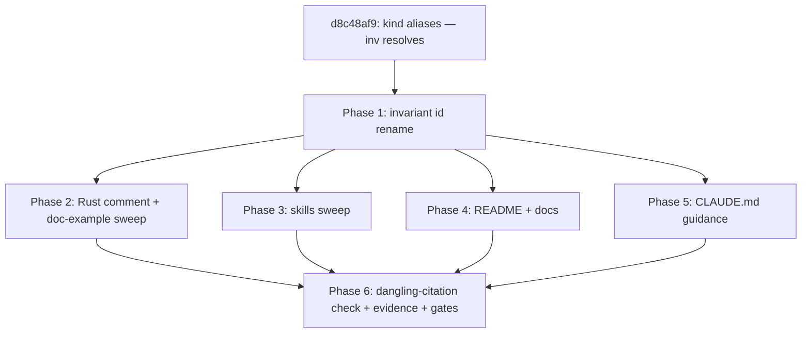

# SSOT Adoption Sweep: Cite @-Addresses Instead of Copying Item Text

**Issue:** 76cb968b
**Type:** enhancement
**Priority:** normal
**Date:** 2026-07-06

## Problem Statement

Epic 2821e177 made project knowledge addressable (`@/<kind>/<self-id>` over invariants, rules, gates, requirements, definitions), but the authored surfaces still copy prose: skills paste invariant/rule text into dispatch prompts and review protocols, README/docs restate registry content, and CLAUDE.md guidance paraphrases rule/gate behavior. Copied text re-creates the drift problem the epic solved. The sweep converts each occurrence per a three-tier rule (projection / gloss + address / bare address + resolve) so the registry stays the single source of truth.

Folded scope: invariant self-ids (`INV-LABEL-FORMAT`, all-caps, kind double-encoded) are renamed to the lowercase-kebab form rules and gates already use (`@/invariant/label-format`), so the addresses the sweep cites are uniform across kinds. A sibling task (d8c48af9, dependency) adds config-declared kind aliases so `@/inv/<id>` resolves as a shorthand; skill files and code comments cite that form.

## Success Criteria

Copied from the issue description (authoritative there):

- [ ] [hard] REQ-01: every repo-tracked skill file that restates invariant/rule/gate content is converted per the tier rule — behavioral text to bare address (tier 3), explanatory text to clause-length gloss + address (tier 2) — and each dispatch-prompt template carries the standing resolve instruction; invariant citations in skill files use the `@/inv/…` alias form; a sweep table (file -> tier -> change) is linked to this issue via `jit doc add` as evidence.
- [ ] [hard] REQ-02: README and docs/ introduce the addressing scheme and the cite-the-address convention; quoted registry content carries its address; renderer-owned projections stay inline and are identified as such.
- [ ] [hard] REQ-03: CLAUDE.md guidance cites addresses for rule/gate/invariant references outside the rendered invariant region.
- [ ] [hard] REQ-04: every `@/…` address cited by the swept surfaces (skills, README, docs, CLAUDE.md, Rust comments) resolves via `jit item show` (dangling-citation check attached as evidence); `jit validate` stays green.
- [ ] [hard] REQ-05: every invariant self-id is lowercase-kebab without a kind prefix, uniform with rule and gate self-ids: the registry, the config id-pattern, the `jit init` scaffold, and the rendered CLAUDE.md region all agree; `jit item show @/invariant/<id>` resolves all eight renamed ids; `jit invariant check` stays green; no `INV-`-prefixed invariant id remains outside historical documents.
- [ ] [hard] REQ-06: Rust comments and doc-comment examples cite invariants by address in the `@/inv/<self-id>` alias form, and doc-comment example ids follow the lowercase convention; `cargo clippy --workspace --all-targets` and `cargo fmt --all -- --check` stay clean.

## Design

### Sequencing

d8c48af9 lands first (separate issue, own lifecycle): without it, `@/inv/…` citations would dangle and REQ-04/REQ-06 cannot hold simultaneously. After it lands, reinstall the binary (`cargo install --path crates/jit`) before relying on alias resolution from PATH.

### Invariant id rename (REQ-05)

Rename map (strip `INV-`, lower-case):

| Old | New |
|---|---|
| INV-LABEL-FORMAT | label-format |
| INV-NAMESPACE-REGISTRY | namespace-registry |
| INV-DAG-ACYCLIC | dag-acyclic |
| INV-GATE-SEMANTICS | gate-semantics |
| INV-EVENT-LOG | event-log |
| INV-ATOMIC-WRITES | atomic-writes |
| INV-ASSIGNEE-FORMAT | assignee-format |
| INV-DOMAIN-AGNOSTIC | domain-agnostic |

`@/invariant/label-format` and `@/rule/label-format` coexist: the kind segment disambiguates, and the invariant's `enforced-by = "@/rule/label-format"` illustrates exactly why the segment carries the kind. No `enforces:` labels are in live use on issues, and no `@/invariant/…` citations exist yet in docs/skills, so the rename has no reference-fixup tail beyond what this issue itself sweeps.

Touch points:

1. `.jit/invariants.toml` — eight `id` fields.
2. `.jit/config.toml` — `[item_kinds.invariant].id-pattern` to `[a-z][a-z0-9-]*` (same as rule/gate; the old `[A-Z][A-Z0-9]*-[0-9]+` never matched the digit-less real ids anyway); `namespaces.enforces` examples to `enforces:@/invariant/label-format`-style.
3. `crates/jit/src/hierarchy_templates.rs` — the `jit init` scaffold mirrors both config edits (two occurrences of the invariant kind block, plus the enforces examples) and gains `aliases = ["inv"]` once d8c48af9 defines the field.
4. `jit invariant render` — re-projects the CLAUDE.md region; verify with `jit invariant check`.
5. Issue-scope sugar safety: project kinds take no part in issue-line indexing, and rule/gate already share the lowercase pattern, so the pattern change adds no ambiguity.

### Rust comment and doc-example sweep (REQ-06)

- ~25 code comments citing bare `INV-…` ids (errors.rs, config_store.rs, gitattributes.rs, output.rs, queries.rs, document.rs, issue.rs, hierarchy.rs, dependency.rs, bulk_update.rs, gate.rs, mod.rs, types.rs, graph.rs, memory.rs) become `@/inv/<new-id>` citations, e.g. `(INV-DAG-ACYCLIC)` -> `(@/inv/dag-acyclic)`.
- Doc-comment examples using `INV-01` as a sample invariant id (`cli.rs`, `domain/item.rs`, `validation/projection.rs`) switch to lowercase example ids consistent with the new pattern; tests that construct arbitrary ids follow suit where they exercise the invariant kind's pattern.
- Historical documents (`dev/archive/`, `dev/sessions/`, `dev/studies/`, CHANGELOG) keep original wording.

### Skills sweep (REQ-01)

Surfaces: `.claude/skills/{jit-manage,jit-breakdown,jit-parallel,jit-execution-lead,jit-planning-lead,jit-project-lead}` including `references/` and `scripts/`. Known citation sites from the survey: jit-project-lead `references/standards-fix.md`, `references/coherence-review.md`, `references/wave-layering.md`, `scripts/standards-fix.sh` (INV-… restatements); dispatch-prompt templates in the lead skills; gate-semantics passages. Per file, classify each registry-content occurrence into tier 1/2/3 and edit accordingly; dispatch-prompt templates gain the one standing resolve instruction; lead review protocols gain the resolve-check step. Invariant citations in skills (tier 2 and tier 3 alike) use the `@/inv/…` alias form; rule and gate citations use their canonical segments. Skill-owned rules (lead-invariant sections) stay prose. `jit-planning-lead/evals/results.md` is a historical eval record — leave it. Deliverable: sweep table (file -> tier -> change) at `dev/active/76cb968b-sweep-table.md`, linked via `jit doc add`.

### README + docs (REQ-02) and CLAUDE.md (REQ-03)

- README: a section introducing addressable project knowledge, `jit item show/list/search`, the cite-the-address convention, the `@/inv` alias, and the note that user-global skill copies under `~/.claude/skills/` sync from the repo-tracked ones.
- docs/: introduce the addressing scheme where reference/how-to content quotes registry items; add the address after each quote (tier 2); point at `docs/reference/rules-and-gates.md` as the rendered SSOT example and mark renderer-owned projections as such; document the `enforces:@/…` label convention.
- CLAUDE.md: guidance outside the `jit:invariants` region cites addresses instead of restating rule/gate behavior.

### Verification harness (REQ-04)

Dangling-citation check: extract every `@/[a-z-]+/[A-Za-z0-9._-]+` token from the swept surfaces (skills, README, docs/, CLAUDE.md, Rust sources), resolve each unique address with `jit item show`, and record the pass/fail table as `dev/active/76cb968b-citation-check.md`, linked via `jit doc add`. Alias addresses (`@/inv/…`) must resolve through the alias path.

## Implementation Steps

1. **Wait on d8c48af9** (kind aliases) — implement it as its own issue first; reinstall the jit binary after it lands.
2. **Phase 1 — rename:** edit `.jit/invariants.toml`, `.jit/config.toml` (pattern, enforces examples, `aliases = ["inv"]`), `crates/jit/src/hierarchy_templates.rs` scaffold; run `jit invariant render`; verify `jit item show @/invariant/<id>` for all eight, `jit item show @/inv/<id>` spot-checks, `jit invariant check`, `jit validate`.
3. **Phase 2 — code sweep:** update Rust comments to `@/inv/…`; update doc-comment example ids; `cargo test && cargo clippy --workspace --all-targets && cargo fmt --all`.
4. **Phase 3 — skills sweep:** tier-classify and edit the six skills + references + scripts; write the sweep table.
5. **Phase 4 — README + docs:** addressing-scheme introduction, tier-2 glosses, projection callouts, `enforces:` convention.
6. **Phase 5 — CLAUDE.md:** address citations outside the rendered region.
7. **Phase 6 — verify:** run the dangling-citation check, link both evidence docs (`jit doc add 76cb968b … --doc-type report`), run gates (`jit gate evaluate-all 76cb968b`), complete.

Commits: code and doc edits in feature commits per phase (`feat(jit:76cb968b): …` / `docs(jit:76cb968b): …`); `.jit/` state changes in separate chore commits.

## Testing Approach

- `cargo test` (unit + harness + integration) after phases 1–2; `cargo clippy` zero warnings; `cargo fmt --all -- --check`.
- `jit invariant check` and `jit invariant render` idempotence (second render is a no-op diff).
- `jit item show` resolution for all eight canonical addresses and the `@/inv/…` alias forms.
- Dangling-citation check over all swept surfaces (REQ-04 evidence).
- `jit validate` green; gates: cargo-ci, repo-validate, code-review.

## Risks and Open Questions

- **Citation-form split:** skills and Rust comments cite `@/inv/…` (brevity in agent-facing text); README, docs, and CLAUDE.md cite canonical `@/invariant/…` (self-descriptive for readers being introduced to the scheme). Two spellings for one kind is deliberate; the alias task documents that they are the same namespace.
- **id-pattern semantics:** the old pattern never matched the real ids, which suggests patterns are not validated against registry ids; if implementation finds a validator that does check, the pattern change is load-bearing and needs a test.
- **Stale binary:** alias resolution and the rename must be exercised against a freshly installed binary (`cargo install --path crates/jit`), not a stale PATH copy.
- **Scope guard:** `~/.claude/skills/` user-global copies stay untouched; only the README note covers the sync expectation.
