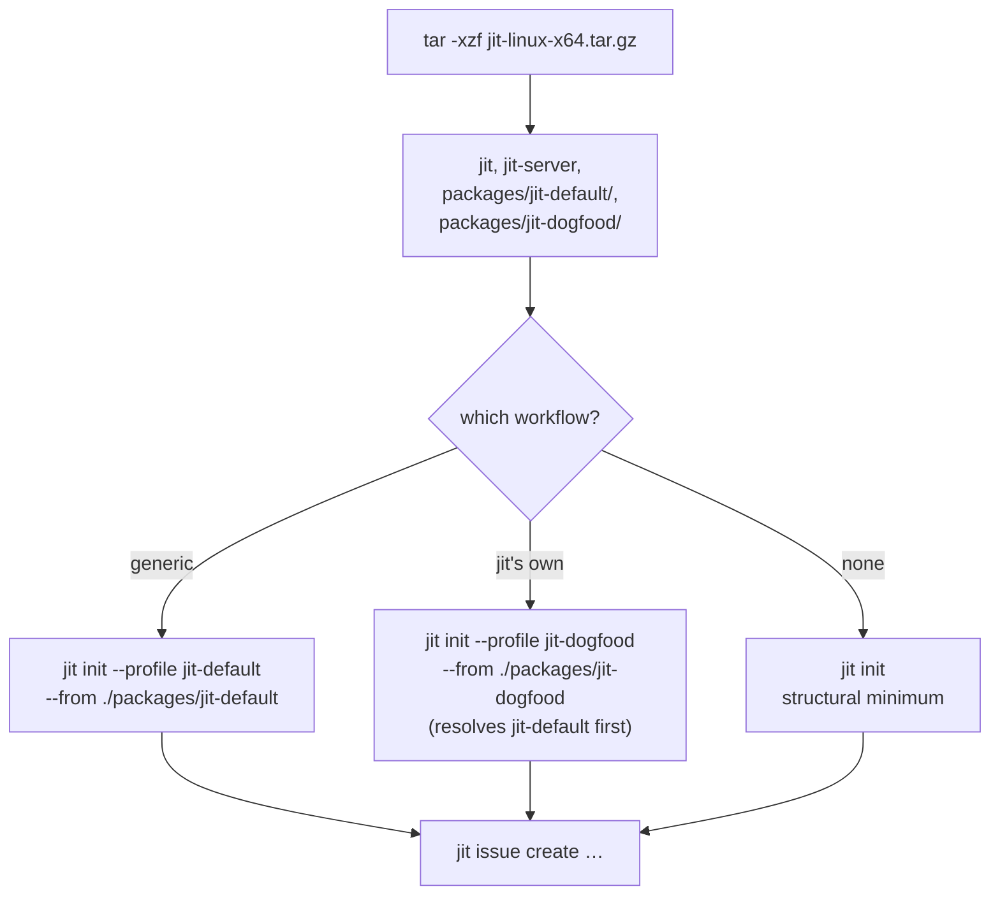
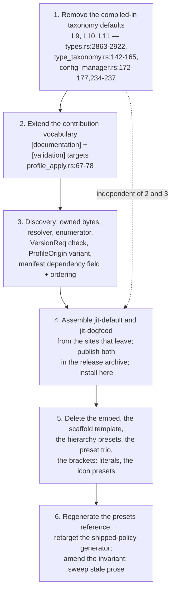

# Findings — The binary's declarative configuration, inventoried and sequenced (7cbefe7c)

> **Diátaxis Type:** Explanation (research findings)
> Investigated at `6dec4c3a`. Every claim about current behaviour cites
> `file:line` at that revision. Four claims are backed by experiments run
> against the installed binary; each names its result inline. Where the code
> could be read and was not, the section says so.

## Scope

`@/issue/e204e63d/decision/D-13` is applied at its strictest reading: the binary
carries the mechanisms that interpret repository configuration and no instance of
that configuration. `@/issue/e204e63d/decision/D-12` keeps defaults for
*mechanism parameters*. This report establishes the complete inventory, the
destination of each site that leaves, the composition mechanism
`@/issue/e204e63d/decision/D-14` requires, the shape `jit init` takes afterwards,
one ordering extending `dev/active/a62d444d/findings.md` §5.3, and the
consequences for work this epic has already delivered. It does not weigh the
direction, and it re-argues none of `D-13` through `D-18`.

Three results are worth reading first, because each cuts against the shape the
survey assumed:

- **The largest site is not in the survey.** Three independent copies of the
  four-level type hierarchy and one copy of a three-namespace registry live in
  `Default` impls and fallback branches with no greppable constant
  (`domain/types.rs:2863-2907,2910-2922`, `domain/type_taxonomy.rs:142-165`).
  They are reached whenever `config.toml` omits `[namespaces]` or
  `[type_hierarchy]`, and they make `D-13`'s "bare `jit init` writes the
  structural minimum" unreachable until they go. Proven by experiment (§2.4.1).
- **`D-17`'s stated ground does not hold today, and this is why.** `D-17` keeps
  four rules because each "produces nothing without" an adopter registry. Two of
  them produce a full rule and a full JSON-Schema projection from the compiled
  defaults above when the adopter declares no registry at all (§2.4.1). `D-17` is
  correct about the rules; the site that falsifies its premise is the `Default`
  impl, not the rule.
- **Step 1 of `a62d444d` §5.3 has already executed.** `jit validate` no longer
  loads the package unconditionally: it lists `.jit/profiles/`, reads the
  recorded ids, and resolves a package only for a recorded one
  (`commands/validate.rs:588-600,702-736`). Issue `229e7389` delivered it. The
  ordering in §5 therefore starts at a62d444d's step 2, and the one absolute
  edge that investigation found is already discharged.

Costs with no route back are in §8. Owner decisions are in §9.

## Methodology

- Read the issue and the container in full, resolved `D-12` through `D-18` with
  `jit item show`, and resolved `@/invariant/domain-agnostic`, `@/charter/D-1`,
  `@/charter/D-2`, `@/charter/D-8`, `@/charter/D-16` fresh rather than through
  any document's quotation.
- Read `dev/active/a62d444d/findings.md` whole. Its line citations are at
  `170436cd`; every one this report reuses was re-resolved at `6dec4c3a`, and the
  three that moved are noted in §6.1.
- Established the inventory by reading, not by extending the survey: read each
  named site plus every `Default` impl and literal-bearing constructor reachable
  from configuration loading, then swept `crates/`, `mcp-server/`, `web/` for the
  five classes `D-13` enumerates and verified every candidate line by reading it.
  Four sites the survey named are rejected or corrected (§2.5); nine sites it
  could not reach are added (§2.4).
- Ran four experiments against the installed binary in throwaway directories:
  plain `jit init`; `jit init` over a `config.toml` declaring neither
  `[namespaces]` nor `[type_hierarchy]`; `jit item list --kind invariant` with no
  `.jit/invariants.toml`; `jit validate` in both. Results in §2.4.1 and §4.1.
- Parsed `profiles/jit-dogfood/manifest.toml` rather than grepping it, because
  the region source also sits under the live asset prefix.

---

## 1. The test, stated so a reviewer can apply it (REQ-01, REQ-02)

`D-17` is the worked example the boundary is calibrated against, so the test is
read off it rather than invented:

> A site is **mechanism** when its assertion *and* its membership derive from
> declarations the adopter supplies, and it produces nothing when the adopter
> supplies none. A site is an **instance** when it produces content the adopter
> did not declare — whether that content names this repository or is generically
> opinionated.

Two clauses matter and are checked separately, because a site can pass the first
and fail the second. `namespace-registry` derives its assertion from
`[namespaces]` (`repository_state/default_rules.rs:134-147`) — first clause,
passed. It also emits a full rule with a compiled-in membership when
`[namespaces]` is absent (§2.4.1) — second clause, failed, because
`config_manager.rs:172-177` substitutes `LabelNamespaces::default()`. The rule is
mechanism; the substitution is the instance. Classifying the *rule* would have
kept the instance.

`D-12`'s admitted class is narrower than "a default": a **mechanism-parameter
default** is a value the adopter can override through a declared key, whose only
effect when unoverridden is to name one parameter of a mechanism that is doing
something regardless. `DEFAULT_PLANNING_ROLE` (`templates.rs:206`) names which
role a template's own node binding resolves to (`templates.rs:239-247`); with no
templates declared it produces nothing. `LabelNamespaces::with_defaults()`
(`domain/types.rs:2863`) produces a whole registry out of nothing. The two are
not the same shape, and §2 states per site which one applies.

**The reviewer's test, per site:** remove the site and ask what an adopter who
declared nothing now receives. If the answer is "less content they did not ask
for", the site was an instance. If the answer is "a mechanism that now cannot
name its own parameter", the site was a `D-12` default.

---

## 2. The inventory (REQ-01, REQ-02)

Twenty-seven classified sites, in three groups: **17 leave**, **10 stay as
mechanism**, and **3 of the 9 the survey named are rejected or corrected**. The
count is per site, not per line; §2.6 gives the arithmetic.

### 2.1 Sites that leave — the profile and the preset trio

Already scoped by `a62d444d`; re-resolved at `6dec4c3a` and repeated here so the
inventory is complete.

| # | Site | What it carries | Destination | Why it is an instance |
|---|---|---|---|---|
| L1 | `profile/dogfood.rs:8-9` | `include_dir!` of `profiles/jit-dogfood/` — 65 files, 423 029 bytes, 29 semantic contributions | **`jit-dogfood`**, discovered from disk | Every byte is one repository's declared workflow; an adopter receives it without declaring it. |
| L2 | `gate_presets/builtin.rs:22-53` | `BuiltinPresets`, whose whole content is the gate keys of one workflow's `plan` template (`:35` → `profile/dogfood.rs:70-117`) | **deletion** | Its membership comes from a package, not from the adopter. The same three definitions already reach a repository as `jit-dogfood` gate contributions (`manifest.toml`: `plan-review`, `breakdown-review`, `coverage-preview`). |
| L3 | `gate_presets/planning.rs:35,38,41,44` and `:56-98,100-114` | Four preset/gate name constants and the three constructors that build them from the embedded package | **deletion** | Each names one workflow's gate. Nothing here interprets a declaration. |
| L4 | `gate_presets/planning.rs:206-209` | `preview_coverage_rule` inserts the literal `container-from-label = "brackets"` | **deletion** with its module | A label namespace, which `D-13` enumerates by name. See §2.5.2: this **contradicts** `a62d444d` §2.2, which classified the function as engine-shaped. |
| L5 | `gate_presets/reference.rs:23,28,89,219` | The projection of the built-in presets into `docs/reference/gate-presets.md` | **partial deletion + regeneration** | Its subject is L2/L3. Its remaining subject — the portable-checker syntax reference from `:25` onward — is mechanism documentation and survives. |

### 2.2 Sites that leave — the configuration `jit init` writes

This is the bulk of the change and the part the survey mislocated (§2.5.1).

| # | Site | What it carries | Destination | Why it is an instance |
|---|---|---|---|---|
| L6 | `config.rs:488-524` (`SHIPPED_DOCUMENTATION_POLICY`) | `dev`, `dev/archive`, 8 managed areas, 6 permanent entries (including this repository's own `dev/TESTING.md` and `dev/authoring-conventions.md`), 4 issue-scoped areas | **`jit-default`** | A documentation-area classification, named by `D-13`. Its own doc comment already calls it "Configuration the tool writes for an adopter, not classifier logic" (`config.rs:445-448`). Needs a contribution target that does not exist (§3.2.1). |
| L7 | `hierarchy_templates.rs:93-340` (`generate_config_toml`'s body) | The whole `.jit/config.toml` an adopter receives: `[type_hierarchy]` (`:104,107,112`), seven `[namespaces]` entries (`:151-184`), six `[item_kinds]` declarations (`:205-268`), `[validation] strictness` / `default_type = "task"` (`:125,128`), the `[documentation]` table (`:289-297`), and commented `[coordination]`/`[worktree]`/`[locks]` guidance (`:303-324`) | **`jit-default`** | Four of `D-13`'s five classes appear here literally. `default_type = "task"` is a type name; the `[item_kinds]` block is six item-kind declarations. |
| L8 | `hierarchy_templates.rs:350-368,371-391,394-412,415-429` | Four named hierarchy presets — `default`, `extended`, `agile`, `minimal` — each a type-name→level map plus label associations | **`jit-default`** carries one; the other three are **deleted** | A named bundle of values selected by name is the shape `D-12` excludes. Adopter-visible through `jit init --hierarchy-template` (`cli.rs:43-46`, resolved `main.rs:2095-2112`) and `jit config list-templates` (`cli.rs:2582`, `main.rs:6329`); both surfaces lose their subject (§4.3). |
| L9 | `domain/types.rs:2863-2907` (`LabelNamespaces::with_defaults`) | Namespaces `component`, `type`, `team`; the four-level hierarchy; three label associations; strategic types `["milestone","epic"]` | **deletion** — the `None` branch at `config_manager.rs:172-177` returns an empty registry | Produces a complete registry from no declaration. This is the site that falsifies `D-17`'s premise (§2.4.1). |
| L10 | `domain/types.rs:2910-2922` (`get_type_hierarchy`) | A second copy of the four-level map, returned when `type_hierarchy` is `None` | **deletion** | Same shape as L9, reached from a different caller. |
| L11 | `domain/type_taxonomy.rs:142-165` (`HierarchyConfig::default`) | A third copy of the four-level map plus its associations, returned at `config_manager.rs:234-237` when `[type_hierarchy]` is absent | **deletion** | Same shape as L9. It is what the `orphan-leaf` and `strategic-consistency` graph rules evaluate against in an unconfigured repository. |
| L12 | `type_icons.rs:25-33` (`PRESETS`) | Four named icon bundles — `simple`, `navigation`, `minimal`, `construction` — selected by `[type_hierarchy.icons] preset` | **deletion** (recommended) or `jit-default` | A named bundle of content selected by name, adopter-visible through `GET /config/hierarchy` (`config_manager.rs:142-162` → `crates/server/src/routes.rs:975`). `custom` (`type_icons.rs:51-52`) already expresses any of them per type, so removing them removes no capability. `DEFAULT_ICONS_BY_LEVEL` (`:36-41`) and `LEAF_ICON` (`:44`) stay — see S7. |
| L13 | `repository_state/default_rules.rs:199-220` | `orphan-leaf` and `strategic-consistency` | **`jit-dogfood`** (`D-17`) | Each encodes a workflow opinion — that a leaf must carry a parent-membership label, that a strategic type must carry its own. Neither derives from a declaration; both are emitted unconditionally (`:196-198` states this). The `[[rules]]` contribution target already exists (`repository_state/profile_apply.rs:84`) and `jit-dogfood` already contributes three rules. |

### 2.3 Sites that leave — smaller instances

| # | Site | What it carries | Destination | Why it is an instance |
|---|---|---|---|---|
| L14 | `commands/breakdown.rs:477` and `commands/template.rs:999` | `format!("brackets:{}", …)` — the `brackets:` label namespace, hardcoded twice, independently | **deletion**; read the label from the template's declared breakdown node | A label namespace, which `D-13` enumerates. The declaration already exists in the package: the `plan` template's breakdown node declares `labels = ["brackets:{container.short_id}"]` (`profiles/jit-dogfood/manifest.toml`, template `plan`; documented form at `templates.rs:676`). The engine reconstructs by literal what the template already states. |
| L15 | `mcp-server/index.js:43` | `"Gates are quality checkpoints (tests, clippy, fmt, code-review)"` in `SERVER_INSTRUCTIONS`, sent to every connected client | **rewording** (deletion of the instance) | Those four are this repository's own gate keys, presented to every adopter as the vocabulary. Line `:44` of the same block already states the correct rule for labels; the gate line contradicts it. |
| L16 | `mcp-server/curated-tools.json:50,51,53` | `"@/inv/dag-acyclic"`, `"requirements and invariants"`, `"the namespace-registry invariant"` in shipped tool descriptions | **rewording** | Item-kind names and this repository's item ids in adopter-facing text. |
| L17 | `web/src/components/Graph/GraphView.tsx:571-579` and `web/src/components/Labels/LabelBadge.tsx:13-19` | A hardcoded `{milestone:1, epic:2, story:3, task:4, bug:4}` hierarchy used when `GET /config/hierarchy` fails, and a namespace→colour map keyed on `milestone`/`epic`/`component`/`type`/`team` applied unconditionally | **deletion**; render without a hierarchy, and key colours off the namespace list the API already serves | Type names and label namespaces in shipped bundle content. The colour map is not even a fallback: the app fetches `/config/namespaces` elsewhere and never consults it here. |

**Deliberately not on this list:** the web UI's state and priority maps
(`GraphView.tsx:35-43,45-57`, `ClusterNode.tsx:36-44,46-51`,
`IssueDetail.tsx:256-264,266-271`, `index.css:23-29,54-60`). `State` and
`Priority` are closed engine enums, not adopter vocabulary; a map over them is
mechanism over engine wire values. Their sixfold duplication is a
`@/invariant/convention-convergence` finding, not a `D-13` one.

### 2.4 Sites that stay — with the test a reviewer can run

| # | Site | Reviewer test |
|---|---|---|
| S1 | `default_rules.rs:119-190` — `label-format`, `namespace-registry`, `type-hierarchy-known`, `namespace-unique-<ns>` (`D-17`) | Delete `[namespaces]` and `[type_hierarchy]` from `config.toml` and re-scaffold: the rule set must shrink to `label-format` alone. **This test fails today** and passes only once L9–L11 are removed (§2.4.1). `label-format` itself asserts the label grammar (`:69`), which is engine wire format, character-identical to `labels.rs` and guarded by `test_canonical_label_regex_matches_labels_module`. |
| S2 | `templates.rs:206,210,214` — `DEFAULT_PLANNING_ROLE`, `DEFAULT_BREAKDOWN_ROLE`, `DEFAULT_CONTAINER_ANCHOR` (`D-12`, explicit) | Declare `[roles]`/`[anchors]` in `.jit/templates.toml` and no constant is consulted (`:239-247,269-273`). With no template declared, all three produce nothing. |
| S3 | `runtime_defaults.rs:22,26,31,35` — lock timeout, poll interval, cleanup threshold, lease TTL | **Confirms the lead's reading.** None is a type name, namespace, item kind, area classification, or workflow rule; none is written into any repository as a declaration; each parameterizes a mechanism that runs regardless. One caveat: the scaffold renders `CLAIM_TTL_SECS` and `DEFAULT_STALE_THRESHOLD_SECS` into *commented* `[coordination]` guidance (`hierarchy_templates.rs:310-311,337-338`). When L7's body moves to `jit-default`, that comment becomes packaged prose and stops being a projection of the constant — see §4.2. |
| S4 | `domain/item.rs:55,60,64` — `DEFAULT_ITEM_SECTION`, `DEFAULT_ITEM_ID_PATTERN`, `DEFAULT_ITEM_LINK_NAMESPACE` | **A survey site this reading corrects.** They are `D-12` defaults *and* unreachable from any adopter declaration: `JitConfig::load` rejects a partial `[item_kinds.X]` table (`config.rs:742`, enforced `config.rs:1712`), and with no table the kind set is empty (asserted at `hierarchy_templates.rs:640`). Removing them changes no byte any adopter receives. `@/invariant/canonical-cutover` argues for deleting them as dead defaults; `D-13` does not require it. |
| S5 | `validation/graph.rs:65,68,71` — `DEFAULT_SATISFIES_NAMESPACE`, `DEFAULT_CRITERIA_SECTION`, `DEFAULT_ID_PATTERN` | Author a `label-coverage` rule declaring `satisfies-namespace`, `criteria-section`, and `id-pattern` and no default is consulted. With no such rule declared they produce nothing. They duplicate S4 and `declarations/rules.rs:1067,1451` — a `convention-convergence` finding, not a `D-13` one. |
| S6 | `labels.rs:115` — `TYPE_NAMESPACE = "type"` | The closest call after L12. It is the wire encoding of the engine's own type concept, with no override path anywhere in the config surface: `[type_hierarchy]` declares type *values*, `[namespaces.type]` declares that namespace's description and uniqueness, and neither renames the encoding. Same class as a `State` variant name. Stays. |
| S7 | `type_icons.rs:36-41,44` — `DEFAULT_ICONS_BY_LEVEL`, `LEAF_ICON` | Keyed on hierarchy *level*, never on a type name (proven by the module's own `test_resolve_icons_with_custom_names` at `:253-268`, which resolves `objective`/`initiative`/`feature`/`action`). A `D-12` default for a presentation mechanism. |
| S8 | `commands/hooks.rs:7-8,25-68` — the two embedded hook scripts | **A survey site this reading rejects, with a caveat.** The scripts carry no type name, namespace, item kind, area classification, or workflow rule: they read `enforce_leases` from `config.toml`, `.jit/issues/*/issue.json`, and `.git/jit/claims.index.json` — engine layout, the same class as `crates/server/src/watcher.rs:89-116`. They are lease enforcement expressed in bash because git's hook interface is a file. **Caveat:** they are compiled-in bytes the binary publishes into a repository, which is `D-13`'s shape even where the content test says mechanism, and `jit-dogfood` already publishes an executable asset (`contrib/gates/ai-review.sh`), so moving them to `jit-default` costs nothing mechanically. §9.3 puts this to the owner. Separately, `scripts/hooks/pre-commit:36` matches `.jit/gates/registry.json` and `.jit/type-hierarchy`, neither of which exists — a stale-path defect worth filing regardless of the ruling. |
| S9 | `crates/server/**` | Every taxonomy answer is delegated: `routes.rs:178` (`get_hierarchy_config`), `:182` (`resolve_hierarchy`), `:195` (`type_label_value`), `:936,962,1007` (`get_namespaces`), `:975` (`get_hierarchy_icons`). A sweep of production code outside `#[cfg(test)]` returns no type-name or namespace literal. `watcher.rs:89-116` names `.jit` filenames — repository layout, not declarations. |
| S10 | `mcp-server/lib/schema-loader.js:22`, `lib/tool-generator.js:300-302` | The tool surface is generated at every process start from `jit --schema`; no schema artefact is checked in. `curated-tools.json` curates *jit's own commands*, whose subject is the CLI rather than any adopter's configuration; it stays (the three descriptions in L16 are what leaves). |

#### 2.4.1 The experiment that settles L9–L11 and S1

A repository whose `config.toml` declares neither `[namespaces]` nor
`[type_hierarchy]`, then initialized:

```bash
d=$(mktemp -d); cd "$d"; git init -q .
mkdir .jit; printf '[version]\nschema = 2\n' > .jit/config.toml
jit init
```

`config.toml` is preserved unchanged (`commands/init.rs:223-234` keeps an
existing one), and `.jit/rules.toml` is nevertheless written with seven rules —
`label-format`, `namespace-registry`, `type-hierarchy-known`,
`namespace-unique-team`, `namespace-unique-type`, `orphan-leaf`,
`strategic-consistency` — and `.jit/schemas/default-namespace-registry.json`
carries:

```json
"pattern": "^(component|epic|milestone|story|team|type):"
```

with `default-type-hierarchy-known.json` enumerating
`epic|milestone|story|task`. `jit validate` passes.

The route is `InitializationScaffold::from_config` (`initialize.rs:206-234`) →
`namespaces_from_config` (`config_manager.rs:172-177`), whose `None` branch
returns `LabelNamespaces::default()` → `with_defaults()`
(`domain/types.rs:2941-2944,2863-2907`). Six namespace names and four type names
the adopter never declared reach their repository as a committed rule set and two
committed JSON schemas.

This is the single most consequential entry in the inventory. It is also why
`D-17` is right about the rules and why the rules cannot be *shown* to be
mechanism until L9–L11 land: `namespace-registry` and `type-hierarchy-known` are
config projections over a registry the engine supplies when the adopter does not.

### 2.5 Survey sites this reading rejects or corrects

**2.5.1 `crates/jit/src/commands/init.rs` does not hold the scaffolded template.**
The survey named it as "the scaffolded `.jit/config.toml` template". `init.rs`
orchestrates: it resolves a `HierarchyTemplate` (`main.rs:2095-2112`), preserves
an existing `config.toml` (`init.rs:223-234`), and publishes one delta
(`init.rs:62-218`). The template body is `HierarchyTemplate::generate_config_toml`
at `hierarchy_templates.rs:63-340`, and the file bytes are rendered by
`render_repo_config` at `repository_state/initialize.rs:48-63`. Planning the edit
against `init.rs` would find no template there.

**2.5.2 `preview_coverage_rule` is not engine-shaped under `D-13`.**
`a62d444d` §2.2 and §10.3 classify it as "a pure rule transform parameterized by
`breakdown_type`" needing "a home or a deliberate removal". Its body inserts the
literal `"brackets"` as a label namespace (`gate_presets/planning.rs:206-209`),
which `D-13` enumerates. It also has no production caller: the only references in
`crates/` are the re-export (`gate_presets.rs:24`), its own doc example
(`:144-157`), its unit tests (`:315,366`), and two integration tests that assert a
*documentation example* declares the equivalent rule
(`tests/fast_docs_templates/research_bracket_tests.rs:117`,
`tests/fast_docs_templates/sdd_bracket_tests.rs:109`). It is deleted with its
module; nothing needs a home.

**2.5.3 `GENERATED_ARTIFACTS` is not in an adopter binary and is not
configuration.** The survey named `generated_artifacts.rs:80`. Three grounds
reject it. First, the module is `#[cfg(any(test, feature = "test-support"))]`
(`lib.rs:20-21`), so no adopter build carries it — its own header says so
(`generated_artifacts.rs:20-22`). Second, its content is this repository's
generator scripts and committed doc targets; it is never applied to any
repository. Third, it is none of `D-13`'s five classes. It stays. **It does
change under `D-15`** — see §6.4 — but as a consumer, not as a site.

**2.5.4 A residue the ruling does not reach, named so it is not mistaken for an
omission.** An adopter binary still carries string constants naming this
repository's own paths: `output.rs:988`, `schema.rs:1064`,
`storage/reference.rs:44`, `domain/event_catalog.rs:36`, `runtime_defaults.rs:38,42`,
`gate_presets/reference.rs:23,28`. Each is a projection target or a generator
command inside this checkout, written into no repository, and none of `D-13`'s
classes. They stay. If the owner wants zero repository-naming bytes in an adopter
binary, that is a further ruling, not this one (§9.4).

### 2.6 The count

| Group | Sites |
|---|---|
| Leave — profile and preset trio (§2.1) | 5 |
| Leave — the `jit init` configuration (§2.2) | 8 |
| Leave — smaller instances (§2.3) | 4 |
| **Total leaving** | **17** |
| Stay as mechanism (§2.4) | 10 |
| **Inventory total** | **27 classified sites** |

Of the nine sites the survey named, six are confirmed (`dogfood.rs`, the preset
trio counted as one, `SHIPPED_DOCUMENTATION_POLICY`, the scaffolded template,
`default_rules.rs`, and `runtime_defaults.rs` — the last confirmed as *staying*),
and three are rejected or corrected (`init.rs` as the template's location,
`generated_artifacts.rs`, `hooks.rs`). `domain/item.rs:55-64` is confirmed as a
site and reclassified as staying and unreachable. Nine sites the survey could not
reach are added: L8–L12, L14–L17, and L4's literal.

---

## 3. Composition (REQ-03)

### 3.1 What already generalizes

Read against `D-14`'s requirement — two packages, one declaring a dependency on
the other, resolved at application time.

- **Multi-record provenance already works.** The record path is
  `.jit/profiles/<id>.json`, one per id (`commands/profile.rs:341-343`).
  `jit validate` lists the directory, derives the recorded id set
  (`commands/validate.rs:594`, `record_name_profile_id` at `profile.rs:347-349`),
  resolves *every* recorded id (`validate.rs:702-736`), and captures the union of
  their target paths (`validate.rs:604-617`). Repair over N applied profiles
  needs no change. This is the largest single piece of `D-14` that already
  exists, and it exists because `229e7389` built it.
- **Contribution merge is idempotent for identical restatements and is a hard
  error otherwise.** `equal_or_conflict` (`profile_apply.rs:667-682`) returns
  `Ok` when the existing value equals the candidate and
  `ProfileContributionConflict` when it differs. `merge_map_entry`
  (`:492-548`), `merge_keyed_array` (`:594-634`) and `merge_projection` all route
  through it. `merge_set_string` (`:561-592`) is a set insert that returns early
  when the member is present (`:581-583`). So applying `jit-default` and then
  `jit-dogfood` into one image composes without a new merge rule, provided their
  declarations are disjoint or byte-identical.
- **Asset conflict has the same shape.** `compose_profile_targets`
  (`profile_apply.rs:303-317`) rejects an asset whose target already holds
  differing bytes and accepts identical bytes silently.
- **Package reading is provenance-blind.** `EmbeddedProfilePackage::from_files`
  (`profile/package.rs:47`) takes a `BTreeMap<String, &[u8]>`; only `from_dir`
  (`:42-45`) is embedding-specific. Claim construction, materialization, the
  reserved-target guard (`commands/profile.rs:430-448`), the interpolation guard
  (`apply_claims.rs:102-133`) and the whole publication path take
  `&EmbeddedProfilePackage` and know nothing about where it came from.
- **The contribution vocabulary already covers most of `jit-default`.**
  `MapEntryTarget` reaches `type_hierarchy.types`, `label_associations`,
  `namespaces`, and `item_kinds` (`profile_apply.rs:67-72`); `SetStringTarget`
  reaches `strategic_types` (`:76-78`); `KeyedArrayTarget` reaches
  `.jit/gates.toml`, `.jit/rules.toml`, `.jit/templates.toml` (`:82-86,89-95`).
  L7's `[type_hierarchy]`, `[namespaces]`, and `[item_kinds]` all have a target
  today.
- **The `jit-default` / `jit-dogfood` split is already disjoint where it
  matters.** The scaffold declares namespaces `type`, `component`, `priority`,
  `team`, `milestone`, `resolution`, `enforces` (`hierarchy_templates.rs:151-184`);
  `jit-dogfood` declares `epic`, `story`, `brackets`, `satisfies`
  (`manifest.toml` namespace contributions). No overlap. On types, the scaffold
  declares `milestone`/`epic`/`story`/`task` and `jit-dogfood` declares those four
  plus `planning`/`breakdown`/`bug`/`enhancement`; after the split `jit-dogfood`
  drops the four `jit-default` carries, or restates them identically and the merge
  is a no-op either way.

### 3.2 What must be built

**3.2.1 A contribution target for `[documentation]`.** `MapEntryTarget` has no
variant reaching the `[documentation]` table (`profile_apply.rs:67-72`), and no
other variant writes it. L6 therefore cannot move to `jit-default` as the model
stands. The table is a fixed set of five keys, three of which are string arrays,
so a `MapEntry`-shaped variant does not fit; the natural addition is a
`Documentation` variant carrying the whole table, or five keyed variants. This is
the one blocking gap in the contribution vocabulary.

**3.2.2 A contribution target for `[validation]`.** `strictness = "loose"` and
`default_type = "task"` (`hierarchy_templates.rs:125,128`) have no target either.
`default_type` is a type name and must move under `D-13`.

**3.2.3 A dependency field in the manifest.** `ProfileManifest` is
`#[serde(deny_unknown_fields)]` (`profile/manifest.rs:16-17`) with the explicit
comment that "future composition syntax cannot silently enter the v1 contract"
(`:14-15`). `D-14`'s dependency declaration is therefore a deliberate v1 manifest
change, plus a schema regeneration (`profile_manifest_schema`, `:82-84`) that is
public through `jit profile show --json` and the MCP bridge.

**3.2.4 Application ordering and a resolver.** A dependency is resolved and
applied first, then the dependant, each through the existing single-package
application. The resolver replaces `embedded_profile`
(`commands/profile.rs:382-383`, also reached from `commands/init.rs:392-394`) and
the one-element literal list (`commands/profile.rs:56-73`). Ordering is a
topological sort over declared dependencies with cycle rejection — the graph
crate already owns that shape, but the profile layer has no caller for it today.

**3.2.5 A second `ProfileOrigin` variant.** `ProfileOrigin`
(`domain/types.rs:1001-1007`) has exactly one variant, whose doc comment reads
"Package bytes were compiled into the running JIT binary". `expected_record`
hardcodes it (`commands/profile.rs:352-361`) and `jit validate` compares the
stored record against it (`validate.rs:772`). This is a persisted-format and
event-wire change.

**3.2.6 Owned bytes and a runtime `VersionReq` check.** Unchanged from
`a62d444d` §3.2 items 1 and 2, re-verified: `EmbeddedProfilePackage<'a>` holds
`&'a [u8]` (`profile/package.rs:34-38`), and `ProfileMetadata.jit`
(`manifest.rs:42-43`) is parsed and never matched.

### 3.3 Same key, different content

**Today: a hard error, at both layers, with no precedence rule.** A second
package declaring a key the first already wrote with different content fails
`equal_or_conflict` (`profile_apply.rs:667-682`); a second package declaring an
asset target the first wrote with different bytes fails
`ProfileTargetConflictError` (`:138-143`, raised at `:310-313`). Neither error
names the *other package* — the contribution error carries only the identity and
the registry (`repository_state/mod.rs:295`).

**Under `D-14` this is the right semantics and should stay.** `D-14`'s Rejected
branch names "each package carrying a complete copy of the shared vocabulary
guarded by an equality assertion" as the thing to avoid, so `jit-dogfood`
declares only its delta over `jit-default` and no key collides on the happy path.
Adding an override rule would give a dependant silent authority over its
dependency's declarations, which no criterion asks for and which `jit validate`
could not then distinguish from drift.

**One change is needed:** the two errors must name the declaring package, or a
collision between two packages is diagnosed as if the adopter had authored the
occupant. That is a message and error-payload change, not a semantics change.

### 3.4 The provenance record and the wire shape

`AppliedProfileRecord` (`profile_apply.rs:189-202`) carries `id`, `version`,
`origin`, `package_hash`, and `target_hashes`, and is `deny_unknown_fields`.

**A composed application is represented as N records, not one.** Each applied
package writes its own `.jit/profiles/<id>.json` with its own hashes, which is
what `jit validate`'s repair already reads (§3.1). The alternative — one record
naming a root and its resolved dependencies — would need `capture_repair_plan` to
learn a new shape and would make each package's hashes non-independent, for no
gain: a package's target hashes are exactly what repair needs, and they are
per-package by construction.

Two consequences follow and should be stated in whatever plans this:

- **The record does not record *why* a package was applied.** After composition,
  `.jit/profiles/jit-default.json` looks identical whether the adopter asked for
  `jit-default` or received it as `jit-dogfood`'s dependency. Nothing today
  distinguishes them, and nothing needs to unless removal enters scope — which
  `@/charter/D-8` still defers.
- **`Event::ProfileApplied` fires once per package.** Applying `jit-dogfood`
  appends two `ProfileApplied` lines. That is consistent with
  `@/invariant/event-log` and needs no new event type, but it is an observable
  change to what a single `jit profile apply` writes.

---

## 4. `jit init` after the removal (REQ-04)

### 4.1 What a bare invocation writes

**Today, measured.** `jit init` in an empty git repository writes nine files:

```
.jit/config.toml   .jit/events.jsonl   .jit/gates.toml   .jit/index.json
.jit/rules.toml    .jit/worktree.json
.jit/schemas/default-label-format.json
.jit/schemas/default-namespace-registry.json
.jit/schemas/default-type-hierarchy-known.json
```

`config.toml` is L7's body plus the `[project]` table
(`initialize.rs:48-63`); `gates.toml` is the empty registry `gates = []`
(`initialize.rs:226-227`); `rules.toml` and the three schemas are derived from
`config.toml`'s registry (`initialize.rs:215-221`).

**Afterwards, the structural minimum.** `config.toml` keeps only what the engine
derives from the repository rather than from a declaration: `[version]` and
`[project] name` (slugged from the directory, `initialize.rs:48-63`,
`commands/init.rs:238-241`). `index.json`, `events.jsonl`, `worktree.json` and the
empty `gates.toml` are unchanged. `rules.toml` reduces to `label-format` alone
once L9 lands, and the schema set reduces to `default-label-format.json`, because
`namespace-registry` is emitted only for a non-empty registry
(`default_rules.rs:134`) and `type-hierarchy-known`'s enum comes from the
registry (`:155-164`).

A repository in that state is usable: `jit validate` passes, `jit issue create`
works, and `jit item list --kind invariant` returns `{"count": 0}` — verified
today in the throwaway repository, where the `invariant` kind is declared and
`.jit/invariants.toml` does not exist. What it lacks is a type hierarchy, so
`jit query strategic` and `jit graph tree` have no tiers to resolve.

### 4.2 `--profile <id> --from <path>`

The flag already exists (`cli.rs:48-50`) and already resolves through the same
path the standalone apply uses (`commands/init.rs:68` → `:392-394` →
`commands/profile.rs:382-383`), publishing scaffold and profile in one delta
(`commands/init.rs:75-218`). `--from <path>` supplies the bytes; the resolver
(§3.2.4) replaces the id lookup; `--profile jit-dogfood` additionally resolves and
applies `jit-default` first.

One detail from S3 that this pass must decide rather than discover: L7's body
carries commented `[coordination]` guidance rendered from
`runtime_defaults::CLAIM_TTL_SECS` and `storage::lease::DEFAULT_STALE_THRESHOLD_SECS`
(`hierarchy_templates.rs:310-311,337-338`). A package is bytes, so the packaged
copy of that comment cannot be a projection of the constants. Either the comment
drops its numbers, or the packaged `config.toml` fragment carries a hand-maintained
copy of two engine defaults — exactly the class of duplicate this epic exists to
remove.

### 4.3 What becomes of the present scaffold code path

`D-13` says no separate scaffold code path remains. Concretely:

- `HierarchyTemplate` (`hierarchy_templates.rs:11-16`) loses both its
  responsibilities: `generate_config_toml` (L7) and the four presets (L8). The
  type itself has no remaining content.
- `jit init --hierarchy-template <name>` (`cli.rs:43-46`, resolved
  `main.rs:2095-2112`) has no template set to name. The flag is removed.
- `jit config list-templates` (`cli.rs:2582`, `main.rs:6329-6350`) enumerates
  `HierarchyTemplate::all()`. It is removed; `@/invariant/canonical-cutover`
  forbids leaving it returning an empty list.
- `InitializationScaffold::render`/`from_config`
  (`repository_state/initialize.rs:195-234`) stay: they still render the minimal
  config, derive rules and schemas from whatever registry the config declares, and
  compose the profile input. Only the `config_skeleton` they are handed changes,
  from a template body to the minimum.
- `initialize_fresh_repository` and `initialize_profiled_repository`
  (`commands/init.rs:35-58`) keep their signatures apart from the template
  argument.
- The test suite is the largest mechanical consumer: `HierarchyTemplate::default()`
  appears as a fixture in at least `commands/archive.rs` (10 call sites),
  `commands/gate_check.rs`, `commands/config.rs`, `commands/profile.rs`,
  `commands/validate.rs`, `commands/graph.rs`'s doc example, and
  `crates/server/src/lib.rs:115` / `routes.rs:1104`. Every one needs a replacement
  fixture. This is the bulk of the diff and it is why step 5 in §5 is large
  without being risky.

### 4.4 Unpack to first issue



Two commands from download to a first issue for a profiled repository, against
one today. The step that is new is naming a path, and it is the price §8.1
records.

---

## 5. Sequencing (REQ-05)

One ordering, extending `a62d444d` §5.3. The steps below **are** that
investigation's steps with its step 1 discharged and its steps 2–5 widened; they
do not run beside it.

### 5.1 What of `a62d444d` §5.3 has already executed

| a62d444d step | State at `6dec4c3a` |
|---|---|
| 1. Make the package load conditional | **Done** (`229e7389`). `capture_repair_plan` lists `.jit/profiles/`, derives the recorded ids, and resolves packages only for them (`commands/validate.rs:588-600`); with none recorded the whole profile branch is skipped (`:600-601`). |
| 2. Discovery, owned bytes, `VersionReq`, `ProfileOrigin` variant | Not started (§3.2.5, §3.2.6). |
| 3. Publish the package and install it here | Not started (§7). |
| 4. Delete the embed and the preset trio | Not started. |
| 5. Regenerate the presets reference; amend the invariant; sweep stale docs | Not started. |

The single absolute edge a62d444d found — "1 before 4" — is therefore already
satisfied, and the widened ordering inherits no unmet strict constraint from it.

### 5.2 The ordering



### 5.3 Strict edges, each with the failure that makes it one

- **1 before 5 — absolute.** If the scaffold template (L7) is deleted while
  `namespaces_from_config`'s `None` branch still returns `with_defaults()`
  (`config_manager.rs:172-177`), then a bare `jit init` writes a config with no
  `[namespaces]` and a `rules.toml` derived from the *compiled* registry —
  §2.4.1's experiment, now reached by every adopter on the default path. The
  repository would silently acquire six namespaces and four type names nobody
  declared, and `D-13` would be violated by the change intended to satisfy it.
  This is the widened ordering's counterpart to a62d444d's "1 before 4", and it
  is the only edge in this list whose violation is silent rather than loud.
- **2 before 4.** `jit-default` cannot declare `[documentation]` or
  `[validation]` until a contribution target exists (§3.2.1, §3.2.2). Assembling
  the package first would produce one that drops L6 and `default_type` on the
  floor, and `jit init --profile jit-default` would yield a repository with no
  archival policy — `jit doc add` classifies against `DocumentationConfig`, so
  every artifact would fall outside every declared area.
- **3 before 4.** A package nothing can resolve is not installable; and the
  manifest dependency field must exist before `jit-dogfood` can declare its
  dependency on `jit-default`, which is what makes the split legitimate rather
  than a second copy.
- **4 before 5.** Between deleting the embed and shipping the packages there is a
  revision at which no repository can obtain the workflow. `D-16` and
  `@/charter/D-8`'s Rejected branch both name this window; `a62d444d` §10.1 states
  the same edge for the profile alone, and widening the scope does not weaken it.
- **5 before 6, or in the same change.** `docs/reference/gate-presets.md` is a
  projection of `BuiltinPresets::load()` with a conformance test asserting the
  committed copy equals it (`gate_presets/reference.rs:89,219,328-334`). Deleting
  the presets without regenerating fails the suite. Likewise
  `scripts/generate-shipped-policy-regions.sh:141` refuses when the scaffolded
  `[documentation]` table is absent, which is exactly what step 5 makes true.

**Not an edge, stated because it looks like one:** step 1 does not depend on
steps 2–3. Removing the compiled defaults is a self-contained change with its own
observable property — a repository declaring no registry receives no registry —
and it is worth landing first and alone, both because it is the silent-failure
edge and because it is independently reviewable. It is this widened ordering's
equivalent of a62d444d's note that its step 1 was worth landing on its own.

### 5.4 Indivisible steps, with the evidence

- **Step 1 is indivisible across L9, L10, and L11.** The three are separate
  functions but one property. `default_ruleset`'s own comment states the coupling:
  "The hierarchy is always present (a repo with no `[type_hierarchy]` falls back
  to the default 4-level set via `get_type_hierarchy`)"
  (`default_rules.rs:151-154`). Removing `with_defaults` alone leaves
  `get_type_hierarchy`'s fallback feeding `type-hierarchy-known`; removing that
  alone leaves `HierarchyConfig::default` feeding the graph rules through
  `config_manager.rs:234-237`. Any one left behind keeps a compiled taxonomy
  reachable and the reviewer test in S1 failing.
- **Step 5 is indivisible across the embed and the preset trio** — a62d444d
  §5.3's finding, re-verified: `gate_presets/planning.rs:101` calls
  `jit_dogfood_gate` and `gate_presets/builtin.rs:35` calls
  `jit_dogfood_planning_gate_keys`, so deleting the embed alone leaves both
  calling nothing, and deleting the presets alone leaves the embed with no
  consumer that needs it compiled in.
- **Step 5 is additionally indivisible with the scaffold template's deletion.**
  `generate_config_toml` and `HierarchyTemplate::default()` are members of the
  same type; `commands/init.rs:35-58` takes a `&HierarchyTemplate` and every test
  fixture constructs one. Removing the four presets without removing
  `generate_config_toml` leaves a type whose only remaining member renders a
  config that `D-13` forbids.
- **Step 6's invariant amendment is indivisible with step 5.** The current
  `@/invariant/domain-agnostic` text carves out the preset trio as "the single
  binary-shipped preset bundle"; after step 5 that sentence describes nothing.
  Epic REQ-07 requires the invariant to carry no sanctioned exception, so the
  amendment and the deletion certify each other.

---

## 6. Consequences for delivered work (REQ-06)

### 6.1 Delivered children of `e204e63d`

| Issue | What it delivered | What stops holding |
|---|---|---|
| `229e7389` — validation stops loading a profile package unconditionally | `capture_repair_plan` resolves only recorded ids (`validate.rs:588-600,702-736`) | **Nothing.** It survives whole and is the load-bearing precondition §5.1 records as discharged. `resolve_recorded_packages` already iterates a set, so it needs no change for `D-14`'s two packages — only `embedded_profile` (`profile.rs:382`), which it calls at `validate.rs:717`, changes underneath it. |
| `25bdda50` — the repository plan-template declaration is generated from the package | `profile/template_region.rs` renders `.jit/templates.toml`'s generated region from the packaged `plan` template | **Its source.** `packaged_templates` calls `jit_dogfood_package()` (`template_region.rs:75`), the embed. At step 5 it must read the discovered package instead or stop compiling. `a62d444d` §8 flagged this as a coupling; it is now a delivered story rather than a pending one, so the retarget is rework, not planning. The module is `#[cfg(any(test, feature = "test-support"))]` (`profile/mod.rs:19-20`), so no adopter surface moves. |
| `6f8f02ba` — the shipped area classification reaches adopter configuration by generation | `scripts/generate-shipped-policy-regions.sh` + generated regions in `docs/reference/configuration.md:48,78` and `docs/reference/example-config.toml:19,47` | **Its source, loudly.** See §6.4. |
| `65ff0f38` — regenerating a checked-in generated artifact has one invocation form | `GENERATED_ARTIFACTS` (`generated_artifacts.rs:80-155`) and the per-artifact scripts | **One of its eight entries.** `gate-presets-reference` (`:108-116`) names a render that step 5 deletes. `shipped-policy-regions` (`:126-136`) keeps its targets and changes what its entry point reads. The convention and the six other entries are untouched. |

Three of a62d444d's line citations moved between `170436cd` and `6dec4c3a` and are
re-resolved throughout this report: `embedded_profile` `367-374` → `382-383`;
`template_region.rs:63` → `:75`; the `jit validate` package load `432,486` →
the conditional resolution at `588-600,702-736`.

### 6.2 Epic criteria beyond `a62d444d`'s analysis

`a62d444d` §8 assessed epic REQ-03 through REQ-06. Those verdicts stand and are
not restated. Two criteria the widened scope reaches:

- **Epic REQ-07** — "The binary compiles in no domain-specific workflow profile or
  preset, and `@/invariant/domain-agnostic` carries no sanctioned exception." The
  widened scope makes this criterion *understate* what lands: after step 5 the
  binary also compiles in no generic scaffold, no hierarchy preset, and no
  taxonomy default. The criterion is still satisfied by the work, so it need not
  be restated; a reviewer reading it as the whole of `D-13` would under-check.
- **Epic REQ-08** — "The `jit-dogfood` profile is discovered from a declared
  repository-local location and applied without a jit source checkout." Under
  `D-14` this now also requires `jit-default` to be discoverable, because
  `jit-dogfood` cannot apply without it. The criterion names one profile and is
  satisfied only if the resolver reaches both.

### 6.3 Criterion `REQ-01` under `D-15`

`D-15` retargets REQ-01's authority from `SHIPPED_DOCUMENTATION_POLICY` to
`jit-default`'s `[documentation]` declaration, keeping the delivered generator's
shape and changing only what it reads. The concrete edit is in §6.4. The criterion
text is restated when L6's removal is planned, not before — that is `D-15`'s own
instruction and this report does not anticipate it.

### 6.4 The generator `6f8f02ba` delivered, and exactly what breaks

`scripts/generate-shipped-policy-regions.sh` initializes a throwaway repository
and reads the `[documentation]` table `jit init` wrote there (`:125`, extraction
in the `awk` block following it), then refuses when a key is missing:

```
die "the scaffolded [documentation] table carries no '$key' — the extraction no
     longer matches what 'jit init' writes"
```
(`:141`)

After step 5, bare `jit init` writes no `[documentation]` table at all (§4.1), so
the generator exits 2 on every run and both regions freeze at their last rendered
content. The failure is loud, which is the good case — but it lands the moment L7
is deleted, so the generator's retarget belongs in step 5's change, not after it.

**The retarget, concretely.** Replace `jit init --quiet` at `:125` with an
initialization that applies `jit-default` from the checkout's package directory,
and read the same table from the same file. Every other property the script
establishes survives unchanged: the build-provenance refusal (`:95-120`), the
per-key presence check, the two splices, and the exit-code boundary. `D-15`'s
"changes only what it reads" is achievable in one line plus the path it must be
given.

**One property does change and should be chosen deliberately.** The script's
header explains that reading through the installed binary makes the values "the
classification compiled into the binary in use". After the retarget the values
come from a package directory in the checkout, so the binary's currency stops
mattering for *this* artifact — the provenance guard at `:95-120` becomes
belt-and-braces rather than the thing that makes the read correct. Keeping the
guard costs nothing; silently relying on it for a property it no longer supplies
would be a defect.

### 6.5 The invariant's sanctioned exception

`@/invariant/domain-agnostic` currently reads that the planning-bracket preset
trio "is retained as the single binary-shipped preset bundle". After step 5 that
is false. `a62d444d` §6.1 drafted replacement text whose final sentence — "A name
a mechanism resolves through declared bindings is part of the mechanism; a
declaration naming a particular gate, template, or node type is not" — is what
keeps `D-12`'s three constants inside the rule. That draft predates `D-13` and is
narrower than the widened boundary; whoever takes the amendment should widen
"gate, template, or node type" to cover label namespaces, item kinds, and area
classifications, or the invariant will be silent at three of the five places
`D-13` names.

---

## 7. The release archive (REQ-07)

### 7.1 What the release carries today

The archive is assembled flat from four files
(`.github/workflows/release-artifacts.yml:124-133`):

```
cp target/…/release/jit stage/jit
cp target/…/release/jit-server stage/jit-server
strip stage/jit stage/jit-server
cp LICENSE-MIT LICENSE-APACHE stage/
tar -czf dist/jit-linux-x64.tar.gz -C stage jit jit-server LICENSE-MIT LICENSE-APACHE
```

Three places state that set as a promise: the smoke job's assertion loop
(`release-artifacts.yml:201-209`), `docs/reference/release-policy.md:52`, and
`INSTALL.md:28-29` ("The archive is flat and carries four files").

### 7.2 The change `D-16` requires

Add both package directories to the staged tree and to the tar member list; add
them to the smoke job's assertion; update the two documents. The archive stops
being flat, which is the only structural change: the binaries must still land at
the extraction root for `INSTALL.md`'s `sudo mv jit /usr/local/bin/` step to hold,
so the packages go under a subdirectory (`packages/jit-default/`,
`packages/jit-dogfood/`) rather than beside them.

The smoke job needs a second change beyond the file assertion. Its quickstart step
runs `jit init --profile jit-dogfood` in a directory with no `--from`
(`release-artifacts.yml:232-238`), which after step 5 has no package to resolve.
It becomes `jit init --profile jit-dogfood --from "$prefix/packages/jit-dogfood"`,
and the assertion that `jit profile list` reports `jit-dogfood` (`:240-247`)
becomes an assertion over what the resolver enumerates from the supplied path.
That step is the best end-to-end evidence the release has that the extracted
archive is self-sufficient, so it should be strengthened rather than relaxed:
after the change it can also assert that `jit-default` was applied as a resolved
dependency.

### 7.3 Relationship to `@/charter/D-16`

`@/charter/D-16` — "Release v1.0 through one tag-triggered release workflow
publishing one GitHub release" — is **not contradicted**. The change adds bytes to
an existing asset; it adds no asset, no workflow, and no release.
`release-publish.yml:110-131` assembles and uploads the same two artefacts plus
checksums, unchanged. `D-16`'s own Rejected branch explicitly declines separate
per-package release assets, so carrying them inside the native archive is the
route that keeps the charter decision intact.

### 7.4 The adopter-facing promise this breaks

**`INSTALL.md:28-29` — "The archive is flat and carries four files".** Both
clauses become false. This is the only adopter-facing promise the change breaks,
and it is a documentation edit rather than a capability loss.

`docs/reference/profiles.md:5-8` promises that applying the profile "needs no Git
repository, network access, `jq`, or JIT source checkout". Each clause stays true
after the change — the packages ride in the same download — but only because the
change lands. Shipping the archive without them is what falsifies it (§8.1).

`docs/reference/release-policy.md:52`'s asset table row needs its Contents cell
rewritten; the row itself, the asset count, and the checksum coverage are
unchanged.

---

## 8. Costs with no route back (REQ-08)

Not arguments against the direction. Each is a property that disappears at a
named step and cannot be recovered later without a decision taken at that step.

**8.1 — At step 5, a fresh repository stops having a workflow by default, and the
self-contained install property becomes conditional on step 4.**
Today `jit init` alone yields a usable four-level taxonomy. Afterwards it yields
the structural minimum, and every repository needs a package. If the packages are
not in the archive that removes the embed, `docs/reference/profiles.md:5-8`'s
promise is false and the profile is checkout-only — the condition
`@/charter/D-8`'s Rejected branch names. **The decision at step 4:** the archive
change and the embed's deletion are one release or the property is gone for that
release. The epic's `D-11` already binds the publication task as a hard
predecessor of the deletion task; the widened scope adds `jit-default` to what
must be published, and that addition must be inside the same predecessor.

**8.2 — At step 1, `jit init` stops being able to produce a working repository on
its own, and no later step restores it.**
Distinct from 8.1, and it lands four steps earlier. Between step 1 and step 4
this repository's own `.jit/` is unaffected (it declares everything explicitly),
but a `jit init` run at any commit in that window produces a repository with no
type hierarchy — and every test fixture that calls
`initialize_fresh_repository(…, &HierarchyTemplate::default(), None)` and then
asserts on types (`commands/archive.rs`, `commands/gate_check.rs`,
`crates/server/src/routes.rs:1104`) breaks at step 5 rather than step 1, because
step 1 leaves `HierarchyTemplate` in place. **The decision at step 1:** whether
the interim is acceptable, or whether step 1 also lands a test fixture that
declares a taxonomy explicitly. Recommended: land the fixture with step 1,
because otherwise step 5's diff carries both the deletion and a suite-wide
fixture rewrite and neither can be reviewed against the other.

**8.3 — At step 5, `jit config list-templates` and `--hierarchy-template` are
removed, and the guided-choice affordance they provided is not replaced.**
An adopter today can ask the binary what taxonomies exist and pick one by name.
Afterwards they read a package directory. `@/invariant/canonical-cutover` forbids
keeping the commands as empty shells. **The decision at step 5:** whether
`jit profile list --from <dir>` is expected to carry that affordance — it
enumerates packages, not taxonomies, so it is a partial substitute at best — or
whether the affordance is deliberately dropped. Dropping it is defensible and
cheap to state; discovering it was dropped after v1.0 is not.

**8.4 — At step 3, the equivalence "the package is resolvable" ≡ "the binary
exists" ends, and `D-14` makes it worse in one specific way.**
`a62d444d` §10.2 states this for one package. With two, `jit validate --fix` can
be in a state where one package resolves and the other does not, and
`resolve_recorded_packages` fails the whole validation on the first unresolvable
record (`commands/validate.rs:717-726`). A repository that applied `jit-dogfood`
and then deleted only `packages/jit-default/` fails validation with an error
naming `jit-default`, which the adopter never asked for by name. **The decision
at step 3:** whether the error explains the dependency relationship, or whether
an adopter is left diagnosing a package they did not install.

**8.5 — At step 5, every repository stops receiving the `orphan-leaf` and
`strategic-consistency` warnings, whether or not it applies a package.**
`HierarchyConfig::default()` is what those two rules evaluate against today
(`config_manager.rs:234-237`), and `default_ruleset` emits them unconditionally
(`default_rules.rs:199-220`). Under `D-17` they move to `jit-dogfood`, so a
`jit-default`-only repository does not get them, and neither does a repository
that authored its own `[type_hierarchy]` and applied nothing. That is `D-17`'s
intent and needs no decision, but it is a behaviour change nobody has written
down: **today every repository gets those two warnings; afterwards only a
`jit-dogfood` repository does.** It belongs in whatever documents the default
rule set, or an adopter will read the removal as a regression.

---

## 9. What needs an owner decision before fan-out

1. **The `jit-default` / `jit-dogfood` split for item kinds (§3.1).** The scaffold
   declares six kinds; three of them (`invariant`, `rule`, `gate`) name a TOML
   source. `.jit/rules.toml` and `.jit/gates.toml` always exist, but
   `.jit/invariants.toml` is a `jit-dogfood` asset. A `jit-default` declaring the
   `invariant` kind names a file it does not ship. Verified harmless today —
   `jit item list --kind invariant` returns `{"count": 0}` and `jit validate`
   passes in exactly that state — so both splits work. Recommended: `jit-default`
   carries `requirement`, `decision`, `risk`, `rule`, `gate`; `jit-dogfood` adds
   `invariant` beside the `invariants.toml` it already carries. This is the one
   content-split question the decisions do not settle.
2. **Whether the four icon presets move or are deleted (L12).** `custom`
   (`type_icons.rs:51-52`) already expresses any of them per type, so deletion
   removes no capability, but it does change `GET /config/hierarchy`'s answer for
   a repository that set `preset = "navigation"`. Recommended: delete.
3. **Whether the git hooks move to `jit-default` (S8).** The content test says
   mechanism; the shape test says instance. Mechanically free either way.
   Recommended: leave them, and file the stale-path defect at
   `scripts/hooks/pre-commit:36` separately.
4. **Whether "no declarative configuration" extends to this repository's own path
   constants (§2.5.4).** Six constants in an adopter binary name
   `docs/reference/*.md` and `./scripts/*.sh` in this checkout. `D-13`'s classes do
   not reach them. If the owner wants zero, that is a further ruling and a
   separate, small change.

## 10. What this report could not settle

- **The interim behaviour of `jit apply plan` between steps 1 and 5 was reasoned
  from the code, not measured.** `a62d444d` §5.1 proved by experiment that preset
  removal does not break this repository's own planning, because
  `resolve_captured_gate` falls through to the registry and this repository
  authors all three gate keys. That proof covers step 5's preset deletion. It does
  not cover step 1: whether a repository whose `config.toml` declares a taxonomy
  explicitly — as this one does — is wholly unaffected by L9–L11's removal follows
  from `namespaces_from_config` taking the `Some` branch
  (`config_manager.rs:172-177`), but I did not construct a binary without those
  defaults to confirm it. Stated as inference.
- **The full cost of the test-fixture rewrite in §4.3 is a count of call sites,
  not a read of each.** I enumerated `HierarchyTemplate::default()` call sites by
  search and read a sample; I did not read all of them to establish which assert
  on the taxonomy and which merely need a repository.
- **The `[documentation]` contribution target's shape (§3.2.1) is a
  recommendation, not a design.** Whether it is one variant carrying the table or
  five keyed variants depends on how the merge should behave when two packages
  both declare areas — union or conflict — and that question is downstream of the
  split in §9.1.
