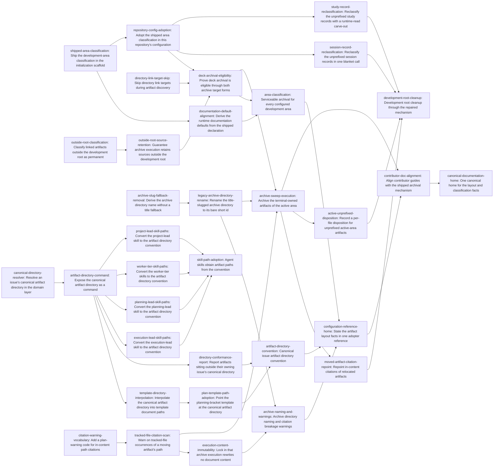

# Plan: Issue-based development artifact layout and serviceable archival (8e071e18)

> Planning node: 55fe8ec2. Authoritative graph:
> [8e071e18-breakdown.json](8e071e18-breakdown.json).

The epic has two halves that share one mechanism. The product half repairs archival so it can
service every artifact class and introduces an issue-directory convention with a resolver, a
command, and an advisory report. The adoption half runs that repaired mechanism over this
repository's own development root. Sequencing follows from D-10: the cleanup consumes the
repaired mechanism rather than substituting for it, so the classification, naming, and warning
work all land before any execution, and documentation lands last.

## Outcome and criterion approach

| Criterion | Approach | Evidence / open gap |
|---|---|---|
| REQ-01 | One shipped declaration of managed and permanent areas, emitted by the initialization scaffold; runtime accessor fallbacks derive from the same declaration. The scaffold, not the accessors, is the shipped-behaviour source, because policy completeness reads authored fields only. | Investigation claim 2, claim 3, Q2, invariant check |
| REQ-02 | Falls out of REQ-01 plus the two blocker relaxations; acceptance is a CLI-integration assertion over both target forms, read against the target-level blocker array. | Investigation claim 1, claim 4, design surface E |
| REQ-03 | One pure domain resolver over `membership-slug-precedence`, reusing the existing slug normalizer and the configured type-to-namespace mapping. | Investigation design surface C, design surface A |
| REQ-04 | A document subcommand over the resolver, single-value JSON shape, curated into the generated bridge manifest. | Investigation design surface A |
| REQ-05 | A template interpolation field carrying the resolved directory, then the repository template and its packaged profile twin adopt it. | Investigation design surface D |
| REQ-06 | A read-only report command, non-blocking by construction rather than by a non-enforced rule that still rides inside the validation exit code. | Investigation design surface B |
| REQ-07 | Delete the title fallback in destination naming; rename the one title-slugged archive directory. The marker holds only the container id, so it needs no update and re-adoption is automatic. | Investigation claim 8, claim 9 |
| REQ-08 | A new warning code extending the closed schema-v1 vocabulary, then a tracked-file text scan at the storage/planning evidence boundary. Content immutability is already true and gets regression coverage. | Investigation claim 10, primitive verification |
| REQ-09 | Per-container archival execution over terminal-owned active-area artifacts, then a bounded repoint of the warned inline citations. | Investigation claim 6, addendum citation census |
| REQ-10 | Per-file disposition for the active area; one recorded blanket call each for the session and study areas, with the runtime-read measurement subtree carved out. | Investigation claim 6, D-15 premise verification, Q10 |
| REQ-11 | Four skill-family cutovers, each editing its prompts and its packaged profile twin in the same change. | Investigation claim 13, consumer inventory |
| REQ-12 | The configuration reference becomes the canonical home; competing adopter statements become pointers and the two contributor guides are realigned. | Investigation claim 15, documentation inventory |
| REQ-13 | No dedicated work. Credited on the resolver and naming tasks (legacy shapes stay resolvable) and on the cleanup tasks (nothing breaks). | Investigation claim 8, layer assignment |
| REQ-14 | Thread the configured development root into the classification policy and scope the relaxation to paths outside it; retention already follows from the copy action and gets regression coverage. | Investigation R2, R3, layer assignment for REQ-14 |
| REQ-15 | Skip directory-typed link targets in artifact discovery — the addendum's remediation (i), which clears the whole `unsupported-artifact-type` population at once. | Investigation addendum headline, Q9 |

## Shared architectural contracts

### `shipped-area-declaration` [implementation-produced] — Shipped development-area classification

The single declaration of which areas under a development root are managed (move on archive) and
which are permanent (copy, source retained), plus the development-root files classified as exact
path entries. Emitted into the initialization scaffold and consumed by the runtime accessor
fallbacks; it is configuration the tool writes for an adopter, not classifier logic, which is what
keeps `@/invariant/domain-agnostic` intact (investigation invariant check). Matching is by path
prefix with an exact-path arm, so a file entry matches that file alone and a bare development-root
entry would defeat move-on-archive (investigation R4).

### `development-root-scoped-classification` [implementation-produced] — Out-of-root permanence

`ArtifactClassificationPolicy` carries the configured development root, and a selected root outside
it classifies permanent instead of raising `unmanaged-selected-root`. Scoped to *outside the
development root*, not to *matching no configured area*, so a mistyped area entry still raises the
blocker it exists to raise (D-17, investigation R2). The blocker code stays in the published
vocabulary.

### `directory-target-navigation` [implementation-produced] — Directory links are navigation

A document link whose target resolves to a directory is navigation, not an artifact: discovery skips
it and it contributes neither an artifact entry nor an `unsupported-artifact-type` blocker. Plan
eligibility is all-or-nothing across target-level blockers, artifact actions, and artifact-level
blockers (investigation R1), so this is a precondition for any eligible-plan criterion.

### `canonical-artifact-directory` [implementation-produced] — Issue artifact directory

`<area>/<short-id>-<slug>` when the issue resolves a single membership value, `<area>/<short-id>`
otherwise; filenames inside carry no short-id prefix. Area root from `development_root`, namespace
from the configured type-to-namespace mapping, slug from the existing bounded normalizer. Pure and
I/O-free; the command, the template field, and the conformance report all consume it.

### `membership-slug-precedence` [plan-fixed] — Slug source and ambiguity rule

Three steps: exactly one `type:*` label, then that type's configured membership namespace, then
exactly one value in it. Both ambiguous cases and the no-label case collapse to the bare short id —
no title fallback, no new tie-breaking policy. This is the shape the archive resolver already adopts
for legacy identifier-only directories (investigation claim 8, design surface C). Consumed
independently by the source-side resolver and by archive destination naming.

### `flat-layout-tolerance` [plan-fixed] — Legacy layouts are read, never restructured

The convention governs newly created artifacts. Pre-existing flat files, suffix-form filenames, and
identifier-only archive directories stay resolvable and are never restructured in place. This is why
enforcement is a resolver plus an advisory report rather than a validation rule: a cutover predicate
would be a false-positive source (D-4, D-7).

### `citation-warning-code` [implementation-produced] — In-content citation warning

A new `WarningCode` variant for an occurrence of a moving artifact's path in the text of a tracked
file. Extending the closed schema-v1 vocabulary is a deliberate cost: the enumeration, its
fixed-length exhaustive array, its wire spelling, and one golden assertion all change together
(investigation claim 10). The warning is advisory and changes no action, blocker, or eligibility.

## Generated decomposition overview

<!-- jit:breakdown-overview:begin -->
| Key | Title | Type | Outcome | Contracts | Sources | Footprint | Landing | Depends on |
|---|---|---|---|---|---|---|---|---|
| area-classification | Serviceable archival for every configured development area | story | Development areas are explicitly classified and the planner stops blocking artifacts it should copy or skip. | shipped-area-declaration, development-root-scoped-classification, directory-target-navigation | REQ-01, REQ-02, REQ-14, REQ-15, D-5, D-6, D-13, D-14, D-17, D-18, D-19, dev/active/8e071e18-investigation.md | — | — | documentation-default-alignment, deck-archival-eligibility |
| shipped-area-classification | Ship the development-area classification in the initialization scaffold | task | A single shipped declaration of managed and permanent development areas lands in the initialization scaffold. | — | REQ-01, D-5, D-13, D-19, dev/active/8e071e18-investigation.md | touches crates/jit/src/hierarchy_templates.rs; touches crates/jit/tests/cli_repo_workflow/init_tests.rs | shipped-classification | — |
| documentation-default-alignment | Derive the runtime documentation defaults from the shipped declaration | task | Configuration accessor fallbacks read the one shipped area declaration instead of restating it. | shipped-area-declaration | REQ-01, D-19, dev/active/8e071e18-investigation.md | touches crates/jit/src/config.rs | shipped-classification | shipped-area-classification |
| outside-root-classification | Classify linked artifacts outside the development root as permanent | task | A selected root outside the configured development root classifies permanent instead of raising a blocker. | — | REQ-14, D-14, D-17, dev/active/8e071e18-investigation.md | touches crates/jit/src/domain/artifact_classifier.rs; touches docs/reference/cli-commands.md | — | — |
| outside-root-source-retention | Guarantee archive execution retains sources outside the development root | task | Executing a plan that contains an out-of-root linked artifact leaves that file in place. | development-root-scoped-classification | REQ-14, D-14, dev/active/8e071e18-investigation.md | touches crates/jit/tests/cli_repo_workflow/archive_preview_cli_tests.rs | — | outside-root-classification |
| directory-link-target-skip | Skip directory link targets during artifact discovery | task | A link target that resolves to a directory is navigation and raises no unsupported-artifact-type blocker. | — | REQ-15, D-18, dev/active/8e071e18-investigation.md | touches crates/jit/src/domain/artifact_classifier.rs; touches crates/jit/tests/fast_docs_templates/artifact_discovery_tests.rs; touches docs/reference/cli-commands.md | — | — |
| repository-config-adoption | Adopt the shipped area classification in this repository's configuration | task | This repository's documentation policy names the same managed and permanent areas as the shipped scaffold. | shipped-area-declaration | REQ-01, D-5, D-6, D-13, dev/active/8e071e18-investigation.md | touches .jit/config.toml | — | shipped-area-classification |
| deck-archival-eligibility | Prove deck archival is eligible through both archive target forms | task | A presentation deck owned by a terminal issue previews eligible through either archive target form. | shipped-area-declaration, development-root-scoped-classification, directory-target-navigation | REQ-02, D-6, dev/active/8e071e18-investigation.md | touches crates/jit/tests/cli_repo_workflow/archive_preview_cli_tests.rs | — | repository-config-adoption, outside-root-source-retention, directory-link-target-skip |
| artifact-directory-convention | Canonical issue artifact directory convention | story | One resolver, one command, and one advisory report establish the issue artifact directory convention. | canonical-artifact-directory, membership-slug-precedence, flat-layout-tolerance | REQ-03, REQ-04, REQ-05, REQ-06, D-1, D-2, D-3, D-4, D-7, dev/active/8e071e18-investigation.md | — | — | plan-template-path-adoption, directory-conformance-report |
| canonical-directory-resolver | Resolve an issue's canonical artifact directory in the domain layer | task | A pure function maps an issue to its canonical artifact directory from a membership label or a bare short id. | membership-slug-precedence, flat-layout-tolerance | REQ-03, REQ-13, D-1, D-3, D-4, dev/active/8e071e18-investigation.md | creates crates/jit/src/domain/artifact_directory.rs; touches crates/jit/src/domain/mod.rs | — | — |
| artifact-directory-command | Expose the canonical artifact directory as a command | task | A subcommand prints an issue's canonical artifact directory in human and machine-readable form. | canonical-artifact-directory | REQ-04, D-7, dev/active/8e071e18-investigation.md | touches crates/jit/src/cli.rs; touches crates/jit/src/commands/document.rs; touches crates/jit/src/output.rs; touches crates/jit/tests/cli_repo_workflow/doc_show_tests.rs; touches docs/reference/cli-commands.md; touches mcp-server/curated-tools.json | — | canonical-directory-resolver |
| template-directory-interpolation | Interpolate the canonical artifact directory into template document paths | task | A template document path can name an issue's canonical artifact directory instead of a spelled-out flat pattern. | canonical-artifact-directory | REQ-05, D-2, dev/active/8e071e18-investigation.md | touches crates/jit/src/commands/template_expand.rs; touches crates/jit/src/commands/template.rs; touches crates/jit/src/commands/plan_doc.rs; touches crates/jit/tests/fast_docs_templates/template_apply_tests.rs; touches docs/how-to/adopt-planning-bracket.md; touches docs/examples/sdd/templates.toml; touches docs/examples/research/templates.toml | — | artifact-directory-command |
| plan-template-path-adoption | Point the planning-bracket template at the canonical artifact directory | task | The plan template's document path resolves inside the container's canonical directory with an unprefixed filename. | canonical-artifact-directory | REQ-05, D-2, D-11, dev/active/8e071e18-investigation.md | touches .jit/templates.toml; touches profiles/jit-dogfood/manifest.toml | template-path-cutover | template-directory-interpolation |
| directory-conformance-report | Report artifacts sitting outside their owning issue's canonical directory | task | An advisory report lists nonconforming artifacts under managed issue-scoped areas and blocks no transition. | canonical-artifact-directory, flat-layout-tolerance | REQ-06, D-7, dev/active/8e071e18-investigation.md | creates crates/jit/tests/cli_repo_workflow/artifact_conformance_cli_tests.rs; touches crates/jit/src/commands/document.rs; touches crates/jit/tests/cli_repo_workflow/main.rs | — | artifact-directory-command |
| archive-naming-and-warnings | Archive directory naming and citation breakage warnings | story | Archive directory names drop the title fallback and plans warn about in-content citations a move would break. | membership-slug-precedence, citation-warning-code, flat-layout-tolerance | REQ-07, REQ-08, D-8, D-9, D-16, dev/active/8e071e18-investigation.md | — | — | legacy-archive-directory-rename, execution-content-immutability |
| archive-slug-fallback-removal | Derive the archive directory name without a title fallback | task | The planner names an archive directory from a membership label or a bare short id and never from an issue title. | membership-slug-precedence, flat-layout-tolerance | REQ-07, REQ-13, D-1, D-9, dev/active/8e071e18-investigation.md | touches crates/jit/src/domain/artifact_classifier.rs; touches docs/reference/cli-commands.md | — | — |
| legacy-archive-directory-rename | Rename the title-slugged archive directory to its bare short id | task | The one title-slugged archive directory carries a conformant name and its container marker still resolves it. | flat-layout-tolerance | REQ-07, D-9, dev/active/8e071e18-investigation.md | touches dev/archive | — | archive-slug-fallback-removal |
| citation-warning-vocabulary | Add a plan-warning code for in-content path citations | task | The archive plan warning vocabulary carries a stable code for a citation of a moving artifact's path. | — | REQ-08, D-8, dev/active/8e071e18-investigation.md | touches crates/jit/src/domain/artifact_plan.rs; touches crates/jit/tests/fast_docs_templates/artifact_plan_model_tests.rs; touches docs/reference/cli-commands.md | — | — |
| tracked-file-citation-scan | Warn on tracked-file occurrences of a moving artifact's path | task | An archive plan reports a warning for each occurrence of a moving artifact's path in tracked file text. | citation-warning-code | REQ-08, D-16, dev/active/8e071e18-investigation.md | touches crates/jit/src/storage/artifact_planning.rs; touches crates/jit/src/domain/artifact_classifier.rs; touches crates/jit/tests/cli_repo_workflow/archive_preview_cli_tests.rs; touches docs/reference/cli-commands.md | — | citation-warning-vocabulary |
| execution-content-immutability | Lock in that archive execution rewrites no document content | task | A regression suite proves archive execution leaves relocated bytes untouched while relinking issue records. | — | REQ-08, D-8, dev/active/8e071e18-investigation.md | touches crates/jit/tests/cli_repo_workflow/archive_preview_cli_tests.rs | — | tracked-file-citation-scan |
| skill-path-adoption | Agent skills obtain artifact paths from the convention | story | Skill prompts obtain issue artifact paths from the convention, with each packaged twin updated in lockstep. | canonical-artifact-directory | REQ-11, D-11, dev/active/8e071e18-investigation.md | — | — | execution-lead-skill-paths, planning-lead-skill-paths, worker-tier-skill-paths, project-lead-skill-paths |
| execution-lead-skill-paths | Convert the execution-lead skill to the artifact directory convention | task | The execution-lead skill prompts name the canonical artifact directory instead of a flat short-id-prefixed path. | canonical-artifact-directory | REQ-11, D-11, dev/active/8e071e18-investigation.md | touches .agents/skills/jit-execution-lead; touches profiles/jit-dogfood/assets/live/.agents/skills/jit-execution-lead | skill-twin-cutover | artifact-directory-command |
| planning-lead-skill-paths | Convert the planning-lead skill to the artifact directory convention | task | The planning-lead skill prompts name the canonical artifact directory instead of a flat short-id-prefixed path. | canonical-artifact-directory | REQ-11, D-11, dev/active/8e071e18-investigation.md | touches .agents/skills/jit-planning-lead; touches profiles/jit-dogfood/assets/live/.agents/skills/jit-planning-lead | skill-twin-cutover | artifact-directory-command |
| worker-tier-skill-paths | Convert the worker-tier skills to the artifact directory convention | task | The worker-tier skill prompts name the canonical artifact directory instead of a flat short-id-prefixed path. | canonical-artifact-directory | REQ-11, D-11, dev/active/8e071e18-investigation.md | touches .agents/skills/jit-manage; touches .agents/skills/jit-breakdown; touches .agents/skills/jit-parallel; touches profiles/jit-dogfood/assets/live/.agents/skills/jit-manage; touches profiles/jit-dogfood/assets/live/.agents/skills/jit-breakdown; touches profiles/jit-dogfood/assets/live/.agents/skills/jit-parallel | skill-twin-cutover | artifact-directory-command |
| project-lead-skill-paths | Convert the project-lead skill to the artifact directory convention | task | The project-lead skill prompts name the canonical artifact directory instead of a flat short-id-prefixed path. | canonical-artifact-directory | REQ-11, D-11, dev/active/8e071e18-investigation.md | touches .agents/skills/jit-project-lead; touches profiles/jit-dogfood/assets/live/.agents/skills/jit-project-lead | skill-twin-cutover | artifact-directory-command |
| development-root-cleanup | Development root cleanup through the repaired mechanism | story | The development root is cleaned up by the repaired archival mechanism, with a recorded disposition for the rest. | shipped-area-declaration, citation-warning-code, flat-layout-tolerance | REQ-09, REQ-10, REQ-13, D-10, D-15, dev/active/8e071e18-investigation.md | — | — | moved-artifact-citation-repoint, active-unprefixed-disposition, session-record-reclassification, study-record-reclassification |
| archive-sweep-execution | Archive the terminal-owned artifacts of the active area | task | Terminal-owned active-area artifacts reach the archive through the product's own execution path. | shipped-area-declaration, development-root-scoped-classification, directory-target-navigation, citation-warning-code, flat-layout-tolerance | REQ-09, REQ-13, D-10, dev/active/8e071e18-investigation.md | touches dev/active; touches dev/archive | cleanup-run | deck-archival-eligibility, legacy-archive-directory-rename, tracked-file-citation-scan |
| moved-artifact-citation-repoint | Repoint in-content citations of relocated artifacts | task | Each inline citation of a relocated artifact names its new path, including script comments and adopter references. | citation-warning-code, flat-layout-tolerance | REQ-09, REQ-13, D-8, D-16, dev/active/8e071e18-investigation.md | touches scripts/rust-build-budget.sh; touches scripts/cargo-ci.sh; touches scripts/benchmark-rust-build.sh; touches docs/tutorials/parallel-work-worktrees.md; touches docs/how-to/multi-agent-coordination.md; touches crates/jit/src/storage/claim_coordinator.rs; touches CHANGELOG.md; touches dev/TESTING.md | cleanup-run | archive-sweep-execution |
| active-unprefixed-disposition | Record a per-file disposition for unprefixed active-area artifacts | task | Each unprefixed artifact in the active area has an owning issue, a reclassification, or an archived location. | shipped-area-declaration | REQ-10, D-15, dev/active/8e071e18-investigation.md | touches dev/active | — | archive-sweep-execution |
| session-record-reclassification | Reclassify the unprefixed session records in one blanket call | task | The session area's unprefixed dated records carry one recorded blanket disposition. | shipped-area-declaration | REQ-10, D-15, dev/active/8e071e18-investigation.md | touches dev/sessions | — | repository-config-adoption |
| study-record-reclassification | Reclassify the unprefixed study records with a runtime-read carve-out | task | The study area's unprefixed records carry one blanket disposition while the runtime-read subtree stays put. | shipped-area-declaration | REQ-10, D-15, dev/active/8e071e18-investigation.md | touches dev/studies | — | repository-config-adoption |
| canonical-documentation-home | One canonical home for the layout and classification facts | story | The layout convention and area classification get one canonical adopter home that other documents cite. | shipped-area-declaration, canonical-artifact-directory | REQ-12, D-5, dev/active/8e071e18-investigation.md | — | — | contributor-doc-alignment |
| configuration-reference-home | State the artifact layout facts in one adopter reference | task | The configuration reference is the single adopter-facing home for the directory convention and area classification. | shipped-area-declaration, canonical-artifact-directory, membership-slug-precedence, flat-layout-tolerance | REQ-12, REQ-04, D-5, D-13, dev/active/8e071e18-investigation.md | touches docs/reference/configuration.md; touches docs/reference/example-config.toml; touches docs/reference/glossary.md; touches docs/how-to/adopt-planning-bracket.md; touches README.md | documentation-cutover | area-classification, artifact-directory-convention, archive-naming-and-warnings |
| contributor-doc-alignment | Align contributor guides with the shipped archival mechanism | task | Contributor guides cite the canonical adopter reference instead of narrating a lifecycle the tool does not implement. | shipped-area-declaration, canonical-artifact-directory | REQ-12, D-13, dev/active/8e071e18-investigation.md | touches dev/index.md; touches dev/authoring-conventions.md | documentation-cutover | configuration-reference-home, archive-sweep-execution |

<!-- jit:breakdown-overview:end -->

## Material risks and owner decisions

| Risk / decision | Resolution and rationale |
|---|---|
| REQ-01 as written is satisfiable without achieving REQ-02 | Chose the initialization scaffold as the classification's home (D-19); rejected accessor-default-only shipping because policy completeness ignores defaults, and rejected making completeness honour defaults because it changes eligibility for every existing repository. |
| A blocker class no criterion originally covered | 376 `unsupported-artifact-type` instances across 16 containers, independent of any path decision, and eligibility is all-or-nothing. Chose the domain skip (D-18, REQ-15); rejected rewriting the legitimate directory links and rejected narrowing REQ-09. |
| REQ-07 reverses a shipped, reviewed decision | The title fallback was introduced by a reviewed predecessor issue. Reversal is deliberate and safe because destination names freeze at first archive and re-adopt by marker; exactly one directory needs renaming and its marker encodes no name (investigation claim 9). |
| REQ-08 extends a closed wire contract | Accepted the schema cost of a ninth warning code; rejected a link-target-only scan, which reaches a small minority of real citations, and rejected scoping the scan to the development root, which misses the script and changelog citations (D-16). |
| REQ-11 versus the packaged profile twins | Every target skill file is a byte-equality-asserted profile asset, so root-only edits fail the suite. Each skill cutover edits both trees in one change (D-11). |
| Three files carry most of the footprint overlap | `crates/jit/src/domain/artifact_classifier.rs` (4 terminals), `docs/reference/cli-commands.md` (6), and `crates/jit/tests/cli_repo_workflow/archive_preview_cli_tests.rs` (4). Dependency edges serialize the overlaps inside each story, but the classifier and the command reference are shared *across* stories 1 and 3. Sequence those two stories' code terminals rather than dispatching them in one parallel wave. |
| Cross-container citations move at different times | Two artifact areas cross-reference each other and their owners sit in different containers, so a per-container sweep breaks one side until the second container archives. Sequence the sweep and treat the repoint as its landing partner (`cleanup-run`). |
| REQ-14 read literally over-promises | Eligibility is all-or-nothing, so a plan containing an out-of-root artifact can still be ineligible for unrelated reasons. Acceptance is written against the criterion's own testable clauses — no `unmanaged-selected-root` for out-of-root paths, and no relocation outside the development root. |
| REQ-13 has no owning task | Credited on the resolver, the naming change, the sweep, and the repoint. If a reviewer wants a single artifact for it, the sweep's validation run plus the repoint's citation checks are the evidence. |
| `dev/plans` suffix-form filenames | Four of six files carry a trailing rather than leading short id, so a prefix-based resolver will not recognize them. They archive correctly regardless, because archival membership comes from document links, not filename parsing (investigation claim 15 revisited). |

## Investigation sources

- [Investigation](8e071e18-investigation.md) — consumer inventory, blocker censuses, the 26-citation
  repoint list, per-decision premise verification, and layer assignments remain there. Its addendum
  supersedes earlier sections where they disagree.
