# Plan: Issue-based development artifact layout and serviceable archival (8e071e18)

> Planning node: 55fe8ec2. Authoritative graph:
> [8e071e18-breakdown.json](8e071e18-breakdown.json).

The epic has two halves that share one mechanism. The product half repairs archival so it can
service every artifact class, and introduces an issue-directory convention over a configured set of
issue-scoped areas, with a resolver, a command, and an advisory report. The adoption half runs that
repaired mechanism over this repository's own development root. Sequencing follows from D-10: the
cleanup consumes the repaired mechanism rather than substituting for it, so the classification,
naming, and warning work all land before any execution, and documentation lands last.

## Outcome and criterion approach

| Criterion | Approach | Evidence / open gap |
|---|---|---|
| REQ-01 | One shipped declaration of managed and permanent areas, emitted by the initialization scaffold; runtime accessor fallbacks derive from the same declaration. The scaffold, not the accessors, is the shipped-behaviour source, because policy completeness reads authored fields only. | Investigation claim 2, claim 3, Q2, invariant check |
| REQ-02 | Falls out of REQ-01 plus the two blocker relaxations; acceptance is a CLI-integration assertion over both target forms, read against the target-level blocker array. | Investigation claim 1, claim 4, design surface E |
| REQ-03 | One pure domain resolver over `issue-scoped-area-registry` and `membership-slug-precedence`, reusing the existing slug normalizer and the configured type-to-namespace mapping. | Investigation design surface C, design surface A |
| REQ-04 | A document subcommand over the resolver taking the issue and the area, single-value JSON shape, curated into the generated bridge manifest. | Investigation design surface A |
| REQ-05 | A template declaration stating its area plus an interpolation field carrying the resolved directory, then the repository template and its packaged profile twin adopt it. | Investigation design surface D |
| REQ-06 | A read-only report command walking the declared issue-scoped areas, non-blocking by construction rather than by a non-enforced rule that still rides inside the validation exit code. | Investigation design surface B |
| REQ-07 | Delete the title fallback in destination naming; rename the one title-slugged archive directory. The marker holds only the container id, so it needs no update and re-adoption is automatic. | Investigation claim 8, claim 9 |
| REQ-08 | A new warning code extending the closed schema-v1 vocabulary, then a text scan over a declared, Git-free file universe at the storage/planning evidence boundary. Content immutability is already true and gets regression coverage. | Investigation claim 10, primitive verification |
| REQ-09 | One archival execution per terminal container — 24 of them, the set that a document-reference sweep over the managed areas measures as necessary — one completeness pass over the development root, then per-consumer-family resolution of the warned inline citations. | Investigation claim 6, addendum citation census, measured container coverage |
| REQ-10 | A decided per-file disposition for the active area, split by artifact class; one recorded blanket call each for the session and study areas, with the runtime-read measurement subtree pinned so archival retains it. | Investigation claim 6, D-15 premise verification, Q10 |
| REQ-11 | Six skill cutovers, one per skill, each editing its enumerated prompts and their packaged profile twins in the same change. | Investigation claim 13, consumer inventory |
| REQ-12 | Two canonical homes, split by fact class: the configuration reference states the directory convention and the area classification, and the command reference states this epic's command behaviour. Competing adopter statements become pointers and the two contributor guides are realigned. | Investigation claim 15, documentation inventory |
| REQ-13 | No dedicated work. Credited on the resolver and naming tasks (legacy shapes stay resolvable) and on the cleanup tasks (nothing breaks). | Investigation claim 8, layer assignment |
| REQ-14 | Thread the configured development root into the classification policy and scope the relaxation to paths outside it; retention already follows from the copy action and gets regression coverage. | Investigation R2, R3, layer assignment for REQ-14 |
| REQ-15 | Skip directory-typed link targets in artifact discovery — the addendum's remediation (i), which clears the whole `unsupported-artifact-type` population at once. | Investigation addendum headline, Q9 |

## Shared architectural contracts

### `shipped-area-declaration` [implementation-produced] — Shipped development-area classification

The single declaration of which areas under a development root are managed (move on archive) and
which are permanent (copy, source retained), plus the development-root files classified as exact
path entries. Emitted into the initialization scaffold and consumed by the runtime accessor
fallbacks; it is configuration the tool writes for an adopter, not classifier logic, which is what
keeps `@/invariant/domain-agnostic` intact (investigation invariant check). Matching is by path
prefix with an exact-path arm, so a file entry matches that file alone and a bare development-root
entry would defeat move-on-archive (investigation R4).

### `development-root-scoped-classification` [implementation-produced] — Out-of-root permanence

`ArtifactClassificationPolicy` carries the configured development root, and a selected root outside
it classifies permanent instead of raising `unmanaged-selected-root`. Scoped to *outside the
development root*, not to *matching no configured area*, so a mistyped area entry still raises the
blocker it exists to raise (D-17, investigation R2). The blocker code stays in the published
vocabulary.

### `directory-target-navigation` [implementation-produced] — Directory links are navigation

A document link whose target resolves to a directory is navigation, not an artifact: discovery skips
it and it contributes neither an artifact entry nor an `unsupported-artifact-type` blocker. Plan
eligibility is all-or-nothing across target-level blockers, artifact actions, and artifact-level
blockers (investigation R1), so this is a precondition for any eligible-plan criterion.

### `issue-scoped-area-registry` [implementation-produced] — Which areas adopt the convention

Configuration declares the areas under the development root that organize their artifacts by issue
(D-3). Today configuration supplies exactly one development root (`.jit/config.toml:11`) and nothing
distinguishes an issue-scoped area from a flat one, so a resolver handed only an issue would have to
guess among the four D-3 names. The registry removes the guess: a caller names one of the declared
areas and receives the directory inside it, and an undeclared area is an error rather than a silently
accepted path. The conformance report walks the same registry, so its scanned set is configured
rather than built in. Areas outside the registry keep their flat shape.

### `canonical-artifact-directory` [implementation-produced] — Issue artifact directory

`<area>/<short-id>-<slug>` when the issue resolves a single membership value, `<area>/<short-id>`
otherwise; filenames inside carry no short-id prefix. The area is a caller-supplied input validated
against `issue-scoped-area-registry`; the namespace comes from the configured type-to-namespace
mapping and the slug from the existing bounded normalizer. A caller therefore states only which area
it wants and never composes the `<short-id>-<slug>` segment itself, which is what keeps REQ-04
satisfied. Pure and I/O-free; the command, the template field, and the conformance report all
consume it.

### `membership-slug-precedence` [plan-fixed] — Slug source and ambiguity rule

Three steps: exactly one `type:*` label, then that type's configured membership namespace, then
exactly one value in it. Both ambiguous cases and the no-label case collapse to the bare short id —
no title fallback, no new tie-breaking policy. This is the shape the archive resolver already adopts
for legacy identifier-only directories (investigation claim 8, design surface C). Consumed
independently by the source-side resolver and by archive destination naming.

### `flat-layout-tolerance` [plan-fixed] — Legacy layouts are read, never restructured

The convention governs newly created artifacts. Pre-existing flat files, suffix-form filenames, and
identifier-only archive directories stay resolvable and are never restructured in place. This is why
enforcement is a resolver plus an advisory report rather than a validation rule: a cutover predicate
would be a false-positive source (D-4, D-7).

### `citation-warning-code` [implementation-produced] — In-content citation warning

A new `WarningCode` variant for an occurrence of a moving artifact's path in the text of a scanned
file. Extending the closed schema-v1 vocabulary is a deliberate cost: the enumeration, its
fixed-length exhaustive array, its wire spelling, and one golden assertion all change together
(investigation claim 10). The warning is advisory and changes no action, blocker, or eligibility.

### `citation-scan-universe` [implementation-produced] — Which files the citation scan reads

The file set the in-content citation scan reads, declared as an optional documentation-policy key
holding repository-relative prefixes and exact file entries, matched the way
`shipped-area-declaration` is matched, and defaulting to the development root together with the
permanent paths. The scan walks the declared roots with the planner's existing no-follow recursive
listing (`crates/jit/src/storage/artifact_planning.rs:224`) and skips a missing root, a symlinked
path component, and a file whose bytes are not valid UTF-8.

Declared rather than Git-derived, for three reasons. `jit archive` is a core command, so its warning
set must not depend on Git being present (`@/charter/D-4`), and the whole archive preview
integration suite already runs in plain temporary directories that are no Git repositories
(`crates/jit/tests/cli_repo_workflow/archive_preview_cli_tests.rs`), so a Git-index universe would
leave REQ-08's own acceptance untestable at its own boundary. Without Git there is no ignore
information, so an unbounded worktree walk would descend into build output. And a declared set keeps
D-16's reach: the scan is not scoped to the development root, it reaches wherever the adopter says
citations live, and this repository declares its script, crate, manifest, changelog, and
repository-root entries. Policy completeness reads three named fields
(`crates/jit/src/domain/artifact_plan.rs:85`), so an optional fourth key leaves archive eligibility
untouched.

## Generated decomposition overview

<!-- jit:breakdown-overview:begin -->
| Key | Title | Type | Outcome | Contracts | Sources | Footprint | Landing | Depends on |
|---|---|---|---|---|---|---|---|---|
| area-classification | Serviceable archival for every configured development area | story | Development areas are explicitly classified and the planner stops blocking artifacts it should copy or skip. | shipped-area-declaration, development-root-scoped-classification, directory-target-navigation | REQ-01, REQ-02, REQ-14, REQ-15, D-5, D-6, D-13, D-14, D-17, D-18, D-19, dev/active/8e071e18-investigation.md | — | — | documentation-default-alignment, deck-archival-eligibility |
| shipped-area-classification | Ship the development-area classification in the initialization scaffold | task | A single shipped declaration of managed and permanent development areas lands in the initialization scaffold. | — | REQ-01, D-5, D-13, D-19, dev/active/8e071e18-investigation.md | touches crates/jit/src/hierarchy_templates.rs; touches crates/jit/tests/cli_repo_workflow/init_tests.rs | shipped-classification | — |
| documentation-default-alignment | Derive the runtime documentation defaults from the shipped declaration | task | Configuration accessor fallbacks read the one shipped area declaration instead of restating it. | shipped-area-declaration | REQ-01, D-19, dev/active/8e071e18-investigation.md | touches crates/jit/src/config.rs | shipped-classification | shipped-area-classification |
| outside-root-classification | Classify linked artifacts outside the development root as permanent | task | A selected root outside the configured development root classifies permanent instead of raising a blocker. | — | REQ-14, D-14, D-17, dev/active/8e071e18-investigation.md | touches crates/jit/src/domain/artifact_classifier.rs | — | — |
| outside-root-source-retention | Guarantee archive execution retains sources outside the development root | task | Executing a plan that contains an out-of-root linked artifact leaves that file in place. | development-root-scoped-classification | REQ-14, D-14, dev/active/8e071e18-investigation.md | touches crates/jit/tests/cli_repo_workflow/archive_preview_cli_tests.rs | — | outside-root-classification |
| directory-link-target-skip | Skip directory link targets during artifact discovery | task | A link target that resolves to a directory is navigation and raises no unsupported-artifact-type blocker. | — | REQ-15, D-18, dev/active/8e071e18-investigation.md | touches crates/jit/src/domain/artifact_classifier.rs; touches crates/jit/tests/fast_docs_templates/artifact_discovery_tests.rs | — | outside-root-classification |
| repository-config-adoption | Adopt the shipped area classification in this repository's configuration | task | This repository's documentation policy names the same managed and permanent areas as the shipped scaffold. | shipped-area-declaration, issue-scoped-area-registry, citation-scan-universe | REQ-01, REQ-08, D-3, D-5, D-6, D-13, D-16, dev/active/8e071e18-investigation.md | touches .jit/config.toml | — | issue-scoped-area-registry, repository-citation-scan, shipped-area-classification |
| deck-archival-eligibility | Prove deck archival is eligible through both archive target forms | task | A presentation deck owned by a terminal issue previews eligible through either archive target form. | shipped-area-declaration, development-root-scoped-classification, directory-target-navigation | REQ-02, D-6, dev/active/8e071e18-investigation.md | touches crates/jit/tests/cli_repo_workflow/archive_preview_cli_tests.rs | — | repository-config-adoption, outside-root-source-retention, directory-link-target-skip |
| artifact-directory-convention | Canonical issue artifact directory convention | story | One resolver, one command, and one advisory report establish the issue artifact directory convention. | canonical-artifact-directory, issue-scoped-area-registry, membership-slug-precedence, flat-layout-tolerance | REQ-03, REQ-04, REQ-05, REQ-06, D-1, D-2, D-3, D-4, D-7, dev/active/8e071e18-investigation.md | — | — | plan-template-path-adoption, directory-conformance-report |
| issue-scoped-area-registry | Declare the development areas that adopt the issue directory convention | task | Configuration declares which development areas adopt the issue artifact directory convention. | — | REQ-03, D-3, dev/active/8e071e18-investigation.md | touches crates/jit/src/config.rs; touches crates/jit/src/hierarchy_templates.rs; touches crates/jit/tests/cli_repo_workflow/init_tests.rs | — | documentation-default-alignment |
| canonical-directory-resolver | Resolve an issue's canonical artifact directory inside a named area | task | A pure function maps an issue and a named area to the issue's canonical artifact directory. | issue-scoped-area-registry, membership-slug-precedence, flat-layout-tolerance | REQ-03, REQ-13, D-1, D-3, D-4, dev/active/8e071e18-investigation.md | creates crates/jit/src/domain/artifact_directory.rs; touches crates/jit/src/domain/mod.rs | — | issue-scoped-area-registry |
| artifact-directory-command | Expose the canonical artifact directory as a command | task | A subcommand prints an issue's canonical artifact directory in human and machine-readable form. | canonical-artifact-directory, issue-scoped-area-registry | REQ-04, D-7, dev/active/8e071e18-investigation.md | touches crates/jit/src/cli.rs; touches crates/jit/src/commands/document.rs; touches crates/jit/src/output.rs; touches crates/jit/tests/cli_repo_workflow/doc_show_tests.rs; touches mcp-server/curated-tools.json | — | canonical-directory-resolver |
| template-directory-interpolation | Interpolate the canonical artifact directory into template document paths | task | A template document path can name the container's canonical artifact directory in a stated area. | canonical-artifact-directory, issue-scoped-area-registry | REQ-05, D-2, dev/active/8e071e18-investigation.md | touches crates/jit/src/commands/template_expand.rs; touches crates/jit/src/commands/template.rs; touches crates/jit/src/commands/plan_doc.rs; touches crates/jit/tests/fast_docs_templates/template_apply_tests.rs; touches docs/how-to/adopt-planning-bracket.md; touches docs/examples/sdd/templates.toml; touches docs/examples/research/templates.toml | — | artifact-directory-command |
| plan-template-path-adoption | Point the planning-bracket template at the canonical artifact directory | task | The plan template's document path resolves inside the container's canonical directory with an unprefixed filename. | canonical-artifact-directory | REQ-05, D-2, D-11, dev/active/8e071e18-investigation.md | touches .jit/templates.toml; touches profiles/jit-dogfood/manifest.toml | template-path-cutover | template-directory-interpolation |
| directory-conformance-report | Report artifacts sitting outside their owning issue's canonical directory | task | An advisory report lists nonconforming artifacts under the declared issue-scoped areas. | canonical-artifact-directory, issue-scoped-area-registry, flat-layout-tolerance | REQ-06, D-7, dev/active/8e071e18-investigation.md | creates crates/jit/tests/cli_repo_workflow/artifact_conformance_cli_tests.rs; touches crates/jit/src/commands/document.rs; touches crates/jit/tests/cli_repo_workflow/main.rs; touches mcp-server/curated-tools.json | — | artifact-directory-command |
| archive-naming-and-warnings | Archive directory naming and citation breakage warnings | story | Archive directory names drop the title fallback and plans warn about in-content citations a move would break. | membership-slug-precedence, citation-warning-code, citation-scan-universe, flat-layout-tolerance | REQ-07, REQ-08, D-8, D-9, D-16, dev/active/8e071e18-investigation.md | — | — | legacy-archive-directory-rename, execution-content-immutability |
| archive-slug-fallback-removal | Derive the archive directory name without a title fallback | task | The planner names an archive directory from a membership label or a bare short id and never from an issue title. | membership-slug-precedence, flat-layout-tolerance | REQ-07, REQ-13, D-1, D-9, dev/active/8e071e18-investigation.md | touches crates/jit/src/domain/artifact_classifier.rs | — | directory-link-target-skip |
| legacy-archive-directory-rename | Rename the title-slugged archive directory to its bare short id | task | The one title-slugged archive directory carries a conformant name and its container marker still resolves it. | flat-layout-tolerance | REQ-07, D-9, dev/active/8e071e18-investigation.md | creates dev/archive/a9b5dd08; touches dev/archive/a9b5dd08-use-strategic-label-slugs-in-archive-directory-n | — | archive-slug-fallback-removal |
| citation-warning-vocabulary | Add a plan-warning code for in-content path citations | task | The archive plan warning vocabulary carries a stable code for a citation of a moving artifact's path. | — | REQ-08, D-8, dev/active/8e071e18-investigation.md | touches crates/jit/src/domain/artifact_plan.rs; touches crates/jit/tests/fast_docs_templates/artifact_plan_model_tests.rs | — | — |
| repository-citation-scan | Warn on in-content citations of a moving artifact's path | task | An archive plan warns on each occurrence of a moving artifact's path in the declared scan universe. | citation-warning-code | REQ-08, D-16, dev/active/8e071e18-investigation.md | touches crates/jit/src/config.rs; touches crates/jit/src/storage/artifact_planning.rs; touches crates/jit/src/domain/artifact_classifier.rs; touches crates/jit/tests/cli_repo_workflow/archive_preview_cli_tests.rs; touches docs/reference/configuration.md | — | citation-warning-vocabulary, archive-slug-fallback-removal, issue-scoped-area-registry, outside-root-source-retention |
| execution-content-immutability | Lock in that archive execution rewrites no document content | task | A regression suite proves archive execution leaves relocated bytes untouched while relinking issue records. | — | REQ-08, D-8, dev/active/8e071e18-investigation.md | touches crates/jit/tests/cli_repo_workflow/archive_preview_cli_tests.rs | — | repository-citation-scan, deck-archival-eligibility |
| skill-path-adoption | Agent skills obtain artifact paths from the convention | story | Skill prompts obtain issue artifact paths from the convention, with each packaged twin updated in lockstep. | canonical-artifact-directory | REQ-11, D-11, dev/active/8e071e18-investigation.md | — | — | execution-lead-skill-paths, planning-lead-skill-paths, manage-skill-paths, breakdown-skill-paths, parallel-skill-paths, project-lead-skill-paths |
| execution-lead-skill-paths | Convert the execution-lead skill to the artifact directory convention | task | The execution-lead skill prompts name the canonical artifact directory instead of a flat short-id-prefixed path. | canonical-artifact-directory | REQ-11, D-11, dev/active/8e071e18-investigation.md | touches .agents/skills/jit-execution-lead/SKILL.md; touches .agents/skills/jit-execution-lead/references/progress-file.md; touches .agents/skills/jit-execution-lead/references/handoff-template.md; touches .agents/skills/jit-execution-lead/references/architect-agent-prompt.md; touches .agents/skills/jit-execution-lead/references/explorer-agent-prompt.md; touches .agents/skills/jit-execution-lead/references/doc-agent-prompt.md; touches profiles/jit-dogfood/assets/live/.agents/skills/jit-execution-lead/SKILL.md; touches profiles/jit-dogfood/assets/live/.agents/skills/jit-execution-lead/references/progress-file.md; touches profiles/jit-dogfood/assets/live/.agents/skills/jit-execution-lead/references/handoff-template.md; touches profiles/jit-dogfood/assets/live/.agents/skills/jit-execution-lead/references/architect-agent-prompt.md; touches profiles/jit-dogfood/assets/live/.agents/skills/jit-execution-lead/references/explorer-agent-prompt.md; touches profiles/jit-dogfood/assets/live/.agents/skills/jit-execution-lead/references/doc-agent-prompt.md | skill-twin-cutover | artifact-directory-command |
| planning-lead-skill-paths | Convert the planning-lead skill to the artifact directory convention | task | The planning-lead skill prompts name the canonical artifact directory instead of a flat short-id-prefixed path. | canonical-artifact-directory | REQ-11, D-11, dev/active/8e071e18-investigation.md | touches .agents/skills/jit-planning-lead/SKILL.md; touches .agents/skills/jit-planning-lead/references/investigator-prompt.md; touches .agents/skills/jit-planning-lead/references/researcher-prompt.md; touches .agents/skills/jit-planning-lead/references/plan-doc-template.md; touches profiles/jit-dogfood/assets/live/.agents/skills/jit-planning-lead/SKILL.md; touches profiles/jit-dogfood/assets/live/.agents/skills/jit-planning-lead/references/investigator-prompt.md; touches profiles/jit-dogfood/assets/live/.agents/skills/jit-planning-lead/references/researcher-prompt.md; touches profiles/jit-dogfood/assets/live/.agents/skills/jit-planning-lead/references/plan-doc-template.md | skill-twin-cutover | artifact-directory-command |
| manage-skill-paths | Convert the single-issue skill to the artifact directory convention | task | The single-issue skill prompts name the canonical artifact directory instead of a flat short-id-prefixed path. | canonical-artifact-directory | REQ-11, D-11, dev/active/8e071e18-investigation.md | touches .agents/skills/jit-manage/SKILL.md; touches .agents/skills/jit-manage/references/issue-extraction-prompt.md; touches profiles/jit-dogfood/assets/live/.agents/skills/jit-manage/SKILL.md; touches profiles/jit-dogfood/assets/live/.agents/skills/jit-manage/references/issue-extraction-prompt.md | skill-twin-cutover | artifact-directory-command |
| breakdown-skill-paths | Convert the breakdown skill to the artifact directory convention | task | The breakdown skill prompt names the canonical artifact directory instead of a flat short-id-prefixed path. | canonical-artifact-directory | REQ-11, D-11, dev/active/8e071e18-investigation.md | touches .agents/skills/jit-breakdown/SKILL.md; touches profiles/jit-dogfood/assets/live/.agents/skills/jit-breakdown/SKILL.md | skill-twin-cutover | artifact-directory-command |
| parallel-skill-paths | Convert the parallel-execution skill to the artifact directory convention | task | The parallel-execution skill template names the canonical artifact directory instead of a flat short-id-prefixed path. | canonical-artifact-directory | REQ-11, D-11, dev/active/8e071e18-investigation.md | touches .agents/skills/jit-parallel/references/agent-prompt-template.md; touches profiles/jit-dogfood/assets/live/.agents/skills/jit-parallel/references/agent-prompt-template.md | skill-twin-cutover | artifact-directory-command |
| project-lead-skill-paths | Convert the project-lead skill to the artifact directory convention | task | The project-lead skill prompts name the canonical artifact directory instead of a flat short-id-prefixed path. | canonical-artifact-directory | REQ-11, D-11, dev/active/8e071e18-investigation.md | touches .agents/skills/jit-project-lead/SKILL.md; touches .agents/skills/jit-project-lead/references/progress-artifact.md; touches .agents/skills/jit-project-lead/references/vision-charter.md; touches .agents/skills/jit-project-lead/references/templates/vision-charter.md; touches .agents/skills/jit-project-lead/references/standards-scan.md; touches .agents/skills/jit-project-lead/references/standards-sweep.md; touches .agents/skills/jit-project-lead/references/standards-fix.md; touches profiles/jit-dogfood/assets/live/.agents/skills/jit-project-lead/SKILL.md; touches profiles/jit-dogfood/assets/live/.agents/skills/jit-project-lead/references/progress-artifact.md; touches profiles/jit-dogfood/assets/live/.agents/skills/jit-project-lead/references/vision-charter.md; touches profiles/jit-dogfood/assets/live/.agents/skills/jit-project-lead/references/templates/vision-charter.md; touches profiles/jit-dogfood/assets/live/.agents/skills/jit-project-lead/references/standards-scan.md; touches profiles/jit-dogfood/assets/live/.agents/skills/jit-project-lead/references/standards-sweep.md; touches profiles/jit-dogfood/assets/live/.agents/skills/jit-project-lead/references/standards-fix.md | skill-twin-cutover | artifact-directory-command |
| development-root-cleanup | Development root cleanup through the repaired mechanism | story | The development root is cleaned up by the repaired archival mechanism, with a recorded disposition for everything it cannot service. | shipped-area-declaration, citation-warning-code, flat-layout-tolerance | REQ-09, REQ-10, REQ-13, D-10, D-15, dev/active/8e071e18-investigation.md | — | — | build-tooling-citation-repoint, rust-source-citation-repoint, adopter-guide-citation-repoint, changelog-citation-repoint, testing-guide-citation-repoint, active-working-notes-citation-repoint, active-design-document-disposition, active-plan-document-disposition, active-reference-material-disposition, session-record-reclassification, study-record-reclassification |
| perf-fixture-carve-out | Pin the runtime-read measurement records so archival retains them | task | The runtime-read measurement records are pinned so archival retains them in place. | shipped-area-declaration, flat-layout-tolerance | REQ-10, D-15, D-20, dev/active/8e071e18-investigation.md | touches .jit/issues/73981310-4173-4224-82bf-f38a9d5222fd.json; touches .jit/issues/a4b0fadf-ccbe-4f47-a41d-676f7a947f85.json | cleanup-run | repository-config-adoption |
| archive-sweep-2d109173 | Archive the exhaustive documentation audit container's linked artifacts | task | The exhaustive documentation audit container relocates its linked artifacts through the archival execution path. | shipped-area-declaration, development-root-scoped-classification, directory-target-navigation, citation-warning-code, flat-layout-tolerance | REQ-09, D-10, D-20, D-21, dev/active/8e071e18-investigation.md | creates dev/archive/2d109173-docs-exhaustive-audit; touches dev/active/2b9a80fb-audit-notes.md; touches dev/active/36d5451e-audit-notes.md; touches dev/active/36d5451e-review-round-4.md; touches dev/active/36d5451e-review-round-5.md; touches dev/active/36d5451e-review-round-6.md; touches dev/active/4c33d0e5-audit-notes.md; touches dev/active/6d82de03-followup-manifest.md; touches dev/active/6d82de03-lead-review.md; touches dev/active/736a069e-audit-notes.md; touches dev/active/7c283e95-audit-notes.md; touches dev/active/8682e95a-gapfill-notes.md; touches dev/active/99f4a2b4-req02-evidence.md; touches dev/active/a70bac75-audit-notes.md; touches dev/active/adc4c6ef-relocation-notes.md; touches dev/active/b8924a6d-audit-notes.md; touches dev/active/d24008f0-req01-evidence.md | cleanup-run | deck-archival-eligibility, legacy-archive-directory-rename, repository-citation-scan |
| archive-sweep-6eb585bc | Archive the core maintenance container's linked artifacts | task | The core maintenance container relocates its linked artifacts through the archival execution path. | shipped-area-declaration, development-root-scoped-classification, directory-target-navigation, citation-warning-code, flat-layout-tolerance | REQ-09, D-10, D-20, D-21, dev/active/8e071e18-investigation.md | creates dev/archive/6eb585bc-core-maintenance; touches dev/active/3e12ffbd-batch-export-design.md; touches dev/active/3e12ffbd-batch-export-use-cases.md; touches dev/active/450db193-generic-projection-design.md; touches dev/active/45a140ae-archived-semantics.md; touches dev/active/71be6ae9-code-review-reliability.md; touches dev/active/71be6ae9-live-review-report.md; touches dev/active/73482aa1-completion-report.md; touches dev/active/76cb968b-citation-check.md; touches dev/active/76cb968b-ssot-adoption-sweep.md; touches dev/active/76cb968b-sweep-table.md; touches dev/active/949cd9d0-gate-verb-semantics.md; touches dev/active/af4c901a-derive-default-rules-at-load.md; touches dev/active/b4e55aa2-code-review-live-verification.md; touches dev/active/b4e55aa2-ground-code-review-policy.md; touches dev/active/d74a9ed1-write-through-namespace-unique-membership.md; touches dev/benchmarks/rust-build-efficiency/consolidation-inventory-diff.json; touches dev/benchmarks/rust-build-efficiency/verify-consolidation-inventory.py | cleanup-run | deck-archival-eligibility, legacy-archive-directory-rename, repository-citation-scan |
| archive-sweep-cfb3ba94 | Archive the documentation reorganization container's linked artifacts | task | The documentation reorganization container relocates its linked artifacts through the archival execution path. | shipped-area-declaration, development-root-scoped-classification, directory-target-navigation, citation-warning-code, flat-layout-tolerance | REQ-09, D-10, D-20, D-21, dev/active/8e071e18-investigation.md | creates dev/archive/cfb3ba94-docs; touches dev/sessions/session-2026-01-01-example-md-migration.md | cleanup-run | deck-archival-eligibility, legacy-archive-directory-rename, repository-citation-scan |
| archive-sweep-f2532a2d | Archive the project-lead skill container's linked artifacts | task | The project-lead skill container relocates its linked artifacts through the archival execution path. | shipped-area-declaration, development-root-scoped-classification, directory-target-navigation, citation-warning-code, flat-layout-tolerance | REQ-09, D-10, D-20, D-21, dev/active/8e071e18-investigation.md | creates dev/archive/f2532a2d-jit-project-lead; touches dev/active/304f6d94-breakdown-spec.md; touches dev/active/3c192f5e-breakdown-spec.md; touches dev/active/c23dfe71-breakdown-spec.md; touches dev/active/e8b1cee3-breakdown-spec.md; touches dev/active/eed6750c-handoff.md; touches dev/active/f2532a2d-138d-46bf-9547-e1ea517f0170-plan.md; touches dev/sessions/session-20260620-planning-skill-design.md; touches dev/sessions/session-20260622-planning-failures-and-churn.md; touches dev/sessions/session-20260623-planning-skill-observations.md; touches dev/sessions/session-20260624-project-lead-role-design.md; touches dev/sessions/session-20260625-planning-skill-authoring.md | cleanup-run | deck-archival-eligibility, legacy-archive-directory-rename, repository-citation-scan |
| archive-sweep-2821e177 | Archive the addressable-item container's linked artifacts | task | The addressable item container relocates its linked artifacts through the archival execution path. | shipped-area-declaration, development-root-scoped-classification, directory-target-navigation, citation-warning-code, flat-layout-tolerance | REQ-09, D-10, D-20, D-21, dev/active/8e071e18-investigation.md | creates dev/archive/2821e177-addressing-v2; touches dev/active/0efbc594-breakdown-spec.md; touches dev/active/2821e177-2d2d-4b25-b64a-4f38723e7fe6-plan.md; touches dev/active/2821e177-investigation.md; touches dev/active/37506c12-breakdown-spec.md; touches dev/active/637764ef-acceptance-evidence.md; touches dev/active/71ebd1e8-breakdown-spec.md; touches dev/active/7f22d6cf-breakdown-spec.md; touches dev/active/9a7106ae-breakdown-spec.md; touches dev/active/bb7d57a2-breakdown-spec.md; touches dev/studies/addressing-v2-item-use-cases.md; touches dev/studies/addressing-v2-rule-gate-items.md | cleanup-run | deck-archival-eligibility, legacy-archive-directory-rename, repository-citation-scan |
| archive-sweep-9b7b5f9c | Archive the repository profiles container's linked artifacts | task | The repository profiles container relocates its linked artifacts through the archival execution path. | shipped-area-declaration, development-root-scoped-classification, directory-target-navigation, citation-warning-code, flat-layout-tolerance | REQ-09, D-10, D-20, D-21, dev/active/8e071e18-investigation.md | creates dev/archive/9b7b5f9c-jit-profiles; touches dev/active/8b05a612-investigation.md; touches dev/active/8b05a612-plan.md; touches dev/active/8b05a612-research.md; touches dev/active/9b7b5f9c-investigation.md; touches dev/active/9b7b5f9c-mvp-scope-brief.md; touches dev/active/9b7b5f9c-plan.md; touches dev/active/9b7b5f9c-research.md; touches dev/presentations/9b7b5f9c/base.css; touches dev/presentations/9b7b5f9c/talk.html; touches dev/presentations/9b7b5f9c/themes/rust.css | cleanup-run | deck-archival-eligibility, legacy-archive-directory-rename, repository-citation-scan |
| archive-sweep-9ac9fdac | Archive the graph templates container's linked artifacts | task | The graph templates container relocates its linked artifacts through the archival execution path. | shipped-area-declaration, development-root-scoped-classification, directory-target-navigation, citation-warning-code, flat-layout-tolerance | REQ-09, D-10, D-20, D-21, dev/active/8e071e18-investigation.md | creates dev/archive/9ac9fdac-graph-templates; touches dev/active/57269494-apply-plan-doc.md; touches dev/active/9ac9fdac-828a-40f2-9d73-71af14f44ff8-plan.md; touches dev/active/9ac9fdac-completion-report.md; touches dev/active/9ac9fdac-graph-templates-showcase/base.css; touches dev/active/9ac9fdac-graph-templates-showcase/talk.html; touches dev/active/9ac9fdac-graph-templates-showcase/themes/rust.css | cleanup-run | deck-archival-eligibility, legacy-archive-directory-rename, repository-citation-scan |
| archive-sweep-14303b30 | Archive the CLI ergonomics phase container's linked artifacts | task | The CLI ergonomics phase container relocates its linked artifacts through the archival execution path. | shipped-area-declaration, development-root-scoped-classification, directory-target-navigation, citation-warning-code, flat-layout-tolerance | REQ-09, D-10, D-20, D-21, dev/active/8e071e18-investigation.md | creates dev/archive/14303b30-phase5-2; touches dev/active/bulk-operations-plan.md; touches dev/active/ci-gate-integration-design.md; touches dev/active/gate-examples.md; touches dev/active/gate-modification-flags-plan.md; touches dev/active/quiet-mode-plan.md; touches dev/sessions/session-2025-12-21-short-hash-progress.md; touches dev/sessions/session-2025-12-29-quiet-flag-implementation.md; touches dev/studies/short-hash-implementation-plan.md | cleanup-run | deck-archival-eligibility, legacy-archive-directory-rename, repository-citation-scan |
| archive-sweep-25064508 | Archive the structured knowledge container's linked artifacts | task | The structured knowledge container relocates its linked artifacts through the archival execution path. | shipped-area-declaration, development-root-scoped-classification, directory-target-navigation, citation-warning-code, flat-layout-tolerance | REQ-09, D-10, D-20, D-21, dev/active/8e071e18-investigation.md | creates dev/archive/25064508-structured-knowledge; touches dev/active/0d593d90-invariant-projection-design.md; touches dev/active/1e1ea81d-item-kind-six-tuple.md; touches dev/active/21558ace-invariants-registry.md; touches dev/active/56ab0224-item-model-design.md; touches dev/active/93480b00-invariant-registry-first-kind.md | cleanup-run | deck-archival-eligibility, legacy-archive-directory-rename, repository-citation-scan |
| archive-sweep-5fe00921 | Archive the production stability container's linked artifacts | task | The production stability container relocates its linked artifacts through the archival execution path. | shipped-area-declaration, development-root-scoped-classification, directory-target-navigation, citation-warning-code, flat-layout-tolerance | REQ-09, D-10, D-20, D-21, dev/active/8e071e18-investigation.md | creates dev/archive/5fe00921-production-stability; touches dev/active/config-consolidation-documentation-requirements.md; touches dev/active/config-consolidation-plan.md; touches dev/active/multi-issue-bulk-operations-plan.md; touches dev/active/production-stability-design.md; touches dev/active/transitive-reduction-validation-plan.md; touches dev/plans/5dbc3548-deletion-tracking.md; touches dev/plans/benchmarks-8d80b5dd.md; touches dev/plans/error-recovery-0587a73a.md; touches dev/sessions/session-2025-12-26-config-consolidation.md; touches dev/sessions/session-2025-12-30-bulk-cli-integration.md; touches dev/sessions/session-2025-12-30-bulk-operations-progress.md; touches dev/sessions/session-2025-12-30-bulk-phase5-docs.md; touches dev/sessions/session-2025-12-30-bulk-state-decision.md; touches dev/sessions/session-2025-12-30-bulk-validation.md | cleanup-run | deck-archival-eligibility, legacy-archive-directory-rename, repository-citation-scan |
| archive-sweep-2fbd2a82 | Archive the planning bracket container's linked artifacts | task | The planning bracket container relocates its linked artifacts through the archival execution path. | shipped-area-declaration, development-root-scoped-classification, directory-target-navigation, citation-warning-code, flat-layout-tolerance | REQ-09, D-10, D-20, D-21, dev/active/8e071e18-investigation.md | creates dev/archive/2fbd2a82-planning-bracket; touches dev/active/planning-bracket-design.md; touches dev/active/planning-bracket-showcase/base.css; touches dev/active/planning-bracket-showcase/talk.html; touches dev/active/planning-bracket-showcase/themes/rust.css | cleanup-run | deck-archival-eligibility, legacy-archive-directory-rename, repository-citation-scan |
| archive-sweep-94f873c8 | Archive the documentation lifecycle phase two container's linked artifacts | task | The documentation lifecycle phase two container relocates its linked artifacts through the archival execution path. | shipped-area-declaration, development-root-scoped-classification, directory-target-navigation, citation-warning-code, flat-layout-tolerance | REQ-09, D-10, D-20, D-21, dev/active/8e071e18-investigation.md | creates dev/archive/94f873c8-docs-lifecycle-p2; touches dev/active/5c060496-raw-assets-design.md; touches dev/active/abfd6016-multi-format-doc-rendering-design.md; touches dev/active/documentation-lifecycle-phase2-design.md | cleanup-run | deck-archival-eligibility, legacy-archive-directory-rename, repository-citation-scan |
| archive-sweep-9d427a6b | Archive the production polish container's linked artifacts | task | The production polish container relocates its linked artifacts through the archival execution path. | shipped-area-declaration, development-root-scoped-classification, directory-target-navigation, citation-warning-code, flat-layout-tolerance | REQ-09, D-10, D-20, D-21, dev/active/8e071e18-investigation.md | creates dev/archive/9d427a6b-production-polish; touches dev/active/dependency-display-improvements-plan.md; touches dev/active/gate-presets-implementation-plan.md; touches dev/active/production-polish-design.md; touches dev/design/exploration-dag.md; touches dev/design/hierarchy-icons-config.md; touches dev/design/phase2-collapse-expand.md; touches dev/design/phase3-advanced-features.md; touches dev/design/search-focus-navigation.md; touches dev/design/subgraph-clustering-layout.md; touches dev/plans/7004d5b6-reorganize-commands.md; touches dev/sessions/session-20260109-query-consolidation.md; touches dev/studies/agent-ux-observations.md | cleanup-run | deck-archival-eligibility, legacy-archive-directory-rename, repository-citation-scan |
| archive-sweep-2e926e39 | Archive the agent seamlessness container's linked artifacts | task | The agent seamlessness container relocates its linked artifacts through the archival execution path. | shipped-area-declaration, development-root-scoped-classification, directory-target-navigation, citation-warning-code, flat-layout-tolerance | REQ-09, D-10, D-20, D-21, dev/active/8e071e18-investigation.md | creates dev/archive/2e926e39-agent-seamlessness; touches dev/active/2e926e39-906e-4952-8ae0-38215a7e5aac-plan.md; touches dev/active/2e926e39-completion-report.md; touches dev/presentations/2e926e39/base.css; touches dev/presentations/2e926e39/talk.html; touches dev/presentations/2e926e39/themes/rust.css | cleanup-run | deck-archival-eligibility, legacy-archive-directory-rename, repository-citation-scan |
| archive-sweep-71373e37 | Archive the documentation lifecycle container's linked artifacts | task | The documentation lifecycle container relocates its linked artifacts through the archival execution path. | shipped-area-declaration, development-root-scoped-classification, directory-target-navigation, citation-warning-code, flat-layout-tolerance | REQ-09, D-10, D-20, D-21, dev/active/8e071e18-investigation.md | creates dev/archive/71373e37-docs-lifecycle; touches dev/active/doc-archive-implementation-guide.md; touches dev/active/snapshot-export-implementation-plan.md; touches dev/sessions/session-2024-12-24-check-links-incomplete.md; touches dev/sessions/session-2025-12-22-doc-consolidation.md; touches dev/sessions/session-2025-12-27-doc-archive.md; touches dev/studies/documentation-lifecycle-strategy.md | cleanup-run | deck-archival-eligibility, legacy-archive-directory-rename, repository-citation-scan |
| archive-sweep-90a2dbfd | Archive the item sources container's linked artifacts | task | The item sources container relocates its linked artifacts through the archival execution path. | shipped-area-declaration, development-root-scoped-classification, directory-target-navigation, citation-warning-code, flat-layout-tolerance | REQ-09, D-10, D-20, D-21, dev/active/8e071e18-investigation.md | creates dev/archive/90a2dbfd-item-sources; touches dev/active/90a2dbfd-be54-46f2-b84a-b19382c6b0f2-plan.md; touches dev/active/90a2dbfd-kinds-over-sources.md | cleanup-run | deck-archival-eligibility, legacy-archive-directory-rename, repository-citation-scan |
| archive-sweep-4a00b2b0 | Archive the agent validation container's linked artifacts | task | The agent validation container relocates its linked artifacts through the archival execution path. | shipped-area-declaration, development-root-scoped-classification, directory-target-navigation, citation-warning-code, flat-layout-tolerance | REQ-09, D-10, D-20, D-21, dev/active/8e071e18-investigation.md | creates dev/archive/4a00b2b0-agent-validation; touches dev/active/agent-validation-design.md; touches dev/studies/ai-tool-worktree-compatibility.md; touches dev/studies/worktree-merge-analysis.md | cleanup-run | deck-archival-eligibility, legacy-archive-directory-rename, repository-citation-scan |
| archive-sweep-53e3fa36 | Archive the agent ergonomics container's linked artifacts | task | The agent ergonomics container relocates its linked artifacts through the archival execution path. | shipped-area-declaration, development-root-scoped-classification, directory-target-navigation, citation-warning-code, flat-layout-tolerance | REQ-09, D-10, D-20, D-21, dev/active/8e071e18-investigation.md | creates dev/archive/53e3fa36-agent-ergonomics; touches dev/active/53e3fa36-c0cb-4206-8e8e-0a21aafb213e-plan.md; touches dev/studies/session-mining-jit-improvements.md | cleanup-run | deck-archival-eligibility, legacy-archive-directory-rename, repository-citation-scan |
| archive-sweep-7095769d | Archive the code smell cleanup container's linked artifacts | task | The code smell cleanup container relocates its linked artifacts through the archival execution path. | shipped-area-declaration, development-root-scoped-classification, directory-target-navigation, citation-warning-code, flat-layout-tolerance | REQ-09, D-10, D-20, D-21, dev/active/8e071e18-investigation.md | creates dev/archive/7095769d-code-smell-cleanup; touches dev/active/7095769d-smell-hunt-report.md | cleanup-run | deck-archival-eligibility, legacy-archive-directory-rename, repository-citation-scan |
| archive-sweep-93f3e4df | Archive the rejection state container's linked artifacts | task | The rejection state container relocates its linked artifacts through the archival execution path. | shipped-area-declaration, development-root-scoped-classification, directory-target-navigation, citation-warning-code, flat-layout-tolerance | REQ-09, D-10, D-20, D-21, dev/active/8e071e18-investigation.md | creates dev/archive/93f3e4df-rejection-state; touches dev/active/rejection-state-design.md | cleanup-run | deck-archival-eligibility, legacy-archive-directory-rename, repository-citation-scan |
| archive-sweep-d7bfd4a4 | Archive the observability container's linked artifacts | task | The observability container relocates its linked artifacts through the archival execution path. | shipped-area-declaration, development-root-scoped-classification, directory-target-navigation, citation-warning-code, flat-layout-tolerance | REQ-09, D-10, D-20, D-21, dev/active/8e071e18-investigation.md | creates dev/archive/d7bfd4a4-observability; touches dev/active/observability-design.md; touches dev/plans/metrics-713ff59d.md; touches dev/plans/stalled-detection-c802a9b0.md | cleanup-run | deck-archival-eligibility, legacy-archive-directory-rename, repository-citation-scan |
| archive-sweep-ad601a15 | Archive the parallel work container's linked artifacts | task | The parallel work container relocates its linked artifacts through the archival execution path. | shipped-area-declaration, development-root-scoped-classification, directory-target-navigation, citation-warning-code, flat-layout-tolerance | REQ-09, D-10, D-20, D-21, dev/active/8e071e18-investigation.md | creates dev/archive/ad601a15-parallel-work; touches dev/design/cli-quality-improvements.md; touches dev/design/worktree-parallel-work.md; touches dev/experiments/worktree-manual-coordination-experiment.md; touches dev/sessions/session-20260103-parallel-work-design-review.md; touches dev/sessions/session-20260111-validate-implementation.md; touches dev/sessions/session-20260115-cli-quality-phase3.md; touches dev/sessions/session-20260115-phase3-issue7-complete.md; touches dev/sessions/session-20260115-story-review-f023.md; touches dev/sessions/session-20260118-f849-manual-testing.md; touches dev/sessions/session-20260201-cli-enforcement-82b17394.md; touches dev/sessions/session-20260201-enforcement-modes-5e1d5f02.md; touches dev/sessions/session-20260201-refactor-1bdc5395-analysis.md; touches dev/sessions/session-20260201-refactor-items-5-7.md; touches dev/sessions/session-claim-coordination-parallel.md; touches dev/sessions/session-claim-coordination-review.md | cleanup-run | deck-archival-eligibility, legacy-archive-directory-rename, repository-citation-scan |
| archive-sweep-1cc809de | Archive the repository-state quality container's linked artifacts | task | The repository-state quality container relocates its linked artifacts through the archival execution path. | shipped-area-declaration, development-root-scoped-classification, directory-target-navigation, citation-warning-code, flat-layout-tolerance | REQ-09, D-10, D-20, D-21, dev/active/8e071e18-investigation.md | creates dev/archive/1cc809de-repository-state-quality; touches dev/presentations/1cc809de/base.css; touches dev/presentations/1cc809de/talk.html; touches dev/presentations/1cc809de/themes/rust.css; touches dev/presentations/1cc809de/vendor/fonts/fonts.css; touches dev/presentations/1cc809de/vendor/fonts/jetbrains-mono-latin-400-normal.woff2; touches dev/presentations/1cc809de/vendor/fonts/jetbrains-mono-latin-500-normal.woff2; touches dev/presentations/1cc809de/vendor/fonts/open-sans-latin-400-italic.woff2; touches dev/presentations/1cc809de/vendor/fonts/open-sans-latin-400-normal.woff2; touches dev/presentations/1cc809de/vendor/fonts/open-sans-latin-600-normal.woff2; touches dev/presentations/1cc809de/vendor/fonts/open-sans-latin-700-normal.woff2; touches dev/presentations/1cc809de/vendor/fonts/source-code-pro-latin-400-normal.woff2; touches dev/presentations/1cc809de/vendor/fonts/source-code-pro-latin-500-normal.woff2; touches dev/presentations/1cc809de/vendor/reveal.js/plugin/highlight/highlight.js; touches dev/presentations/1cc809de/vendor/reveal.js/reset.css; touches dev/presentations/1cc809de/vendor/reveal.js/reveal.css; touches dev/presentations/1cc809de/vendor/reveal.js/reveal.js; touches dev/presentations/cdc840ad/README.md; touches dev/studies/perf/session-cost-27ffbd2d.json; touches dev/studies/perf/session-cost-c488ef85.json | cleanup-run | deck-archival-eligibility, legacy-archive-directory-rename, repository-citation-scan, perf-fixture-carve-out |
| archive-sweep-a4e3cfb0 | Archive the documentation tooling evaluation task's linked artifacts | task | The documentation tooling evaluation container relocates its linked artifacts through the archival execution path. | shipped-area-declaration, development-root-scoped-classification, directory-target-navigation, citation-warning-code, flat-layout-tolerance | REQ-09, D-10, D-20, D-21, dev/active/8e071e18-investigation.md | creates dev/archive/a4e3cfb0; touches dev/studies/documentation-tooling-evaluation.md | cleanup-run | deck-archival-eligibility, legacy-archive-directory-rename, repository-citation-scan |
| cleanup-completeness-landing | Confirm the archival runs serviced the development root | task | The archival runs are confirmed complete against the development root with their citation warnings consolidated. | shipped-area-declaration, citation-warning-code, citation-scan-universe, flat-layout-tolerance | REQ-09, REQ-13, D-8, D-10, D-20, dev/active/8e071e18-investigation.md | creates dev/active/8e071e18-dev-artifact-layout/cleanup-citation-warnings.md; creates dev/active/8e071e18-dev-artifact-layout/cleanup-completeness-record.md | cleanup-run | archive-sweep-2d109173, archive-sweep-6eb585bc, archive-sweep-cfb3ba94, archive-sweep-f2532a2d, archive-sweep-2821e177, archive-sweep-9b7b5f9c, archive-sweep-9ac9fdac, archive-sweep-14303b30, archive-sweep-25064508, archive-sweep-5fe00921, archive-sweep-2fbd2a82, archive-sweep-94f873c8, archive-sweep-9d427a6b, archive-sweep-2e926e39, archive-sweep-71373e37, archive-sweep-90a2dbfd, archive-sweep-4a00b2b0, archive-sweep-53e3fa36, archive-sweep-7095769d, archive-sweep-93f3e4df, archive-sweep-d7bfd4a4, archive-sweep-ad601a15, archive-sweep-1cc809de, archive-sweep-a4e3cfb0 |
| build-tooling-citation-repoint | Resolve the build tooling's citations of relocated artifacts | task | The build scripts and the workspace manifest cite paths that resolve after the cleanup. | citation-warning-code, flat-layout-tolerance | REQ-09, D-8, D-16, dev/active/8e071e18-investigation.md | touches scripts/rust-build-budget.sh; touches scripts/cargo-ci.sh; touches Cargo.toml | cleanup-run | cleanup-completeness-landing |
| rust-source-citation-repoint | Resolve the Rust sources' citations of relocated artifacts | task | The production module comment and the test comment cite a path that resolves after the cleanup. | citation-warning-code, flat-layout-tolerance | REQ-09, D-8, D-16, dev/active/8e071e18-investigation.md | touches crates/jit/src/storage/claim_coordinator.rs; touches crates/jit/tests/cli_repo_workflow/config_get_tests.rs; touches crates/jit/tests/fast_docs_templates/bracket_breakdown_tests.rs; touches crates/jit/tests/fast_docs_templates/research_bracket_tests.rs; touches crates/jit/tests/fast_docs_templates/sdd_bracket_tests.rs | cleanup-run | cleanup-completeness-landing |
| adopter-guide-citation-repoint | Resolve the adopter guides' citations of relocated artifacts | task | The adopter tutorial and how-to cite a design-document path that resolves after the cleanup. | citation-warning-code, flat-layout-tolerance | REQ-09, D-8, D-16, dev/active/8e071e18-investigation.md | touches docs/tutorials/parallel-work-worktrees.md; touches docs/how-to/multi-agent-coordination.md | cleanup-run | cleanup-completeness-landing |
| changelog-citation-repoint | Resolve the changelog's citations of relocated artifacts | task | The changelog entries cite an artifact path that resolves after the cleanup. | citation-warning-code, flat-layout-tolerance | REQ-09, D-8, D-16, dev/active/8e071e18-investigation.md | touches CHANGELOG.md | cleanup-run | cleanup-completeness-landing |
| testing-guide-citation-repoint | Resolve the testing guide's citations of relocated artifacts | task | The contributor testing guide cites artifact paths that resolve after the cleanup. | citation-warning-code, flat-layout-tolerance | REQ-09, D-8, D-16, dev/active/8e071e18-investigation.md | touches dev/TESTING.md | cleanup-run | cleanup-completeness-landing |
| active-working-notes-citation-repoint | Resolve the retained working notes' citations of relocated artifacts | task | The retained active-area working notes cite artifact paths that resolve after the cleanup. | citation-warning-code, flat-layout-tolerance | REQ-09, D-8, D-16, dev/active/8e071e18-investigation.md | touches dev/active/2fbd2a82-14ba-4e6e-90f6-e0c34f0f912c-plan.md; touches dev/active/73482aa1-progress.json; touches dev/active/9b7b5f9c-handoff.md; touches dev/active/9b7b5f9c-handoff-3.md; touches dev/active/9b7b5f9c-handoff-4.md; touches dev/active/9b7b5f9c-handoff-5.md; touches dev/active/abfd6016-progress.json; touches dev/active/c639cfb5-investigation.md; touches dev/active/f2532a2d-handoff.md; touches dev/active/f2532a2d-handoff-2.md | cleanup-run | cleanup-completeness-landing |
| active-design-document-disposition | Record the decided disposition of the unprefixed active-area design documents | task | Each design document in the set carries one recorded disposition. | shipped-area-declaration | REQ-10, D-15, D-20, dev/active/8e071e18-investigation.md | creates dev/active/8e071e18-dev-artifact-layout/disposition-design-documents.md | — | cleanup-completeness-landing |
| active-plan-document-disposition | Record the decided disposition of the unprefixed active-area implementation plans | task | Each implementation plan in the set carries one recorded disposition. | shipped-area-declaration | REQ-10, D-15, D-20, dev/active/8e071e18-investigation.md | creates dev/active/8e071e18-dev-artifact-layout/disposition-implementation-plans.md | — | cleanup-completeness-landing |
| active-reference-material-disposition | Record the decided disposition of the unprefixed active-area guides and briefs | task | Each guide or brief in the set carries one recorded disposition. | shipped-area-declaration | REQ-10, D-15, D-20, dev/active/8e071e18-investigation.md | creates dev/active/8e071e18-dev-artifact-layout/disposition-reference-material.md | — | cleanup-completeness-landing |
| session-record-reclassification | Record the blanket disposition of the session records | task | The session area carries one recorded blanket disposition over an enumerated path list. | shipped-area-declaration | REQ-10, D-15, D-20, dev/active/8e071e18-investigation.md | creates dev/active/8e071e18-dev-artifact-layout/disposition-session-records.md | — | cleanup-completeness-landing |
| study-record-reclassification | Record the blanket disposition of the study records with the runtime-read carve-out | task | The study area carries one recorded blanket disposition with the runtime-read subtree carved out. | shipped-area-declaration | REQ-10, D-15, D-20, dev/active/8e071e18-investigation.md | creates dev/active/8e071e18-dev-artifact-layout/disposition-study-records.md | — | cleanup-completeness-landing |
| canonical-documentation-home | Canonical adopter homes for the layout, classification, and command facts | story | The layout convention, the area classification, and this epic's command behaviour each have one canonical adopter home. | shipped-area-declaration, canonical-artifact-directory | REQ-12, D-5, dev/active/8e071e18-investigation.md | — | — | contributor-doc-alignment, command-reference-surface |
| configuration-reference-home | State the artifact layout facts in one adopter reference | task | The configuration reference is the single adopter-facing home for the directory convention and area classification. | shipped-area-declaration, canonical-artifact-directory, membership-slug-precedence, flat-layout-tolerance | REQ-12, REQ-04, D-5, D-13, dev/active/8e071e18-investigation.md | touches docs/reference/configuration.md; touches docs/reference/example-config.toml; touches docs/reference/glossary.md; touches docs/how-to/adopt-planning-bracket.md; touches README.md | documentation-cutover | area-classification, artifact-directory-convention, archive-naming-and-warnings |
| contributor-doc-alignment | Align contributor guides with the shipped archival mechanism | task | Contributor guides cite the canonical adopter reference instead of narrating a lifecycle the tool does not implement. | shipped-area-declaration, canonical-artifact-directory | REQ-12, D-13, dev/active/8e071e18-investigation.md | touches dev/index.md; touches dev/authoring-conventions.md | documentation-cutover | configuration-reference-home, cleanup-completeness-landing |
| command-reference-surface | Document the epic's command-surface changes in the adopter command reference | task | The adopter command reference is the single home for the command behaviour this epic changes. | development-root-scoped-classification, directory-target-navigation, citation-warning-code, citation-scan-universe, canonical-artifact-directory, membership-slug-precedence | REQ-12, REQ-04, REQ-06, REQ-07, REQ-08, REQ-14, REQ-15, D-7, D-8, D-13, D-17, D-18, dev/active/8e071e18-investigation.md | touches docs/reference/cli-commands.md | documentation-cutover | configuration-reference-home |

```mermaid
flowchart LR
    N0["area-classification: Serviceable archival for every configured development area"]
    N1["shipped-area-classification: Ship the development-area classification in the initialization scaffold"]
    N2["documentation-default-alignment: Derive the runtime documentation defaults from the shipped declaration"]
    N3["outside-root-classification: Classify linked artifacts outside the development root as permanent"]
    N4["outside-root-source-retention: Guarantee archive execution retains sources outside the development root"]
    N5["directory-link-target-skip: Skip directory link targets during artifact discovery"]
    N6["repository-config-adoption: Adopt the shipped area classification in this repository's configuration"]
    N7["deck-archival-eligibility: Prove deck archival is eligible through both archive target forms"]
    N8["artifact-directory-convention: Canonical issue artifact directory convention"]
    N9["issue-scoped-area-registry: Declare the development areas that adopt the issue directory convention"]
    N10["canonical-directory-resolver: Resolve an issue's canonical artifact directory inside a named area"]
    N11["artifact-directory-command: Expose the canonical artifact directory as a command"]
    N12["template-directory-interpolation: Interpolate the canonical artifact directory into template document paths"]
    N13["plan-template-path-adoption: Point the planning-bracket template at the canonical artifact directory"]
    N14["directory-conformance-report: Report artifacts sitting outside their owning issue's canonical directory"]
    N15["archive-naming-and-warnings: Archive directory naming and citation breakage warnings"]
    N16["archive-slug-fallback-removal: Derive the archive directory name without a title fallback"]
    N17["legacy-archive-directory-rename: Rename the title-slugged archive directory to its bare short id"]
    N18["citation-warning-vocabulary: Add a plan-warning code for in-content path citations"]
    N19["repository-citation-scan: Warn on in-content citations of a moving artifact's path"]
    N20["execution-content-immutability: Lock in that archive execution rewrites no document content"]
    N21["skill-path-adoption: Agent skills obtain artifact paths from the convention"]
    N22["execution-lead-skill-paths: Convert the execution-lead skill to the artifact directory convention"]
    N23["planning-lead-skill-paths: Convert the planning-lead skill to the artifact directory convention"]
    N24["manage-skill-paths: Convert the single-issue skill to the artifact directory convention"]
    N25["breakdown-skill-paths: Convert the breakdown skill to the artifact directory convention"]
    N26["parallel-skill-paths: Convert the parallel-execution skill to the artifact directory convention"]
    N27["project-lead-skill-paths: Convert the project-lead skill to the artifact directory convention"]
    N28["development-root-cleanup: Development root cleanup through the repaired mechanism"]
    N29["perf-fixture-carve-out: Pin the runtime-read measurement records so archival retains them"]
    N30["archive-sweep-2d109173: Archive the exhaustive documentation audit container's linked artifacts"]
    N31["archive-sweep-6eb585bc: Archive the core maintenance container's linked artifacts"]
    N32["archive-sweep-cfb3ba94: Archive the documentation reorganization container's linked artifacts"]
    N33["archive-sweep-f2532a2d: Archive the project-lead skill container's linked artifacts"]
    N34["archive-sweep-2821e177: Archive the addressable-item container's linked artifacts"]
    N35["archive-sweep-9b7b5f9c: Archive the repository profiles container's linked artifacts"]
    N36["archive-sweep-9ac9fdac: Archive the graph templates container's linked artifacts"]
    N37["archive-sweep-14303b30: Archive the CLI ergonomics phase container's linked artifacts"]
    N38["archive-sweep-25064508: Archive the structured knowledge container's linked artifacts"]
    N39["archive-sweep-5fe00921: Archive the production stability container's linked artifacts"]
    N40["archive-sweep-2fbd2a82: Archive the planning bracket container's linked artifacts"]
    N41["archive-sweep-94f873c8: Archive the documentation lifecycle phase two container's linked artifacts"]
    N42["archive-sweep-9d427a6b: Archive the production polish container's linked artifacts"]
    N43["archive-sweep-2e926e39: Archive the agent seamlessness container's linked artifacts"]
    N44["archive-sweep-71373e37: Archive the documentation lifecycle container's linked artifacts"]
    N45["archive-sweep-90a2dbfd: Archive the item sources container's linked artifacts"]
    N46["archive-sweep-4a00b2b0: Archive the agent validation container's linked artifacts"]
    N47["archive-sweep-53e3fa36: Archive the agent ergonomics container's linked artifacts"]
    N48["archive-sweep-7095769d: Archive the code smell cleanup container's linked artifacts"]
    N49["archive-sweep-93f3e4df: Archive the rejection state container's linked artifacts"]
    N50["archive-sweep-d7bfd4a4: Archive the observability container's linked artifacts"]
    N51["archive-sweep-ad601a15: Archive the parallel work container's linked artifacts"]
    N52["archive-sweep-1cc809de: Archive the repository-state quality container's linked artifacts"]
    N53["archive-sweep-a4e3cfb0: Archive the documentation tooling evaluation task's linked artifacts"]
    N54["cleanup-completeness-landing: Confirm the archival runs serviced the development root"]
    N55["build-tooling-citation-repoint: Resolve the build tooling's citations of relocated artifacts"]
    N56["rust-source-citation-repoint: Resolve the Rust sources' citations of relocated artifacts"]
    N57["adopter-guide-citation-repoint: Resolve the adopter guides' citations of relocated artifacts"]
    N58["changelog-citation-repoint: Resolve the changelog's citations of relocated artifacts"]
    N59["testing-guide-citation-repoint: Resolve the testing guide's citations of relocated artifacts"]
    N60["active-working-notes-citation-repoint: Resolve the retained working notes' citations of relocated artifacts"]
    N61["active-design-document-disposition: Record the decided disposition of the unprefixed active-area design documents"]
    N62["active-plan-document-disposition: Record the decided disposition of the unprefixed active-area implementation plans"]
    N63["active-reference-material-disposition: Record the decided disposition of the unprefixed active-area guides and briefs"]
    N64["session-record-reclassification: Record the blanket disposition of the session records"]
    N65["study-record-reclassification: Record the blanket disposition of the study records with the runtime-read carve-out"]
    N66["canonical-documentation-home: Canonical adopter homes for the layout, classification, and command facts"]
    N67["configuration-reference-home: State the artifact layout facts in one adopter reference"]
    N68["contributor-doc-alignment: Align contributor guides with the shipped archival mechanism"]
    N69["command-reference-surface: Document the epic's command-surface changes in the adopter command reference"]
    N2 --> N0
    N7 --> N0
    N1 --> N2
    N3 --> N4
    N3 --> N5
    N9 --> N6
    N19 --> N6
    N1 --> N6
    N6 --> N7
    N4 --> N7
    N5 --> N7
    N13 --> N8
    N14 --> N8
    N2 --> N9
    N9 --> N10
    N10 --> N11
    N11 --> N12
    N12 --> N13
    N11 --> N14
    N17 --> N15
    N20 --> N15
    N5 --> N16
    N16 --> N17
    N18 --> N19
    N16 --> N19
    N9 --> N19
    N4 --> N19
    N19 --> N20
    N7 --> N20
    N22 --> N21
    N23 --> N21
    N24 --> N21
    N25 --> N21
    N26 --> N21
    N27 --> N21
    N11 --> N22
    N11 --> N23
    N11 --> N24
    N11 --> N25
    N11 --> N26
    N11 --> N27
    N55 --> N28
    N56 --> N28
    N57 --> N28
    N58 --> N28
    N59 --> N28
    N60 --> N28
    N61 --> N28
    N62 --> N28
    N63 --> N28
    N64 --> N28
    N65 --> N28
    N6 --> N29
    N7 --> N30
    N17 --> N30
    N19 --> N30
    N7 --> N31
    N17 --> N31
    N19 --> N31
    N7 --> N32
    N17 --> N32
    N19 --> N32
    N7 --> N33
    N17 --> N33
    N19 --> N33
    N7 --> N34
    N17 --> N34
    N19 --> N34
    N7 --> N35
    N17 --> N35
    N19 --> N35
    N7 --> N36
    N17 --> N36
    N19 --> N36
    N7 --> N37
    N17 --> N37
    N19 --> N37
    N7 --> N38
    N17 --> N38
    N19 --> N38
    N7 --> N39
    N17 --> N39
    N19 --> N39
    N7 --> N40
    N17 --> N40
    N19 --> N40
    N7 --> N41
    N17 --> N41
    N19 --> N41
    N7 --> N42
    N17 --> N42
    N19 --> N42
    N7 --> N43
    N17 --> N43
    N19 --> N43
    N7 --> N44
    N17 --> N44
    N19 --> N44
    N7 --> N45
    N17 --> N45
    N19 --> N45
    N7 --> N46
    N17 --> N46
    N19 --> N46
    N7 --> N47
    N17 --> N47
    N19 --> N47
    N7 --> N48
    N17 --> N48
    N19 --> N48
    N7 --> N49
    N17 --> N49
    N19 --> N49
    N7 --> N50
    N17 --> N50
    N19 --> N50
    N7 --> N51
    N17 --> N51
    N19 --> N51
    N7 --> N52
    N17 --> N52
    N19 --> N52
    N29 --> N52
    N7 --> N53
    N17 --> N53
    N19 --> N53
    N30 --> N54
    N31 --> N54
    N32 --> N54
    N33 --> N54
    N34 --> N54
    N35 --> N54
    N36 --> N54
    N37 --> N54
    N38 --> N54
    N39 --> N54
    N40 --> N54
    N41 --> N54
    N42 --> N54
    N43 --> N54
    N44 --> N54
    N45 --> N54
    N46 --> N54
    N47 --> N54
    N48 --> N54
    N49 --> N54
    N50 --> N54
    N51 --> N54
    N52 --> N54
    N53 --> N54
    N54 --> N55
    N54 --> N56
    N54 --> N57
    N54 --> N58
    N54 --> N59
    N54 --> N60
    N54 --> N61
    N54 --> N62
    N54 --> N63
    N54 --> N64
    N54 --> N65
    N68 --> N66
    N69 --> N66
    N0 --> N67
    N8 --> N67
    N15 --> N67
    N67 --> N68
    N54 --> N68
    N67 --> N69
```

<!-- jit:breakdown-overview:end -->

## Material risks and owner decisions

| Risk / decision | Resolution and rationale |
|---|---|
| REQ-01 as written is satisfiable without achieving REQ-02 | Chose the initialization scaffold as the classification's home (D-19); rejected accessor-default-only shipping because policy completeness ignores defaults, and rejected making completeness honour defaults because it changes eligibility for every existing repository. |
| A blocker class no criterion originally covered | 376 `unsupported-artifact-type` instances across 16 containers, independent of any path decision, and eligibility is all-or-nothing. Chose the domain skip (D-18, REQ-15); rejected rewriting the legitimate directory links and rejected narrowing REQ-09. |
| REQ-07 reverses a shipped, reviewed decision | The title fallback was introduced by a reviewed predecessor issue. Reversal is deliberate and safe because destination names freeze at first archive and re-adopt by marker; exactly one directory needs renaming and its marker encodes no name (investigation claim 9). |
| REQ-08 extends a closed wire contract | Accepted the schema cost of a ninth warning code; rejected a link-target-only scan, which reaches a small minority of real citations, and rejected scoping the scan to the development root, which misses the script and changelog citations (D-16). |
| D-16 says *tracked file*, and tracking presupposes Git | `jit archive` is a core command, so the scan reads a declared root set (`citation-scan-universe`) and starts no Git process: one warning set with or without Git (`@/charter/D-4`), bounded without ignore information, and still unscoped in D-16's sense because the adopter declares wherever citations live. This is a mechanism change to D-16, whose sentence still reads *tracked file*; the decision's intent — repository-wide reach over inline citations in prose, code, and scripts — is preserved, and the wording is the owner's to amend. |
| REQ-11 versus the packaged profile twins | Every target skill file is a byte-equality-asserted profile asset, so root-only edits fail the suite. Each skill cutover edits both trees in one change (D-11), and each cutover enumerates its files so the twin pairing is checkable per file rather than per directory. |
| One development root, four issue-scoped areas | D-3 names four areas that adopt the convention while configuration supplies a single development root, so a resolver taking only an issue cannot pick among them. Chose a configured registry of issue-scoped areas and a caller-supplied area argument (`issue-scoped-area-registry`); rejected inferring the area from the issue, which has no deterministic answer, and rejected a fixed built-in area list, which would put a `dev/`-shaped literal into engine code against `@/invariant/domain-agnostic`. |
| A live container's planning artifacts are owned by a terminal node | A planning-bracket node completes long before the container it brackets, and it is the node that holds the plan, investigation, and research document links. A container execution therefore archives a live epic's planning artifacts. This is correct under the mechanism's own ownership rule, which REQ-09 keys on, and execution relinks those records so the live container still resolves them from the archive. |
| Relocation is not the only archival outcome | An artifact an owner outside the archived subtree also claims is mirrored by copy with its source retained, so it stays where it is and its citations keep resolving. The citation work is therefore written as *the citation resolves*, not as *the citation was edited*, and the completeness pass records which artifacts took which outcome. A copied source is a read-only input, so each execution leaf's footprint names only the destination it creates and the sources it relocates, and its body records the retained read set instead (D-21). |
| Archival owns artifacts by reference, not by filename | 34 files in the active area carry an issue-shaped filename prefix but no document reference, so no container plan selects them and no execution moves them. Their prefixes made the original 95-of-126 measurement look like a cleanup set. The completeness pass records each remaining artifact with the reason it remains — live owner, commit-pinned reference, outside-subtree owner, or no reference at all — rather than treating an unreachable artifact as a missed run. |
| A runtime fixture inside a managed area | A committed self-test script opens `dev/studies/perf/session-cost-27ffbd2d.json` by path, and that record is linked to a terminal issue inside the repository-state quality container, whose execution would relocate it. The plan pins both perf document references to a commit ahead of that execution, which is the mechanism's own retention instrument (`pinned-historical`); rejected unlinking them, which would destroy the traceability D-14's rationale protects. |
| Several terminals write one file | Resolved in the manifest, not delegated to dispatch: for every path more than one terminal writes, each pair of its writers is ordered by a dependency path, so two terminals that write one file cannot become available in the same wave. The command reference took single ownership rather than ordering, because it is one adopter-facing document whose structure would fall to whichever task edited it last and `@/charter/D-13` gives an adopter-facing fact one canonical home: the behaviour tasks stopped writing it and lost their command-reference criterion, and one documentation task documents the whole surface after them. The code and test files took ordering, where sequence is a genuine build-up — the classifier threads the configured development root before the branches that consume it, the documentation-policy struct gains its keys one after another, and the archive-preview suite grows out-of-root retention, citation-scan, deck-eligibility, and content-immutability coverage in that order. |
| Cross-container citations move at different times | Two artifact areas cross-reference each other and their owners sit in different containers, so a per-container execution breaks one side until the second container archives. The execution leaves and the citation work share the `cleanup-run` landing group, and the completeness pass sits between them so every run's warnings are in hand before any citation is touched. |
| One execution per container, over the measured container set | Each terminal container gets its own leaf, because each has its own destination root, its own eligibility gate, and its own acceptance inventory — grouping several into one leaf hides which run produced which outcome. The set is derived rather than chosen: every artifact under the eight managed areas whose document references are all terminal is mapped to the highest terminal container dominating its owners, and the union of those containers is the execution set. That derivation adds four containers the earlier active-area-only measurement missed — including the predecessor epic whose blocked preview is this epic's own reproduction case — and drops one whose artifacts already sit under the archive root and one whose sole artifact is a commit-pinned reference. A container whose artifact set grows after the measurement still falls to the completeness pass, which judges the development root as a whole. D-20 fixes both the shape and the check: whole-repository validation is the only gate on an execution or disposition issue, because each runs a single pre-enumerated command over a footprint fixed at planning time. |
| Where a disposition is recorded | A disposition written into each disposed file would edit historical documents to describe their own retirement, which is the content rewriting D-8 forbids the planner from doing. The record is instead a document per disposed set under this epic's canonical artifact directory, `dev/active/8e071e18-dev-artifact-layout/`, which also makes the epic the first consumer of the convention it ships. Each disposition leaf's footprint names its record file, so the surface is checkable rather than implied. |
| REQ-14 read literally over-promises | Eligibility is all-or-nothing, so a plan containing an out-of-root artifact can still be ineligible for unrelated reasons. Acceptance is written against the criterion's own testable clauses — no `unmanaged-selected-root` for out-of-root paths, and no relocation outside the development root. |
| REQ-13 has no owning task | Credited on the resolver, the naming change, and the completeness pass. If a reviewer wants a single artifact for it, the completeness pass's validation run plus the per-family citation checks are the evidence. |
| `dev/plans` suffix-form filenames | Four of six files carry a trailing rather than leading short id, so a prefix-based resolver will not recognize them. They archive correctly regardless, because archival membership comes from document links, not filename parsing (investigation claim 15 revisited). |

## Investigation sources

- [Investigation](8e071e18-investigation.md) — consumer inventory, blocker censuses, the in-content
  citation census with `path:line`, per-decision premise verification, and layer assignments remain
  there. Its addendum supersedes earlier sections where they disagree.
