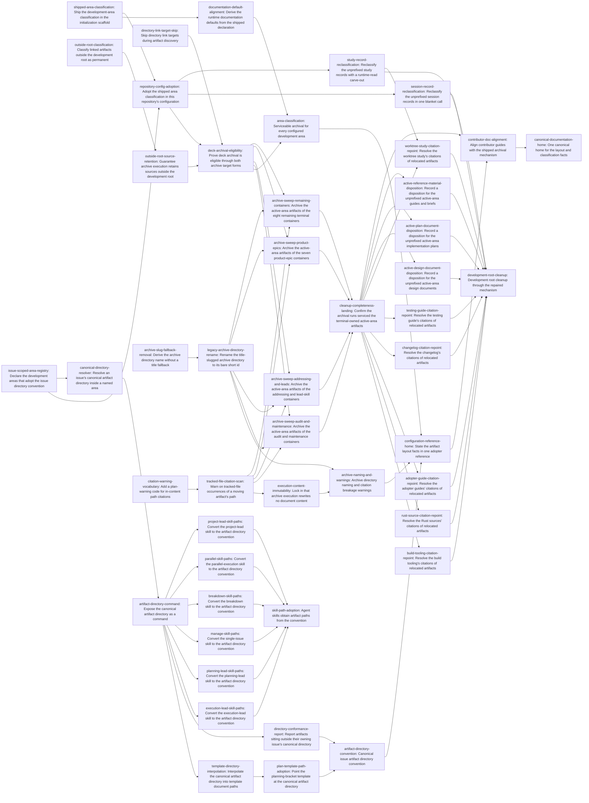

# Plan: Issue-based development artifact layout and serviceable archival (8e071e18)

> Planning node: 55fe8ec2. Authoritative graph:
> [8e071e18-breakdown.json](8e071e18-breakdown.json).

The epic has two halves that share one mechanism. The product half repairs archival so it can
service every artifact class, and introduces an issue-directory convention over a configured set of
issue-scoped areas, with a resolver, a command, and an advisory report. The adoption half runs that
repaired mechanism over this repository's own development root. Sequencing follows from D-10: the
cleanup consumes the repaired mechanism rather than substituting for it, so the classification,
naming, and warning work all land before any execution, and documentation lands last.

## Outcome and criterion approach

| Criterion | Approach | Evidence / open gap |
|---|---|---|
| REQ-01 | One shipped declaration of managed and permanent areas, emitted by the initialization scaffold; runtime accessor fallbacks derive from the same declaration. The scaffold, not the accessors, is the shipped-behaviour source, because policy completeness reads authored fields only. | Investigation claim 2, claim 3, Q2, invariant check |
| REQ-02 | Falls out of REQ-01 plus the two blocker relaxations; acceptance is a CLI-integration assertion over both target forms, read against the target-level blocker array. | Investigation claim 1, claim 4, design surface E |
| REQ-03 | One pure domain resolver over `issue-scoped-area-registry` and `membership-slug-precedence`, reusing the existing slug normalizer and the configured type-to-namespace mapping. | Investigation design surface C, design surface A |
| REQ-04 | A document subcommand over the resolver taking the issue and the area, single-value JSON shape, curated into the generated bridge manifest. | Investigation design surface A |
| REQ-05 | A template declaration stating its area plus an interpolation field carrying the resolved directory, then the repository template and its packaged profile twin adopt it. | Investigation design surface D |
| REQ-06 | A read-only report command walking the declared issue-scoped areas, non-blocking by construction rather than by a non-enforced rule that still rides inside the validation exit code. | Investigation design surface B |
| REQ-07 | Delete the title fallback in destination naming; rename the one title-slugged archive directory. The marker holds only the container id, so it needs no update and re-adoption is automatic. | Investigation claim 8, claim 9 |
| REQ-08 | A new warning code extending the closed schema-v1 vocabulary, then a tracked-file text scan at the storage/planning evidence boundary. Content immutability is already true and gets regression coverage. | Investigation claim 10, primitive verification |
| REQ-09 | Four bounded archival-execution assignments over named containers, one completeness pass over the active area, then per-consumer-family resolution of the warned inline citations. | Investigation claim 6, addendum citation census |
| REQ-10 | Per-file disposition for the active area, split by artifact class; one recorded blanket call each for the session and study areas, with the runtime-read measurement subtree carved out. | Investigation claim 6, D-15 premise verification, Q10 |
| REQ-11 | Six skill cutovers, one per skill, each editing its enumerated prompts and their packaged profile twins in the same change. | Investigation claim 13, consumer inventory |
| REQ-12 | The configuration reference becomes the canonical home; competing adopter statements become pointers and the two contributor guides are realigned. | Investigation claim 15, documentation inventory |
| REQ-13 | No dedicated work. Credited on the resolver and naming tasks (legacy shapes stay resolvable) and on the cleanup tasks (nothing breaks). | Investigation claim 8, layer assignment |
| REQ-14 | Thread the configured development root into the classification policy and scope the relaxation to paths outside it; retention already follows from the copy action and gets regression coverage. | Investigation R2, R3, layer assignment for REQ-14 |
| REQ-15 | Skip directory-typed link targets in artifact discovery — the addendum's remediation (i), which clears the whole `unsupported-artifact-type` population at once. | Investigation addendum headline, Q9 |

## Shared architectural contracts

### `shipped-area-declaration` [implementation-produced] — Shipped development-area classification

The single declaration of which areas under a development root are managed (move on archive) and
which are permanent (copy, source retained), plus the development-root files classified as exact
path entries. Emitted into the initialization scaffold and consumed by the runtime accessor
fallbacks; it is configuration the tool writes for an adopter, not classifier logic, which is what
keeps `@/invariant/domain-agnostic` intact (investigation invariant check). Matching is by path
prefix with an exact-path arm, so a file entry matches that file alone and a bare development-root
entry would defeat move-on-archive (investigation R4).

### `development-root-scoped-classification` [implementation-produced] — Out-of-root permanence

`ArtifactClassificationPolicy` carries the configured development root, and a selected root outside
it classifies permanent instead of raising `unmanaged-selected-root`. Scoped to *outside the
development root*, not to *matching no configured area*, so a mistyped area entry still raises the
blocker it exists to raise (D-17, investigation R2). The blocker code stays in the published
vocabulary.

### `directory-target-navigation` [implementation-produced] — Directory links are navigation

A document link whose target resolves to a directory is navigation, not an artifact: discovery skips
it and it contributes neither an artifact entry nor an `unsupported-artifact-type` blocker. Plan
eligibility is all-or-nothing across target-level blockers, artifact actions, and artifact-level
blockers (investigation R1), so this is a precondition for any eligible-plan criterion.

### `issue-scoped-area-registry` [implementation-produced] — Which areas adopt the convention

Configuration declares the areas under the development root that organize their artifacts by issue
(D-3). Today configuration supplies exactly one development root (`.jit/config.toml:11`) and nothing
distinguishes an issue-scoped area from a flat one, so a resolver handed only an issue would have to
guess among the four D-3 names. The registry removes the guess: a caller names one of the declared
areas and receives the directory inside it, and an undeclared area is an error rather than a silently
accepted path. The conformance report walks the same registry, so its scanned set is configured
rather than built in. Areas outside the registry keep their flat shape.

### `canonical-artifact-directory` [implementation-produced] — Issue artifact directory

`<area>/<short-id>-<slug>` when the issue resolves a single membership value, `<area>/<short-id>`
otherwise; filenames inside carry no short-id prefix. The area is a caller-supplied input validated
against `issue-scoped-area-registry`; the namespace comes from the configured type-to-namespace
mapping and the slug from the existing bounded normalizer. A caller therefore states only which area
it wants and never composes the `<short-id>-<slug>` segment itself, which is what keeps REQ-04
satisfied. Pure and I/O-free; the command, the template field, and the conformance report all
consume it.

### `membership-slug-precedence` [plan-fixed] — Slug source and ambiguity rule

Three steps: exactly one `type:*` label, then that type's configured membership namespace, then
exactly one value in it. Both ambiguous cases and the no-label case collapse to the bare short id —
no title fallback, no new tie-breaking policy. This is the shape the archive resolver already adopts
for legacy identifier-only directories (investigation claim 8, design surface C). Consumed
independently by the source-side resolver and by archive destination naming.

### `flat-layout-tolerance` [plan-fixed] — Legacy layouts are read, never restructured

The convention governs newly created artifacts. Pre-existing flat files, suffix-form filenames, and
identifier-only archive directories stay resolvable and are never restructured in place. This is why
enforcement is a resolver plus an advisory report rather than a validation rule: a cutover predicate
would be a false-positive source (D-4, D-7).

### `citation-warning-code` [implementation-produced] — In-content citation warning

A new `WarningCode` variant for an occurrence of a moving artifact's path in the text of a tracked
file. Extending the closed schema-v1 vocabulary is a deliberate cost: the enumeration, its
fixed-length exhaustive array, its wire spelling, and one golden assertion all change together
(investigation claim 10). The warning is advisory and changes no action, blocker, or eligibility.

## Generated decomposition overview

<!-- jit:breakdown-overview:begin -->
| Key | Title | Type | Outcome | Contracts | Sources | Footprint | Landing | Depends on |
|---|---|---|---|---|---|---|---|---|
| area-classification | Serviceable archival for every configured development area | story | Development areas are explicitly classified and the planner stops blocking artifacts it should copy or skip. | shipped-area-declaration, development-root-scoped-classification, directory-target-navigation | REQ-01, REQ-02, REQ-14, REQ-15, D-5, D-6, D-13, D-14, D-17, D-18, D-19, dev/active/8e071e18-investigation.md | — | — | documentation-default-alignment, deck-archival-eligibility |
| shipped-area-classification | Ship the development-area classification in the initialization scaffold | task | A single shipped declaration of managed and permanent development areas lands in the initialization scaffold. | — | REQ-01, D-5, D-13, D-19, dev/active/8e071e18-investigation.md | touches crates/jit/src/hierarchy_templates.rs; touches crates/jit/tests/cli_repo_workflow/init_tests.rs | shipped-classification | — |
| documentation-default-alignment | Derive the runtime documentation defaults from the shipped declaration | task | Configuration accessor fallbacks read the one shipped area declaration instead of restating it. | shipped-area-declaration | REQ-01, D-19, dev/active/8e071e18-investigation.md | touches crates/jit/src/config.rs | shipped-classification | shipped-area-classification |
| outside-root-classification | Classify linked artifacts outside the development root as permanent | task | A selected root outside the configured development root classifies permanent instead of raising a blocker. | — | REQ-14, D-14, D-17, dev/active/8e071e18-investigation.md | touches crates/jit/src/domain/artifact_classifier.rs; touches docs/reference/cli-commands.md | — | — |
| outside-root-source-retention | Guarantee archive execution retains sources outside the development root | task | Executing a plan that contains an out-of-root linked artifact leaves that file in place. | development-root-scoped-classification | REQ-14, D-14, dev/active/8e071e18-investigation.md | touches crates/jit/tests/cli_repo_workflow/archive_preview_cli_tests.rs | — | outside-root-classification |
| directory-link-target-skip | Skip directory link targets during artifact discovery | task | A link target that resolves to a directory is navigation and raises no unsupported-artifact-type blocker. | — | REQ-15, D-18, dev/active/8e071e18-investigation.md | touches crates/jit/src/domain/artifact_classifier.rs; touches crates/jit/tests/fast_docs_templates/artifact_discovery_tests.rs; touches docs/reference/cli-commands.md | — | — |
| repository-config-adoption | Adopt the shipped area classification in this repository's configuration | task | This repository's documentation policy names the same managed and permanent areas as the shipped scaffold. | shipped-area-declaration, issue-scoped-area-registry | REQ-01, D-3, D-5, D-6, D-13, dev/active/8e071e18-investigation.md | touches .jit/config.toml | — | shipped-area-classification, issue-scoped-area-registry |
| deck-archival-eligibility | Prove deck archival is eligible through both archive target forms | task | A presentation deck owned by a terminal issue previews eligible through either archive target form. | shipped-area-declaration, development-root-scoped-classification, directory-target-navigation | REQ-02, D-6, dev/active/8e071e18-investigation.md | touches crates/jit/tests/cli_repo_workflow/archive_preview_cli_tests.rs | — | repository-config-adoption, outside-root-source-retention, directory-link-target-skip |
| artifact-directory-convention | Canonical issue artifact directory convention | story | One resolver, one command, and one advisory report establish the issue artifact directory convention. | canonical-artifact-directory, issue-scoped-area-registry, membership-slug-precedence, flat-layout-tolerance | REQ-03, REQ-04, REQ-05, REQ-06, D-1, D-2, D-3, D-4, D-7, dev/active/8e071e18-investigation.md | — | — | plan-template-path-adoption, directory-conformance-report |
| issue-scoped-area-registry | Declare the development areas that adopt the issue directory convention | task | Configuration declares which development areas adopt the issue artifact directory convention. | — | REQ-03, D-3, dev/active/8e071e18-investigation.md | touches crates/jit/src/config.rs; touches crates/jit/src/hierarchy_templates.rs; touches crates/jit/tests/cli_repo_workflow/init_tests.rs | — | — |
| canonical-directory-resolver | Resolve an issue's canonical artifact directory inside a named area | task | A pure function maps an issue and a named area to the issue's canonical artifact directory. | issue-scoped-area-registry, membership-slug-precedence, flat-layout-tolerance | REQ-03, REQ-13, D-1, D-3, D-4, dev/active/8e071e18-investigation.md | creates crates/jit/src/domain/artifact_directory.rs; touches crates/jit/src/domain/mod.rs | — | issue-scoped-area-registry |
| artifact-directory-command | Expose the canonical artifact directory as a command | task | A subcommand prints an issue's canonical artifact directory in human and machine-readable form. | canonical-artifact-directory, issue-scoped-area-registry | REQ-04, D-7, dev/active/8e071e18-investigation.md | touches crates/jit/src/cli.rs; touches crates/jit/src/commands/document.rs; touches crates/jit/src/output.rs; touches crates/jit/tests/cli_repo_workflow/doc_show_tests.rs; touches docs/reference/cli-commands.md; touches mcp-server/curated-tools.json | — | canonical-directory-resolver |
| template-directory-interpolation | Interpolate the canonical artifact directory into template document paths | task | A template document path can name the container's canonical artifact directory in a stated area. | canonical-artifact-directory, issue-scoped-area-registry | REQ-05, D-2, dev/active/8e071e18-investigation.md | touches crates/jit/src/commands/template_expand.rs; touches crates/jit/src/commands/template.rs; touches crates/jit/src/commands/plan_doc.rs; touches crates/jit/tests/fast_docs_templates/template_apply_tests.rs; touches docs/how-to/adopt-planning-bracket.md; touches docs/examples/sdd/templates.toml; touches docs/examples/research/templates.toml | — | artifact-directory-command |
| plan-template-path-adoption | Point the planning-bracket template at the canonical artifact directory | task | The plan template's document path resolves inside the container's canonical directory with an unprefixed filename. | canonical-artifact-directory | REQ-05, D-2, D-11, dev/active/8e071e18-investigation.md | touches .jit/templates.toml; touches profiles/jit-dogfood/manifest.toml | template-path-cutover | template-directory-interpolation |
| directory-conformance-report | Report artifacts sitting outside their owning issue's canonical directory | task | An advisory report lists nonconforming artifacts under the declared issue-scoped areas. | canonical-artifact-directory, issue-scoped-area-registry, flat-layout-tolerance | REQ-06, D-7, dev/active/8e071e18-investigation.md | creates crates/jit/tests/cli_repo_workflow/artifact_conformance_cli_tests.rs; touches crates/jit/src/commands/document.rs; touches crates/jit/tests/cli_repo_workflow/main.rs; touches docs/reference/cli-commands.md; touches mcp-server/curated-tools.json | — | artifact-directory-command |
| archive-naming-and-warnings | Archive directory naming and citation breakage warnings | story | Archive directory names drop the title fallback and plans warn about in-content citations a move would break. | membership-slug-precedence, citation-warning-code, flat-layout-tolerance | REQ-07, REQ-08, D-8, D-9, D-16, dev/active/8e071e18-investigation.md | — | — | legacy-archive-directory-rename, execution-content-immutability |
| archive-slug-fallback-removal | Derive the archive directory name without a title fallback | task | The planner names an archive directory from a membership label or a bare short id and never from an issue title. | membership-slug-precedence, flat-layout-tolerance | REQ-07, REQ-13, D-1, D-9, dev/active/8e071e18-investigation.md | touches crates/jit/src/domain/artifact_classifier.rs; touches docs/reference/cli-commands.md | — | — |
| legacy-archive-directory-rename | Rename the title-slugged archive directory to its bare short id | task | The one title-slugged archive directory carries a conformant name and its container marker still resolves it. | flat-layout-tolerance | REQ-07, D-9, dev/active/8e071e18-investigation.md | creates dev/archive/a9b5dd08; touches dev/archive/a9b5dd08-use-strategic-label-slugs-in-archive-directory-n | — | archive-slug-fallback-removal |
| citation-warning-vocabulary | Add a plan-warning code for in-content path citations | task | The archive plan warning vocabulary carries a stable code for a citation of a moving artifact's path. | — | REQ-08, D-8, dev/active/8e071e18-investigation.md | touches crates/jit/src/domain/artifact_plan.rs; touches crates/jit/tests/fast_docs_templates/artifact_plan_model_tests.rs; touches docs/reference/cli-commands.md | — | — |
| tracked-file-citation-scan | Warn on tracked-file occurrences of a moving artifact's path | task | An archive plan reports a warning for each occurrence of a moving artifact's path in tracked file text. | citation-warning-code | REQ-08, D-16, dev/active/8e071e18-investigation.md | touches crates/jit/src/storage/artifact_planning.rs; touches crates/jit/src/domain/artifact_classifier.rs; touches crates/jit/tests/cli_repo_workflow/archive_preview_cli_tests.rs; touches docs/reference/cli-commands.md | — | citation-warning-vocabulary |
| execution-content-immutability | Lock in that archive execution rewrites no document content | task | A regression suite proves archive execution leaves relocated bytes untouched while relinking issue records. | — | REQ-08, D-8, dev/active/8e071e18-investigation.md | touches crates/jit/tests/cli_repo_workflow/archive_preview_cli_tests.rs | — | tracked-file-citation-scan |
| skill-path-adoption | Agent skills obtain artifact paths from the convention | story | Skill prompts obtain issue artifact paths from the convention, with each packaged twin updated in lockstep. | canonical-artifact-directory | REQ-11, D-11, dev/active/8e071e18-investigation.md | — | — | execution-lead-skill-paths, planning-lead-skill-paths, manage-skill-paths, breakdown-skill-paths, parallel-skill-paths, project-lead-skill-paths |
| execution-lead-skill-paths | Convert the execution-lead skill to the artifact directory convention | task | The execution-lead skill prompts name the canonical artifact directory instead of a flat short-id-prefixed path. | canonical-artifact-directory | REQ-11, D-11, dev/active/8e071e18-investigation.md | touches .agents/skills/jit-execution-lead/SKILL.md; touches .agents/skills/jit-execution-lead/references/progress-file.md; touches .agents/skills/jit-execution-lead/references/handoff-template.md; touches .agents/skills/jit-execution-lead/references/architect-agent-prompt.md; touches .agents/skills/jit-execution-lead/references/explorer-agent-prompt.md; touches .agents/skills/jit-execution-lead/references/doc-agent-prompt.md; touches profiles/jit-dogfood/assets/live/.agents/skills/jit-execution-lead/SKILL.md; touches profiles/jit-dogfood/assets/live/.agents/skills/jit-execution-lead/references/progress-file.md; touches profiles/jit-dogfood/assets/live/.agents/skills/jit-execution-lead/references/handoff-template.md; touches profiles/jit-dogfood/assets/live/.agents/skills/jit-execution-lead/references/architect-agent-prompt.md; touches profiles/jit-dogfood/assets/live/.agents/skills/jit-execution-lead/references/explorer-agent-prompt.md; touches profiles/jit-dogfood/assets/live/.agents/skills/jit-execution-lead/references/doc-agent-prompt.md | skill-twin-cutover | artifact-directory-command |
| planning-lead-skill-paths | Convert the planning-lead skill to the artifact directory convention | task | The planning-lead skill prompts name the canonical artifact directory instead of a flat short-id-prefixed path. | canonical-artifact-directory | REQ-11, D-11, dev/active/8e071e18-investigation.md | touches .agents/skills/jit-planning-lead/SKILL.md; touches .agents/skills/jit-planning-lead/references/investigator-prompt.md; touches .agents/skills/jit-planning-lead/references/researcher-prompt.md; touches .agents/skills/jit-planning-lead/references/plan-doc-template.md; touches profiles/jit-dogfood/assets/live/.agents/skills/jit-planning-lead/SKILL.md; touches profiles/jit-dogfood/assets/live/.agents/skills/jit-planning-lead/references/investigator-prompt.md; touches profiles/jit-dogfood/assets/live/.agents/skills/jit-planning-lead/references/researcher-prompt.md; touches profiles/jit-dogfood/assets/live/.agents/skills/jit-planning-lead/references/plan-doc-template.md | skill-twin-cutover | artifact-directory-command |
| manage-skill-paths | Convert the single-issue skill to the artifact directory convention | task | The single-issue skill prompts name the canonical artifact directory instead of a flat short-id-prefixed path. | canonical-artifact-directory | REQ-11, D-11, dev/active/8e071e18-investigation.md | touches .agents/skills/jit-manage/SKILL.md; touches .agents/skills/jit-manage/references/issue-extraction-prompt.md; touches profiles/jit-dogfood/assets/live/.agents/skills/jit-manage/SKILL.md; touches profiles/jit-dogfood/assets/live/.agents/skills/jit-manage/references/issue-extraction-prompt.md | skill-twin-cutover | artifact-directory-command |
| breakdown-skill-paths | Convert the breakdown skill to the artifact directory convention | task | The breakdown skill prompt names the canonical artifact directory instead of a flat short-id-prefixed path. | canonical-artifact-directory | REQ-11, D-11, dev/active/8e071e18-investigation.md | touches .agents/skills/jit-breakdown/SKILL.md; touches profiles/jit-dogfood/assets/live/.agents/skills/jit-breakdown/SKILL.md | skill-twin-cutover | artifact-directory-command |
| parallel-skill-paths | Convert the parallel-execution skill to the artifact directory convention | task | The parallel-execution skill template names the canonical artifact directory instead of a flat short-id-prefixed path. | canonical-artifact-directory | REQ-11, D-11, dev/active/8e071e18-investigation.md | touches .agents/skills/jit-parallel/references/agent-prompt-template.md; touches profiles/jit-dogfood/assets/live/.agents/skills/jit-parallel/references/agent-prompt-template.md | skill-twin-cutover | artifact-directory-command |
| project-lead-skill-paths | Convert the project-lead skill to the artifact directory convention | task | The project-lead skill prompts name the canonical artifact directory instead of a flat short-id-prefixed path. | canonical-artifact-directory | REQ-11, D-11, dev/active/8e071e18-investigation.md | touches .agents/skills/jit-project-lead/SKILL.md; touches .agents/skills/jit-project-lead/references/progress-artifact.md; touches .agents/skills/jit-project-lead/references/vision-charter.md; touches .agents/skills/jit-project-lead/references/templates/vision-charter.md; touches .agents/skills/jit-project-lead/references/standards-scan.md; touches .agents/skills/jit-project-lead/references/standards-sweep.md; touches .agents/skills/jit-project-lead/references/standards-fix.md; touches profiles/jit-dogfood/assets/live/.agents/skills/jit-project-lead/SKILL.md; touches profiles/jit-dogfood/assets/live/.agents/skills/jit-project-lead/references/progress-artifact.md; touches profiles/jit-dogfood/assets/live/.agents/skills/jit-project-lead/references/vision-charter.md; touches profiles/jit-dogfood/assets/live/.agents/skills/jit-project-lead/references/templates/vision-charter.md; touches profiles/jit-dogfood/assets/live/.agents/skills/jit-project-lead/references/standards-scan.md; touches profiles/jit-dogfood/assets/live/.agents/skills/jit-project-lead/references/standards-sweep.md; touches profiles/jit-dogfood/assets/live/.agents/skills/jit-project-lead/references/standards-fix.md | skill-twin-cutover | artifact-directory-command |
| development-root-cleanup | Development root cleanup through the repaired mechanism | story | The development root is cleaned up by the repaired archival mechanism, with a recorded disposition for the rest. | shipped-area-declaration, citation-warning-code, flat-layout-tolerance | REQ-09, REQ-10, REQ-13, D-10, D-15, dev/active/8e071e18-investigation.md | — | — | build-tooling-citation-repoint, rust-source-citation-repoint, adopter-guide-citation-repoint, changelog-citation-repoint, testing-guide-citation-repoint, worktree-study-citation-repoint, active-design-document-disposition, active-plan-document-disposition, active-reference-material-disposition, session-record-reclassification, study-record-reclassification |
| archive-sweep-audit-and-maintenance | Archive the active-area artifacts of the audit and maintenance containers | task | Two named terminal containers relocate their active-area artifacts through the archival execution path. | shipped-area-declaration, development-root-scoped-classification, directory-target-navigation, citation-warning-code, flat-layout-tolerance | REQ-09, D-10, dev/active/8e071e18-investigation.md | creates dev/archive/2d109173-docs-exhaustive-audit; creates dev/archive/6eb585bc-core-maintenance; touches dev/active/2b9a80fb-audit-notes.md; touches dev/active/36d5451e-audit-notes.md; touches dev/active/36d5451e-review-round-4.md; touches dev/active/36d5451e-review-round-5.md; touches dev/active/36d5451e-review-round-6.md; touches dev/active/4c33d0e5-audit-notes.md; touches dev/active/6d82de03-followup-manifest.md; touches dev/active/6d82de03-lead-review.md; touches dev/active/736a069e-audit-notes.md; touches dev/active/7c283e95-audit-notes.md; touches dev/active/8682e95a-gapfill-notes.md; touches dev/active/99f4a2b4-req02-evidence.md; touches dev/active/a70bac75-audit-notes.md; touches dev/active/adc4c6ef-relocation-notes.md; touches dev/active/b8924a6d-audit-notes.md; touches dev/active/d24008f0-req01-evidence.md; touches dev/active/3e12ffbd-batch-export-design.md; touches dev/active/3e12ffbd-batch-export-use-cases.md; touches dev/active/450db193-generic-projection-design.md; touches dev/active/45a140ae-archived-semantics.md; touches dev/active/71be6ae9-code-review-reliability.md; touches dev/active/71be6ae9-live-review-report.md; touches dev/active/73482aa1-completion-report.md; touches dev/active/76cb968b-citation-check.md; touches dev/active/76cb968b-ssot-adoption-sweep.md; touches dev/active/76cb968b-sweep-table.md; touches dev/active/949cd9d0-gate-verb-semantics.md; touches dev/active/af4c901a-derive-default-rules-at-load.md; touches dev/active/b4e55aa2-code-review-live-verification.md; touches dev/active/b4e55aa2-ground-code-review-policy.md; touches dev/active/d74a9ed1-write-through-namespace-unique-membership.md; uncertain: Each run also relocates its container's linked artifacts in the other configured areas, as that container's plan determines. | cleanup-run | deck-archival-eligibility, legacy-archive-directory-rename, tracked-file-citation-scan |
| archive-sweep-addressing-and-leads | Archive the active-area artifacts of the addressing and lead-skill containers | task | Four named terminal containers relocate their active-area artifacts through the archival execution path. | shipped-area-declaration, development-root-scoped-classification, directory-target-navigation, citation-warning-code, flat-layout-tolerance | REQ-09, D-10, dev/active/8e071e18-investigation.md | creates dev/archive/2821e177-addressing-v2; creates dev/archive/9b7b5f9c-jit-profiles; creates dev/archive/9ac9fdac-graph-templates; creates dev/archive/f2532a2d-jit-project-lead; touches dev/active/0efbc594-breakdown-spec.md; touches dev/active/2821e177-2d2d-4b25-b64a-4f38723e7fe6-plan.md; touches dev/active/2821e177-investigation.md; touches dev/active/37506c12-breakdown-spec.md; touches dev/active/637764ef-acceptance-evidence.md; touches dev/active/71ebd1e8-breakdown-spec.md; touches dev/active/7f22d6cf-breakdown-spec.md; touches dev/active/9a7106ae-breakdown-spec.md; touches dev/active/bb7d57a2-breakdown-spec.md; touches dev/active/8b05a612-investigation.md; touches dev/active/8b05a612-plan.md; touches dev/active/8b05a612-research.md; touches dev/active/9b7b5f9c-investigation.md; touches dev/active/9b7b5f9c-mvp-scope-brief.md; touches dev/active/9b7b5f9c-plan.md; touches dev/active/9b7b5f9c-research.md; touches dev/active/57269494-apply-plan-doc.md; touches dev/active/9ac9fdac-828a-40f2-9d73-71af14f44ff8-plan.md; touches dev/active/9ac9fdac-completion-report.md; touches dev/active/9ac9fdac-graph-templates-showcase/base.css; touches dev/active/9ac9fdac-graph-templates-showcase/talk.html; touches dev/active/9ac9fdac-graph-templates-showcase/themes/rust.css; touches dev/active/304f6d94-breakdown-spec.md; touches dev/active/3c192f5e-breakdown-spec.md; touches dev/active/c23dfe71-breakdown-spec.md; touches dev/active/e8b1cee3-breakdown-spec.md; touches dev/active/eed6750c-handoff.md; touches dev/active/f2532a2d-138d-46bf-9547-e1ea517f0170-plan.md; uncertain: Each run also relocates its container's linked artifacts in the other configured areas, as that container's plan determines. | cleanup-run | deck-archival-eligibility, legacy-archive-directory-rename, tracked-file-citation-scan |
| archive-sweep-product-epics | Archive the active-area artifacts of the seven product-epic containers | task | Seven named terminal containers relocate their active-area artifacts through the archival execution path. | shipped-area-declaration, development-root-scoped-classification, directory-target-navigation, citation-warning-code, flat-layout-tolerance | REQ-09, D-10, dev/active/8e071e18-investigation.md | creates dev/archive/14303b30-phase5-2; creates dev/archive/25064508-structured-knowledge; creates dev/archive/5fe00921-production-stability; creates dev/archive/2fbd2a82-planning-bracket; creates dev/archive/7d3a3a47; creates dev/archive/94f873c8-docs-lifecycle-p2; creates dev/archive/9d427a6b-production-polish; touches dev/active/bulk-operations-plan.md; touches dev/active/ci-gate-integration-design.md; touches dev/active/gate-examples.md; touches dev/active/gate-modification-flags-plan.md; touches dev/active/quiet-mode-plan.md; touches dev/active/0d593d90-invariant-projection-design.md; touches dev/active/1e1ea81d-item-kind-six-tuple.md; touches dev/active/21558ace-invariants-registry.md; touches dev/active/56ab0224-item-model-design.md; touches dev/active/93480b00-invariant-registry-first-kind.md; touches dev/active/config-consolidation-documentation-requirements.md; touches dev/active/config-consolidation-plan.md; touches dev/active/multi-issue-bulk-operations-plan.md; touches dev/active/production-stability-design.md; touches dev/active/transitive-reduction-validation-plan.md; touches dev/active/planning-bracket-design.md; touches dev/active/planning-bracket-showcase/base.css; touches dev/active/planning-bracket-showcase/talk.html; touches dev/active/planning-bracket-showcase/themes/rust.css; touches dev/active/7d3a3a47-investigation.md; touches dev/active/7d3a3a47-plan.md; touches dev/active/7d3a3a47-planning-brief.md; touches dev/active/5c060496-raw-assets-design.md; touches dev/active/abfd6016-multi-format-doc-rendering-design.md; touches dev/active/documentation-lifecycle-phase2-design.md; touches dev/active/dependency-display-improvements-plan.md; touches dev/active/gate-presets-implementation-plan.md; touches dev/active/production-polish-design.md; uncertain: Each run also relocates its container's linked artifacts in the other configured areas, as that container's plan determines. | cleanup-run | deck-archival-eligibility, legacy-archive-directory-rename, tracked-file-citation-scan |
| archive-sweep-remaining-containers | Archive the active-area artifacts of the eight remaining terminal containers | task | Eight named terminal containers relocate their active-area artifacts through the archival execution path. | shipped-area-declaration, development-root-scoped-classification, directory-target-navigation, citation-warning-code, flat-layout-tolerance | REQ-09, D-10, dev/active/8e071e18-investigation.md | creates dev/archive/2e926e39-agent-seamlessness; creates dev/archive/71373e37-docs-lifecycle; creates dev/archive/90a2dbfd-item-sources; creates dev/archive/4a00b2b0-agent-validation; creates dev/archive/53e3fa36-agent-ergonomics; creates dev/archive/7095769d-code-smell-cleanup; creates dev/archive/93f3e4df-rejection-state; creates dev/archive/d7bfd4a4-observability; touches dev/active/2e926e39-906e-4952-8ae0-38215a7e5aac-plan.md; touches dev/active/2e926e39-completion-report.md; touches dev/active/doc-archive-implementation-guide.md; touches dev/active/snapshot-export-implementation-plan.md; touches dev/active/90a2dbfd-be54-46f2-b84a-b19382c6b0f2-plan.md; touches dev/active/90a2dbfd-kinds-over-sources.md; touches dev/active/agent-validation-design.md; touches dev/active/53e3fa36-c0cb-4206-8e8e-0a21aafb213e-plan.md; touches dev/active/7095769d-smell-hunt-report.md; touches dev/active/rejection-state-design.md; touches dev/active/observability-design.md; uncertain: Each run also relocates its container's linked artifacts in the other configured areas, as that container's plan determines. | cleanup-run | deck-archival-eligibility, legacy-archive-directory-rename, tracked-file-citation-scan |
| cleanup-completeness-landing | Confirm the archival runs serviced the terminal-owned active-area artifacts | task | The archival runs are confirmed complete against the active area with their citation warnings consolidated. | shipped-area-declaration, citation-warning-code, flat-layout-tolerance | REQ-09, REQ-13, D-8, D-10, dev/active/8e071e18-investigation.md | creates dev/active/8e071e18-cleanup-citation-warnings.md; uncertain: The judgement reads the whole active area and the archive root; the consolidated warning list is the only file it writes. | cleanup-run | archive-sweep-audit-and-maintenance, archive-sweep-addressing-and-leads, archive-sweep-product-epics, archive-sweep-remaining-containers |
| build-tooling-citation-repoint | Resolve the build tooling's citations of relocated artifacts | task | The build scripts and the workspace manifest cite paths that resolve after the cleanup. | citation-warning-code, flat-layout-tolerance | REQ-09, D-8, D-16, dev/active/8e071e18-investigation.md | touches scripts/rust-build-budget.sh; touches scripts/cargo-ci.sh; touches Cargo.toml | cleanup-run | cleanup-completeness-landing |
| rust-source-citation-repoint | Resolve the Rust sources' citations of relocated artifacts | task | The production module comment and the test comment cite a path that resolves after the cleanup. | citation-warning-code, flat-layout-tolerance | REQ-09, D-8, D-16, dev/active/8e071e18-investigation.md | touches crates/jit/src/storage/claim_coordinator.rs; touches crates/jit/tests/cli_repo_workflow/config_get_tests.rs | cleanup-run | cleanup-completeness-landing |
| adopter-guide-citation-repoint | Resolve the adopter guides' citations of relocated artifacts | task | The adopter tutorial and how-to cite a design-document path that resolves after the cleanup. | citation-warning-code, flat-layout-tolerance | REQ-09, D-8, D-16, dev/active/8e071e18-investigation.md | touches docs/tutorials/parallel-work-worktrees.md; touches docs/how-to/multi-agent-coordination.md | cleanup-run | cleanup-completeness-landing |
| changelog-citation-repoint | Resolve the changelog's citations of relocated artifacts | task | The changelog entries cite an artifact path that resolves after the cleanup. | citation-warning-code, flat-layout-tolerance | REQ-09, D-8, D-16, dev/active/8e071e18-investigation.md | touches CHANGELOG.md | cleanup-run | cleanup-completeness-landing |
| testing-guide-citation-repoint | Resolve the testing guide's citations of relocated artifacts | task | The contributor testing guide cites artifact paths that resolve after the cleanup. | citation-warning-code, flat-layout-tolerance | REQ-09, D-8, D-16, dev/active/8e071e18-investigation.md | touches dev/TESTING.md | cleanup-run | cleanup-completeness-landing |
| worktree-study-citation-repoint | Resolve the worktree study's citations of relocated artifacts | task | The worktree-compatibility study cites artifact paths that resolve after the cleanup. | citation-warning-code, flat-layout-tolerance | REQ-09, D-8, D-16, dev/active/8e071e18-investigation.md | touches dev/studies/ai-tool-worktree-compatibility.md | cleanup-run | cleanup-completeness-landing, study-record-reclassification |
| active-design-document-disposition | Record a disposition for the unprefixed active-area design documents | task | Each unprefixed design document in the active area carries one recorded disposition. | shipped-area-declaration | REQ-10, D-15, dev/active/8e071e18-investigation.md | touches dev/active/agent-validation-design.md; touches dev/active/ci-gate-integration-design.md; touches dev/active/documentation-lifecycle-design.md; touches dev/active/documentation-lifecycle-phase2-design.md; touches dev/active/observability-design.md; touches dev/active/planning-bracket-design.md; touches dev/active/production-polish-design.md; touches dev/active/production-stability-design.md; touches dev/active/rejection-state-design.md | — | cleanup-completeness-landing |
| active-plan-document-disposition | Record a disposition for the unprefixed active-area implementation plans | task | Each unprefixed implementation plan in the active area carries one recorded disposition. | shipped-area-declaration | REQ-10, D-15, dev/active/8e071e18-investigation.md | touches dev/active/bulk-operations-plan.md; touches dev/active/config-consolidation-plan.md; touches dev/active/dependency-display-improvements-plan.md; touches dev/active/gate-modification-flags-plan.md; touches dev/active/gate-presets-implementation-plan.md; touches dev/active/json-output-standardization-plan.md; touches dev/active/multi-issue-bulk-operations-plan.md; touches dev/active/quiet-mode-plan.md; touches dev/active/snapshot-export-implementation-plan.md; touches dev/active/transitive-reduction-validation-plan.md | — | cleanup-completeness-landing |
| active-reference-material-disposition | Record a disposition for the unprefixed active-area guides and briefs | task | Each unprefixed guide or brief in the active area carries one recorded disposition. | shipped-area-declaration | REQ-10, D-15, dev/active/8e071e18-investigation.md | touches dev/active/config-consolidation-documentation-requirements.md; touches dev/active/doc-archive-implementation-guide.md; touches dev/active/gate-examples.md; touches dev/active/v1-production-readiness-scope-brief.md | — | cleanup-completeness-landing |
| session-record-reclassification | Reclassify the unprefixed session records in one blanket call | task | The session area's unprefixed dated records carry one recorded blanket disposition. | shipped-area-declaration | REQ-10, D-15, dev/active/8e071e18-investigation.md | touches dev/sessions | — | repository-config-adoption |
| study-record-reclassification | Reclassify the unprefixed study records with a runtime-read carve-out | task | The study area's unprefixed records carry one blanket disposition while the runtime-read subtree stays put. | shipped-area-declaration | REQ-10, D-15, dev/active/8e071e18-investigation.md | touches dev/studies | — | repository-config-adoption |
| canonical-documentation-home | One canonical home for the layout and classification facts | story | The layout convention and area classification get one canonical adopter home that other documents cite. | shipped-area-declaration, canonical-artifact-directory | REQ-12, D-5, dev/active/8e071e18-investigation.md | — | — | contributor-doc-alignment |
| configuration-reference-home | State the artifact layout facts in one adopter reference | task | The configuration reference is the single adopter-facing home for the directory convention and area classification. | shipped-area-declaration, canonical-artifact-directory, membership-slug-precedence, flat-layout-tolerance | REQ-12, REQ-04, D-5, D-13, dev/active/8e071e18-investigation.md | touches docs/reference/configuration.md; touches docs/reference/example-config.toml; touches docs/reference/glossary.md; touches docs/how-to/adopt-planning-bracket.md; touches README.md | documentation-cutover | area-classification, artifact-directory-convention, archive-naming-and-warnings |
| contributor-doc-alignment | Align contributor guides with the shipped archival mechanism | task | Contributor guides cite the canonical adopter reference instead of narrating a lifecycle the tool does not implement. | shipped-area-declaration, canonical-artifact-directory | REQ-12, D-13, dev/active/8e071e18-investigation.md | touches dev/index.md; touches dev/authoring-conventions.md | documentation-cutover | configuration-reference-home, cleanup-completeness-landing |

<!-- jit:breakdown-overview:end -->

## Material risks and owner decisions

| Risk / decision | Resolution and rationale |
|---|---|
| REQ-01 as written is satisfiable without achieving REQ-02 | Chose the initialization scaffold as the classification's home (D-19); rejected accessor-default-only shipping because policy completeness ignores defaults, and rejected making completeness honour defaults because it changes eligibility for every existing repository. |
| A blocker class no criterion originally covered | 376 `unsupported-artifact-type` instances across 16 containers, independent of any path decision, and eligibility is all-or-nothing. Chose the domain skip (D-18, REQ-15); rejected rewriting the legitimate directory links and rejected narrowing REQ-09. |
| REQ-07 reverses a shipped, reviewed decision | The title fallback was introduced by a reviewed predecessor issue. Reversal is deliberate and safe because destination names freeze at first archive and re-adopt by marker; exactly one directory needs renaming and its marker encodes no name (investigation claim 9). |
| REQ-08 extends a closed wire contract | Accepted the schema cost of a ninth warning code; rejected a link-target-only scan, which reaches a small minority of real citations, and rejected scoping the scan to the development root, which misses the script and changelog citations (D-16). |
| REQ-11 versus the packaged profile twins | Every target skill file is a byte-equality-asserted profile asset, so root-only edits fail the suite. Each skill cutover edits both trees in one change (D-11), and each cutover enumerates its files so the twin pairing is checkable per file rather than per directory. |
| One development root, four issue-scoped areas | D-3 names four areas that adopt the convention while configuration supplies a single development root, so a resolver taking only an issue cannot pick among them. Chose a configured registry of issue-scoped areas and a caller-supplied area argument (`issue-scoped-area-registry`); rejected inferring the area from the issue, which has no deterministic answer, and rejected a fixed built-in area list, which would put a `dev/`-shaped literal into engine code against `@/invariant/domain-agnostic`. |
| A live container's planning artifacts are owned by a terminal node | A planning-bracket node completes long before the container it brackets, and it is the node that holds the plan, investigation, and research document links. An execution assignment therefore archives a live epic's planning artifacts. This is correct under the mechanism's own ownership rule, which REQ-09 keys on, and execution relinks those records so the live container still resolves them from the archive. |
| Relocation is not the only archival outcome | An artifact an owner outside the archived subtree also claims is mirrored by copy with its source retained, so it stays where it is and its citations keep resolving. The citation work is therefore written as *the citation resolves*, not as *the citation was edited*, and the completeness pass records which artifacts took which outcome. |
| Footprint overlap is not ordered by any dependency edge | The classifier module, the CLI command reference, and the archive-preview integration suite are each touched by several terminals, and many of those pairs have no dependency path in either direction — including pairs inside one story, since the classifier terminals are all roots. This is deliberate: a file conflict is not a dependency, and encoding it as an edge would serialize logically independent work. The manifest's footprint fields are the signal instead. Dispatch must read them and place two terminals that share a file in different waves; the validator's overlap advisories enumerate the current set, so no count is restated here. |
| Cross-container citations move at different times | Two artifact areas cross-reference each other and their owners sit in different containers, so a per-container execution breaks one side until the second container archives. The execution assignments and the citation work share the `cleanup-run` landing group, and the completeness pass sits between them so every run's warnings are in hand before any citation is touched. |
| The execution assignments are measured, not exhaustive by construction | The four assignments name the containers that a candidate report measured as covering the active area's relocatable artifacts, chosen as the maximal set so no assignment is a subset of another. A container whose artifact set grows after the measurement would fall outside them, which is why the completeness pass judges the active area as a whole rather than trusting the assignment list. |
| REQ-14 read literally over-promises | Eligibility is all-or-nothing, so a plan containing an out-of-root artifact can still be ineligible for unrelated reasons. Acceptance is written against the criterion's own testable clauses — no `unmanaged-selected-root` for out-of-root paths, and no relocation outside the development root. |
| REQ-13 has no owning task | Credited on the resolver, the naming change, and the completeness pass. If a reviewer wants a single artifact for it, the completeness pass's validation run plus the per-family citation checks are the evidence. |
| `dev/plans` suffix-form filenames | Four of six files carry a trailing rather than leading short id, so a prefix-based resolver will not recognize them. They archive correctly regardless, because archival membership comes from document links, not filename parsing (investigation claim 15 revisited). |

## Investigation sources

- [Investigation](8e071e18-investigation.md) — consumer inventory, blocker censuses, the in-content
  citation census with `path:line`, per-decision premise verification, and layer assignments remain
  there. Its addendum supersedes earlier sections where they disagree.
