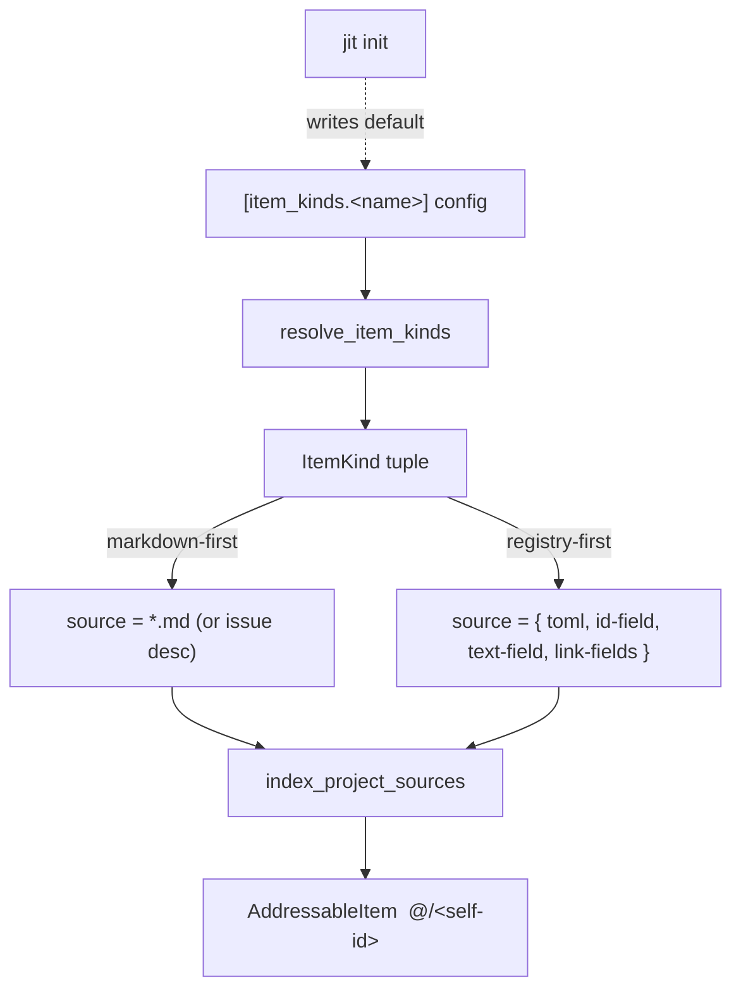

# Generalize addressable items to declarative kinds over markdown/toml sources

**Issue:** 90a2dbfd
**Type:** story
**Priority:** normal
**Date:** 2026-06-26

## Problem Statement

The addressable-items engine shipped in epic `25064508` (done) introduced
project-scoped addressable items: structured list entries projected to globally
unique qualified ids (`<issue>/REQ-01`, `@/INV-01`) that work can reference via
namespace-qualified labels (`satisfies:`, `per:`, `mitigates:`, `enforces:`).
One project-scoped kind shipped: `invariant`, registry-first from
`.jit/invariants.toml`.

Dogfooding invariants on this repo surfaced two things. First, a "red wall":
`jit invariant check` reported 18 `enforced-but-undeclared` findings because the
check demands an invariant per rule and per gate, most of which (process gates
like `tdd-reminder`, `plan-review`) will never back a property invariant.
Second, and more fundamentally, a question of genericity: should each new
project-level concept (decision, definition, risk, rule, gate) be hard-coded
like `invariant` was, or is the engine already generic enough to declare them as
config?

Investigation showed the engine is **almost entirely generic already**. The
hard-coding is narrow and removable. This issue removes it, making the item
model a fully declarative "kinds over sources" system, and lands the coupled
drift simplification.

## What is already generic (verified)

- `ItemKind` is a generic tuple `(name, section, id-pattern, markers,
  link-namespaces, scope, source, source-of-truth)`
  (`crates/jit/src/domain/item.rs:425`).
- `ItemKind::from_config(name, cfg)` builds **any** kind from an
  `[item_kinds.<name>]` table (`item.rs:462`). The four built-ins
  (requirement/decision/risk/invariant) are just `from_config` calls with
  default values (`item.rs:544/580/626/687`).
- `resolve_item_kinds` returns the built-ins only when no `[item_kinds]` table
  exists; a present table is used **verbatim and replaces the defaults**
  (`item.rs:1215`).
- Project-scoped **markdown** sources are fully general: a kind declares
  `scope = "project"` + `source = "anyfile.md"` + section/pattern, and
  `index_project_sources` (`item.rs:1155`) reads that file. A
  `[item_kinds.glossary]` example already exists in the test suite
  (`crates/jit/src/commands/item.rs:506`).

So declaring a `.md` file as a source for addressable items **works today, with
zero code**.

## What is hard-coded (the only blockers)

1. **The name `"invariant"` is reserved** (`item.rs:496-500`): it must be
   project-scoped + registry-first or `from_config` returns
   `InvariantMustBeProjectRegistryFirst`.
2. **The registry-first (`.toml`) path is wired to one registry** —
   `InvariantRegistry::load(.jit/invariants.toml)` (`config.rs:1232`,
   `config.rs:1271`), passed to `index_project_sources` as `registry_items`. A
   kind cannot name an arbitrary `.toml`; registry-first ignores the `source`
   field and pulls from that single registry.

Everything else is config.

## The project-scoped item taxonomy

The three issue-scoped kinds each have a project-scoped analogue. The model
already crossed the boundary for one; the rest are unfinished symmetry:

| Issue-scoped (one issue) | Project-scoped (the repo) | Status |
|---|---|---|
| requirement (`<id>/REQ-01`) | invariant (`@/INV-01`) | shipped |
| decision (`<id>/D-01`) | ADR / project decision (`@/D-05`) | proposed |
| risk (`<id>/RISK-01`) | program risk (`@/RISK-01`) | proposed |

Plus two **descriptive/structural** kinds that have no issue-scoped origin:

- **definition** — the canonical meaning of a term or the value of a policy
  constant. A fourth semantic category beyond requirement (must HOLD), decision
  (was CHOSEN), risk (might THREATEN): definition (simply IS / MEANS).
  Definitions are the shared *referent* the other kinds point at, so an
  invariant or requirement cites `@/DEF-assignee-format` instead of restating
  the grammar inline. Evidence of need: the assignee `{type}:{identifier}` and
  label `namespace:value` grammars are physically restated across 10+ code and
  doc files; `docs/reference/glossary.md` is the canonical prose home but is
  inert (not addressable, not drift-checked).
- **rule / gate** — the *enforcement* layer. Already project-level registries
  (`rules.toml`, `gates.json`) and already the target of every `enforced-by`
  binding. Making them addressable lets `enforced-by` resolve uniformly and lets
  work link `enforces:@/<rule>` directly.

Evidence the decision kind is needed: "Decision D5" is referenced from running
code (`drift.rs:20`, `local.rs:239`, `local.rs:291`) but defined only in an
archived plan doc — a dangling cross-reference with no stable address.

### Two source substrates and when to use each

- **Markdown-first** when an item is prose with a stable id and links:
  requirement, decision, definition, risk. The `(id, text, links)` triple is
  derived uniformly from section + pattern + label parsing. No code needed —
  pure `[item_kinds]` config over an arbitrary `.md`.
- **Registry-first (`.toml`)** only when an item has **typed fields that drive
  behavior**: invariant's `kind = enforced/advisory` + `enforced-by`; a rule's
  `assert` clause; a gate's `mode`/`stage`. These cannot be a markdown bullet
  and need a field mapping.

## Design



The organizing moves, in order:

1. **Ship descriptive project kinds as markdown-first config.** Decisions,
   definitions, program risks need no engine code — point `[item_kinds]` at
   `glossary.md` / `DECISIONS.md` with sections and id-patterns. (This is the
   immediately-shippable, no-code step; it validates the model before the
   harder work.)

2. **Generalize the registry-first path into a declared structured source.**
   Replace the single hard-wired `invariants.toml` with a `source` mapping, e.g.

   ```toml
   [item_kinds.invariant]
   scope = "project"
   source = { toml = "invariants.toml", table = "invariants",
              id-field = "id", text-field = "statement" }
   link-namespaces = ["enforces"]
   ```

   `index_project_sources` already pools markdown candidates with
   `registry_items`; the change is to *derive* `registry_items` from a
   config-named `.toml` + field map rather than the hardcoded
   `InvariantRegistry::load`. The typed-field validation (enforced/advisory,
   `enforced-by`) stays in `validation/invariants.rs` as a kind-specific
   loader, but the *addressing* path no longer names invariants.

3. **Retire the reserved `invariant` name** (`item.rs:496-500`). Once any
   `.toml` can back a kind, `invariant` is ordinary config; the name branch and
   `InvariantMustBeProjectRegistryFirst` are deleted.

4. **Demote the baked defaults to a `jit init`-authored `[item_kinds]` table**,
   exactly like `rules.toml` ("Generated by jit init... the SOLE source when
   present"). The binary then carries no domain kind names. A legal or hardware
   project redefines the kind set without touching code — consistent with jit's
   domain-agnostic principle.

5. **Simplify enforcement-drift.** Retiring the reserved name and (optionally)
   making rules/gates addressable changes the drift surface:
   - Drop the `enforced-but-undeclared` direction for **gates** entirely — a
     process gate owes no invariant. (User decision: the gate nag has no value.)
   - Keep `declared-but-unenforced` (an invariant's `enforced-by` resolves to
     nothing) as the **sole error** — it is the only genuine integrity check,
     and it is green on the seed registry.
   - If rules become addressable items, they are self-accounting, so the
     `enforced-but-undeclared` direction can be dropped for rules too, collapsing
     drift to one direction.

6. **Region-mode projection into `CLAUDE.md`.** `[invariant_projection]` (or the
   generalized projection) targets a begin/end region inside `CLAUDE.md` so the
   "## Domain Invariants" section becomes a projection of the registry, not a
   hand-maintained duplicate.

### A test can enforce an invariant only through its gate

`enforced-by` confirms a binding by membership in the loadable rule set or gate
registry (`drift.rs:333`); there is no enumerable test registry. So a test
enforces an invariant *transitively, through the gate that runs the suite*
(`cargo-ci`/`tests`). The addressable enforcer is the gate, not the test. DAG
acyclicity, for example, is enforced by `jit validate` (`commands/validate.rs:633`)
— so `INV-DAG-ACYCLIC`'s accurate `enforced-by` is `jit-validate`, not a
non-existent `dag-no-cycles` rule.

## Implementation Steps

1. (No-code spike) Declare a `definition` kind in this repo's `[item_kinds]`
   over `docs/reference/glossary.md`; confirm `jit item list --kind definition`
   indexes it. Proves the markdown path end-to-end.
2. Add a structured-`.toml` source descriptor to `ItemKindConfig` (`config.rs`)
   with field mapping; thread it into `index_project_sources` (`item.rs:1155`)
   so `registry_items` are derived from the named table.
3. Move invariant-specific typed loading behind that descriptor; delete the
   reserved-name branch (`item.rs:496-500`) and `InvariantMustBeProjectRegistryFirst`.
4. Have `jit init` emit a default `[item_kinds]` table; remove the
   `*_default()` baked kinds from the indexing path (keep behind init template).
5. Simplify `drift.rs`: drop gate (and rule, if addressable) `enforced-but-undeclared`;
   keep `declared-but-unenforced` as error. Update `commands/validate.rs`
   integration and `jit invariant check` exit semantics.
6. Add region-mode projection target support for `CLAUDE.md`; re-point the
   Domain Invariants section.
7. (If pursuing rule/gate kinds) Resolve the `:`-in-self-id label grammar
   (`labels.rs:24`): either widen the value grammar or remap rule self-ids.

## Testing Approach

- Integration test: a config-declared markdown-first project kind indexes items
  from an arbitrary `.md` (REQ-01).
- Unit/integration test: a non-invariant kind backed by a custom `.toml` via the
  field mapping yields `@/<self-id>` items (REQ-02).
- Regression: removing the reserved branch keeps `jit item list --kind invariant`
  working from `invariants.toml` (REQ-03).
- `grep` assertion / test that no kind-name literal drives indexing; `jit init`
  golden test for the `[item_kinds]` table (REQ-04).
- `drift.rs` unit tests updated: no gate `enforced-but-undeclared`; seed registry
  yields zero findings; a dangling `enforced-by` still errors (REQ-05).
- Projection test: rendering into a `CLAUDE.md` region round-trips (REQ-06).
- Existing `cargo-ci` + `code-review` gates.

## Risks and Open Questions

- **Field-mapping schema scope.** A generic `.toml` source needs id/text/link
  field names; over-generalizing risks a config language. Keep the mapping
  minimal (id-field, text-field, link-fields) and let kind-specific typed
  validation stay in dedicated loaders.
- **`:` in rule names** (`default:namespace-unique:type`) collides with the
  label namespace separator. Only blocks the optional rule/gate-as-item path;
  decide grammar-widen vs remap before pursuing it.
- **Decompose trigger.** This is filed as one story per the owner's choice; if
  the field-mapping work (step 2-3) grows, split steps 1 / 2-4 / 5-6 into
  sibling tasks via `jit-breakdown`.
- **Backward-compat:** none required — jit has a single real consumer plus this
  repo, so demoting baked defaults and changing drift semantics is safe.
