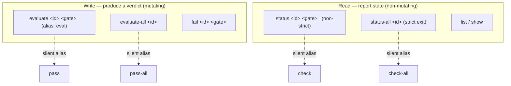

# Gate execution vs status-read command semantics

**Issue:** 949cd9d0
**Type:** enhancement
**Priority:** normal
**Date:** 2026-07-03

## Problem Statement

The gate subcommand verbs invert their apparent semantics, a friction observed
while lead-driving epic 2821e177:

- `jit gate check-all <id>` only READS recorded statuses; it evaluates nothing.
  For a never-run gate it prints "Gate '<key>' has not been run yet ... Use
  'jit gate pass' to run it." yet exits `0`. An orchestrator that runs
  `check-all` expecting gate evaluation (the natural reading, and what the
  jit-execution-lead review protocol implies) gets a silent no-op: all gates
  still pending, exit code green.
- `jit gate pass <id> <gate>` EXECUTES the checker. The verb "pass" reads as
  "force-mark this gate passed" (an override) — the opposite of what it does,
  and alarming to type for an agent bound by gates-are-inviolable rules.

The fix renames the surface so the verb tells the truth about what it does, and
makes the aggregate read command fail loudly when gates are not green.

## Decisions (from planning interview)

- **D-1 — Execution verb is `evaluate` (short alias `eval`).** It names what
  actually happens for both gate modes: for an auto gate it runs the checker and
  produces a verdict; for a manual gate it records the human's verdict. A verdict
  can legitimately be *fail*, so `evaluate` carries no override connotation
  (unlike `pass`/`approve`) and is not auto-only (unlike `run`/`execute`).
  `check` was rejected as a near-synonym of `evaluate` that would re-blur the
  read/write split.
- **D-2 — Read verb is `status` / `status-all`.** Unambiguously non-mutating;
  pairs cleanly with `evaluate` (produce a verdict) vs `status` (report it).
  `gate show` is unaffected — it reports the registry *definition*; `status`
  reports per-issue run state.
- **D-3 — Additive now, breaking removal deferred.** This issue only ADDS the
  new canonical verbs and retains `pass`/`pass-all`/`check`/`check-all` as
  **silent** aliases (no deprecation warning). Nothing is removed here, so no
  CLI caller breaks. A separate follow-up issue removes all four legacy aliases
  as a direct dependency of the 1.0 milestone (9db27a3a), concentrating the one
  breaking churn event before 1.0.
- **D-4 — `status-all` is strict as a single behaviour.** No `--strict` flag, no
  `--no-strict` escape hatch. It exits nonzero whenever any required gate is not
  passed, and zero only when all are passed.
- **D-5 — Strict scope includes manual gates.** A pending manual-attestation gate
  counts as not-green. `status-all` inspects ALL required gates on the issue, not
  only the automated ones (today's `check-all` is auto-only).
- **D-6 — Singular `status` stays non-strict.** It is pure per-gate inspection;
  only the aggregate `status-all` carries the readiness exit contract.

## Success Criteria

- [ ] REQ-01: `gate evaluate` (short alias `eval`) executes an auto gate's
  checker or records a manual gate's attestation identically to today's
  `gate pass`; `gate evaluate-all` mirrors `gate pass-all`. `pass` and `pass-all`
  are retained as silent aliases with no behavioural change and no warning.
- [ ] REQ-02: `gate status-all` exits nonzero when any required gate on the
  issue — automated or manual — is pending or failed, and exits zero only when
  every required gate is passed. Single behaviour, no flag. Covered by CLI tests
  for the pending, failed, and all-passed cases.
- [ ] REQ-03: the read surface `check` / `check-all` is renamed to
  `status` / `status-all`, with `check` / `check-all` retained as silent
  aliases. Singular `status` preserves the existing inspection flags
  (`--all`/`--limit`/`--status`/`--stdout`/`--stderr`/`--tail`/`--gate`) and
  remains non-strict.
- [ ] REQ-04: `jit gate --help` presents, in its command description, an
  explicit grouping of the gate verbs into "produce a verdict (mutate:
  `evaluate`, `evaluate-all`, `fail`)" vs "report state (read-only: `list`,
  `show`, `status`, `status-all`)", and states which verbs mutate. Note: clap 4.5
  cannot insert heading rows into the subcommand `Commands:` list itself (no
  upstream subcommand help-heading support), so the grouped description above the
  flat list is the faithful maximum. Reworded from "groups the subcommand list"
  to this achievable form on 2026-07-04.
- [ ] REQ-05: stale references to the old verbs in **live** in-tree surfaces
  are swept — the never-run hint ("Use 'jit gate pass' to run it"), the `cli.rs`
  gate-taxonomy doc comments, the top-level usage example, and current product
  docs under `docs/` — now name `evaluate` / `status`. **Out of scope:**
  all of `dev/` (active, archive, sessions, and prior plan documents) and
  existing issue descriptions stored in `.jit/` are historical records and are
  left as-authored.

## Design

### Command taxonomy (end-state)

### Aliases

Clap `#[command(visible_alias = "pass")]` on the renamed variant keeps the old
invocation working and lists it in help. The canonical variant is renamed
(`Pass` → `Evaluate`, `PassAll` → `EvaluateAll`, `Check` → `Status`,
`CheckAll` → `StatusAll`); the old name rides along as an alias only. No new
enum variants — the existing handler bodies move with the rename, so behaviour
is byte-identical apart from the strict exit added to `status-all`.

### Strict exit contract for `status-all`

Today `get_last_gate_runs_for_issue` returns `(results, not_run)` over the
issue's *automated* gates only. Strict readiness must instead consider every
required gate's status:

- A required gate is **green** iff its recorded status is `Passed` at the
  relevant point.
- **Pending** (auto gate never run, or manual gate never attested) and
  **Failed** both count as not-green.
- Exit code: `0` when all required gates are green; otherwise `4` (gates not
  satisfied — consistent with the existing "gate failure" exit code in the
  `pass` taxonomy and with `jit validate`'s failure code). Pending and failed
  share the single nonzero code; the `--json` body distinguishes per gate.

The display keeps listing per-gate detail; strict only adds the exit code and
extends coverage from auto-only to all required gates so a pending manual gate
is not silently treated as green.

### Surfaces touched

- `crates/jit/src/cli.rs` — rename the four `GateCommands` variants, add
  `visible_alias`, add `eval` alias on `evaluate`, and rewrite the
  execution/inspection doc comments (lines ~915–938, ~1132–1156, and the
  top-level example ~132).
- `crates/jit/src/main.rs` — rename the four `match` arms; add the strict
  readiness computation + exit for `StatusAll`; update the never-run hint text.
- Aggregate readiness helper — extend or add a companion to
  `get_last_gate_runs_for_issue` that folds manual-gate statuses into the
  green/not-green verdict.
- MCP server (`mcp-server/`) auto-generates tools from the CLI schema, keyed on
  the canonical subcommand name. Tool names change to `gate_evaluate`,
  `gate_evaluate_all`, `gate_status`, `gate_status_all` (the old `gate_pass`
  etc. tools disappear). This is intended: MCP surfaces the corrected names now;
  the deferred issue only removes the CLI-level aliases.

### Out of scope (deferred to the 1.0-cleanup follow-up issue)

Removing the `pass` / `pass-all` / `check` / `check-all` aliases. That is the
one breaking change and is tracked separately as a direct dependency of the 1.0
milestone.

## Implementation Steps

1. Rename the four `GateCommands` variants in `cli.rs`; attach
   `visible_alias` for each legacy name and the `eval` short alias; rewrite the
   gate-taxonomy doc comments and the top-level usage example (REQ-01, REQ-03,
   REQ-04, REQ-05).
2. Rename the four match arms in `main.rs`; move handler bodies unchanged.
3. Add the manual-gate-aware readiness computation and wire the strict exit into
   the `StatusAll` arm; update the never-run hint to name `evaluate` (REQ-02,
   REQ-05).
4. Add CLI tests for `status-all` strict exit: pending (auto and manual),
   failed, all-passed (REQ-02).
5. Add CLI tests asserting the legacy aliases still resolve to the renamed
   commands (REQ-01, REQ-03).
6. Sweep live references only: `cli.rs` help/doc comments, the never-run hint,
   current product docs under `docs/`, and live scripts under `scripts/`. All of
   `dev/` (active, archive, sessions, prior plan documents) and existing `.jit/`
   issue descriptions are historical records and are left untouched; skill files
   under `~/.claude` are out of the repo and out of scope.

## Gates

`code-review` and `cargo-ci` (fmt + clippy + full workspace test suite) — this
is a Rust CLI change with new tests. Both apply to 949cd9d0 and to the follow-up
removal issue c505031a.

## Testing Approach

- `cargo test` — new `gate status-all` strict-exit cases (pending/failed/passed)
  and alias-resolution cases, added to `crates/jit/src/commands/gate_cli_tests.rs`
  or the integration suite.
- Manual: `jit gate status-all <id>` on an issue with a pending manual gate must
  exit nonzero; after `jit gate evaluate <id> <gate>` for every required gate,
  it must exit 0.
- `jit gate pass <id> <gate>` and `jit gate check-all <id>` must still work
  (alias resolution) with identical output.

## Risks and Open Questions

- **MCP tool-name change** is a real break for any MCP consumer pinned to
  `gate_pass` / `gate_check_all`. Accepted: the corrected names are the point,
  and jit's MCP tools are regenerated from schema.
- **Single nonzero exit code (4) for both pending and failed.** Keeps scripting
  simple; if orchestration later needs to distinguish "never ran" from "ran and
  failed" at the exit-code level, a distinct code can be added without breaking
  the zero/nonzero contract.
- **`visible_alias` vs hidden alias.** Using `visible_alias` documents the old
  names in help during the deprecation window; the follow-up removal issue drops
  them entirely.
