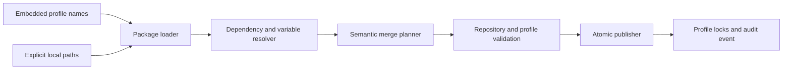

# JIT Profiles Planning Brief

**Issue:** 9b7b5f9c
**Type:** epic
**Priority:** high
**Date:** 2026-07-14

## Problem Statement

JIT has reusable workflow components, but adopters currently assemble them from separate hierarchy templates, gate presets, example configuration, scripts, prompts, and agent skills. This fragmentation makes the strongest dogfooded workflow harder to adopt than the minimal tracker, leaves some built-in gates dependent on a source checkout, and provides no safe provenance or upgrade model.

Profiles should make a coherent setup one explicit operation while preserving three properties: plain initialization remains minimal, repositories remain authoritative over their configuration, and the engine remains domain-agnostic. The first embedded profile, provisionally named `jit-dogfood`, proves the mechanism with a portable and language-agnostic version of this repository's planning, validation, review, projection, and agent workflow.

## Success Criteria

- [hard] REQ-01: Plain `jit init` remains the minimal methodology-neutral setup, while repeatable `--profile <built-in>` and `--profile-path <local-directory>` flags apply one or more selected profiles atomically during initialization.
- [hard] REQ-02: `jit profile apply` applies profiles to existing repositories and is the canonical operation delegated to by `jit init --profile`; it works without Git, does not rewrite existing issues, does not create commits, and only warns when the worktree is dirty.
- [hard] REQ-03: A versioned TOML profile manifest and generated JSON Schema describe declarative payloads, semantic registry contributions, assets, executable declarations, variables, built-in projection operations, dependencies, incompatibilities, and compatible JIT versions without arbitrary installation hooks.
- [hard] REQ-04: Embedded and local-directory profiles use the same package model; embedded profiles work fully offline, unapplied local profiles are addressed explicitly by path, missing dependencies never trigger network access, and local IDs may not shadow embedded IDs.
- [hard] REQ-05: Profile application semantically merges keyed TOML entries, deduplicates identical contributions, reports differing definitions as conflicts, creates missing non-registry files, preserves identical files, and treats differing existing files as conflicts instead of overwriting user content.
- [hard] REQ-06: The complete multi-profile plan is validated before publication and committed under the repository-wide mutation lock as one atomic operation; conflicts or validation errors leave every target unchanged, and reapplying an unchanged profile is a successful no-op.
- [hard] REQ-07: Per-profile JSON lock records under `.jit/profiles/` record origin, semantic version, compatible JIT range, resolved non-sensitive values, content hashes, and per-file or per-key ownership, including shared ownership of identical contributions.
- [hard] REQ-08: Profile application, reconfiguration, and upgrade append repository-level audit events and report created, modified, unchanged, removed, shared, and conflicting files or registry entries without exposing sensitive values.
- [hard] REQ-09: `jit profile list`, `show`, `validate`, `diff`, and `upgrade` cover embedded and applied profiles plus explicitly addressed local packages; upgrades use three-way ownership checks, update untouched content, conflict on concurrent user/profile changes, and remove only unchanged solely-owned content.
- [hard] REQ-10: Profile variables resolve in the order manifest default, values file, manifest-declared environment variable, then repeatable `--set`; reapplication with changed values safely reconfigures the profile, while sensitive variables are redacted and cannot be interpolated into generated files.
- [hard] REQ-11: Profile packages reject unsafe absolute paths, traversal, escaping symlinks, undeclared executable assets, invalid interpolation, dependency cycles, and conflicting multi-profile contributions before any target mutation.
- [hard] REQ-12: Profile commands support machine-readable `--json`; apply supports `--dry-run`; command and result shapes, profile-manifest schema, errors, and exit behavior are exposed through `jit --schema`.
- [hard] REQ-13: The embedded `jit-dogfood` profile installs the recommended `milestone → epic → story → task` taxonomy, task-level `bug` and `enhancement` types, and epic-level functional `planning` and `breakdown` types, treating incompatible existing type levels as merge conflicts.
- [hard] REQ-14: `jit-dogfood` installs a configurable epic-only plan-before-fan-out template, defaulting plan documents to `docs/plans/{container.short_id}-plan.md`; applying the template creates the parent directory and an empty plan document while retaining planning guidance in the planning issue.
- [hard] REQ-15: Every issue is guided to use `[hard]` or `[aspirational] REQ-NN` success criteria through installed content standards and non-blocking validation warnings, while epic breakdown coverage and epic completion coverage remain enforced.
- [hard] REQ-16: The profile defines `plan-review`, `breakdown-review`, `code-review`, `coverage-preview`, `jit-validate`, and `repo-validate` gates without attaching gates to ordinary issues by default; the plan template attaches plan review to planning, coverage and breakdown review to breakdown, and repository validation to the epic.
- [hard] REQ-17: Deterministic coverage and validation gates use generic built-in checker operations rather than shelling out to JIT or requiring `jq`; each AI-review gate retains its own editable command and defaults to a warning-producing passing placeholder.
- [hard] REQ-18: Placeholder AI-review executions record structured warning findings, `jit validate` warns while placeholders remain configured, and all required scripts and prompts are embedded and materialized without requiring a JIT source checkout.
- [hard] REQ-19: The complete repository-neutral JIT skill suite is installed under `.agents/skills/`, alongside one canonical `.jit/reference/content-standards.md` referenced by the skills and concise managed JIT guidance in `AGENTS.md`.
- [hard] REQ-20: The profile scaffolds an empty invariant registry, managed invariant projection in `AGENTS.md`, and a managed rules-and-gates projection at `.jit/reference/rules-and-gates.md`; application renders both projections atomically while preserving all non-managed prose byte-for-byte.
- [hard] REQ-21: Existing planning presets remain temporarily compatible but are marked deprecated, derive their definitions from the embedded profile as their single source of truth, and materialize the embedded assets required to remain functional until removal.
- [hard] REQ-22: The adopter documentation presents profiles as the preferred setup path, includes a `jit-dogfood` quickstart and local-profile authoring reference, and retains manual SDD and planning-bracket configuration as advanced customization guidance.
- [hard] REQ-23: Automated tests cover fresh and existing repositories, multiple-profile composition, semantic merges, conflicts and rollback, idempotence, reconfiguration, local packages, offline embedded operation, lock ownership, audit events, projections, path safety, variable precedence and redaction, compatibility presets, upgrades, Git-free use, JSON envelopes, and schema exposure.

## Design

Profiles are immutable input packages. Applying one produces a deterministic change plan against a repository snapshot; it does not mutate while parsing or resolving. The command layer validates that complete plan, acquires the repository-wide lock, verifies that the snapshot has not changed, and publishes the staged file set atomically.

### Package model

Each package contains one TOML manifest and a path-confined payload. The manifest owns the stable profile ID and semantic version, compatible JIT range, dependencies and incompatibilities, variables, semantic contributions to JIT registries, ordinary assets, executable declarations, and requested built-in projections. Embedded packages are compiled from the same directory representation accepted for local packages; the engine does not maintain a second built-in representation.

Profiles are declarative. Application may invoke only named JIT projection operations and never package-supplied installation hooks. Payload paths are repository-relative and validated against absolute paths, traversal, and escaping symlinks.

### Resolution and composition

Profile dependencies form an acyclic graph. Embedded dependencies resolve automatically; absent local or remote dependencies fail without network access. Variables resolve from manifest defaults, a values file, declared environment variables, and command-line overrides in increasing precedence. Sensitive values are runtime-only, redacted, and rejected anywhere file interpolation would persist them.

Multiple selected profiles resolve into one transaction. Keyed registry contributions deduplicate when structurally identical. Differing definitions of the same key, incompatible type levels, profile-ID collisions, or differing existing ordinary files become explicit conflicts. No conflict is silently won by ordering.

### Semantic ownership and upgrades

One JSON lock record per applied profile stores origin, version, resolved non-sensitive values, hashes, and ownership at file or semantic-key granularity. Identical contributions can have several owners. These records enable idempotent reapplication, variable-driven reconfiguration, drift reporting, and three-way upgrades without treating an entire TOML file as generated.

An upgrade modifies content that still matches the recorded profile version. If both the repository and new profile changed an item, it conflicts. Removed items disappear only when unchanged and solely owned by the upgraded profile. Profile removal is deferred until reversal semantics can account for dependencies and shared ownership safely.

### `jit-dogfood`

The first profile contains a generic type hierarchy, planning bracket, advisory content standards, enforced epic coverage, config-declared review and validation gates, portable agent skills, review assets, and managed invariant plus rule/gate projections. It contains no JIT-monorepo CI, language assumptions, charter, glossary, or documentation lifecycle.

Ordinary issues receive no gates automatically. The `plan` template attaches the bracket-specific gates and whole-repository validation. Deterministic checks use built-in gate operations. Each AI gate has its own configurable external command and initially uses a passing placeholder that emits both a visible warning and a structured warning finding.

The profile owns planning-gate definitions as the registry source of truth. Deprecated built-in planning presets derive from the embedded package and materialize the required assets during their compatibility window.

### User-facing surface

`jit init --profile` delegates profile work to `jit profile apply`. Built-in names and explicit local paths are separate arguments so local packages cannot shadow embedded packages accidentally. List, show, validate, diff, apply, reconfigure-by-reapplication, and upgrade provide human and JSON output; apply additionally supports dry-run. The command schema exposes all request, result, error, and manifest shapes.

## Implementation Steps

1. Define the manifest, lock, ownership, change-plan, conflict, variable, and result domain types plus their schemas.
2. Implement safe embedded and local package loading, validation, dependency resolution, interpolation, and deterministic composition as pure operations.
3. Implement keyed TOML adapters for the configuration registries a profile may contribute to, with structural equality and stable hashing.
4. Implement repository snapshotting, semantic change planning, full final-state validation, repository-wide locking, atomic publication, lock persistence, and audit events.
5. Add the profile CLI and command-executor surfaces, including JSON envelopes, dry-run, schema exposure, and Git-free behavior.
6. Add generic built-in validation gate operations and structured placeholder-review warnings.
7. Author and embed `jit-dogfood`, then derive deprecated planning-preset compatibility data from it.
8. Add managed projection integration, portable skills, canonical content standards, scripts, prompts, and lazy empty plan-document creation.
9. Rewrite setup documentation around profiles while preserving advanced manual configuration guidance.
10. Exercise the full matrix with unit, harness, CLI integration, rollback, concurrency, schema, and offline tests.

## Testing Approach

Pure unit tests cover manifest parsing, compatibility ranges, dependency cycles, variable precedence, redaction, path confinement, interpolation, keyed merge, shared ownership, drift classification, and upgrade decisions. Property-based tests should exercise deterministic composition and the invariant that an invalid plan yields no target changes.

Harness tests cover command-layer planning and atomic publication against isolated repositories. CLI integration tests cover fresh initialization, existing repositories, repeated flags, local packages, dirty and Git-free repositories, JSON output, dry-run, deprecated preset compatibility, and end-to-end `jit-dogfood` use through plan application and gate evaluation.

Failure-injection and concurrency tests verify snapshot rechecks, repository locking, atomic rollback, event/lock consistency, interrupted publication recovery, and conflicts between simultaneous profile operations. Documentation and schema tests keep the embedded profile, compatibility projections, generated references, examples, and command schema synchronized.

## Risks and Open Questions

- Semantic TOML ownership must not accidentally claim user-authored neighboring data; adapters need explicit key identities and stable canonical hashing.
- Multi-file atomic publication must preserve the existing atomic-write and event-log invariants even under interruption.
- Placeholder reviewers are intentionally permissive for initial adoption, so their warning must remain impossible to mistake for completed review evidence.
- The embedded profile can become a second hardcoded methodology if its data leaks into engine logic; generic tests should apply differently named local profiles with different vocabulary.
- Backward-compatible planning presets need a clear deprecation signal and derived tests so the temporary surface cannot become an independent source of truth again.
- The provisional `jit-dogfood` name should remain manifest-owned and mechanically renameable.
