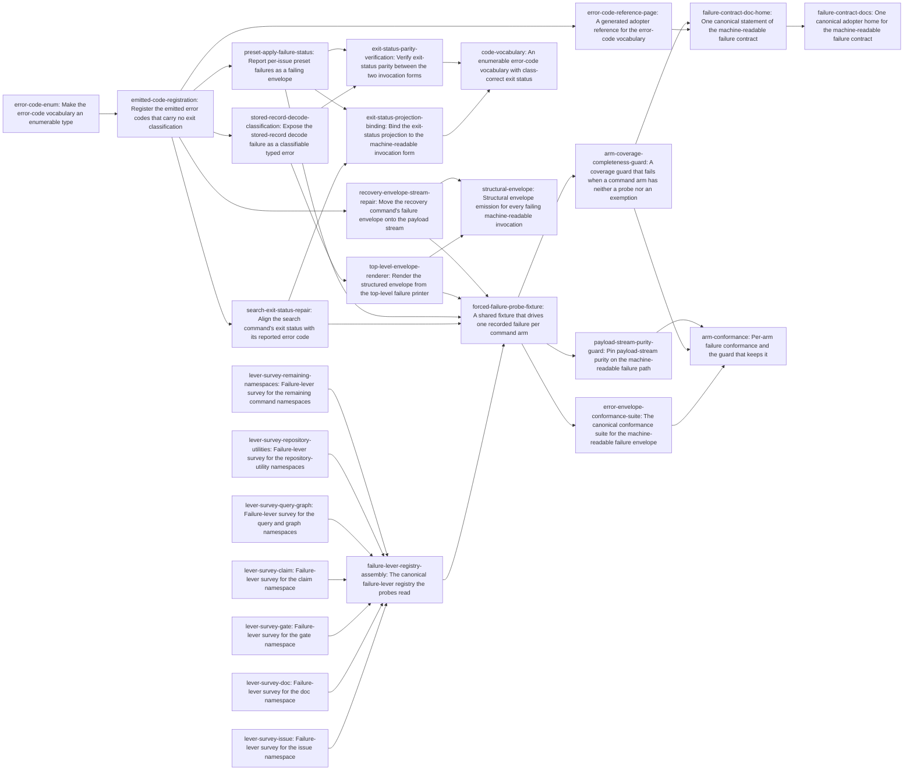

# Plan: Structured failure reporting across the machine-readable CLI surface (a2546471)

> Planning node: 0e5aed49. Authoritative graph:
> [breakdown.json](breakdown.json).

The epic has one architectural move and three consequences. The move is to stop
treating envelope emission as per-arm work: the top-level failure printer becomes
the envelope renderer, so presence is structural rather than conventional (D-1).
What remains is then small and bounded — a vocabulary that can carry an exit class,
three individually broken emission sites, a conformance layer that observes the
property at runtime because no static reading of the source can decide it, and one
adopter home for the resulting contract.

Sizing follows from that. There is no "51 arms to convert" workstream, because the
central renderer covers every propagating arm at once. The residual per-arm work is
exactly three arms whose own emission is wrong, plus classification coverage inside
one classifier. The conformance layer is the one place sizing is not yet decidable:
whether an arm can be driven into a failure raised inside its own body is unmeasured,
so that universe is surveyed namespace by namespace, merged into one machine-readable
registry, and reconciled against the reflected arm set before any check is written
against it.

## Outcome and criterion approach

| Criterion | Approach | Evidence / open gap |
|---|---|---|
| REQ-01 | The census is derived at check time from the argument parser's own command reflection, not committed as a table. A committed enumeration would be the volatile hand-maintained copy `@/invariant/single-source-prose` treats as a defect, and would go stale on the next arm. | F-SCHEMA-DERIVED, F-ARM-COUNT |
| REQ-02 | Structural, not per-arm: the top-level printer renders the envelope for any failure that reaches it, with the code from an `anyhow::Error` classifier built as a structural parallel to the existing exit-status cascade. Classification quality is then a coverage question inside one function rather than a conversion across arms. | D-1, F-MECHANISMS, F-NO-STATIC |
| REQ-03 | Read as payload-stream purity (D-4). The split already holds for 98 of 99 arms by construction; the work is repairing the one exception and pinning the property so a future unguarded print fails. | D-4, F-STDOUT-CLEAN |
| REQ-04 | Registration, then exposure, then verification. Every emitted code becomes a member with an explicit exit class, which moves the nine measured divergences; one failure class needs a publicly nameable typed form before it can carry a code at all; the individually broken exits (a literal status, a zero status on failure) are repaired in their own arms; parity is then asserted by driving one failure through both invocation forms, and the exit-status projection is bound through both. | D-6, F-EXIT-DIVERGENCE, F-SEARCH-EXIT10, F-PRESET-APPLY-ZERO, F-EXIT-DOC-DEFECT, F-FORCED-FAILURE |
| REQ-05 | Creates the canonical error-envelope suite; none exists. It rests on a shared forced-failure fixture, which rests in turn on a machine-readable registry of the failure each arm can be driven into inside its own body — unmeasured today, so it is measured namespace by namespace and merged into one typed input before a coverage requirement is written against it. The suite is a module inside an existing integration target because one target slot remains, and two existing tests that pass against the defect are tightened rather than left as apparent coverage. | F-FORCED-FAILURE, F-NO-ERROR-SUITE, F-NONBINDING-TESTS, F-BUDGET, F-TEST-TOPOLOGY |
| REQ-06 | The generalised printer supplies presence; a runtime completeness assertion over the reflected arm set supplies coverage, reusing the set-equality shape the exit-status projection already uses. Scope is every arm whose definition declares the flag, hidden included (D-2); an arm the registry marks exempt is covered by that declared exemption, which the check reports with its reason. | D-1, D-2, F-COMPLETENESS-PRECEDENT, F-NO-STATIC, F-FORCED-FAILURE |
| REQ-07 | One generated reference projected from the vocabulary, plus one prose statement of the contract in the section that already owns the envelope's shape. The vocabulary must become enumerable and carry a description per member first, or the "generated" table is a relocated hand-maintained list and its meaning column is prose the projection invented. | D-3, F-ERRORCODE-STRUCT, F-PROJECTION-PATTERN, F-DOC-HOME |

## Shared architectural contracts

### `error-code-vocabulary` [implementation-produced] — Enumerable, exit-classified, self-describing error codes

The reported error code is a closed enum: one member per code string the surface
emits, rendering that string byte-identically, with a public member list checked
against the variants the type's own derive produces, an exhaustive member-to-exit-status
match carrying no wildcard, and an exhaustive member-to-description match beside it, so a
member cannot exist without the prose an adopter reference projects. The freshness guard
binds to the type's derive rather than to a hand-written mirror, which is what makes a later
projection non-circular (F-PROJECTION-PATTERN). Today the type is a unit struct of associated
constants that nothing can iterate, its map fails open (F-ERRORCODE-STRUCT), and no source
states what a code means, so a reference page would have to author that prose rather than
project it.

### `envelope-emission-convention` [plan-fixed] — Where the envelope goes and what it costs

One pretty-serialized JSON document on stdout; the human `Error:` line stays on
stderr, which is deliberate and already test-pinned (D-4); the process exit status
is the mapping of the code the envelope reports, never a literal. Every emission
site obeys all three. This is the settled reading of REQ-03 and the rule the shared
emission macro already follows — three sites currently violate one clause each.

### `post-dispatch-failure-scope` [plan-fixed] — What "a failure" means here

The contract covers failures reachable after command dispatch. Malformed invocations
are rejected inside argument parsing, before dispatch, and the parser prints its own
diagnostic and exits on a status that already equals the invalid-argument class
(D-5, F-CLAP-PARSE). Taking those over would mean owning help and version exits too.
Any guard or probe forces post-dispatch failures only, so it never asserts something
unachievable.

### `top-level-error-envelope` [implementation-produced] — Envelope presence is structural

The top-level failure printer renders the envelope for any failure reaching it under
the flag, with the code drawn from an `anyhow::Error` classifier structurally parallel
to the exit-status classifier beside it. Consequence: "reaching the plain-text printer"
stops being a failure mode, so an arm cannot regress by omission and a new arm inherits
the behaviour. Arms that already emit their own envelope keep their code and enriched
detail and still emit exactly one.

### `failure-lever-registry` [plan-fixed] — The machine-readable probe input

The probes read a committed TOML registry, not prose — a Rust fixture parsing a markdown
report is not a contract. Each entry is keyed by the command path as the argument parser
spells it and carries the argument vector of its invocation, the setup that invocation needs,
and the failure it is expected to produce; an arm where no in-body failure is constructible
carries an exemption reason in place of an invocation. Namespace fragments are written in that
shape and merged without reshaping. The merged registry lands in the test tree rather than the
planning directory, because an input read out of a directory that archives with the epic would
break the probes reading it. A markdown reading of the survey, if one is wanted later, is a
projection of the registry rather than its source.

### `recorded-failure-lever-universe` [implementation-produced] — The measured probe universe

One merged registry covering each arm accepting the flag, reconciled against the arm set the
command reflection derives, so an arm the reflection declares and the registry omits fails
rather than passing as a silent gap. It exists because reachability is unmeasured and not
derivable: the command reflection exposes argument syntax, not semantic failure levers
(`crates/jit/src/schema.rs:322`), and the census reports 31 arms for which no failing argument
or flag value could be constructed at all (F-FORCED-FAILURE). A discovery-time failure is no
substitute — the existing startup path renders an envelope for it before any arm body runs, so
an arm resolved that way passes against an unmodified binary. Measurement is split by namespace
so each survey stays bounded, and the assembly is what turns the fragments into the one input
the probes read. The registry is evidence rather than authority: it holds what no derivation
can supply — the lever — while the arm set stays derived at check time, so the completeness
assertion keeps the reflection as its authority (REQ-01).

### `forced-failure-arm-fixture` [implementation-produced] — One way to provoke a failure

A shared subprocess fixture that deserializes `recorded-failure-lever-universe` in the shape
`failure-lever-registry` fixes, drives a named arm through the invocation recorded for it under
the setup recorded beside it, and returns both streams with the exit status. It decides no
reachability of its own, and an arm the registry marks as exempt is carried as a declared
exemption stating that reason rather than becoming silently absent. No shared subprocess runner
exists in the tree today — 60 files roll their own, in two idioms (F-NO-SHARED-RUNNER).

### `generated-error-code-table` [implementation-produced] — The projected code reference

A committed adopter page rendered from the vocabulary by a function beside the
definitions, carrying a generated banner, with byte-equality freshness and an explicit
regeneration path — the shape five existing reference pages already use. Its exit-status
column reads the runtime mapping and its meaning column the vocabulary's own per-member
description, so the page projects both rather than authoring either. The prose home cites
this page instead of carrying a table.

## Shared-file landing strategy

Four files are named here, one per separation mechanism. The output layer is fully ordered
by dependency edges. The crate's entry-point file carries concurrent writers in disjoint
regions. The issue CLI aggregator carries one-line insertions integrated by union, rather
than through an edge the graph does not otherwise imply. The gate CLI aggregator is listed
with its single writer so the sweep over shared aggregators is complete. The overview's
Landing column names each entry's landing group; the table below is the file-level reading
of the same sequence.

| Shared file | Writers | How they are separated | Landing |
|---|---|---|---|
| `crates/jit/src/output.rs` | error-code-enum → emitted-code-registration → error-code-reference-page | Dependency ordering: each is a strict successor of the one before. | Sequential; no concurrency to resolve. |
| `crates/jit/src/main.rs` | error-code-enum; search-exit-status-repair; preset-apply-failure-status; recovery-envelope-stream-repair; top-level-envelope-renderer; arm-coverage-completeness-guard | The enum conversion is a mechanical pass over the file's references to the code type and lands alone, ahead of the rest, which all depend on it transitively. The three arm repairs each occupy one dispatch arm — `search`, `gate preset apply`, `recover` — thousands of lines apart in an 8000-line file, sharing no line. The renderer occupies the entry point's failure printer plus the new classifier beside the exit-status cascade, a region no dispatch arm enters. The guard extends that classifier and already lands behind the renderer through the fixture. | Four concurrent writers — three dispatch arms plus the entry-point pair — disjoint by region, so their patches compose in any order and a rebase meets no shared hunk. |
| `crates/jit/tests/cli_issue/main.rs` | search-exit-status-repair; stored-record-decode-classification; top-level-envelope-renderer; failure-lever-registry-assembly; forced-failure-probe-fixture; error-envelope-conformance-suite; arm-coverage-completeness-guard; payload-stream-purity-guard | The file is a module aggregator. Each writer appends one `mod` declaration for the suite it creates and changes nothing else in the file. | Three concurrent groups: two writers behind the vocabulary, the registry assembly behind the namespace surveys on its own path, then the three conformance checks behind the fixture. Each insertion is a single line, so a collision is textual and integrates by keeping both lines rather than by choosing between them. |
| `crates/jit/tests/cli_gate/main.rs` | preset-apply-failure-status | One writer. | Nothing to integrate. |

The remaining files are single-writer by construction: the exit-status parity assertions own
the existing exit-status suite, the conformance suite owns the two non-binding tests it
replaces, each new suite file is created by the entry that declares it, and the seven namespace
surveys each write one fragment of their own, which only the registry assembly reads.

## Generated decomposition overview

<!-- jit:breakdown-overview:begin -->
| Key | Title | Type | Outcome | Contracts | Sources | Footprint | Landing | Depends on |
|---|---|---|---|---|---|---|---|---|
| error-code-enum | Make the error-code vocabulary an enumerable type | task | The vocabulary becomes an enum with a derive-checked member list, an exhaustive exit-status match, and a description per member. | — | REQ-07, D-3, F-ERRORCODE-STRUCT, F-PROJECTION-PATTERN | touches 4 | code-vocabulary | — |
| emitted-code-registration | Register the emitted error codes that carry no exit classification | task | Every error code string the surface emits becomes a registered member carrying an explicitly stated exit status. | error-code-vocabulary | REQ-04, D-6, F-EXIT-DIVERGENCE | touches 1 | code-vocabulary | error-code-enum |
| stored-record-decode-classification | Expose the stored-record decode failure as a classifiable typed error | task | A stored-record decode failure carries a registered code because its typed form is nameable where failures are classified. | error-code-vocabulary | REQ-04, D-6, F-FORCED-FAILURE | creates 1, touches 4 | code-vocabulary | emitted-code-registration |
| search-exit-status-repair | Align the search command's exit status with its reported error code | task | The search failure path exits on the status its reported code maps to rather than a literal. | error-code-vocabulary, envelope-emission-convention | REQ-04, D-6, F-SEARCH-EXIT10 | creates 1, touches 2 | arm-repairs | emitted-code-registration |
| preset-apply-failure-status | Report per-issue preset failures as a failing envelope | task | A preset application with a failing target reports the error envelope with a non-zero exit status. | error-code-vocabulary, envelope-emission-convention | REQ-02, REQ-04, F-PRESET-APPLY-ZERO | creates 1, touches 2 | arm-repairs | emitted-code-registration |
| exit-status-parity-verification | Verify exit-status parity between the two invocation forms | task | One failure driven through both invocation forms reports one exit status, asserted for each measured divergence. | error-code-vocabulary, envelope-emission-convention | REQ-04, D-6, F-EXIT-DIVERGENCE, F-PRESET-APPLY-ZERO | touches 1 | code-vocabulary | stored-record-decode-classification, preset-apply-failure-status |
| exit-status-projection-binding | Bind the exit-status projection to the machine-readable invocation form | task | The projection's per-row bindings exercise the flag invocation beside the plain one. | error-code-vocabulary | REQ-04, F-EXIT-DOC-DEFECT | touches 1 | code-vocabulary | search-exit-status-repair, preset-apply-failure-status |
| top-level-envelope-renderer | Render the structured envelope from the top-level failure printer | task | A failure reaching the top-level printer prints an error envelope under a code from a central classifier. | error-code-vocabulary, envelope-emission-convention, post-dispatch-failure-scope | REQ-02, D-1, D-5, F-MECHANISMS, F-ARM-COUNT, F-NO-STATIC, F-MCP, F-CLAP-PARSE | creates 1, touches 2 | envelope-structure | stored-record-decode-classification |
| recovery-envelope-stream-repair | Move the recovery command's failure envelope onto the payload stream | task | The recovery failure envelope prints on stdout in the shared serialization under a registered code. | error-code-vocabulary, envelope-emission-convention | REQ-03, D-4, F-STDOUT-CLEAN | touches 2 | envelope-structure | emitted-code-registration |
| lever-survey-issue | Failure-lever survey for the issue namespace | task | A registry fragment records the failure lever for each arm of the issue namespace. | failure-lever-registry, post-dispatch-failure-scope | REQ-05, F-FORCED-FAILURE, F-SCHEMA-DERIVED, F-CLAP-PARSE | creates 1 | lever-survey | — |
| lever-survey-doc | Failure-lever survey for the doc namespace | task | A registry fragment records the failure lever for each arm of the doc namespace. | failure-lever-registry, post-dispatch-failure-scope | REQ-05, F-FORCED-FAILURE, F-SCHEMA-DERIVED, F-CLAP-PARSE | creates 1 | lever-survey | — |
| lever-survey-gate | Failure-lever survey for the gate namespace | task | A registry fragment records the failure lever for each arm of the gate namespace. | failure-lever-registry, post-dispatch-failure-scope | REQ-05, F-FORCED-FAILURE, F-SCHEMA-DERIVED, F-CLAP-PARSE | creates 1 | lever-survey | — |
| lever-survey-claim | Failure-lever survey for the claim namespace | task | A registry fragment records the failure lever for each arm of the claim namespace. | failure-lever-registry, post-dispatch-failure-scope | REQ-05, F-FORCED-FAILURE, F-SCHEMA-DERIVED, F-CLAP-PARSE | creates 1 | lever-survey | — |
| lever-survey-query-graph | Failure-lever survey for the query and graph namespaces | task | A registry fragment records the failure lever for each arm of the query namespace beside the graph namespace. | failure-lever-registry, post-dispatch-failure-scope | REQ-05, F-FORCED-FAILURE, F-SCHEMA-DERIVED, F-CLAP-PARSE | creates 1 | lever-survey | — |
| lever-survey-repository-utilities | Failure-lever survey for the repository-utility namespaces | task | A registry fragment records the failure lever for each arm of the repository-utility namespaces. | failure-lever-registry, post-dispatch-failure-scope | REQ-05, F-FORCED-FAILURE, F-SCHEMA-DERIVED, F-CLAP-PARSE | creates 1 | lever-survey | — |
| lever-survey-remaining-namespaces | Failure-lever survey for the remaining command namespaces | task | A registry fragment records the failure lever for each arm of the small namespaces beside the standalone commands. | failure-lever-registry, post-dispatch-failure-scope | REQ-05, F-FORCED-FAILURE, F-SCHEMA-DERIVED, F-CLAP-PARSE | creates 1 | lever-survey | — |
| failure-lever-registry-assembly | The canonical failure-lever registry the probes read | task | The namespace fragments merge into one typed registry whose arm set is reconciled against the command definitions. | failure-lever-registry, post-dispatch-failure-scope | REQ-05, F-FORCED-FAILURE, F-SCHEMA-DERIVED, F-COMPLETENESS-PRECEDENT | creates 2, touches 1 | failure-conformance | lever-survey-issue, lever-survey-doc, lever-survey-gate, lever-survey-claim, lever-survey-query-graph, lever-survey-repository-utilities, lever-survey-remaining-namespaces |
| forced-failure-probe-fixture | A shared fixture that drives one recorded failure per command arm | task | One fixture drives a named arm through the invocation the committed registry records for that arm. | failure-lever-registry, recorded-failure-lever-universe, post-dispatch-failure-scope, top-level-error-envelope | REQ-05, D-5, F-FORCED-FAILURE, F-NO-SHARED-RUNNER, F-TEST-TOPOLOGY, F-BUDGET, F-CLAP-PARSE | creates 1, touches 1 | failure-conformance | failure-lever-registry-assembly, search-exit-status-repair, preset-apply-failure-status, top-level-envelope-renderer, recovery-envelope-stream-repair |
| error-envelope-conformance-suite | The canonical conformance suite for the machine-readable failure envelope | task | One suite asserts envelope structure semantically for each probed arm, replacing two vacuous tests. | forced-failure-arm-fixture, envelope-emission-convention | REQ-05, F-NO-ERROR-SUITE, F-NONBINDING-TESTS | creates 1, touches 2 | failure-conformance | forced-failure-probe-fixture |
| arm-coverage-completeness-guard | A coverage guard that fails when a command arm has neither a probe nor an exemption | task | The arm set derived from the command definitions equals the covered set, with each probe reporting a classified code. | forced-failure-arm-fixture, error-code-vocabulary, post-dispatch-failure-scope | REQ-01, REQ-06, D-1, D-2, F-SCHEMA-DERIVED, F-COMPLETENESS-PRECEDENT, F-NO-STATIC, F-ARM-COUNT | creates 1, touches 2 | failure-conformance | forced-failure-probe-fixture |
| payload-stream-purity-guard | Pin payload-stream purity on the machine-readable failure path | task | A failing flag invocation writes one JSON document on stdout with no plain-text byte beside it. | forced-failure-arm-fixture, envelope-emission-convention | REQ-03, D-4, F-STDOUT-CLEAN | creates 1, touches 1 | failure-conformance | forced-failure-probe-fixture |
| error-code-reference-page | A generated adopter reference for the error-code vocabulary | task | The error-code vocabulary projects into a committed reference page whose freshness is asserted byte for byte. | error-code-vocabulary | REQ-07, D-3, F-PROJECTION-PATTERN, F-DOCS-MECHANICAL, F-ALL-CODES-DOC | creates 1, touches 2 | failure-docs | emitted-code-registration |
| failure-contract-doc-home | One canonical statement of the machine-readable failure contract | task | The command reference states the failure envelope, its error code, and the exit status it determines, citing the generated tables. | generated-error-code-table, envelope-emission-convention | REQ-07, F-DOC-HOME, F-DOCS-MECHANICAL | touches 1 | failure-docs | error-code-reference-page, arm-coverage-completeness-guard |
| code-vocabulary | An enumerable error-code vocabulary with class-correct exit status | story | Every emitted error code is a registered member whose exit status matches the class the plain path reports. | error-code-vocabulary, envelope-emission-convention | REQ-04, D-3, D-6, F-EXIT-DIVERGENCE, F-ERRORCODE-STRUCT, F-EXIT-DOC-DEFECT, F-SEARCH-EXIT10, F-PRESET-APPLY-ZERO, F-FORCED-FAILURE | — | — | exit-status-projection-binding, exit-status-parity-verification |
| structural-envelope | Structural envelope emission for every failing machine-readable invocation | story | Envelope presence becomes structural at the top-level printer, and the last off-convention emission site conforms. | top-level-error-envelope, envelope-emission-convention | REQ-02, REQ-03, D-1, D-4, D-5, F-MECHANISMS, F-ARM-COUNT, F-MCP, F-STDOUT-CLEAN | — | — | top-level-envelope-renderer, recovery-envelope-stream-repair |
| arm-conformance | Per-arm failure conformance and the guard that keeps it | story | Each flag-accepting arm is probed into a real failure or exempt for a recorded reason, and an uncovered new arm fails the build. | recorded-failure-lever-universe, forced-failure-arm-fixture, post-dispatch-failure-scope | REQ-01, REQ-03, REQ-05, REQ-06, D-2, D-5, F-SCHEMA-DERIVED, F-NO-STATIC, F-FORCED-FAILURE, F-NONBINDING-TESTS, F-NO-ERROR-SUITE, F-COMPLETENESS-PRECEDENT, F-TEST-TOPOLOGY, F-BUDGET, F-NO-SHARED-RUNNER | — | — | error-envelope-conformance-suite, arm-coverage-completeness-guard, payload-stream-purity-guard |
| failure-contract-docs | One canonical adopter home for the machine-readable failure contract | story | The failure contract has one adopter home, and the code vocabulary reaches adopters as a generated page. | generated-error-code-table, envelope-emission-convention | REQ-07, D-3, F-DOC-HOME, F-PROJECTION-PATTERN, F-ALL-CODES-DOC, F-DOCS-MECHANICAL | — | — | failure-contract-doc-home |

<!-- jit:breakdown-overview:end -->

## Material risks and owner decisions

| Risk / decision | Resolution and rationale |
|---|---|
| **D-1 — REQ-06 guard mechanism** | Chosen: generalise the top-level printer into a full envelope renderer driven by a new `anyhow::Error → ErrorCode` classifier, paired with a runtime per-arm classification test. Presence becomes structural; the test supplies classification quality. Rejected: the runtime test alone (leaves presence unguaranteed and ~51 arm conversions on the table); a type-system rewrite (480 `?` sites across a ~6000-line `run()`, poorly parallelisable); a static source scan (defeated by the wrapper/inner split, needs `syn` which is not a dependency, or a whitelist that is itself the hand-maintained mirror the invariant rejects). |
| **D-2 — guard scope** | Chosen: every arm whose clap definition declares the flag — 64 visible plus 35 hidden — with no visibility predicate. Rejected: visible arms only (promoting a hidden arm later becomes a silent coverage gap); adding the 13 verb-hint stubs (needs a second derivation rule, and their contract is already correct). |
| **D-3 — REQ-07 mechanism** | Chosen: convert the code type to an enum with a derive-checked member list and an exhaustive exit match, then project. Rejected: a hand-written prose table (a `@/invariant/single-source-prose` defect); deferring the conversion (leaves REQ-07 only partly satisfied, since any "generated" table over a unit struct is a relocated hand-maintained list). |
| **D-4 — REQ-03 reading** | Chosen: stdout purity only. The stderr `Error:` line stays. REQ-03 becomes a verification obligation plus repair of the single arm that writes its envelope to stderr, compactly, under a lowercase code. Rejected: suppressing stderr under the flag; amending REQ-03's text. |
| **D-5 — argument-parse failures** | Chosen: out of scope, recorded as a plan boundary rather than a criterion amendment. Rejected: taking over parser error handling via `try_parse` (jit would own help, version, and error exits); amending REQ-02's text. |
| **D-6 — orphan codes** | Chosen: register roughly 21 emitted-but-unregistered code strings as real members with explicit exit mappings by their actual class. Existing code strings stay byte-identical, so no consumer sees a rename; only the nine wrong exit codes move, which is what REQ-04 demands. Rejected: collapsing onto the existing 20-code vocabulary (breaks the reported code on ~48 arms and loses classification detail); a two-field `code` + `kind` envelope (changes the documented envelope shape). |
| Probe reachability is unmeasured | The command reflection exposes argument syntax, not failure levers, and 31 arms had no constructible failing argument in the census, so no coverage requirement can be honestly fixed against an assumed universe. Measurement is the work of seven bounded namespace surveys — driving 99 arms and recording each reproducibly is more than one leaf can carry — merged by an assembly terminal into the one registry the fixture and all three conformance checks sit behind. A smaller reachable universe then reshapes the registry's exemption entries rather than invalidating a landed check. |
| Classification gaps surface late | The per-arm guard is the first thing that observes classification quality end to end, so it may expose typed errors the central classifier does not distinguish. Where the typed error already crosses the library boundary the fix is local to the classifier. Where it does not — a crate-private failure the binary cannot name — the fix is a visibility change in the layer that raises it, which is why one terminal owns the single such case this design creates, the unreadable stored record, rather than leaving a guard to discover it mid-cycle. |
| Exit-status changes are consumer-visible | Nine arms change their exit status under the flag. This is the criterion, not a regression: each moves onto the class its own plain invocation already reports, so scripts that branch on the plain path see convergence. Code strings do not move. |
| A latent hazard this epic does not activate | The hand-listed exit-status enumeration in the output layer would not break if a tenth status were added (F-ALL-CODES-DOC). No work here adds an exit status, so the hazard stays dormant; the new generated page reads the runtime mapping and introduces no second instance of it. |
| Adopter prose must not cite the planning artifact | The planning directory is absent from a fresh worktree, so an adopter page citing a path inside it fails the mechanical citation check there while passing on the main line (F-DOCS-MECHANICAL). Adopter pages cite the shipped surface only. |
| Test topology is budget-bound | One integration-target slot remains of twelve, at 59.3% of the executable-byte budget. Every new suite here is a module inside an existing integration target — the issue CLI target for the machine-contract suites it already aggregates, the gate CLI target for the one preset repair (F-BUDGET, F-TEST-TOPOLOGY). |
| MCP bridge needs no change | The bridge already decodes a parsed envelope and only falls back to an opaque execution error when stdout carries none (F-MCP). Structural emission fixes the agent-visible symptom without touching the bridge, so no entry carries the MCP gate. |

## Investigation sources

- [Arm census, emission mechanisms, exit divergence, MCP bridge](investigation.md) — the
  per-arm inventory across all 99 arms, the nine mechanisms, and the measured divergences
  remain there.
- [Test topology, guard mechanisms, documentation home](investigation-guard-docs.md) — the
  option analysis for REQ-06, the build-footprint measurements, and the projection
  precedents remain there.

Each `F-*` id cited above and in the manifest resolves to a heading in one of the two
reports; both open with a finding index listing the ids they own.
