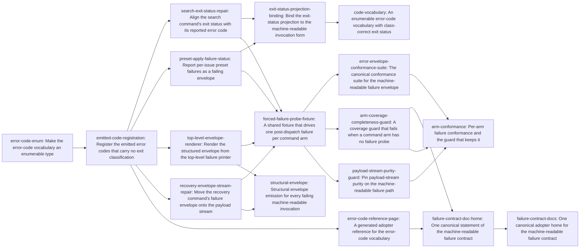

# Plan: Structured failure reporting across the machine-readable CLI surface (a2546471)

> Planning node: 0e5aed49. Authoritative graph:
> [breakdown.json](breakdown.json).

The epic has one architectural move and three consequences. The move is to stop
treating envelope emission as per-arm work: the top-level failure printer becomes
the envelope renderer, so presence is structural rather than conventional (D-1).
What remains is then small and bounded — a vocabulary that can carry an exit class,
three individually broken emission sites, a conformance layer that observes the
property at runtime because no static reading of the source can decide it, and one
adopter home for the resulting contract.

Sizing follows from that. There is no "51 arms to convert" workstream, because the
central renderer covers every propagating arm at once. The residual per-arm work is
exactly three arms whose own emission is wrong, plus classification coverage inside
one classifier.

## Outcome and criterion approach

| Criterion | Approach | Evidence / open gap |
|---|---|---|
| REQ-01 | The census is derived at check time from the argument parser's own command reflection, not committed as a table. A committed enumeration would be the volatile hand-maintained copy `@/invariant/single-source-prose` treats as a defect, and would go stale on the next arm. | F-SCHEMA-DERIVED, F-ARM-COUNT |
| REQ-02 | Structural, not per-arm: the top-level printer renders the envelope for any failure that reaches it, with the code from an `anyhow::Error` classifier built as a structural parallel to the existing exit-status cascade. Classification quality is then a coverage question inside one function rather than a conversion across arms. | D-1, F-MECHANISMS, F-NO-STATIC |
| REQ-03 | Read as payload-stream purity (D-4). The split already holds for 98 of 99 arms by construction; the work is repairing the one exception and pinning the property so a future unguarded print fails. | D-4, F-STDOUT-CLEAN |
| REQ-04 | Two halves. The vocabulary becomes an enum in which every emitted code is a member with an explicit exit class, which moves the nine measured divergences; then the individually broken exits (a literal status, a zero status on failure) are repaired, and the exit-status projection is bound through both invocation forms. | D-6, F-EXIT-DIVERGENCE, F-SEARCH-EXIT10, F-PRESET-APPLY-ZERO, F-EXIT-DOC-DEFECT |
| REQ-05 | Creates the canonical error-envelope suite; none exists. Built on a shared forced-failure fixture, as a module inside an existing integration target because one target slot remains. Two existing tests that pass against the defect are tightened rather than left as apparent coverage. | F-NO-ERROR-SUITE, F-NONBINDING-TESTS, F-BUDGET, F-TEST-TOPOLOGY |
| REQ-06 | The generalised printer supplies presence; a runtime completeness assertion over the reflected arm set supplies coverage, reusing the set-equality shape the exit-status projection already uses. Scope is every arm whose definition declares the flag, hidden included (D-2). | D-1, D-2, F-COMPLETENESS-PRECEDENT, F-NO-STATIC |
| REQ-07 | One generated reference projected from the vocabulary, plus one prose statement of the contract in the section that already owns the envelope's shape. The vocabulary must become enumerable first, or the "generated" table is a relocated hand-maintained list. | D-3, F-ERRORCODE-STRUCT, F-PROJECTION-PATTERN, F-DOC-HOME |

## Shared architectural contracts

### `error-code-vocabulary` [implementation-produced] — Enumerable, exit-classified error codes

The reported error code is a closed enum: one member per code string the surface
emits, rendering that string byte-identically, with a public member list checked
against the variants the type's own derive produces, and an exhaustive member-to-exit-status
match carrying no wildcard. The freshness guard binds to the type's derive rather
than to a hand-written mirror, which is what makes a later projection non-circular
(F-PROJECTION-PATTERN). Today the type is a unit struct of associated constants that
nothing can iterate, and its map fails open (F-ERRORCODE-STRUCT).

### `envelope-emission-convention` [plan-fixed] — Where the envelope goes and what it costs

One pretty-serialized JSON document on stdout; the human `Error:` line stays on
stderr, which is deliberate and already test-pinned (D-4); the process exit status
is the mapping of the code the envelope reports, never a literal. Every emission
site obeys all three. This is the settled reading of REQ-03 and the rule the shared
emission macro already follows — three sites currently violate one clause each.

### `post-dispatch-failure-scope` [plan-fixed] — What "a failure" means here

The contract covers failures reachable after command dispatch. Malformed invocations
are rejected inside argument parsing, before dispatch, and the parser prints its own
diagnostic and exits on a status that already equals the invalid-argument class
(D-5, F-CLAP-PARSE). Taking those over would mean owning help and version exits too.
Any guard or probe forces post-dispatch failures only, so it never asserts something
unachievable.

### `top-level-error-envelope` [implementation-produced] — Envelope presence is structural

The top-level failure printer renders the envelope for any failure reaching it under
the flag, with the code drawn from an `anyhow::Error` classifier structurally parallel
to the exit-status classifier beside it. Consequence: "reaching the plain-text printer"
stops being a failure mode, so an arm cannot regress by omission and a new arm inherits
the behaviour. Arms that already emit their own envelope keep their code and enriched
detail and still emit exactly one.

### `forced-failure-arm-fixture` [implementation-produced] — One way to provoke a failure

A shared subprocess fixture that drives a named arm into one post-dispatch failure and
returns both streams with the exit status. Which failure it provokes decides whether the
probe proves anything: a discovery-time failure is rendered as an envelope by the existing
startup path, before any arm body runs, so an arm probed that way passes against an
unmodified binary. The lever is therefore selected by a rule over the arguments the command
definitions already record — rejectable argument where one exists, corrupted stored records
otherwise, both failing inside the body — and a discovery-time failure is a last resort
reserved for an arm where no in-body failure is constructible, named with that reason.
Exempt arms are named with a reason. No shared subprocess runner exists in the tree today —
60 files roll their own, in two idioms (F-NO-SHARED-RUNNER, F-FORCED-FAILURE).

### `generated-error-code-table` [implementation-produced] — The projected code reference

A committed adopter page rendered from the vocabulary by a function beside the
definitions, carrying a generated banner, with byte-equality freshness and an explicit
regeneration path — the shape five existing reference pages already use. Its exit-status
column reads the runtime mapping rather than restating it. The prose home cites this
page instead of carrying a table.

## Generated decomposition overview

<!-- jit:breakdown-overview:begin -->
| Key | Title | Type | Outcome | Contracts | Sources | Footprint | Landing | Depends on |
|---|---|---|---|---|---|---|---|---|
| error-code-enum | Make the error-code vocabulary an enumerable type | task | The error-code vocabulary becomes an enum with a derive-checked member list and an exhaustive exit-status match. | — | REQ-07, D-3, F-ERRORCODE-STRUCT, F-PROJECTION-PATTERN | touches 4 | code-vocabulary | — |
| emitted-code-registration | Register the emitted error codes that carry no exit classification | task | Each emitted error code string becomes a registered member whose exit status matches its failure class. | error-code-vocabulary | REQ-04, D-6, F-EXIT-DIVERGENCE | touches 6 | code-vocabulary | error-code-enum |
| search-exit-status-repair | Align the search command's exit status with its reported error code | task | The search failure path exits on the status its reported code maps to rather than a literal. | error-code-vocabulary, envelope-emission-convention | REQ-04, D-6, F-SEARCH-EXIT10 | creates 1, touches 2 | arm-repairs | emitted-code-registration |
| preset-apply-failure-status | Report per-issue preset failures as a failing envelope | task | A preset application with a failing target reports the error envelope with a non-zero exit status. | error-code-vocabulary, envelope-emission-convention | REQ-02, REQ-04, F-PRESET-APPLY-ZERO | creates 1, touches 2 | arm-repairs | emitted-code-registration |
| exit-status-projection-binding | Bind the exit-status projection to the machine-readable invocation form | task | The projection's per-row bindings exercise the flag invocation beside the plain one. | error-code-vocabulary | REQ-04, F-EXIT-DOC-DEFECT | touches 1 | code-vocabulary | search-exit-status-repair, preset-apply-failure-status |
| top-level-envelope-renderer | Render the structured envelope from the top-level failure printer | task | A failure reaching the top-level printer prints an error envelope under a code from a central classifier. | error-code-vocabulary, envelope-emission-convention, post-dispatch-failure-scope | REQ-02, D-1, D-5, F-MECHANISMS, F-ARM-COUNT, F-NO-STATIC, F-MCP, F-CLAP-PARSE | creates 1, touches 2 | envelope-structure | emitted-code-registration |
| recovery-envelope-stream-repair | Move the recovery command's failure envelope onto the payload stream | task | The recovery failure envelope prints on stdout in the shared serialization under a registered code. | error-code-vocabulary, envelope-emission-convention | REQ-03, D-4, F-STDOUT-CLEAN | touches 2 | envelope-structure | emitted-code-registration |
| forced-failure-probe-fixture | A shared fixture that drives one post-dispatch failure per command arm | task | One fixture forces an in-body post-dispatch failure for a named arm through a lever selected by rule from the command definitions. | post-dispatch-failure-scope, top-level-error-envelope | REQ-05, D-5, F-FORCED-FAILURE, F-NO-SHARED-RUNNER, F-TEST-TOPOLOGY, F-BUDGET, F-CLAP-PARSE | creates 1, touches 1 | failure-conformance | search-exit-status-repair, preset-apply-failure-status, top-level-envelope-renderer, recovery-envelope-stream-repair |
| error-envelope-conformance-suite | The canonical conformance suite for the machine-readable failure envelope | task | One suite asserts envelope structure semantically for each probed arm, replacing two vacuous tests. | forced-failure-arm-fixture, envelope-emission-convention | REQ-05, F-NO-ERROR-SUITE, F-NONBINDING-TESTS | creates 1, touches 2 | failure-conformance | forced-failure-probe-fixture |
| arm-coverage-completeness-guard | A coverage guard that fails when a command arm has no failure probe | task | The arm set derived from the command definitions equals the probed set, with each probe reporting a classified code. | forced-failure-arm-fixture, error-code-vocabulary, post-dispatch-failure-scope | REQ-01, REQ-06, D-1, D-2, F-SCHEMA-DERIVED, F-COMPLETENESS-PRECEDENT, F-NO-STATIC, F-ARM-COUNT | creates 1, touches 2 | failure-conformance | forced-failure-probe-fixture |
| payload-stream-purity-guard | Pin payload-stream purity on the machine-readable failure path | task | A failing flag invocation writes one JSON document on stdout with no plain-text byte beside it. | forced-failure-arm-fixture, envelope-emission-convention | REQ-03, D-4, F-STDOUT-CLEAN | creates 1, touches 1 | failure-conformance | forced-failure-probe-fixture |
| error-code-reference-page | A generated adopter reference for the error-code vocabulary | task | The error-code vocabulary projects into a committed reference page whose freshness is asserted byte for byte. | error-code-vocabulary | REQ-07, D-3, F-PROJECTION-PATTERN, F-DOCS-MECHANICAL, F-ALL-CODES-DOC | creates 1, touches 2 | failure-docs | emitted-code-registration |
| failure-contract-doc-home | One canonical statement of the machine-readable failure contract | task | The command reference states the failure envelope, its error code, and the exit status it determines, citing the generated tables. | generated-error-code-table, envelope-emission-convention | REQ-07, F-DOC-HOME, F-DOCS-MECHANICAL | touches 1 | failure-docs | error-code-reference-page, arm-coverage-completeness-guard |
| code-vocabulary | An enumerable error-code vocabulary with class-correct exit status | story | Every emitted error code is a registered member whose exit status matches the class the plain path reports. | error-code-vocabulary, envelope-emission-convention | REQ-04, D-3, D-6, F-EXIT-DIVERGENCE, F-ERRORCODE-STRUCT, F-EXIT-DOC-DEFECT, F-SEARCH-EXIT10, F-PRESET-APPLY-ZERO | — | — | exit-status-projection-binding |
| structural-envelope | Structural envelope emission for every failing machine-readable invocation | story | Envelope presence becomes structural at the top-level printer, and the last off-convention emission site conforms. | top-level-error-envelope, envelope-emission-convention | REQ-02, REQ-03, D-1, D-4, D-5, F-MECHANISMS, F-ARM-COUNT, F-MCP, F-STDOUT-CLEAN | — | — | top-level-envelope-renderer, recovery-envelope-stream-repair |
| arm-conformance | Per-arm failure conformance and the guard that keeps it | story | Each flag-accepting arm is probed into a real failure, and an unprobed new arm fails the build. | forced-failure-arm-fixture, post-dispatch-failure-scope | REQ-01, REQ-03, REQ-05, REQ-06, D-2, D-5, F-SCHEMA-DERIVED, F-NO-STATIC, F-FORCED-FAILURE, F-NONBINDING-TESTS, F-NO-ERROR-SUITE, F-COMPLETENESS-PRECEDENT, F-TEST-TOPOLOGY, F-BUDGET, F-NO-SHARED-RUNNER | — | — | error-envelope-conformance-suite, arm-coverage-completeness-guard, payload-stream-purity-guard |
| failure-contract-docs | One canonical adopter home for the machine-readable failure contract | story | The failure contract has one adopter home, and the code vocabulary reaches adopters as a generated page. | generated-error-code-table, envelope-emission-convention | REQ-07, D-3, F-DOC-HOME, F-PROJECTION-PATTERN, F-ALL-CODES-DOC, F-DOCS-MECHANICAL | — | — | failure-contract-doc-home |

<!-- jit:breakdown-overview:end -->

## Material risks and owner decisions

| Risk / decision | Resolution and rationale |
|---|---|
| **D-1 — REQ-06 guard mechanism** | Chosen: generalise the top-level printer into a full envelope renderer driven by a new `anyhow::Error → ErrorCode` classifier, paired with a runtime per-arm classification test. Presence becomes structural; the test supplies classification quality. Rejected: the runtime test alone (leaves presence unguaranteed and ~51 arm conversions on the table); a type-system rewrite (480 `?` sites across a ~6000-line `run()`, poorly parallelisable); a static source scan (defeated by the wrapper/inner split, needs `syn` which is not a dependency, or a whitelist that is itself the hand-maintained mirror the invariant rejects). |
| **D-2 — guard scope** | Chosen: every arm whose clap definition declares the flag — 64 visible plus 35 hidden — with no visibility predicate. Rejected: visible arms only (promoting a hidden arm later becomes a silent coverage gap); adding the 13 verb-hint stubs (needs a second derivation rule, and their contract is already correct). |
| **D-3 — REQ-07 mechanism** | Chosen: convert the code type to an enum with a derive-checked member list and an exhaustive exit match, then project. Rejected: a hand-written prose table (a `@/invariant/single-source-prose` defect); deferring the conversion (leaves REQ-07 only partly satisfied, since any "generated" table over a unit struct is a relocated hand-maintained list). |
| **D-4 — REQ-03 reading** | Chosen: stdout purity only. The stderr `Error:` line stays. REQ-03 becomes a verification obligation plus repair of the single arm that writes its envelope to stderr, compactly, under a lowercase code. Rejected: suppressing stderr under the flag; amending REQ-03's text. |
| **D-5 — argument-parse failures** | Chosen: out of scope, recorded as a plan boundary rather than a criterion amendment. Rejected: taking over parser error handling via `try_parse` (jit would own help, version, and error exits); amending REQ-02's text. |
| **D-6 — orphan codes** | Chosen: register roughly 21 emitted-but-unregistered code strings as real members with explicit exit mappings by their actual class. Existing code strings stay byte-identical, so no consumer sees a rename; only the nine wrong exit codes move, which is what REQ-04 demands. Rejected: collapsing onto the existing 20-code vocabulary (breaks the reported code on ~48 arms and loses classification detail); a two-field `code` + `kind` envelope (changes the documented envelope shape). |
| Classification gaps surface late | The per-arm guard is the first thing that observes classification quality end to end, so it may expose typed errors the central classifier does not distinguish. Where the typed error already crosses the library boundary the fix is local to the classifier. Where it does not — a crate-private failure the binary cannot name — the fix is a visibility change in the layer that raises it, which is why the vocabulary entry owns the one such case this design creates rather than leaving a guard task to discover it mid-cycle. |
| Exit-status changes are consumer-visible | Nine arms change their exit status under the flag. This is the criterion, not a regression: each moves onto the class its own plain invocation already reports, so scripts that branch on the plain path see convergence. Code strings do not move. |
| A latent hazard this epic does not activate | The hand-listed exit-status enumeration in the output layer would not break if a tenth status were added (F-ALL-CODES-DOC). No work here adds an exit status, so the hazard stays dormant; the new generated page reads the runtime mapping and introduces no second instance of it. |
| Adopter prose must not cite the planning artifact | The planning directory is absent from a fresh worktree, so an adopter page citing a path inside it fails the mechanical citation check there while passing on the main line (F-DOCS-MECHANICAL). Adopter pages cite the shipped surface only. |
| Test topology is budget-bound | One integration-target slot remains of twelve, at 59.3% of the executable-byte budget. Every new suite here is a module inside the existing issue CLI target, which already aggregates the machine-contract suites (F-BUDGET, F-TEST-TOPOLOGY). |
| MCP bridge needs no change | The bridge already decodes a parsed envelope and only falls back to an opaque execution error when stdout carries none (F-MCP). Structural emission fixes the agent-visible symptom without touching the bridge, so no entry carries the MCP gate. |

## Investigation sources

- [Arm census, emission mechanisms, exit divergence, MCP bridge](investigation.md) — the
  per-arm inventory across all 99 arms, the nine mechanisms, and the measured divergences
  remain there.
- [Test topology, guard mechanisms, documentation home](investigation-guard-docs.md) — the
  option analysis for REQ-06, the build-footprint measurements, and the projection
  precedents remain there.
