# Findings — Whether jit's own workflow profile can leave the binary (a62d444d)

> **Diátaxis Type:** Explanation (research findings)
> Investigated at `170436cd`. Every claim about current behaviour cites `file:line`
> at that revision.

## Question

Can the `jit-dogfood` workflow profile stop being bytes compiled into the `jit`
binary and instead reach a repository the way any other contributed profile
would? What does that cost, what does it displace, and what does it do to the
planning-bracket exception `@/invariant/domain-agnostic` grants?

## Answer in brief

Yes, mechanically — the package model is already written as if its bytes were
untrusted external data, and only *discovery* is missing. But the question rests
on a premise that does not hold, and the premise is the finding:

1. **There is no "any other contributed profile" to be similar to.** No second
   profile exists, no discovery path exists, and building one is the
   *post-1.0 lifecycle `@/charter/D-8` defers by name* — its deferred list reads
   "Multi-profile composition, **local packages**, variables, reconfiguration,
   diff, upgrade, removal, and shared-ownership semantics"
   (`dev/vision/9db27a3a-charter.md:141-144`). An on-disk contributed profile is
   a local package. So the decision is not "extract or don't"; it is "does v1.0
   build the subsystem it deferred".

2. **The bracket is not what makes extraction expensive.** What the binary
   supplies to the planning bracket is three gate definitions and one graph
   template — about forty lines of TOML, every field of which an adopter can
   already write into `.jit/gates.toml` by hand (measured, §3.2). The exception
   in `@/invariant/domain-agnostic` buys convenience, not capability. It can be
   preserved under any option at that cost.

3. **What makes extraction expensive is `jit validate`.** Derived-state repair
   loads the package unconditionally on every validation
   (`crates/jit/src/commands/validate.rs:432,486`) and, where a profile is
   installed, requires the stored provenance record to match the resolvable
   package exactly (`validate.rs:594-598`). Embedding makes "the package is
   resolvable" identical to "the binary exists". Any off-binary route has to
   answer where those bytes live on an adopter's machine for the life of the
   repository, and the release archive is four flat files with nowhere to put
   them (`INSTALL.md:27`, `docs/reference/release-policy.md:52`).

4. **The halted work is the owner's instinct, already half-implemented.** Epic
   e204e63d's packaging chain deletes the 61 checked-in duplicate files under
   `profiles/jit-dogfood/assets/live/` and leaves a manifest that names which of
   jit's own working files constitute its workflow. That is precisely "jit does
   not carry a separate copy of its profile in its source". Halting it moves
   away from the stated goal, not toward it. The framing that it "tightens
   exactly the coupling the owner wants loosened" is not accurate: the coupling
   already exists and is enforced by a test (`crates/jit/src/profile/dogfood.rs:437-458`);
   the epic changes who maintains the copy, not whether the binary depends on
   those files.

The recommendation (§6) is to keep the package embedded for v1.0, finish
e204e63d, and amend the invariant's exception text — which currently understates
what the binary carries by a factor of twenty.

## Methodology

- Read the issue, `e204e63d-plan.md`, `e204e63d-investigation.md`, and
  `progress.json`; resolved `@/invariant/domain-agnostic`, `@/charter/D-3`,
  `@/charter/D-8` with `jit item show` and read D-3/D-8's full entries in
  `dev/vision/9db27a3a-charter.md`.
- Read every production consumer of the embedded package and traced each to its
  callers, rather than accepting the consumer list as given. Two of the starting
  facts I was handed are wrong; both corrections are in §1.4.
- Ran three experiments against the installed binary in a scratch directory, to
  establish what an adopter actually experiences rather than inferring it: a
  neutral `jit init`; a neutral repository with a hand-authored `plan` template;
  and `jit init --profile jit-dogfood`. Results in §3.2.
- Counted the manifest's declarations by parsing it rather than by grep, because
  the region's source also sits under the live prefix and grep double-counts it.

The repository had concurrent work landing on `main` during the investigation:
`crates/jit/src/profile/template_region.rs` and `mod.rs` changed under me at
commit `170436cd`. All citations were re-verified at that revision.

---

## 1. How the profile reaches a repository today (REQ-01)

### 1.1 From checked-in directory to applied repository

```mermaid
flowchart LR
    A["profiles/jit-dogfood/<br/>65 files, 423 029 bytes"] -->|"include_dir! at compile time<br/>dogfood.rs:8-9"| B["JIT_DOGFOOD_DIRECTORY<br/>static Dir"]
    B -->|"from_dir + validate_manifest<br/>package.rs:42,232"| C["EmbeddedProfilePackage"]
    C -->|"build_profile_claims<br/>apply_claims.rs:27"| D["ProfileClaims"]
    D -->|"derive_materialization<br/>ApplyProfile"| E["one atomic delta"]
    E --> F["repository targets<br/>+ .jit/profiles/jit-dogfood.json<br/>+ ProfileApplied event"]
```



`profiles/jit-dogfood/` holds 65 files totalling 423 029 bytes: `manifest.toml`
plus 64 declared sources — 60 one-to-one assets under `assets/live/`, 3 under
`assets/install/`, and 1 managed-region source that also sits under
`assets/live/` (`profiles/jit-dogfood/manifest.toml:580-584`). The manifest
declares 29 semantic contributions, among them the six gate definitions
(`plan-review`, `breakdown-review`, `code-review`, `coverage-preview`,
`jit-validate`, `repo-validate`) and the `plan` graph template
(`manifest.toml:273-274`).

`include_dir!("$CARGO_MANIFEST_DIR/../../profiles/jit-dogfood")`
(`crates/jit/src/profile/dogfood.rs:8-9`) compiles the whole directory in.
`jit_dogfood_package()` (`dogfood.rs:37`) parses and validates it on each call;
there is no cache, so every consumer re-validates.

Application composes the package into image-independent claims
(`crates/jit/src/profile/apply_claims.rs:27-100`) and publishes them through one
recoverable materialization together with the provenance record
`.jit/profiles/jit-dogfood.json` and a `ProfileApplied` event
(`crates/jit/src/commands/profile.rs:136-183`). Re-application of an exact
installation is a no-op (`profile.rs:151-159`).

The 60 live assets are byte-identical copies of files that exist independently
in this repository — `.agents/skills/**`, `contrib/gates/**`,
`.jit/reference/content-standards.md`. A test asserts that equality, mode
included, and its failure message names the package as the authority
(`crates/jit/src/profile/dogfood.rs:437-473`, message at `:457`
`"{} drifted from the package"`).

### 1.2 Consumers of the embedded package, and what each loses without it

| # | Consumer | Site | Without the package |
|---|---|---|---|
| 1 | `jit profile list` | `commands/profile.rs:56-73` | Returns a hardcoded one-element list built from the package metadata (`:62-68`). Nothing to list. |
| 2 | `jit profile show / plan / apply`, `validate_profile_id` | `commands/profile.rs:367-374` (`embedded_profile`, the sole resolver) | No profile resolves by id; all four commands fail. |
| 3 | `jit init --profile <id>` | `commands/init.rs:68` → `init.rs:391-393` | The profiled initialization path has no package to overlay. |
| 4 | Built-in gate-preset **inventory** | `gate_presets/builtin.rs:35,51` → `dogfood.rs:70-117` | The preset *names* are read from the package's `plan` template node gates. Without it, `BuiltinPresets::names()` has no source. |
| 5 | Built-in gate-preset **shapes** | `gate_presets/planning.rs:101` → `dogfood.rs:42-64` | Each of `plan-review`, `coverage-preview`, `breakdown-review` is deserialized from the package's gate contributions. Without it, the trio has no definition. |
| 6 | `jit validate` and `jit validate --fix` | `commands/validate.rs:432,486` | The package is loaded **unconditionally, in every repository**, profiled or not. Loading is `?`-propagated, so an unresolvable package fails validation outright. |
| 7 | Repository-local template-region render | `profile/template_region.rs:63` | Test/dev only — the module is `#[cfg(any(test, feature = "test-support"))]` (`profile/mod.rs:18-19`) and carries no production caller. |

Consumers 4 and 5 have a wider blast radius than their call sites suggest.
`load_presets_from_custom_files` seeds its map from `BuiltinPresets::load()`
before merging any repository-authored preset (`gate_presets.rs:170`), and that
function is the loader behind:

- `jit gate preset list` / `show` (`storage/json.rs:1367-1373` via
  `PresetManager::new`);
- `jit apply <template>` gate resolution (`commands/template.rs:747-760`), where
  a preset takes precedence over a registry gate of the same key
  (`template.rs:1232-1242`) and an unresolvable name is an error (`:1241`);
- the built-in-name collision check in `jit gate preset create`
  (`commands/gate.rs:1453`).

Consumer 6 is the load-bearing one and is easy to miss. `capture_repair_plan`
captures every package target path into the repository image before deciding
anything (`validate.rs:553-563`), and where `.jit/profiles/<id>.json` exists it
requires the stored record to equal `expected_record(package)` exactly —
id, version, origin, package hash and every per-target hash
(`validate.rs:591-598`, record built at `commands/profile.rs:337-346`). A
mismatch is a validation *failure*, not a warning. Only on an exact match does
it build repair claims (`validate.rs:600`) that let `jit validate --fix` restore
a deleted or edited profile-owned file.

The practical consequence, today: because the package ships inside the binary,
"the package is resolvable" and "the binary exists" are the same statement, and
`@/invariant/derived-state-coherence` holds for profile-owned targets for free.

### 1.3 Version compatibility is declared but never checked at runtime

`ProfileMetadata.jit` (`profile/manifest.rs:42-43`) carries a semver
requirement — `jit = ">=1.0.0, <2.0.0"` in the shipped manifest
(`profiles/jit-dogfood/manifest.toml:5`). `validate_manifest` only *parses* it
(`profile/package.rs:253-258`); no `VersionReq::matches` call exists anywhere in
the workspace (`rg VersionReq` returns exactly `package.rs:4,253`). The only
enforcement is offline and at release time: `scripts/release-version-contract.py:462-488`
requires the declared range to admit the product version.

That is sound while the package ships inside the binary — the two cannot
disagree. It is the first gap any off-binary route has to close.

### 1.4 Two corrections to the starting facts

- **`commands/init.rs:462,690` are not consumers.** `#[cfg(test)] mod tests`
  begins at `init.rs:459`; both lines are inside it. The production consumer is
  `run_initialization` at `init.rs:68`, resolving through `init.rs:391-393`.
- **The manifest declares 63 assets, not 64.** Parsed: 60 with sources under
  `assets/live/`, 3 under `assets/install/`, plus 1 `[[region]]` whose source is
  also under `assets/live/` — 64 declared sources in total, 65 files with the
  manifest. A grep for the live prefix returns 61 because it counts the region.

Neither correction changes the shape of the question, but the first removes
`jit init`'s *test* fixtures from the constraint set and the second is the count
any option has to move.

---

## 2. What "a contributed profile" would mean for this codebase (REQ-02)

### 2.1 Where it would live, and how a binary would find it

Nothing in the codebase discovers a profile from disk. `embedded_profile`
(`commands/profile.rs:367-374`) is the only resolver, and it compares the
requested id against one compiled-in package. `list_embedded_profiles` builds a
one-element `Vec` literal (`profile.rs:62-68`). There is no search path, no
`--from`, no `read_dir` in the profile command module, and no configuration key
naming a profile directory.

`contrib/` is not a mechanism. It holds `contrib/gates/ai-review.sh`, three
review prompts, and three prompt bodies under `contrib/gates/prompts/`, plus a
README; `docs/how-to/custom-gates.md` describes copying them by hand. Nothing
reads `contrib/` at runtime.

A contributed profile would therefore need three new things, in order of cost:

1. **A location.** Repository-relative (`.jit/profiles/packages/<id>/`), a
   user-level directory, or an explicit `--from <path>`. Each is a new adopter-
   facing surface.
2. **A resolver** replacing `embedded_profile`, returning a package from either
   provenance, and a `list` that enumerates rather than returning a literal.
3. **A distribution answer.** The release archive is "flat and carries four
   files: the `jit` CLI, the `jit-server` binary, and both license texts"
   (`INSTALL.md:27`, table at `docs/reference/release-policy.md:52`). An adopter
   who installed from a release has the binary and nothing else. Extraction
   without a new release asset means the profile is reachable only from a source
   checkout — which directly contradicts the promise that applying it "needs no
   Git repository, network access, `jq`, or JIT source checkout"
   (`docs/reference/profiles.md:5-8`).

### 2.2 What already generalizes

The package model was written as if the bytes were untrusted external data.
Everything below already holds for a package of unknown provenance:

- `EmbeddedProfilePackage::from_files` (`package.rs:47-66`) takes a
  `BTreeMap<String, &[u8]>` and knows nothing about `include_dir`. Only
  `from_dir` (`package.rs:42-45`) is embedding-specific.
- Untrusted-input defences that only make sense for external data: file-count
  and byte bounds, 512 files / 4 MiB (`package.rs:15-18`, enforced at `:215-230`);
  path rejection for absolute, traversal, Windows-prefix, control-character and
  backslash paths (`package.rs:390-416`); rejection of a declared source that is
  absent and of a package file no declaration claims (`package.rs:297-309`);
  duplicate-source and duplicate-target rejection (`package.rs:271-295`);
  `deny_unknown_fields` on every manifest type (`manifest.rs:17,34,48,61`).
- Content addressing: domain-separated SHA-256 over the canonical manifest and
  every embedded path, plus per-target hashes (`package.rs:452-521`). Provenance
  verification of an on-disk package needs no new primitive.
- `ProfileOrigin` (`domain/types.rs:1001-1006`) is a one-variant enum with the
  doc comment "Package bytes were compiled into the running JIT binary" — a
  vocabulary shaped for a second variant, persisted in the record
  (`repository_state/profile_apply.rs:197,237`) and in `Event::ProfileApplied`
  (`domain/types.rs:1308,1628`).
- Claim construction (`apply_claims.rs:27-100`), materialization, validation
  overlay, and the whole publication path take `&EmbeddedProfilePackage` and are
  otherwise provenance-blind.

### 2.3 What does not generalize

Four concrete obstacles, all small:

1. **Lifetime.** `EmbeddedProfilePackage<'a>` holds `&'a [u8]`
   (`package.rs:34-38`). Disk reads produce owned `Vec<u8>`. Either the borrow
   becomes `Cow<'a, [u8]>` or the type gains an owned twin. Mechanical.
2. **The compatibility check** (§1.3) has to become a runtime `VersionReq::matches`
   against the running product version, with an error variant.
3. **`ProfileOrigin` gains a variant**, which changes the on-disk record and the
   event wire shape. `@/invariant/canonical-cutover` and the greenfield policy in
   `CLAUDE.md` make that unproblematic, but it is a persisted-format change.
4. **Type and command names** say `Embedded` throughout — `EmbeddedProfilePackage`,
   `list_embedded_profiles`, `apply_embedded_profile`, `MAX_EMBEDDED_PROFILE_*`,
   and the CLI help text "List profiles embedded in this JIT binary"
   (`cli.rs:2876`). `@/invariant/canonical-cutover` requires the rename rather
   than allowing the stale name to persist.

The honest summary: the *model* is ready; the *lifecycle* is not, and the
lifecycle is what `@/charter/D-8` defers.

---

## 3. Consequences for the planning-bracket preset trio (REQ-03)

### 3.1 What the binary actually supplies to the bracket

`@/invariant/domain-agnostic` sanctions exactly one exception: "the
planning-bracket preset trio (plan-review, coverage-preview, breakdown-review)
… retained as the single binary-shipped preset bundle". Traced to source, the
binary supplies:

- the trio's **names**, read from the `plan` template's node gate arrays
  (`dogfood.rs:70-117`, consumed at `gate_presets/builtin.rs:35,51`);
- each preset's **shape**, deserialized from the package's gate contributions
  (`dogfood.rs:42-64`, consumed at `gate_presets/planning.rs:101-114`).

So the exception's true scope is larger than its text: it also covers the `plan`
template contribution, since the preset inventory is derived from it. And it is
much smaller than what the binary actually carries — 64 declared sources, seven
agent skill trees, review prompts, content standards, invariants and an
`AGENTS.md` region are all embedded under an exception written for three gates.
**The invariant's exception clause is inaccurate today, independent of any
decision taken here.**

### 3.2 What an adopter experiences — measured, three cases

Run against the installed binary in a scratch directory.

**Case 1 — plain `jit init`.** The scaffold writes `config.toml`, `gates.toml`,
`rules.toml`, `index.json`, `events.jsonl`, `issues/`, `schemas/`. It writes **no
`.jit/templates.toml`**. `jit gate preset list --json` reports the three
built-ins. `jit apply plan <C>` fails:

```
Error: no template 'plan' in .jit/templates.toml; declare it or check the name
```

So the binary-shipped trio does **not** by itself give a fresh repository a
working bracket. That matters for how the exception is read.

**Case 2 — `jit init` plus a hand-authored `plan` template.** Adding
`planning`/`breakdown` to `[type_hierarchy].types` and writing the `plan`
template from `docs/how-to/adopt-planning-bracket.md:70-98` is sufficient:

```
Applied template 'plan' to 27ce5145: breakdown=35b730bc… planning=788815fc…
```

and `.jit/gates.toml`, previously empty of these keys, now carries all three
definitions, written from the presets. This is exactly what the sanctioned
exception buys: the adopter authors a template and types, and the gate
definitions arrive without being typed.

**Case 3 — `jit init --profile jit-dogfood`.** One command produces `.jit/` with
`templates.toml`, `invariants.toml`, `reference/`, `profiles/`, plus
`.agents/skills/`, `contrib/gates/` and a managed `AGENTS.md` region.

**The decisive detail.** The three gate definitions the presets write are, in
full, ordinary configuration:

```toml
[gates.checker]
type = "review_placeholder"      # plan-review, breakdown-review

[gates.checker]
type = "label_target_validation" # coverage-preview
label_namespace = "brackets"
```

Both checker types are declarative and available to any adopter. **Nothing in
the trio is inexpressible in adopter configuration.** The exception buys an
adopter roughly forty lines of TOML they do not have to type; it buys no
capability.

### 3.3 What each amendment would require

| Option | `@/invariant/domain-agnostic` | `@/charter/D-3` |
|---|---|---|
| **A** — package stays embedded | **Amendment needed anyway.** The exception names three presets; the binary carries 64 declared sources. Either widen the clause to "jit's own workflow package, retained as the single binary-shipped profile" or narrow what is embedded. Leaving it is a live `@/invariant/single-source-prose` defect in the invariant registry itself. | None. The bracket keeps its binary-shipped source. |
| **B** — bracket bundle stays, rest leaves | **Amendment optional and clarifying.** The exception becomes literally true for the first time: the binary would carry exactly the trio plus the `plan` template that names it. Worth adding "and the `plan` template contribution the preset inventory is derived from" (`dogfood.rs:70-117`). | None textually. D-3's shipped property — "the bracket is self-contained without any per-project gate authoring" (`gate_presets/builtin.rs:5-7`) — is preserved. |
| **C** — nothing profile-shaped in the binary | **Exception is deleted.** The invariant becomes absolute; `BuiltinPresets` has no source and either returns empty or reads from a new location, which is a different exception under a different name. | No textual amendment — D-3 decides the *workflow shape*, not where gates ship. But D-3's delivered property is lost: a fresh repository following `docs/how-to/adopt-planning-bracket.md` would have to hand-author all three gate definitions, and `jit apply plan` would fail at `commands/template.rs:1241` for any key absent from `.jit/gates.toml`. |

---

## 4. Where the framing is wrong

Three premises in the brief do not survive contact with the code. Stating them
plainly is the most useful thing here.

**"Epic e204e63d makes ~60 live repository files inputs to the binary,
tightening exactly the coupling the owner wants loosened."** They are inputs
today. `include_dir!` embeds their checked-in duplicates
(`dogfood.rs:8-9`), a test forces the duplicates to be byte-identical to the
live files including mode (`dogfood.rs:437-473`), and
`BINARY_BUILD_INPUTS` already names `"profiles/jit-dogfood/"`
(`domain/build_provenance.rs:117-127`). The epic replaces a hand-maintained
coupling with a mechanical one and deletes 61 duplicate files. The amended
build-input task (779ea308, `progress.json:76-83`) makes the existing dependency
*visible* rather than creating it.

**"The profile should be similar as any other contributed profile."** There is
no other contributed profile, and there is no mechanism to be similar to. The
mechanism is the deferred subsystem `@/charter/D-8` names.

**"The plan records that an earlier epic … made the package the authority, and
never built the renderer that decision assumed."** True, and still true *in the
direction the plan says it reverses* — but the reversal is partial and was
already qualified. `crates/jit/src/profile/template_region.rs:3-8`, landed at
`170436cd`, makes the *package* the authority for the `plan` template and the
repository's `.jit/templates.toml` a generated region. The plan states this
asymmetry deliberately (`e204e63d-plan.md:255`): package-authoritative for the
template declaration, repository-authoritative for file assets. Any option here
inherits that split; it is not an artefact to be cleaned up.

---

## 5. Options (REQ-04, REQ-05, REQ-06)

### Option A — The package stays embedded; finish e204e63d

The packaging chain completes: the tree is assembled at build time from declared
live-source roots, the embed re-roots onto the build output directory, and
`profiles/jit-dogfood/assets/live/**` is deleted from the repository. What
remains checked in is `manifest.toml`, three install-only assets, and the region
source — a manifest naming which of jit's own working files constitute its
workflow.

| Axis | Effect |
|---|---|
| `jit init` | Unchanged. `jit init --profile jit-dogfood` keeps its offline, no-checkout guarantee (`docs/reference/profiles.md:5-8`). |
| Derived-state repair | Unchanged. The package is always resolvable, so `validate.rs:591-600` keeps working and `--fix` keeps restoring profile-owned targets. |
| Package validation | Unchanged model; `from_dir` reads a build-output tree instead of `$CARGO_MANIFEST_DIR`. `MissingContent`/`ExtraContent` (`package.rs:297-309`) become the reconciliation check on the derived tree for free. |
| Build-footprint budget | Embedded bytes unchanged (~423 KB). No integration-test target added; 11 of 12 used (`scripts/rust-build-budget.sh:36`). One genuine new risk: `crates/jit/build.rs` today reads nothing ambient and emits only four `rerun-if-env-changed` (`build.rs:24-27`); a directory `rerun-if-changed` reintroduces mtime sensitivity — the jit:5d862134 regression the file's own comment documents (`build.rs:6-11`). The epic already pins it as its own terminal (8e7a82dc). |
| Adopter out-of-the-box | Best available. One command, no network, no checkout, no second artefact. |
| e204e63d criteria | **All survive unchanged.** Nothing superseded, nothing meaningless. |
| `@/charter/D-8` | **Fully inside it.** "one embedded, offline `jit-dogfood` profile". |
| Amendments | `@/invariant/domain-agnostic`'s exception clause needs widening to match what the binary carries (§3.3). |

Cost: does not deliver the owner's goal *as stated*. The binary still carries
the whole workflow. It does deliver the substance of "jit should not carry its
own profile in its source" — the duplicated source disappears.

### Option B — Split: bracket bundle in the binary, workflow profile on disk

The binary keeps a minimal package: the three gate contributions and the `plan`
template contribution (the four declarations consumers 4 and 5 read). The
remaining 60 assets, 3 install-only assets, the region and the other 25
contributions become an on-disk package discovered by path.

| Axis | Effect |
|---|---|
| `jit init` | `--profile jit-dogfood` must locate bytes on disk. Either a new `--from <path>`, or a search path, plus a new release asset. Breaks the "no JIT source checkout" guarantee (`docs/reference/profiles.md:5-8`) unless the release archive grows past its four files (`release-policy.md:52`), which touches `@/charter/D-16`'s one-workflow-one-release decision. |
| Derived-state repair | **The hard problem.** `expected_record(package)` (`profile.rs:337-346`) needs the package bytes to recompute hashes. If the adopter deletes or moves the package directory, either `jit validate` fails (`validate.rs:594-598`) or the code must fall back to trusting the stored record — which silently stops repairing profile-owned targets and weakens `@/invariant/derived-state-coherence`. Neither answer is free; both are new design. The unconditional load at `validate.rs:432,486` also has to become conditional, since a repository with no profile must not require one. |
| Package validation | Largely free (§2.2). Needs owned bytes, a runtime `VersionReq::matches`, a second `ProfileOrigin` variant, and the `Embedded*` renames. |
| Build-footprint budget | Embedded bytes drop by ~420 KB across every target linking the lib; discovery and filesystem-walk code is added. Net roughly neutral, and invisible to the checker, which measures integration-target count and active-executable bytes (`rust-build-budget.sh:36-37`). |
| Adopter out-of-the-box | Bracket survives intact (Case 2, §3.2). The *workflow* — skills, prompts, content standards, `AGENTS.md` guidance — becomes a two-step install with a second artefact to fetch and keep. |
| e204e63d criteria | **Survive:** `citation-check-package-exclusions` (26f503cc), `live-source-completeness-guard` (0cf1f351), both projection stories (25bdda50, 6f8f02ba), the convergence task (65ff0f38), and `package-assembly-mechanism` (7d038e97) retargeted to produce the on-disk tree. **Superseded:** `package-tree-cutover` (1d2f454e) — the embed is not re-rooted, it is mostly removed; `package-content-reproducibility` (ce0172c3) — the compared hash becomes the on-disk package's. **Meaningless:** `binary-build-input-inventory` (779ea308) — the live sources stop being binary inputs, which is exactly the coupling the owner wants gone. |
| `@/charter/D-8` | **Reopens it.** "local packages" is in D-8's deferred list verbatim (`9db27a3a-charter.md:141-144`). Requires an owner decision to amend the charter or to accept the epic as the deferred work arriving early. |
| Amendments | `@/invariant/domain-agnostic`'s exception becomes accurate for the first time; a clarifying edit only. `@/charter/D-3` unaffected. |

### Option C — Full extraction: no profile content in the binary

`include_dir!` is deleted, `BuiltinPresets` loses its source, and `jit-dogfood`
becomes a contributed package discovered from disk like any other.

| Axis | Effect |
|---|---|
| `jit init` | As Option B, plus: the bracket is no longer available without the package. |
| Derived-state repair | As Option B's problem, and unavoidable — there is no embedded fallback for anything. |
| Package validation | As Option B. |
| Build-footprint budget | Largest reduction in embedded bytes; `include_dir` could leave `crates/jit/Cargo.toml:43` entirely, which the dependency-policy assertion at `package.rs:907-918` currently pins. |
| Adopter out-of-the-box | `jit init` yields an unbracketed repository with no route to the bracket except the source checkout or hand-authoring three gate stanzas. `jit gate preset list` returns zero presets. `jit apply plan` fails for any gate key absent from `.jit/gates.toml` (`template.rs:1241`). |
| e204e63d criteria | As Option B, and additionally the whole `package-derivation` story's relationship to the *binary* dissolves — the assembled tree is a distribution artefact, not a build input. |
| `@/charter/D-8` | **Reopens it, and contradicts its rejected branch**: D-8 explicitly rejected "dropping profiles from v1.0 entirely, which leaves the strongest dogfooded workflow difficult for adopters to install" (`9db27a3a-charter.md:145-147`). Option C is a softer form of the same outcome. |
| Amendments | `@/invariant/domain-agnostic`'s exception is **deleted**. `@/charter/D-3` keeps its text but loses its self-contained property. |

### Comparison

| | A | B | C |
|---|---|---|---|
| Delivers "not in jit's source" | Substantially (61 files deleted) | Yes | Yes |
| Delivers "not in jit's binary" | No | Mostly | Yes |
| `jit init --profile` stays offline and checkout-free | Yes | Only with a new release asset | Only with a new release asset |
| Derived-state repair keeps its guarantee | Yes | New design needed | New design needed |
| Bracket works out of the box | Yes | Yes | No |
| Fits `@/charter/D-8` | Yes | No | No, and contradicts its rejected branch |
| e204e63d criteria invalidated | None | 1 meaningless, 2 superseded | 1 meaningless, 2+ superseded |

---

## 6. Recommendation (REQ-07)

**Take Option A. Unhalt e204e63d and let it complete. Amend
`@/invariant/domain-agnostic`'s exception clause to describe what the binary
actually carries.**

The defence, against each alternative:

**Against B and C, the charter argument is dispositive on its own.** `@/charter/D-8`
does not merely fail to authorize an on-disk profile; it names "local packages"
in the list of things v1.0 defers, and its Rejected branch names the exact
failure mode extraction produces — a strongest-workflow that is difficult to
install. Reopening D-8 to move ~420 KB out of a statically linked binary is a
poor trade for a v1.0 whose remaining scope is gated on completed profiles MVP
and core maintenance (`@/charter/D-14`).

**Against B and C, the repair argument is the one that would still hold if D-8
did not exist.** Both leave a repository whose derived-state guarantee depends on
an artefact the adopter can delete. `jit validate` currently fails loudly on a
provenance mismatch (`validate.rs:594-598`), which is correct behaviour when the
package is guaranteed present and hostile behaviour when it is not. The
alternative — trusting the stored record — silently converts `jit validate --fix`
from "restores profile-owned targets" to "restores whatever it can still see".
That is a real regression in `@/invariant/derived-state-coherence`, and neither
the issue nor the plan has scoped a design for it.

**Against the instinct that motivated the question: it is mostly satisfied by
the work already in flight.** After e204e63d, `profiles/jit-dogfood/` is a
manifest plus four package-authored files. The 60 workflow assets exist once, in
the repository, where contributors edit them. That is what "jit should not carry
its own profile in its source" means operationally. The residual — the binary
carrying its own workflow package — is a distribution property, not a source
property, and it is the property D-8 chose on purpose.

**What A does not settle, and should be stated when the decision is taken:** the
binary will still carry an adopter-installable workflow that some adopters will
not want. That is a cost paid in bytes and in the honesty of the invariant text,
both of which are cheap to carry and cheap to reverse later. Option B remains
reachable post-1.0 without rework, because §2.2 shows the package model already
generalizes; the only work Option A adds to a future extraction is the
build-output re-rooting, which a distribution-artefact assembly would want
anyway.

**Two small items worth carrying regardless of the option chosen**, both outside
this issue's scope and neither blocking:

1. Amend the invariant's exception clause. It is a `@/invariant/single-source-prose`
   defect in the invariant registry itself: it states three presets where the
   binary carries a 64-source package.
2. Note in the profile reference that `profile.jit` is enforced at release time
   (`release-version-contract.py:462-488`) and not at apply time, so the field
   is not read as a runtime guard it is not.

---

## 7. Open questions

1. **Does the owner's position survive the D-8 finding?** The instinct was stated
   before "extraction = the deferred local-package lifecycle" was established. If
   the owner reads that and still wants extraction, this becomes a charter
   amendment decision, and the recommendation should be re-weighed as an argument
   about sequencing rather than about direction.
2. **Is there adopter demand for authoring a second profile?** Nothing in the
   repository records any. If there is, Option B's cost is amortized across a
   capability rather than spent on relocating one package, which changes the
   arithmetic materially. If there is not, Option A is clearly right.
3. **Can the release archive grow?** Options B and C both need a second asset.
   `@/charter/D-16` fixes one tag-triggered workflow publishing one GitHub
   release; adding an asset may fit inside it or may not. Not investigated — it
   was not needed once D-8 settled the near-term answer.
4. **Would derived-state repair accept a degraded mode?** If the owner is willing
   to say that a repository whose profile package has been deleted keeps its
   files but loses `--fix` for profile-owned targets, Option B's hardest problem
   becomes a documented limitation rather than a design gap. That is a product
   decision, not a technical one.
5. **Unverified:** whether the build-output re-rooting in e204e63d leaves test
   targets fresh across a branch switch. The epic already carries this as its own
   terminal (8e7a82dc, `e204e63d-plan.md:258`); nothing here changes its status.
