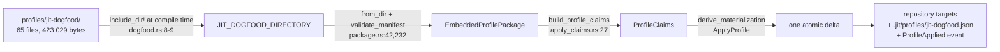
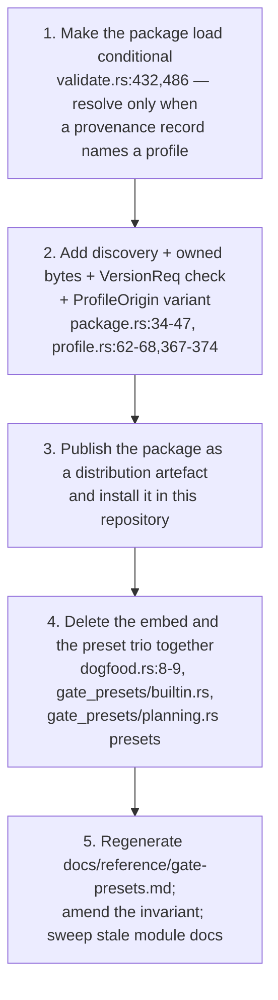

# Findings — How jit's own workflow profile leaves the binary (a62d444d)

> **Diátaxis Type:** Explanation (research findings)
> Investigated at `170436cd`. Every claim about current behaviour cites
> `file:line` at that revision. Three claims are backed by experiments run
> against the installed binary; each names its result inline.

## Scope

The owner has ruled: domain agnosticism is the durable invariant, a specific
workflow does not belong in the source, and `@/invariant/domain-agnostic`'s
sanctioned carve-out for the planning-bracket trio is what the ruling removes.
This report establishes mechanism, sequencing, and consequence. It does not
weigh the direction.

Two results are worth reading first, because both cut against the expected
shape of the problem:

- **The bootstrap hazard is not the bracket.** This repository has never applied
  its own profile — `.jit/profiles/` does not exist and `jit profile list`
  reports `applied: false`. Its bracket gates are repository-authored `exec`
  checkers in `.jit/gates.toml`, not the packaged placeholders, and
  `jit apply plan` resolves through the registry when a preset is absent
  (`commands/template.rs:1236-1240`), inserting a preset definition only for a
  key the registry lacks (`template.rs:1263`). Removing the preset trio does not
  stop this repository planning its own containers. Proven by experiment (§5.1).
- **The bootstrap hazard is `jit validate`.** The embedded package is loaded
  unconditionally on every validation in every repository, profiled or not
  (`commands/validate.rs:432,486`), and this repository's `jit-validate` and
  `repo-validate` gates shell out to `jit validate`. Deleting the package before
  that load is made conditional breaks every gate in the repository, including
  the ones that would certify the removal. That is the ordering constraint §5
  pins.

Three costs have no route back without a decision taken alongside the
extraction; they are stated plainly in §10 rather than buried in a trade-off
table.

## Methodology

- Re-read the rescoped issue, `e204e63d-plan.md`, `e204e63d-investigation.md`
  and `progress.json`; resolved `@/invariant/domain-agnostic`, `@/charter/D-3`
  and `@/charter/D-8` with `jit item show` and read D-3/D-8's full entries in
  `dev/vision/9db27a3a-charter.md`.
- Read every production consumer of the embedded package and traced each to its
  callers rather than accepting a consumer list. Two facts in circulation are
  wrong; both corrections are in §1.4.
- Swept engine code for planning-bracket vocabulary (`brackets`, `planning`,
  `breakdown`, `plan`) to find what else the ruling reaches, and separated
  production occurrences from tests and doc examples.
- Ran three experiments in a scratch directory against the installed binary:
  plain `jit init`; `jit init` plus a hand-authored `plan` template; and a
  repository whose bracket gate names no preset supplies. Results in §4.2 and
  §5.1.
- Counted the manifest's declarations by parsing rather than grep, because the
  region's source also sits under the live prefix and grep double-counts it.

---

## 1. The mechanism today (REQ-01)

### 1.1 From checked-in directory to applied repository



`profiles/jit-dogfood/` holds 65 files totalling 423 029 bytes: `manifest.toml`
plus 64 declared sources — 60 one-to-one assets under `assets/live/`, 3 under
`assets/install/`, and 1 managed-region source that also sits under
`assets/live/` (`profiles/jit-dogfood/manifest.toml:580-584`). It declares 29
semantic contributions, among them six gate definitions (`plan-review`,
`breakdown-review`, `code-review`, `coverage-preview`, `jit-validate`,
`repo-validate`) and the `plan` graph template (`manifest.toml:273-274`).

`include_dir!("$CARGO_MANIFEST_DIR/../../profiles/jit-dogfood")`
(`crates/jit/src/profile/dogfood.rs:8-9`) compiles the directory in.
`jit_dogfood_package()` (`dogfood.rs:37`) parses and validates it on each call;
there is no cache, so every consumer re-validates.

Application composes the package into image-independent claims
(`crates/jit/src/profile/apply_claims.rs:27-100`) and publishes them through one
recoverable materialization with the provenance record
`.jit/profiles/jit-dogfood.json` and a `ProfileApplied` event
(`commands/profile.rs:136-183`). Re-application of an exact installation is a
no-op (`profile.rs:151-159`).

The 60 live assets are byte-identical copies of files that exist independently
in this repository — `.agents/skills/**`, `contrib/gates/**`,
`.jit/reference/content-standards.md`. A test asserts that equality, mode
included, naming the package as the authority
(`crates/jit/src/profile/dogfood.rs:437-473`, message at `:457`).

### 1.2 Every consumer, and what each loses

| # | Consumer | Site | Without the package |
|---|---|---|---|
| 1 | `jit profile list` | `commands/profile.rs:56-73` | Builds a hardcoded one-element list from the package metadata (`:62-68`). Nothing to list. |
| 2 | `jit profile show / plan / apply`, `validate_profile_id` | `commands/profile.rs:367-374` (`embedded_profile`, the sole resolver) | No profile resolves by id; all four commands fail. |
| 3 | `jit init --profile <id>` | `commands/init.rs:68` → `init.rs:391-393` | The profiled initialization path has no package to overlay. |
| 4 | Built-in gate-preset **inventory** | `gate_presets/builtin.rs:35,51` → `dogfood.rs:70-117` | Preset *names* are read from the package's `plan` template node gates; `BuiltinPresets::names()` has no source. |
| 5 | Built-in gate-preset **shapes** | `gate_presets/planning.rs:101` → `dogfood.rs:42-64` | Each of the trio is deserialized from the package's gate contributions; the trio has no definition. |
| 6 | `jit validate` and `jit validate --fix` | `commands/validate.rs:432,486` | Loaded **unconditionally in every repository**, profiled or not, and `?`-propagated — an unresolvable package fails validation outright. |
| 7 | Repository-local template-region render | `profile/template_region.rs:63` | Test/dev only: the module is `#[cfg(any(test, feature = "test-support"))]` (`profile/mod.rs:18-19`) with no production caller. Relevant because it belongs to epic e204e63d's surviving projection story (§8). |

Consumers 4 and 5 reach further than their call sites suggest.
`load_presets_from_custom_files` seeds its map from `BuiltinPresets::load()`
before merging any repository-authored preset (`gate_presets.rs:170`), and that
function backs:

- `jit gate preset list` / `show` (`storage/json.rs:1367-1373` via
  `PresetManager::new`);
- `jit apply <template>` gate resolution (`commands/template.rs:747-760`), where
  a preset takes precedence over a registry gate of the same key
  (`template.rs:1232-1242`);
- the built-in-name collision check in `jit gate preset create`
  (`commands/gate.rs:1453`);
- `docs/reference/gate-presets.md`, a projection of the built-in definitions
  with a conformance test asserting the committed copy equals the projection
  (`gate_presets/reference.rs:23,320-334`).

Consumer 6 is the load-bearing one. `capture_repair_plan` captures every package
target path into the repository image before deciding anything
(`validate.rs:553-563`); where `.jit/profiles/<id>.json` exists it requires the
stored record to equal `expected_record(package)` exactly — id, version, origin,
package hash and every per-target hash (`validate.rs:591-598`, record built at
`commands/profile.rs:337-346`). A mismatch is a validation *failure*. Only an
exact match yields repair claims (`validate.rs:600`) that let
`jit validate --fix` restore a deleted or edited profile-owned file.

Because the package ships inside the binary, "the package is resolvable" and
"the binary exists" are the same statement today, and
`@/invariant/derived-state-coherence` holds for profile-owned targets for free.
Extraction separates those statements; §10.2 states the consequence.

### 1.3 Version compatibility is declared, and checked only at release time

`ProfileMetadata.jit` (`profile/manifest.rs:42-43`) carries a semver
requirement — `jit = ">=1.0.0, <2.0.0"` (`manifest.toml:5`).
`validate_manifest` only *parses* it (`profile/package.rs:253-258`); no
`VersionReq::matches` call exists in the workspace (`rg VersionReq` returns
exactly `package.rs:4,253`). The sole enforcement is offline, at release time:
`scripts/release-version-contract.py:462-488` requires the declared range to
admit the product version.

That holds while package and binary ship together. It is the first gap the
extraction closes (§3.2).

### 1.4 Two corrections

- **`commands/init.rs:462,690` are not consumers.** `#[cfg(test)] mod tests`
  begins at `init.rs:459`; both lines are inside it. The production consumer is
  `init.rs:68`, resolving through `init.rs:391-393`.
- **The manifest declares 63 assets, not 64.** Parsed: 60 live, 3 install-only,
  plus 1 `[[region]]` whose source is also under `assets/live/` — 64 declared
  sources, 65 files with the manifest. Grep on the live prefix returns 61
  because it counts the region.

---

## 2. The criterion, and what falls on each side (REQ-06)

### 2.1 The criterion

The ruling's own example fixes it: the template *system* stays, the planning
bracket goes. Generalized to an operational test that can be applied to a line
of code rather than argued about:

> **A thing belongs in the binary if it interprets repository configuration.
> It does not belong in the binary if it can be expressed as repository
> configuration.**

The test is decidable by construction, and its answer is verifiable rather than
a matter of taste: for any candidate, either an adopter can write it into
`.jit/` and get the same behaviour, or they cannot. Two corollaries follow:

- A **mechanism parameterized by declared vocabulary** is engine capability,
  however specific its motivating use. `expand_template` interprets any
  template; `bracket_breakdown` reads planning and breakdown types from the
  repository's `TemplateRegistry` (`commands/breakdown.rs:12-19`);
  `bracket_scope_ids` takes the breakdown type as an argument
  (`domain/queries.rs:443-455`) and its own test uses a custom type `synthesis`
  rather than the literal (`queries.rs:739`). All stay.
- A **named instance** is a specific application, however small.
  `PLAN_REVIEW_PRESET = "plan-review"` (`gate_presets/planning.rs:105`) names one
  workflow's gate. It goes.

The criterion is measurable here, not hypothetical: all three bracket gate
definitions are ordinary `.jit/gates.toml` stanzas whose checkers are
`review_placeholder` (×2) and `label_target_validation` (×1) — checker kinds
available to any adopter (§4.2, Case 2 output). Nothing in the trio is
inexpressible as configuration, so the criterion places it outside the binary
without ambiguity.

### 2.2 Applied to every REQ-01 consumer

| Consumer | Side | Reasoning under the criterion | Disposition |
|---|---|---|---|
| 1–2 `jit profile list / show / plan / apply` (`commands/profile.rs`) | **Engine**, with an application-shaped core | The profile *lifecycle* interprets a package; the *inventory* does not. `embedded_profile` (`profile.rs:367-374`) compares against one compiled-in id and `list_embedded_profiles` returns a one-element `Vec` literal (`:62-68`) — a named instance. | Commands stay. Resolution and enumeration become discovery (§3). |
| 3 `jit init --profile` (`init.rs:68`) | **Engine** | The flag interprets whatever package it is given (`init.rs:391-393` delegates to the same resolver). | Stays; resolution moves with §3. |
| 4 `BuiltinPresets` (`gate_presets/builtin.rs`) | **Application** | Its entire content is one workflow's gate names, read from that workflow's `plan` template (`builtin.rs:35`). Nothing here interprets configuration. | Removed. `load_presets_from_custom_files` (`gate_presets.rs:170`) seeds from an empty set; `PresetManager` keeps loading `.jit/config/gate-presets/`. |
| 5 `gate_presets::planning` (`gate_presets/planning.rs`) | **Application**, except one function | `plan_review_preset`, `coverage_preview_preset`, `breakdown_review_preset` and the four `*_PRESET`/`*_GATE` constants (`:105,109,112,116`) are named instances. `preview_coverage_rule` (`:181`) is a pure rule transform parameterized by `breakdown_type`, with no production caller in `crates/jit/src/` — only doc examples and tests. | Presets and constants removed. `preview_coverage_rule` is engine-shaped but currently orphaned; §10.3. |
| 6 `jit validate` package load (`validate.rs:432,486`) | **Engine**, with an application-shaped precondition | Derived-state repair over an installed profile is engine capability. Loading *a particular package id unconditionally* is not: a repository with no profile is made to depend on one workflow's bytes. | Load becomes conditional on the provenance record and resolved through discovery (§3, §5.2). |
| 7 `profile/template_region.rs:63` | **Neither** | Repository-local dogfooding scaffolding, `cfg`-gated out of adopter builds (`profile/mod.rs:18-19`). | Retargeted to the discovered package when the embed goes (§8). |

### 2.3 The borderline cases, resolved

Three engine constants name bracket vocabulary and survive the criterion,
because each is an **overridable default of a generic mechanism** rather than an
instance: `DEFAULT_PLANNING_ROLE`, `DEFAULT_BREAKDOWN_ROLE` and
`DEFAULT_CONTAINER_ANCHOR` (`templates.rs:206,210,214`), each documented as "The
SOLE place this name lives" and each resolved through `[roles]` / `[anchors]` in
`.jit/templates.toml` when declared. A repository using its own vocabulary needs
no code change, which is the criterion's test.

They are the closest call in the sweep and are worth naming in the amendment's
review, because a stricter reading — "no workflow noun in the binary at all" —
would delete them and force every repository to declare bindings it currently
inherits. The criterion as stated in §2.1 keeps them; a reviewer applying a
different criterion would not.

---

## 3. What a contributed profile is in this codebase (REQ-02, REQ-10)

### 3.1 What already generalizes

The package model was written as if its bytes were untrusted external data.
Everything below holds unchanged for a package of unknown provenance:

- `EmbeddedProfilePackage::from_files` (`package.rs:47-66`) takes a
  `BTreeMap<String, &[u8]>` and knows nothing about `include_dir`. Only
  `from_dir` (`package.rs:42-45`) is embedding-specific. **A directory walk is
  the entire new reader.**
- Untrusted-input defences that only make sense for external data: file-count
  and byte bounds, 512 files / 4 MiB (`package.rs:15-18`, enforced `:215-230`);
  rejection of absolute, traversal, Windows-prefix, control-character and
  backslash paths (`package.rs:390-416`); rejection of a declared source that is
  absent and of a package file no declaration claims (`package.rs:297-309`);
  duplicate-source and duplicate-target rejection (`package.rs:271-295`);
  `deny_unknown_fields` on every manifest type (`manifest.rs:17,34,48,61`);
  rejection of reserved interpolation tokens in package bytes
  (`apply_claims.rs:102-133`).
- Content addressing: domain-separated SHA-256 over the canonical manifest and
  every path, plus per-target hashes (`package.rs:452-521`). Verifying a
  discovered package needs no new primitive.
- The wire formats: `ProfileManifest` and its schema (`manifest.rs:82-84`),
  public through `jit profile show --json` and the MCP bridge;
  `AppliedProfileRecord` (`repository_state/profile_apply.rs:197,237`);
  `Event::ProfileApplied` (`domain/types.rs:1308,1628`). All carry `origin`
  already.
- `ProfileOrigin` (`domain/types.rs:1001-1006`) is a one-variant enum whose doc
  comment reads "Package bytes were compiled into the running JIT binary" — a
  vocabulary shaped for a second variant.
- Claim construction, materialization, the validation overlay, the reserved-target
  guard (`profile.rs:415-433`) and the whole publication path take
  `&EmbeddedProfilePackage` and are otherwise provenance-blind.

### 3.2 What has to be built

Four changes, none large:

1. **Owned bytes.** `EmbeddedProfilePackage<'a>` holds `&'a [u8]`
   (`package.rs:34-38`). A disk read produces `Vec<u8>`. Either the borrow
   becomes `Cow<'a, [u8]>` or the type gains an owned twin.
2. **A runtime compatibility check.** `VersionReq::matches` against the running
   product version at resolve time, with an error variant (§1.3). This is the
   one piece of validation that does not exist at all today.
3. **A second `ProfileOrigin` variant**, changing the persisted record and the
   event wire shape. `@/invariant/canonical-cutover` and the greenfield policy
   make that unproblematic, but it is a persisted-format change.
4. **A resolver and an enumerator** replacing `embedded_profile`
   (`profile.rs:367-374`) and the literal list (`profile.rs:62-68`).

Plus the renames `@/invariant/canonical-cutover` requires: `EmbeddedProfilePackage`,
`list_embedded_profiles`, `apply_embedded_profile`, `MAX_EMBEDDED_PROFILE_*`, and
the CLI help "List profiles embedded in this JIT binary" (`cli.rs:2876`).

### 3.3 Alternative: where a profile lives (REQ-10)

`contrib/` is not a candidate and is not a mechanism: it holds
`contrib/gates/ai-review.sh`, three review prompts and three prompt bodies that
`docs/how-to/custom-gates.md` tells adopters to copy by hand. Nothing reads it
at runtime.

| Option | For | Against |
|---|---|---|
| **A. `--from <path>` only** | Smallest surface; no search semantics, no precedence, no ambiguity. | `jit profile list` has nothing to enumerate. Derived-state repair (`validate.rs:591-600`) has no path to re-resolve the package on a later `jit validate`, so §10.2's cost is unmitigated. |
| **B. Repository-local, e.g. `.jit/profiles/packages/<id>/`** | The package is versioned with the repository that uses it, so repair keeps working for the life of the repository. Consistent with `@/charter/D-1` (repository-local git-versioned storage). Enumeration is a directory listing. | `.jit/profiles/` is currently the provenance-record directory and is reserved against package targets (`profile.rs:415-433`); a package subdirectory needs that guard extended. Adds ~423 KB to the adopter's repository. |
| **C. User- or machine-level, e.g. `$XDG_CONFIG_HOME/jit/profiles/<id>/`** | Install once, use in many repositories. | A repository's derived-state repair then depends on machine state, which contradicts `@/charter/D-1`'s repository-local principle and makes `jit validate` machine-dependent. |
| **D. Search path with precedence (repo > user > env)** | Covers every case. | Precedence is adopter-visible surface and a diagnosis burden; it is the shape `@/charter/D-8` defers most explicitly. |

**Recommendation: B, with A as the install route.** `--from <path>` answers
"where do the bytes come from the first time"; the repository-local location
answers "where are they on the next `jit validate`". B is the only option that
keeps derived-state repair working without either machine state or a permanent
dependency on the source checkout. D is the eventual shape and should be left to
the post-1.0 lifecycle rather than half-built now.

### 3.4 Alternative: distribution format (REQ-10)

| Option | For | Against |
|---|---|---|
| **Directory tree** | `from_files` already takes a path→bytes map (`package.rs:47`), so a walk is the whole reader. Diffable, git-versionable, no new dependency. | Many files to fetch if published as loose objects. |
| **Tarball or zip** | One artefact to download and checksum, fitting the existing release-asset shape (`docs/reference/release-policy.md:52`). | Needs an archive dependency the workspace does not carry; `@/invariant/bounded-rust-build-footprint`'s dependency-policy assertions are checked at `scripts/rust-build-budget.sh` and pinned for `include_dir` at `package.rs:907-918`. |

**Recommendation: a directory as the on-disk format, published as one archived
release asset.** The archive is unpacked by the adopter or by `--from`; the
runtime reader stays a directory walk and adds no dependency. Note that the
release archive is currently "flat and carries four files: the `jit` CLI, the
`jit-server` binary, and both license texts" (`INSTALL.md:27`,
`release-policy.md:52`), so this is a new asset and touches `@/charter/D-16`.

---

## 4. The route the planning bracket takes out (REQ-03)

### 4.1 The route

The bracket's binary-shipped content is four declarations: three gate
contributions and the `plan` template contribution the preset inventory is
derived from (`dogfood.rs:70-117`). All four already exist in
`profiles/jit-dogfood/manifest.toml` — the package *is* the route. Nothing new
has to be authored for the bracket to leave; `BuiltinPresets` and
`gate_presets::planning`'s preset constructors are deleted, and the same
declarations reach a repository as profile contributions instead.

### 4.2 What an adopter experiences afterwards, measured

**Case 1 — plain `jit init` (unchanged by the extraction).** The scaffold writes
`config.toml`, `gates.toml`, `rules.toml`, `index.json`, `events.jsonl`,
`issues/`, `schemas/` — and **no `.jit/templates.toml`**. `jit apply plan <C>`
fails today, before any change:

```
Error: no template 'plan' in .jit/templates.toml; declare it or check the name
```

So a fresh repository has no working bracket now. The extraction does not take
one away; it changes what a *second* command has to be for the adopter to get
one.

**Case 2 — `jit init` plus a hand-authored `plan` template, today.** Adding
`planning`/`breakdown` to `[type_hierarchy].types` and writing the template from
`docs/how-to/adopt-planning-bracket.md:70-98` is sufficient, and the built-in
presets supply the gate definitions:

```
Applied template 'plan' to 27ce5145: breakdown=35b730bc… planning=788815fc…
```

`.jit/gates.toml`, previously carrying none of these keys, gains all three:

```toml
[gates.checker]
type = "review_placeholder"      # plan-review, breakdown-review

[gates.checker]
type = "label_target_validation" # coverage-preview
label_namespace = "brackets"
```

**Case 2 after the extraction.** The same authored template still applies, and
`jit apply plan` still succeeds — but the adopter must also write those three
stanzas, because no preset supplies them. `resolve_captured_gate` falls through
to the registry (`template.rs:1236-1240`), so the difference is exactly forty
lines of TOML the adopter now types. If they write neither the stanzas nor the
profile, `jit apply plan` fails naming the unresolvable gate
(`template.rs:1241`).

**Case 3 — how the adopter obtains the bracket instead.**
`jit init --profile jit-dogfood` today produces `.jit/` with `templates.toml`,
`invariants.toml`, `reference/`, `profiles/`, plus `.agents/skills/`,
`contrib/gates/` and a managed `AGENTS.md` region. After the extraction this
becomes: obtain the package (release asset or checkout), then
`jit init --profile jit-dogfood --from <path>` or
`jit profile apply jit-dogfood --from <path>`. Same outcome, one more step, and
one artefact to have fetched. §10.1 states the property that step costs.

---

## 5. Sequencing (REQ-05, REQ-10)

### 5.1 The break that does not happen: this repository's own planning

The concern is that a step exists where the bracket has left the binary and not
yet arrived on disk, and this repository cannot plan its own work. It does not
arise, for three verifiable reasons.

1. **The profile was never applied here.** `.jit/profiles/` does not exist;
   `jit profile list --json` reports `"applied": false`. This repository's
   bracket gates are hand-authored `exec` checkers —
   `plan-review`, `breakdown-review` and `code-review` run
   `./contrib/gates/ai-review.sh`, `coverage-preview` runs
   `./scripts/coverage-preview.sh` (`.jit/gates.toml`, keys at `:3,85,107,295`)
   — not the packaged `review_placeholder` and `label_target_validation`.
2. **Preset resolution falls through to the registry.**
   `resolve_captured_gate` consults presets first, then
   `registry.gates.contains_key(name)`, and errors only when neither has it
   (`commands/template.rs:1232-1242`). All three keys are in this repository's
   registry.
3. **A preset never overwrites an authored gate.** The preset branch inserts a
   definition only `if !registry.gates.contains_key(&gate.key)`
   (`template.rs:1263`); otherwise it attaches the key and leaves the authored
   definition alone. So the presets have no effect on this repository today
   beyond name resolution, and their removal changes only which branch resolves
   the same three names.

**Experiment.** In a scratch repository with no profile, a `plan` template whose
node gates are `house-plan-review` and `house-coverage` — names no preset
supplies — and both gates declared in `.jit/gates.toml`:

```
Applied template 'plan' to 50c7d77d: breakdown=0d46b65f… planning=93729037…
```

The registry-key path carries the whole bracket. This is both the proof that
this repository is safe and the demonstration of the adopter route in §4.2.

### 5.2 The break that does happen: `jit validate`

`jit validate` loads the embedded package unconditionally in every repository
(`commands/validate.rs:432,486`) and `?`-propagates the failure. This
repository's `jit-validate` and `repo-validate` gates invoke `jit validate`
(`.jit/gates.toml:235,317`). If the package is removed from the binary before
that load is made conditional, then for a binary built at that commit:

- `jit validate` fails in every repository, including ones that never had a
  profile;
- every gate in this repository that depends on it fails, so the change cannot
  be certified by the gates that would certify it;
- `jit validate --fix` cannot repair derived state, which
  `@/invariant/derived-state-coherence` relies on.

A second, smaller instance of the same shape: `docs/reference/gate-presets.md`
is a projection of the built-in presets with a conformance test asserting
committed content equals projection (`gate_presets/reference.rs:23,320-334`).
Deleting `BuiltinPresets` without regenerating that reference in the same change
fails the suite.

### 5.3 The ordering



The load-bearing constraints, each with the reason it is an edge rather than a
preference:

- **1 before 4** — otherwise §5.2's break. This is the only strict ordering
  requirement the investigation found, and it is absolute.
- **2 before 3** — an artefact nothing can discover is not installable.
- **3 before 4** — the package must be resolvable from disk before the embedded
  copy stops existing, or there is a revision at which no repository can apply
  the profile.
- **4 is indivisible** — the embed and the preset trio go in one change. Deleting
  the embed alone leaves `gate_presets/planning.rs:101` calling
  `jit_dogfood_gate` against nothing; deleting the presets alone leaves the
  package embedded for no consumer that needs it in the binary.
- **5 in the same change as 4 or immediately after** — the projection
  conformance test (`reference.rs:320-334`) fails in between.

Step 1 is worth landing on its own regardless of what follows: making a
whole-repository command stop depending on one workflow's bytes is the ruling's
principle applied at its sharpest point, and it is independently reviewable.

---

## 6. The amendments (REQ-04)

### 6.1 `@/invariant/domain-agnostic`

Current text carves out the trio: "The one sanctioned exception is the
planning-bracket preset trio (plan-review, coverage-preview, breakdown-review):
it encodes jit's own plan-before-fan-out workflow (`@/charter/D-3`), not an
adopter domain, so it is retained as the single binary-shipped preset bundle."

Proposed replacement text, in the words it would carry — stating what holds,
with no reference to what it replaces (the registry entry is the current
statement of the rule, and `CHANGELOG` is where a change is narrated):

> **domain-agnostic** — Engine logic is domain-agnostic: type names, label
> vocabularies, gate keys, templates, and workflow shapes come from repository
> configuration (`.jit/`), never from hardcoded domain assumptions. The binary
> ships the mechanisms that interpret that configuration and no instance of it:
> a specific workflow, including jit's own plan-before-fan-out bracket
> (`@/charter/D-3`), reaches a repository as a profile package. A name a
> mechanism resolves through declared bindings is part of the mechanism; a
> declaration naming a particular gate, template, or node type is not.

The final sentence is what keeps `DEFAULT_PLANNING_ROLE`,
`DEFAULT_BREAKDOWN_ROLE` and `DEFAULT_CONTAINER_ANCHOR`
(`templates.rs:206,210,214`) inside the rule rather than making the amendment
delete them by implication (§2.3). Without it the invariant is ambiguous at
exactly the place a reviewer will test it.

### 6.2 `@/charter/D-3`

**No amendment.** D-3 records the workflow: "A breakable container is bracketed
by a planning node and a breakdown node, instantiated by the `plan` template via
`jit apply plan`, with gates that must pass before any implementation child is
dispatched" (`dev/vision/9db27a3a-charter.md`, D-3 entry). Every clause stays
true — the template still instantiates the bracket, the gates still gate. The
decision says nothing about where the gate definitions ship, so nothing in it
goes stale. Its addressable summary row, "Plan-before-fan-out bracket gates a
breakable container before implementation", is likewise unaffected.

### 6.3 Stale prose the change carries with it

Per the repository's stale-text sweep rule, the amendment's footprint includes
four places that assert the trio is binary-shipped:

- `crates/jit/src/gate_presets.rs:8-12` — module doc, "carries the presets the
  binary ships — only the planning-bracket trio", citing `@/inv/domain-agnostic`;
- `crates/jit/src/gate_presets/builtin.rs:1-15` — module doc, "The binary ships
  exactly the three planning-bracket presets";
- `crates/jit/src/gate_presets/planning.rs:1-28` — module doc, the three preset
  descriptions;
- `docs/reference/gate-presets.md` — a generated projection (§5.2).

A supporting note rather than an amendment: `@/charter/D-2` already reads
"Quality gates declared in `.jit/gates.toml`, not baked into the binary". The
removed carve-out was the one place the code stood outside D-2; the ruling
brings the two into agreement rather than changing either.

---

## 7. Effects traced (REQ-07)

| Surface | Effect |
|---|---|
| **`jit init`** | Plain `jit init` unchanged — it neither reads nor needs the package (§4.2, Case 1). `jit init --profile <id>` keeps its flag and its atomic scaffold-plus-profile publication (`init.rs:68-210`); resolution moves to discovery, and the adopter supplies a location. The offline, no-checkout property is what this costs (§10.1). |
| **Derived-state repair** | The unconditional load (`validate.rs:432,486`) becomes conditional on the provenance record. Where a record exists, repair needs the package resolvable to recompute `expected_record` (`profile.rs:337-346`, compared at `validate.rs:591-598`). A repository-local package location (§3.3 option B) preserves today's guarantee; any other location degrades it (§10.2). Where no record exists, validation stops touching profile machinery entirely — a strict improvement in a repository that never wanted a profile. |
| **Package validation** | Unchanged in substance; §3.1 lists the defences that already assume untrusted input. Gains the runtime `VersionReq::matches` it lacks today (§1.3). `MissingContent`/`ExtraContent` (`package.rs:297-309`) apply to a discovered tree exactly as to an embedded one. |
| **Build-footprint budget** | ~423 KB of embedded bytes leave every target that links the library; `include_dir` can leave `crates/jit/Cargo.toml:43`, retiring the dependency-policy assertion pinned at `package.rs:907-918`. The checker measures integration-target count (11 of 12 used, limit at `scripts/rust-build-budget.sh:36`) and active-executable bytes (2 GiB, `:37`), so the reduction is real but unmeasured. Discovery adds a directory walk and no dependency under §3.4's recommendation. **`crates/jit/build.rs` gains nothing**: it currently reads nothing ambient and emits only four `rerun-if-env-changed` (`build.rs:24-27`), and under the ruling it never acquires the directory `rerun-if-changed` epic e204e63d planned — so the mtime-sensitivity risk that change carried (`build.rs:6-11`, jit:5d862134) does not arise. |
| **Adopter out-of-the-box** | `jit init` behaviour is identical. `jit gate preset list` returns zero presets in a repository with no `.jit/config/gate-presets/`. The bracket is reachable by hand-authoring three gate stanzas (§4.2) or by applying the profile from a fetched artefact. |
| **This repository's gate registry** | **Unaffected.** All six workflow gate keys are hand-authored with `exec` checkers pointing at repository scripts (`.jit/gates.toml:3,85,107,235,295,317`); none was written by a profile, and `.jit/profiles/` does not exist. The preset trio's removal changes only which branch of `resolve_captured_gate` resolves the same three names (§5.1). The registry needs no edit at any step of the transition. |

---

## 8. Consequences for epic e204e63d (REQ-08)

Per criterion, against the epic's own text:

| Epic criterion | Verdict | Reasoning |
|---|---|---|
| **REQ-03** — "The packaged live-asset tree is derived from the repository files it mirrors rather than carried as a second checked-in copy, and editing a live file alone cannot leave the packaged copy stale." | **Survives unchanged, and gains value.** | Every clause is about the package and the repository; none mentions the binary. Removing 61 checked-in duplicates is exactly what the ruling wants, and the derived tree becomes the distribution artefact §3.4 recommends. Only the assembly's *output destination* changes, from a build-output directory to a publishable one. |
| **REQ-04** — "Two builds from identical sources and identical explicit environment **embed** byte-identical package content and report identical provenance, and the derivation is ordered so that the **embedded package** always reads a fully populated tree." | **Superseded.** | Both italicized terms lose their referent. The reproducibility property is worth restating as "two assemblies from identical sources produce identical package content and an identical package hash" — mechanically checkable through `EmbeddedProfilePackage::hashes().package` (`package.rs:452-521`) against the produced tree. The ordering clause (build script before `include_dir!` expansion) becomes meaningless: there is no `include_dir!`. |
| **REQ-05** — "Every root the packaged live assets are drawn from is declared, and a repository file under any declared root that is neither declared as a packaged asset nor matched by a declared exclusion fails the test suite." | **Survives unchanged.** | A property relating the manifest to the repository, with no reference to the binary. It becomes more important, not less: once the package is a separately shipped artefact, an omitted live consumer is a defect an adopter receives rather than one a rebuild hides. |
| **REQ-06** — "Editing a live consumer alone reports a binary installed before that edit as stale." | **Becomes meaningless.** | After extraction, editing a live consumer does not change the binary — that is the ruling's content. The staleness relation moves from binary↔live-source to package↔live-source, which is a different assertion about a different artefact. Task 779ea308 should close as superseded rather than be reworked; the equivalent property for the package is REQ-03's "editing a live file alone cannot leave the packaged copy stale". |

Task-level consequences within the halted chain:

- **Superseded:** `package-tree-cutover` (1d2f454e) — the embed is deleted, not
  re-rooted; `package-content-reproducibility` (ce0172c3) — retargets to the
  produced tree; `binary-build-input-inventory` (779ea308) — meaningless, per
  epic REQ-06.
- **Survive, retargeted:** `package-assembly-mechanism` (7d038e97) — produces a
  distribution artefact rather than a build-output tree, and no longer needs the
  `rerun-if-changed` that carried the mtime risk;
  `citation-check-package-exclusions` (26f503cc);
  `live-source-completeness-guard` (0cf1f351); `live-source-root-declaration`
  (39c34568) and its two documentation successors.
- **Unblocked and unaffected**, as the issue's Notes state: the two projection
  stories (25bdda50, 6f8f02ba) and the convergence task (65ff0f38) — **with one
  coupling worth flagging now.** `profile/template_region.rs:63` calls
  `jit_dogfood_package()`, so the template-region render that story ships reads
  the embedded package. It is `cfg`-gated test-support (`profile/mod.rs:18-19`)
  and the change is small, but it must be retargeted to the discovered package
  at step 4 (§5.3) or the story's freshness guard stops compiling.

---

## 9. Relationship to `@/charter/D-8` (REQ-09)

**The ruling reopens D-8. Stating it plainly rather than absorbing it:**

D-8 chose "one **embedded**, offline `jit-dogfood` profile with safe application
to fresh and existing repositories" and moved to a post-1.0 epic:
"Multi-profile composition, **local packages**, variables, reconfiguration,
diff, upgrade, removal, and shared-ownership semantics"
(`dev/vision/9db27a3a-charter.md:141-144`). An on-disk contributed profile is a
local package, named in that list. Its Rejected branch also names a failure mode
adjacent to this work: "dropping profiles from v1.0 entirely, which leaves the
strongest dogfooded workflow difficult for adopters to install"
(`:145-147`) — not what the ruling does, but the property §10.1 puts at risk.

What fits **inside** D-8 as written: nothing about disk discovery. Its Chosen
clause says "embedded" in the first sentence.

What **reopens** it: the resolver, the location, and the distribution asset —
items 3.2.4, 3.3 and 3.4 of this report.

What need **not** reopen: everything else in D-8's deferred list. The ruling
requires one profile discovered from one declared location. It does not require
composition, variables, reconfiguration, diff, upgrade, removal, or
shared-ownership semantics, and building any of them now would exceed the
ruling as well as the charter.

**Recommendation:** amend D-8 narrowly and explicitly rather than let the
extraction exceed it silently — replace "one embedded, offline profile" with
"one offline profile discovered from a declared repository-local location",
leaving the rest of the deferred list intact and its Reasoning ("solves the
immediate adoption problem with a bounded surface") true. A narrow amendment
also records where the boundary now sits, which is what stops the next
container reading the reopening as permission for the whole lifecycle.

`@/charter/D-16` (one tag-triggered workflow, one GitHub release) is touched by
the new release asset but not contradicted: one release carrying one more asset
is still one release. `@/charter/D-14` (v1.0 gated on completed profiles MVP)
now has a larger MVP.

---

## 10. Costs with no route back, stated before execution

Not arguments against the direction. Each is a property that disappears at a
specific step and cannot be recovered later without a decision taken at that
step.

**10.1 — `jit init --profile jit-dogfood` stops being self-contained.**
`docs/reference/profiles.md:5-8` promises that applying the profile "needs no
Git repository, network access, `jq`, or JIT source checkout". After step 4 the
adopter must have obtained an artefact first. If the release asset (§3.4) is not
shipped in the same release that removes the embed, the profile is reachable
only from a source checkout — and that is the exact condition D-8's Rejected
branch names. **The distribution decision must land with, not after, the
extraction.**

**10.2 — Derived-state repair becomes conditional on an artefact the adopter can
delete.** Today `jit validate --fix` restores a deleted profile-owned file
because `expected_record(package)` can always be recomputed
(`profile.rs:337-346`, `validate.rs:591-600`). Afterwards it can do so only
while the package resolves. The choice of location decides whether the
capability survives: §3.3's repository-local option preserves it; `--from`-only
or machine-level storage does not, and the fallback — trusting the stored record
when the package is unresolvable — silently converts `--fix` from "restores
profile-owned targets" to "restores what it can still see", which is a
regression in `@/invariant/derived-state-coherence`. If a degraded mode is
acceptable it should be chosen and documented deliberately, not arrived at.

**10.3 — Two smaller items that would otherwise be discovered late.**
`preview_coverage_rule` (`gate_presets/planning.rs:181`) is engine-shaped — a
pure rule transform parameterized by `breakdown_type` — but has no production
caller in `crates/jit/src/`; only doc examples and tests. When its module's
presets are deleted it needs a home or a deliberate removal, and
`@/invariant/canonical-cutover` argues against leaving it orphaned in a module
named for the workflow that left. And `docs/reference/gate-presets.md` is a
generated projection of the built-ins whose conformance test fails the moment
they go (`reference.rs:320-334`); it needs regeneration in the same change, and
its remaining subject is the portable-checker syntax reference at
`reference.rs:25+`, not presets.

---

## 11. Open questions

1. **Which location (§3.3)?** The recommendation is repository-local, driven by
   §10.2. It is the one open decision that changes what the extraction delivers
   rather than how it is done, and it should be settled before step 2.
2. **Does the release asset land in the same release (§10.1)?** If not, the
   window between removing the embed and shipping the asset is a release in
   which the profile is checkout-only.
3. **Is a degraded repair mode acceptable (§10.2)?** A product decision, not a
   technical one, and only live if the answer to (1) is not repository-local.
4. **How narrowly is D-8 amended (§9)?** Recommended narrow. Left to the owner,
   and worth recording as a charter decision rather than as an issue note, since
   the next profile-adjacent container will read it.
5. **Do `DEFAULT_PLANNING_ROLE` / `DEFAULT_BREAKDOWN_ROLE` /
   `DEFAULT_CONTAINER_ANCHOR` stay (§2.3)?** The criterion as stated keeps them
   and §6.1's final sentence makes that explicit. A reviewer applying a stricter
   reading would delete them and force every repository to declare bindings it
   currently inherits. Worth confirming when the amendment is taken, because the
   invariant's wording is what will be cited later.
