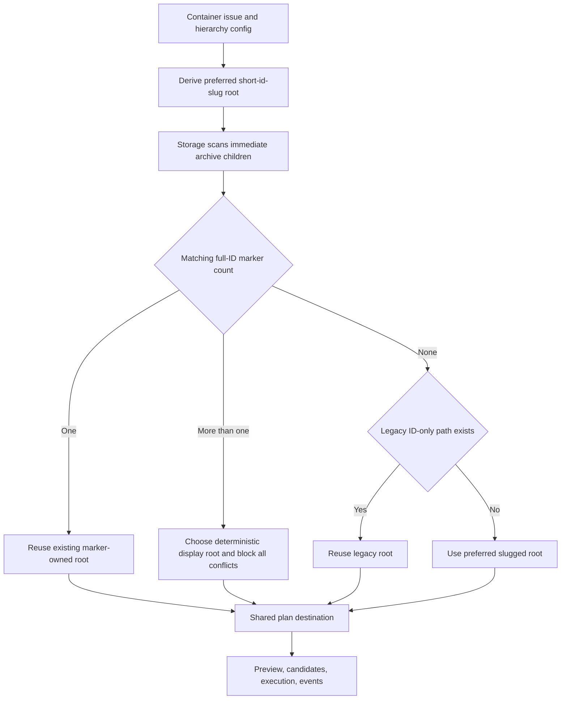

# Strategic label slugs for archive directories

**Issue:** a9b5dd08  
**Type:** enhancement  
**Priority:** normal  
**Date:** 2026-07-14

## Problem Statement

Container archives currently use only the container short ID as their directory name. The ID is the correct durable identity anchor, but an archive root containing many such directories is difficult to browse without querying JIT. The container's configured strategic label is a better human handle because it is curated, concise, stable across title edits, and already appears in queries and logs.

The layout must remain safe and backward compatible. Existing ID-only archives cannot be renamed implicitly, a later title or label edit cannot fork a second archive, and the suffix cannot become an identity source. Preview, execution, event reconciliation, and candidate reporting must all resolve the same directory.

## Success Criteria

- [hard] REQ-01: Selects the value of exactly one label in the namespace associated with the container's own configured type as the preferred archive slug; for example, `epic:artifact-archival` produces `<archive-root>/7d3a3a47-artifact-archival/`.
- [hard] REQ-02: Keeps the short ID and marker-recorded full issue ID authoritative; the human-readable suffix never participates in identity matching.
- [hard] REQ-03: Freezes the chosen directory name when an archive is first created, so later title or label changes reuse the marker-backed destination instead of renaming it or creating a second archive.
- [hard] REQ-04: Recognizes and reconciles existing ID-only archive directories without migration, data movement, or duplicate destination creation.
- [hard] REQ-05: Falls back deterministically to a normalized, length-bounded title slug when no unambiguous own-type strategic label exists, while preserving collision and overwrite protection for the resolved destination.
- [hard] REQ-06: Shows the resolved slugged destination consistently in document/container previews, candidate reports, execution results, JSON output, and human output.
- [hard] REQ-07: Verifies label selection, ambiguous and missing labels, normalization, title and label changes, legacy ID-only adoption, destination conflicts, repeat execution, and representative Unicode titles without mutating during preview.
- [hard] REQ-08: Documents the naming, stability, fallback, marker-authority, and backward-compatibility contract in the canonical archive reference.

## Design

The destination resolver has two phases.

1. A pure domain function derives the preferred directory component from the selected issue and configured hierarchy. It reads the issue's single `type:*` value, looks up that type's configured membership namespace, and uses the label value only when exactly one matching label exists. Otherwise it falls back to the issue title. Both inputs pass through one deterministic slug normalizer that lowercases Unicode alphanumeric characters, collapses other runs to `-`, trims separators, limits the result to 48 characters, and falls back to `container` when no usable characters remain. The preferred root is `<archive-root>/<short-id>-<slug>`.
2. A read-only storage resolver scans only immediate, non-symlink children of the configured archive root for a regular `.jit-container` marker whose exact trimmed content is the target's full ID. One match freezes and returns that existing directory. Multiple matches produce deterministic destination-conflict blockers. With no marker match, an existing legacy `<archive-root>/<short-id>` path remains the selected destination so the existing markerless adoption/conflict rules still apply. Only when neither form exists does planning use the preferred slugged root.

The marker wire format remains the full issue ID followed by a newline. This avoids a marker-schema migration and keeps identity independent of labels, titles, and directory parsing.

The resolved root becomes an explicit input to storage fact collection and pure classification. Existing constructors retain ID-only defaults for isolated domain tests, while production planning supplies the resolved root. Event and inverse-mirror reconciliation already key on the plan's destination root, so they continue to work once every planning phase consumes the same resolved value.

## Implementation Steps

1. Add pure slug selection, normalization, and preferred-root helpers beside artifact layout domain logic.
2. Add storage-owned marker discovery and legacy-root resolution without following symlinks.
3. Thread the resolved destination root and duplicate-marker blockers through archive planning, filesystem fact collection, and classification.
4. Add domain, storage, command, and CLI tests before implementation for every success-criterion branch.
5. Update the canonical archive reference with naming, freezing, fallback, marker authority, and compatibility behavior.
6. Run formatting, focused archive suites, full Rust CI, and the configured review gates.

## Testing Approach

- Pure tests cover exact strategic-label selection, missing and ambiguous labels, punctuation collapse, length limits, empty fallback, and Unicode titles.
- Storage tests cover one matching slugged marker, title/label drift, multiple matching markers, symlink refusal, and existing markerless ID-only directories.
- Command and CLI tests assert identical destination roots across document/container preview, candidates, execution result, rerun, JSON, and human rendering; preview snapshots prove no mutation.
- Regression tests retain destination-conflict behavior and prove the current ID-only archive layout is adopted without moving files.
- `cargo fmt --all -- --check`, `cargo clippy --workspace --all-targets`, focused archive suites, and the full workspace suite provide final verification.

## Risks and Open Questions

- Scanning the immediate archive directory adds bounded filesystem work per container plan. It deliberately avoids recursion; container roots are direct children of the configured archive root.
- Duplicate valid markers indicate corrupted identity ownership. Planning reports blockers rather than guessing which directory is authoritative.
- Unicode slugging is deterministic over Rust characters and bounded by characters, not bytes. The short-ID prefix remains ASCII and authoritative on every filesystem.
