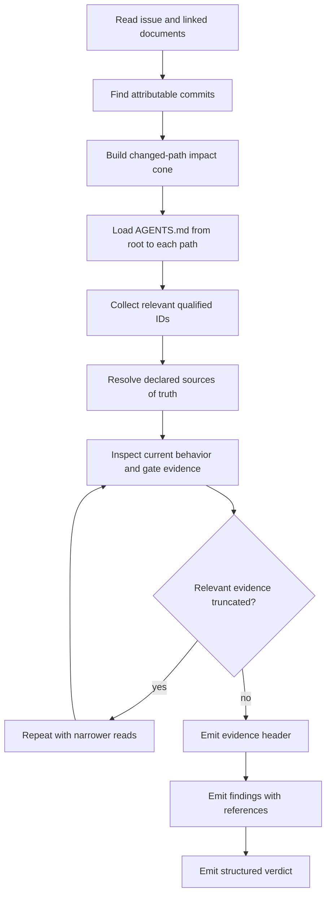

# Ground code review in AGENTS.md and addressable policy

**Issue:** b4e55aa2
**Type:** story
**Priority:** high
**Date:** 2026-07-12

## Problem Statement

The code reviewer needs two kinds of guidance:

1. engineering policy, such as architecture boundaries, testing expectations, and invariants;
2. review procedure, such as finding the issue's commits, reading evidence safely, and formatting findings.

Today those concerns overlap. `AGENTS.md` describes the repository's engineering policy, while `scripts/code-review-prompt.md` repeats a shorter version of some of the same rules. The shorter copy can omit or soften a rule even when `AGENTS.md` remains correct. The reviewer also sees qualified policy addresses such as `@/inv/atomic-writes`, but its procedure does not require resolving them or recording them in structured findings.

This design makes policy ownership explicit:

- applicable `AGENTS.md` files own canonical engineering prose;
- configured registries own invariants, rules, and gates;
- issue sections own issue-scoped requirements, decisions, and risks;
- the reviewer prompt owns review procedure only;
- structured findings record the qualified policy items that govern a defect.

The completed foundation issue `76cb968b` defines the governing three-tier rule: renderer-owned projections stay inline, explanatory prose uses a short gloss plus address, and behavioral agent instructions use a bare address that the agent resolves before acting.

## Success Criteria

- [hard] REQ-01: Code review treats every `AGENTS.md` applicable from repository root to an affected path as the complete canonical prose baseline; closer files may specialize broader guidance, and unresolved contradictions produce findings.
- [hard] REQ-02: The design contains a policy-ownership matrix mapping every guiding principle from the historical and current reviewer rubrics to exactly one canonical `AGENTS.md` section, registry-backed qualified item, or reviewer-procedure rule; no principle is unowned and no registry-owned behavior is hand-copied into the prompt.
- [hard] REQ-03: A registry-backed `pid-safety` invariant uses the approved statement, resolves at `@/inv/pid-safety`, projects into `AGENTS.md`, and is cited by relevant review findings.
- [hard] REQ-04: `AGENTS.md` contains the approved public-API documentation and contextual testing guidance, including relevant success, boundary, failure, and concurrency behavior.
- [hard] REQ-05: Following `76cb968b`'s tier-3 policy, code review discovers qualified IDs from applicable `AGENTS.md`, issue text, relationship labels, linked documents, attributable patches, and directly implicated behavior; it resolves them through `jit item show`, follows each configured source of truth, and stays within the attributable impact cone.
- [hard] REQ-06: Code review treats `satisfies:`, `enforces:`, and `per:` as evidence claims; attributable dangling, contradictory, or unsupported relationships block, while unrelated pre-existing defects are advisory.
- [hard] REQ-07: Every review emits the fixed five-field Markdown evidence header—Attribution, Policy sources, Resolved items, Gate evidence, and Truncation recovery—with `none` used explicitly when empty.
- [hard] REQ-08: `GateFinding` supports an optional/default-empty `references` array of strings across parsing, storage, schemas, JSON output, and backward-compatible legacy records; generic engine code preserves values without repository-specific resolution.
- [hard] REQ-09: Findings governed by addressable policy include qualified IDs in `references`; the repository review policy requires valid resolved IDs, while findings with no governing item may keep the array empty.
- [hard] REQ-10: Validation behavior is split correctly: `@/gate/jit-validate` owns executable validation, `AGENTS.md` owns the general required-gate policy, and the reviewer consumes current recorded evidence without redundantly rerunning a passing gate.
- [hard] REQ-11: Deterministic positive and negative tests cover policy precedence, bounded item discovery, source-of-truth selection, relationship claims, evidence-header completeness, structured references, legacy compatibility, and absence of duplicated registry prose.
- [hard] REQ-12: User-facing and contributor documentation explains policy ownership, addressable review traceability, structured references, and the tool-agnostic reviewer contract; registry projections are regenerated and mechanically fresh.
- [hard] REQ-13: A representative live review demonstrates correct `AGENTS.md` loading, qualified-item resolution, bounded inspection, evidence-header output, structured references, truncation recovery, and a valid verdict/findings contract; a linked report records the session ID and measurements.

## Concepts

### Applicable AGENTS.md

An `AGENTS.md` file contains instructions for its directory tree. For a changed file, the reviewer reads instructions from repository root toward that file. A closer `AGENTS.md` may intentionally specialize a broader rule. If two applicable files contradict each other and the specialization is not clear, the reviewer reports the conflict.

This repository currently has a root policy file, but defining the precedence now keeps the review procedure correct if nested policy files are added later.

### Addressable item

An addressable item is a requirement, decision, risk, invariant, rule, gate, definition, or charter entry with a qualified ID. Examples include `@/inv/atomic-writes`, `@/gate/jit-validate`, and an issue-scoped requirement address.

The address is a pointer, not a copy of the policy. The reviewer resolves it and reads the configured source of truth.

### Projection

A projection is generated prose derived from a registry. The invariant list in `AGENTS.md` and the rules-and-gates reference are projections. They are safe inline copies because renderers own them. Hand-copying the same registry statements into the reviewer prompt would create an additional source that can drift.

### Impact cone

The impact cone is the smallest set of current files, callers, tests, documentation, configuration, and policy needed to judge attributable behavior. It prevents addressable-item discovery from turning into a repository-wide compliance audit.

## Design

### Review flow



### Policy ownership

The table below assigns every principle from the historical prompt and the current review rubric to one owner. “Reviewer procedure” means the prompt can state the behavior inline. Registry-owned entries are cited and resolved rather than copied.

| Guiding principle | Canonical owner | Reviewer treatment |
|---|---|---|
| Issue success criteria must be satisfied | Issue description and content standards | Procedure reads hard requirements and verifies current behavior |
| Attributable work is issue-scoped | Reviewer procedure | Tagged-commit algorithm and no-tag fallback stay inline |
| Uncommitted changes are not automatically attributable | Reviewer procedure | Stays inline because it controls review scope |
| Current source determines shipped behavior | Reviewer procedure | Stays inline |
| Material issue-introduced debt blocks; unrelated debt is advisory | Reviewer procedure | Stays inline as causal finding policy |
| Latest recorded gates are evidence; passed gates are not rerun | Reviewer procedure plus gate registry | Procedure interprets evidence; executable checks stay registry-owned |
| Read-only inspection | Reviewer procedure and code-review gate configuration | Procedure states prohibited mutations; gate configuration enforces sandboxing |
| Bounded reads and truncation recovery | Reviewer procedure | Stays inline |
| Architecture and layer boundaries | `AGENTS.md` Separation of Concerns | Prompt identifies `AGENTS.md` as baseline; it does not copy the layer list |
| Pure functions, immutability, iterator style | `AGENTS.md` Testability and Coding Conventions | Loaded from applicable prose |
| TDD and property testing for graph operations | `AGENTS.md` Testability | Loaded from applicable prose |
| Unit, harness, and integration test roles | `AGENTS.md` Testing Strategy | Loaded from applicable prose |
| Relevant success, boundary, failure, and concurrency coverage | `AGENTS.md` Testing Strategy | New approved prose; examples are contextual |
| Unsafe code is prohibited | `AGENTS.md` Coding Conventions | Loaded from applicable prose |
| Result-based errors, `thiserror`, and no library panics | `AGENTS.md` Coding Conventions | Loaded from applicable prose |
| Public API documentation | `AGENTS.md` Coding Conventions | New approved prose; examples are required when behavior is non-obvious |
| Machine-readable JSON and list envelopes | `AGENTS.md` Coding Conventions | Loaded from applicable prose |
| Git is optional except for declared features | `AGENTS.md` Coding Conventions and charter decision | Prose provides context; cited decision is resolved when relevant |
| Label formatting | Invariant and rule registries | Resolve the governing address; do not copy its statement into the prompt |
| Namespace registration | Invariant and rule registries | Resolve the governing address |
| DAG acyclicity | Invariant registry | Resolve the governing address |
| Gate semantics | Invariant registry | Resolve the governing address |
| Event logging | Invariant registry | Resolve the governing address |
| Atomic writes | Invariant registry | Resolve the governing address |
| Assignee formatting | Invariant registry | Resolve the governing address |
| Domain agnosticism | Invariant registry | Resolve the governing address |
| Single-source prose | Invariant registry | Resolve the governing address |
| PID signaling safety | New `pid-safety` invariant | Resolve and cite it when process-signaling code is in the impact cone |
| Required validation must pass | `AGENTS.md` general gate policy and `@/gate/jit-validate` executable policy | Consume latest evidence; do not copy checker commands into prose |
| Dependencies are complete and correctly used | DAG plus `AGENTS.md` lifecycle guidance | Procedure inspects enriched dependency state |
| Findings enumeration and terminal verdict | Tool-agnostic review wrapper | Checker-specific prompt does not duplicate the envelope |
| Finding disposition and origin | Reviewer procedure and findings schema | Procedure requires classification; schema stores it |
| Governing policy references | Reviewer procedure and findings schema | Procedure requires references; schema stores strings generically |

### Approved canonical prose

Add this public API rule to the hand-authored Coding Conventions section of `AGENTS.md`:

> Public APIs have doc comments describing their purpose and material contracts, including errors or invariants where relevant. Add examples when usage or behavior is non-obvious.

Add this contextual test-coverage rule to the hand-authored Testing Strategy section:

> Tests cover relevant success, boundary, failure, and concurrency behavior. Depending on the affected subsystem, representative cases include empty graphs, cycles, missing issues, and concurrent claims.

These are repository-wide prose standards, not registry facts.

### PID safety invariant

Add a registry entry with self-id `pid-safety` and the approved statement:

> Process-signaling code rejects sentinel or lossy PID conversions before invoking the operating system, including the `u32::MAX as i32 == -1` case that would turn a targeted signal into `kill(-1, sig)`.

Initially classify it as advisory unless implementation identifies an existing deterministic rule or gate that mechanically enforces the property. Render the invariant projection so the new entry appears in `AGENTS.md` through the configured renderer rather than hand editing the generated region.

### Reviewer prompt responsibility

The prompt keeps procedural rules and removes the duplicated engineering rubric. Its policy-discovery section must say, in substance:

1. applicable `AGENTS.md` files are the complete prose baseline;
2. root-to-path instructions apply, with closer specialization;
3. relevant qualified IDs are collected from policy, issue content, labels, linked documents, patches, and directly implicated behavior;
4. cited IDs are resolved before judging behavior;
5. configured sources of truth govern;
6. discovery remains within the impact cone;
7. relationship labels are claims requiring evidence;
8. qualified IDs governing findings are emitted as structured references.

This is tier-3 behavioral text under the `76cb968b` foundation. Registry statements themselves do not appear in the prompt.

### Bounded item discovery

The reviewer collects:

- qualified IDs explicitly cited by applicable `AGENTS.md` files;
- IDs in the issue description and linked documents;
- values carried by `satisfies:`, `enforces:`, and `per:` labels;
- IDs introduced or changed by attributable patches;
- additional governing items only when changed behavior directly implicates them.

The reviewer does not enumerate every project item. If no relevant qualified IDs exist, the evidence header reports `Resolved items: none`.

### Relationship labels

Relationship labels are assertions about the implementation:

- `satisfies:` claims that current behavior covers a criterion;
- `enforces:` claims that current behavior enforces an invariant, rule, or gate;
- `per:` claims consistency with a decision.

The reviewer resolves the target and checks the assertion. An attributable dangling, contradictory, or unsupported claim is blocking. An unrelated pre-existing defect is advisory.

### Evidence header

Every review emits these five fields before its findings:

```markdown
Attribution: commits 0123abcd, 4567efab
Policy sources: AGENTS.md
Resolved items: @/inv/atomic-writes, @/gate/jit-validate
Gate evidence: cargo-ci passed; jit-validate passed
Truncation recovery: none
```

Each field is always present. An empty field uses `none`, which makes omissions distinguishable from “not applicable.” The header is Markdown and remains outside the JSON findings envelope.

### Structured finding references

Extend `GateFinding` with a generic collection:

```rust
#[serde(default, skip_serializing_if = "Vec::is_empty")]
pub references: Vec<String>,
```

The generic parser stores strings exactly as emitted. It does not load repository configuration or resolve item kinds. This preserves the domain-agnostic boundary and keeps old records compatible because a missing field deserializes to an empty vector.

Example finding:

```json
{"id":"F1","severity":"high","disposition":"blocking","origin":"issue-impact","summary":"Direct writes bypass the required atomic replacement path.","file":"crates/jit/src/storage/json.rs","line":142,"references":["@/inv/atomic-writes"]}
```

The repository reviewer policy requires valid resolved qualified IDs when an addressable item governs the finding. A finding based only on ordinary code correctness may use an empty array.

### Source-of-truth conflicts

The reviewer follows the `source-of-truth` declared for the item kind:

- markdown-first items are read from their configured Markdown or issue section;
- registry-first items are read from their TOML registry;
- rendered projections are checked for freshness but do not override their source.

Attributable projection drift blocks. Unrelated pre-existing drift is advisory.

## Implementation Map

### Policy and registry

- `.jit/invariants.toml` — add `pid-safety`.
- `AGENTS.md` — add approved hand-authored public API and contextual testing prose; update only the renderer-owned invariant region through `jit invariant render`.
- `docs/reference/rules-and-gates.md` — regenerate only if configured projection inputs require it.

### Reviewer procedure

- `scripts/code-review-prompt.md` — replace duplicated engineering rules with the canonical-policy and address-resolution procedure; add the fixed evidence header and structured-reference requirements.
- `.jit/gates.toml` — change only if the code-review description needs to advertise policy grounding; keep the concrete reviewer command repository-local.
- `scripts/ai-review.sh` and `contrib/gates/ai-review.sh` — keep tool-agnostic and behaviorally identical; update only the common example JSON to document optional `references` if needed.

### Findings model and storage

- `crates/jit/src/domain/gate_findings.rs` — add `references` and parser/serde tests.
- `crates/jit/src/storage/gate_runs.rs` — verify round-trip persistence.
- `crates/jit/src/storage/reference.rs` — update the widest sample record and derived field-freshness expectations.
- `docs/reference/storage-records.md` — regenerate the stored-record reference so `references` is documented.
- `crates/jit/src/output.rs` and gate-status tests — confirm structured findings expose references unchanged through JSON and human inspection paths.

### Policy regression tests

- `crates/jit/tests/code_review_policy_test.rs` — cover `AGENTS.md` authority, root-to-path precedence, bounded resolution, relationship labels, source-of-truth behavior, evidence-header fields, structured references, and absence of copied registry prose.
- `crates/jit/tests/ai_review_verdict_tests.rs` — preserve wrapper compatibility and verify a classified finding carrying `references` passes through both wrapper copies.

### Documentation

- `docs/how-to/custom-gates.md` — explain how a repository-specific prompt can use applicable `AGENTS.md` files and addressable items while the wrapper stays tool-agnostic.
- Relevant contributor documentation — explain policy ownership and how to add reviewable addressable policy without copying it into prompts.

## Implementation Steps

1. Add failing `GateFinding.references` serialization, parser, storage, output, and legacy-record tests.
2. Implement the generic references field and refresh derived storage documentation.
3. Add the `pid-safety` invariant and render the invariant projection.
4. Add the approved public API and contextual testing prose to hand-authored `AGENTS.md` sections.
5. Add failing policy tests for canonical prose loading, qualified-item resolution, bounded discovery, label claims, the evidence header, and non-duplication.
6. Rewrite the repository-specific code-review procedure according to the `76cb968b` tier-3 rule.
7. Update both tool-agnostic wrapper copies only where the common optional field must be demonstrated; keep them identical.
8. Update adopter and contributor documentation and regenerate configured projections.
9. Run deterministic positive and negative test cases.
10. Commit attributable implementation with `jit:b4e55aa2` tags.
11. Run the required non-review gates, then a representative live review.
12. Record session ID, prompt/context measurements, policy sources, resolved items, truncation recovery, structured references, and verdict in a linked report.

## Testing Approach

| Area | Positive case | Negative case |
|---|---|---|
| Legacy findings | Missing `references` becomes empty | Malformed findings block still follows existing graceful degradation |
| Structured references | Multiple strings round-trip unchanged | Non-string array member makes the structured block invalid under existing parser behavior |
| Storage | Gate run persists and reloads references | Legacy stored result without the field still loads |
| Output | Status/findings JSON includes references | Empty references do not create compatibility noise |
| Policy precedence | Root policy applies; nested policy specializes it | Unresolved contradiction produces a finding |
| Discovery | Explicit and directly governing IDs resolve | Unrelated registry items are not swept |
| Source of truth | Registry-first and markdown-first items use their configured sources | Attributable stale projection blocks |
| Relationship claims | Supported `satisfies:`, `enforces:`, and `per:` claims pass | Dangling or unsupported attributable claim blocks |
| Evidence header | All five fields contain evidence | Empty values render as `none`; a missing field fails policy tests |
| Prompt SSOT | Procedural prompt cites and resolves policy | Copied registry statements fail non-duplication tests |
| Wrapper parity | Both copies carry a referenced finding | Copy divergence fails byte-equality coverage |

Focused commands include domain parser tests, gate-run storage tests, output tests, code-review policy tests, and wrapper verdict tests. Final verification uses the story's configured cargo, repository-validation, documentation, and review gates.

## Live Verification

The representative review is a positive end-to-end run over attributable commits for this story. Its linked report records:

- gate run ID and reviewer session ID;
- exact tagged commit set;
- model and reasoning effort;
- prompt and context measurements;
- applicable `AGENTS.md` paths;
- resolved qualified IDs and their sources of truth;
- latest gate evidence;
- every truncation event and its narrower recovery;
- emitted evidence header;
- final verdict and parsed `references` arrays.

Deterministic tests provide both positive and negative coverage. A separate live negative fixture is not required.

## Risks and Open Questions

- **Prompt becomes another policy catalog:** prevent this with regression tests that require policy discovery but reject copied registry statements.
- **Too many item lookups:** bound discovery to explicit citations and directly implicated behavior; batch read-only resolution where practical.
- **Nested policy ambiguity:** require root-to-path loading and report unresolved contradictions.
- **References break old records:** use a default-empty vector and test legacy deserialization.
- **Generic engine starts resolving repository policy:** keep references as opaque strings in the domain model; resolution remains repository review procedure.
- **Evidence header increases output:** keep it to five fixed one-line fields.
- **PID invariant lacks mechanical enforcement:** classify it advisory until a real rule or gate enforces it; do not claim enforcement through documentation alone.
- **Projection drift:** render from registries and run mechanical projection checks after all policy edits.
