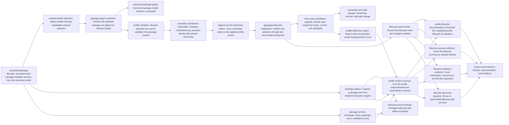

# Plan: Complete profile lifecycle, composition, and upgrades (c639cfb5)

> Planning node: 33f76b11. Authoritative graph: [breakdown.json](breakdown.json).

## Outcome and criterion approach

The v1.0 profile surface is apply-only, and that boundary makes an applied profile
write-once: an in-place edit to profile-owned content is reported as drift, the
owning package cannot be re-applied once its record exists, and the record is
verified against the package, so no sanctioned sequence returns the repository to a
valid state. This container removes that trap and completes the lifecycle around
it — composition, ownership, variables, reconfiguration, upgrade, authoring, and
offline exchange.

The prerequisite is delivered. `cdc840ad` landed the shared materialization
planner, the captured repository image, the shared mutation session, and the
recoverable publisher, and profile application already runs through them
([investigation](investigation.md)). Planning treats those as facts.

| Criterion | Approach | Evidence / open gap |
|---|---|---|
| REQ-01 | One repeatable ordered selector names a profile id or a worktree package directory; the single-id argument and its separate location flag are removed rather than aliased. | Selection is one id plus `--from` today: `crates/jit/src/cli.rs:2926-2969`. |
| REQ-02 | The declared graph gains incompatibilities and a compatible-engine range on top of the dependency closure that already resolves, and resolution evaluates the selection together with the unselected applied profiles. | Closures already resolve: `crates/jit/src/commands/profile.rs:241-377`. |
| REQ-03 | Conflicts are decided per contribution identity by comparing resolved definitions, and equal definitions record sorted shared owners. This also ends the self-collision, which comes from resolving occupancy per file without excluding the candidate. | `crates/jit/src/repository_state/profile_apply.rs:835-854`, `:865-891`. |
| REQ-04 | Variables are declared in the manifest, resolved by a fixed four-step precedence, and substituted through one bounded reference syntax that only opted-in bodies accept. Package identity stays over unresolved bytes. Resolution lands before composition, because composition compares *resolved* definitions; persisting the resolved values belongs to REQ-05. | No variable surface exists: `crates/jit/src/profile/manifest.rs:71-122`. |
| REQ-05 | The record grows from package-level hashes to per-target and per-identity claims carrying the base each was published from, plus a retained marker for content no package owns. The shipped format is read once and converted in the same transaction. | Current five-field record: `crates/jit/src/repository_state/profile_apply.rs:304-343`. |
| REQ-06 | Three separable pieces: a read-only difference report; one presentation contract unifying envelopes, rehearsal mode, schema, and the bridge inventory once every subcommand exists; and one lifecycle event replacing the per-application record. | Three subcommands wired; `ProfileApplied` still emitted: `crates/jit/src/repository_state/mutation.rs:1170-1193`. |
| REQ-07 | Every target decision compares recorded base, current value, and resolved candidate. Divergence conflicts with all three values named; shared content retains surviving owners; only unchanged, solely-owned, unretained content may be removed. | The write-once wall: `crates/jit/src/repository_state/initialize.rs:566-580`. |
| REQ-08 | A selection is planned once over the whole applied closure and published through one recoverable transaction, replacing the per-package application calls. | Single-package path already transactional; multi-package is not: `crates/jit/src/commands/profile.rs:241-377`. |
| REQ-09 | A version-dispatching decoder accepts both manifest wires with the shipped tree decoding unchanged and its identity hash frozen; the shipped record format is a private conversion input, never an ordinary reader. | Frozen hash domain: `crates/jit/src/profile/package.rs:18-19`, `:788-854`. |
| REQ-10 | The canonical profile reference is rewritten to state the shipped lifecycle, and the section declaring these capabilities absent is deleted; neighbouring pages link rather than restate. | The absent-capability list is `docs/reference/profiles.md:249-267`. |
| REQ-11 | Two evidence terminals with different failure modes: journeys an adopter walks (selection, resolution, ownership, variables, capture, exchange), and resilience properties only injection demonstrates (interrupted publication, retry convergence, concurrency, Git-free). Both land in existing suites. | Budget allows at most one new integration target: `scripts/rust-build-budget.sh:31-37`, currently 11 of 12. |
| REQ-12 | Structural checks fail if a second decoder, model, record reader, superseded argument, per-package entry point, prior event constructor, or secret vocabulary reappears. | The mechanism already exists: `crates/jit/tests/provenance_contract/repository_state_cutover_tests.rs:68-93`. |
| REQ-13 | The repository-local assembler becomes a supported operation: parameterized by repository and package id, present in an ordinary binary, and screening symlinks, escapes, and undeclared executable content. Its refresh semantics already match the criterion. | Built and proven but test-gated and hardcoded: `crates/jit/src/profile/package_assembly.rs:40-46`, `crates/jit/src/profile/mod.rs:12-18`. Symlink refusal absent: `:211-216`. |
| REQ-14 | Pack writes one archive carrying package id, version, and the existing package-identity digest; add recomputes that identity from extracted content and refuses a mismatch, an escaping entry, or an unexpected mode. | `tar` is already a non-dev dependency (`crates/jit/Cargo.toml:48-53`) and the digest already exists (`crates/jit/src/profile/package.rs:788-854`); extraction and verification are absent. |

## Shared architectural contracts

### `package-model` [implementation-produced] — Canonical package model

One in-memory package: identity, version, compatible-engine range, dependency
requirements, incompatibilities, variable declarations, assets, regions, and
contributions. Both manifest wires decode into it and nothing else reads a wire
directly. The manifest type stops doubling as the runtime model
(`crates/jit/src/profile/manifest.rs:71-122`), and the frozen identity hash keeps
consuming the exact source bytes (`crates/jit/src/profile/package.rs:788-854`).

### `profile-selector` [implementation-produced] — Ordered profile selection

One ordered, repeatable selection naming either a recorded profile id or a
worktree package directory, carried unchanged through command line, request,
result, generated schema, and bridge inventory. Occurrence order is preserved and
never decides a conflict.

### `package-graph` [implementation-produced] — Resolved package graph

The deterministic resolution of a selection together with every already-applied
profile: dependency closure, declared incompatibilities, and compatible-engine
ranges, with unselected applied profiles participating in every decision. Failures
are raised before anything is written.

### `ownership-composition` [implementation-produced] — Contribution ownership

Composition keyed by canonical contribution identity. Structurally equal resolved
definitions compose and record sorted owners; differing definitions conflict with
no order-based winner. Ownership is per identity, not per file, which is what ends
a package colliding with its own prior record
(`crates/jit/src/repository_state/profile_apply.rs:865-891`).

### `applied-record` [implementation-produced] — Applied profile record

The sole current record: origin, profile version, compatible-engine range, package
identity, resolved non-secret inputs, and sorted per-target and per-identity
ownership claims, each carrying the base fingerprint it was published from, plus a
retained marker for content no package owns. Records are provenance; declared
registries stay the configuration authority.

### `aggregate-plan` [implementation-produced] — Aggregate lifecycle plan

One plan covering a whole selection and the surviving applied closure, published
through the delivered `materialization-transaction`. Replaces the per-package
application calls, so a multi-package operation is all-or-nothing.

### `variable-model` [implementation-produced] — Non-secret variables

Declarations of name, optional default, and optional environment-variable name;
resolution by default, then values file, then declared environment variable, then
repeated command-line assignment; one bounded reference syntax that only opted-in
bodies accept. Every value is explicitly non-secret and persistable, because
deterministic reconfiguration requires the resolved values. Resolution returns
those values; `applied-record` is what stores them. Because composition compares
resolved definitions, this contract is settled before `ownership-composition`.

### `three-way-decision` [implementation-produced] — Base, current, candidate

The per-target decision function over recorded base, current repository value, and
resolved candidate, yielding update, conflict, retain, or remove. Removal is
confined to content that is unchanged, solely owned, and unretained.

### `capture-tree` [implementation-produced] — Package capture

Publication of a package tree from the repository targets a manifest declares:
whole-tree republication so an undeclared source cannot survive, refusal of
symlinks, worktree escapes, and undeclared executable content, and a published
tree that decodes as a package.

### `package-archive` [implementation-produced] — Portable package archive

One archive carrying package id, version, and the package-identity digest, over
the `tar` dependency already present (`crates/jit/Cargo.toml:48-53`). Adding
recomputes identity from extracted content and refuses a mismatch, an absolute or
traversing entry, a symlink, or an unexpected mode.

### `materialization-transaction` [plan-fixed] — Shared recoverable publication

The delivered `cdc840ad` primitive: one final repository image, one deterministic
delta, one recoverable publication through the shared mutation session
(`crates/jit/src/commands/profile.rs:394-438`, `:504-545`,
`crates/jit/src/storage/repository_state_store.rs:502-545`). Lifecycle work
consumes it and introduces no second publication path.

### `worktree-confinement` [plan-fixed] — Packages live in the worktree

A package directory must classify as worktree content, which excludes the separate
data root and anything outside the repository
(`crates/jit/src/commands/profile.rs:760-785`,
`crates/jit/src/repository_state/path.rs:487-499`). Capture destinations and
archive placements obey the same rule.

## Generated decomposition overview

<!-- jit:breakdown-overview:begin -->
| Key | Title | Type | Outcome | Contracts | Sources | Footprint | Landing | Depends on |
|---|---|---|---|---|---|---|---|---|
| canonical-package-graph | Canonical package model, selection, and graph | story | One package model, one selection grammar, and one resolved graph back the lifecycle. | — | REQ-01, REQ-02, REQ-09 | — | — | package-graph-resolution |
| ownership-and-safe-change | Ownership, records, and safe change | story | Ownership claims and three-way decisions make a change to an applied profile safe. | — | REQ-03, REQ-04, REQ-05, REQ-07, REQ-08, inv-write-once-trap | — | — | three-way-reconfigure-upgrade |
| authoring-and-exchange | Package authoring and offline exchange | story | A repository becomes a package and a package travels to another repository. | — | REQ-13, REQ-14, d-08-capture, d-09-exchange | — | — | package-capture, package-archive-exchange |
| surface-and-evidence | Surface, documentation, and evidence | story | The lifecycle reaches adopters through one surface with documentation and evidence. | — | REQ-06, REQ-10, REQ-11, REQ-12 | — | — | profile-lifecycle-documentation, lifecycle-journey-evidence, lifecycle-resilience-evidence, lifecycle-structural-absence |
| versioned-package-decoder | Normalize both package manifest versions into one canonical model | task | One strict decoder turns either package manifest wire into the single canonical package model. | — | REQ-09, REQ-02, inv-record-v1-shape | creates 1, touches 3 | package-foundation | — |
| ordered-profile-selection | Select profiles through repeatable ordered selectors | task | Selecting commands take repeatable ordered selectors naming a profile id or a package directory. | package-model, worktree-confinement | REQ-01, d-02-discovery, inv-worktree-confinement | touches 6 | package-foundation | versioned-package-decoder |
| package-graph-resolution | Resolve the selected package set against its declared graph | task | A selection resolves with its dependencies, incompatibilities, and compatible-jit ranges before publication. | package-model, profile-selector | REQ-02, inv-multi-package-separate-calls | creates 1, touches 2 | package-foundation | ordered-profile-selection |
| profile-variables | Resolve declared non-secret variables into package content | task | Declared variables resolve by fixed precedence and substitute through one bounded reference syntax. | package-model, package-graph | REQ-04, d-07-ssot | creates 1, touches 3 | — | package-graph-resolution |
| semantic-contribution-ownership | Compose contributions by semantic identity with shared ownership | task | Equal contribution definitions share sorted owners while differing definitions conflict without an order winner. | package-graph, variable-model | REQ-03, inv-write-once-trap | touches 2 | — | profile-variables |
| applied-record-ownership-claims | Carry ownership claims in the applied profile record | task | The applied record states per-target ownership claims with base fingerprints and reads the shipped format as input. | ownership-composition | REQ-05, REQ-09, inv-record-v1-shape, d-07-ssot | touches 4 | — | semantic-contribution-ownership |
| aggregate-lifecycle-publication | Publish one selection through one recoverable transaction | task | A whole selection reaches the repository through one recoverable transaction over the applied closure. | applied-record, package-graph, materialization-transaction | REQ-08, inv-multi-package-separate-calls | touches 3 | — | applied-record-ownership-claims |
| three-way-reconfigure-upgrade | Decide each target from base, current, and candidate | task | Reconfiguration and upgrade decide each target from its recorded base, current value, and resolved candidate. | applied-record, aggregate-plan, variable-model, ownership-composition | REQ-07, inv-write-once-trap, d-05-removal-deferred | creates 1, touches 2 | — | aggregate-lifecycle-publication |
| package-capture | Capture a package tree from declared repository targets | task | Capture publishes a package tree from the repository targets a manifest declares. | package-model, worktree-confinement, materialization-transaction | REQ-13, d-08-capture, inv-capture-assembler | touches 7 | authoring-surface | versioned-package-decoder |
| package-archive-exchange | Pack a package into a verifiable archive | task | A package packs into one digest-carrying archive that add verifies before placing it in the worktree. | package-model, worktree-confinement | REQ-14, d-09-exchange, inv-archive-deps, inv-worktree-confinement | creates 1, touches 3 | authoring-surface | versioned-package-decoder |
| profile-difference-report | Report what an operation would change before it runs | task | A read-only report states what a selection would change before anything is published. | three-way-decision, applied-record | REQ-06 | creates 1, touches 2 | lifecycle-surface | three-way-reconfigure-upgrade |
| profile-surface-contract | Give the profile subcommands one presentation contract | task | The profile subcommands present themselves through one envelope, rehearsal, and schema contract. | profile-selector, capture-tree, package-archive | REQ-06 | touches 5 | lifecycle-surface | profile-difference-report, package-capture, package-archive-exchange |
| lifecycle-audit-events | Record one lifecycle event per changed mutation | task | A changed mutation appends one lifecycle event naming the operation, per-profile action, and variable sources. | aggregate-plan, variable-model, applied-record | REQ-06 | touches 5 | lifecycle-surface | aggregate-lifecycle-publication |
| profile-lifecycle-documentation | Document the completed profile lifecycle for adopters | task | The canonical profile reference states the lifecycle that now ships and neighbouring pages cite it. | capture-tree, package-archive, three-way-decision | REQ-10, d-02-discovery | touches 8 | — | profile-surface-contract, lifecycle-audit-events |
| lifecycle-journey-evidence | Cover the lifecycle journeys an adopter follows | task | Acceptance coverage walks selection, resolution, ownership, capture, and exchange journeys. | capture-tree, package-archive, three-way-decision | REQ-11, inv-build-budget | touches 3 | — | profile-surface-contract, lifecycle-audit-events |
| lifecycle-resilience-evidence | Cover interruption, concurrency, and Git-free operation | task | Failure injection, concurrent callers, and a Git-free repository exercise the lifecycle. | aggregate-plan, materialization-transaction | REQ-11, inv-build-budget | touches 1 | — | profile-surface-contract, lifecycle-audit-events |
| lifecycle-structural-absence | Prove no superseded lifecycle path survives | task | Mechanical checks reject a duplicate resolver, a compatibility shim, or a surviving predecessor path. | package-model, applied-record, profile-selector | REQ-12, d-07-ssot | touches 1 | — | profile-surface-contract, lifecycle-audit-events |

<!-- jit:breakdown-overview:end -->

## Material risks and owner decisions

| Risk / decision | Resolution and rationale |
|---|---|
| Authoring shape | Chosen **one capture operation over the targets a manifest declares** (D-08). It serves both authoring a package from a configured repository and refreshing one from an in-place edit. Rejected a separate drift-adoption shortcut: it is sugar over capture and would give one outcome two paths. Rejected leaving hand-written manifests as the only route, which is what makes an edited profile unrecoverable today. |
| Exchange shape | Chosen **offline pack into a digest-carrying archive plus a digest-verifying add** (D-09). Rejected fetching from a URL or version-control source: application stays offline under `@/charter/D-8`, and `@/inv/bounded-rust-build-footprint` excludes remote-resolution and TLS infrastructure from the binary. Obtaining the file stays the adopter's own channel. |
| Package-tree publication is atomic but not recoverable | Capture publishes through `renameat2(RENAME_NOREPLACE)` with no fsync or journal, and a failure after retirement drops the retired tree (`crates/jit/src/profile/package_assembly.rs:292-300`). Capture consumes `materialization-transaction` rather than keeping its own publication path, and its criteria require a failed capture to leave the destination as it was. |
| Capture widens a package beyond what its manifest declares | Capture reads only declared targets and infers none from repository state. This is what keeps a package portable rather than a snapshot of one machine. |
| An archive is a trust boundary | Add recomputes identity from extracted content, refuses escaping entries, symlinks, and unexpected modes, and never leaves a partial package. The task carries the security-review gate for that reason. |
| Test topology has almost no headroom | The enforced budget is 12 integration-test targets and the tree is at 11 (`scripts/rust-build-budget.sh:31-37`). Evidence lands in existing suites and its criteria require the budget to keep passing. |
| Ownership records become a shadow configuration database | Records state contribution identity, base fingerprints, and observed owners only; effective behavior keeps loading the declared registries (D-04). |
| Variables are mistaken for a secret channel | Every value is declared non-secret and persistable (D-06). A structural check fails if any surface describes an input as secret or sensitive. |
| Seventeen terminals risk a stranded intermediate state | Each terminal replaces its predecessor in the same change (D-07), and this is a greenfield project with no compatibility obligation, so an intermediate landing may break callers as long as it is green. No terminal introduces a path another terminal is expected to clean up. |
| A capability lands before the surface that presents it | The presentation contract runs after the difference report, capture, and exchange exist, so it standardizes subcommands that are already there rather than reserving shapes for them. Each capability still wires its own subcommand when it lands. |
| General profile removal | Deferred beyond this container (D-05). Upgrade-time deletion stays the narrow three-way action. |

## Investigation sources

- [Investigation](investigation.md) — current-system verification, the write-once
  mechanism, the capture and archive inventories, the exhaustive consumer sweep,
  and the corrections to the pre-`cdc840ad` report.
- [Research](c639cfb5-research.md) — option analysis behind the frozen wire and
  variable decisions.
