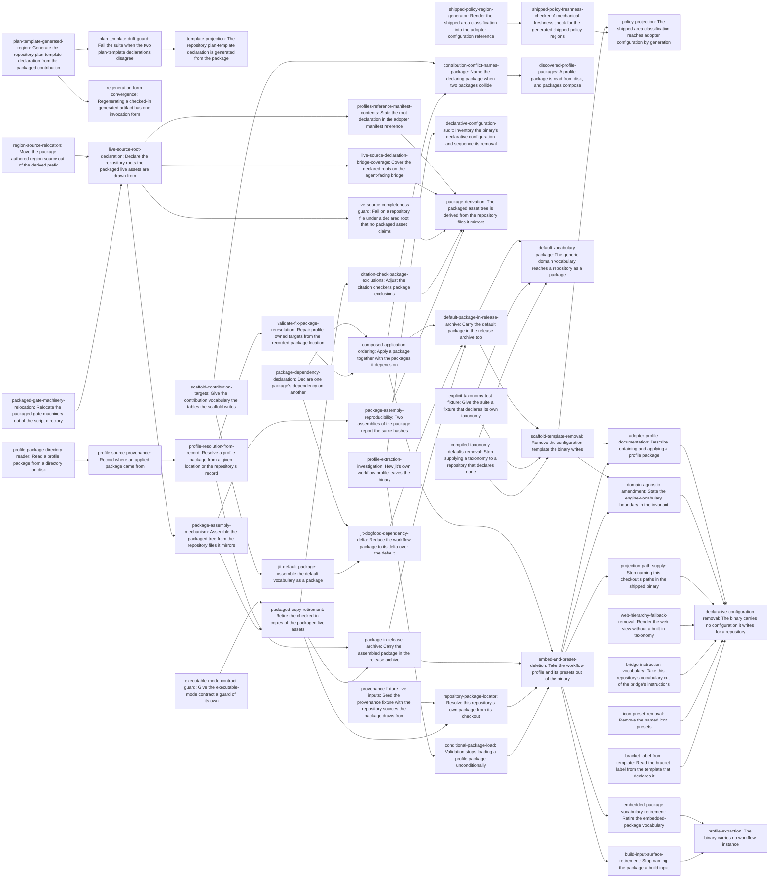

# Plan: Derived profile assets and projected policy documentation (e204e63d)

> Planning node: 7eecace8. Authoritative graph:
> [breakdown.json](e204e63d-breakdown.json).

The binary carries mechanism and no instance of it: every type name, label
namespace, item kind, documentation-area classification, workflow rule, and path
at which the binary writes one of its own projections reaches a repository as
package content or comes from the repository (D-13). Twenty-seven sites were
classified against that boundary and seventeen leave. This container delivers all
of them, plus the second defect they meet.

They meet in one artefact. The workflow package is the largest instance *and* the
largest duplicate: sixty of its files are byte copies of files this repository
also consumes at their working paths, held equal by an assertion that walks one
direction only. Deriving them removes the second copy and turns the package from
something checked in into something assembled — which is what the removal has to
distribute, because configuration the binary no longer carries has to reach a
repository as bytes on disk. Done in either order alone, each leaves a structure
the other removes.

Two packages carry what leaves. A default package holds the domain vocabulary a
repository needs to be usable; the workflow package holds this project's own
workflow and declares a dependency on the default rather than restating it, which
is why composition enters v1.0 (D-14). Both ride in the release archive, so one
download still initializes a repository offline (D-16).

The ordering is forced rather than preferred, and one of its edges fails
silently where the rest fail loudly. Removing the compiled taxonomy defaults
depends on nothing and runs beside the whole reader chain rather than ahead of
it, but it must precede the configuration template's deletion: while they remain,
deleting that template makes every default initialization inherit six namespaces
and four type names from the binary instead — the boundary violated by the change
meant to satisfy it, and the only failure here that is silent rather than loud.
Along the other branch the contribution vocabulary reaches the tables a package
must carry; then packages become resolvable and composable; then each is
assembled and rides in the archive; and only then does anything compiled-in stop
existing, each removal behind the archive entry that makes its subject
obtainable.

## Outcome and criterion approach

| Criterion | Approach | Evidence / open gap |
|---|---|---|
| REQ-01 | The classification reaches both adopter files through the initialization code path — a throwaway repository initialized in a temporary directory, whose scaffolded table is spliced into a marked region in each. Reading the effective configuration is rejected by construction: it reports this repository's local policy plus a key the shipped source does not carry, and the dogfooding boundary forbids it as a source for adopter prose. Freshness is a member of the deterministic documentation-check family. The generator, the two regions and the freshness check are delivered; what the criterion now names as the authority — the default package's `[documentation]` declaration — is reached when the compiled constant goes, by an initialization that applies that package instead of a bare one. The generator's shape, its marked regions, its per-key presence check and its exit-code boundary are all unchanged, so the change is the initialization line and the path it is given (D-15, A6.4). The entry that removes the constant therefore claims this criterion: it is the step at which the documents' source becomes the packaged declaration the restated text names, and the delivered work satisfies every other clause already. | C6, C7, C8, D-15, Q6, S3.5, S7.4, A6.3, A6.4 |
| REQ-02 | Direction first: the packaged contribution is shipped content and the repository declaration is a local consumer, so the package is the authority and the repository copy becomes a generated region. Rendering and guarding are separate terminals, because they are separately true: generation makes the two equal once, and only a comparison keeps them equal afterwards. The guard is what REQ-02 literally asks for — two parsed declarations compared field for field, so it holds even where the generator was bypassed, and it carries no expectation of its own, which would be a third copy. Delivered; the render's source moves to the discovered package with the removal, which is rework of a delivered story rather than new planning (A6.1). | C4, C5, Q4, S3.2, S7.4, A6.1 |
| REQ-03 | Everything separable is separated out ahead of the one step that is not, so the irreversible move is taken against evidence rather than a claim. The package-authored region source moves out of the prefix that marks files mirroring a repository counterpart, because it is the single element making that rule false; the executable-mode check becomes an assertion in its own right while the comparison it shares a loop with is still effective. Then one entry point assembles the tree while the checked-in copies remain, which makes the equality of the two an observable intermediate state, and only then do the copies retire. The assembly runs as a repository entry point over a render inside the crate, not as a build step: nothing compiles the package in any more, so a build step would make every build do work no build consumes and would reintroduce the mtime sensitivity that once relinked every test target. | C1, C3, C10, Q1, Q2, Q3, S3.1, S3.3, S3.4, S8.3, F7 |
| REQ-04 | Read over the produced package, with one term fixed so two entries cannot mean different things by it: *package hash* is the content address the package model computes over the canonical manifest and every declared path, and *provenance* is the per-target digest set beside it. Both are what an applied-profile record carries, so both are what two adopters installing the same published package must agree on. The comparison is between two assemblies into two destinations, never between an assembly and a stored digest, which would be a hand-maintained copy of a derived value. Comparing produced executable bytes is rejected: this workspace has no such property today for unrelated reasons. | D-5, D-7, Q3, S4.5, S8.1, F8 |
| REQ-05 | The manifest gains an additive declaration of the roots its live assets are drawn from, each with glob exclusions, and a walk over those roots reports an undeclared, unexcluded tracked file. Patterns rather than literals is forced by measurement: dozens of files under the declared roots are deliberately unpackaged, and listing them is the hand-maintained inventory the check exists to remove. Its two public consequences are separate terminals rather than clauses inside it, because each lands in a different workspace under a different toolchain. | C2, Q5, D-2, D-6, S3.6, S4.1, S7.1, S7.2 |
| REQ-07 | The removal is decided by an operational test rather than argued, and the audit calibrates it against the rule the decisions already settled: a site is mechanism when its assertion *and* its membership derive from what the adopter declared and it produces nothing when they declared nothing; a site is an instance when it produces content the adopter did not declare. Measured against it, the workflow package, the preset trio, the configuration template, the hierarchy and icon bundles, the taxonomy defaults, the bracket-label literals, and the shipped bridge and web vocabulary all leave, while the registry-derived rules and the mechanism-parameter defaults stay. Nothing an adopter can do is withdrawn — a gate key resolves through the repository's own registry when no preset supplies it — and this repository is unaffected, because its configuration declares everything explicitly and its bracket gates are hand-authored. **The criterion names only a workflow profile and preset, so it understates what lands: after the removal the binary also compiles in no generic scaffold, no named bundle, and no taxonomy default. It is satisfied by the work and is deliberately not restated (A6.2), so a reviewer reading it as the whole of D-13 would under-check; the entries beyond its literal subject cite D-13 rather than claiming it.** | D-10, D-12, D-13, D-17, D-21, D-22, A1, A2.1, A2.2, A2.3, A2.4, A5.3, A6.2 |
| REQ-08 | One carrier for one fact. The bytes are a directory, so the reader is a walk over a model already written for untrusted external data. Where the bytes are is stated in the repository's own applied-profile record: the first application supplies the location explicitly, the record retains it as a worktree-relative path, and every later run reads it back. Confining it to the worktree is what makes the location repository-local rather than machine-local; a configured search path is rejected as a second carrier of the same fact plus a precedence question, and package bytes under the tracker's data root are rejected by owner ruling. The criterion now reaches the dependency too, so resolution is over a package *and* everything it declares a dependency on, applied in declared order with one provenance record each. A package's declared version requirement is parsed and not matched: matching belongs to the deferred lifecycle (D-19). This same resolver is the one populated route into any repository, so the scaffold has no route of its own to keep (D-13). | D-8, D-13, D-14, D-19, F3.1, F3.2, F3.3, A3.1, A3.2.3, A3.2.4, A3.4, A6.2 |
| REQ-09 | What the criterion protects is that no release exists in which the profile is reachable only from a source checkout, so the delivery shape is chosen for the install it produces. The package rides inside the release's native archive beside the binaries (D-16): one download then suffices to initialize offline, no asset is added to the published set, and the existing checksum file covers it because it covers the archive. The binaries stay at the extraction root so the documented install step still holds. It is proven by the release's own smoke path applying the package from the extracted archive rather than naming it with no location, and that retarget lands with the archive change rather than with the removal, so the published bytes are exercised from the moment they exist. The second package directory is a separate entry rather than a widening of this one: the two guard different windows, and each is the hard predecessor of the removal whose subject it makes obtainable. | D-11, D-16, F3.4, F10.1, A7.1, A7.2, A7.3, A7.4 |
| REQ-10 | Repair recomputes the expected record by reading the package again at the location the record names, and reports an unresolvable location as a failure naming the record and the path. The rejected alternative is the one that looks harmless: trusting the stored digests when the package cannot be read converts repair from restoring profile-owned targets into restoring the ones it can still account for. Composition sharpens the diagnosis rather than the mechanism — validation already resolves every recorded id, so a repository missing one package of an applied pair must be told which package declared the one it cannot find. | D-8, F1.2, F7, F10.2, A3.1, A8.4 |

## Shared architectural contracts

### `engine-vocabulary-boundary` [plan-fixed] — What stays in the binary

A site is **mechanism** when its assertion *and* its membership derive from
declarations the adopter supplies, and it produces nothing when the adopter
supplies none. A site is an **instance** when it produces content the adopter did
not declare, whether that content names this project or is generically
opinionated (A1). The reviewer's test per site: remove it, and ask what an
adopter who declared nothing now receives. "Less content they did not ask for"
means it was an instance.

Both clauses are checked separately, because a site can pass the first and fail
the second — a rule can derive its assertion from a declared registry and still
emit a full rule set from a registry the engine substituted. Classifying the rule
would keep the instance; the substitution is the site.

Two classes stay and are named so the rule is not read as deleting them. A
**mechanism-parameter default** is a value the adopter can override through a
declared key, whose only effect when unoverridden is to name one parameter of a
mechanism doing something regardless — the planning role, the breakdown role, the
container anchor (D-12), the level-keyed icons, the coordination timings. And a
**registry-derived rule** derives both its assertion and its membership from the
adopter's own registry and produces nothing without one (D-17); a rule encoding a
sequencing opinion does not, and leaves with the workflow.

The boundary reaches this repository's own paths (D-21): a projection target or a
generator command naming this checkout is not written into any repository, but it
is still compiled into every adopter binary, and every reader of those constants
already sits behind the test-support boundary that excludes this repository's
machinery from an adopter build. The amended invariant carries all of this
explicitly, because a narrower wording would be silent at three of the classes
the boundary names (A6.5) and would delete the mechanism-parameter defaults by
implication.

### `scaffold-minimum` [plan-fixed] — What a bare initialization writes

Afterwards the configuration a bare initialization writes carries only what the
engine derives from the repository rather than from a declaration: the schema
version and the project name slugged from the directory. The empty gate registry,
the event log, the index, and the worktree identity are unchanged. The rule set
reduces to the label grammar alone and the schema set to its one projection,
because the namespace rule is emitted only for a non-empty registry and the
type-hierarchy rule's enumeration comes from that registry (A4.1).

That is reachable only once the compiled taxonomy defaults are gone. Until then a
configuration declaring neither table is silently given six namespaces and four
type names through a fallback branch, and a repository initialized after the
template's removal would take exactly that route (A2.4.1, A5.3).

A repository in the minimum state is usable: validation passes and issues are
created. What it lacks is a type hierarchy, so the queries that resolve tiers
have none — which is what applying a package supplies. There is one populated
route and it is the resolver REQ-08 builds; no separate scaffold code path
survives beside it (D-13), and the type that carried the template, the flag that
selected a preset, and the command that listed them go with it rather than
answering with an empty set.

### `package-content-split` [plan-fixed] — What each package carries

The default package carries the domain vocabulary a repository needs to be
usable: the type hierarchy, the label namespaces, the item kinds, the strategic
types, the validation defaults, and the documentation-area classification. The
workflow package carries this project's own workflow and declares a dependency on
the default (D-14). The dependant declares only its delta; restating shared
vocabulary in both is the hand-maintained duplicate this container exists to
remove, and generating one package from the other would make the generic package
a derivative of one project's workflow.

The split is already disjoint where it matters: the namespaces the two declare do
not overlap, and on types the workflow package declares the default's four plus
four of its own, so it drops the four the default carries (A3.1). Item kinds
split on a rule rather than a preference — no package names a source file it does
not ship, so the kind whose source only the workflow package carries is declared
only there (D-20).

Same key, different content is a hard error at both layers and stays one (A3.3).
A dependant silently overriding its dependency's declarations would take
authority no criterion grants, and validation could not then tell an override
from drift. Identical restatements merge; the errors gain the declaring package's
identity, because before composition the occupant was always the adopter's own
content and the message assumed it.

A composed application is N provenance records, not one: each package writes its
own with its own hashes, which is what repair already reads, and an application
event is appended per package (A3.4). The record does not say *why* a package was
applied, and nothing needs it to until removal enters scope, which the charter
still defers.

### `contribution-target-granularity` [plan-fixed] — How a package reaches a table

The two tables that have no contribution target — the documentation-area
classification and the validation defaults — are reached per key, not per table:
the scalar keys as single values, the list keys as sets (A3.2.1, A3.2.2). One
target carrying a whole table would force any second package wanting one area to
restate all five keys, which is the copy `package-content-split` forbids;
per-key targets let a package declare what it owns and collide only where two
packages declare the same key, which is the rule the existing merge already
applies. The granularity also matches the incumbent: every existing map target is
per entry rather than per table.

### `profile-package-resolution` [plan-fixed] — Where a package's bytes come from

A package is a directory read into owned bytes. The model already treats those
bytes as untrusted external data — count and size bounds, rejected path shapes,
absent declared sources, undeclared package files, content addressing — so a walk
producing a path-to-bytes map is the whole new reader (F3.1), and none of those
defences is relaxed for it.

Where the bytes are is stated once, in the repository's own applied-profile
record at `.jit/profiles/<id>.json`, as a worktree-relative path. The first
application supplies the location explicitly, because a repository being
initialized has no record to read; the record retains it; every later resolution —
validation, repair, inspection, re-application — reads it back. A supplied
location outranks the recorded one, and both outrank a package compiled into the
binary, which exists only until the cutover removes it. Confinement to the
worktree is the contract: a location outside it makes derived-state repair depend
on machine state (F3.3). An unresolvable recorded location is a loud failure
naming the record and the path, never a replay of the stored digests (D-8,
F10.2).

Enumeration follows from the same place: a repository reports the profiles its
own records name. There is no configured search path and no precedence order
beyond the two routes above — a configuration key naming the location would be a
second carrier of one fact — and no package bytes are written under the tracker's
data root, which the reserved-target guard already refuses.

Resolution reaches dependencies by the same routes. A declared dependency is
resolved and applied before the package declaring it, in a topological order with
cycles rejected before anything is written; a dependency that cannot be resolved
fails the application naming both the package that declared it and the one that
could not be found (A3.2.4, A8.4). This resolver is also the one populated route
into a repository: a bare initialization writes the structural minimum and a
populated one names a package and a location and goes through exactly this path
(D-13).

### `package-assembly-publication` [plan-fixed] — How the packaged tree is produced

The assembly is a repository entry point over a render inside the crate's
test-support surface. It is not a build step: nothing compiles the package in, so
a build step would make every build do work no build consumes, and the directory
watching it would need is the mechanism that once relinked every test target on
an unchanged rebuild (Q2, S7.3, F7). It is not a member of the committed-artifact
family either, because its output is deliberately not committed; it shares that
family's shape — a render in the crate, a script entry point, the same render
read by whatever asserts about it — and differs in having a destination its
caller names, because its consumer is a release job staging its own directory.

Two properties follow from being a script rather than a build step. The manifest
has exactly one reader, the crate's own package model, where a build script could
only have been a second one, since a build script cannot import the crate it
builds; tree-to-manifest correspondence therefore stays with the model that
rejects a declared source that is absent and a package file no declaration claims
(S6). And each run publishes a freshly staged tree rather than updating one in
place, so the output holds exactly what the manifest declares and a source the
manifest stops declaring cannot linger into the next run (Q3, S8.3).

Only the workflow package is assembled; the default package declares content and
carries no asset, so it is complete as checked in.

### `distribution-artefact-and-release` [plan-fixed] — The published form

A package's on-disk form is a directory, and its published form is that same
directory inside the release's native archive beside the binaries and the license
texts (D-16). One download therefore initializes a repository offline, which is
the property the profile reference promises and the reason the published form is
decided here at all. Nothing is added to the published asset set, the existing
checksum file covers the packages because it covers the archive, and the released
output stays one release with the asset list `@/charter/D-16` fixes (A7.3). The
binaries stay at the extraction root so the documented install step holds, and
the packages sit under a directory named the way this repository names them, so
one path form means a package everywhere. Naming that directory differently in
the archive was rejected: two spellings of one concept is the convergence defect
this container removes elsewhere.

The archive carries every package directory this project ships, and the
mechanism is one staging step and one member list regardless of the count — so
the first directory establishes it and the second joins it. Each directory is
published by its own step and each is the hard predecessor of exactly one
removal: the workflow package's precedes the compiled-in copy's deletion, and the
default package's precedes the configuration template's, because each removal is
what makes its subject unobtainable otherwise (D-11, A8.1). Publication is proven
by the release's own smoke path applying from the extracted archive rather than
naming a profile with no location, and once both directories are present that
path also observes the default package applied as a resolved dependency (A7.2).
The one adopter-facing promise the change breaks is the statement that the
archive is flat and carries four files (A7.4).

### `live-source-declaration` [implementation-produced] — The declared roots and their exclusions

The manifest carries one entry per repository root the packaged live assets are
drawn from, each with its own glob exclusion patterns, as an additive change to a
wire shape that rejects unknown keys and is public through the package's
machine-readable inspection output and the agent-facing bridge over it (S3.6).
Roots and patterns are constrained token types rejected where the manifest is
parsed, not free strings interpreted by each consumer. The declaration exists
because the completeness walk needs a domain it cannot derive — sixty asset paths
imply the roots without stating them — and because a package that draws from a
repository should say what it draws from where an adopter can read it. The
managed-region source and every install-only asset *source* fall outside every
root, so a root never claims a package-authored file.

### `completeness-walk-rule` [plan-fixed] — What the omission check asks and of what

The walk enumerates the repository-tracked files beneath each declared root and
reports one that is neither a declared packaged asset nor matched by a declared
exclusion. Tracked rather than present, so a contributor's scratch file is not a
packaging defect. The workspace's established repository-inventory idiom lists
untracked non-ignored paths alongside tracked ones, which is the opposite
property, so an implementer must take the tracked-only listing rather than copy
that idiom's flag set. A run that cannot obtain the listing fails rather than
passing on an empty set, which is the vacuity this route otherwise risks (Q5).
Exclusions are globs describing categories rather than individual files, so
material of the same shape needs no new entry. A root whose unpackaged material
is not category-shaped is not a root: it is relocated until packaging is the rule
there, which is why the script directory is no longer one.

### `generated-region-splice` [plan-fixed] — How a generated region replaces authored text

A generated region is bounded by markers written in the target file's own comment
syntax, and everything outside the markers is preserved byte for byte —
authored prose, comments, and unrelated tables alike. Commentary that must
survive lives outside the markers; nothing inside them is authored. The
repository's byte-preserving managed-document renderer takes arbitrary
delimiters and is format-agnostic, so it serves the template region directly
(Q4). The documentation regions are spliced in shell by their own generator, for
a reason of reach rather than of cost: that splicer is a library function with no
command-line entry point, neither region is expressible as a configured
projection (Q4, S5), and D-4 rejects adding a command. Both regions use the same
marker shape, and every such artifact is regenerated through the one entry-point
form this repository declares for them.

### `shipped-policy-authority` [plan-fixed] — Where the adopter documentation values come from

The three area lists reach both adopter documents only through what repository
initialization writes into a throwaway directory. The effective-configuration
report is not a source: it carries a key the shipped constant does not have and
its values come from this repository's own table, which agrees today by a
hand-maintained claim rather than by binding (C7). This repository's own
configuration is not a source either, for the reason the dogfooding boundary
gives. A new command printing the shipped policy is rejected as adopter-visible
surface whose only consumer is this repository's documentation pipeline (S3.5).

The authority the route reaches is a shipped declaration, not a particular
storage of it. It is a compiled constant while the binary carries one, and the
default package's own `[documentation]` declaration once it does not (D-15); in
both cases initialization writes it into the throwaway repository and the
generator reads what was written there, so the marked regions, the per-key
presence check and the freshness check survive unchanged and only the
initialization line differs (A6.4).

One property changes with that move and is chosen rather than discovered. The
generator's build-provenance refusal exists because reading through the installed
binary makes the values the classification compiled into the binary in use; once
they come from a package directory in this checkout, the binary's currency stops
being what makes the read correct. The guard stays and costs nothing; relying on
it for a property it no longer supplies would be a defect.

The authority is the initialization code path *as built into the binary in use*,
so the check has to be positive rather than an absence of complaint: the
stale-binary refusal identifies a repository by resolving a revision in it, and a
throwaway directory has none, so an unknown build commit, an unresolvable head,
and a commit outside the repository's history all resolve to the same
not-applicable outcome as a current binary. Both the generator and the checker
establish the condition themselves and fail closed on anything short of a
resolved, current provenance.

## Generated decomposition overview

<!-- jit:breakdown-overview:begin -->
| Key | Title | Type | Outcome | Contracts | Sources | Footprint | Landing | Depends on |
|---|---|---|---|---|---|---|---|---|
| shipped-policy-region-generator | Render the shipped area classification into the adopter configuration reference | task | The two adopter configuration files carry the shipped area classification as a generated region rather than authored prose. | generated-region-splice, shipped-policy-authority | issue:67da1d70, REQ-01, D-3, D-4, C6, C7, C8, S3.5, S4.3, S4.4, S7.4 | creates 1, touches 2 | policy-docs | — |
| shipped-policy-freshness-checker | A mechanical freshness check for the generated shipped-policy regions | task | A stale generated policy region in either adopter configuration file fails the mechanical documentation checks. | shipped-policy-authority | issue:f77fd51b, REQ-01, D-4, C8, Q6, S4.4, S7.2 | creates 1, touches 4 | policy-docs | shipped-policy-region-generator |
| plan-template-generated-region | Generate the repository plan-template declaration from the packaged contribution | task | The repository plan-template block is a region rendered from the packaged declaration. | generated-region-splice | issue:e1a18372, REQ-02, D-1, C4, C5, Q4, S3.2, S7.4, S8.6 | touches 2 | template-region | — |
| plan-template-drift-guard | Fail the suite when the two plan-template declarations disagree | task | A difference between the parsed repository declaration and the parsed packaged declaration fails the suite. | — | issue:097b9f48, REQ-02, D-1, C4, C5 | touches 1 | template-region | plan-template-generated-region |
| template-projection | The repository plan-template declaration is generated from the package | story | The repository plan-template declaration is generated from its packaged authority, with divergence failing the suite. | generated-region-splice | issue:25bdda50, REQ-02, D-1, C4, C5, Q4, S3.2, S7.4, S8.6 | — | — | plan-template-drift-guard |
| provenance-fixture-live-inputs | Seed the provenance fixture with the repository sources the package draws from | task | The provenance fixture repository carries the packaged live sources, so a cold build inside it succeeds. | — | issue:c7a548c3, REQ-03, Q10, S5 | touches 1 | package-cutover | — |
| executable-mode-contract-guard | Give the executable-mode contract a guard of its own | task | A standalone assertion checks each declared live asset's executable flag against its repository file's mode. | — | issue:9943c488, REQ-03, C1, Q1 | touches 1 | package-assembly | — |
| policy-projection | The shipped area classification reaches adopter configuration by generation | story | Both adopter configuration files carry the shipped classification as a generated region, with staleness reported mechanically. | shipped-policy-authority, generated-region-splice | issue:6f8f02ba, REQ-01, D-3, D-4, D-15, C6, C7, C8, Q6, S3.5, S7.2, S7.4, A6.3, A6.4 | — | — | shipped-policy-freshness-checker, scaffold-template-removal |
| profile-extraction-investigation | How jit's own workflow profile leaves the binary | task | One report establishes the mechanism, the ordering, and the consequences of taking the profile out of the binary. | — | issue:a62d444d, F1.1, F2.1, F5.3, F8, F10.1 | creates 1 | — | — |
| conditional-package-load | Validation stops loading a profile package unconditionally | task | Validation resolves a profile package only where the repository's own record names one. | profile-package-resolution | issue:229e7389, F1.2, F5.2, F7 | touches 1 | — | profile-extraction-investigation |
| packaged-gate-machinery-relocation | Relocate the packaged gate machinery out of the script directory | task | Each declared live-source root is a directory where packaging is the rule rather than the exception. | completeness-walk-rule | issue:9d451c98, REQ-05, D-6, C2, Q5 | touches 3 | package-assembly | — |
| regeneration-form-convergence | Regenerating a checked-in generated artifact has one invocation form | task | A generated artifact committed to this checkout is regenerated through one invocation form. | generated-region-splice | issue:65ff0f38, REQ-02, S7.4 | touches 3 | — | plan-template-generated-region |
| declarative-configuration-audit | Inventory the binary's declarative configuration and sequence its removal | task | Each site in the binary carrying declarative configuration is classified against the boundary and its removal sequenced. | engine-vocabulary-boundary | issue:7cbefe7c, D-13, D-18, A2.6, A5.2, F5.3 | creates 1 | — | profile-extraction-investigation |
| region-source-relocation | Move the package-authored region source out of the derived prefix | task | The managed-region source sits outside the prefix reserved for files drawn from repository counterparts. | package-assembly-publication | issue:3e340587, REQ-03, C1, Q1, S3.2, F1.1 | creates 1, touches 2 | package-assembly | — |
| live-source-root-declaration | Declare the repository roots the packaged live assets are drawn from | task | The package manifest declares each live-source root with the exclusion patterns that bound it. | completeness-walk-rule | issue:39c34568, REQ-05, D-2, D-6, C1, C2, Q5, S3.6, S7.1 | touches 5 | package-assembly | packaged-gate-machinery-relocation, region-source-relocation |
| package-assembly-mechanism | Assemble the packaged tree from the repository files it mirrors | task | One entry point produces a complete package tree from the checked-in package sources and the repository's live files. | live-source-declaration, package-assembly-publication | issue:7d038e97, REQ-03, D-2, C3, C10, Q1, Q2, Q3, S3.1, S3.4, S8.3, F3.4, F7 | creates 2, touches 3 | package-assembly | live-source-root-declaration |
| package-assembly-reproducibility | Two assemblies of the package report the same hashes | task | Two assemblies from identical sources report the same package hash and the same target digests. | package-assembly-publication | issue:ebbb254f, REQ-04, D-5, D-7, Q3, S4.5, S8.1, F8 | touches 1 | derivation-coverage | package-assembly-mechanism |
| packaged-copy-retirement | Retire the checked-in copies of the packaged live assets | task | The packaged live assets exist once in the repository, at their working paths. | package-assembly-publication | issue:d94f6849, REQ-03, C1, C3, Q1, S3.1, S3.3, F8 | touches 2 | package-cutover | package-assembly-mechanism, executable-mode-contract-guard |
| citation-check-package-exclusions | Adjust the citation checker's package exclusions | task | The citation checker's package exclusions describe the package directory that remains. | — | issue:26f503cc, REQ-03, S4.1, S8.5 | touches 1 | package-cutover | packaged-copy-retirement |
| live-source-completeness-guard | Fail on a repository file under a declared root that no packaged asset claims | task | An undeclared, unexcluded file under a declared live-source root fails the suite. | live-source-declaration, completeness-walk-rule | issue:0cf1f351, REQ-05, D-6, C2, Q5, S7.1 | creates 1, touches 2 | package-assembly | live-source-root-declaration |
| live-source-declaration-bridge-coverage | Cover the declared roots on the agent-facing bridge | task | The bridge's coverage observes the root declaration in the manifest it reports. | live-source-declaration | issue:4873b32f, REQ-05, S3.6, S4.1 | touches 1 | package-assembly | live-source-root-declaration |
| profiles-reference-manifest-contents | State the root declaration in the adopter manifest reference | task | The adopter reference describing what the manifest carries accounts for the declared roots. | live-source-declaration | issue:0db28190, REQ-05, S4.1, S7.2 | touches 1 | package-assembly | live-source-root-declaration |
| package-derivation | The packaged asset tree is derived from the repository files it mirrors | story | The packaged tree is assembled from the repository files it mirrors, reproducibly, with omission reported. | live-source-declaration, package-assembly-publication, completeness-walk-rule | issue:cc75b4e6, REQ-03, REQ-04, REQ-05, D-2, D-5, D-6, D-7, C1, C2, C3, C10, Q1, Q2, Q3, Q5, S3.1, S3.2, S3.3, S3.4, S4.1, S4.5, S7.1, S8.1, S8.3, F3.4, F7, F8 | — | — | package-assembly-reproducibility, citation-check-package-exclusions, live-source-completeness-guard, live-source-declaration-bridge-coverage, profiles-reference-manifest-contents |
| profile-package-directory-reader | Read a profile package from a directory on disk | task | A profile package is constructed from a directory tree, owning its bytes rather than borrowing compiled-in ones. | profile-package-resolution | issue:09aea8b3, REQ-08, F3.1, F3.2, F3.4 | touches 1 | package-discovery | — |
| profile-source-provenance | Record where an applied package came from | task | The applied-profile record carries the worktree-relative location the package was read from, and its origin. | profile-package-resolution | issue:6c47b99a, REQ-08, D-8, F1.2, F3.1, F3.2, F10.2 | touches 3 | package-discovery | profile-package-directory-reader |
| profile-resolution-from-record | Resolve a profile package from a given location or the repository's record | task | The profile commands read a package from a given location or from the location the repository's record names. | profile-package-resolution | issue:5d12a79f, REQ-08, D-8, F1.2, F2.2, F3.2, F3.3, F4.2 | touches 4 | package-discovery | profile-source-provenance |
| validate-fix-package-reresolution | Repair profile-owned targets from the recorded package location | task | Repair recomputes a recorded profile's expected targets by re-reading its package from the recorded location. | profile-package-resolution | issue:8371bd46, REQ-10, D-8, F1.2, F7, F10.2 | touches 2 | package-discovery | profile-resolution-from-record |
| package-dependency-declaration | Declare one package's dependency on another | task | A package manifest declares the package ids it depends on, and the published schema carries the declaration. | profile-package-resolution, package-content-split | issue:5dd0df5b, REQ-08, D-14, A3.2.3 | touches 2 | package-discovery | — |
| scaffold-contribution-targets | Give the contribution vocabulary the tables the scaffold writes | task | A package contributes the documentation-area keys and the validation defaults, one key at a time. | contribution-target-granularity, package-content-split | issue:4c40e165, REQ-08, D-13, A3.2.1, A3.2.2, A3.3 | touches 2 | package-discovery | — |
| composed-application-ordering | Apply a package together with the packages it depends on | task | Applying a package applies the packages it depends on first, each with its own record and event. | profile-package-resolution, package-content-split | issue:7835fdc0, REQ-08, D-14, A3.1, A3.2.4, A3.4, A8.4 | touches 2 | package-discovery | validate-fix-package-reresolution, package-dependency-declaration |
| contribution-conflict-names-package | Name the declaring package when two packages collide | task | A conflict between two packages' declarations names both packages. | package-content-split | issue:d54f8f83, D-14, A3.3 | touches 2 | package-discovery | composed-application-ordering, scaffold-contribution-targets |
| discovered-profile-packages | A profile package is read from disk, and packages compose | story | The engine reads, applies, composes, and repairs profile packages that live in repository directories. | profile-package-resolution, package-content-split, contribution-target-granularity | issue:1c0eb82e, REQ-08, REQ-10, D-8, D-14, D-19, F1.2, F3.1, F3.2, F3.3, F10.2, A3.1, A3.2.3, A3.2.4, A3.3, A3.4 | — | — | contribution-conflict-names-package |
| compiled-taxonomy-defaults-removal | Stop supplying a taxonomy to a repository that declares none | task | A repository declaring no namespaces and no type hierarchy receives neither. | engine-vocabulary-boundary, scaffold-minimum | issue:a30d704d, D-13, D-17, A2.2, A2.4.1, A5.3, A5.4 | touches 3 | taxonomy-defaults | — |
| explicit-taxonomy-test-fixture | Give the suite a fixture that declares its own taxonomy | task | Tests asserting on type names build their repository from a fixture that declares the taxonomy. | scaffold-minimum | issue:ae435979, D-13, A4.3, A8.2 | touches 6, uncertain | taxonomy-defaults | — |
| jit-default-package | Assemble the default vocabulary as a package | task | A package directory declares the generic domain vocabulary a repository needs to be usable. | package-content-split, contribution-target-granularity | issue:c7058cac, REQ-08, D-13, D-14, D-20, A2.2, A3.1, A4.2 | creates 1, touches 1 | package-content | scaffold-contribution-targets |
| jit-dogfood-dependency-delta | Reduce the workflow package to its delta over the default | task | The workflow package depends on the default package and declares only what it adds. | package-content-split | issue:e4ba28c5, REQ-08, D-14, D-17, D-20, A2.2, A3.1, A8.5 | touches 4 | package-content | jit-default-package, package-dependency-declaration |
| package-in-release-archive | Carry the assembled package in the release archive | task | The release archive carries the assembled workflow package, and the smoke path applies it from there. | distribution-artefact-and-release, package-assembly-publication | issue:9de22aa7, REQ-09, D-11, D-16, F3.4, F10.1, A7.1, A7.2, A7.4 | touches 4 | package-content | packaged-copy-retirement, profile-resolution-from-record |
| default-package-in-release-archive | Carry the default package in the release archive too | task | The release archive carries the default package too, and the smoke path observes it as a resolved dependency. | distribution-artefact-and-release, package-content-split | issue:6013cd81, REQ-08, D-14, D-16, A7.2, A8.1 | touches 3 | package-content | package-in-release-archive, jit-dogfood-dependency-delta, composed-application-ordering |
| default-vocabulary-package | The generic domain vocabulary reaches a repository as a package | story | The generic vocabulary is package content, and a repository that declares none receives none. | engine-vocabulary-boundary, package-content-split, scaffold-minimum, distribution-artefact-and-release | issue:93fef456, REQ-08, REQ-09, D-13, D-14, D-16, D-17, D-20, A2.2, A2.4.1, A3.1, A4.1, A5.3, A7.2, A8.1, A8.2 | — | — | compiled-taxonomy-defaults-removal, explicit-taxonomy-test-fixture, default-package-in-release-archive |
| repository-package-locator | Resolve this repository's own package from its checkout | task | This repository's tests read its profile package from the assembly rather than from the compiled-in copy. | package-assembly-publication, profile-package-resolution | issue:959274b6, F1.2, F8, Q10, S5 | touches 6 | extraction-preparation | packaged-copy-retirement, provenance-fixture-live-inputs |
| embed-and-preset-deletion | Take the workflow profile and its presets out of the binary | task | The binary compiles in no profile package and no workflow preset, and the generated preset reference matches what remains. | engine-vocabulary-boundary, profile-package-resolution, distribution-artefact-and-release | issue:ff1bbada, REQ-07, D-10, D-13, F2.1, F2.2, F4.1, F5.1, F5.2, F5.3, A2.1, A5.3, A5.4, A6.1 | touches 10 | extraction-cutover | conditional-package-load, repository-package-locator, package-in-release-archive, composed-application-ordering |
| scaffold-template-removal | Remove the configuration template the binary writes | task | A bare initialization writes the structural minimum, and the policy generator reads the default package. | engine-vocabulary-boundary, scaffold-minimum, shipped-policy-authority | issue:daddfc0b, REQ-01, D-13, D-15, A2.2, A4.1, A4.2, A4.3, A5.3, A5.4, A6.3, A6.4, A8.3 | touches 7 | extraction-cutover | compiled-taxonomy-defaults-removal, explicit-taxonomy-test-fixture, default-package-in-release-archive |
| bracket-label-from-template | Read the bracket label from the template that declares it | task | The bracket label is derived from the template's declared breakdown node rather than from a literal. | engine-vocabulary-boundary | issue:510297e4, D-13, A2.3 | touches 2 | literal-removal | — |
| icon-preset-removal | Remove the named icon presets | task | The named icon bundles are gone, and per-type declarations express what they expressed. | engine-vocabulary-boundary | issue:0439da41, D-22, A2.2, A2.4 | touches 2 | literal-removal | — |
| bridge-instruction-vocabulary | Take this repository's vocabulary out of the bridge's instructions | task | The bridge's shipped instructions and tool descriptions name no repository's own vocabulary. | engine-vocabulary-boundary | issue:fdae1023, D-13, A2.3 | touches 2 | literal-removal | — |
| web-hierarchy-fallback-removal | Render the web view without a built-in taxonomy | task | The web bundle renders from the configuration the API serves rather than from a built-in taxonomy. | engine-vocabulary-boundary | issue:9bdf8025, D-13, A2.3 | touches 2 | literal-removal | — |
| projection-path-supply | Stop naming this checkout's paths in the shipped binary | task | No projection target or generator command naming this checkout is reachable from an adopter build. | engine-vocabulary-boundary | issue:f6c23c09, D-21, A2.5.4 | touches 7 | extraction-cutover | embed-and-preset-deletion |
| domain-agnostic-amendment | State the engine-vocabulary boundary in the invariant | task | The project invariant carries no sanctioned workflow exception and says which names are mechanism vocabulary. | engine-vocabulary-boundary | issue:aa258222, REQ-07, D-12, D-13, D-17, D-21, F2.3, F6.1, F6.2, F6.3, A1, A5.4, A6.5 | touches 4 | extraction-cutover | embed-and-preset-deletion, scaffold-template-removal |
| build-input-surface-retirement | Stop naming the package a build input | task | Editing a packaged live source no longer reports an installed binary as stale. | — | issue:6fef2d7c, REQ-07, C9, S4.4, S6, F7 | touches 1 | extraction-cutover | embed-and-preset-deletion |
| embedded-package-vocabulary-retirement | Retire the embedded-package vocabulary | task | The package type, its commands, and their help name a profile package rather than an embedded one. | profile-package-resolution | issue:d913a510, F3.2, F3.3 | touches 6, uncertain | extraction-cutover | embed-and-preset-deletion |
| adopter-profile-documentation | Describe obtaining and applying a profile package | task | The adopter documentation describes a profile that arrives as a published package and is applied from a repository location. | distribution-artefact-and-release, profile-package-resolution | issue:8d534ee7, REQ-08, D-13, F3.3, F4.2, F10.1, A4.4, A8.3 | touches 5 | extraction-cutover | embed-and-preset-deletion, scaffold-template-removal |
| profile-extraction | The binary carries no workflow instance | story | The workflow profile and its presets have left the binary, riding in the release archive instead. | engine-vocabulary-boundary, distribution-artefact-and-release, profile-package-resolution | issue:6df7e456, REQ-07, REQ-09, D-10, D-11, F2.1, F5.1, F5.2, F5.3, A2.1, A5.4, A6.1 | — | — | build-input-surface-retirement, embedded-package-vocabulary-retirement |
| declarative-configuration-removal | The binary carries no configuration it writes for a repository | story | Every configuration the binary wrote, every named bundle, and every vocabulary literal has left it. | engine-vocabulary-boundary, scaffold-minimum | issue:7af6eb3d, REQ-07, REQ-08, D-13, D-21, D-22, A2.2, A2.3, A2.5.4, A4.1, A5.3, A5.4, A6.5, A8.3, A8.5 | — | — | bracket-label-from-template, icon-preset-removal, bridge-instruction-vocabulary, web-hierarchy-fallback-removal, projection-path-supply, domain-agnostic-amendment, adopter-profile-documentation |

<!-- jit:breakdown-overview:end -->

## Material risks and owner decisions

| Risk / decision | Resolution and rationale |
|---|---|
| **D-1 — the template pair's direction** | Chosen: the packaged contribution is the authority and the repository declaration becomes a generated region, with the suite comparing the two parsed declarations. Rejected: synchronizing the three divergent description strings and guarding deep equality of two hand-edited copies, which leaves both hand-maintained; guarding structure alone and letting descriptions diverge, which leaves REQ-02 unmet by construction. The resulting asymmetry with REQ-03 is deliberate: the package is the authority for the template declaration, because that declaration is shipped content the repository consumes, and the repository is the authority for the file assets, because those files are what contributors edit. REQ-02 reaches only the repository's own registry; two adopter-facing example rulesets declare their own plan template and are outside it (S8.6). |
| **D-2 — the packaged inventory's shape** | Chosen: keep the explicit per-file asset declaration and add a declared root-and-exclusion list that turns omission into a failure. Rejected: include and exclude globs replacing the inventory, because a missed exclusion over-packages an adopter install, which is worse than the omission it prevents. |
| **D-3 — how much of the example file becomes generated** | Chosen: only its area-classification table, with the present illustrative subset giving way to the table a fresh repository receives; the rest stays hand-authored. Rejected: replacing the whole file with the initialization scaffold, which would add and remove unrelated tables for reasons this work does not decide. |
| **D-4 — how the shipped policy is read** | Chosen: a repository-local generator that initializes a throwaway repository and reads the table the shipped path wrote there, with a mechanical freshness check. Rejected: a new command printing the shipped policy, which adds adopter-visible surface for one internal consumer; a projection over a new item kind, which would need a source mode for a compiled constant that no declared kind has. |
| **D-5 / D-7 — what REQ-04 observes** | Chosen: the produced package's content address and per-target digests, compared across two assemblies. REQ-06 — "editing a live consumer alone reports a binary installed before that edit as stale" — is retired rather than renumbered, so the investigations' per-criterion analysis keeps its referents; its property survives as REQ-03's clause on packaged staleness. Rejected: comparing produced binary bytes, because the workspace has no such property today for unrelated reasons; dropping the reproducibility property, which leaves nothing asserting that a script-assembled package is stable across assemblies. |
| **D-6 — how much of the live surface is completeness-checked** | Chosen: every declared root, with glob exclusions describing categories. Rejected: checking only the skill root, which leaves the remaining assets uncovered; one root per skill, which relocates the same omission risk one level up; path-literal exclusions, since a literal list of the unpackaged files is itself a hand-maintained inventory. The rule's consequence is that a directory where packaging is the exception cannot be a root: the script directory carried four packaged files among forty-five tracked with no category separating them, so the packaged four moved and that root was retired. |
| **D-8 — how repair re-resolves a package** | Chosen: the applied-profile record carries the worktree-relative location the package was read from, and repair reads the package there. Rejected: requiring an explicit location on every repair, which loses unattended repair; trusting the stored record when the package is unresolvable, which silently converts repair from "restores profile-owned targets" to "restores what it can still see". |
| **D-9 / D-14 — the charter's profile clause** | `@/charter/D-8` admits composable offline profile packages discovered from declared locations, and defers the rest of the lifecycle. Composition enters v1.0 because two packages ship. Rejected: leaving the charter unamended while the work contradicts it; reopening the deferred lifecycle generally, which would admit upgrade, diff, and removal; each package carrying its own copy of the shared vocabulary behind an equality assertion; generating the default package from this project's. |
| **D-10 — where the extraction is delivered** | Chosen: inside this container, with criteria describing it. Rejected: a separate epic, which splits one artefact's derivation from its distribution across two containers and leaves this one closing on criteria whose subject the other removes. |
| **D-11 — publication before removal** | The task putting both packages in the release archive is a hard predecessor of every task removing something compiled in, as real edges rather than a wave note. Rejected: accepting a window between them, which is the condition `@/charter/D-8`'s rejected branch names. |
| **D-12 / D-17 — what stays on the mechanism side** | The template-mechanism defaults stay, and so do the registry-derived rules — label format, namespace registry, type-hierarchy membership, per-namespace uniqueness — because each derives both its assertion and its membership from whatever registry the adopter declares. The two rules encoding a sequencing opinion leave with the workflow. Rejected: deleting the defaults, which forces every repository to declare bindings it currently inherits; moving every rule, which leaves a repository unable to validate a label until it has applied a package. The audit found D-17's stated ground does not hold *today* — two of those rules do produce a full rule and schema from compiled defaults when the adopter declares nothing — and located the falsifying site as the substituted registry rather than the rule (A2.4.1). D-17 is right about the rules; the property becomes observable only once the substitution is gone. |
| **D-13 — the boundary** | The binary carries no declarative configuration, and none of its own projection paths. A bare initialization writes the structural minimum, and a populated one goes through the resolver REQ-08 builds, so no separate scaffold route survives. Rejected: exempting the generic scaffold because it names no project, which leaves two routes into a repository for the same class of declaration; exempting content the engine does not read at runtime, which keeps this project's own area names compiled into every adopter binary. |
| **D-15 — REQ-01's authority** | The authority is the default package's `[documentation]` declaration, the generator keeps its shape, and only the initialization line changes. Rejected: striking REQ-01, which returns the adopter documents to a hand-maintained area list; exempting the constant, which ships this project's own area names to every adopter through v1.0. The criterion names the packaged declaration, so the entry that removes the constant is the one that satisfies it, and the delivered projection story closes behind that entry rather than before it — a real edge, because until the generator reads the package the documents' source is not what the criterion names. |
| **D-16 — where the packages ride** | Chosen: inside the release's native archive beside the binaries, so one download initializes a repository offline with no second fetch, with the binaries left at the extraction root and the packages under a directory named the way this repository names them. Rejected: a release asset per package, which costs the self-contained install the profile reference promises; a machine-level location during install, which makes repair depend on machine state and reopens the search-path precedence the charter defers; one entry carrying both directories, which merges two windows that open at different removals and blurs which publication is which removal's predecessor. |
| **D-18 — the audit** | Chosen: an audit inside this container inventoried every embedded declarative configuration against D-13 and returned one sequenced ordering extending the earlier investigation's rather than a second plan beside it. It is complete, and its ordering is the chain below. Rejected: planning the removal from the grep-assembled survey that opened the question — which mislocated the configuration template, wrongly kept one function, and wrongly condemned two sites (A2.5). |
| **D-19 — the resolver ships no compatibility check** | A package's declared version requirement is parsed and not matched against the running binary. Accepted consequence, stated rather than discovered: a package built for a later binary applies cleanly and fails wherever the shape later differs. Matching belongs to the profile lifecycle `@/charter/D-8` defers. Rejected: amending REQ-08 to require the match, and giving the check a criterion of its own. |
| **D-20 — the item-kind split** | Chosen: the default package declares the kinds whose source it ships or that a scaffolded repository always has, and the workflow package adds the one whose source file it carries. Rejected: declaring all six in the default package, which names a source file it does not ship; a two-kind default, which makes an adopter declare the kinds needed to address their own gates and rules. The rule generalizes: no package names a source file it does not provide. |
| **D-21 — this repository's own paths** | Chosen: no adopter binary names a path inside this checkout; each projection target and generator command moves behind the test-support boundary that already excludes this repository's machinery from an adopter build. Rejected: treating them as outside the boundary because they are written into no repository, which leaves six of this checkout's paths in every adopter binary; deferring, which invites a later reviewer to read the residue as an omission. |
| **D-22 — icons and hooks** | Chosen: the four named icon bundles are deleted, since the per-type map already expresses any of them; the accepted consequence is that the hierarchy endpoint answers differently for a repository that had selected one. The git hook scripts stay as lease and branch-drift enforcement mechanism. Rejected: moving both to a package, which makes hook installation require an applied package before it has anything to install; keeping the presets, which leaves four named vocabularies compiled in. |
| **The coordination guidance's rendered constants** | The configuration the binary writes carries commented coordination guidance whose two timings are interpolated from engine constants, so today the comment is a projection of them. A package is bytes, so once that body is a package's declaration the comment cannot project anything: it would be a hand-maintained copy of two engine defaults, which is the exact class this container removes. Chosen: the packaged comment names the two keys and drops their numbers, pointing at the reference that projects the defaults. Rejected: carrying the numbers, which reintroduces the defect one file away from where it was removed; dropping the comment, which loses the only place an adopter is told those keys exist. |
| **Where the package lives, and what enumerates it** | Chosen: the location lives in the applied-profile record and nowhere else; the first application supplies it, later runs read it back, and enumeration reports what the repository's own records name. Rejected: a configured search root, which is a second carrier of one fact plus a precedence question, and which would still need an explicit location at initialization; a package directory under the tracker's data root, which the reserved-target guard already refuses; a machine-level location, which makes repair depend on machine state; a supplied location with no record, which leaves repair nothing to re-resolve from. The accepted cost is that inspecting a package the repository has never applied requires supplying its location. |
| **Ordering: one chain, forced at six points, silent at one** | The two delivered projections carry no edge to what follows, because no artifact of one is an input to the other. What remains is one chain. **Removing the compiled taxonomy defaults comes first and is the silent edge**: with them in place, deleting the configuration template makes every default initialization inherit a registry from the binary, and nothing reports it (A5.3). The contribution targets precede the default package, which cannot otherwise declare the two tables it must carry. The dependency declaration precedes the workflow package's delta, which is what makes the split legitimate rather than a second copy. The resolver precedes the archive, because a package nothing can resolve is not installable. Each archive step precedes the removal whose subject it makes obtainable — the workflow package's before the compiled-in copy's deletion, the default package's before the configuration template's (D-11, A8.1). Within the packaging half, the region relocation and the root declaration precede the assembly, the assembly precedes the retirement of the checked-in copies so the two trees are compared while both exist, and the mode guard precedes it so the only executable-mode contract in the workspace is never unguarded. |
| **Three indivisible steps, each by evidence** | The taxonomy-default removal is indivisible across its three sources: they are separate functions but one property, and any one left behind keeps a compiled taxonomy reachable through a different caller (A5.4). The embed and the preset trio are indivisible: either alone leaves the other calling nothing. The configuration template, the four hierarchy bundles, the type that carried them, and the two surfaces that named them are indivisible: they are one type, every fixture constructs it, and removing the bundles alone leaves a type whose one remaining member renders a configuration the boundary forbids. Everything separable has been made a predecessor rather than a clause — the fixture, the locator, the publication, the repair route — so what remains has no inner decomposition and splitting any of it against the cited evidence produces a revision that does not build. |
| **The generated preset reference and the policy generator break *inside* two deletions** | Two delivered artifacts fail in the same instant as the change that causes them, so their repair is in that change rather than after it. The preset reference is a projection with a conformance assertion comparing the committed page against it, so it fails in any revision where the presets are gone and it is not regenerated. The policy generator initializes a throwaway repository and reads the table the configuration template writes; the moment that template goes it refuses on every run and both regions freeze (A6.4). Neither is bundled work: each is the same change observed from its consumer. |
| **The invariant amendment lands in the wave that completes the removal** | The amendment's subject spans two deletion clusters, so it cannot sit inside either, and it edits a registry and a projection rather than code — a different deliverable class from the deletions it certifies. It depends on both and lands in their wave. The audit calls it indivisible with the removal in the sense that no revision should assert a carve-out whose subject has gone; the alternative — folding a registry edit and a projection regeneration into an already-indivisible code deletion — mixes deliverable classes the terminal rule forbids, so the coupling is stated as a wave constraint rather than pretended into an edge (A5.4). |
| **Shared writers: every unordered pair, and what makes it disjoint** | Delivered entries cannot conflict with anything, so they are excluded. Most shared files are ordered by real edges: the package manifest by the relocation, then the root declaration, then the completeness walk; the dogfood module by the assembly, the copy retirement, then the removal; the profile commands by the provenance record, the resolver, the repair, the composition, then the removal and the rename. Twenty-nine pairs across thirteen files are genuinely unordered, and each is disjoint by construction. **Every pair involving the repository package locator** — in the initialization command, the profile command, the repair suite, against the resolver, the provenance record, the composition and the scaffold removal — is disjoint because the locator edits only `#[cfg(test)]` blocks and test modules while the others edit production items. **`profile/package.rs` and `profile/manifest.rs`** carry three writers apiece adding three distinct validations: root-and-exclusion parsing, an owned-bytes constructor, and dependency-id validation. **`profile/mod.rs`** carries five, each adding or removing one module declaration and its re-export; no two touch the same line. **`commands/validate.rs`** pairs the taxonomy fixture, which edits that file's test fixtures, against the repair and the composition, which edit its production repair path. **`config_manager.rs`** pairs the taxonomy-default removal, deleting two fallback branches, against the icon-preset removal, editing icon resolution. **`domain/types.rs`** pairs the provenance origin variant, the taxonomy default implementations, and the origin variant's later deletion — three distinct items. **`repository_state/profile_apply.rs`** pairs the record shape against the new contribution targets. **`cli.rs`** pairs the scaffold removal, deleting a hierarchy flag and a list subcommand, against the rename, editing profile command help. **The package manifest** pairs the workflow package's delta, which edits `[[contribution]]` blocks, against the relocation, the root declaration and the completeness walk, which edit an asset source path and the live-source root section. **The adopter profile reference** pairs the manifest-contents sentence against the documentation sweep, which is far downstream and rewrites the page's premise rather than that section. **The bridge suite** pairs one root-declaration assertion against one renamed-command assertion. Every other file has one writer or an ordered chain. |
| **What the criteria do not describe** | The criteria under-describe D-13. REQ-07 names a workflow profile and a preset; the taxonomy defaults, the configuration template, the named bundles, the vocabulary literals in the bridge and the web bundle, and this checkout's own paths are none of those. The audit records that the criterion is satisfied by the work and deliberately not restated (A6.2). Entries beyond its literal subject therefore carry no criterion label and cite D-13 instead, so a reviewer can see the coverage boundary rather than infer it. |
| **The package stops being applicable from this checkout** | After the copies retire, the workflow package directory is a package *source*: manifest, install-only assets, region source. A complete package exists only where the assembly writes one. Nothing here applies its own profile, so this costs nothing locally, but it means every test needing a real package assembles one, and it is why the repository package locator exists as a step of its own. |
| **The package leaves the binary's build-input surface** | The build-input path predicate names the package directory, and that is true only while the directory is compiled in. Left in place afterwards, it reports every package edit as invalidating an installed binary it cannot affect, and every gate behind that report refuses until a rebuild that changes nothing has happened. Removing the entry is its own terminal behind the cutover, and it is the surviving half of what the retired REQ-06 asked for. |
| **Two warnings every repository stops receiving** | The two workflow rules move to the workflow package, so a repository applying only the default package — or authoring its own hierarchy and applying nothing — no longer receives them. That is the intent, and it is a behaviour change two adopter-facing pages currently state the other way: both describe the scaffolded rule set as containing them. Those two statements are in the footprint of the entry that moves the rules, so the prose changes in the same step as the behaviour. The projected rules-and-gates reference is deliberately excluded: it renders this repository's own registry, which keeps declaring both rules for as long as the workflow package contributes them, so editing it by hand would be a projection defect (A8.5). |
| **An affordance that goes and is not replaced** | An adopter can ask the binary which taxonomies exist and pick one by name. Afterwards they read a package directory; enumeration lists packages, not taxonomies, so it is a partial substitute at best. Dropping it is defensible and cheap to state; discovering it was dropped after v1.0 is not, so it is stated where adopters read about initialization (A8.3). |
| **Out of scope, with the reason** | A stale path inside this repository's own pre-commit hook matches two files that do not exist. It is a defect worth its own issue and is not planned here: it predates this container, no criterion reaches it, and folding an unrelated fix into a boundary change makes both harder to review (D-22). This repository's own configuration also carries a third hand-maintained copy of the three area lists; it is repository-local policy rather than adopter documentation, so REQ-01 does not reach it (S7.2). |
| **Glob matching has no incumbent** | The workspace has no glob dependency, and the entry that consumes pattern matching is not the one that can add it. The matcher is owned by the root declaration, which needs it first and for its own reason: rejecting a malformed pattern at parse time means compiling it there. The completeness walk then consumes the compiled patterns and adds no dependency of its own. A dependency-free matcher crate confined to pattern matching is preferred over hand-rolling, and either choice must leave the build-footprint budget's dependency-policy assertions untouched. |
| **One integration-test target slot remains** | Eleven of twelve are used (Q8). Every guard here lands in an existing suite or in a module that already hosts its subject's tests; no entry creates an integration-test target, and none should be added without spending the last slot deliberately. |
| **What the removals return to the build footprint** | Roughly 423 KB of embedded bytes leave every target that links the library, the embedding dependency can leave the crate manifest, and the configuration template and its bundles go with them. The budget measures integration-target count and active-executable bytes, so the reduction is real but unmeasured; nothing here asserts a number, and the budget's existing assertions are what must keep passing. |

## Investigation sources

- [Container investigation](e204e63d-investigation.md) —
  `dev/active/e204e63d-derived-package-sources/e204e63d-investigation.md`. The
  exhaustive consumer inventories, the per-root undeclared file counts, the
  manifest and template diffs, and the primitive-verification table remain there.
- [Extraction findings](../a62d444d/findings.md) —
  `dev/active/a62d444d/findings.md`. The consumer table for the compiled-in
  package, the three measured adopter cases, the ordering it established, and the
  costs with no route back remain there.
- [Boundary audit](../7cbefe7c/findings.md) — `dev/active/7cbefe7c/findings.md`.
  The twenty-seven classified sites with their destinations, the composition
  analysis, the shape a bare initialization takes, the widened ordering, the
  per-issue consequences for delivered work, and the release-archive analysis
  remain there.

Source ids resolve inside those reports. In the container investigation,
`C1`–`C10` are the claim classifications in section 1, `Q1`–`Q10` the answers in
section 2, and `S<n>.<m>` the numbered item `m` under section `n`; `S5` and `S6`
name sections 5 and 6 as wholes. In the extraction findings, `F<n>.<m>` is
subsection `m` of section `n`, and `F<n>` names a section with no subsections. In
the boundary audit, `A<n>.<m>` is subsection `m` of section `n` — so `A5.3` is its
strict edges and `A2.4.1` the experiment that settles the taxonomy defaults — and
`A1` names its section 1 as a whole.

Each manifest entry additionally carries one `issue:<short-id>` source naming the
instantiated issue it describes, or `issue:new` where no issue exists yet. That
is graph identity rather than evidence, and it is in the manifest so the
correspondence is checkable rather than asserted in prose.
