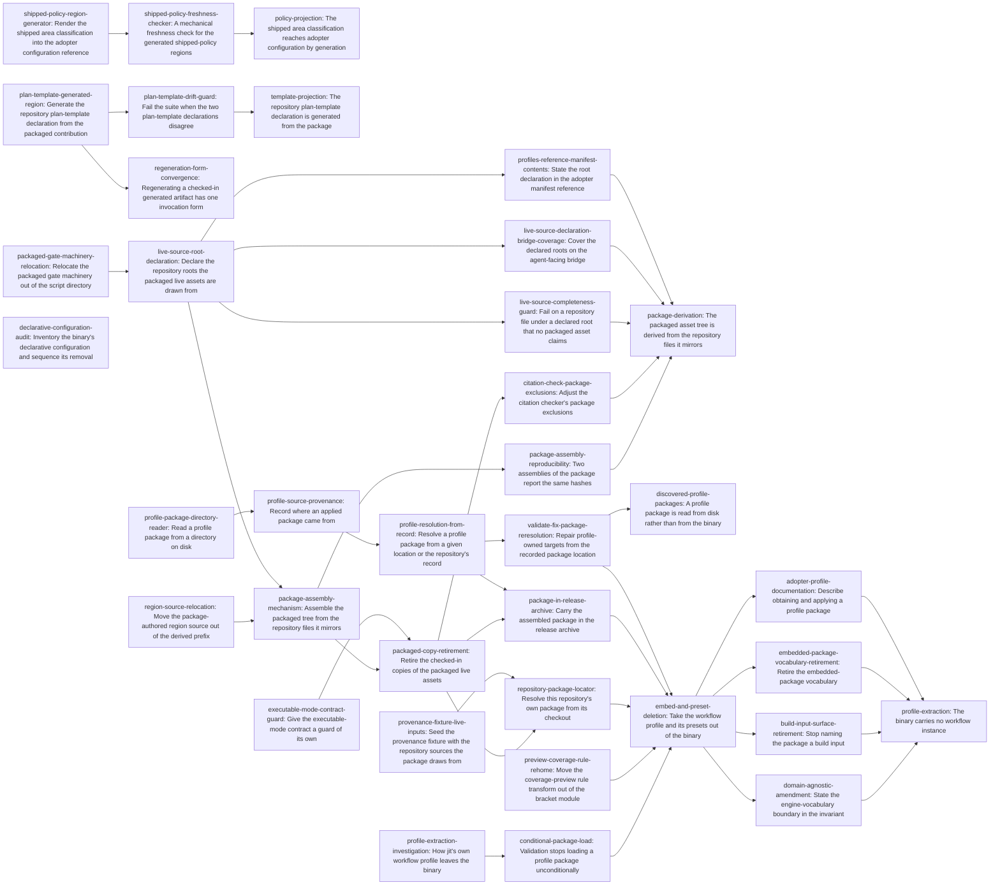

# Plan: Derived profile assets and projected policy documentation (e204e63d)

> Planning node: 7eecace8. Authoritative graph:
> [breakdown.json](e204e63d-breakdown.json).

The binary carries mechanism and no instance of it: every declarative
configuration reaches a repository as package content rather than as bytes
compiled into the executable that applies it (D-13). This container starts that
where the instance is largest and where a second defect meets it.

Those two meet in one artefact. The packaged profile *is* the largest of the
duplicated facts this repository states twice: sixty of its files are byte copies
of files it also consumes at their working paths, held equal by an assertion that
walks one direction only. Deriving them removes the second copy and turns the
package from something checked in into something assembled — which is exactly the
artefact the extraction has to distribute, because a profile the binary no longer
carries has to reach a repository as bytes on disk. Done in either order alone,
each leaves a structure the other removes: deriving the tree into the binary
targets a structure being deleted, and removing the compiled-in copy without the
derivation publishes an artefact still carrying the duplicates. The other two
duplicated facts are the same defect at a size one generator plus one freshness
check closes, and they are delivered.

What remains here is one chain, and its ordering is forced rather than preferred.
The irreversible step — the package and its presets leaving the binary — is taken
only after the artefact that replaces them exists, is readable from disk, ships in
the release archive, and has been applied from what that archive carries. That
chain also builds the resolver every later populated repository goes through
(D-13), so it precedes the rest of the boundary's work rather than running beside
it.

**What this plan decomposes, and what it deliberately does not.** It decomposes
the profile-extraction interior — the unexecuted steps 2 through 5 of the
ordering the extraction findings established — and the retargeted packaging
interior. It does not decompose the remaining embedded declarative configuration:
the documentation-area classification, the generated-artifact table, the embedded
git hooks, the scaffold's type hierarchy, namespace registry, and item kinds, and
the seeded workflow rules. Those are inventoried and sequenced by the audit inside
this container, whose report is the basis for planning them and on which fan-out
over them blocks (D-18); planning them from a grep-assembled survey is what that
decision rejects. The omission below is that boundary, not a coverage gap.

## Outcome and criterion approach

| Criterion | Approach | Evidence / open gap |
|---|---|---|
| REQ-01 | The shipped classification reaches both adopter files through the initialization code path — a throwaway repository initialized in a temporary directory, whose scaffolded table is spliced into a marked region in each. Reading the effective configuration is rejected by construction: it reports this repository's local policy plus a key the shipped constant does not carry, and the dogfooding boundary forbids it as a source for adopter prose. Freshness is a member of the deterministic documentation-check family, in the configured-target shape rather than the footprint-taking one, since its two targets are named facts. The authority the generator reads moves to the default package's own `[documentation]` declaration once the compiled constant is removed; the generator's shape is unchanged by that and only what it reads differs, so the criterion stated here continues to describe what is delivered until the removal is planned (D-15). | C6, C7, C8, D-15, Q6, S3.5, S7.4 |
| REQ-02 | Direction first: the packaged contribution is shipped content and the repository declaration is a local consumer, so the package is the authority and the repository copy becomes a generated region. Rendering and guarding are separate terminals, because they are separately true: generation makes the two equal once, and only a comparison keeps them equal afterwards. The guard is what REQ-02 literally asks for — two parsed declarations compared field for field, so it holds even where the generator was bypassed, and it carries no expectation of its own, which would be a third copy. The contribution is already exposed whole through the package's machine-readable inspection output, so no new surface is added. | C4, C5, Q4, S3.2, S7.4 |
| REQ-03 | Everything separable is separated out ahead of the one step that is not, so the irreversible move is taken against evidence rather than a claim. Two preparations stand alone: the package-authored region source moves out of the prefix that marks files mirroring a repository counterpart, because it is the single element making that rule false; and the executable-mode check becomes an assertion in its own right while the comparison it shares a loop with is still effective, since the package carries no mode metadata that would recover it implicitly. Then one entry point assembles the tree while the checked-in copies remain, which makes the equality of the two an observable intermediate state, and only then do the copies retire. The assembly runs as a repository entry point over a render inside the crate, not as a build step: nothing compiles the package in any more, so a build step would make every build do work no build consumes and would reintroduce the mtime sensitivity that once relinked every test target. | C1, C3, C10, Q1, Q2, Q3, S3.1, S3.2, S3.3, S3.4, S4.1, S8.3, S8.5, F7 |
| REQ-04 | Read over the produced package, with one term fixed so two entries cannot mean different things by it: *package hash* is the content address the package model computes over the canonical manifest and every declared path, and *provenance* is the per-target digest set beside it. Both are what an applied-profile record carries, so both are what two adopters installing the same published package must agree on. The comparison is between two assemblies into two destinations, never between an assembly and a stored digest, which would be a hand-maintained copy of a derived value. Comparing produced executable bytes is rejected: this workspace has no such property today for unrelated reasons, so the criterion would expand into a reproducible-builds effort. | D-5, D-7, Q3, S4.5, S8.1, F8 |
| REQ-05 | The manifest gains an additive declaration of the roots its live assets are drawn from, each with glob exclusions, and a walk over those roots reports an undeclared, unexcluded tracked file. Patterns rather than literals is forced by measurement: dozens of files under the declared roots are deliberately unpackaged, and listing them is the hand-maintained inventory the check exists to remove. The declaration is data in the package rather than a literal in engine code. Its two public consequences are separate terminals rather than clauses inside it, because each lands in a different workspace under a different toolchain: the agent-facing bridge's assertion that the reported manifest carries the declaration, and the adopter reference whose description of the manifest's contents the addition makes incomplete. | C2, Q5, D-2, D-6, S3.6, S4.1, S7.1, S7.2 |
| REQ-07 | The removal is decided by an operational test rather than argued: a thing belongs in the binary if it interprets repository configuration, and does not if it can be expressed as repository configuration. Measured against it, the package is one project's whole workflow and the preset trio is three named instances of that project's gates, while the mechanisms reading them stay. Nothing an adopter can do is withdrawn — a gate key resolves through the repository's own registry when no preset supplies it, and a preset never overwrote an authored gate — and this repository is unaffected, because its bracket gates are hand-authored and it has never applied its own profile. The removal is indivisible and the projection of the removed presets is regenerated in the same revision; the invariant is then amended to state positively which names belong to a mechanism, so the amendment does not delete three template defaults by implication. The criterion's subject is the workflow profile and its presets; the same test reaches further declarative configuration whose inventory and ordering the audit owns, and the amended invariant is worded to govern both. | D-10, D-12, D-13, D-18, F2.1, F4.1, F5.1, F5.2, F5.3, F6.1, F10.3 |
| REQ-08 | One carrier for one fact. The bytes are a directory, so the reader is a walk over a model already written for untrusted external data. Where the bytes are is stated in the repository's own applied-profile record: the first application supplies the location explicitly, the record retains it as a worktree-relative path, and every later run reads it back. Confining it to the worktree is what makes the location repository-local rather than machine-local; a configured search path is rejected as a second carrier of the same fact plus a precedence question, and package bytes under the tracker's data root are rejected by owner ruling. A package's declared version requirement is parsed and not matched against the running binary: the criterion asks that the profile be discovered and applied, and matching belongs to the deferred lifecycle rather than here (D-19). This same resolver is the populated path into any repository, so the scaffold has no route of its own to build later (D-13). | D-8, D-13, D-19, F3.1, F3.2, F3.3, F4.2 |
| REQ-09 | What the criterion protects is that no release exists in which the profile is reachable only from a source checkout, so the delivery shape is chosen for the install it produces rather than fixed by the wording. The package rides inside the release's native archive beside the binaries and the license texts (D-16): one download then suffices to initialize offline, no asset is added to the published set, and the existing checksum file covers it because it covers the archive. The on-disk form stays a directory, so whoever applies it points at the extracted path and the runtime needs no archive support, leaving the build-footprint budget's dependency assertions untouched. It is proven by the release's own smoke path applying the profile from the extracted package, and that retarget lands with the archive change rather than with the removal, so the published bytes are exercised from the moment they exist. | D-11, D-16, F3.4, F4.2, F10.1 |
| REQ-10 | Repair recomputes the expected record by reading the package again at the location the record names, and reports an unresolvable location as a failure naming the record and the path. The rejected alternative is the one that looks harmless: trusting the stored digests when the package cannot be read converts repair from restoring profile-owned targets into restoring the ones it can still account for. A repository with no record is untouched and resolves no package at all. | D-8, F1.2, F7, F10.2 |

## Shared architectural contracts

### `live-source-declaration` [implementation-produced] — The declared roots and their exclusions

The manifest carries one entry per repository root the packaged live assets are
drawn from, each with its own glob exclusion patterns, as an additive change to a
wire shape that rejects unknown keys and is public through the package's
machine-readable inspection output and the agent-facing bridge over it (S3.6).
Roots and patterns are constrained token types rejected where the manifest is
parsed, not free strings interpreted by each consumer. The declaration exists
because the completeness walk needs a domain it cannot derive — sixty asset paths
imply the roots without stating them — and because a package that draws from a
repository should say what it draws from where an adopter can read it. The
managed-region source and every install-only asset *source* fall outside every
root, so a root never claims a package-authored file. One install-only *target*
path does lie inside a declared root; where such a target exists in a repository
it is unpackaged material like any other and a declared exclusion covers it.

### `completeness-walk-rule` [plan-fixed] — What the omission check asks and of what

The walk enumerates the repository-tracked files beneath each declared root and
reports one that is neither a declared packaged asset nor matched by a declared
exclusion. Tracked rather than present, so a contributor's scratch file is not a
packaging defect. The workspace's established repository-inventory idiom lists
untracked non-ignored paths alongside tracked ones, which is the opposite
property, so an implementer must take the tracked-only listing rather than copy
that idiom's flag set. A run that cannot obtain the listing fails rather than
passing on an empty set, which is the vacuity this route otherwise risks (Q5).
Exclusions are globs over repository-relative paths and describe categories —
evaluation harnesses, fixtures, transcripts, contributed example prompts — rather
than individual files, so material of the same shape needs no new entry. A root
whose unpackaged material is not category-shaped is not a root: it is relocated
until packaging is the rule there, which is why the script directory is no longer
one.

### `package-assembly-publication` [plan-fixed] — How the packaged tree is produced

The assembly is a repository entry point over a render inside the crate's
test-support surface. It is not a build step: nothing compiles the package in, so
a build step would make every build do work no build consumes, and the directory
watching it would need is the mechanism that once relinked every test target on
an unchanged rebuild (Q2, S7.3, F7). It is not a member of the committed-artifact
family either, because its output is deliberately not committed; it shares that
family's shape — a render in the crate, a script entry point, the same render
read by whatever asserts about it — and differs in having a destination its
caller names, because its consumer is a release job staging its own directory
where a committed artifact has one fixed target.

Two properties follow from being a script rather than a build step. The manifest
has exactly one reader, the crate's own package model, where a build script could
only have been a second one, since a build script cannot import the crate it
builds; tree-to-manifest correspondence therefore stays where it already is, with
the model that rejects a declared source that is absent and a package file no
declaration claims (S6, S8.4). And each run publishes a freshly staged tree
rather than updating one in place, so the output holds exactly what the manifest
declares, a source the manifest stops declaring cannot linger into the next run,
and neither incremental reconciliation nor timestamp discipline is needed (Q3,
S8.3).

### `profile-package-resolution` [plan-fixed] — Where a package's bytes come from

A package is a directory read into owned bytes. The model already treats those
bytes as untrusted external data — count and size bounds, rejected path shapes,
absent declared sources, undeclared package files, content addressing — so a walk
producing a path-to-bytes map is the whole new reader (F3.1), and none of those
defences is relaxed for it.

Where the bytes are is stated once, in the repository's own applied-profile
record at `.jit/profiles/<id>.json`, as a worktree-relative path. The first
application supplies the location explicitly, because a repository being
initialized has no record to read; the record retains it; every later resolution —
validation, repair, inspection, re-application — reads it back. A supplied
location outranks the recorded one, and both outrank a package compiled into the
binary, which exists only until the cutover removes it. Confinement to the
worktree is the contract, not an implementation detail: a location outside it
makes a repository's derived-state repair depend on machine state, which is
exactly the property option C of the location survey was rejected for (F3.3).
An unresolvable recorded location is a loud failure naming the record and the
path, never a replay of the stored digests (D-8, F10.2).

Enumeration follows from the same place: a repository reports the profiles its
own records name. One that has applied none reports none, which is what a binary
carrying no profile means. There is no configured search path and no precedence
order beyond the two routes above — a configuration key naming the location would
be a second carrier of one fact — and no package bytes are written under the
tracker's data root, which the owner's ruling forbids and which the reserved-target
guard already refuses.

This resolver is the one populated route into a repository: a bare initialization
writes the structural minimum and an initialization naming a package and a
location goes through exactly this path, so no second scaffold route survives
alongside it (D-13). It is also what composition attaches to. A package that
declares a dependency on another (D-14) resolves that dependency through the same
two routes and records it the same way, because provenance is one record per
applied package, each carrying its own location — so a composed application
resolves and repairs by the rule stated here rather than by an exception to it.
The composition mechanism itself is specified by the audit and built after it;
nothing here forecloses it, and nothing here delivers it.

### `distribution-artefact-and-release` [plan-fixed] — The published form and when it appears

The package's on-disk form is a directory, and its published form is that same
directory inside the release's native archive, beside the binaries and the
license texts (D-16). One download therefore initializes a repository offline,
which is the property the profile reference promises and the only reason the
published form is decided here at all. Nothing is added to the published asset
set, the existing checksum file covers the package because it covers the archive,
and the released output stays one release with the asset list `@/charter/D-16`
fixes. The directory form keeps the reader a walk and adds no archive dependency
to the binary, so the build-footprint budget's dependency-policy assertions are
untouched (F3.4).

The archive carries the package directories this repository ships. There is one
today; the second that composition introduces (D-14) rides the same way, so the
mechanism established here is what it attaches to rather than something it
replaces.

Publication is proven by the release's own smoke path applying the profile from
the extracted package rather than from the binary or from a checkout, and that
retarget lands with the archive change rather than with the cutover, so the
published bytes are exercised from the moment they exist. Publication precedes
the removal of the compiled-in copy, so no release exists in which the profile is
reachable only from a jit source checkout — the condition `@/charter/D-8`'s
rejected branch names, and the one cost of this direction that has no route back
(D-11, F10.1).

### `engine-vocabulary-boundary` [plan-fixed] — What stays in the binary

A thing belongs in the binary if it interprets repository configuration, and does
not if it can be expressed as repository configuration (F2.1). The test is
decidable per line of code rather than by taste: either an adopter can write it
into `.jit/` and get the same behaviour, or they cannot. A mechanism
parameterized by declared vocabulary is engine capability however specific its
motivating use; a named instance is an application however small. The trio's gate
definitions are ordinary registry stanzas whose checkers are checker kinds
available to any adopter, so the test places them outside without ambiguity.

Read at its strictest, the test admits no declarative configuration at all: no
type name, label namespace, item kind, documentation-area classification, or
workflow rule reaches an adopter compiled into the executable that applies it,
whether it names this project or is merely opinionated (D-13). Two classes stay
on the mechanism side and are named so the rule is not read as deleting them.
Mechanism-parameter defaults are engine vocabulary: the default planning role,
breakdown role, and container anchor are overridable defaults a template
mechanism resolves through declared bindings, and a repository using its own
vocabulary needs no code change (D-12). And a rule that derives both its
assertion and its membership from whatever registry the adopter declares — and
produces nothing without one — is mechanism over the adopter's own declarations
rather than an opinion about their project; a rule encoding a workflow judgement
is not, and leaves with the workflow (D-17).

The amended invariant carries those sentences explicitly, because a stricter
reading would delete the defaults by implication and force every repository to
declare bindings it currently inherits — and the invariant's wording is what a
later reviewer will cite, over this container's work and over the removals the
audit sequences alike.

### `generated-region-splice` [plan-fixed] — How a generated region replaces authored text

A generated region is bounded by markers written in the target file's own comment
syntax, and everything outside the markers is preserved byte for byte —
authored prose, comments, and unrelated tables alike. Commentary that must
survive lives outside the markers; nothing inside them is authored. The
repository's byte-preserving managed-document renderer takes arbitrary
delimiters and is format-agnostic, so it serves the template region directly
(Q4). The documentation regions are spliced in shell by their own generator, for
a reason of reach rather than of cost: that splicer is a library function with no
command-line entry point, neither region is expressible as a configured
projection — that surface binds to addressable item kinds and every body renderer
it has emits markdown (Q4, S5) — and D-4 rejects adding a command, so a shell
generator has no route to it and must splice in shell. Both regions use the same
marker shape, and every such artifact is regenerated through the one entry-point
form this repository declares for them.

### `shipped-policy-authority` [plan-fixed] — Where the adopter documentation values come from

The three area lists reach both adopter documents only through what repository
initialization writes into a throwaway directory. The effective-configuration
report is not a source: it carries a key the shipped constant does not have and
its values come from this repository's own table, which agrees today by a
hand-maintained claim rather than by binding (C7). This repository's own
configuration is not a source either, for the reason the dogfooding boundary
gives. A new command printing the shipped policy is rejected as adopter-visible
surface whose only consumer is this repository's documentation pipeline (S3.5).

The authority this route reaches is the initialization code path *as built into
the binary in use*, not the declaration at the current revision — initialization
takes no path argument, so the generator runs it in a temporary directory and
reads what that binary produces. Nothing in the pipeline notices the difference
on its own: the repository's stale-binary refusal identifies a repository by
resolving a revision in it, and a throwaway directory has none, so the refusal is
silent there even under a gate. Silence is therefore not evidence of currency,
and the check has to be positive rather than an absence of complaint. An unknown
build commit, an unresolvable head, and a build commit outside the repository's
history all resolve to the same not-applicable outcome as a genuinely current
binary. Both the generator and the checker therefore establish the condition
themselves, against the repository they are writing into or checking, and fail
closed on anything short of a resolved, current provenance. Without that, an
unreinstalled binary produces a region that is stale and internally consistent.

The authority the route reaches is a shipped declaration, not a particular
storage of it. It is a compiled constant while the binary still carries one, and
the default package's own `[documentation]` declaration once it does not (D-15);
in both cases initialization writes it into the throwaway repository and the
generator reads what was written there. So the generator's shape, the marked
regions, and the freshness check survive that move unchanged, and only what the
shipped path draws from differs.

## Generated decomposition overview

<!-- jit:breakdown-overview:begin -->
| Key | Title | Type | Outcome | Contracts | Sources | Footprint | Landing | Depends on |
|---|---|---|---|---|---|---|---|---|
| shipped-policy-region-generator | Render the shipped area classification into the adopter configuration reference | task | The two adopter configuration files carry the shipped area classification as a generated region rather than authored prose. | generated-region-splice, shipped-policy-authority | REQ-01, D-3, D-4, C6, C7, C8, S3.5, S4.3, S4.4, S7.4 | creates 1, touches 2 | policy-docs | — |
| shipped-policy-freshness-checker | A mechanical freshness check for the generated shipped-policy regions | task | A stale generated policy region in either adopter configuration file fails the mechanical documentation checks. | shipped-policy-authority | REQ-01, D-4, C8, Q6, S4.4, S7.2 | creates 1, touches 4 | policy-docs | shipped-policy-region-generator |
| plan-template-generated-region | Generate the repository plan-template declaration from the packaged contribution | task | The repository plan-template block is a region rendered from the packaged declaration. | generated-region-splice | REQ-02, D-1, C4, C5, Q4, S3.2, S7.4, S8.6 | touches 2 | template-region | — |
| plan-template-drift-guard | Fail the suite when the two plan-template declarations disagree | task | A difference between the parsed repository declaration and the parsed packaged declaration fails the suite. | — | REQ-02, D-1, C4, C5 | touches 1 | template-region | plan-template-generated-region |
| policy-projection | The shipped area classification reaches adopter configuration by generation | story | Both adopter configuration files carry the shipped classification as a generated region, with staleness reported mechanically. | shipped-policy-authority, generated-region-splice | REQ-01, D-3, D-4, C6, C7, C8, Q6, S3.5, S7.2, S7.4 | — | — | shipped-policy-freshness-checker |
| template-projection | The repository plan-template declaration is generated from the package | story | The repository plan-template declaration is generated from its packaged authority, with divergence failing the suite. | generated-region-splice | REQ-02, D-1, C4, C5, Q4, S3.2, S7.4, S8.6 | — | — | plan-template-drift-guard |
| provenance-fixture-live-inputs | Seed the provenance fixture with the repository sources the package draws from | task | The provenance fixture repository carries the packaged live sources, so a cold build inside it succeeds. | — | REQ-03, Q10, S5 | touches 1 | package-cutover | — |
| executable-mode-contract-guard | Give the executable-mode contract a guard of its own | task | A standalone assertion checks each declared live asset's executable flag against its repository file's mode. | — | REQ-03, C1, Q1 | touches 1 | package-assembly | — |
| profile-extraction-investigation | How jit's own workflow profile leaves the binary | task | One report establishes the mechanism, the ordering, and the consequences of taking the profile out of the binary. | — | F1.1, F2.1, F5.3, F8, F10.1 | creates 1 | — | — |
| conditional-package-load | Validation stops loading a profile package unconditionally | task | Validation resolves a profile package only where the repository's own record names one. | profile-package-resolution | F1.2, F5.2, F7 | touches 1 | — | profile-extraction-investigation |
| packaged-gate-machinery-relocation | Relocate the packaged gate machinery out of the script directory | task | Each declared live-source root is a directory where packaging is the rule rather than the exception. | completeness-walk-rule | REQ-05, D-6, C2, Q5 | touches 3 | package-assembly | — |
| regeneration-form-convergence | Regenerating a checked-in generated artifact has one invocation form | task | A generated artifact committed to this checkout is regenerated through one invocation form. | generated-region-splice | REQ-02, S7.4 | touches 3 | — | plan-template-generated-region |
| region-source-relocation | Move the package-authored region source out of the derived prefix | task | The managed-region source sits outside the prefix reserved for files drawn from repository counterparts. | package-assembly-publication | REQ-03, C1, Q1, S3.2, F1.1 | creates 1, touches 2 | package-assembly | — |
| live-source-root-declaration | Declare the repository roots the packaged live assets are drawn from | task | The package manifest declares each live-source root with the exclusion patterns that bound it. | completeness-walk-rule | REQ-05, D-2, D-6, C1, C2, Q5, S3.6, S7.1 | touches 5 | package-assembly | packaged-gate-machinery-relocation |
| package-assembly-mechanism | Assemble the packaged tree from the repository files it mirrors | task | One entry point produces a complete package tree from the checked-in package sources and the repository's live files. | live-source-declaration, package-assembly-publication | REQ-03, D-2, C3, C10, Q1, Q2, Q3, S3.1, S3.4, S8.3, F3.4, F7 | creates 2, touches 3 | package-assembly | region-source-relocation, live-source-root-declaration |
| package-assembly-reproducibility | Two assemblies of the package report the same hashes | task | Two assemblies from identical sources report the same package hash and the same target digests. | package-assembly-publication | REQ-04, D-5, D-7, Q3, S4.5, S8.1, F8 | touches 1 | derivation-coverage | package-assembly-mechanism |
| packaged-copy-retirement | Retire the checked-in copies of the packaged live assets | task | The packaged live assets exist once in the repository, at their working paths. | package-assembly-publication | REQ-03, C1, C3, Q1, S3.1, S3.3, F8 | touches 2 | package-cutover | package-assembly-mechanism, executable-mode-contract-guard |
| citation-check-package-exclusions | Adjust the citation checker's package exclusions | task | The citation checker's package exclusions describe the package directory that remains. | — | REQ-03, S4.1, S8.5 | touches 1 | package-cutover | packaged-copy-retirement |
| live-source-completeness-guard | Fail on a repository file under a declared root that no packaged asset claims | task | An undeclared, unexcluded file under a declared live-source root fails the suite. | live-source-declaration, completeness-walk-rule | REQ-05, D-6, C2, Q5, S7.1 | touches 2 | package-assembly | live-source-root-declaration |
| live-source-declaration-bridge-coverage | Cover the declared roots on the agent-facing bridge | task | The bridge's coverage observes the root declaration in the manifest it reports. | live-source-declaration | REQ-05, S3.6, S4.1 | touches 1 | package-assembly | live-source-root-declaration |
| profiles-reference-manifest-contents | State the root declaration in the adopter manifest reference | task | The adopter reference describing what the manifest carries accounts for the declared roots. | live-source-declaration | REQ-05, S4.1, S7.2 | touches 1 | package-assembly | live-source-root-declaration |
| package-derivation | The packaged asset tree is derived from the repository files it mirrors | story | The packaged tree is assembled from the repository files it mirrors, reproducibly, with omission reported. | live-source-declaration, package-assembly-publication, completeness-walk-rule | REQ-03, REQ-04, REQ-05, D-2, D-5, D-6, D-7, C1, C2, C3, C10, Q1, Q2, Q3, Q5, S3.1, S3.2, S3.3, S3.4, S4.1, S4.5, S7.1, S8.1, S8.3, F3.4, F7, F8 | — | — | package-assembly-reproducibility, citation-check-package-exclusions, live-source-completeness-guard, live-source-declaration-bridge-coverage, profiles-reference-manifest-contents |
| profile-package-directory-reader | Read a profile package from a directory on disk | task | A profile package is constructed from a directory tree, owning its bytes rather than borrowing compiled-in ones. | profile-package-resolution | REQ-08, F3.1, F3.2, F3.4 | touches 1 | package-discovery | — |
| profile-source-provenance | Record where an applied package came from | task | The applied-profile record carries the worktree-relative location the package was read from, and its origin. | profile-package-resolution | REQ-08, D-8, F1.2, F3.1, F3.2, F10.2 | touches 3 | package-discovery | profile-package-directory-reader |
| profile-resolution-from-record | Resolve a profile package from a given location or the repository's record | task | The profile commands read a package from a given location or from the location the repository's record names. | profile-package-resolution | REQ-08, D-8, F1.2, F2.2, F3.2, F3.3, F4.2 | touches 4 | package-discovery | profile-source-provenance |
| validate-fix-package-reresolution | Repair profile-owned targets from the recorded package location | task | Repair recomputes a recorded profile's expected targets by re-reading its package from the recorded location. | profile-package-resolution | REQ-10, D-8, F1.2, F7, F10.2 | touches 2 | package-discovery | profile-resolution-from-record |
| discovered-profile-packages | A profile package is read from disk rather than from the binary | story | The engine reads, verifies, applies, and repairs a profile package that lives in a repository directory. | profile-package-resolution | REQ-08, REQ-10, D-8, D-19, F1.2, F3.1, F3.2, F3.3, F10.2 | — | — | validate-fix-package-reresolution |
| preview-coverage-rule-rehome | Move the coverage-preview rule transform out of the bracket module | task | The pure coverage-preview rule transform sits with the engine's rule constructors. | engine-vocabulary-boundary | REQ-07, F2.1, F2.2, F10.3 | touches 3 | extraction-preparation | — |
| repository-package-locator | Resolve this repository's own package from its checkout | task | This repository's tests read its profile package from the assembly rather than from the compiled-in copy. | package-assembly-publication, profile-package-resolution | F1.2, F8, Q10, S5 | touches 6 | extraction-preparation | packaged-copy-retirement, provenance-fixture-live-inputs |
| package-in-release-archive | Carry the assembled package in the release archive | task | The release archive carries the assembled profile package beside the binaries, and the smoke path applies the profile from it. | distribution-artefact-and-release, package-assembly-publication | REQ-09, D-11, D-16, F3.4, F4.2, F10.1 | touches 4 | extraction-publication | packaged-copy-retirement, profile-resolution-from-record |
| embed-and-preset-deletion | Take the workflow profile and its presets out of the binary | task | The binary compiles in no profile package and no workflow preset, and the generated preset reference matches what remains. | engine-vocabulary-boundary, profile-package-resolution, distribution-artefact-and-release | REQ-07, D-10, F2.1, F2.2, F4.1, F5.1, F5.2, F5.3, F10.3 | touches 10 | extraction-cutover | conditional-package-load, preview-coverage-rule-rehome, repository-package-locator, package-in-release-archive, validate-fix-package-reresolution |
| domain-agnostic-amendment | State the engine-vocabulary boundary in the invariant | task | The project invariant carries no sanctioned workflow exception and says which names are mechanism vocabulary. | engine-vocabulary-boundary | REQ-07, D-12, F2.3, F6.1, F6.2, F6.3 | touches 4 | extraction-cutover | embed-and-preset-deletion |
| build-input-surface-retirement | Stop naming the package a build input | task | Editing a packaged live source no longer reports an installed binary as stale. | — | REQ-07, C9, S4.4, S6, F7 | touches 1 | extraction-cutover | embed-and-preset-deletion |
| embedded-package-vocabulary-retirement | Retire the embedded-package vocabulary | task | The package type, its commands, and their help name a profile package rather than an embedded one. | profile-package-resolution | F3.2, F3.3 | touches 6, uncertain | extraction-cutover | embed-and-preset-deletion |
| adopter-profile-documentation | Describe obtaining and applying a profile package | task | The adopter documentation describes a profile that arrives as a published package and is applied from a repository location. | distribution-artefact-and-release, profile-package-resolution | REQ-08, F3.3, F4.2, F10.1 | touches 5 | extraction-cutover | embed-and-preset-deletion |
| declarative-configuration-audit | Inventory the binary's declarative configuration and sequence its removal | task | Every site in the binary carrying declarative configuration is classified against the boundary and its removal sequenced. | engine-vocabulary-boundary | D-13, D-14, D-15, D-16, D-17, D-18, F5.3 | creates 1 | — | — |
| profile-extraction | The binary carries no workflow instance | story | The workflow profile and its presets have left the binary, riding in the release archive instead. | engine-vocabulary-boundary, distribution-artefact-and-release, profile-package-resolution | REQ-07, REQ-08, REQ-09, D-10, D-11, D-12, D-13, D-16, D-18, F2.1, F4.1, F4.2, F5.1, F5.2, F5.3, F6.1, F7, F10.1, F10.3 | — | — | domain-agnostic-amendment, build-input-surface-retirement, embedded-package-vocabulary-retirement, adopter-profile-documentation |

<!-- jit:breakdown-overview:end -->

## Material risks and owner decisions

| Risk / decision | Resolution and rationale |
|---|---|
| **D-1 — the template pair's direction** | Chosen: the packaged contribution is the authority and the repository declaration becomes a generated region, with the suite comparing the two parsed declarations. Rejected: synchronizing the three divergent description strings and guarding deep equality of two hand-edited copies, which leaves both hand-maintained; guarding structure alone and letting descriptions diverge, which leaves REQ-02 unmet by construction. |
| **D-2 — the packaged inventory's shape** | Chosen: keep the explicit per-file asset declaration and add a declared root-and-exclusion list that turns omission into a failure. Rejected: include and exclude globs replacing the inventory, because a missed exclusion over-packages an adopter install, which is worse than the omission it prevents. |
| **D-3 — how much of the example file becomes generated** | Chosen: only its area-classification table, with the present illustrative subset giving way to the table a fresh repository receives; the rest stays hand-authored. Rejected: replacing the whole file with the initialization scaffold, which would add and remove unrelated tables for reasons this work does not decide. |
| **D-4 — how the shipped policy is read** | Chosen: a repository-local generator that initializes a throwaway repository and reads the table the shipped path wrote there, with a mechanical freshness check. Rejected: a new command printing the shipped policy, which adds adopter-visible surface for one internal consumer; a projection over a new item kind, which would need a source mode for a compiled constant that no declared kind has. |
| **D-5 / D-7 — what REQ-04 observes** | Chosen: the produced package's content address and per-target digests, compared across two assemblies. REQ-06 — "editing a live consumer alone reports a binary installed before that edit as stale" — is retired rather than renumbered, so the investigation's per-criterion analysis keeps its referents; its property survives as REQ-03's clause on packaged staleness. Rejected: comparing produced binary bytes, because the workspace has no such property today for unrelated reasons; dropping the reproducibility property, which leaves nothing asserting that a script-assembled package is stable across assemblies. |
| **D-6 — how much of the live surface is completeness-checked** | Chosen: every declared root, with glob exclusions describing categories. Rejected: checking only the skill root, which leaves the remaining assets uncovered; one root per skill, which relocates the same omission risk one level up; path-literal exclusions, since a literal list of the unpackaged files is itself a hand-maintained inventory. The rule's consequence is that a directory where packaging is the exception cannot be a root: the script directory carried four packaged files among forty-five tracked with no category separating them, so the packaged four moved to the contributed-gate directory and that root was retired rather than given forty-one near-literal exclusions. |
| **D-8 — how repair re-resolves a package** | Chosen: the applied-profile record carries the worktree-relative location the package was read from, and repair reads the package there. Rejected: requiring an explicit location on every repair, which loses unattended repair; trusting the stored record when the package is unresolvable, which silently converts repair from "restores profile-owned targets" to "restores what it can still see". |
| **D-9 / D-14 — the charter's profile clause** | `@/charter/D-8` admits composable offline profile packages discovered from declared locations, and defers the rest of the lifecycle. Composition enters v1.0 because two packages ship: a default carrying the domain vocabulary a repository needs to be usable, and this project's workflow package declaring a dependency on it, resolved at application time. Rejected: leaving the charter unamended while the work contradicts it; reopening the deferred lifecycle generally, which would admit upgrade, diff, and removal too; each package carrying its own copy of the shared vocabulary behind an equality assertion, which is the hand-maintained duplicate this container exists to remove; generating the default package from this project's, which makes the generic package a derivative of one project's workflow. |
| **D-10 — where the extraction is delivered** | Chosen: inside this container, with criteria describing it. Rejected: a separate epic, which splits one artefact's derivation from its distribution across two containers and leaves this one closing on criteria whose subject the other removes. |
| **D-11 — publication before removal** | The task putting the package in the release archive is a hard predecessor of the task removing the compiled-in copy, as a real edge rather than a wave note. Rejected: accepting a window between them, which is the condition `@/charter/D-8`'s rejected branch names. |
| **D-12 / D-17 — what stays on the mechanism side** | The default planning role, breakdown role, and container anchor stay, and so do the registry-derived rules — label format, namespace registry, type-hierarchy membership, per-namespace uniqueness — because each derives both its assertion and its membership from whatever registry the adopter declares and produces nothing without one. The two rules encoding a workflow judgement leave with the workflow. The amended invariant admits both classes by name. Rejected: deleting the defaults, which forces every repository to declare bindings it currently inherits without removing any workflow content; moving every rule, which leaves a repository unable to validate a label until it has applied a package. |
| **D-13 — the boundary this container starts on** | The binary carries no declarative configuration: no type name, label namespace, item kind, documentation-area classification, or workflow rule reaches an adopter compiled into the executable that applies it, whether it names this project or is generically opinionated. A bare initialization writes the structural minimum, and a populated one names a package and a location and goes through the resolver REQ-08 builds, so no separate scaffold route survives. Rejected: exempting the generic scaffold because it names no project, which leaves two routes into a repository for the same class of declaration; exempting content the engine does not read at runtime, which keeps this project's own area names compiled into every adopter binary. |
| **D-15 — REQ-01's authority, settled and not yet restated** | The authority moves from the compiled documentation-policy constant to the default package's `[documentation]` declaration. The delivered generator keeps its shape — it initializes a throwaway repository and reads what the shipped path wrote there — and only what that path draws from changes, so REQ-01 continues to describe what is delivered and is restated when the constant's removal is planned rather than now. Rejected: striking REQ-01, which returns the adopter documents to a hand-maintained area list; exempting the constant, which ships this project's own development-area names to every adopter through v1.0. |
| **D-16 — where the package rides** | Chosen: inside the release's native archive, beside the binaries, so one download initializes a repository offline with no second fetch. Rejected: a release asset per package, which costs the self-contained install the profile reference promises; placing a package at a machine-level location during install, which makes a repository's derived-state repair depend on machine state and reopens the search-path precedence the charter defers. The archive carries the package directories this project ships. One is in this plan's scope; the second is created by the work the audit sequences and rides by the mechanism established here, so nothing about it is left for that work to decide beyond adding a directory to the stage. |
| **D-18 — what this plan decomposes, and what the audit does** | Chosen: this plan decomposes the profile-extraction interior and the retargeted packaging interior; the audit inside this container inventories every other embedded declarative configuration against D-13, classifies each site as an instance that leaves or a mechanism that stays, specifies the composition mechanism, and returns one sequenced ordering extending the extraction findings' own. Fan-out over those sites blocks on that report. Rejected: planning them here from the grep-assembled survey that opened the question, which did not distinguish an instance of a mechanism from the mechanism and did not reach sites carrying configuration without a constant to grep for. The direction of the dependency is worth stating: the extraction interior builds the resolver the populated route goes through, so the audit's recommendation extends this plan rather than replacing it. |
| **D-19 — the resolver ships no compatibility check** | A package's declared version requirement is parsed and not matched against the running binary. Accepted consequence, stated rather than discovered: a package built for a later binary applies cleanly and fails wherever the shape later differs. Matching belongs to the profile lifecycle `@/charter/D-8` defers. Rejected: amending REQ-08 to require the match, and giving the check a criterion of its own — both pull an unbuilt requirement match and its typed error into this container for a failure mode the deferred lifecycle owns. |
| **Where the package lives, and what enumerates it** | Chosen: the location lives in the applied-profile record and nowhere else; the first application supplies it, later runs read it back, and enumeration reports what the repository's own records name. Rejected: a configured search root in `.jit/config.toml`, which is a second carrier of one fact plus a precedence question between the two, and which would still need an explicit location at initialization because no configuration exists yet; a package directory under the tracker's data root, which the owner ruled out and which the reserved-target guard already refuses; a machine-level or user-level location, which makes a repository's repair depend on machine state; a supplied location with no record at all, which leaves repair nothing to re-resolve from. The cost accepted is that inspecting a package the repository has never applied requires supplying its location. |
| **Superseded: build-time generation was rejected once** | An earlier epic rejected a build script generating this tree into the build output directory as "bespoke recursive traversal, escaping, deterministic ordering, change tracking and generated-output tests… not justified for one small data tree" (S3.1). The judgment is superseded and the shape it priced is not the shape built: the assembly is a repository entry point over an in-crate render publishing a freshly staged tree, so there is no watch set, no incremental change tracking, and no second manifest reader. Two properties that would have needed their own coverage under the build-step form — an unchanged rebuild relinking no test target, and a removed source lingering in a directory that is not reset — do not arise, so neither has a terminal here. |
| **Superseded: the package was made the authority** | The same epic made the package the authority and the working paths its rendered consumers; the shipped code still says so, in the drift assertion's message and in the manifest's own comment (S3.2). The renderer that decision assumed was never built, so what shipped is a hand-maintained duplicate plus an equality assertion. REQ-03 reverses the direction for assets. **The resulting asymmetry is deliberate and stated here so it does not read as inconsistency**: the package is the authority for the template declaration, because that declaration is shipped content the repository consumes, and the repository is the authority for the file assets, because those files are what contributors actually edit. |
| **Ordering: one chain, forced at four points** | The two projections carry no edge to the packaging chain, because no artifact of one is an input to the other, and they are delivered. What remains is one chain with four forced points. The region-source relocation and the root declaration precede the assembly, because the assembly reads the live prefix as a rule and the region source is the one file that makes the rule false. The assembly precedes the retirement of the checked-in copies, so the equality of the two trees is observed while both exist; the mode guard precedes it too, so the only executable-mode contract in the workspace is never unguarded for a revision. Publication precedes removal (D-11). And within the removal itself: the conditional package load, the rule rehome, the repository package locator, and repair's re-resolution all precede it, because each is a caller or a capability that the removal would otherwise break or delete. |
| **The removal is indivisible, and looks oversized because of it** | The compiled-in package and the preset trio go in one change: removing the package alone leaves the preset constructors reading gate definitions from nothing, and removing the presets alone leaves a package compiled in for no consumer that needs it there (F5.3). The generated preset reference is in the same change for a second mechanical reason — its conformance assertion compares the committed page against the projection of the presets, so it fails in any revision where they are gone and it is not regenerated (F5.2). Everything separable has been made a predecessor rather than a clause: the locator, the rule rehome, the publication, the repair route. What remains is one removal with no inner decomposition, and splitting it against F5.3 would produce a revision that does not build. |
| **Shared-file concurrency** | Five files carry more than one writer, and edges order most of them. The package manifest is written by the root declaration, then the assembly's predecessors, then the completeness walk; the crate's package model by the directory reader, then the version check; the dogfood module by the assembly, the copy retirement, the locator, and the removal, in that order. Two unordered pairs remain. The adopter profile reference is written by the manifest-contents entry and again by the adopter documentation sweep; the sweep is four steps downstream of the cutover and the other is a leaf off the root declaration, so in any topological order the sweep lands last, and it rewrites the page's premise rather than the section the other adds. The command reference is written by the resolution entry and by the vocabulary retirement, which is downstream of it. Everything else is single-writer by construction. |
| **The package stops being applicable from this checkout** | After the copies retire, `profiles/jit-dogfood/` is a package *source*: manifest, install-only assets, region source. A complete package exists only where the assembly writes one. Nothing here applies its own profile — `.jit/profiles/` does not exist and this repository's bracket gates are hand-authored — so this costs nothing locally, but it means every test needing a real package assembles one, and it is why the repository package locator exists as a step of its own. |
| **The package leaves the binary's build-input surface** | The build-input path predicate names the package directory, and that is true only while the directory is compiled in. Left in place afterwards, it reports every package edit as invalidating an installed binary it cannot affect, and every gate behind that report refuses until a rebuild that changes nothing has happened. Removing the entry is its own terminal behind the cutover, and it is the surviving half of what the retired REQ-06 asked for: the binary-to-source staleness relation does not move to the package, it ends. |
| **Open: the citation checker's package exclusion (S8.5)** | Whether removing the derived prefix changes what the checker's package exclusion protects was not determined. It is cheap to settle once the package directory has its final shape, so it is its own terminal behind the retirement rather than a clause inside it or a separate investigation. |
| **Open: two further template declarations, out of scope (S8.6)** | Two adopter-facing example rulesets declare their own plan template, both carrying this repository's top-level description string verbatim. They illustrate authoring forms for different rulesets, not this repository's workflow; D-1 names only the repository registry and REQ-02 does not reach them. Stated here to pre-empt reading REQ-02 as incompletely satisfied. |
| **A residual copy this container does not remove** | This repository's own configuration carries a third hand-maintained copy of the three area lists, claiming to adopt the shipped classification verbatim with nothing binding it (S7.2). It is repository-local policy rather than adopter documentation, so REQ-01 does not reach it and this work does not expand to it. |
| **Glob matching has no incumbent** | The workspace has no glob dependency, and the entry that consumes pattern matching is not the one that can add it. The matcher is owned by the root declaration, which needs it first and for its own reason: rejecting a malformed pattern at parse time means compiling it there. The completeness walk then consumes the compiled patterns and adds no dependency of its own. A dependency-free matcher crate confined to pattern matching is preferred over hand-rolling, and either choice must leave the build-footprint budget's dependency-policy assertions untouched. The workspace lock file is in the owning entry's footprint so the addition has a declared home. |
| **One integration-test target slot remains** | Eleven of twelve are used (Q8). Every guard here lands in an existing suite or in the module that already hosts the packaging tests; no entry creates an integration-test target, and none should be added without spending the last slot deliberately. |
| **What the removal returns to the build footprint** | Roughly 423 KB of embedded bytes leave every target that links the library, and the embedding dependency can leave the crate manifest with the dependency-policy assertion pinned for it. The budget measures integration-target count and active-executable bytes, so the reduction is real but unmeasured; nothing here asserts a number, and the budget's existing assertions are what must keep passing. |

## Investigation sources

- [Container investigation](e204e63d-investigation.md) —
  `dev/active/e204e63d-derived-package-sources/e204e63d-investigation.md`. The
  exhaustive consumer inventories, the per-root undeclared file counts, the
  manifest and template diffs, and the primitive-verification table remain there.
- [Extraction findings](../a62d444d/findings.md) —
  `dev/active/a62d444d/findings.md`. The consumer table for the compiled-in
  package, the three measured adopter cases, the ordering derivation, the
  per-criterion verdict on this container, and the costs with no route back
  remain there.

Source ids resolve inside those reports. In the container investigation,
`C1`–`C10` are the claim classifications in section 1, `Q1`–`Q10` the answers in
section 2, and `S<n>.<m>` the numbered item `m` under section `n` — so `S3.4` is
the fourth recorded decision in the prior-art sweep and `S8.3` the third open
risk; `S5` and `S6` name sections 5 and 6 as wholes. In the extraction findings,
`F<n>.<m>` is subsection `m` of section `n` — so `F5.3` is the ordering and
`F10.2` the second irrecoverable cost — and `F<n>` names a section that has no
subsections, so `F7` is the traced-effects table and `F8` the per-criterion
verdict.
