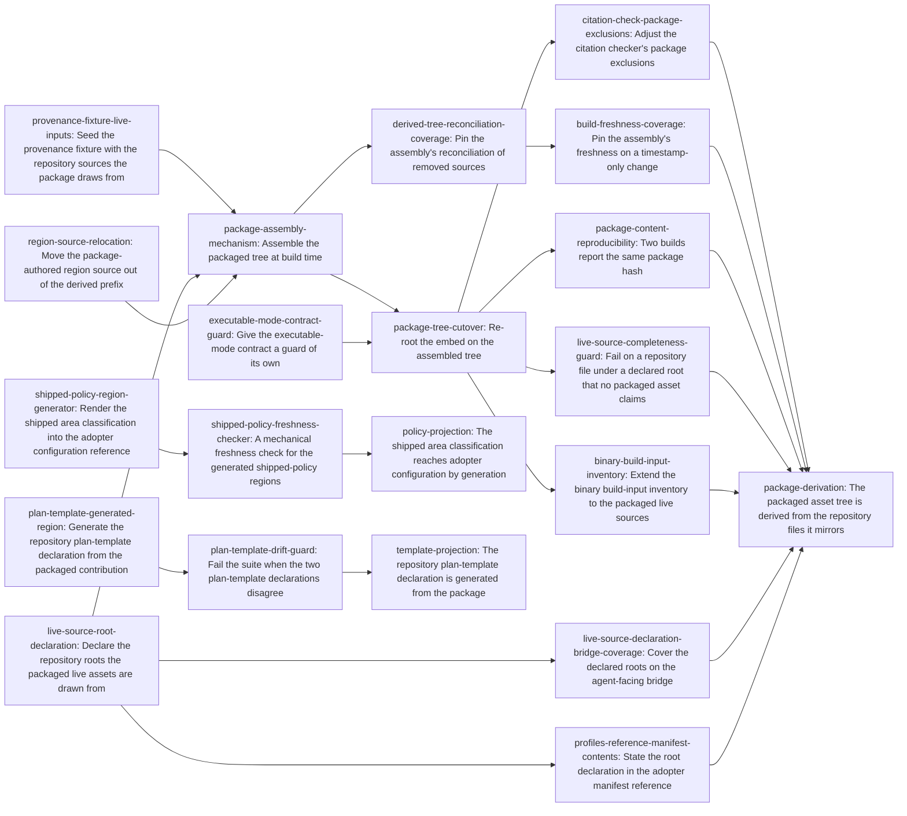

# Plan: Derived profile assets and projected policy documentation (e204e63d)

> Planning node: 7eecace8. Authoritative graph:
> [breakdown.json](breakdown.json).

Three facts exist as two copies each. Two of them are small and independent —
a documentation table and a template declaration — and each is closed by one
generator plus one freshness check. The third is the packaged asset tree, and it
is not a projection problem at all: it is a build-system change with three
consequences nothing in the repository observes today. That asymmetry sets the
shape of the work. The two projections land first and cost one rebuild between
them. The packaging chain lands last, forces a full rebuild and reinstall for
everyone, and is sequenced so the irreversible step — retiring the checked-in
copies — is taken only after the tree that replaces them has been compared
against them file for file.

## Outcome and criterion approach

| Criterion | Approach | Evidence / open gap |
|---|---|---|
| REQ-01 | The shipped classification reaches both adopter files through the initialization code path — a throwaway repository initialized in a temporary directory, whose scaffolded table is spliced into a marked region in each. Reading the effective configuration is rejected by construction: it reports this repository's local policy plus a key the shipped constant does not carry, and the dogfooding boundary forbids it as a source for adopter prose. Freshness is a member of the deterministic documentation-check family, in the configured-target shape rather than the footprint-taking one, since its two targets are named facts. | C6, C7, C8, Q6, S3.5, S7.4 |
| REQ-02 | Direction first: the packaged contribution is shipped content and the repository declaration is a local consumer, so the package is the authority and the repository copy becomes a generated region. Rendering and guarding are separate terminals, because they are separately true: generation makes the two equal once, and only a comparison keeps them equal afterwards. The guard is what REQ-02 literally asks for — two parsed declarations compared field for field, so it holds even where the generator was bypassed, and it carries no expectation of its own, which would be a third copy. The contribution is already exposed whole through the package's machine-readable inspection output, so no new surface is added. The one piece of genuine repository knowledge inside the block, the rationale for the container anchor's whole-repository gate, moves above the markers; no serializer in this workspace preserves in-block commentary or column alignment. | C4, C5, Q4, S3.2, S7.4 |
| REQ-03 | Everything separable is separated out ahead of the one step that cannot be, so the irreversible move is taken against evidence rather than against a claim. Two preparations stand alone and land first: the package-authored region source moves out of the prefix that marks files mirroring a repository counterpart, because it is the single element making that rule false and any step reading the prefix as a rule would have nothing to draw it from; and the executable-mode check becomes an assertion in its own right while the comparison it currently shares a loop with is still effective, so the only such contract in the workspace is never unguarded for a revision (Q1 — the embedding carries no mode metadata, so nothing recovers it implicitly). Then the build script produces the tree while the checked-in copies remain, which makes the equality of the two an observable intermediate state. Then the indivisible transition: the embed re-roots and the copies retire together, because either alone leaves a tree that does not build. Last the citation checker's package exclusion is re-derived against the directory that remains. Two properties make the production step more than a copy and are contract-level rather than incidental: reconcile the owned subtree, and write only on a byte difference. The fixture that bans this repository's tracker data root from its seeded repository is edited before any of it, because one packaged source lives under that root. | C1, C3, C10, Q1, Q2, Q3, S3.1, S3.2, S3.3, S3.4, S4.1, S8.3, S8.5 |
| REQ-04 | Read as D-5 states it, with one term fixed so two entries cannot mean different things by it: *package hash* is the digest the binary reports over the manifest and every embedded path, and it is the cross-build comparison. Two builds under identical injected environment report the same hash and the same provenance, extended from the existing two-build comparison rather than written fresh. That same hash is deliberately **not** the before-and-after comparison across the cutover, because the manifest changes there and the hash must move; the produced tree is compared against the checked-in one file for file instead, while both still exist. Comparing produced executable bytes is rejected — this workspace has no such property today for unrelated reasons, so the criterion would expand into a reproducible-builds effort. The ordering half is guaranteed by cargo rather than arranged, and is observed as a cold build from an empty output directory embedding the complete declared inventory. | D-5, Q3, Q10, S4.5, S8.1 |
| REQ-05 | The manifest gains an additive declaration of the roots its live assets are drawn from, each with glob exclusions, and a walk over those roots reports an undeclared, unexcluded tracked file. Patterns rather than literals is forced by measurement: thirty-five files under the script and contributed-gate roots are deliberately unpackaged, and listing them is the hand-maintained inventory the check exists to remove. The declaration is data in the package rather than a literal in engine code, which also gives the build script its watch set. Its two public consequences are separate terminals rather than clauses inside it, because each lands in a different workspace under a different toolchain: the agent-facing bridge's assertion that the reported manifest carries the declaration, and the adopter reference whose hand-written enumeration of the manifest's contents the addition makes incomplete. | C2, Q5, D-2, D-6, S3.6, S4.1, S7.1, S7.2 |
| REQ-06 | The inventory grows to what the assembly actually reads, at a granularity that neither misses a packaged source nor claims a root wholesale. The over-claim hazard covers all three directory roots, not just the script one: the skill tree is 52 of 107 files unpackaged and the contributed-gate directory 3 of 4, and the predicate matches by prefix, so rolling any of them up marks the binary stale on edits that do not change it. Honest coverage is therefore near-per-file — roughly sixty entries — which is tolerable only because a reconciliation test living outside the layer binds the list to the packaged declarations, so a newly packaged source fails until the inventory covers it and a hand-maintained sixty-path list is never trusted on its own. It stays a pure path predicate in its present layer. | C9, Q5, S4.4, S6 |

## Shared architectural contracts

### `live-source-declaration` [implementation-produced] — The declared roots and their exclusions

The manifest carries one entry per repository root the packaged live assets are
drawn from, each with its own glob exclusion patterns, as an additive change to a
wire shape that rejects unknown keys and is public through the package's
machine-readable inspection output and the agent-facing bridge over it (S3.6).
Roots and patterns are constrained token types rejected where the manifest is
parsed, not free strings interpreted by each consumer. The declaration exists
because two consumers need the root set and neither can derive it: the build
script needs directories to watch, and the completeness walk needs a domain.
The managed-region source and every install-only asset *source* fall outside
every root, so a root never claims a package-authored file. One install-only
*target* path does lie inside a declared root; where such a target exists in a
repository it is unpackaged material like any other and a declared exclusion
covers it.

### `derivation-reader-boundary` [plan-fixed] — What the build script is allowed to know

A build script cannot import the crate it builds, so anything it parses is a
second reader of the same file — the exact class of duplicate this container
removes. The boundary: the build script reads the manifest's asset source and
target pairs and the declared roots, through a narrow build-dependency, and
nothing else. It performs no manifest validation, interprets no contribution or
region, and enforces no correspondence. Tree-to-manifest correspondence stays
with the runtime package model, which already rejects a declared source that is
absent and a package file that is undeclared (S6, S8.4). A divergence between the
two readers therefore surfaces as a package-validation failure rather than
silently, and the duplicated surface is two field names rather than a model.

### `derived-tree-reconciliation` [plan-fixed] — The assembly owns a subtree, not a copy step

The assembly owns exactly the package subtree under the build output directory
and maintains two properties there. It writes a destination only when the bytes
differ from the source, because the directories it watches are compared by
timestamp and a branch switch reruns it on unchanged content; an unconditional
rewrite relinks every test target, which is the regression an earlier change
removed from this build script and which the build-footprint budget does not
measure (Q2, Q8, S7.3). And it removes a file in that subtree the manifest no
longer declares, because the directory is not reset between builds, so a deleted
or renamed consumer otherwise lingers and ships (Q3, S8.3). Neither property is
observable by building forward, and they fail in different ways under different
mutations, so each is pinned by its own assertion in the seeded repository that
builds, mutates, and rebuilds. Both observe the produced tree rather than the
reported package, so neither waits on the embed being re-rooted.

### `generated-region-splice` [plan-fixed] — How a generated region replaces authored text

A generated region is bounded by markers written in the target file's own comment
syntax, and everything outside the markers is preserved byte for byte —
authored prose, comments, and unrelated tables alike. Commentary that must
survive lives outside the markers; nothing inside them is authored. The
repository's byte-preserving managed-document renderer takes arbitrary
delimiters and is format-agnostic, so it serves the template region directly
(Q4). The documentation regions are spliced in shell by their own generator, for
a reason of reach rather than of cost: that splicer is a library function with no
command-line entry point, neither region is expressible as a configured
projection — that surface binds to addressable item kinds and every body renderer
it has emits markdown (Q4, S5) — and D-4 rejects adding a command, so a shell
generator has no route to it and must splice in shell. Nothing is saved on the
binary-dependency axis and nothing needs to be: the documentation-check family
already requires the compiled binary and derives its own footprint from it, and
D-4's throwaway-repository step adds that dependency regardless of who splices.
Both regions use the same marker shape.

### `shipped-policy-authority` [plan-fixed] — Where the adopter documentation values come from

The three area lists reach both adopter documents only through what repository
initialization writes into a throwaway directory. The effective-configuration
report is not a source: it carries a key the shipped constant does not have and
its values come from this repository's own table, which agrees today by a
hand-maintained claim rather than by binding (C7). This repository's own
configuration is not a source either, for the same reason the dogfooding boundary
gives. A new command printing the shipped policy is rejected as adopter-visible
surface whose only consumer is this repository's documentation pipeline; that
rejection stands on D-4's own reasoning and is consistent with the charter's
scope decision for this release (S3.5).

The authority this route reaches is the initialization code path *as built into
the binary in use*, not the declaration at the current revision — initialization
takes no path argument, so the generator runs it in a temporary directory and
reads what that binary produces. Nothing in the pipeline notices the difference
on its own: the repository's stale-binary refusal identifies a repository by
resolving a revision in it, and a throwaway directory has none, so the refusal is
silent there even under a gate. That last step was established during plan review
rather than by the investigation, which locates the mechanism (S4.4) without
analysing this case.

Silence is therefore not evidence of currency, and the check has to be positive
rather than an absence of complaint. An unknown build commit, an unresolvable
head, and a build commit outside the repository's history all resolve to the same
not-applicable outcome as a genuinely current binary, and a binary built without
injected provenance reports exactly that — so "nothing was reported" is the
default rather than a verdict. Both the generator and the checker therefore
establish the condition themselves, against the repository they are writing into
or checking, and fail closed on anything short of a resolved, current provenance.
Without that, an unreinstalled binary produces a region that is stale and
internally consistent — a second generator run is a no-op, and the checker,
running the same binary, agrees with it.

### `completeness-walk-rule` [plan-fixed] — What the omission check asks and of what

The walk enumerates the repository-tracked files beneath each declared root and
reports one that is neither a declared packaged asset nor matched by a declared
exclusion. Tracked rather than present, so a contributor's scratch file is not a
packaging defect. The workspace's established repository-inventory idiom lists
untracked non-ignored paths alongside tracked ones, which is the opposite
property, so an implementer must take the tracked-only listing rather than copy
that idiom's flag set. A run that cannot obtain the listing fails rather than
passing on an empty set, which is the vacuity this route otherwise risks (Q5).
Exclusions are globs over
repository-relative paths and describe categories — evaluation harnesses,
fixtures, transcripts, this repository's own scripts, review prompts — rather
than individual files, so material of the same shape needs no new entry.

### `build-input-inventory-binding` [plan-fixed] — A path list checked against its authority

The build-input inventory stays a pure path predicate in the layer that must
remain free of input and output; extending it introduces no filesystem access
there (S6). A path list mirroring the packaged assets is another hand-maintained
copy, so its correctness is asserted from outside that layer, by a test that
reconciles every packaged live-asset target against the predicate. The layer
keeps its inbound-only dependency direction, and a newly packaged source fails
the test until the inventory covers it.

The list also ships. It is a compile-time constant in the adopter binary, and the
predicate is evaluated against whatever repository that binary is validating, so
its entries are repository-shaped facts about this project's own checkout
travelling inside shipped code. Nine such entries are there today, one of them
naming the packaged tree; afterwards roughly sixty name this project's skill,
script, contributed-gate and reference layout. It is
inert in an adopter's tree, because the provenance assessment reports
not-applicable unless the binary's build commit is in that repository's history;
staying silent rather than warning someone validating an unrelated repository is
the documented intent. That inertness rests on the predicate rather than on what
the list contains, so this change widens an exposure that already exists rather
than creating one (S7.1).

## Generated decomposition overview

<!-- jit:breakdown-overview:begin -->
| Key | Title | Type | Outcome | Contracts | Sources | Footprint | Landing | Depends on |
|---|---|---|---|---|---|---|---|---|
| shipped-policy-region-generator | Render the shipped area classification into the adopter configuration reference | task | The two adopter configuration files carry the shipped area classification as a generated region rather than authored prose. | generated-region-splice, shipped-policy-authority | REQ-01, D-3, D-4, C6, C7, C8, S3.5, S4.3, S4.4, S7.4 | creates 1, touches 2 | policy-docs | — |
| shipped-policy-freshness-checker | A mechanical freshness check for the generated shipped-policy regions | task | A stale generated policy region in either adopter configuration file fails the mechanical documentation checks. | shipped-policy-authority | REQ-01, D-4, C8, Q6, S4.4, S7.2 | creates 1, touches 4 | policy-docs | shipped-policy-region-generator |
| plan-template-generated-region | Generate the repository plan-template declaration from the packaged contribution | task | The repository plan-template block is a region rendered from the packaged declaration. | generated-region-splice | REQ-02, D-1, C4, C5, Q4, S3.2, S7.4, S8.6 | touches 2 | template-region | — |
| plan-template-drift-guard | Fail the suite when the two plan-template declarations disagree | task | A difference between the parsed repository declaration and the parsed packaged declaration fails the suite. | — | REQ-02, D-1, C4, C5 | touches 1 | template-region | plan-template-generated-region |
| provenance-fixture-live-inputs | Seed the provenance fixture with the repository sources the package draws from | task | The provenance fixture repository carries the packaged live sources, so a cold build inside it succeeds. | — | REQ-03, Q10, S5 | touches 1 | package-cutover | — |
| package-assembly-mechanism | Assemble the packaged tree at build time | task | The build script produces the packaged tree in the output directory, matching the checked-in tree it will replace. | live-source-declaration, derivation-reader-boundary, derived-tree-reconciliation | REQ-03, D-2, C3, C10, Q1, Q2, Q3, S3.1, S3.4, S8.3 | touches 4 | package-assembly | provenance-fixture-live-inputs, live-source-root-declaration, region-source-relocation |
| region-source-relocation | Move the package-authored region source out of the derived prefix | task | The managed-region source sits outside the prefix reserved for files drawn from repository counterparts. | derived-tree-reconciliation | REQ-03, C1, Q1, S3.2 | creates 1, touches 2 | package-assembly | — |
| executable-mode-contract-guard | Give the executable-mode contract a guard of its own | task | A standalone assertion checks each declared live asset's executable flag against its repository file's mode. | — | REQ-03, C1, Q1 | touches 1 | package-assembly | — |
| package-tree-cutover | Re-root the embed on the assembled tree | task | The binary embeds the produced tree, and the duplicated copies are gone from the repository. | live-source-declaration, derived-tree-reconciliation | REQ-03, C1, C3, Q1, S3.1, S3.3, S4.5 | touches 3 | package-cutover | package-assembly-mechanism, executable-mode-contract-guard |
| citation-check-package-exclusions | Adjust the citation checker's package exclusions | task | The citation checker's package exclusions describe the package directory that remains. | — | REQ-03, S4.1, S8.5 | touches 1 | package-cutover | package-tree-cutover |
| derived-tree-reconciliation-coverage | Pin the assembly's reconciliation of removed sources | task | A live consumer removed from the repository is absent from the tree the next incremental rebuild produces. | derived-tree-reconciliation | REQ-03, Q3, S8.3 | touches 1 | derivation-coverage | package-assembly-mechanism |
| build-freshness-coverage | Pin the assembly's freshness on a timestamp-only change | task | A rebuild after a timestamp-only change beneath a watched root relinks no test target. | derived-tree-reconciliation | REQ-03, Q2, Q8, S7.3, S8.2 | touches 1 | derivation-coverage | derived-tree-reconciliation-coverage |
| package-content-reproducibility | Two builds report the same package hash | task | Two builds from identical sources under identical injected environment report the same package hash and provenance. | — | REQ-04, D-5, Q3, Q10, S4.5, S8.1 | touches 1 | derivation-coverage | package-tree-cutover |
| live-source-root-declaration | Declare the repository roots the packaged live assets are drawn from | task | The package manifest declares each live-source root with the exclusion patterns that bound it. | derivation-reader-boundary, completeness-walk-rule | REQ-05, D-2, D-6, C1, C2, Q5, S3.6, S7.1 | touches 5 | package-assembly | — |
| live-source-declaration-bridge-coverage | Cover the declared roots on the agent-facing bridge | task | The bridge's coverage observes the root declaration in the manifest it reports. | live-source-declaration | REQ-05, S3.6, S4.1 | touches 1 | package-assembly | live-source-root-declaration |
| profiles-reference-manifest-contents | State the root declaration in the adopter manifest reference | task | The adopter reference describing what the manifest carries accounts for the declared roots. | live-source-declaration | REQ-05, S4.1, S7.2 | touches 1 | package-assembly | live-source-root-declaration |
| live-source-completeness-guard | Fail on a repository file under a declared root that no packaged asset claims | task | An undeclared, unexcluded file under a declared live-source root fails the suite. | live-source-declaration, completeness-walk-rule | REQ-05, D-6, C2, Q5, S7.1 | touches 2 | package-cutover | package-tree-cutover |
| binary-build-input-inventory | Extend the binary build-input inventory to the packaged live sources | task | Editing a packaged live source reports a binary installed before that edit as stale. | build-input-inventory-binding | REQ-06, C9, Q5, S4.4, S6 | touches 2 | package-cutover | package-tree-cutover |
| policy-projection | The shipped area classification reaches adopter configuration by generation | story | Both adopter configuration files carry the shipped classification as a generated region, with staleness reported mechanically. | shipped-policy-authority, generated-region-splice | REQ-01, D-3, D-4, C6, C7, C8, Q6, S3.5, S7.2, S7.4 | — | — | shipped-policy-freshness-checker |
| template-projection | The repository plan-template declaration is generated from the package | story | The repository plan-template declaration is generated from its packaged authority, with divergence failing the suite. | generated-region-splice | REQ-02, D-1, C4, C5, Q4, S3.2, S7.4, S8.6 | — | — | plan-template-drift-guard |
| package-derivation | The packaged asset tree is derived from the repository files it mirrors | story | The packaged tree is assembled at build time from declared roots, reproducibly, with omission and staleness both reported. | live-source-declaration, derivation-reader-boundary, derived-tree-reconciliation, completeness-walk-rule, build-input-inventory-binding | REQ-03, REQ-04, REQ-05, REQ-06, D-2, D-5, D-6, C1, C2, C3, C9, C10, Q1, Q2, Q3, Q5, Q8, Q10, S3.1, S3.2, S3.3, S3.4, S4.1, S4.4, S4.5, S7.1, S7.3, S8.1, S8.2, S8.3 | — | — | citation-check-package-exclusions, build-freshness-coverage, package-content-reproducibility, live-source-completeness-guard, binary-build-input-inventory, live-source-declaration-bridge-coverage, profiles-reference-manifest-contents |

<!-- jit:breakdown-overview:end -->

## Material risks and owner decisions

| Risk / decision | Resolution and rationale |
|---|---|
| **D-1 — the template pair's direction** | Chosen: the packaged contribution is the authority and the repository declaration becomes a generated region, with the suite comparing the two parsed declarations. Rejected: synchronizing the three divergent description strings and guarding deep equality of two hand-edited copies, which leaves both hand-maintained; guarding structure alone and letting descriptions diverge, which leaves REQ-02 unmet by construction. |
| **D-2 — the packaged inventory's shape** | Chosen: keep the explicit per-file asset declaration and add a declared root-and-exclusion list that turns omission into a failure. Rejected: include and exclude globs replacing the inventory, because a missed exclusion over-packages an adopter install, which is worse than the omission it prevents. |
| **D-3 — how much of the example file becomes generated** | Chosen: only its area-classification table, with the present illustrative subset giving way to the table a fresh repository receives; the rest stays hand-authored. Rejected: replacing the whole file with the initialization scaffold, which would add and remove unrelated tables for reasons this work does not decide. |
| **D-4 — how the shipped policy is read** | Chosen: a repository-local generator that initializes a throwaway repository and reads the table the shipped path wrote there, with a mechanical freshness check. Rejected: a new command printing the shipped policy, which adds adopter-visible surface for one internal consumer; a projection over a new item kind, which would need a source mode for a compiled constant that no declared kind has. |
| **D-5 — what REQ-04 observes** | Chosen: embedded package content plus reported provenance, compared across two builds. Rejected: comparing produced binary bytes, because the workspace has no such property today for unrelated reasons — absolute paths reach debug information — so the criterion would expand into a reproducible-builds effort this container does not scope. |
| **D-6 — how much of the live surface is completeness-checked** | Chosen: every declared root, with glob exclusions. Rejected: checking only the skill root, which leaves six packaged assets uncovered; one root per skill, which relocates the same omission risk one level up; path-literal exclusions, since thirty-six literals are themselves a hand-maintained inventory. |
| **Superseded: build-time generation was rejected once** | An earlier epic rejected a build script that generates this tree into the build output directory as "bespoke recursive traversal, escaping, deterministic ordering, change tracking and generated-output tests… not justified for one small data tree" (S3.1). That judgment is superseded, not filled in: the cost it priced has since been paid twice over in hand maintenance, two blocked reviews, and a one-directional guard, and the complexity it feared is now bounded by `derivation-reader-boundary` and `derived-tree-reconciliation`. |
| **Superseded: the package was made the authority** | The same epic made the package the authority and the working paths its rendered consumers; the shipped code still says so, in the drift assertion's message and in the manifest's own comment (S3.2). The renderer that decision assumed was never built, so what shipped is a hand-maintained duplicate plus an equality assertion. REQ-03 reverses the direction for assets. **The resulting asymmetry is deliberate and stated here so it does not read as inconsistency**: the package is the authority for the template declaration, because that declaration is shipped content the repository consumes, and the repository is the authority for the file assets, because those files are what contributors actually edit. |
| **Ordering: two projections first, the packaging chain last** | The manifest carries no edge between the projection work and the packaging chain, because no artifact of one is an input to the other. The wave order is nonetheless deliberate: REQ-03 changes a declared build input, so it forces a full rebuild and a reinstall for everyone, and landing it last confines that cost to one point. Within the chain, every prerequisite that would otherwise leave a broken or unguarded intermediate state carries a real edge rather than a shared landing group. Three roots precede the tree production: the fixture's input filter, the root declaration, and the region-source relocation — the relocation sits before the production rather than merely before the re-rooting, because the production reads the prefix as a rule and the region source is the one file that makes the rule false. The mode-contract guard is a fourth root and precedes the re-rooting, so it is effective while the comparison it replaces still is. The re-rooting follows the production, so the equality of the two trees is established while both exist. The citation-exclusion adjustment follows the re-rooting, because only then does the package directory have its final shape, and the build-input inventory follows it too, because before it the added paths would report a binary stale that did not change. One weak coupling exists without an edge and is handled by construction: the two scripts the policy story creates land under the declared script root, so the completeness walk's exclusion patterns must cover them. That pattern is written over this repository's own documentation-generation and check scripts as a category, so it holds whichever order the two land in. |
| **Shared-file concurrency** | Six files carry more than one writer, and edges order most of them. The package manifest is written by the root declaration and the region relocation, then the re-rooting, then the completeness walk; the derived prefix by the relocation, then the re-rooting; the crate manifest and lock file by the root declaration, then the tree production; the seeded-repository stability suite by the reconciliation assertion, then the freshness assertion. The manifest's first two writers are the only unordered pair among those, and they edit different declarations in it — one a source path, the other a new section. The exposure is the dogfood module's test region, with seven writers. Its unordered pairs are the template region against the template guard's successors and against every packaging writer; the mode guard against the tree production; and the completeness walk against the inventory reconciliation, siblings behind the re-rooting. Each writer occupies its own test: the template pair sits in the template region, the mode guard adds a standalone assertion, the production adds the two-tree comparison, the re-rooting retires the assertion those replaced, and the walk and the reconciliation each add one test at the module tail. No two touch the same lines, so their patches compose in any order while still wanting a serialised merge. Everything else is single-writer by construction. |
| **Open: branch-switch relinking is unmeasured here (S8.2)** | The mechanism is sound in principle but was never measured in this workspace. It stays open and is converted into an assertion rather than an assumption: a terminal of its own pins a timestamp-only change beneath a watched root as relinking no test target. It is a separate leaf from the reconciliation assertion because the two fail under different mutations and say different things. If the measurement contradicts the mechanism, the fix is in the tree production rather than in the criterion. |
| **Open: the citation checker's package exclusion (S8.5)** | Whether removing the derived prefix from the tree changes what the checker's package exclusion protects was not determined. It is cheap to settle once the package directory has its final shape, so it is its own terminal behind the re-rooting rather than a clause inside it or a separate investigation. |
| **Open: two further template declarations, out of scope (S8.6)** | Two adopter-facing example rulesets declare their own plan template. Both carry this repository's top-level description string verbatim; one also carries its planning-node description. They illustrate authoring forms for different rulesets, not this repository's workflow; D-1 names only the repository registry and REQ-02 does not reach them. Stated here to pre-empt reading REQ-02 as incompletely satisfied. |
| **Open: the git hooks are not installed (S8.7)** | Neither hook is installed in this checkout and no hook path is configured. No entry in this manifest relies on a hook to enforce anything, so the gap changes nothing here; it remains a standing repository condition. |
| **A residual copy this container does not remove** | This repository's own configuration carries a third hand-maintained copy of the three area lists, claiming to adopt the shipped classification verbatim with nothing binding it (S7.2). It is repository-local policy rather than adopter documentation, so REQ-01 does not reach it and this work does not expand to it. The two enumerations this work *does* make stale are assigned: the documentation-check family's own member list, and the adopter reference describing what the manifest carries. |
| **Glob matching has no incumbent** | The workspace has no glob dependency, and the entry that consumes pattern matching is not the one that can add it. The matcher is owned by the root declaration, which needs it first and for its own reason: rejecting a malformed pattern at parse time means compiling it there. The completeness walk then consumes the compiled patterns and adds no dependency of its own; the build script needs none at all. A dependency-free matcher crate confined to pattern matching is preferred over hand-rolling, and either choice must leave the build-footprint budget's dependency-policy assertions untouched. The workspace lock file is in the owning entry's footprint so the addition has a declared home. |
| **One integration-test target slot remains** | Eleven of twelve are used (Q8). Every guard this plan adds lands in an existing suite or in the module that already hosts the packaging tests; no entry creates an integration-test target, and none should be added without spending the last slot deliberately. |

## Investigation sources

- [Investigation](investigation.md) —
  `dev/active/e204e63d-derived-package-sources/investigation.md`. The exhaustive
  consumer inventories, the per-root undeclared file counts, the manifest and
  template diffs, and the primitive-verification table all remain there.

Source ids resolve inside that report: `C1`–`C10` are the claim classifications
in section 1, `Q1`–`Q10` the answers in section 2, and `S<n>.<m>` the numbered
item `m` under section `n` — so `S3.4` is the fourth recorded decision in the
prior-art sweep and `S8.2` the second open risk. `S5` and `S6` name sections 5
and 6 as wholes.
