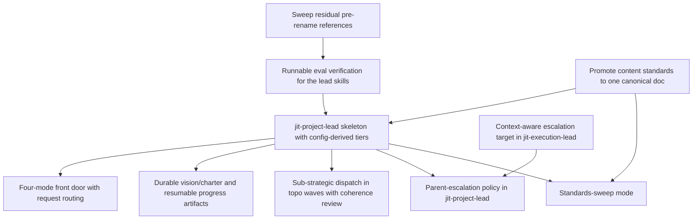

# Plan: jit-project-lead skill: milestone-level vision steward above the epic lead (f2532a2d)

> Planning node: 8f5de6bc. Container criteria source: f2532a2d `## Success Criteria`.

## 1. Completeness vs criteria

Approach per `[hard]` criterion, in prose. The criterion→item contract lives once, in the
§3 coverage map; this table is the narrative only.

| Criterion | Approach (how it is met) | Notes / open gap |
|---|---|---|
| REQ-01: config-derived skill skeleton, no hardcoded domain types | Add `.agents/skills/jit-project-lead/` with a thin orchestrator `SKILL.md` and role prompts in `references/`. Tier derivation rule, covering one, two, and more strategic tiers. **Delegation boundary** (the containers the steward dispatches an execution lead for) = the union of `applies_to` across `[[template]]` entries in `.jit/templates.toml`; observed: `epic` (this repo, `.jit/templates.toml:12`) and `goal` (research example, `docs/examples/research/templates.toml:18`). **Steward anchor** = the most-strategic tier in `strategic_types` (`.jit/config.toml:31`, the declaration `jit query strategic` consumes; read from the config file, since `jit config show-hierarchy --json` returns only the type→level map and `jit config get` cannot read it). Two-tier case (this repo, milestone > epic): anchor on the top container, delegate its breakable children. Collapsed case (research example: `strategic_types = ["goal"]`, `docs/examples/research/config.toml:34`, identical to the breakable type): the steward's scope is the portfolio of top-level strategic containers, one execution lead per breakable strategic container, vision/charter still project-wide. More-than-two tiers: anchor at top; delegation boundary still the `applies_to` union. Fallbacks: missing `templates.toml` or empty `strategic_types` → numeric-level heuristic over the `--json` type→level map; genuine ambiguity (level ties among candidates) → stop and ask. Prose names tiers as "strategic tier"/"sub-strategic tier" placeholders (the `<planning_type>` precedent, jit-execution-lead `SKILL.md:126,150`), never `milestone`/`epic`/`goal` literals. | The 500-line budget is tighter than "existing leads fit" implies: execution-lead spends 358 lines on less scope. Overrun trigger and extraction plan in §4. Residual derivation assumptions in Assumptions. |
| REQ-02: four invocation modes + routing | `SKILL.md` front door classifies the opening request into: (1) lead existing strategic work, (2) plan-and-execute a vague goal, (3) steering discussion, (4) standards sweep. Mode 1 ships fully. Modes 2/3 call `jit-planning-lead` (Step 2 interview + Step 5 recursion) at strategic altitude; mode 4 calls the sweep path. | Modes 2/3 consume eed6750c (jit-planning-lead), which is InProgress; ship mode 1 first per Non-goals. |
| REQ-03: durable vision/charter + resumable progress | Vision/charter doc (vision + first-class decision log of chosen/rejected options with reasons) lands under `permanent_paths = ["docs/"]`; the milestone-level progress file lives at `dev/active/<milestone-short-id>-progress.json`, a one-tier-up analogue of `dev/active/7095769d-progress.json` (per-epic rows instead of per-issue). Both attach to the milestone via `jit doc` and persist across sessions. | Locations are deliberate. The vision must outlive completion, so `docs/` is configured as permanent. The progress file is operational state meaningful only while the milestone is active, so `dev/active` (a managed path) is acceptable: archival after completion is the correct end of its life, and the durable record already lives in `docs/`. |
| REQ-04: dispatch epic lead in topo waves + coherence review | Mode 1 computes waves from `jit graph deps <milestone>` grouped by dependency depth (the hand-layering jit-execution-lead already does, `SKILL.md:146-172`), dispatches `jit-execution-lead` as a subagent per sub-strategic container, and runs a cross-container coherence review (one-tier-up analogue of `lead-review-protocol.md:92` Tier 3) before accepting each. Dispatched subagent invokes its own canonical scripts; no fork. | No topo/wave CLI primitive exists; layering is done by the skill. |
| REQ-05: parent-escalation policy + context-aware target | Change jit-execution-lead's escalation target from hardcoded human ("the user", `escalation-policy.md:14` and SKILL wording sites) to "the invoker": human when standalone, parent lead when nested. jit-project-lead adds a parent-escalation policy that resolves subordinate escalations against the vision/decision log and escalates to the human only for vision conflicts, cross-strategic-container dependencies, or project-wide infrastructure changes. | Default invoker = human preserves current standalone behavior; the change is additive. |
| REQ-06: canonical standards + sweep audit | Promote the content standards to the canonical home **`docs/reference/jit-content-standards.md`** (versioned, permanent per `permanent_paths = ["docs/"]`, in the existing `docs/reference/` Diataxis area). Both existing copies (jit-manage and jit-planning-lead `references/content-standards.md`) are removed in the same change and every consumer switches to a direct skill-base-relative path reference to the canonical doc; reachability argument in §2. Mode 4 audits the project against it, auto-fixing mechanical violations (title metadata, missing markers) and surfacing judgment ones. | Decision final (D3); consumer list enumerated in the Group B item. |
| REQ-07: rename complete, evals pass, activation | Rename dirs/symlinks/most refs are already done (commit 751da7f5); sweep the 9 residual live hits (verified by grep; listed in §3 Group A) within the live scope the §3 acceptance check defines. Make "activate from their descriptions and pass their evals" verifiable on two axes. (a) Scenario-eval adjudication: jit-execution-lead's 3 evals grade against free-text `expected_output` with no runner in-repo, so define the adjudication method (LLM-judge against the `expected_output` rubric with recorded transcript and verdict, or convert `expected_output` to assertable checklists), record a passing baseline, and give jit-planning-lead an equivalent eval set. (b) Activation verification: trigger evals for both renamed skills and the new skill via the skill-creator plugin's trigger-eval runner (`run_eval.py` consuming a `trigger_eval.json`) or a documented equivalent check. | Both axes were unverifiable at plan time; the verification work is load-bearing and scoped in §4 to avoid runner scope creep. |

## 2. Technical soundness and architectural fit

- **Approach:** A skills-only addition (markdown + shell), one strategic tier above
  jit-execution-lead. It reuses existing CLI-exposed primitives and existing skill
  protocols; it reaches into no `crates/jit` domain/storage/graph code. It is compositional:
  jit-project-lead dispatches jit-execution-lead as a subagent, never re-implementing epic
  execution (Non-goals).

- **Reuses / integrates with:**
  - Tier derivation: `strategic_types` at `.jit/config.toml:31` (consumed by `jit query
    strategic`); breakable-container types from `applies_to` in `.jit/templates.toml:12`;
    `jit config show-hierarchy --json` for the type→level map; `[type_hierarchy]` at
    `.jit/config.toml:24-31`. Divergent ruleset exercised: `docs/examples/research/config.toml:34`
    (`strategic_types = ["goal"]`) with `docs/examples/research/templates.toml:18`
    (`applies_to = ["goal"]`).
  - Dispatch: `.agents/skills/jit-execution-lead/scripts/dispatch-worker-worktree.sh` and
    `.../scripts/check-leak-into-main.sh`, documented canonical-copy-only in
    `references/worktree-dispatch-protocol.md` (subagent invokes them; no fork).
  - Waves: `jit graph deps <id>` hand-layered per jit-execution-lead `SKILL.md:146-172`.
  - Coherence review: `references/lead-review-protocol.md:92` (Tier 3), `:57`
    (stale-forward-reference sweep), a one-tier-up analogue.
  - Escalation: single locus `references/escalation-policy.md:14` plus SKILL wording sites.
  - Artifacts: `jit doc add/list/show/history` for linking; progress shape from
    `dev/active/7095769d-progress.json`; documentation config at `.jit/config.toml:9-14`.
  - Cold-start: jit-planning-lead Step 2 interview + Step 5 recursion; milestone containers
    fall back to jit-breakdown's plain-breakdown path (`jit-breakdown/SKILL.md:105-109`)
    since `.jit/templates.toml:12` binds the only template to `["epic"]`.
  - Standards: canonical-ish `jit-manage/references/content-standards.md` (168 lines),
    referenced by `jit-execution-lead/references/doc-agent-prompt.md:42`,
    `architect-agent-prompt.md:37`, `jit-breakdown/references/analysis-prompt.md:106`;
    byte-identical duplicate at `jit-planning-lead/references/content-standards.md`.
    Canonical home after promotion: `docs/reference/jit-content-standards.md`.
    Cross-project reachability: every jit entry in `~/.agents/skills` is a per-skill
    symlink into this repo's `.agents/skills` (verified `ls -la ~/.agents/skills`), so a
    skill file's physical location after symlink resolution is
    `<this-repo>/.agents/skills/<skill>/...`, and a skill-base-relative traversal
    (`../../../docs/reference/jit-content-standards.md` from the skill dir, one level
    deeper from `references/` files) resolves inside this repo even when the skill is
    entered from another project (verified:
    `realpath ~/.agents/skills/jit-execution-lead/../../../docs/reference` →
    `/home/vkaskivuo/Projects/just-in-time/docs/reference`).

- **Grounding (from investigation), classified:**
  - Rename → **partially already-done**: dirs/symlinks/most refs done (751da7f5); 9 residual
    live hits remain (jit-execution-lead `SKILL.md:14` `# Project Lead`; jit-planning-lead
    `SKILL.md:9` `# JIT Plan` and `:11` "a complete jit plan"; both scripts line 2
    `# Project-lead utility:`; `dev/active/eed6750c-handoff.md:1,7,44,48`, of which line 48
    `.agents/skills/jit-plan/` is the operationally load-bearing pointer).
  - Eval-pass → **invalid-as-stated (unverifiable today)**: jit-execution-lead
    `evals/evals.json` has 3 scenarios but no runner in-repo; jit-planning-lead has no
    `evals/`. Plan makes it verifiable.
  - Config-derived tiers (REQ-01), four modes (REQ-02), durable artifacts (REQ-03),
    dispatch (REQ-04), escalation (REQ-05), canonical standards (REQ-06) →
    **valid-and-open**, primitives cited above exist.
  - Domain-agnosticism: engine hardcodes no domain type (`.jit/templates.toml` header
    comment; project-declared `type_hierarchy`). The divergent ruleset the derivation must
    handle is the in-repo research example: `docs/examples/research/config.toml:34` declares
    a single strategic type (`goal`) that is itself the breakable container
    (`docs/examples/research/templates.toml:18`), so no second strategic tier exists to
    derive. `../gf2` uses the same `milestone`/`epic` pair as this repo and adds no third
    shape.
  - Layer boundary: everything needed is CLI-exposed; skills-only change, consistent with
    AGENTS.md layering.

## 3. Decomposition sketch (near-ready; jit-breakdown instantiates — no issues created here)

Groups sized to the work; each independently landable, green at every boundary. Ordering is
the `depends-on` graph below, not prose.

### Group A: Rename completion and eval verifiability — covers REQ-07
- **Sweep residual pre-rename references**  `type: task`  `satisfies: REQ-07`  `depends-on: —`
  Outcome: no live pre-rename references remain; the 9 verified hits are corrected
  (jit-execution-lead `SKILL.md:14`, jit-planning-lead `SKILL.md:9,11`, both dispatch scripts
  line 2, `dev/active/eed6750c-handoff.md:1,7,44,48` in full).
  Own criteria: `[hard] REQ-A1: the acceptance check (below) returns zero hits over the live
  scope.`
  Blast radius: jit-execution-lead `SKILL.md`, jit-planning-lead `SKILL.md`, both dispatch
  scripts, `dev/active/eed6750c-handoff.md` (all 4 hits); historical records exempt per the
  acceptance-check rule, untouched.
- **Runnable eval verification for the lead skills**  `type: story`  `satisfies: REQ-07`  `depends-on: Sweep residual pre-rename references`
  Outcome: scenario evals are runnable with defined pass adjudication, both renamed skills
  have recorded passing baselines, and activation is verified by trigger evals.
  Own criteria:
  `[hard] REQ-A2: each renamed lead has scenario evals with a defined adjudication method
  (LLM-judge against the expected_output rubric with recorded transcript and verdict, or
  expected_output converted to assertable checklists) and a recorded passing baseline
  reproducible by a documented procedure.`
  `[hard] REQ-A3: both renamed skills have activation verification (a trigger_eval.json
  consumed by the skill-creator plugin's trigger-eval runner, or a documented equivalent
  trigger check) with recorded passing results.`
  Blast radius: `jit-execution-lead/evals/`, new `jit-planning-lead/evals/`, trigger-eval
  definitions; no engine change.

### Group B: Content-standards canonicalization — covers REQ-06
- **Promote content standards to one canonical doc**  `type: story`  `satisfies: REQ-06`  `depends-on: —`
  Outcome: `docs/reference/jit-content-standards.md` is the single physical standards doc;
  both copies (jit-manage and jit-planning-lead `references/content-standards.md`) are
  removed; every consumer carries a direct skill-base-relative path reference to it (direct
  references, not pointer stubs).
  Own criteria: `[hard] REQ-B1: one physical standards doc at
  docs/reference/jit-content-standards.md; no copy or stub remains; every consumer reference
  resolves to it, including when the skill is entered through the ~/.agents/skills symlink.`
  Blast radius (every reference, migrated in the same change): the two copies;
  `jit-execution-lead/references/doc-agent-prompt.md:42` and `architect-agent-prompt.md:37`;
  `jit-breakdown/references/analysis-prompt.md:106` and `SKILL.md:272,400`;
  `jit-manage/SKILL.md:278-282` and `references/design-doc-template.md:7`;
  `jit-planning-lead/SKILL.md:83`.

### Group C: jit-project-lead skeleton, tiers, modes, artifacts — covers REQ-01, REQ-02, REQ-03
- **jit-project-lead skeleton with config-derived tiers**  `type: story`  `satisfies: REQ-01`  `depends-on: Runnable eval verification for the lead skills, Promote content standards to one canonical doc`
  Outcome: the skill exists with a thin `SKILL.md` (under 500 lines) plus `references/`,
  derives steward anchor and delegation boundary from the project's config and templates
  (the §1 REQ-01 rule), hardcodes no domain type name, activates from its description, and
  passes its evals.
  Own criteria: `[hard] REQ-C1: skill activates from its description (verified with the
  Group A trigger-eval mechanism); SKILL.md under the budget; tiers resolved from config with
  zero hardcoded type literals; evals pass under the Group A adjudication method; the
  derivation yields correct anchor and delegation boundary on both observed rulesets, the
  two-tier .jit/config.toml and the collapsed single-tier docs/examples/research ruleset
  (strategic type equals the breakable type).`
  Blast radius: new `.agents/skills/jit-project-lead/`, `~/.agents/skills` symlink.
- **Four-mode front door with request routing**  `type: story`  `satisfies: REQ-02`  `depends-on: jit-project-lead skeleton with config-derived tiers`
  Outcome: an opening request routes to one of the four modes; mode 1 is fully functional;
  modes 2/3 delegate to jit-planning-lead; mode 4 delegates to the sweep path.
  Own criteria: `[hard] REQ-C2: representative requests for all four modes route correctly;
  mode 1 executes end to end.`
  Blast radius: self-contained to the new skill. At breakdown, add the `depends-on` edge from
  this item (its mode-2/cold-start surface) onto eed6750c and remove P→eed6750c (see Decisions).
- **Durable vision/charter and resumable progress artifacts**  `type: story`  `satisfies: REQ-03`  `depends-on: jit-project-lead skeleton with config-derived tiers`
  Outcome: a vision/charter doc (vision + decision log of chosen/rejected options with
  reasons) at a documentation-config-derived permanent location, plus a milestone-level
  progress file; both link to the milestone and survive across sessions.
  Own criteria: `[hard] REQ-C3: re-invocation reads back the vision/charter and progress state
  and resumes without loss.`
  Blast radius: new doc artifacts + `jit doc` links; self-contained.

### Group D: Dispatch and escalation composition — covers REQ-04, REQ-05
- **Sub-strategic dispatch in topo waves with coherence review**  `type: story`  `satisfies: REQ-04`  `depends-on: jit-project-lead skeleton with config-derived tiers`
  Outcome: mode 1 layers sub-strategic containers into waves from `jit graph deps`, dispatches
  jit-execution-lead per container (reusing its canonical scripts), and runs a cross-container
  coherence review before accepting each.
  Own criteria: `[hard] REQ-D1: waves computed from the dependency graph; each container driven
  by a dispatched jit-execution-lead; coherence review runs before acceptance.`
  Blast radius: new skill references only; jit-execution-lead scripts unmodified.
- **Context-aware escalation target in jit-execution-lead**  `type: task`  `satisfies: REQ-05`  `depends-on: —`
  Outcome: jit-execution-lead escalates to "the invoker" (human standalone, parent lead when
  nested); standalone behavior unchanged.
  Own criteria: `[hard] REQ-D2: escalation target is invoker-aware; standalone runs still
  escalate to the human.`
  Blast radius: `escalation-policy.md` + SKILL wording sites in jit-execution-lead.
- **Parent-escalation policy in jit-project-lead**  `type: task`  `satisfies: REQ-05`  `depends-on: jit-project-lead skeleton with config-derived tiers, Context-aware escalation target in jit-execution-lead`
  Outcome: a policy resolves subordinate escalations against the vision/decision log and
  escalates to the human only for vision conflicts, cross-strategic-container dependencies, or
  project-wide infrastructure changes.
  Own criteria: `[hard] REQ-D3: subordinate escalations resolve from the vision unless they
  match one of the three human-only cases.`
  Blast radius: new skill references only.

### Group E: Standards-sweep mode — covers REQ-06
- **Standards-sweep mode**  `type: story`  `satisfies: REQ-06`  `depends-on: Promote content standards to one canonical doc, jit-project-lead skeleton with config-derived tiers`
  Outcome: mode 4 audits the project against the canonical standards doc, auto-fixing
  mechanical violations and surfacing judgment ones for review.
  Own criteria: `[hard] REQ-E1: sweep reports every mechanical violation, applies safe
  auto-fixes, and lists judgment items separately.`
  Blast radius: new skill references only; edits target audited artifacts under review.

**Coverage map** (single source for criterion→item):

| Criterion | Satisfied by (item) |
|---|---|
| REQ-01 | jit-project-lead skeleton with config-derived tiers |
| REQ-02 | Four-mode front door with request routing |
| REQ-03 | Durable vision/charter and resumable progress artifacts |
| REQ-04 | Sub-strategic dispatch in topo waves with coherence review |
| REQ-05 | Context-aware escalation target in jit-execution-lead; Parent-escalation policy in jit-project-lead |
| REQ-06 | Promote content standards to one canonical doc; Standards-sweep mode |
| REQ-07 | Sweep residual pre-rename references; Runnable eval verification for the lead skills (new-skill activation/eval verified in the skeleton item) |

> Rename acceptance check (mechanically runnable). Pattern: case-insensitive
> `(^|[^-])project[- ]lead|jit[- ]plan\b`; it catches hyphen and space forms including the
> H1 headings and matches none of `jit-execution-lead`, `jit-planning-lead`,
> `jit-project-lead` (the `[^-]` guard keeps the check re-runnable after the new skill
> lands; pattern verified against all six forms). Live scope: `.agents/skills/`, `scripts/`, plus `dev/active/` docs
> attached to a **non-Done** issue (currently only `eed6750c-handoff.md`; eed6750c is
> InProgress). Exemption rule: `dev/active/` docs whose owning issue is Done are historical
> record, exempt on the same principle as `dev/sessions/`, `dev/studies/`, `dev/archive/`,
> and `.jit/`: currently the 2e926e39, 9ac9fdac, and 2fbd2a82 completion reports and plan docs, plus
> `planning-bracket-design.md` and `planning-bracket-showcase/` (both attached to 2fbd2a82,
> Done). Ownership is determined by the doc's `<short-id>-` filename prefix or its `jit doc`
> linkage. The check passes when the grep over the live scope returns zero hits (verified
> baseline: 9 hits today, all listed in the sweep item). No wave removes the old names before
> their live consumers migrate; the sweep item is the migration.

## 4. Risks and actionability

| Risk / open question | Severity | Mitigation or decision |
|---|---|---|
| Eval-runner scope creep (a general eval framework balloons REQ-07) | High | Scope the eval-verifiability item to a thin, documented run-and-record procedure plus minimal machinery, not a reusable framework. Recorded as D5. |
| SKILL.md budget overrun (>500 lines / ~5k tokens); the budget is tight: execution-lead already spends 358/500 lines on less scope, and this skill adds mode routing on top | Medium | Thin orchestrator; role prompts and rules in `references/` read on demand (cc-sdd/superpowers pattern). Trigger: if the orchestrator approaches the budget during authoring, extract mode bodies into `references/`; modes 3 (steering) and 4 (standards sweep) are the natural extractions, leaving only routing stubs in SKILL.md. |
| jit-planning-lead (eed6750c) not closeable within this epic; modes 2/3 depend on it | High | Ship mode 1 first (Non-goals permit). Gate modes 2/3 behind eed6750c via a `depends-on` edge on the mode-2 item; free P by removing P→eed6750c. Recorded as D6. |
| Canonical standards doc reachability from other projects through the `~/.agents/skills` symlinks | Resolved | Decided (D3, final): canonical home `docs/reference/jit-content-standards.md`, consumed via skill-base-relative traversal. Each `~/.agents/skills` jit entry is a per-skill symlink into this repo's `.agents/skills`, so the traversal resolves inside this repo from any project (verified with `realpath`; argument in §2). |
| The retired category-based workflow had no vision/charter category | Medium | Use `permanent_paths = ["docs/"]` rather than adding special archival classification; a milestone vision must outlive issue completion. Recorded as D4. |
| Tier derivation across divergent rulesets: `show-hierarchy --json` omits `strategic_types`, `jit config get` cannot read it, and the research example collapses the strategic and breakable tiers into one type | Low | Derivation rule fixed in §1 REQ-01: delegation boundary from `applies_to`, anchor from `strategic_types` read from the config file, explicit one-/two-/many-tier cases, numeric-level fallback, stop-and-ask only on genuine level ties. Skeleton item acceptance covers both observed rulesets. Residual assumptions recorded in Assumptions. |
| Escalation change breaks jit-execution-lead standalone use | Low | Default invoker = human preserves current behavior; the change is additive. |
| Promotion modifies jit-manage (eed6750c's REQ-06 forbade this) | Low | This container explicitly permits the neutral promotion; noting the prior constraint no longer binds here. |

Every load-bearing question is resolved or owned. Each sketch item is executable without
re-deriving the design.

## Decisions

First-class log, consumed by review and breakdown. Provisional entries flagged.

- **D1 — Rename target for the epic lead:** chosen **`jit-execution-lead`** (RESOLVED
  2026-07-02 in the container). Rejected: `jit-task-lead` (collides with the `task` tier),
  `jit-epic-lead` (hardcodes this repo's sub-strategic type), `jit-delivery-lead` /
  `jit-initiative-lead` / `jit-outcome-lead` (viable but less precise about the execution
  function). `jit-plan` → `jit-planning-lead`.
- **D2 — `-lead` suffix reserved for autonomous standing roles:** chosen. Workflow skills
  (`jit-manage`, `jit-breakdown`, `jit-parallel`, `jit-migrate`) stay un-suffixed.
- **D3 — Canonical standards home (final):** chosen
  **`docs/reference/jit-content-standards.md`** (versioned, permanent per
  `permanent_paths = ["docs/"]`, in the existing `docs/reference/` Diataxis area), consumed
  by both leads and the sweep mode via direct skill-base-relative path references
  (`../../../docs/reference/jit-content-standards.md` from a skill dir, one level deeper from
  `references/` files); both existing copies are removed in the same change, direct
  references rather than pointer stubs (stubs recreate the multi-file indirection REQ-06
  removes and can drift). Reachability holds cross-project because every `~/.agents/skills`
  jit entry is a per-skill symlink into this repo's `.agents/skills`; verified resolution
  argument in §2. Rejected: keep the canonical copy inside jit-manage's `references/`
  (couples the project-wide SSOT to one skill's directory and leaves the duplicate problem);
  synced copies (violates "single canonical doc"); leave the byte-identical duplicate (the
  scattered state REQ-06 targets).
- **D4 — Vision/charter storage:** chosen **`permanent_paths = ["docs/"]`** (never
  auto-archived). Rejected: a `managed_paths` location under `dev/active` (would be archived by
  the retired category-based archiver on issue completion, wrong for a never-terminal milestone
  vision); adding another category entry (larger config change, out of proportion to need).
- **D5 — Eval verifiability scope:** chosen **a thin documented run-and-record procedure plus
  minimal machinery** to make "pass their evals" checkable. Rejected: build a general eval
  framework (scope creep beyond REQ-07); leave evals unrunnable (REQ-07 stays unverifiable).
- **D6 — Re-home the eed6750c dependency (provisional; reviewer must see):** chosen **move the
  edge to the mode-2/cold-start item and remove P→eed6750c** at breakdown. Rationale: the
  dependency's semantic content is "modes 2/3 consume jit-planning-lead". P's deliverable is
  this plan document, which does not require jit-planning-lead to exist; mode 2 does, so the
  edge belongs on the mode-2 item. eed6750c is InProgress with its code-review gate never run
  and is not closeable within this epic. Rejected: drive eed6750c to Done inside this epic
  (out of scope per Non-goals); leave P blocked on eed6750c (blocks a deliverable that does
  not consume the blocker).
- **D7 — Compositional design:** chosen. jit-project-lead dispatches jit-execution-lead as a
  subagent per sub-strategic container in topological waves; it never re-implements epic
  execution. Rejected: re-implementing epic breakdown/execution at the new tier (violates
  Non-goals and duplicates the canonical dispatch scripts).
- **D8 — Skill prose style:** chosen the **cc-sdd / superpowers register** for new and
  modified skill files: terse imperative voice, structured sections with explicit success
  criteria and safety/fallback paths, explicit stop-and-escalate conditions, bounded review
  loops, red-flag lists, rules split into `references/` read on demand, no filler. Exemplars
  every child issue's author consults: `../jit-research/cc-sdd/tools/cc-sdd/templates/agents/claude-code-skills/skills/kiro-spec-design/SKILL.md`;
  `../jit-research/superpowers/skills/writing-plans/SKILL.md`;
  `../jit-research/superpowers/skills/executing-plans/SKILL.md`.
- **D9 — Strategic-tier bracketing deferred:** whether to add `milestone` to a template's
  `applies_to` (`.jit/templates.toml:12` binds only `["epic"]`) is an OPEN question explicitly
  out of scope for this epic. Mode 2 uses jit-breakdown's plain-breakdown fallback
  (`jit-breakdown/SKILL.md:105-109`) for milestone containers. No work planned for bracketing.

- **Assumptions:** (a) `strategic_types` lists entries most-strategic first (holds in both
  observed rulesets) and the breakable types in `applies_to` sit at or below the anchor's
  level; risk: a ruleset violating either yields an ambiguous anchor/boundary split, and the
  skill must then stop and ask rather than guess (the fallback path in the §1 REQ-01 rule).
  (b) The milestone progress file mirrors `dev/active/7095769d-progress.json` one tier up
  (per-epic rows); risk: milestone-specific fields surface during mode 1; amendable in-loop.
