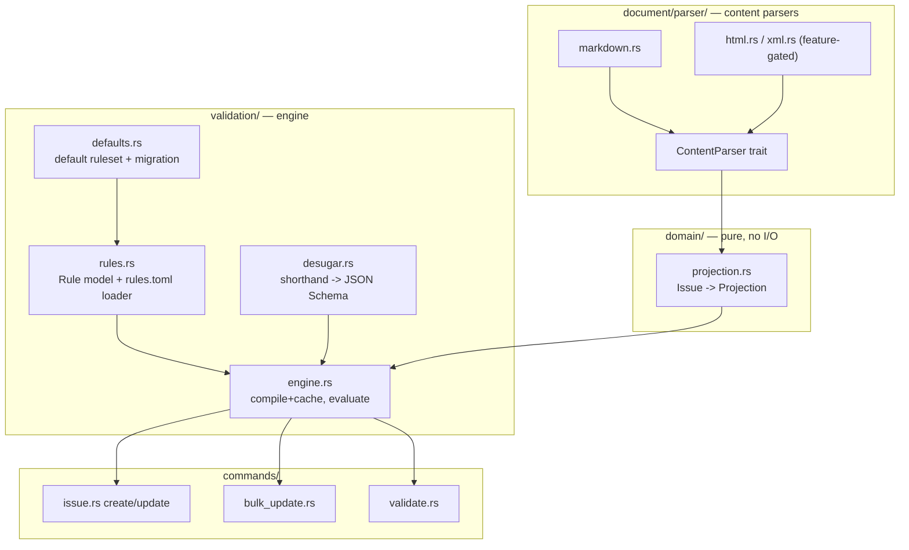

# Implementation Plan: Generic Validation Engine

**Issue:** f6a704d0
**Type:** epic
**Priority:** high
**Date:** 2026-06-06

This is the implementation plan. The *decisions* and their rationale live in the
companion decision record `dev/active/f6a704d0-validation-engine.md` (rev 3) —
this document does not restate them; it says *how* to build what they specify.
Section refs like "(DR §6)" point into that decision record.

## Problem Statement

jit's validation is a set of hard-coded checks split across `validation.rs`
(per-issue, called on write) and `commands/validate.rs` (whole-repo, on demand).
Plans live as unstructured free text in `Issue.description`. We replace this with
ONE declarative, JSON-Schema-based validation engine driven by `.jit/rules.toml`,
and ship SDD as example config. The engine is methodology-agnostic.

## Epic Success Criteria

Verbatim from the epic; each child delivers a slice:

- [ ] [hard] Rules load from `.jit/rules.toml`; schemas inline or from `.jit/schemas/`; loader rejects mixing shorthand and raw schema in one rule.
- [ ] [hard] Selector matrix (type, label, state, doc-type) matches issues; applicable rules union.
- [ ] [hard] Local rules evaluate on create/update and the batch path; per-rule `enforce` (default false) blocks; `--force` bypasses and logs an event.
- [ ] [hard] Graph rules (coverage, reference-integrity, dependency-shape) run only in `jit validate`/gate checkers.
- [ ] [hard] Validation runs against the enriched projection; Markdown default, HTML/XML behind optional features, one parser trait.
- [ ] [hard] JSON Schema validation via `jsonschema`; shorthand kinds desugar to JSON Schema; compiled schemas cached.
- [ ] [hard] Complete existing-check set re-expressed as default rules with preserved behavior; legacy keys migrated and removed.
- [ ] [hard] `jit init` scaffolds defaults; existing repos migrate without silently losing checks.
- [ ] [hard] `jit validate [<id>] [--json] [--explain]` reports rule/severity/message; gates invoke via `$JIT_ISSUE_ID`; MCP `--schema` parity.
- [ ] [hard] SDD ships as example rules + schemas + docs; description criteria canonical, labels derived; >=1 non-SDD example.

## Architecture

### Layering (DR §12)



### The Projection contract (DR §6)

`domain/projection.rs` defines a `Projection` struct, `#[derive(Serialize, JsonSchema)]`,
that normalizes an `Issue` into the JSON shape every user schema validates against.
Because it derives `JsonSchema` (schemars 0.8 is already a dep), the projection's
own schema is generatable and becomes the documented stable contract.

```jsonc
{
  "type": "epic",                 // from type:* label
  "state": "ready",
  "priority": "high",
  "labels": {                      // grouped by namespace
    "type": ["epic"],
    "req":  ["REQ-01", "REQ-02"],
    "epic": ["validation-engine"]
  },
  "doc_types": ["design", "implementation"],   // from documents[].doc_type
  "sections": {                    // parsed from description (canonical content)
    "success_criteria": {
      "items": ["[hard] REQ-01 ...", "[aspirational] ..."]
    }
  }
}
```

`sections` is produced by parsing `Issue.description` through the `ContentParser`
for its format (Markdown in the default build). Items are the raw text runs of
list entries; JSON Schema expresses `[hard]` cardinality via
`contains: {pattern: "^\\[hard\\]"}, minContains: 1`. The projection is a pure
function `project(&Issue, &ContentParser) -> Projection`; no filesystem access.

### The Rule model (DR §3, §4, §7, §8)

`.jit/rules.toml`:

```toml
[[rules]]
name = "epic-has-requirements"
when = { type = "epic" }                 # selector: AND of type/label/state/has_doc_type
severity = "error"                        # off | warn | error
enforce = false                           # default false; true blocks writes
assert = { require-label = { label = "req:*", min = 1 } }   # shorthand OR
# assert = { json-schema = "schemas/epic-body.json" }       # raw schema (file)
# assert = { json-schema = { properties = { ... } } }        # raw schema (inline)
# assert = { checker-command = "..." }                       # escape hatch (DR §4.3)
```

Rust model (`validation/rules.rs`):

```rust
struct Rule { name: String, when: Selector, severity: Severity, enforce: bool, assert: Assertion, scope: Scope }
struct Selector { type_: Option<String>, label: Option<String>, state: Option<String>, has_doc_type: Option<String> }
enum Severity { Off, Warn, Error }
enum Scope { Local, Graph }     // derived from the assertion kind
enum Assertion {
    RequireLabel { label: String, min: Option<u32>, max: Option<u32> },   // shorthand
    RequireSection { heading: String },                                    // shorthand
    RequireDocType { doc_type: String },                                   // shorthand
    JsonSchema(SchemaSource),          // raw: inline serde_json::Value or file path
    CheckerCommand(String),            // escape hatch
    LabelCoverage { .. }, LabelReference { .. }, DependencyShape { .. },    // graph (DR §4.2)
}
```

Loader rules: a single `assert` table holds exactly one kind. A shorthand kind
and a `json-schema` cannot coexist in one rule — the loader returns a config
error (DR §8.1). `enforce` absent => false (DR §7.2).

### Validation flow

```mermaid
sequenceDiagram
    participant W as issue create/update/bulk
    participant E as engine
    participant V as jit validate
    W->>E: evaluate_local(projection, rules)
    E-->>W: findings (local only; graph skipped)
    Note over W: error+enforce -> block unless --force<br/>--force bypass -> log event (DR §7.6)
    V->>E: evaluate_local + evaluate_graph(store, rules)
    E-->>V: findings (rule, severity, message)
```

- **Schema compilation is cached** (DR §5.2): compile each rule's JSON Schema
  once (lazy, keyed by rule name / schema hash); never per write. Use a
  `OnceCell`/`HashMap` cache on the engine, validator built once per command.
- Pin `jsonschema ~0.46` with `Draft202012` explicitly.

### Migration (DR §8.3, §8.4)

Complete inventory to convert to default rules, then REMOVE from code/config:
- `validation.rs IssueValidator`: type-label (`require_type_label`), label format
  (`label_regex`/`reject_malformed_labels`), namespace registry
  (`enforce_namespace_registry`).
- `commands/validate.rs validate_labels()` (lines 279-408): per-namespace
  `values` (enum), `pattern` (regex), `unique` (cardinality), `required`.
- `commands/validate.rs`: `warn_orphaned_leaves`, `warn_strategic_consistency`.
- `config.rs [validation]` (lines 65-84) all 8 fields; `NamespaceConfig`
  `values/pattern/required/unique` (lines 140-159).

Behavior parity: default rules carry `enforce` matching today's reject-vs-warn
(`reject_malformed_labels`/`enforce_namespace_registry` default false => warn).
Loader tolerates removed keys with a warning + migration prompt; never hard-errors.

## Implementation Steps (by task, in dependency order)

1. **proj (2f50a3b0)** — `domain/projection.rs` (`Projection` + `project()`), and
   `document/parser/{mod.rs,markdown.rs}` (`ContentParser` trait reusing
   `DocFormatAdapter::detect`). Document the projection schema.
2. **rules-loader (2fa7c882)** — `validation/rules.rs`: model + `.jit/rules.toml`
   parse, selector matching (union), shorthand-XOR-raw guard, severity/enforce.
3. **core (7df61f62)** — add `jsonschema` dep; `validation/engine.rs` validates a
   projection against a rule's schema with a compile cache; `Finding` type.
4. **sugar (6297d67b)** — `validation/desugar.rs`: shorthand kinds -> JSON Schema.
5. **local (25ad2a02)** — wire `evaluate_local` into `issue.rs` create (56-63) +
   update (227-236) AND `bulk_update.rs validate_update` (416-468); enforce/force;
   new `Event` variant for force-bypass; skip graph scope on write.
6. **graph (a7176f28)** — graph assertion kinds over `store.list_issues()`.
7. **validate (b8ba1b10)** — `cli.rs` add positional `[<id>]` + `--explain`;
   dispatch in `main.rs`; run local+graph; `$JIT_ISSUE_ID` gate usage; assert the
   new surface in `jit --schema` (schema.rs) for MCP parity.
8. **defaults (a0f0f342)** — `validation/defaults.rs`: the migrated default rules;
   delete the hard-coded checks from `validation.rs`/`validate.rs`.
9. **init (0abaddc0)** — scaffold `.jit/rules.toml` in the init path
   (`main.rs:272`); one-time config->rules migration; loader warn-on-removed-keys.
10. **htmlxml (00525fe0)** — `document/parser/{html.rs,xml.rs}` behind cargo
    `features`; cross-format projection test.
11. **keyword (33f23ec7)** — `with_keyword` registration point; degradation test.
12. **sdd (a6daa05d)** — example `.jit/rules.toml` + `.jit/schemas/` + docs;
    req/satisfies derived from canonical description criteria; >=1 non-SDD example.

## Testing Approach

- **Unit** (`#[cfg(test)]`): projection determinism; parser item extraction;
  rule loader (incl. the shorthand+raw rejection); desugaring vs hand-written
  schema; each graph rule; migration mapping; force-bypass event emission.
- **Harness** (`TestHarness`/`CommandExecutor` + `InMemoryStorage`): local-rule
  enforcement on create/update/bulk; `jit validate <id>`/`--explain`; behavior
  parity of default rules vs the old hard-coded checks.
- **Integration** (`tests/`, subprocess; see `schema_tests.rs`): `jit validate`
  CLI surface; `jit --schema` includes the new positional/flags; gate checker via
  `$JIT_ISSUE_ID`; cross-format (md/html/xml) equivalence with features on.
- Gate: `cargo clippy --workspace --all-targets` clean; `cargo fmt`.

## Risks and Open Questions

- **`jsonschema` unknown-keyword degradation** (DR §5.3) is asserted but must be
  proven by the keyword task's test; do not let core depend on the assumption.
- **TOML inline-schema footgun**: regex `pattern` backslashes require TOML literal
  strings (`'...'`); the loader must round-trip TOML->serde_json faithfully — add
  a loader unit test.
- **Performance**: markdown parse + schema validate on every write. Mitigated by
  the compile cache and a lean projection; budget a unit test asserting no
  per-call schema recompile.
- **Migration blast radius**: a git-synced old config carrying removed keys must
  warn, not error (DR §8.4). Verify with an explicit test.
- **pulldown-cmark 0.9** is stale; bump and pin during the proj task.
