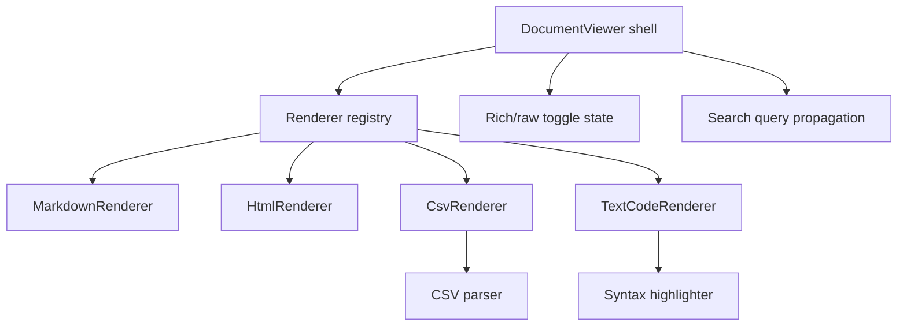

# Modular document rendering for CSV and source files in Web UI

**Issue:** `fdb039ee`
**Type:** `story`
**Priority:** `high`
**Date:** `2026-05-06`

## Problem Statement

The Web UI document viewer already has a modular renderer registry, but in practice it still only provides specialized handling for Markdown and HTML. Real issue-linked artifacts from `../gf2` include benchmark CSVs, plain-text reports, and source files such as Rust and C++, and those formats are not yet rendered in a way that is easy to inspect in the browser.

This feature extends the existing renderer pipeline so those formats display well without turning `DocumentViewer` into a format-specific switchboard. The design keeps the viewer shell responsible for fetching, shared chrome, history controls, and search-query propagation, while each format registers its own matching and rendering behavior.

## Success Criteria

- [ ] Issue-linked `.csv` documents render through a dedicated modular renderer with sortable columns, a sticky header, inline rich/raw switching, search highlighting, and capped rich preview behavior for large files.
- [ ] Issue-linked `.txt`, `.rs`, and `.cpp` documents render through modular text/code presentation with the agreed per-format behavior and inline raw fallback.
- [ ] Renderer dispatch remains data-driven through registry metadata and path/content matching rather than hardcoded per-format branching in `DocumentViewer`.
- [ ] Existing Markdown and HTML document rendering behavior remains intact, and unknown text-like formats still degrade gracefully.
- [ ] The work is broken into child issues with explicit success criteria and gates so implementation can proceed in an auditable order.

## Design

The implementation splits into a small set of composable pieces:

1. **Registry contract extension**
   - Extend the renderer registry so entries can match on both `content_type` and document path/extension.
   - Let entries describe capabilities needed by the viewer shell, such as raw-toggle support, search-highlighting support, preview-cap support, and history behavior.

2. **CSV renderer**
   - Add a dedicated `CsvRenderer` that parses CSV content with a small library dependency instead of hand-rolled parsing.
   - Render the rich view as an HTML table with sortable columns and a sticky header.
   - Support inline rich/raw switching and highlight matching cells when the document search query is active.
   - Cap the rich preview for large files and keep the full content available in raw mode.

3. **Shared text/code renderer**
   - Add a `TextCodeRenderer` shared by `.txt`, `.rs`, and `.cpp`.
   - Source-code mode provides syntax highlighting plus line numbers.
   - Plain-text mode provides wrapping controls plus line numbers.
   - Both modes support inline rich/raw switching, search highlighting, and capped rich preview behavior.

4. **Viewer-shell integration**
   - Keep `DocumentViewer` thin and renderer-agnostic.
   - The viewer shell owns the rich/raw toggle state only where the selected renderer advertises that capability.
   - Existing Markdown and HTML renderers remain separate and backward-compatible.

5. **Optional low-risk server MIME enrichment**
   - Add `text/csv` inference on the server because that is low risk and improves debugability.
   - Do not make source-code MIME additions a prerequisite for the feature because client-side extension matching is already sufficient for modular dispatch.

### Dependency shape

The work is split so the setup/design task blocks the implementation tasks, the renderer-contract task blocks the renderer tasks, and final regression coverage lands after the feature pieces are in place.

## Implementation Steps

1. Create the JIT issue structure under `6d0128ae`, including this story, the setup/design task, implementation tasks, and dependency edges.
2. Extend the renderer contract and registry selection logic so renderers can match on extension/path in addition to `content_type`.
3. Implement `CsvRenderer` with sortable table behavior, sticky headers, search highlighting, inline raw mode, and preview caps.
4. Implement `TextCodeRenderer` for `.txt`, `.rs`, and `.cpp` with the agreed plain-text and source-code modes.
5. Add any viewer-shell state and UI needed for inline rich/raw switching, preview caps, and shared renderer capability handling.
6. Add low-risk `text/csv` content-type inference on the server if the implementation still benefits from it after client dispatch is in place.
7. Add regression coverage proving Markdown and HTML stay stable and unknown text-like files still fall back gracefully.

## Testing Approach

- Write registry-selection tests before implementation for:
  - `.csv`
  - `.txt`
  - `.rs`
  - `.cpp`
  - existing Markdown and HTML paths
  - unknown text-like fallback
- Add renderer-specific tests for:
  - CSV parsing and table rendering
  - sorting behavior
  - sticky-header structure
  - inline rich/raw toggling
  - search highlighting
  - large-preview capping
  - source-code syntax highlighting and line numbers
  - plain-text wrapping controls
- Add `DocumentViewer` integration tests verifying shared shell behavior remains correct with the new capability-driven renderers.
- If server MIME inference changes, add focused route tests for `.csv` without widening the server scope unnecessarily.

## Risks and Open Questions

- Large documents could create expensive DOM trees in rich mode, so preview caps need explicit tests and conservative defaults.
- CSV data may contain quoted cells, embedded commas, and uneven row lengths, which is why v1 uses a parsing dependency rather than a narrow custom parser.
- Search highlighting needs to avoid disrupting sort state, table layout, and code-line rendering.
- Future formats should be added as new registry entries instead of extending the shared text/code renderer beyond its current scope.
