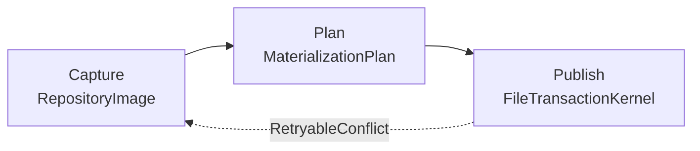
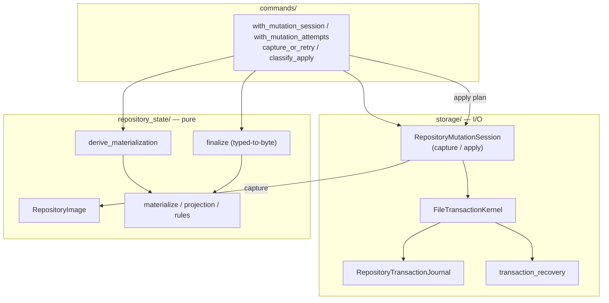
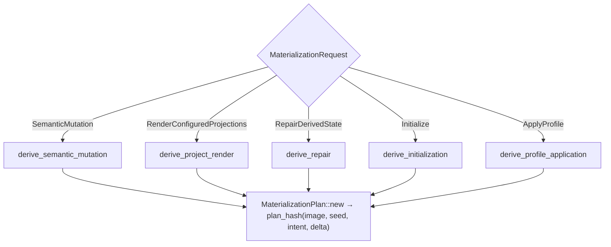
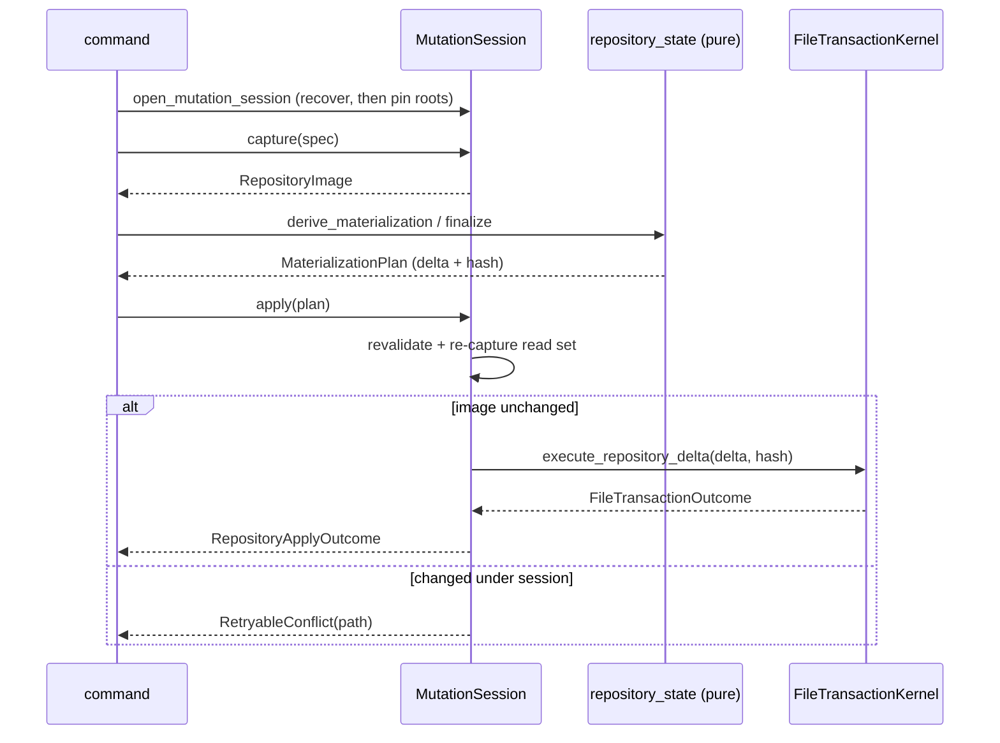

# Repository-State and Materialization Architecture

> **Diátaxis Type:** Explanation

This document gives a contributor a working mental model of the subsystem that
turns a semantic mutation into durable repository bytes. It describes the code in
`crates/jit/src/repository_state/` (the pure vocabulary and producers) and
`crates/jit/src/storage/` (the session, kernel, journal, and recovery) as it
exists in the tree. Read it before touching capture, planning, publication, or
recovery.

Repository data is plain git-versioned JSON with no external database
(`@/charter/D-1`). Every semantic mutation derives its coupled materializations
from one final repository view and publishes the resulting state recoverably
(`@/inv/derived-state-coherence`).

---

## The pipeline in one sentence

A command captures **one immutable repository view**, hands it to a **pure
planning boundary** that derives an exact plan of file actions, and publishes that
plan through **one recoverable publication mechanism**.

The three stages are strictly separated:

- **Capture and publish** perform filesystem I/O and live in `storage/`.
- **Planning** is pure — it reads only the captured image and declared authority,
  performs no I/O, and imports no storage, command, validation, or profile
  modules (`repository_state/mod.rs` module contract).

The arrow back from publish to capture is the conflict-retry edge: if the
repository changed under the session between capture and apply, the store returns
a typed `RetryableConflict` and the command re-captures.

### Layer map

---

## The captured repository view

A `RepositoryImage` (`repository_state/image.rs`) is the single closed input to
all planning. It is built by `RepositoryImage::close` from a `CaptureSpec`
(`CaptureSpec::phase_one`) bounded by a `CaptureBudget` (`max_paths`,
`max_listings`, `max_bytes`, `max_depth`), so capture cannot walk an unbounded
tree. The image holds, per canonical path, a `RepositoryEntry` — `File` (with
bytes, `FileMode`, and an `EntryIdentity`), `Directory`, or `Absent` — plus
`ListingFingerprint`s and pinned/linked-worktree evidence.

An `EntryIdentity` pairs a boundary-acquired no-follow object identity with the
SHA-256 and byte size of the exact captured bytes. Identity is what lets a later
apply prove the repository is byte-for-byte what planning saw.

Paths are addressed through `VirtualPath` over a `RepositoryLayout`, which
classifies every target as `Data(...)` (data-root-relative, the `.jit` tree) or
`Worktree(...)`. The layout is the sole authority that maps a repo-relative
spelling to a root class; producers never touch ambient paths.

Because the image is immutable and complete, planning is a pure function of it:
every producer reads existing target bytes from the image, never from the live
filesystem (`materialize.rs` module contract).

---

## The pure planning boundary

Planning converts semantic intent into a `MaterializationPlan`: an exact
`RepositoryDelta` of normalized `RepositoryAction`s (`CreateDirectory`,
`WriteFile`, `SetMode`, `DeleteFile`), the captured image, and a semantic `hash`.
Each action carries an `ExpectedPreimage` (`Absent`, `File`, `Directory`, …) so
publication can verify the target against exactly what was captured.

### One typed request enum, one shared identity tail

`derive_materialization` is the single closed entry to the constrained producer
graph. It matches on a `MaterializationRequest`, whose variants are the only ways
to enter planning:

- `SemanticMutation` — rebuild all declaration-owned state after a record change.
- `RenderConfiguredProjections` — render the selected configured projections
  (`None` selects all).
- `RepairDerivedState` — repair all declaration-owned derived state, including
  installed-profile targets.
- `Initialize` — derive a fresh or missing-file repository scaffold.
- `ApplyProfile` — derive one embedded profile application over an existing repo.

The match is deliberately closed: a caller cannot register a callback or select an
individual producer family; adding a family means extending this function. Every
variant funnels through one shared plan-identity tail — `MaterializationPlan::new`
computes `plan_hash(image, seed, intent, delta)` over a `RepositorySeed` and a
`MaterializationIntent` — so all requests produce identity the same way and no
variant can skip hashing.

### The complete producer set

`compose_complete` is the complete owned-materialization producer set: default
rules and their schemas plus every configured projection, each derived from
declared authority (`@/inv/single-source-prose`). A caller cannot invoke a subset
— the intent selects the whole set. This is where the three intents differ in
scope while sharing the producer code:

- `derive_semantic_mutation` runs `compose_complete` over every declared
  projection.
- `derive_project_render` scopes *which declared projections* participate; an
  out-of-scope projection contributes no action, leaving its target untouched. The
  scope is declaration scope, never a choice of producer family.
- `derive_repair` runs `compose_complete` and then layers ownership-safe
  profile-target composition on top.

Shared projection targets compose through the one `managed_document` primitive
(`compose_managed_documents`), never last-writer-wins, so two projections into one
file merge deterministically. `rules.toml` splices only the generated
default-family spans, preserving authored content unconditionally. The engine
reads type names, gate keys, projection targets, and templates from captured
declarations, never from hardcoded domain assumptions (`@/inv/domain-agnostic`).

### Repair derivation and ownership refusal

`derive_repair` is complete *and* ownership-safe per target: `rules.toml` splices
only generated default spans, region projections splice only their managed region,
and full-file projections replace only a target the declaration proves. When
ownership cannot be proven — two installed profiles claiming one target, or a
duplicate rule name — repair refuses before publication with a typed
`AmbiguousOwnershipError` rather than rewriting an authored boundary it cannot
prove it owns.

`compare_materializations` is the read-only counterpart: it diffs a plan's
expected actions against the same closed image and reports each
`MaterializationDrift` as `Missing`, `Stale`, or `Unexpected`. It is how a caller
detects that derived state has drifted without publishing anything.

### Typed producer errors

Planning failures are fully typed families whose leaves retain their concrete
source, so rendering lives in the error type's `Display` rather than at the call
site:

- `ProducerError` — a producer read an uncaptured path, malformed captured bytes,
  or an invalid declaration.
- `DeclarationParseError` — parsing captured declaration files into the canonical
  bundle (`declarations_from_image` / `validation_declarations_from_image`).
- `RulesDocumentError` — a `rules.toml` that could not be parsed or safely spliced.
- `GateRegistryEditError` — the typed tail of `finalize_gate_registry_edit`.
- `ArchiveExecutionError` — the typed tail of `finalize_archive_execution`.

These compose into `RepositoryStateError`, the single pure-derivation failure type
`derive_materialization` returns.

### Single-declaration edit entries

Two authored-declaration edits have their own constrained planning entries that
overlay the edited bytes onto the captured base, then run `compose_complete` over
the edited declarations so coupled schemas, rule membership, and projections all
reflect the proposed state before anything is published:

- `finalize_config_edit` — one authored `config.toml` edit. A malformed edit is a
  typed planning error, never a published file.
- `finalize_gate_registry_edit` — one typed `EditGateRegistry` intent, with the
  edited registry serialized only by the neutral declaration owner.

---

## The mutation-session contract

Record-level mutations (issue create/update/claim/delete, gate runs, events, index
membership) are driven by the typed-to-byte finalizer in
`repository_state/mutation.rs`. Commands submit timestamp-free, identifier-free
semantic `MutationIntent`s; the finalizer assigns identity and time and emits one
exact plan.

- `MutationIntent` is a closed enum of repository-owned mutations (`CreateIssue`,
  `CreateIssueBatch`, `ClaimIssue`, `UpdateIssue`, `RepairIssueLifecycle`,
  `EditGateRegistry`, `CreateGatePreset`, `DeleteIssue`, `RecordGateRun`,
  `RecordEvent`). A new record class extends this enum.
- `MutationContext` is created once per command operation, before its conflict
  retry loop. It holds an `IdAuthority` and a `MutationClock`. Both the identity
  seed and the single mutation timestamp are sampled lazily and once — the seed on
  the first identifier allocation, the timestamp on the first transition — so a
  no-op mutation samples neither, and a retry after a re-capture reuses identical
  record identities and times.
- `finalize` (built on `finalize_delta`) allocates identifiers in a frozen order —
  new issue ids first, gate-run/record ids next, event ids last after canonical
  event ordering — stamps the one timestamp on every transition, composes the exact
  `events.jsonl` append (`@/inv/event-log`), and derives `index.json` membership
  from the captured preimage. `finalize_audit_append` reuses the same torn-tail
  authority for init/profile deltas that carry their own asset actions.

The finalizer serializes every record canonically (`serialize_issue`,
`serialize_event`, `serialize_gate_run`, `fresh_index_bytes`) and closes the
intents into a `RepositorySeed`, so equivalent plans hash identically on the
JSON-file and in-memory backends.

### Command-layer retry combinators

The command layer owns the capture/plan/apply/retry protocol in one place
(`commands/mod.rs`, the mutation-session-contract region). Every command site
drives its retry through these combinators rather than a hand-copied loop:

- `with_mutation_attempts` — the retry driver. It owns the retry bound and the
  terminal `MutationSessionExhausted` error, and holds no session, so a caller may
  open and release a preflight session, take a claims guard, and run a subprocess
  between attempts without inverting lock order.
- `with_mutation_session` — the convenience for pure single-session sites: open one
  fresh recovered session per attempt, hand it to the closure, and apply the
  returned plan.
- `classify_apply` / `capture_or_retry` — the single interpreters of a
  `RetryableConflict` on apply and on capture, folding it into `AttemptOutcome` /
  `SessionStep` retry signals.

---

## Capture and apply: the session

A `RepositoryStateStore` opens a `RepositoryMutationSession`
(`storage/repository_state_store.rs`). The session is the I/O boundary the pure
plan is published through:

- `open_mutation_session` runs transaction recovery to convergence, then
  re-discovers root capabilities (absent-root recovery may have published the data
  root; prepared-root recovery may have removed it) and pins the kernel to fresh,
  identity-bound directory handles.
- `capture` revalidates the layout capabilities and returns a bounded
  `RepositoryImage`.
- `apply` revalidates that the plan's image is the session's captured image, that
  the delta is fully captured, then re-captures the read set under the held guard.
  If the fresh capture differs from the plan's image it returns
  `RetryableConflict { path }` naming the first divergence — nothing durable is
  written. Otherwise it hands the delta and plan hash to the kernel and returns a
  `RepositoryApplyOutcome`.

---

## The file-transaction kernel and journal

`FileTransactionKernel` (`storage/file_transaction.rs`) is capability-confined:
it is rooted at already-open worktree and data-root directory handles and never
consults an ambient path after construction. `execute_repository_delta` publishes
one delta durably.

### Journal and progression

The durable wire format is a `RepositoryTransactionJournal`
(`storage/transaction_journal.rs`), versioned and owner/layout-digest stamped.
Each `RepositoryJournalAction` records its path, owner, `ExpectedPreimage`,
`RepositoryFinalIdentity`, and a `RepositoryActionProgress` that advances
`Planned → Prepared → BackupReady → Published`. The whole transaction carries a
`TransactionDecision` of `Prepared`, `Committed`, or `RolledBack`.

The kernel builds the journal, writes it durably, then runs three phases:

- **Prepare** (`prepare_repository_actions`) — stage every action's content and,
  for a replace or delete, copy the live target into a verified rollback backup.
  Staging and backup are routed to the authority colocated with the target's
  filesystem, so a worktree action never stages or hard-links across a data-root
  filesystem boundary.
- **Publish** (`publish_repository_actions`) — re-verify each target against its
  recorded preimage, rebind the held capability to the live root immediately before
  each irreversible mutation, and rename each staged object into place.
- **Commit or roll back** — on success, write the `Committed` decision and clean up
  control; on a non-durable failure, `rollback_repository_actions` restores from the
  backups and cleans up.

File replacement uses the temp-file-plus-atomic-rename pattern, and new-file
publication uses verified staging plus atomic no-replace publication
(`rename_noreplace_cap`), so an occupied destination is never overwritten
(`@/inv/atomic-writes`).

### Total journal-action extraction

Publication reads a journal action's staging and backup control-names through
total extractors — `create_directory_stage_name`, `write_file_control_names`,
`set_mode_control_names`, `delete_file_backup_name`, and
`set_mode_final_file_identity`. A journal action whose kind does not match the
semantic action at its index aborts with a typed
`FileTransactionError::JournalActionMismatch` routed to control-only teardown,
rather than panicking mid-publication. The publication path contains no
`unreachable!`.

### Absent-root staged publication

When the selected data root does not yet exist and the delta carries a `Data`
action, the kernel stages the whole `.jit` tree beside its parent and publishes it
with a single atomic no-replace rename, after re-verifying every staged action
against its recorded final identity while the stage is still mutable. A
worktree-only delta over an absent root commits its worktree actions without
materializing an empty `.jit`, keeping the JSON-file backend aligned with the
in-memory backend, which marks the data root present only when a `Data` action
lands.

### Recovery

Control lives at `ExternalBootstrap` (worktree `.jit-bootstrap/transactions`,
used while the data root is absent) or `InternalRepository` (`tmp/transactions`
under the data root). On session open, `recover_location` lists pending
transaction ids and dispatches each to `recover_repository_transaction`, which:

- removes a partial control that never reached a durable journal;
- rolls a `Prepared` journal back from its backups and replays a `Committed`
  journal's cleanup;
- skips a worktree-side companion (owned by internal recovery and the orphan
  sweep) and a foreign-owner external journal (another data root's residue under
  the shared bootstrap namespace).

Every durability boundary and action edge is a stable `FailurePoint`
(`storage/transaction_recovery.rs`), and a `TransactionFailureInjector` lets tests
interrupt or race the kernel at each one; the production injector proceeds at every
boundary. Recovery convergence before capture, plus the identity-bound re-open, is
what makes the whole subsystem crash-safe rather than merely atomic per write.

---

## Where to start reading

- The pipeline vocabulary and the closed request/plan API: `repository_state/mod.rs`.
- The immutable view and exact delta: `repository_state/image.rs`.
- The pure producers and projections: `repository_state/materialize.rs`,
  `repository_state/projection.rs`, `repository_state/rules_document.rs`.
- The typed-to-byte record finalizer: `repository_state/mutation.rs`.
- The session, capture, and apply: `storage/repository_state_store.rs`.
- Durable publication, journal, and recovery: `storage/file_transaction.rs`,
  `storage/transaction_journal.rs`, `storage/transaction_recovery.rs`.
