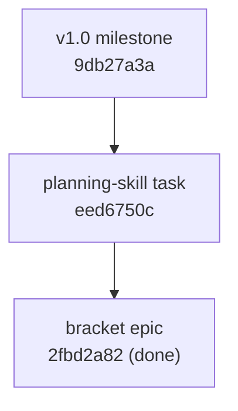

# Session Notes: Planning Skill Design (2026-06-20)

**Issue:** `eed6750c-270a-43c6-8c35-161553b25d75` — Planning skill: interview-driven plan authoring for the P node

**Type:** Design / brainstorming (no implementation this session)

**Status:** Design converged; issue created and wired; skill not yet drafted.

---

## Purpose

Decide whether and how to add a **planning skill** to the JIT skill roster — a skill that owns the **P (planning) node** of the plan-before-fan-out bracket (epic `2fbd2a82`): turning a vague request into a `plan-review`-passing plan that `jit-breakdown` can decompose. The session began as skill cleanup and grew into the design for this new skill.

---

## 1. Skill cleanup that preceded the design

- **`jit-breakdown` reference sweep.** The user had trimmed fluff from `jit-breakdown/SKILL.md`; verified the trim and fixed seven stale step cross-references left by a 6a–6f → 6a–6e renumber (`6d-plain`→`6c-plain`, `6d-bracket`→`6c-bracket`, `6f`→`6e`, two `step 5` cites). All references now resolve.
- **Fluff check across the other skills.** `jit-parallel` and `jit-migrate` were clean. Cut two clear-cut items: a design-meta sentence in `project-lead` §1.6 and a redundant aphorism + restatement in `jit-manage` invariant 8. Deliberately kept load-bearing rationale in `project-lead` §4.3/§7 (the "no-argue discipline" and the rework-ordering rule) because each changes agent behavior.

## 2. Sizing against agentskills.io best practices

Spec thresholds: **SKILL.md < 500 lines and < ~5,000 tokens**; description ≤ 1024 chars; move detail to `references/` loaded on demand with explicit "when to load" triggers; design coherent units (too broad = hard to activate, context bloat).

Measured bodies, then did two extractions:

| Skill | Before | After |
|-------|--------|-------|
| jit-breakdown | 514 lines / ~6,020 tok | 434 lines / ~5,140 tok — moved Step 6c-bracket spine procedure to `references/bracket-spine.md` |
| project-lead | 367 lines / ~7,230 tok | 359 lines / ~6,811 tok — moved Section 7 tier detail + no-argue discipline into `references/lead-review-protocol.md` |

`jit-parallel` (~1k), `jit-migrate` (~1.8k), `jit-manage` (~3.9k) are within budget. `project-lead` is still over the token budget; a further Section 3A extraction would close it (deferred — not in scope this session).

## 3. The role gap that motivated the planning skill

Mapping skills to lifecycle phases exposed the gap:

| Skill | Role | Phase |
|-------|------|-------|
| jit-migrate | importer | onboarding |
| jit-manage | lifecycle clerk / single-issue driver | claim→implement→gate→complete |
| jit-breakdown | decomposer | **B** |
| jit-parallel | parallel executor | impl |
| project-lead | autonomous epic executor | drives B + impl |

**Nothing owns P.** Planning survives only as `jit-manage` Workflow B3 (thin design-doc template) and `project-lead`'s `references/architect-agent-prompt.md` (a one-shot doc generator dispatched inside the executor). Support is **inverted relative to leverage**: P is the highest-leverage node — `plan-review` blocks breakdown and a bad plan poisons every child — yet the least-supported phase.

## 4. Research: six frameworks under `../jit-research`

Dispatched one Explore agent per framework. All six converge on the same pipeline:

```
discovery (context) → research (conditional) → spec/WHAT → design/HOW → decompose → validate → execute
```

Two camps: **rigid phase-gates** (cc-sdd, BMAD, ruflo SPARC) vs **fluid actions** (OpenSpec). JIT already chose the gated camp (P→B→impl with gates), so the rigid frameworks map more directly.

Patterns worth adopting for P:

| Pattern | Source(s) | JIT mapping |
|---|---|---|
| Leveled discovery/research (skip→quick→standard→deep) | gsd, cc-sdd | Scale P's effort to the work; small epics skip research |
| Research as structured, cited, provenance-tagged artifact | gsd (VERIFIED/CITED/ASSUMED), cc-sdd research.md | Research doc linked to P, separate from the plan |
| Plan-review = mechanical + judgment rubric | BMAD 7-dim, gsd 12-dim, cc-sdd, superpowers | Self-check against the real `plan-review` rubric |
| Goal-backward verification (truths→artifacts→wiring) | gsd must_haves | Plan must cover the container's `[hard]` criteria |
| Locked decisions + scope-reduction detection | gsd CONTEXT.md, BMAD decision-log | Plan records binding decisions; downstream may not silently simplify |
| Self-review before external review; bounded refine loop | superpowers, gsd/cc-sdd (max 2–3 passes) | Draft → self-check → fix → gate; cap then escalate |
| Discovery = elicitation, not authorship | BMAD, superpowers | The interactive interview mode |

## 5. Design decisions (settled this session)

- **Mode-aware.** Interactive elicitation (brain-dump, one-question-at-a-time, infer-and-confirm) when a human drives; autonomous (derive from existing artifacts, no questions) when invoked headless. One skill, two entry paths.
- **Leveled discovery/research.** Signal-detect (new dependency, "choose/evaluate", architectural scope) and scale effort; don't over-plan small work.
- **Orchestrator + dispatched roles, purely additive.** `SKILL.md` is a thin orchestrator that runs the interview in the main loop (it needs the human, can't be headless) and dispatches investigate / synthesize / review as sub-agents whose prompts live in `references/` (the `project-lead` pattern). **No existing skill is modified;** intent-extraction stays internal; composition into `project-lead` §3A deferred.
- **One level at a time.** Planning recurses one hierarchy level per pass, interleaved with `jit-breakdown` (plan goal → break into epics → plan each epic → …). High- vs low-level requirements are the recursion axis, not a role split. The planner emits a **decomposition sketch**; `jit-breakdown` creates the child issues.

## 6. The reframe: interview-first, cold-start capable

The user emphasized that **the user is allowed to be vague**, and the planner's primary job is to **extract intent**, not to receive a spec. The opening line is a *seed*, not a spec. Failure is asymmetric: a wrong intent extraction means the criteria are wrong, the coverage gate passes the wrong work, and impl builds it well — garbage in, well-executed garbage out.

Cold-start scenario (no goal/epic exists yet), e.g. **"Reproduce the results in this article"**:

1. **Ingest before interrogating** — read the article; extract candidate results (figures, tables, method, datasets, reference code). Now the planner knows the menu.
2. **Interview, grounded, one question at a time** — which results count? what fidelity = "reproduced" (exact within tolerance / qualitative trend / ranking)? data/code/compute available? reimplement vs run authors' code? what's out of scope? stakes/depth?
3. **Converge → criteria** — confirmed lines become `[hard]` criteria on a newly-*created* container.
4. **Then plan** — discovery, conditional research, the decomposable plan on P.

So the planner is the **front door**: vague line → created container (with criteria it derived) → bracketed P → plan. Broader than `jit-breakdown` or `project-lead`. When intent stays underspecified, it must **not fabricate** a definition of done — surface assumptions or escalate.

This overlaps the existing `research-librarian` skill (gf2), whose job is ingesting papers and refining vague research directions. Open question whether `jit-plan` delegates paper-ingest to it or stays self-contained.

## 7. Grounding in the live config and rubric

Read the real definitions rather than guessing.

**Bracket vocabulary** — read, never hardcode. (HISTORICAL: at the time of this
session this lived in a flat planning-config block in `.jit/config.toml`; epic
9ac9fdac superseded it with the `plan` graph template in `.jit/templates.toml`,
read via `TemplateRegistry`. The values below are unchanged, now sourced from the
template:)
- breakable container `["epic"]` here (the template's `applies_to`); the **research ruleset uses `["goal"]`** (so "reproduce the article" is a `goal` container there). Skill must read this from the template registry.
- planning node `type = "planning"`, breakdown node `type = "breakdown"`, planning `doc = "dev/active/{container.id}-plan.md"`.
- planning gate `plan-review`; breakdown gates `coverage-preview` + `breakdown-review`.

**`plan-review` rubric** — it is an auto Exec gate (`codex exec` via `./scripts/ai-review.sh`, prompt `./scripts/plan-review-prompt.md`), run by the **standard runner**, so the skill leaves it PENDING (never runs it). Four verdict-affecting areas:

1. **Completeness vs criteria** — every `[hard]` criterion addressed; no silent scope narrowing.
2. **Technical soundness + architectural fit** — *read the actual code to confirm the plan's claims*; a plan built on a mistaken understanding fails.
3. **Decomposition + dependencies** — coherent, well-scoped tasks with correct ordering/waves (judged qualitatively; exhaustive coverage counting is the separate coverage gate).
4. **Risks + actionability** — open questions carry a mitigation/decision; an engineer can execute without re-deriving.

**Consequences for the design:**
- The rubric's four areas **become both the plan-doc sections and the synthesizer's self-check.**
- **Boundary sharpened:** the plan must *propose* a coherent decomposition (tasks, deps, waves) to pass review, but does not create issues — the plan *is* the spec `jit-breakdown` consumes.
- **Investigate role is mandatory**, not optional — area 2 fails any ungrounded plan.
- **Criteria output contract:** the coverage closure rule keys on a `## Success Criteria` section, `[hard]` marker, `REQ-[0-9]+` id-pattern, credited later by `satisfies:REQ-NN` labels on children. So the interview must converge to criteria written as `[hard] REQ-01: …`.
- **Definition-of-done floor:** the planner may not write a plan until it has at least one confirmed `[hard] REQ-NN` criterion — no criterion, nothing to cover or review against.

## 8. Proposed skill layout (not yet built)

```
jit-plan/
  SKILL.md                       # orchestrator: pre-flight → interview (in-loop) →
                                 #   dispatch investigate → dispatch synthesize →
                                 #   self-review vs rubric → create container+P, leave gate PENDING
  references/
    interview-protocol.md        # ingest-then-interview, one-Q-at-a-time, criteria floor
    investigator-prompt.md       # dispatched: ingest artifact + ground claims in real code → cited findings
    synthesizer-prompt.md        # dispatched: findings+intent → plan doc structured to the 4 rubric areas
    plan-doc-template.md         # the 4-section plan + [hard] REQ-NN criteria format
```

(Skill name `jit-plan` is provisional.)

## 9. Issue + DAG created this session

- **`eed6750c`** — "Planning skill: interview-driven plan authoring for the P node", `type:task`, `milestone:v1.0`, priority high, gate `code-review`, state `ready`.
- Wiring:



`jit validate` reports no new errors. `.jit/` changes are uncommitted (user did not request a commit).

## 10. Open questions / next steps

- **Interview protocol depth** — how hard the planner pushes before it is allowed to assume; the precise definition-of-done floor.
- **`research-librarian` composition** — delegate paper/DOI ingest to it, or stay self-contained and domain-agnostic?
- **Does the planner create the container itself or call `jit-manage` Workflow C's create path?** (composition boundary).
- **Skill name** — confirm `jit-plan` vs alternative.
- Then: draft `SKILL.md` + the four `references/` role prompts to the layout above.

## References

- Issue `eed6750c`; epic `2fbd2a82` (planning bracket); milestone `9db27a3a` (v1.0).
- `.jit/templates.toml` `plan` template (originally a flat planning-config block in `.jit/config.toml`, superseded by epic 9ac9fdac); `crates/jit/src/gate_presets/planning.rs`; `scripts/plan-review-prompt.md`.
- Research corpus: `../jit-research/{BMAD-METHOD,cc-sdd,get-shit-done,OpenSpec,ruflo,superpowers}`.
- Memory: `project-planning-skill-gap`.
