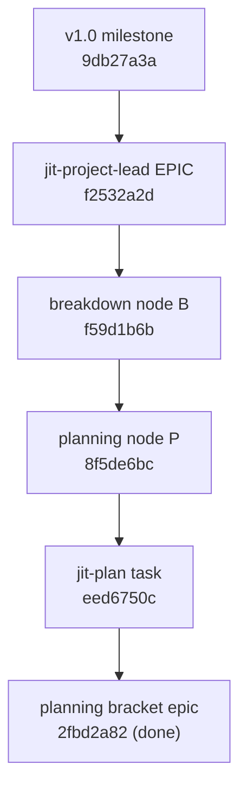

# Session Notes: jit-project-lead role design (2026-06-24)

**Issue:** `f2532a2d` — jit-project-lead skill: milestone-level vision steward above the epic lead

**Type:** Design / role definition (no implementation this session)

**Status:** Role boundary and design decisions settled; container created as an **epic**, promoted from a task, and initialized with the planning bracket (`jit apply plan`) under the v1.0 milestone; plan not yet authored, skill not yet drafted.

---

## Purpose

Define a new skill for a role one strategic tier **above** the current `project-lead`. The new role drives the project vision at the top container tier (the `milestone` tier in this repo), delegates each sub-strategic container (an `epic` here) to a subordinate lead, resolves the subordinates' escalations against the vision, escalates to the human only in the toughest cases, and enforces jit content standards across the whole project.

## Domain-agnostic framing (load-bearing)

jit is **not** software-only. It backs this repo, the work in `../gf2`, and is intended for non-software domains — notably **research**, where the strategic container is a `goal`, not an `epic`. The skill must therefore derive its tiers, container types, gates, and standards from the project's own `[type_hierarchy]` / config, hardcoding no software semantics. Throughout this note "milestone" and "epic" name *this* repo's hierarchy levels; the equivalent strategic and sub-strategic types are read from config at run time. This mirrors how the planning bracket reads `applies_to` from templates (`epic` for the SDD ruleset, `goal` for the research ruleset) rather than hardcoding a type.

## The role gap

| Tier | Skill | Owns |
|---|---|---|
| milestone (strategic) | **`jit-project-lead`** (NEW) | vision, strategic planning, sub-container dispatch, cross-container escalation, project-wide standards |
| epic (sub-strategic) | **`jit-task-lead`** (renamed `project-lead`) | one epic end-to-end: bracket → breakdown → impl waves |
| story / task | `jit-plan`, `jit-breakdown`, `jit-parallel`, `jit-manage` | P / B / impl / single-issue mechanics |

`project-lead` is single-container scope ("drive one epic, then stop") and routes every cross-container decision straight to the human. Nothing owns the project vision or the container above the epic.

## Design decisions (settled this session, validated with the user)

1. **Naming.** New milestone role = `jit-project-lead`. Current `project-lead` → renamed **`jit-task-lead`** (the lead that drives concrete work to completion). User chose `jit-task-lead`; the wrinkle that it actually drives epics (so `jit-epic-lead` would track the tier) is recorded as an open question, not blocking.
2. **Standing project steward**, not single-shot. Persistent across sessions; owns a durable vision artifact and a resumable project-level progress file. The "steering discussion" mode implies an ongoing relationship.
3. **Subordinates = the existing epic lead.** `jit-project-lead` dispatches `jit-task-lead` as a subagent, one per sub-strategic container, in topological waves — purely additive, mirroring how `project-lead` already dispatches workers. It never re-implements epic execution.
4. **Vision lives in a durable charter doc the role owns.** A versioned vision + first-class decision-log artifact (chosen and rejected options with reasons), at a location read from the documentation config. Escalation resolution and standards enforcement reference it. This is durable project memory in jit's own spirit, not a personal-memory file.

## Four invocation modes (orchestrator entry paths)

1. **Lead existing strategic work** — survey a milestone's epics, plan remaining ones into waves, drive to completion.
2. **Plan-and-execute a high-level goal** — cold-start: vague goal → (via `jit-plan` at the strategic altitude) vision + strategic container with epic-level decomposition → drive it.
3. **Steering discussion** — interactive: revisit/extend the vision, re-decide open forks, re-prioritize, record decisions. Dispatches no workers; mutates the charter.
4. **Standards sweep** — audit all issues/docs against the content standards, auto-fix mechanical violations, escalate the judgment ones.

## Proposed layout (not yet built)

```
jit-project-lead/
  SKILL.md                         # thin orchestrator: pre-flight → mode dispatch →
                                   #   vision intake → strategic planning → epic-wave loop →
                                   #   cross-container escalation → completion rollup
  references/
    vision-charter-template.md     # durable vision + decision-log artifact
    steering-protocol.md           # mode 3: interactive vision elicitation / re-decision
    strategic-planning.md          # mode 2: plan strategic container → sub-containers (jit-plan use)
    sub-lead-dispatch-protocol.md  # mode 1: dispatch jit-task-lead per container, in waves
    parent-escalation-policy.md    # resolve subordinate escalations via vision; when to go up
    standards-audit.md             # mode 4: project-wide content-standards sweep
    completion-report-template.md  # milestone-level rollup
```

## Subordinate dispatch + parent/child contract

- Build the sub-container dependency subgraph under the strategic container; compute topological **waves**.
- Per wave, dispatch one `jit-task-lead` per sub-container (single message, concurrent), each in a worktree via the existing `dispatch-worker-worktree.sh` + `check-leak-into-main.sh` guards (overlapping trees → isolation mandatory).
- **One change to the existing skill:** the epic lead's escalation target becomes **"whoever invoked it"** — the human when run standalone, the parent lead when nested. This keeps `jit-task-lead` usable both ways.
- On each subordinate's completion the parent runs a **cross-container coherence review** (the Tier-3 holistic review, one tier up) before accepting the container as done.

## Escalation: absorb upward, escalate rarely

`jit-project-lead` becomes the resolver for most of the categories `jit-task-lead` currently sends to the human:
- **Resolves from the vision/decision log:** architectural trade-offs within the milestone, cross-container deps *inside* the milestone, wave reordering, creating containers within the milestone scope, routine scope calls.
- **Escalates to the human only for:** the milestone's own criteria/vision changes, cross-**milestone** dependencies, project-wide infra changes, or a genuine vision conflict unresolvable from the charter. "Toughest cases only."

## Content-standards enforcement + the canonical-doc gap

- The standards the role must enforce (purpose-only descriptions; no machinery/reviewer names in text; `[hard]`/`[aspirational]` on every criterion; `REQ-NN` ids; standalone-readability; one outcome per item; landable waves) currently live **scattered across session notes and skill files** with no canonical home. The existing `dev/authoring-conventions.md` covers only doc-link/asset hygiene, not issue/criteria content standards.
- Per the planning notes' rule "conventions live in versioned skill/project docs, not memory," the plan includes **promoting these into a canonical `dev/jit-content-standards.md`** that both leads consume and `jit-project-lead` enforces project-wide.

## Open design questions

- **Rename target:** `jit-task-lead` (chosen) vs `jit-epic-lead` (tier-matching) — the renamed lead drives epics.
- **Strategic bracketing:** `milestone` is **not** in any template's `applies_to` today (only `epic` is), so strategic-tier planning is un-bracketed. Either keep it un-bracketed, or add the strategic type to `applies_to` so milestone planning gets the same gated P→B bracket and `plan-review` as epics (recommended for tier parity; small config + dogfood change).
- Dependency on `jit-plan` (`eed6750c`, designed, not built) for modes 2/3 — mode 1 can ship first.

## Suggested build phases (when this task is executed; it is epic-shaped)

1. Rename `project-lead → jit-task-lead`; sweep cross-refs; make its escalation target context-aware.
2. Promote scattered standards into canonical `dev/jit-content-standards.md`.
3. `jit-project-lead` skeleton: pre-flight, mode dispatch, vision-charter intake/steering (mode 3 + the artifact).
4. Epic-wave dispatch loop + parent-escalation policy + cross-container coherence review (mode 1).
5. Standards-audit sweep (mode 4).
6. Wire mode 2 once `jit-plan` exists; optionally bracket the strategic tier.

## Issue + DAG created this session

- **`f2532a2d`** — "jit-project-lead skill: milestone-level vision steward above the epic lead", `type:epic` (`epic:jit-project-lead`, promoted from `type:task`), `milestone:v1.0`, priority high, gate `code-review`.
- Initialized the planning bracket with `jit apply plan f2532a2d`, which created:
  - **P** `8f5de6bc` — planning node, gate `plan-review`, plan doc `dev/active/f2532a2d-…-plan.md` (a STUB was written to satisfy the plan-doc reference; the real plan is the P-phase deliverable).
  - **B** `f59d1b6b` — breakdown node, gates `coverage-preview` + `breakdown-review`.
  - The container's upstream dep on `jit-plan` (`eed6750c`) was moved onto **P** by the template transform.
- Wiring (precedence P > B > impl > C; impl interior is created later by breakdown):



`jit validate` reports 0 errors (only pre-existing warnings about unrelated issues missing identifying labels). `.jit/` changes are uncommitted (user did not request a commit).

## References

- Issue `f2532a2d`; sibling planning-skill task `eed6750c`; milestone `9db27a3a` (v1.0); planning bracket epic `2fbd2a82` (done).
- Current epic lead: `.claude/skills/project-lead/SKILL.md` + `references/escalation-policy.md`.
- Prior planning-skill design + observations: `session-20260620-planning-skill-design.md`, `session-20260623-planning-skill-observations.md`, `session-20260622-planning-failures-and-churn.md`.
- Standards source gap: `dev/authoring-conventions.md` (doc-link hygiene only).
- Memory: `jit-domain-agnostic`, `jit-is-cross-session-memory`, `project-planning-skill-gap`.
