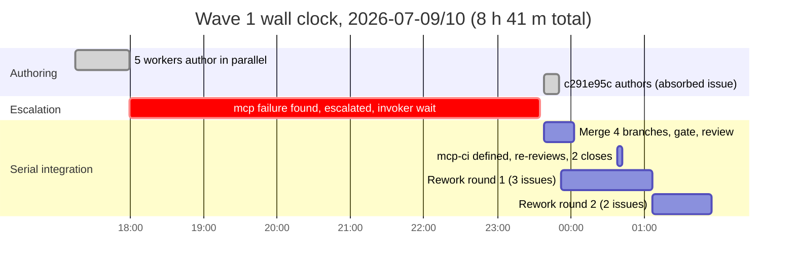

# Multi-Agent Parallelism Analysis: Epic dbe1e821 Execution

> **Provenance**: Analyzed 2026-07-10 from the live record of epic `dbe1e821`
> (Work-graph abstraction integrity), driven by the `jit-execution-lead` skill:
> `dev/active/dbe1e821-progress.json`, 33 gate runs under `.jit/gate-runs/`,
> the interleaved `main` commit history (2026-07-09 17:14 through 2026-07-10 11:26,
> UTC+3), the skill tree under `~/.claude/skills/jit-{execution-lead,parallel,manage}/`,
> and this repository's gate/rule/config registries. Every observation below was
> re-verified against those sources; the study notes where the session-reported
> account was overstated or wrong.

## Executive Summary

The parallel-authoring machinery worked: five workers delivered six issues'
implementation in 45 minutes of wall clock with zero worktree incidents.
The wall clock went elsewhere. Wave 1 took 8 h 41 m end to end, of which
5 h 36 m was a single open escalation during which four already-authored,
escalation-independent issues sat unmerged and unreviewed, and 2 h 20 m was
strictly serial integration: 12 cargo-ci runs (45 min of compute) and 17
AI-review runs (~27 min) executed one at a time on the lead's critical path.
The review protocol earned its cost, catching three correctness defects that
cargo-ci passed, but its own reference files prescribe a `jit gate runs`
subcommand that does not exist, so the mandatory cumulative-audit step in every
rework prompt was inoperative for the whole epic. The highest-value changes are
process, not tooling: keep integrating during escalations, stop re-running
identical gate checks per issue, and lint the skill tree's commands against the
installed CLI.

---

## 1. What Actually Happened

### 1.1 Run shape

| Metric | Value |
|---|---|
| Epic | `dbe1e821` — Work-graph abstraction integrity |
| Planned issues | 10, in 5 waves; +1 absorbed mid-wave (`c291e95c`, invoker-approved) |
| Observed through | Wave 2 verdicts (waves 3–5 pending at time of writing) |
| Worker dispatches | 9 issue workers + 5 rework workers, all via SHA-anchored worktrees |
| Rework cycles | 7 (wave 1: 69ffdcf8 ×2, 50677708 ×1, 2f447380 ×2; wave 2: e486a854 ×1, 136268f8 ×1) |
| Escalations | 1 (cross-epic dependency + gate coverage hole; invoker absorbed `c291e95c`, filed `950256ae`) |
| Bugs filed during execution | 2 (`950256ae` npm-ci coverage hole, `894337e2` find_available_port TOCTOU) |
| Worktree incidents (stale base, leakage) | 0 |
| Concurrent second lead | epic `287c4051` (docs-accuracy), same checkout, same branch, commits interleaved from 02:14 |

### 1.2 Wave-1 timeline (UTC+3)

Attribution of the 8 h 41 m: **45 min** parallel authoring, **5 h 36 m**
escalation window (last worker commit 17:59 → escalation resolution commit
`78cba087` 23:35), **2 h 20 m** integration, gating, review, and two rework
rounds. Wave 2 repeated the shape at smaller scale: 3 workers authored in
01:56–02:56, integration ran 11:00–11:26 after the overnight session boundary,
one rework round for `e486a854` closed in 15 minutes.

### 1.3 Gate compute (all recorded runs for the epic's issues)

| Gate | Runs | Total compute | Per-run range | Notes |
|---|---|---|---|---|
| cargo-ci | 12 | 45.1 min | 70 s – 546 s | 70–76 s with a warm target dir; 214–546 s after merges force rebuilds. Suite: 3521 tests. |
| code-review | 17 | ~27 min | 54 s – 152 s | AI reviewer via `scripts/ai-review.sh`; 9 failed, 8 passed |
| npm-ci | 1 | 80 s | | web workspace only |
| mcp-ci | 3 | ~3 s | ~1 s | defined mid-epic; the whole mcp-server suite runs in about one second |

Every run executed serially on the lead's critical path: merge issue, run its
cargo-ci, run its code-review, next issue. Twelve cargo-ci runs covered at most
five distinct merged-tree states; the checker takes no issue context
(`pass_context = false` in `.jit/gates.toml`), so runs at the same commit are
byte-identical work repeated per issue.

### 1.4 Rework ledger and findings classification

11 findings across 9 failing code-review runs (from the structured
`JIT-FINDINGS-JSON` blocks in `.jit/gate-runs/`):

| Issue | Rounds to PASS | Findings (severity) | Class |
|---|---|---|---|
| a1fe0c6e | 1 | none | |
| b6eb2585 | 1 | none | |
| 50677708 | 2 | missing `# Examples` on new public APIs (med) | docs standard |
| 69ffdcf8 | 3 | stale "not Done"/"incomplete dependencies" wording ×3 (med, low, low) | prose staleness |
| 2f447380 | 3 | apply lock excludes no writers (high); rollback stamps `updated_at` (high) | **correctness** |
| c291e95c | 2 | REQ-02 unevidenced, no gate ran mcp-server suite (high) | process/gate hole |
| a4e8d5ac | 2 | prerequisite still in_progress (high) | sequencing artifact |
| e486a854 | 2 | GET /graph omits `{"count": N}` envelope (high) | contract |
| 136268f8 | open | test rebuilds the binding map by hand (high); doc misstates `roles.planning` (med) | **test fidelity**, prose |

Tally: 3 correctness-class findings (all invisible to cargo-ci, which passed on
every failing round), 1 output-contract, 5 prose/docs, 2 process artifacts not
attributable to workers. Severity: 6 high, 3 medium, 2 low.

---

## 2. Friction Taxonomy

Each numbered observation from the session, verified against the record.

### F1. Gate coverage hole (npm-ci never enters mcp-server) — VERIFIED

`.jit/gates.toml` `npm-ci` checker: `cd web && npm test -- --run && npm run
lint && npm run build`. Nothing entered `mcp-server/` until `mcp-ci` was
defined at 00:38 (commit `6fd9b667`, invoker-approved). The mechanism: gates
are keyed by name, issues carry gate keys, and nothing anywhere binds a gate
to the code it exercises. `a4e8d5ac` (mcp-server-only change) carried
npm-ci + code-review; both would have passed with the mcp-server suite red.
It was caught only because REQ-02 said "MCP server tests pass" and the lead
demanded recorded evidence for it (the reviewer's finding cites the npm-ci
run's stored stdout as proof the wrong workspace ran). Codified irony: the
missing check costs ~1 second per run.

### F2. Nothing maps gates to the code they cover — VERIFIED

Confirmed by inspection of `.jit/gates.toml` (no path field; `[gates.reserved]`
is an empty extension table) and `jit --schema`. Rules (`.jit/rules.toml`)
have `when` selectors over type/state but nothing over paths. A worker can
change any workspace no gate exercises and reach Done. See proposal P3.

### F3. Review round-trips dominated wall clock — OVERSTATED, mechanism real

Corrections to the reported account:

- "Each cycle = full cargo-ci (~6–10 min)" holds only for cold trees. Measured:
  70–76 s warm, 214–546 s after merges. Median across the epic's 12 runs: ~95 s.
- Rework round-trips were **not** the largest wall-clock item. The escalation
  window (5 h 36 m) was 2.4× the entire integration phase (2 h 20 m), which
  itself contained all five wave-1 rework cycles. A rework round measured
  45–75 min for 2–3 issues including agent authoring time; gate compute was
  ~20 min of each round.

The real mechanism is serialization, not per-run cost: 12 cargo-ci runs for ≤5
tree states, and reviews run one at a time (F11).

### F4. Sweeps grepped phrasings, not emitting sources — VERIFIED

`69ffdcf8` REQ-4 bans describing dependency satisfaction as "not Done". R1
fixed doc sites; R2 still failed on `commands/dependency.rs` doc comments and
doc echoes. The lead's root-cause trace (recorded in the progress file's
review_findings) found `errors.rs:827` shipping the literal
`"issue blocked by {} incomplete dependencies"`; every doc hit was an echo of
binary output. Both the worker sweep and Tier 2.5 scoped greps to docs. The
fix commit `d705b70d` renamed the emission at source ("unmet dependencies",
now matching the `unmet_dependencies` JSON field). A mechanical check exists:
grep source string literals along with docs, and trace any doc hit that quotes
program output to its emitter (P10). This finding consumed 2 of the
MAX_SAME_FINDING_REPEATS=3 escalation budget.

### F5. Same criterion, two defects, two rounds — VERIFIED

`2f447380` REQ-2 ("a write failure leaves the issue store observably
unchanged") failed R1 (apply held `.git/jit/locks/apply.lock` while ordinary
writers hold `.jit/.index.lock`, so the lock excluded nobody; confirmed against
`storage/json.rs:508` and `commands/mod.rs:1054`) and R2 (rollback restored via
`save_issue`, which stamps `updated_at`). At the time this was fixed with a
verbatim compensating write; aggregate repository deltas later replaced that
escape hatch by publishing or rolling back the complete captured state. A
byte-comparison property test over injected write failures would have caught the
R2 leak on first run; it would **not** have caught R1, which is a cross-process
interleaving hole a single-process test never exercises. So a store-unchanged
property (P11) halves this class; it does not close it.

### F6. Tests that reproduce production logic — VERIFIED

`136268f8` R1 finding (high): the "end to end" test at
`crates/jit/tests/template_binding_tests.rs:165` reconstructs `main.rs:2747`'s
anchor-binding map by hand instead of driving the CLI, so reverting the
production line leaves the test green. Coverage metrics cannot see this; a
reverted-diff check can (P9).

### F7. Idle is not done — PARTIALLY VERIFIABLE, structural gap confirmed

The specific incidents live in the session transcript, but the repo shows the
pattern's history: preserve-WIP commits exist on worker branches from earlier
epics (`0083201d`, `3a02460c` "preserve session worker WIP after session cut",
`517ed07b`). The structural gap is confirmed in the skill: the dispatch header
says "Commit on your worktree branch only" but no protocol makes a committed,
clean tree part of the completion signal, so an idle notification is ambiguous
between "done and committed", "done, forgot to commit", and "mid-write".
Additional finding while verifying: 14 worktrees and 20 `worktree-agent-*`
branches are currently live; the protocol has no cleanup step, and the dispatch
script hard-fails on a name collision, so stale worktrees accumulate until they
block a future dispatch of the same short-id.

### F8. Leak check false-fires on the lead's own writes — VERIFIED

`check-leak-into-main.sh` byte-compares `git status -uall --porcelain` against
the pre-dispatch snapshot. The lead legitimately writes `.jit/gate-runs/`,
`.jit/events.jsonl`, `.jit/issues/*.json`, and the progress file on main
mid-wave (e.g. filing `950256ae` at 23:35, recording gate runs continuously),
and commits on main mid-wave, so the status set always differs from the
snapshot in both directions. Every post-wave check reports differences and the
lead must eyeball-classify them, which is exactly the manual judgment the
script exists to remove.

### F9. Two leads, one working tree — VERIFIED

Second lead claimed epic `287c4051` at 02:14 (`94a22be2`); its commits
interleave with wave 2 for the next hour. The progress file's
`concurrency_note` records the survival rules as voluntary discipline: stage
only own paths, never `git add -A .jit`, never `jit recover` (deletes the other
lead's locks). Concrete near-misses in the record: the docs lead rewrote
`docs/reference/cli-commands.md` (`f1e20822`) hours after this lead's 69ffdcf8
R2 fix touched the same file (`cli-commands.md:1394` was a review finding), and
wave-5 issue `bbaedb0f` plans a naming sweep over docs the other lead was
actively rewriting. Both leads' cargo-ci runs also contend for the host-wide
flock, so their gate phases serialize against each other invisibly (b6eb2585's
541 s run at 02:46 overlaps the docs lead's gating window). Nothing broke; the
protection was attention, not protocol.

### F10. Stale command in the skill's references — VERIFIED, and worse than reported

`jit gate runs` does not exist (verified against the installed CLI; the
inspection surface is `jit gate status <id> --gate <k> --all [--status failed]
--json`, envelope `{"count": N, "results": [...]}`). The broken invocation
appears in **two** files, not one:

- `references/rework-prompt-template.md:17` — step 1 of the "Required
  pre-commit audit" that every rework prompt marks mandatory. Every rework
  dispatch this epic shipped a broken first command. One worker reported it
  and stopped; the audit's cumulative-findings mechanism was inoperative all
  epic and survived only because the lead pasted full verdicts into prompts.
- `references/lead-review-protocol.md:23` — Tier 1.5's own enumeration command.

Sweeping the rest of the skill tree against the installed CLI found three more
staleness defects:

- `jit-manage` Workflow E step 4: "Run automated gates: `jit gate check-all`".
  `check-all` is now a silent alias of the **read-only** `status-all`; it
  evaluates nothing. The evaluating verb is `jit gate evaluate-all`. (Lead
  SKILL.md Tier 1 / 5e use `check-all` for status verification, which still
  works but reads as evaluation.)
- `jit-parallel/references/worktree-mode.md` runs `jit init` inside worktrees
  of an already-initialized repo (worktree checkouts carry `.jit/`), and its
  checkout-main-and-merge flow contradicts the lead's worktree-dispatch
  protocol that supersedes it.
- `jit-parallel/references/agent-prompt-template.md:7` hardcodes
  `/home/vkaskivuo/Projects/just-in-time` in a nominally project-generic skill.

`jit graph downstream`, reported as suspect, is fine: it is a hidden alias of
`jit graph rdeps`.

### F11. Serialized merges — VERIFIED

Wave 1: five branches authored in parallel by 17:59; merged 23:38–23:54 one at
a time; gated and reviewed strictly per issue (see the gate-run timestamps in
§1.3, each issue's cargo-ci → code-review → next issue). Parallel authorship,
serial integration. The bottleneck decomposes as: (a) redundant cargo-ci runs
per issue at the same tree state, (b) AI reviews run sequentially though they
are independent, (c) the merge-gate-review pipeline never overlaps issue N+1's
gates with issue N's review. Note one deliberate constraint: `cargo-ci.sh`
serializes builds host-wide by flock **by design** (CPU/RAM protection), so
the lever is eliminating redundant runs, not parallelizing them.

### F12. Wave planning hand-derived — VERIFIED

The wave rationale in the progress file is a hand-written file-footprint
argument ("69ffdcf8 owns domain/{types,queries}.rs + output.rs ...").
The dependency layering the lead computed by hand is mechanical from data jit
already has (`jit graph deps`, `jit graph export --format json`). The footprint
half is not mechanical today, but the raw material is close: issue Backgrounds
in this epic already name file:line sites (69ffdcf8's Background lists four).
The lead's guesses were, for the record, accurate: no intra-wave file conflicts
occurred.

---

## 3. Proposals

Ranked by expected value. Class labels: **Skill** (edit
jit-execution-lead/jit-parallel/jit-manage files and scripts), **Product**
(feature in jit itself), **Project-config** (this repo's `.jit/`).

| # | Proposal | Class | Removes |
|---|---|---|---|
| P1 | Escalations block only their dependency cone | Skill | multi-hour stalls (5 h 36 m observed) |
| P2 | Fix stale commands; add a skill-tree command lint | Skill | broken mandatory audit, silent alias drift |
| P3 | Share gate runs per tree state; run reviews concurrently | Product + Skill | ~25–45 min serial gate compute per wave |
| P4 | Worker completion contract (commit-then-report) | Skill | idle-vs-done ambiguity, lead-preserve commits |
| P5 | Gate-to-path coverage map + unclaimed-workspace check | Product + Project-config | the 950256ae class of coverage holes |
| P6 | Leak check learns lead-owned paths | Skill | 100% false-positive rate on post-wave checks |
| P7 | Phrase sweeps trace to the emitting source | Skill | multi-round prose-staleness loops |
| P8 | Reverted-diff test-fidelity check | Skill | tests that reproduce instead of invoke |
| P9 | One integrator per checkout; concurrent leads isolate | Skill (+ small Product) | cross-lead contamination hazards |
| P10 | Store-unchanged assertion helper | Project-config | half of the atomicity-leak class |
| P11 | Declared footprints + computed waves | Product + Project-config + Skill | hand-derived wave plans |

### P1. Escalations block only their dependency cone — **Skill**

**Change.** In SKILL.md Section 9 and `escalation-policy.md`, state: an open
escalation suspends only the issues in its dependency cone (the escalated issue
and everything depending on it). The lead continues merging, gating, reviewing,
and reworking every other wave member while waiting. Section 5c already says
"as each sub-agent completes, execute Section 7"; make explicit that an open
escalation does not pause that loop.

**Evidence.** Four of six wave-1 issues (69ffdcf8, 50677708, 2f447380,
a1fe0c6e) were authored by 17:59, were independent of the a4e8d5ac/c291e95c
escalation, and were not touched until 23:38. Their entire subsequent
processing, including five rework cycles, took 2 h 20 m. Had it run inside the
escalation window, wave 1 closes roughly when the escalation resolves: ~5.5 h
saved on an 8.7 h wave.

**Cost.** A paragraph. **Risk.** An escalation outcome can invalidate merged
siblings' work; bounded because wave planning already asserts disjoint
footprints, and the merged issues are not closed until review passes anyway.
**Measure.** Wall clock from last worker completion to first merge, per wave.

### P2. Fix the stale commands; lint the skill tree against the CLI — **Skill**

**Changes.**

1. `rework-prompt-template.md:17` and `lead-review-protocol.md:23`: replace
   `jit gate runs <id> --gate code-review --json | jq '.runs[] ...'` with
   `jit gate status <id> --gate code-review --all --status failed --json | jq -r '.results[].run_id'`.
2. `jit-manage` Workflow E step 4: `jit gate check-all` → `jit gate
   evaluate-all` (the intent is evaluation; `check-all` is now a read-only
   alias of `status-all`). In lead SKILL.md Tier 1/5e, rename `check-all` to
   `status-all` so the text says what it does.
3. Rewrite or delete `jit-parallel/references/worktree-mode.md` (the `jit init`
   step is wrong for an initialized repo; the merge flow is superseded by the
   lead's worktree-dispatch protocol; defer to it).
4. Replace the hardcoded repo path in
   `jit-parallel/references/agent-prompt-template.md` with a placeholder.
5. Add `scripts/lint-skill-commands.sh` to the jit-execution-lead skill:
   extract `jit …` invocations from the skill tree's fenced blocks, resolve
   each against `jit --schema`'s command tree, fail on unknown verbs. Run it
   whenever the skill or the CLI surface changes.

**Cost.** Hours. **Risk.** None material; the lint needs maintenance but its
failure mode is a false alarm, not silent breakage. **Measure.**
Worker-reported command errors per epic (one this epic, plus an unknowable
number of silently skipped audits) → zero.

### P3. One gate run per tree state; concurrent reviews — **Product + Skill**

**Product change.** `jit gate evaluate <id> <gate>` gains `--also <id>...`:
run the checker once and record the same run (same run_id, stdout, commit)
against every listed issue that requires the gate. Guard: allowed only for
gates with `pass_context = false` (issue-independent checkers); a
`pass_context` gate always runs per issue. Alternative shape with the same
effect: the executor notices an existing run for the same gate key + checker
command + HEAD commit and offers `--reuse-run <run-id>`.

**Skill change.** Section 6/7 ordering per wave: merge all reviewed-ready
branches first, then one `cargo-ci --also` for the batch, then dispatch the
per-issue code-review evaluations concurrently (background Bash; they are
independent contexts, 54–152 s each). Re-run the shared gate once more after
the last rework merge of a round rather than per issue.

**Evidence.** Wave 1 recorded 12 cargo-ci runs (45 min) across ≤5 distinct
tree states; sharing brings that to ~5 runs (~20 min), and the 4 initial
reviews at 23:43–23:47 (serial, ~7 min) become one ~2.5 min parallel batch.
Expected saving 25–45 min per wave round, more in rework-heavy waves.

**Cost.** Product: medium (run provenance: the run record gains a
`shared_with` field; `gate status` shows it). Skill: small. Requires invoker
approval as a gate-semantics change (escalation category 8). **Risk.** See
counterargument §4.2. **Measure.** Gate-run count per distinct tree state;
total gate compute minutes per wave.

### P4. Worker completion contract — **Skill**

**Change.** The dispatch header (emitted by `dispatch-worker-worktree.sh`)
gains: "Done means committed. Before your final report: commit all work on
your branch, then end your final message with a `WORKER-RESULT` block
containing branch name, HEAD SHA, the output of `git status --porcelain`
(must be empty), and `complete: yes/no`." Lead side (SKILL.md 5c): an idle
notification without a `WORKER-RESULT` block is *in progress*, not done; before
reviewing any worker, run `git -C .claude/worktrees/agent-<id> status
--porcelain` and `git log -1` and reconcile against the block. Add a wave-end
cleanup step: after an issue closes, `git worktree remove` + branch delete
(the record shows 14 live worktrees and 20 stale branches; the dispatch script
hard-fails on collisions).

**Cost.** Prompt text + one lead check + two cleanup lines. **Risk.** None;
lead-preserve remains the fallback for crashed workers. **Measure.**
Lead-preserve commits per epic for non-crash reasons → zero; stale worktree
count after epic close → zero.

### P5. Gate-to-path coverage — **Product + Project-config**

**Product change.** Gate definitions gain an optional `covers = ["<glob>", …]`
field. New command `jit gate coverage <issue> --diff <base>..<head>`: list the
diff's files matched by no `covers` glob of any gate required on the issue;
exit 4 when the uncovered set is nonempty. A second, diff-free check as a
validate rule: every top-level directory containing a recognized build manifest
(`Cargo.toml`, `package.json`) must be matched by at least one registered
gate's `covers`. That static form would have flagged `mcp-server/` the day the
gate registry was written, with no issue in flight.

**Project config.** `covers` for this repo: cargo-ci `["crates/**",
"Cargo.toml", "Cargo.lock"]`, npm-ci `["web/**"]`, mcp-ci `["mcp-server/**"]`,
code-review `["**"]`.

**Skill change (small).** Lead review gains a Tier 0.5: run `jit gate coverage`
on the worker branch's diff before merging; an uncovered file is an automatic
gate-assignment fix or escalation.

**Cost.** Medium: new registry field, new command, one rule. **Risk.** Mapping
rot as the tree moves; the manifest-directory check is the rot detector, and
`covers` on this repo's four CI gates tracks workspace roots, which rename
rarely. **Measure.** Recurrence of the 950256ae class → zero; coverage-gap
flags caught at review Tier 0.5 rather than by criterion-reading luck.

### P6. Leak check learns lead-owned paths — **Skill**

**Change.** `check-leak-into-main.sh` gains `--lead-owned <glob>` (repeatable;
default set: `.jit/**`, `dev/active/*-progress.json`,
`dev/active/*-handoff*.md`). Entries matching lead-owned globs are reported
under a separate "lead-owned writes (expected; verify authorship)" heading and
do not fail the check; all other differences remain hard failures.
`dispatch-worker-worktree.sh` gains `--resnapshot` to refresh the baseline
after the lead's own mid-wave commits.

**Evidence.** Every post-wave check this epic fired on the lead's own
`.jit/gate-runs/`, `events.jsonl`, and issue-record writes; the signal the
script exists to give (a worker wrote into main) was buried in expected noise.

**Cost.** ~20 lines of shell. **Risk.** A worker that (illegally) writes
`.jit/` into main is downgraded from hard failure to a listed warning; workers
are already forbidden from `.jit/` writes and the paths still appear in the
report. **Measure.** False-positive rate of post-wave checks (100% this epic).

### P7. Phrase sweeps trace to the emitting source — **Skill**

**Change.** Tier 2.5 (lead-review-protocol.md) and Sweep 3
(rework-prompt-template.md) amendments: when a criterion or finding bans a
phrasing, (1) the sweep runs over source string literals and help text as well
as docs (`rg -n "<phrase>" crates/ web/ mcp-server/ docs/ dev/`), and (2) for
every doc hit, determine whether it quotes program output; if it does, the
emitting `format!`/help string is the defect and every doc hit is an echo. Fix
the emitter first, then regenerate and re-sweep.

**Evidence.** F4: three rounds on 69ffdcf8, two sweeps that both scoped to
docs while `errors.rs:827` kept emitting the banned phrase.

**Cost.** Text. **Risk.** None. **Measure.** Prose-staleness findings that
recur across rounds (this epic: 3 findings over 3 rounds on one issue).

### P8. Reverted-diff test-fidelity check — **Skill**

**Change.** In Tier 2, for each criterion of the form "behavior X is covered
by a test": in the worker's worktree before merge, temporarily revert the
production hunks (`git stash push -- <prod files>`, keeping tests), run the
cited tests, require failure, restore. A cited test that stays green against
reverted production code reproduces logic instead of invoking it, and fails the
tier. Full mutation testing (`cargo-mutants` scoped to the diff) is the
heavyweight escalation for suspicious cases, not the default.

**Evidence.** F6: the 136268f8 finding is mechanically detectable this way and
invisible to every existing gate.

**Cost.** Minutes per review, only on test-coverage criteria. **Risk.**
Multi-crate reverts can be fiddly; doing it in the worker's worktree (not the
shared main checkout) contains the mess. **Measure.** Recurrence of
reproduce-instead-of-invoke findings.

### P9. One integrator per checkout — **Skill**, small **Product**

**Verdict on the question asked.** The one-checkout model is not salvageable
for two *writing* leads. The hazards are structural, not behavioral:
`git add -A .jit` sweeps the other lead's in-flight gate-run records into the
wrong commit; `jit recover` deletes locks the other lead holds; both leads'
commits interleave on one branch; auto-merges of shared docs happen silently.
This epic survived on the voluntary rules in the progress file's
`concurrency_note`, which is attention, not protocol.

**Change (Skill).** A hard precondition in SKILL.md Section 1: at most one
execution lead writes a given checkout+branch. A concurrently dispatched lead
runs in its own worktree on branch `lead-<epic-short-id>`, executes its whole
loop there (its workers' worktrees anchor to that branch's HEAD), and merges to
main only at wave boundaries; the main-merge is a critical section coordinated
through the existing advisory lease system (`jit claim acquire` against the
epic, which already spans worktrees via `.git/jit/`). `jit recover` becomes
lead-forbidden while any other lead is active.

**Change (Product, small).** `jit recover` already PID-checks stale locks;
verify and document that it never deletes a lock whose owner is alive, and add
`--dry-run` output the skill can require leads to read before confirming.

**Cost.** Skill medium; no new product machinery beyond the recover guard.
**Risk.** Wave-boundary merges are bigger and can conflict; that is the
desired failure mode, since a conflict is visible where a silent auto-merge is
not. Gate evidence recorded on the lead branch refers to pre-merge tree
states; the wave-close merge re-runs the shared CI gate once on main
(cheap under P3). **Measure.** Cross-lead commit contamination incidents;
conflicts surfaced at merge points instead of discovered in review.

### P10. Store-unchanged assertion helper — **Project-config**

**Change.** A `TestHarness` helper `assert_store_unchanged(f)`: snapshot every
byte under `.jit/issues/` plus the index before `f`, byte-compare after.
Criteria of the form "a write failure leaves the store observably unchanged"
are then expressed once as a property test injecting failures at each write
step, instead of the reviewer discovering leak surfaces one round at a time.

**Honest scope (from F5).** This catches the `updated_at`-stamp class on first
run; it does not catch the lock-exclusion class, which needs cross-process
interleaving. Half a fix, cheaply.

**Cost.** Small helper + a testing convention note in CLAUDE.md/TESTING.md.
**Measure.** Rounds-to-close on atomicity criteria (2f447380 took 3).

### P11. Declared footprints and computed waves — **Product + Project-config + Skill**

**Change.** Issue descriptions gain an optional `## Footprint` section: a
bullet list of path globs the work expects to touch (issue Backgrounds in this
epic already name exact files, so authors have this knowledge at breakdown
time). A warn-severity rule (like `orphan-leaf`) flags implementation issues
under an epic that lack one. New command `jit graph waves <container> --json`:
compute the topological layering of the container's impl interior (mechanizing
SKILL.md Section 4 steps 1–2), and, where footprints exist, annotate intra-wave
pairs whose glob sets intersect so the lead sub-serializes them. The lead
consumes the output as a draft and retains override; review Tier 3's scope
check gains a mechanical input (diff paths vs declared footprint).
Co-change mining from `git log --name-only` is a later refinement for issues
without declarations, not v1.

**Cost.** Highest here: new command, new rule, description-authoring habit.
**Risk.** A wrong footprint produces a false "disjoint" verdict, which is worse
than the lead's suspicious hand-analysis; mitigated by the post-hoc diff
comparison feeding accuracy stats back into review. **Measure.** Wave-planning
time; unpredicted same-file merge conflicts (zero this epic under hand
planning, so the bar is "no worse, much faster").

---

## 4. Counterarguments to the Top Three

### 4.1 Against P1 (integrate during escalations)

Wave discipline exists to keep the merged tree coherent: Section 0 invariant 5
says a wave completes before the next begins, and an open escalation means the
wave's final shape is unknown. Merging four issues while the invoker decides
the fifth's fate risks building review verdicts on a tree the resolution then
changes; the c291e95c absorption did add commits the reworks later sat on. If
escalation resolutions routinely touch shared surfaces (new gates, absorbed
issues with overlapping footprints), eager integration converts one stall into
several rework cycles, which are more expensive per hour than waiting.
**What would change my mind:** evidence from future epics that
escalation outcomes invalidate independent siblings' merged work more than
rarely; this epic's resolution (an mcp-server-only absorption) touched nothing
the four independent issues owned, which is one data point, not a law.

### 4.2 Against P3 (shared gate runs)

Per-issue gate evidence is the review protocol's trust anchor: Tier 1 says
"the gates are the source of truth", and every recorded run currently answers
"was THIS issue's required check run for THIS issue" with no indirection. A
shared run weakens attribution twice over: a batch cargo-ci failure names no
culprit issue (the bisect cost the serial protocol never pays returns), and
`gates are inviolable` culture erodes when runs can be "reused" — the
distance from `--reuse-run` to rubber-stamping is shorter than it looks, and
this workflow's whole character comes from refusing such shortcuts. The
observed waste is also bounded: ~25–45 min per wave, against a product change
that complicates run provenance permanently. **What would change my mind:**
if batch failures on merged wave trees prove rare in practice (this epic: every
post-merge cargo-ci passed; failures came from the AI reviewer), attribution
is a cost that almost never gets paid, and the saving is collected every wave.

### 4.3 Against P2's lint (and exact commands in skills at all)

The deeper problem F10 exposes is that skills hardcode exact CLI invocations
against a moving CLI: `check`→`status` renames already drifted once, and
freshly corrected commands re-arm the same trap. The alternative is to
prescribe capabilities ("enumerate this issue's failed code-review runs") and
let agents discover syntax from `--help`/`--schema` at run time, which can
never go stale. The counter-counter: exact commands are what make worker
prompts deterministic and cheap (a worker that explores `--help` per step burns
tokens and can still pick the wrong verb), and the lint makes staleness
detectable at edit time instead of mid-epic. **What would change my mind:**
if the lint itself rots (nobody runs it), capability-phrasing plus runtime
discovery beats a stale exactness; the lint needs a natural trigger, e.g.
running inside the skill's own eval suite.

Briefly, against P5 (gate-to-path): the mapping is config that can lie, and a
lying coverage map is worse than the current honest absence, because it
converts "nobody checked" into "checked and clean". Wave 5 (`bbaedb0f`) is
literally a rename sweep of the kind that rots such maps. The static
manifest-directory rule is the part with a favorable lie-resistance profile;
the `covers` globs earn their keep only if the rot detector stays on.

---

## 5. What Is Working and Must Not Be Removed

1. **The worktree dispatch protocol and its scripts.** Born from two documented
   incidents (stale-base worktrees, worker leakage into main, epic babcf05e).
   This epic's lead alone ran 14 dispatches (9 issue workers + 5 rework
   workers), the concurrent docs lead several more, with zero stale-base and
   zero leakage incidents. SHA-anchoring, the HEAD verification, and the
   prompt-header path discipline stay. P6 tunes the leak check's reporting;
   the check itself stays mandatory.

2. **The six-tier review with cumulative memory.** cargo-ci passed on every
   failing round; all three correctness-class findings (the apply-lock
   exclusion, the `updated_at` rollback stamp, the hand-rebuilt binding-map
   test) came from the code-review gate plus the lead independently confirming
   against source. Tier 1.5's regression table and Tier 2.75's deferred-items
   audit are the only memory the round-by-round AI reviewer has. The 2f447380
   lock bug is precisely the class that ships silently without this machinery.

3. **Literal reading of success criteria, and the no-argue discipline.** The
   npm-ci coverage hole was found *only* because "MCP server tests pass" was
   read as requiring recorded evidence, not plausibility. Softening
   criteria-reading would have shipped a green issue with a red test suite.

4. **Gates-inviolable plus escalation on gate changes.** The response to the
   coverage hole was an invoker-approved new gate (`mcp-ci`), not a lead
   improvising around a failing check. The gate registry stayed trustworthy
   because changing it required a human. Escalation category 8 (shared
   infrastructure) fired exactly as designed.

5. **Structured findings in gate runs.** The `JIT-FINDINGS-JSON` blocks and
   per-run timestamps in `.jit/gate-runs/` are what made this study
   quantifiable at all: severity ledgers, per-round finding recurrence, and
   gate-compute attribution all came from them. Keep `ai-review.sh`'s findings
   contract and the run-record schema stable.

6. **The cargo-ci wrapper's host protections and evidence shaping.** The
   host-wide flock kept two concurrent leads' builds from swamping the machine
   (they contended invisibly and correctly). The concise "3521 passed, 0
   failed" summary is what lets the AI reviewer trust recorded evidence instead
   of re-running tests in a sandbox where they fail spuriously. The stub-cargo
   guard prevents false-positive gate passes.

7. **The progress file and handoff discipline.** Wave 2 resumed cleanly across
   the 03:17 → 11:00 session boundary from `dev/active/dbe1e821-progress.json`;
   the `concurrency_note` and `review_findings` fields were this study's ground
   truth. The per-issue `rework_counts` plus MAX_SAME_FINDING_REPEATS gave the
   69ffdcf8 prose loop a hard ceiling; it was one repeat away from escalating,
   which is the correct backstop for a worker not learning.

8. **Small waves with disjoint hand-verified footprints.** Zero intra-wave
   file conflicts across two waves. P11 mechanizes this; nothing should relax
   it.
