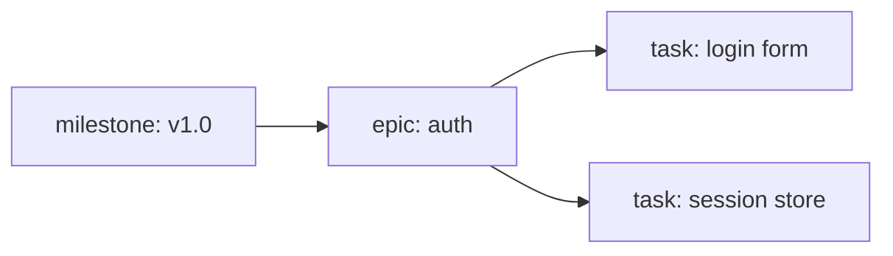
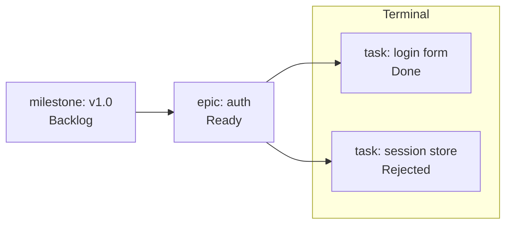

# Containment and Completion

> **Diátaxis Type:** Explanation

JIT's work graph has exactly one edge kind. Containment, ordering, and the fact
that a container finishes after everything inside it are all consequences of how
that single edge is read. This page states the model; [Hierarchy
Resolution](hierarchy-resolution.md) specifies the facts the resolver derives
from it.

## One edge kind

An issue carries a list of dependencies: the ids of the issues that must reach a
terminal state before it can proceed (`Issue::dependencies`). That is the whole
edge vocabulary. There is no separate "parent" edge, no "sub-task-of" edge, and
no "blocks" edge stored in the opposite direction.

The graph of those edges is acyclic; cycle detection runs before every dependency
operation (`@/inv/dag-acyclic`).

## Direction: a container depends on its contents

A container issue depends on the work it contains. An epic lists its stories and
tasks among its own dependencies; a milestone lists its epics.

Each arrow reads "depends on". Following a container's outgoing edges into
more-tactical nodes yields its contents; the containers that hold a leaf are found
by following the edges in reverse — every container whose outgoing-dependency
closure reaches it.

The same edge also expresses plain ordering between peers: a task may depend on
another task with no containment intended. The resolver separates the two cases
by *type level*, not by edge flavor (see below).

## Hierarchy is derived, never stored

No issue stores a parent. Containment is computed on demand from two inputs:

1. the dependency edges, and
2. the configured type levels in `.jit/config.toml` (`[type_hierarchy]`), which
   say which types are containers and how deep each one sits.

A type is a container when its level is strictly less than the deepest configured
level. Type names themselves carry no meaning to the engine: a repository
declares its own vocabulary and levels (`@/inv/domain-agnostic`). Run `jit config
get type_hierarchy.types` to see the levels a repository declares.

From those two inputs `crates/jit/src/graph/hierarchy.rs` resolves a node's
parent, children, cluster, and rank. Every consumer (CLI, exports, web UI) reads
the same resolver, so there is one answer rather than one per tool.

### Membership labels are advisory

An issue may also carry a grouping label such as `epic:auth` or
`milestone:v1.0`. Resolution never reads those labels. They exist for filtering
and reporting (`jit query available --label epic:auth`).

When a label claims a membership the dependency edges do not back, the DAG wins
and the disagreement is reported rather than reconciled: `jit query divergence`
lists it, and `jit validate` counts it advisorily. The label does not move the
node in the resolved hierarchy.

## Containers become workable last

This is a consequence of the direction of the edge, not an extra rule. Three
facts compose:

1. A container depends on its contents (the edge direction above).
2. An issue is blocked while any of its dependencies is outside an *effective*
   terminal state (`Issue::is_blocked`). The terminal states are `Done` and
   `Rejected`, so a rejected dependency counts as met; `Archived` is
   terminality-preserving, so a dependency archived from `Done` or `Rejected`
   also counts as met, while one archived from a non-terminal state (or a legacy
   archived record with no recorded origin) does not.
3. A blocked issue never becomes workable: `jit query available` returns only
   unassigned issues in state `Ready` that are unblocked, and a `Backlog` issue
   auto-promotes to `Ready` exactly when it stops being blocked.

Compose them: a container is blocked while any issue it contains is not
effectively terminal. Because blocking follows the edges transitively, an epic
is blocked until every task beneath every story beneath it is `Done`,
`Rejected`, or `Archived` from one of those. So a container
surfaces as available work only once its entire subtree is terminal, and its own
work (the closing gates, the acceptance pass, the release note) is the last thing
the graph offers.

Here both tasks are terminal, so the epic is unblocked and workable; the
milestone stays blocked until the epic itself reaches a terminal state.

Two corollaries follow:

- **Closing a container is real work.** Whatever gates a container declares run
  after its contents are finished, which is when the evidence they check exists.
- **A dangling dependency blocks forever.** A dependency id that resolves to no
  issue is never terminal, so it blocks its dependent permanently. `jit validate`
  reports such edges.

## Where it surfaces

| Command | What it shows |
|---------|---------------|
| `jit graph tree` | The resolved parent/children/cluster/rank per node |
| `jit issue children <id>` / `jit issue progress <id>` | A container's contents and their state rollup |
| `jit query available` | Unblocked, unassigned, `Ready` work |
| `jit query blocked` | Blocked issues with the dependency or gate that blocks each |
| `jit query divergence` | Membership labels the DAG does not back |

## See also

- [Hierarchy Resolution](hierarchy-resolution.md) - the resolved facts and their
  edge cases
- [Core Model](core-model.md) - issues, states, gates
- [Item Addresses](../reference/item-addresses.md) - the address grammar for
  structured items inside issues
- [Labels](../reference/labels.md) - namespaces and the label format
