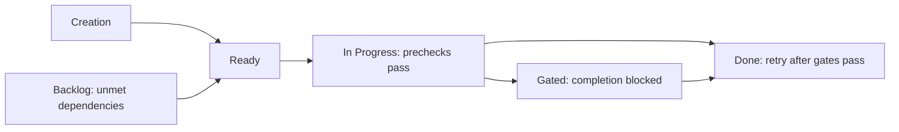
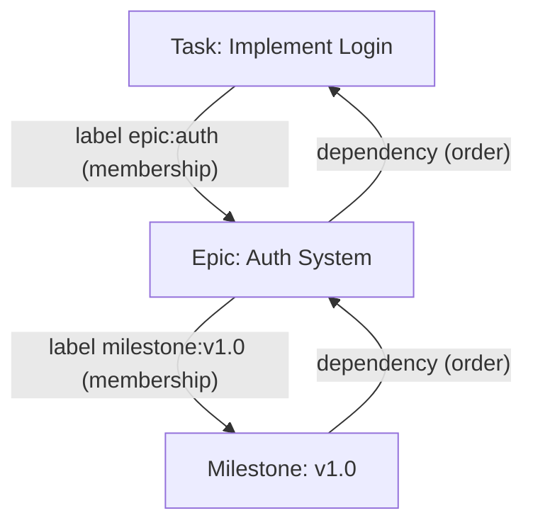
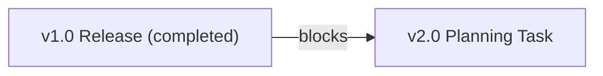
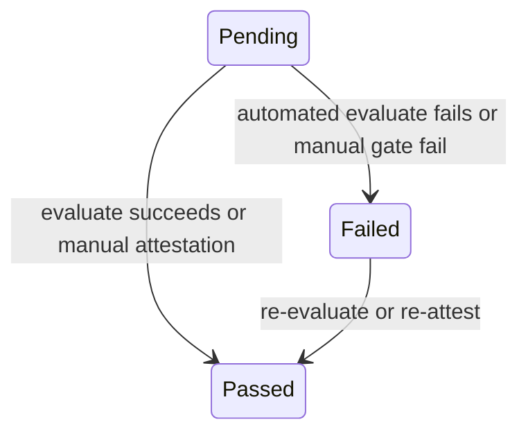
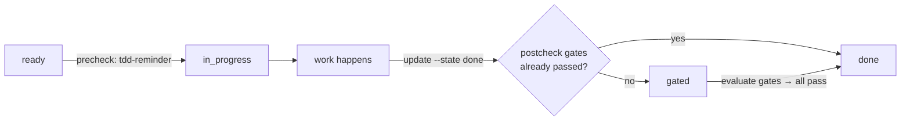
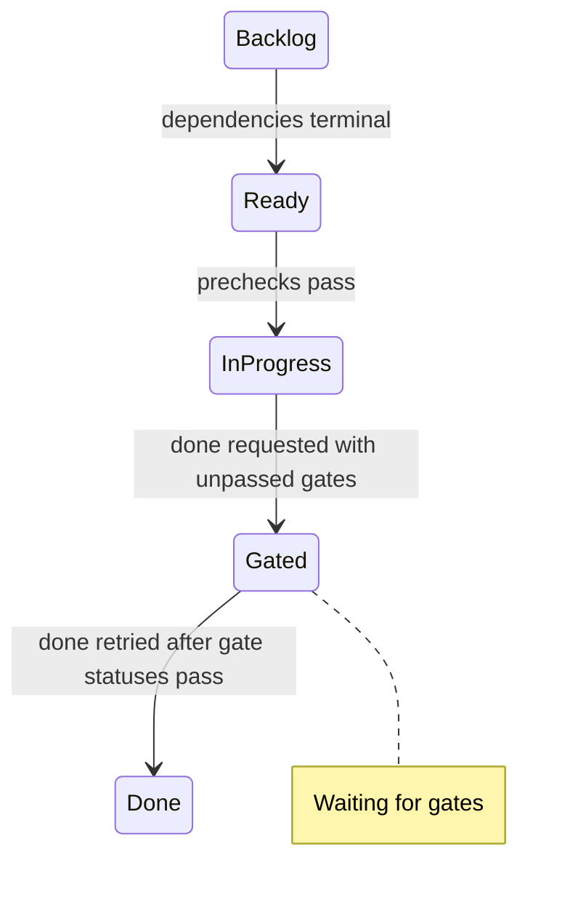
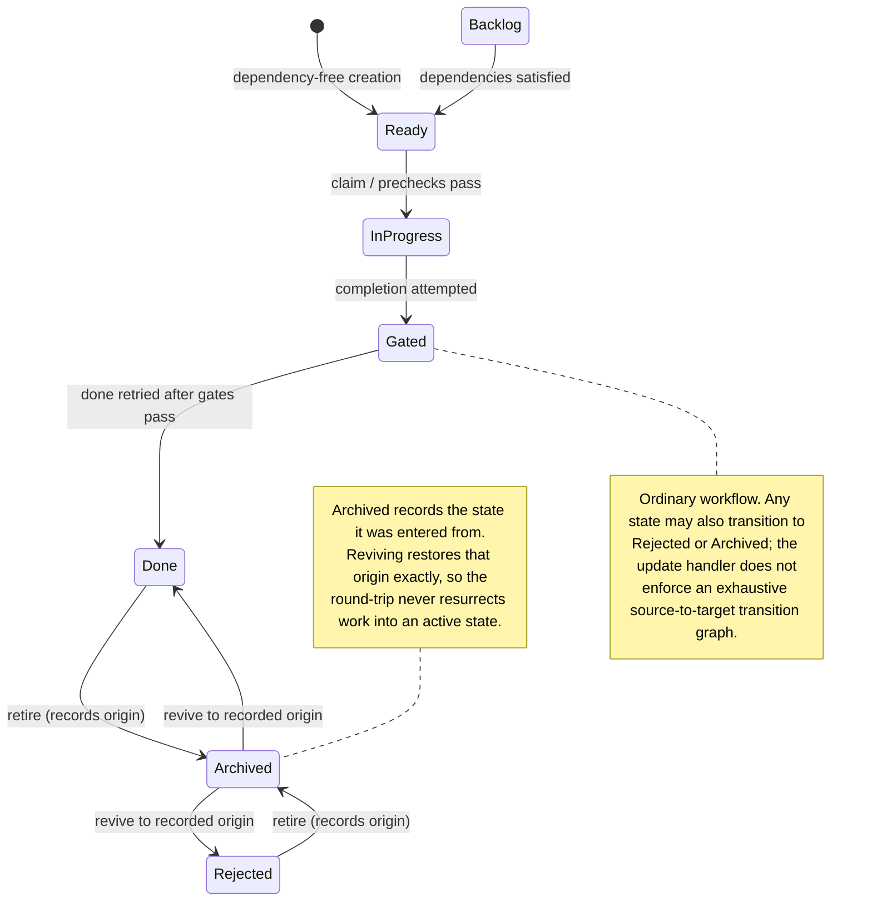
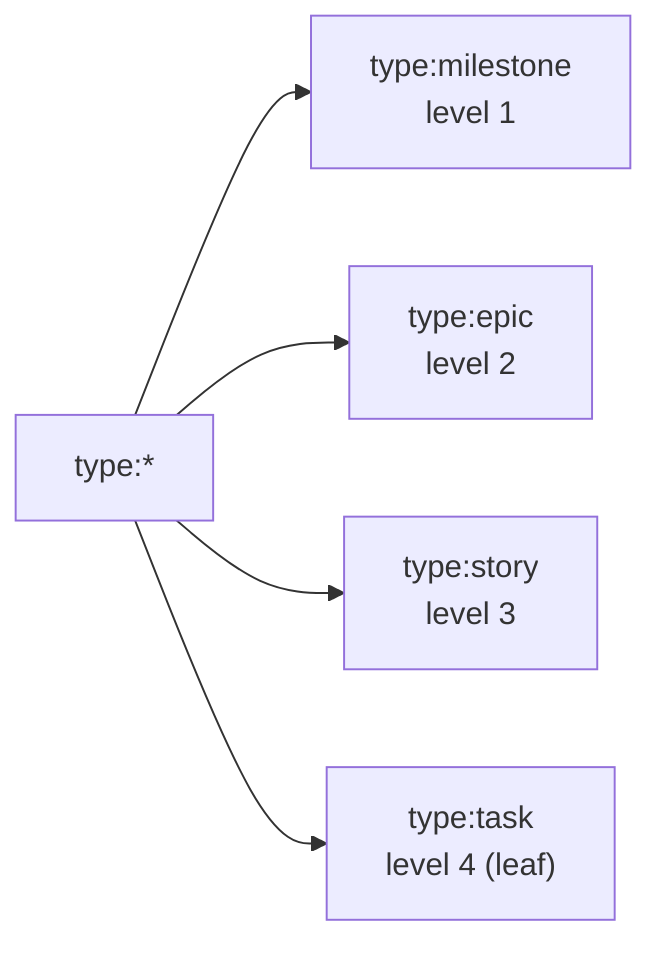
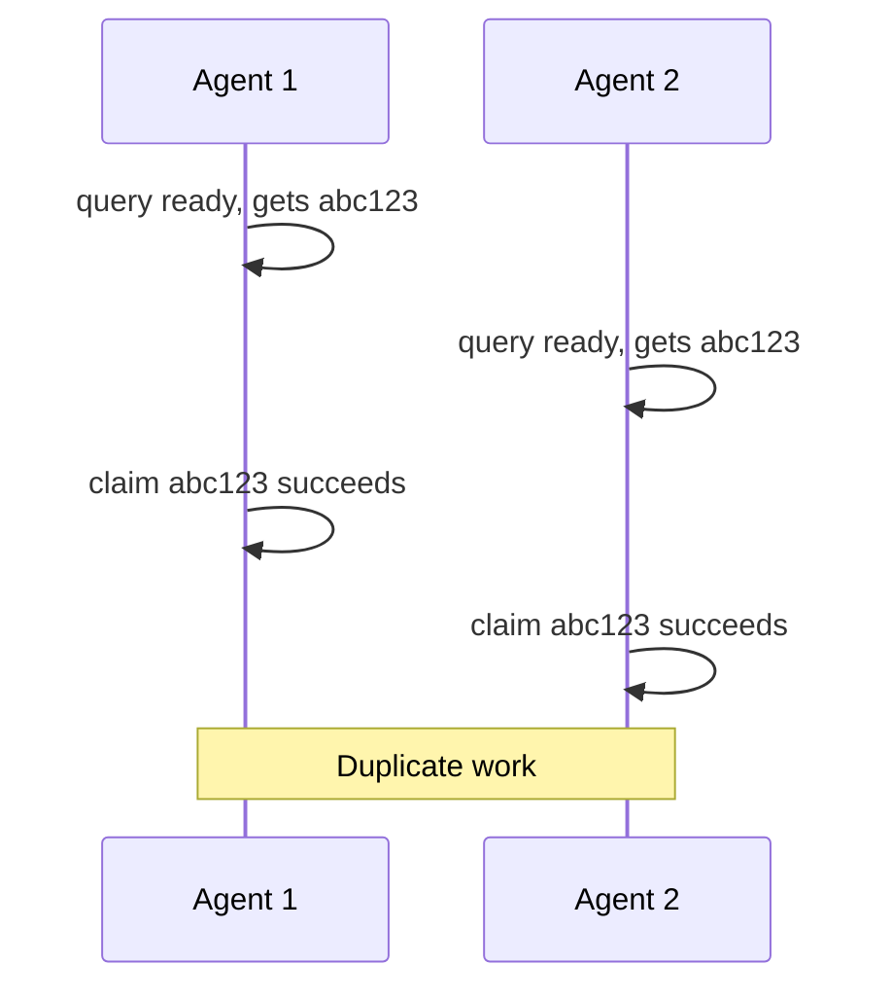

# Core Model

> **Diátaxis Type:** Explanation

## Issues

Issues are the fundamental unit of work in JIT. Everything you track - features, bugs, research questions, learning goals - is represented as an issue.

### What Are Issues?

**Issues** are universal work items that:
- Represent any trackable unit of work (domain-agnostic)
- Serve as the primary entity in the JIT system
- Can be organized hierarchically or independently
- Support arbitrary dependency relationships

**Relationship to traditional systems:**
- Similar to "tickets" (Jira), "issues" (GitHub), "cards" (Trello)
- But more flexible - not tied to software development terminology
- Usable for research, knowledge work, personal projects, any domain

### Core Properties

Every issue has the following properties:

#### ID - Unique Identifier
```
Full: abc12345-6789-4def-1234-567890abcdef (UUID)
Short: abc12345 (first 8 characters, case-insensitive)
```

- **Format**: UUID for global uniqueness
- **Short hash support**: Use minimum 4 characters (like git)
- **Collision-free**: UUIDs prevent conflicts across repositories

**Examples:**
```bash
jit issue show abc12345           # Short hash
jit issue show abc12345-6789      # Longer prefix
jit dep add 003f 9db2             # Minimal (4 chars)
```

#### Title - Human-Readable Summary

Short, descriptive summary of the work (single line):

```
"Fix login redirect bug"
"Add dark mode support"
"Research: Compare database options"
"Learn: Complete Python tutorial"
```

**Best practices:**
- Keep under 80 characters
- Start with verb (action-oriented)
- Be specific enough to differentiate from similar work

#### Description - Detailed Explanation

Markdown-formatted detailed explanation including:
- **What**: Specific work to be done
- **Why**: Context and motivation
- **Acceptance criteria**: How to know it's complete
- **Notes**: Any additional context, links, or constraints

**Example:**
```markdown
## Problem
Users get redirected to /home after login instead of their 
intended destination.

## Solution
Store the intended URL in session before redirecting to login page.
After successful auth, redirect to stored URL or default to /home.

## Acceptance Criteria
- Pre-login URL captured in session
- Post-login redirect uses stored URL
- Falls back to /home if no stored URL
- Works across browser sessions
```

#### State - Current Lifecycle Position

The issue's current position in the workflow. See [States](#states) for complete state machine.

**Primary states:**
- `backlog` - Created but not ready for work
- `ready` - All dependencies effectively terminal (`done`, `rejected`, or `archived` from one), can start work
- `in_progress` - Currently being worked on
- `done` - Completed successfully

#### Priority - Importance Level

Four priority levels:
- `critical` - Urgent, blocks other work
- `high` - Important, should be done soon
- `normal` - Default priority
- `low` - Nice to have, do when time permits

**Priority affects:**
- Query ordering (higher priority listed first)
- Agent decision-making (claim higher priority first)
- Work scheduling and planning

**Note:** Priority does not affect state transitions or blocking.

#### Assignee - Current Owner

Who is working on this issue (optional):

**Format**: `{type}:{identifier}`

**Examples:**
```
human:alice          # Human developer
agent:copilot-1      # AI agent instance
ci:github-actions    # CI system
team:backend         # Group assignment
```

See [Assignees](#assignees) for complete specification.

#### Dependencies - Work Order

List of issue IDs that must reach an effective terminal state (`done`, `rejected`, or `archived` from one of those) before this issue can proceed.

**Semantics:** "This issue depends on those issues"
- Blocks readiness and claiming until dependencies reach an effective terminal state
- Blocks completion (state transition to `done`)
- Enforces DAG structure (no cycles)

See [Dependencies](#dependencies-vs-labels-understanding-the-difference) for complete explanation.

#### Gates - Quality Requirements

List of gate keys that must pass before issue can progress.

**Prechecks:** Block transition to `in_progress`
**Postchecks:** Block transition to `done`

**Examples:**
```json
"gates_required": ["tests", "code-review", "security-scan"]
```

See [Gates](#gates) for complete gate system.

#### Labels - Organizational Tags

Flexible categorization using `namespace:value` format.

**Common namespaces:**
```
type:task               # Issue type
epic:auth               # Epic membership
milestone:v1.0          # Milestone membership
component:backend       # System component
priority:high           # Alternative to priority field
```

See [Labels](#labels) for complete labeling system.

#### Documents - Attached References

List of design documents, notes, and artifacts linked to this issue.

**Example:**
```json
"documents": [
  {
    "path": "dev/design/auth-design.md",
    "label": "Design Document",
    "doc_type": "design",
    "commit": "abc123..."
  }
]
```

Documents can be versioned via git, included in dependency-aware archival with
`jit archive document` or `jit archive container`, and validated for broken
links.

#### Context - Agent Metadata

Flexible key-value storage for agent-specific data (optional).

**Use cases:**
- Store intermediate state during long-running tasks
- Track agent-specific preferences or settings
- Cache computed values across operations

**Example:**
```json
"context": {
  "last_build_time": "2026-02-02T20:00:00Z",
  "retry_count": "2",
  "checkpoint": "step-3-complete"
}
```

### Issue Lifecycle

Issues progress through states as work advances:



**1. Creation**
```bash
jit issue create \
  --title "Implement feature X" \
  --description "..." \
  --priority high \
  --label "type:task"
```

New dependency-free issues are created in `ready`. Gates do not block `ready`;
they are checked when work starts or completes.

**2. Transition to Ready**

An issue in `backlog` becomes `ready` when all dependencies are effectively
terminal (`done`, `rejected`, or `archived` from one of those). This promotion is automatic: completing or rejecting a dependency
re-scans its dependents and moves each newly-unblocked issue to `ready` in the
same operation (`check_auto_transitions`, `crates/jit/src/commands/issue.rs`).
Prechecks are not a readiness condition: they run when a ready issue is claimed or
explicitly moved to `in_progress`.

**3. Work Begins**

```bash
jit issue claim $ISSUE agent:worker-1
# Transitions to in_progress if its prechecks pass
```

**4. Completion**

```bash
# Inspect and evaluate required gates
jit gate status-all $ISSUE
jit gate evaluate $ISSUE tests

# Once every required gate is passed, request completion again
jit issue update $ISSUE --state done
```

An explicit `done` request moves an issue with unpassed gates to `gated`; it does
not run those checkers. Evaluate the gates, inspect their statuses, then retry
the `done` request.

See [States](#states) for complete state machine details.

### JSON Structure

Issues are stored as JSON files in `.jit/issues/{id}.json`:

```json
{
  "id": "abc12345-6789-4def-1234-567890abcdef",
  "title": "Implement user authentication",
  "description": "Add JWT-based authentication system with...",
  "state": "in_progress",
  "priority": "high",
  "assignee": "agent:worker-1",
  "dependencies": [
    "xyz78901-2345-6abc-7890-def123456789"
  ],
  "gates_required": ["tests", "code-review"],
  "gates_status": {
    "tests": {
      "status": "passed",
      "updated_by": "ci:github-actions",
      "updated_at": "2026-02-02T20:00:00Z"
    },
    "code-review": {
      "status": "pending",
      "updated_by": null,
      "updated_at": "2026-02-01T15:00:00Z"
    }
  },
  "context": {
    "build_status": "success",
    "coverage": "94%"
  },
  "documents": [
    {
      "path": "dev/design/auth-design.md",
      "label": "Authentication Design",
      "doc_type": "design",
      "commit": "a1b2c3d4"
    }
  ],
  "labels": [
    "type:task",
    "epic:auth",
    "milestone:v1.0",
    "component:backend"
  ]
}
```

**Storage guarantees:**
- Atomic writes (write-temp-rename pattern)
- No partial writes from crashes
- JSON validation on read
- Git-optional (works without version control)

### Relationship to Other Concepts

Issues are the central concept that ties together all other JIT features:

**Dependencies** control workflow:
```
Issue A depends on Issue B
  → A stays blocked until B reaches an effective terminal state (done, rejected, or archived from one)
  → Determines what work is available (ready vs blocked)
```

**Gates** ensure quality:
```
Issue requires ["tests", "review"]
  → Cannot complete without passing gates
  → Enforces process and standards
```

**Labels** organize work:
```
Issue has label "epic:auth"
  → Groups related work together
  → Enables filtering and reporting
  → Provides hierarchy and context
```

**Assignees** record ownership:
```
Issue assigned to "agent:worker-1"
  → Indicates ownership
  → An advisory lease provides exclusive coordination when needed
  → Enables coordination across agents
```

**States** track progress:
```
Issue state: in_progress
  → Shows current workflow position
  → Is checked by the workflow's dependency and gate guards
  → Affects query results (available, blocked, done)
```

### Domain-Agnostic Examples

Issues work for any domain:

**Software Development:**
```json
{
  "title": "Add user registration endpoint",
  "labels": ["type:task", "epic:auth", "component:api"],
  "gates_required": ["tests", "code-review"],
  "priority": "high"
}
```

**Research:**
```json
{
  "title": "Literature review: Neural architecture search",
  "labels": ["type:task", "project:nas-research", "phase:background"],
  "gates_required": ["peer-review"],
  "priority": "normal"
}
```

**Knowledge Work:**
```json
{
  "title": "Learn: Complete Rust async programming chapter",
  "labels": ["type:task", "goal:learn-rust", "topic:async"],
  "gates_required": ["exercises-complete"],
  "priority": "low"
}
```

**Project Management:**
```json
{
  "title": "Finalize Q1 budget proposal",
  "labels": ["type:task", "milestone:q1-planning", "team:finance"],
  "gates_required": ["manager-approval", "stakeholder-review"],
  "priority": "critical"
}
```

### See Also

- [States](#states) - Complete state machine and transitions
- [Dependencies](#dependencies-vs-labels-understanding-the-difference) - Workflow control with DAG
- [Gates](#gates) - Quality enforcement and process integration
- [Labels](#labels) - Organizational taxonomy
- [Assignees](#assignees) - Ownership and coordination
- [System Guarantees](guarantees.md) - Atomicity, consistency, failure handling

## Dependencies vs Labels: Understanding the Difference

Dependencies and labels both organize work, but serve fundamentally different purposes. They connect the same task/epic/milestone hierarchy but point in opposite directions: a membership label points from a leaf up to its container (task → epic → milestone), while a dependency points from a container down to the work it contains (milestone → epic → task).

### Labels: What Belongs Where (Grouping)

Labels provide **organizational membership** using `namespace:value` format:

```
Task: Implement Login
  label: "epic:auth"     → This task belongs to auth epic
  label: "type:task"     → This is a task-level work item
  label: "component:api" → This affects the API component
```

**Key properties:**
- Hierarchical grouping (milestone > epic > task)
- Multiple labels allowed (one per namespace if unique)
- Used for filtering and reporting
- Static relationship (doesn't change based on state)

### Dependencies: What Blocks What (Workflow)

Dependencies create **execution order** in a directed acyclic graph (DAG):

```
Epic: Auth System
  depends on: [Login Task, Password Task, Session Task]
  → Epic cannot complete until all tasks reach an effective terminal state (done, rejected, or archived from one)
```

**Key properties:**
- Arbitrary DAG structure (not limited to hierarchy)
- Determines what work is available (ready vs blocked)
- Dynamic relationship (affects state transitions)
- Transitive reduction (minimal edges preferred)

### Same Pairs, Opposite Directions



The label says "this task belongs to the auth epic" (task → epic). The dependency
says "the epic requires this task to become effectively terminal" (epic → task). They
connect the same pair of issues but point opposite ways: membership points a leaf
up to its container, while a dependency points a container down to its contents.

### Asymmetry: Dependencies Are More Flexible

Labels follow strict hierarchy (task → epic → milestone), but dependencies allow arbitrary DAG relationships:



The dependency is valid: future work waits for a past release. The label would be
invalid: v1.0 cannot "belong to" a v2.0 task.

### When to Use What

**Use Labels:**
- Organizing related work into groups
- Filtering by scope or domain
- Reporting progress by epic/milestone
- Querying specific subsets

**Use Dependencies:**
- Enforcing work order (A must become effectively terminal before B)
- Blocking work until prerequisites ready
- Determining what's available to work on
- Controlling state transitions

**Use Both (Common Pattern):**
Most workflows use both for maximum clarity:

```
Task: Login Endpoint
  labels: ["epic:auth", "type:task", "component:backend"]
  dependencies: []  # No blockers, can start immediately

Epic: Auth System
  labels: ["milestone:v1.0", "type:epic"]
  dependencies: [Login Task, Password Task, Session Task]

Query by label: "epic:auth" → Shows all auth work
Query ready: → Shows Login Task (epic blocked by dependency)
```

## Dependencies

<!-- DAG model, blocking, transitive reduction -->

## Gates

Quality gates are checkpoints that enforce process requirements before issues can progress through the workflow.

### What Are Gates?

**Gates** are quality control mechanisms that:
- Define quality standards for work completion
- Automate or remind about process steps
- Prevent premature completion of incomplete work
- Integrate quality checks directly into workflow

**Mental model:** Gates are like guardrails on a road - they keep work on track and prevent accidents (bugs, technical debt, incomplete features).

### Gate Lifecycle

Gates exist in three states:

1. **Pending** - Gate is attached to an issue but not yet checked
2. **Passed** - `jit gate evaluate` ran an automated checker that succeeded, or attested a manual gate
3. **Failed** - `jit gate evaluate` ran an automated checker that failed or errored, or `jit gate fail` recorded a manual gate as failed (`jit gate fail` rejects automated gates)

**State transitions:**



### Gate Types: Prechecks vs Postchecks

Gates run at two stages in the issue lifecycle:

**Prechecks** - Run before work begins (`ready → in_progress`)
- Verify prerequisites met
- Remind about process (e.g., TDD: write tests first)
- Validate approach before implementation

**Postchecks** - Required before completion (`in_progress/gated → done`)
- Verify quality standards (tests pass, linting clean)
- Require reviews or approvals
- Validate deliverables complete

**Example workflow:**



### Gate Modes: Manual vs Automated

**Manual Gates** - Require human judgment
- Examples: code review, design approval, security audit
- Passed explicitly: `jit gate evaluate $ISSUE code-review --by human:alice`
- Used for subjective quality checks

**Automated Gates** - Run programmatic checks
- Examples: tests, linters, builds, security scans
- Run the checker on demand: `jit gate evaluate $ISSUE tests`
- Used for objective, repeatable verification
- Use either a native in-process checker or an `exec` checker command; see [Portable checker types](../reference/gate-presets.md#portable-checker-types)
- `exec` checkers require command and timeout configuration and receive `JIT_ISSUE_ID`, `JIT_GATE_KEY`, `JIT_STAGE`, and `JIT_ISSUE_DOCS`; see [Environment Variables](../how-to/custom-gates.md#environment-variables) for the full contract, including `JIT_ISSUE_DOCS`'s JSON schema
- **Context-aware `exec` mode** (`--pass-context`): the checker also receives `JIT_CONTEXT_FILE` with issue data, gate definition, prompt, and run history as JSON

### Gate Status Tracking

Each gate on an issue tracks:
- **Status**: pending, passed, or failed
- **Updated by**: Who/what passed the gate (e.g., `human:alice`, `ci:github-actions`)
- **Updated at**: Timestamp of last status change

**Query gate status:**
```bash
jit issue show $ISSUE --json | jq '.gates'
```

### Gate Enforcement and Auto-Transitions

Gates integrate with the state machine to enforce quality:

**Attempting to complete work:**
```bash
jit issue update $ISSUE --state done
```

**If all gates passed:**
- Issue transitions directly to `done`

**If any gates not passed:**
- Issue transitions to `gated` (waiting for gate approval)
- Clear error message shows which gates are blocking
- Evaluate the listed gates, inspect `jit gate status-all`, then retry the
  explicit `done` request

**Example:**
```bash
$ jit issue update abc123 --state done
Error: Gate validation failed: Cannot transition to 'done': 2 gate(s) not passed
Issue automatically transitioned to 'gated' and will move to 'done' when all gates pass.

# Fix and evaluate gates
$ jit gate evaluate abc123 tests
✓ tests passed

$ jit gate evaluate abc123 code-review --by human:alice
✓ code-review passed

# Once every required status is green, retry completion.
$ jit issue update abc123 --state done
✓ Issue transitioned to 'done'
```

Passing a manual gate may auto-transition an already `gated` issue when it
clears the final blocker. Automated `jit gate evaluate` runs and records its
checker result; use the explicit retry above for a workflow that works for both
gate modes.

### Gate Bypass for Terminal States

**Critical design property:** Transitioning to `rejected` bypasses all gate enforcement.

**Rationale:**
- Issues can be rejected at any time (duplicate found, requirements changed)
- Requiring gates to pass before rejecting doesn't make semantic sense
- `rejected` is an escape hatch for "this work won't happen"

**Example:**
```bash
# Issue has failing gates
jit issue update $ISSUE --state done
# Error: Gate validation failed

# But can always reject
jit issue reject $ISSUE --reason "duplicate"
# Success - bypasses gates
```

Terminal state `done` requires gates, but `rejected` does not.

### Gate Registry

Gates are defined globally in the **gate registry** (`.jit/gates.toml`):
- Each gate has a unique key (e.g., `tests`, `code-review`)
- Gate definitions are reusable across issues
- Changes to gate definitions don't affect existing gate status

**Define once, use many times:**
```bash
# Define in registry
jit gate define tests --title "Tests Pass" --mode auto --checker-command "cargo test"

# Apply to multiple issues
jit issue update --filter "label:epic:auth" --add-gate tests
```

### Relationship to State Machine

Gates influence state transitions:



**Key behaviors:**
- **Prechecks** gate entry to `in_progress`
- **Postchecks** gate entry to `done`
- **Gated state** exists specifically for gate waiting
- **Automated evaluation** records a gate run; completion is retried explicitly
  after required statuses pass (manual approval may complete a gated issue)

### Design Philosophy

**Gates encode process, not just validation:**
- Manual gates remind about important steps (write tests first)
- Automated gates enforce quality standards (tests pass)
- Together, they create a workflow that's hard to shortcut

**Gates are optional and flexible:**
- Issues can have zero gates (simple tracking)
- Issues can have many gates (strict quality control)
- Gates are defined per-issue (different standards for different work)

**Gates provide transparency:**
- Clear why work is blocked (which gates need to pass)
- Audit trail of who approved what (gate status history)
- Programmatic queryability (find issues awaiting specific gates)

### Gate Behavior

- Gates apply uniformly at state transitions
- Checker commands run in shell; the exit code decides pass/fail
- Checkers can emit a machine-readable findings block (verdict, per-finding severity and file:line) that is parsed and stored with the run

For domain-specific gate examples, see [Custom Gates - Adapting Gates to Your Domain](../how-to/custom-gates.md#adapting-gates-to-your-domain).

## States

Issues progress through a lifecycle with the following states:

### State Machine



### State Descriptions

**Backlog**: Issue is not yet ready to work on. Dependencies have not all become effectively terminal (done, rejected, or archived from one of those), or the issue is explicitly marked as future work.

**Ready**: Issue is unblocked (all dependencies satisfied). It may be assigned;
`jit query available` selects ready, unassigned work.

**In Progress**: Issue is actively being worked on by an assignee.

**Gated**: Issue has attempted to transition to Done, but quality gates have not
all passed. Evaluate or attest the gates, then retry `jit issue update --state done`.

**Done**: Completion outcome. A `done` request checks dependencies and required
gate statuses before entering this state.

**Rejected**: Closure outcome for work not implemented. It bypasses dependency
and gate checks. Common reasons: duplicate, won't-fix, invalid, out-of-scope.

**Archived**: A retired issue, parked out of active views. Reachable from any state, and **terminality-preserving**: it records the state it was entered from (its origin) and keeps whatever that state meant for dependents. An issue archived from a terminal state (`Done`/`Rejected`) stays effectively terminal — it keeps satisfying its dependents and counts toward delivery in container rollups by its origin. An issue archived from a non-terminal state does not satisfy dependents and counts as open. Archived issues are never themselves in the readiness set. Reviving an archived issue restores its recorded origin state exactly (a completed issue archived from `Done` revives only to `Done`), so the archive round-trip cannot move work back into an active state. `Archived` is a lifecycle state and is distinct from `jit archive`, which relocates linked documents on disk (see [Archive planning and execution](../reference/cli-commands.md#archive-planning-and-execution)).

### Completion and Rejection Outcomes

`Done` and `Rejected` represent different closure outcomes:

**Done** - Work was successfully completed
- All gates passed
- Implementation delivered
- Issue fulfilled its purpose

**Rejected** - Work was not completed
- Closed without implementation
- Common reasons: duplicate, won't-fix, invalid, out-of-scope
- Optional `resolution:*` label provides closure reason

The current update and reject handlers do not enforce a closed, source-to-target
state graph for non-`done` targets. Treat the diagram as the ordinary workflow;
do not rely on it to prohibit a later explicit state update.

### State Transitions

**Auto-transitions:**
- `Backlog → Ready`: Automatic. When a dependency reaches a terminal state (done or rejected), the completing/rejecting command re-scans dependents and promotes each newly-unblocked issue in the same operation (`check_auto_transitions`, `crates/jit/src/commands/issue.rs`)

**Guarded workflow operations:**
- `Ready → In Progress`: `jit issue claim` attempts this transition and runs prechecks
- `jit issue assign`: Changes only the assignee; it does not change state
- `→ Done`: `jit issue update --state done` checks dependencies and gate statuses
- `→ Gated`: A `done` request with unpassed gates is diverted here
- `Any State → Rejected`: Via `jit issue reject` (bypasses gates)
- `Any State → Archived`: Via `jit issue update --state archived` (retires the issue and records its origin; bypasses gates). A successful `jit archive container` also retires its container to `Archived` as its final step.
- `Archived → origin`: Reviving via `jit issue update --state <origin>` restores the recorded pre-archive state exactly. Any other target is refused, naming the origin as the only legal revive target. (A legacy archived record from before origins were recorded has no origin to restore, so its revive is unconstrained and carries an advisory warning.)

### Gate Bypass for Rejected

**Critical design property:** Transitioning to `Rejected` bypasses all gate enforcement.

**Rationale:**
- Issues can be rejected at any time (duplicate discovered, requirements changed, etc.)
- Requiring gates to pass before rejecting doesn't make sense
- `Rejected` is an escape hatch for "this work won't happen"

**Example:**
```bash
# Issue has failing gates, cannot transition to Done
jit issue update $ISSUE --state done
# Error: Gate validation failed

# But can always reject
jit issue reject $ISSUE --reason "duplicate"
# Success - bypasses gates
```

### Resolution Labels

When rejecting issues, optionally add `resolution:*` labels to document why:

**Common resolution labels:**
- `resolution:duplicate` - Duplicate of another issue
- `resolution:wont-fix` - Valid request, but won't implement
- `resolution:invalid` - Not a valid issue
- `resolution:out-of-scope` - Outside project scope
- `resolution:obsolete` - No longer relevant

**Usage:**
```bash
jit issue reject $ISSUE --reason "duplicate"
# Adds label: resolution:duplicate
```

## Labels

Labels provide organizational membership using `namespace:value` format for filtering and grouping.

### Label Format (CRITICAL)

**ALL labels MUST use**: `namespace:value`

```
✅ CORRECT:
  type:task, epic:auth, milestone:v1.0, component:backend

❌ WRONG:
  auth (missing namespace)
  milestone-v1.0 (wrong separator)
  Type:task (uppercase namespace)
  type: task (space after colon)
```

**Validation rules:**
- Namespace: lowercase, no spaces, alphanumeric + hyphens
- Value: any characters (allows spaces, uppercase)
- Separator: exactly one colon (`:`)
- No leading/trailing whitespace

### Type Labels and Defaults

A configured `type` namespace can enforce **at most one** `type:*` label. The
type vocabulary is project configuration, not fixed by the engine
(`@/inv/domain-agnostic`): `jit init` ships the `milestone → epic → story → task`
hierarchy, and a project declares its own type names and levels under
`[type_hierarchy]`. A project may use `[validation].default_type` to add a type
when one is absent; without that default or a project rule, a type label is not
universally required.



Projects add their own types alongside these. This repository, for example,
declares `bug`, `enhancement`, `planning`, and `breakdown`; the research example
under `docs/examples/research/` uses `goal` and `experiment` instead.

`--orphan` concerns missing parent membership labels for leaf issues; it is not a
type-label exception.

### Common Label Namespaces

**Organization labels** (optional but recommended):
```
milestone:*    Groups work under releases (e.g., milestone:v1.0)
epic:*         Groups tasks under features (e.g., epic:auth)
component:*    Technical area (e.g., component:backend, component:web)
priority:*     Label form of priority, distinct from the priority field (e.g. priority:high)
```

**Workflow labels:**
```
needs-review:true      Requires review
blocked-by:external    External dependency
resolution:duplicate   Why rejected
```

**Strategic types** (high-level organization):

Which types count as "strategic" is project configuration (`strategic_types` under
`[type_hierarchy]`), not an engine-fixed set. The shipped default is `milestone`
and `epic`; another project might configure `goal` or `theme` instead.

Strategic issues (those whose `type:` label is a configured strategic type) appear
in a dedicated query:
```bash
# Find all strategic issues
jit query strategic
```

### Label Usage

**Creating issues with labels:**
```bash
# Single label
jit issue create --title "Fix bug" --label "type:bug"

# Multiple labels
jit issue create \
  --title "Implement login" \
  --label "type:task" \
  --label "epic:auth" \
  --label "milestone:v1.0" \
  --label "component:backend"
```

**Adding labels to existing issues:**
```bash
# Add single label
jit issue update abc123 --label "needs-review:true"

# Add multiple labels
jit issue update abc123 \
  --label "component:frontend" \
  --label "priority:high"
```

**Removing labels:**
```bash
# Remove single label
jit issue update abc123 --remove-label "needs-review:true"

# Remove multiple labels
jit issue update abc123 \
  --remove-label "milestone:v0.9" \
  --remove-label "component:legacy"
```

### Label Queries

**Exact match:**
```bash
# Find all auth epic issues
jit query all --label "epic:auth"

# Find all v1.0 milestone issues
jit query all --label "milestone:v1.0"
```

**Wildcard (namespace match):**
```bash
# Find all issues with ANY milestone
jit query all --label "milestone:*"

# Find all issues with ANY epic
jit query all --label "epic:*"

# Find all component-tagged issues
jit query all --label "component:*"
```

**Boolean queries:**

`jit query all --label` ANDs repeated flags. The full boolean filter language
(`AND` / `OR` / `NOT` over `state`, `label`, `priority`, and `assignee` fields)
is available on batch `jit issue update --filter`:
```bash
# query all ANDs repeated --label flags
jit query all --label "epic:auth" --label "component:backend"

# Boolean filter language on batch update (no issue ID with --filter)
jit issue update --filter "label:type:task AND NOT label:epic:*" --add-gate tests
```

### Label vs Dependency Semantics

See [Dependencies vs Labels](#dependencies-vs-labels-understanding-the-difference) section above for detailed comparison.

**Summary:**
- **Labels** = Organizational membership (grouping)
- **Dependencies** = Execution order (workflow)
- Opposite directions: membership points leaf → container, dependency points container → leaf
- Use both for maximum clarity

**Example:**
```bash
# Task belongs to auth epic (label)
jit issue create --title "JWT utils" --label "epic:auth"

# Epic requires task to become effectively terminal (dependency)
jit dep add <epic-id> <task-id>

# Query by label: "epic:auth" → Shows all auth work
# Query ready: → Shows task if unblocked, epic once task is terminal
```

### Label Namespaces Discovery

**List all namespaces in use:**
```bash
jit label namespaces
# Output:
# type
# epic
# milestone
# component
# needs-review
```

**List all values for a namespace:**
```bash
jit label values milestone
# Output:
# v0.9
# v1.0
# v1.1

jit label values epic
# Output:
# auth
# api
# web-ui
```

These commands help discover existing labels without manual inspection.

## Assignees

Assignees record who is intended to work on an issue. They are workflow metadata;
for exclusive multi-agent coordination, use an advisory lease.

### Assignee Format

**All assignees use**: `{type}:{identifier}`

Any non-empty type and identifier are accepted (split on the first colon).
Common types:
- `human:{name}` - Human developer (e.g., `human:alice`, `human:bob`)
- `agent:{id}` - AI agent (e.g., `agent:copilot-session-1`, `agent:worker-2`)
- `bot:{name}` - Automated bot (e.g., `bot:dependabot`, `bot:automation`)

**Examples:**
```bash
# Human assignee
jit issue assign abc123 human:alice

# Agent assignee
jit issue claim abc123 agent:worker-1

# Bot assignee
jit issue assign abc123 bot:ci-automation
```

### Claiming and Lease Coordination

`jit issue claim` records an assignee and, for a ready issue, attempts the
`in_progress` transition. It is not an exclusive coordination primitive: separate
agents can read a candidate and write an assignment in separate operations.

In multi-agent scenarios, two agents can therefore select the same ready issue:



Use `jit claim acquire` when one agent must hold an exclusive advisory lease. It
uses the claims coordinator's exclusive lease lock and records the resolved agent
as the issue assignee, but it does not change the lifecycle state. Then use
`jit issue claim` with that same assignee to promote a ready issue into
`in_progress` through its prechecks.

```bash
# Acquire an exclusive advisory lease and record the assignee.
jit claim acquire abc123 --ttl 600 --agent-id agent:worker-1

# The same-assignee issue claim promotes a ready issue; it does not acquire a
# second lease or change a still-blocked issue into ready.
jit issue claim abc123 agent:worker-1
```

Leases are advisory. They coordinate cooperating agents, while
`[worktree].enforce_leases` controls whether selected write commands require an
active lease; with enforcement `off`, those write guards do not block writes.
`jit issue claim` separately rejects a conflicting live lease as part of its
claiming behavior.

### Claim vs Assign

**`jit issue claim`** - Lifecycle-oriented assignment
- Verifies the issue is unassigned, or already assigned to the same claimant
- For a ready issue, runs prechecks and promotes it to `in_progress`
- Returns an error only when the issue is already assigned to a *different* assignee; re-claiming as the current assignee is idempotent
- Does not itself provide a lease or a compare-and-set claim across competing commands

**`jit issue assign`** - Assignee bookkeeping (overwrites)
- Assigns regardless of current state
- Can reassign from one agent to another
- Does not change lifecycle state
- Use for manual intervention

**Examples:**
```bash
# Claim records workflow ownership; acquire a lease first when exclusivity matters.
jit issue claim abc123 agent:worker-1

# Human reassigns (force, override)
jit issue assign abc123 human:alice
# Succeeds even if claimed by agent
```

### Claim Next Ready Issue

For agents that just want "next available work":

```bash
# Claim next ready issue by priority
jit issue claim-next agent:worker-1

```

**Behavior:**
1. Queries ready issues (unassigned, state=ready, unblocked)
2. Sorts by priority (critical → high → normal → low)
3. Attempts to claim the first selected issue
4. Returns claimed issue ID

`claim-next --filter` is accepted by the CLI but its current handler does not
apply it. Do not use it for targeted work. Query ready work with labels or a
separate query first, and acquire a lease if the selection must be exclusive.

**Race handling:**
- Concurrent `claim-next` calls can choose the same candidate
- Use `jit claim acquire <issue-id>` for an exclusive lease before work starts
- If no ready issues, `claim-next` returns an error

### Release Semantics

Agents can release issues they cannot complete:

```bash
# Release an issue (reason is a positional argument)
jit issue release abc123 "timeout"
```

**Behavior:**
- Clears assignee; it does not release an advisory lease
- Adds event to audit log
- A ready, unblocked issue becomes eligible for `jit query available` after its
  assignee is cleared
- Reason recorded for observability

Use `jit claim release` separately when an advisory lease must be released.

**Common reasons:**
- `timeout` - Exceeded time budget
- `error` - Encountered blocking error
- `reassign` - Redirecting to different agent
- `manual` - Human intervention required

### Unassign

Simpler alternative when no reason needed:

```bash
# Clear assignee
jit issue unassign abc123
```

Equivalent to `assign` with no assignee value.

### Multi-Agent Coordination Patterns

**Pattern 1: Decentralized Polling**
```bash
# Each agent independently polls and claims
while true; do
  # Convenience selection; this does not acquire an exclusive lease.
  ISSUE=$(jit issue claim-next agent:worker-$ID --json | jq -r '.id')
  
  if [ -n "$ISSUE" ]; then
    # Do work...
    work_on_issue "$ISSUE"
    
    # Complete when done
    jit issue update "$ISSUE" --state done
  else
    # No work available, wait
    sleep 10
  fi
done
```

**Pattern 2: Targeted Work Distribution**
```bash
# Discover a component-specific ready issue, then coordinate it exclusively.
jit query available --label component:backend
jit claim acquire <selected-issue-id> --ttl 600 --agent-id agent:backend-specialist
jit issue claim <selected-issue-id> agent:backend-specialist
```

`claim-next` already orders its unfiltered candidates by priority. For component
or priority targeting, use a separate query because its current `--filter`
handler does not apply that argument.

**Pattern 3: Timeout and Recovery**
```bash
# Work on issue with timeout
ISSUE=$(jit issue claim-next agent:worker-1)
timeout 300 work_on_issue "$ISSUE" || {
  # Timeout exceeded, release for others
  jit issue release "$ISSUE" "timeout"
}
```

### Coordination Model

- Atomic file writes, not an atomic `issue claim` or `claim-next` selection
- Exclusive advisory leases via `jit claim acquire`; enforcement remains configuration-controlled
- Decentralized polling (no coordinator daemon)
- Simple assignee format with type prefix
- Manual release on timeout/error

For practical coordination examples, see [How-To: Software Development](../how-to/software-development.md#coordinate-multiple-contributors).
