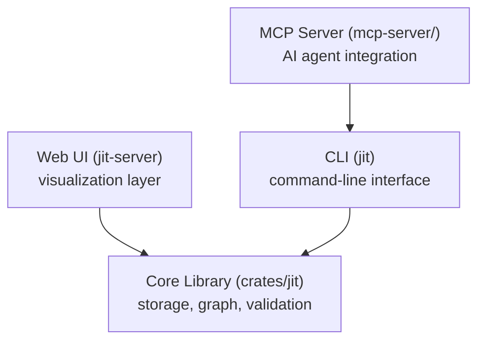
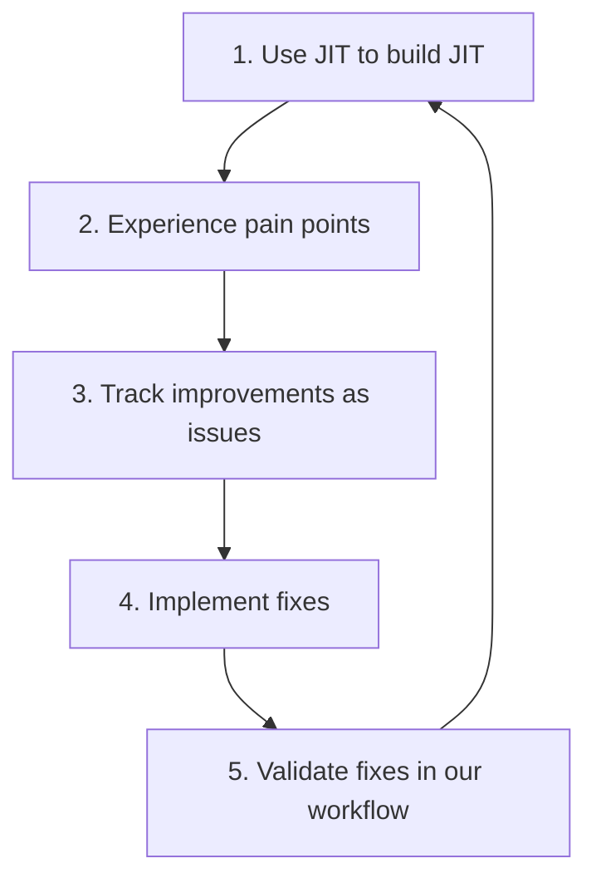

# Design Philosophy

> **Diátaxis Type:** Explanation  
> **Audience:** Users and contributors seeking to understand JIT's core principles

This document explains the fundamental design decisions behind JIT and why they matter. Understanding these principles helps you use JIT effectively and contribute meaningfully to the project.

## Domain Agnostic

**Core Principle:** JIT works for any domain (software development, research, knowledge work, project management) without requiring domain-specific terminology or workflows.

### Why Domain Neutrality Matters

Traditional issue trackers are designed for software development, using terms like "sprint," "story points," "pull request," and "deployment." This creates friction when applying them to other domains:

- Researchers feel awkward using "sprint" for experiments
- Writers find "story points" meaningless for chapters
- Project managers resist "deployment" for budget approvals

JIT uses **universal terminology** that works everywhere:

- **Issue** - Any unit of work (feature, experiment, chapter, budget item)
- **Gate** - Any quality checkpoint (tests, peer review, approval, audit)
- **Dependency** - Any blocking relationship (prerequisite, requirement, dependency)
- **Label** - Any categorization (type, epic, milestone, phase, topic)

### Domain Mapping Examples

The same concepts adapt to different contexts:

| JIT Concept | Software Dev | Research | Writing | Project Mgmt |
|-------------|-------------|----------|---------|--------------|
| **Issue** | Feature/Bug | Experiment | Chapter | Deliverable |
| **Gate** | CI checks | Peer review | Editor review | Stakeholder approval |
| **Dependency** | Feature A needs API | Exp 2 needs Exp 1 data | Ch 3 needs Ch 2 | Phase 2 needs Phase 1 |
| **Label: epic** | epic:auth | project:nas-research | book:novel-draft | initiative:q1-goals |
| **Label: type** | type:task | type:task | type:task | type:task |
| **Priority** | Ship blocker | Paper deadline | Publication date | Board meeting |

### Configurable Workflows

JIT provides **configuration over convention**. Hierarchies and workflows adapt to your domain:

```toml
# Software: milestone → epic → task
# Research: project → phase → experiment  
# Writing: book → section → chapter
```

This flexibility enables broader adoption (teams outside software), clearer workflows (no translation needed), and longevity (works for future use cases).

## Agent-First Design

**Core Principle:** JIT is built for programmatic agents to use, with human ergonomics as a secondary (but important) benefit.

### Why Agent-First?

AI agents are increasingly capable of complex software tasks, but existing tools assume human users. JIT inverts this:

- **Primary audience:** Programmatic agents (AI assistants, automation scripts)
- **Secondary audience:** Humans (via same CLI, web UI, or MCP)

**Result:** Agents get a predictable interface. Humans benefit from the same clarity.

### Key Design Principles

**JSON-First Output:** Commands that emit data support `--json` for structured output agents parse reliably, with no regex scraping; list-emitting commands wrap results in a `{count, <collection>}` envelope.

**Atomic File Operations:** Persistent-file replacements use a temporary file in
the target directory followed by a rename, so readers do not observe a partially
written replacement. Advisory locks coordinate the operations that need shared
access; an atomic rename alone does not serialize competing writers.

**Clear Exit Codes:** UNIX-standard exit codes enable bash error handling: `jit ... || handle_error`

**MCP Protocol:** AI assistants call JIT operations directly via Model Context Protocol, with type-safe, structured tool use.

**Structured Errors:** JSON errors include error codes and context for programmatic error recovery.

**Example - Multi-agent coordination:**
```bash
# Agent 1
jit claim acquire $TASK --agent-id agent:worker-1
# ✓ Acquired lease (atomic via file lock)

# Agent 2 (simultaneously, same task)
jit claim acquire $TASK --agent-id agent:worker-2
# ✗ ERROR: Already claimed by agent:worker-1
```

File locking serializes claim operations, preventing concurrent modification conflicts.

## Functional Programming Principles

**Core Principle:** Prefer functional patterns (immutability, pure functions, composition) over stateful object-oriented code.

### Why Functional Programming?

JIT's Rust codebase follows functional principles:

**1. Immutability where practical**
```rust
// GOOD: Return new value
fn compute_ready_issues(issues: &[Issue]) -> Vec<&Issue> {
    issues.iter()
        .filter(|i| i.state == State::Ready)
        .collect()
}

// AVOID: Mutate input
fn compute_ready_issues_mut(issues: &mut Vec<Issue>) {
    issues.retain(|i| i.state == State::Ready);
}
```

**2. Pure functions over stateful objects**
```rust
// GOOD: Pure function (same input = same output)
fn is_blocked(issue: &Issue, all_issues: &[Issue]) -> bool {
    issue.dependencies.iter()
        .any(|dep_id| !is_terminal(dep_id, all_issues))
}

// AVOID: Stateful method with hidden dependencies
impl Issue {
    fn is_blocked(&self) -> bool {
        // Requires self to have access to global state
    }
}
```

**3. Iterator combinators over explicit loops**
```rust
// GOOD: Functional style
let blocked_count = issues.iter()
    .filter(|i| is_blocked(i, &all_issues))
    .count();

// AVOID: Imperative loops
let mut count = 0;
for issue in &issues {
    if is_blocked(issue, &all_issues) {
        count += 1;
    }
}
```

**4. Expression-oriented code**
```rust
// GOOD: Expression with early return
let state = if issue.has_blocking_dependencies() {
    return Err("Dependencies not satisfied");
} else if issue.has_failing_gates() {
    State::Gated
} else {
    State::Ready
};

// AVOID: Statement-oriented mutation
let mut state = State::Backlog;
if has_deps {
    return Err(...);
}
if has_gates {
    state = State::Gated;
} else {
    state = State::Ready;
}
```

### Why It Matters

**1. Easier to reason about**
- Pure functions have no hidden side effects
- Same inputs always produce same outputs
- No global state to track mentally

**2. Better testability**
```rust
#[test]
fn test_is_blocked_pure_function() {
    let issue = Issue::new("Test");
    let all_issues = vec![...];
    
    // No mocks, no setup, just call the function
    assert!(is_blocked(&issue, &all_issues));
}
```

**3. Fewer bugs**
- Immutability prevents accidental mutations
- Pure functions eliminate temporal coupling
- Type system catches more errors at compile time

**4. Composability**
```rust
let high_priority_blocked = issues.iter()
    .filter(|i| i.priority == Priority::High)
    .filter(|i| is_blocked(i, &all_issues))
    .collect::<Vec<_>>();
```

### Real Examples from Codebase

**Graph traversal (cycle detection):**
```rust
// From crates/jit/src/graph/mod.rs
fn is_reachable(&self, start: &str, target: &str) -> bool {
    let mut visited = HashSet::new();
    let mut stack = vec![start];
    
    while let Some(current) = stack.pop() {
        if current == target {
            return true;
        }
        if visited.insert(current) {
            if let Some(node) = self.nodes.get(current) {
                stack.extend(node.dependencies().iter().map(String::as_str));
            }
        }
    }
    false
}
```

**Query filtering with combinators:**
```rust
let available = issues.iter()
    .filter(|i| i.state == State::Ready)
    .filter(|i| i.assignee.is_none())
    .filter(|i| !is_blocked(i, &all_issues))
    .sorted_by_key(|i| i.priority)
    .collect::<Vec<_>>();
```

**Result/Option for error handling:**
```rust
// No exceptions, explicit error handling
pub fn load_issue(&self, id: &str) -> Result<Issue> {
    let path = self.issue_path(id);
    self.read_json(&path)
        .with_context(|| format!("Failed to load issue {}", id))
}
```

### Pragmatic Exceptions

Functional purity is not absolute:
- **File I/O** inherently has side effects
- **CLI layer** can be imperative for clarity
- **Performance** may require mutation in hot paths

**Key:** Encapsulate imperative code behind clean functional APIs.

## CLI as Primary Interface

**Core Principle:** The command-line interface is JIT's primary interface, not an afterthought.

### Why CLI Over Web-First?

Most modern tools start with a web UI and add CLI later. JIT inverts this:

**1. Scriptability and Automation**
```bash
# Agents and scripts compose commands
jit query available --json | \
  jq -r '.issues[0].id' | \
  xargs -I {} jit claim acquire {} --agent-id agent:worker-1
```

**2. Agent-Friendly by Default**
- No need to parse HTML or scrape web pages
- Direct API via shell commands
- JSON output for structured data

**3. UNIX Philosophy**
- Do one thing well (issue tracking)
- Compose with other tools (jq, grep, awk)
- Text streams as universal interface

**4. No Server Required**
- Works offline
- No API versioning headaches
- No network latency

### Every Surface Runs on the Core Library

The MCP server drives the `jit` binary. The web UI server embeds the core library in
process. Both reach the same storage, graph, and validation code:



**Benefits:**
- Single source of truth (core library)
- MCP tools are generated from `jit --schema`, so every CLI command is callable; the default `tools/list` advertises a curated agent-facing subset (see `mcp-server/README.md`)
- Each surface reaches the same core code, so results stay consistent across the CLI, MCP, and web UI

**Example:**
```bash
# CLI
jit issue create --title "Feature X" --priority high

# MCP server (calls the CLI internally)
Jit-jit_issue_create(title="Feature X", priority="high")

# Web UI (jit-server, calls the core library in process)
POST /api/issues {"title": "Feature X", "priority": "high"}
```

### Human Ergonomics Matter Too

While agent-first, CLI includes human-friendly features:

**1. Short hashes (like git)**
```bash
# Full UUID: abc12345-6789-4def-1234-567890abcdef
# Short: abc12345 (min 4 chars)
jit issue show abc12
```

**2. Quiet mode for clean output**
```bash
jit query available --quiet  # Only IDs, one per line
```

**3. Readable summaries for recorded gate runs**
```bash
jit gate status-all $ISSUE
Gate 'tests' last run: passed (exit code: 0)
Gate 'clippy' last run: failed (exit code: 1)
```

**4. Colored output for terminals**
```bash
jit status
✓ 5 done (green)
→ 3 in_progress (blue)
⚠ 2 blocked (yellow)
```

**5. Helpful error messages**
```bash
jit issue show nonexistent
Error: Issue not found: nonexistent
  
Suggestions:
  • Check the issue ID (use 'jit query all' to list issues)
  • Try a longer prefix if using short hash
```

## Dogfooding

**Core Principle:** We use JIT to track JIT's own development. Eat our own dog food.

### Why Dogfooding Matters

**1. Real-world validation:** The project uses the same issue, dependency, and gate workflows it documents.

**2. Continuous feedback:** Day-to-day use can reveal workflow friction for maintainers to investigate.

**3. Credibility:** The repository provides a concrete environment for examining agent orchestration and workflow management.

### JIT Tracking JIT

This repository uses JIT to track its own work. The current issue set, states,
assignments, and gate registry are repository-local data, so inspect them in the
checkout rather than relying on a prose snapshot:

```bash
# Inspect the local repository's live project state.
jit query count --by state
jit graph tree
jit gate list

# Inspect an issue and the durable artifacts linked to it.
jit issue status <issue-id>
jit doc list <issue-id>
```

### Benefits of Dogfooding

**1. Catches usability issues early**
- Normal project use exposes workflow friction to maintainers
- Those observations inform improvement work

**2. Validates agent orchestration claims**
- It exercises the same coordination surface used by adopters
- It keeps concurrency assumptions visible in everyday work

**3. Grounds maintenance decisions**
- Maintainers can evaluate a workflow in the repository that uses it
- Trade-offs are considered against observed project use

**4. Grounds documentation**
- Examples can be checked against the same commands and configuration
- Live repository state remains discoverable through the commands above

**5. Motivation and accountability**
- The project team shares the consequences of its workflow choices
- Feedback has a direct path into tracked work

### Continuous Improvement Loop



**Example:** The `--json` flag on data-emitting commands serves agent automation, emitting structured, machine-parseable output that agents consume directly and humans share.

## See Also

- [System Guarantees](guarantees.md) - How JIT ensures reliability (DAG, atomicity, consistency)
- [Core Model](core-model.md) - Domain-agnostic concepts (issues, gates, dependencies)
- [Quickstart Tutorial](../tutorials/quickstart.md) - See principles in practice
- [How-To: Multi-Agent Coordination](../how-to/multi-agent-coordination.md) - Agent-first design in action
- [AGENTS.md](../../AGENTS.md) - Functional-style coding conventions for contributors
