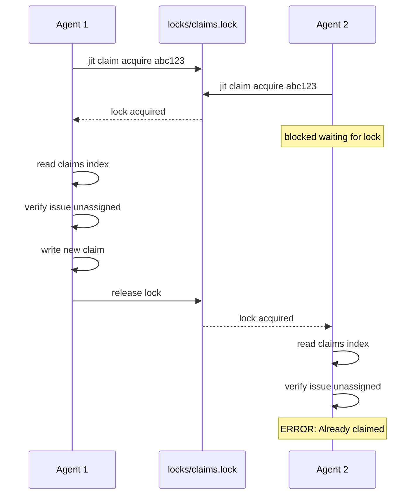

# System Guarantees

> **Diátaxis Type:** Explanation  
> **Audience:** Users who need to understand JIT's reliability properties

This document explains what JIT guarantees about data integrity, consistency, and failure handling. Understanding these guarantees helps you build reliable workflows and troubleshoot issues.

## Invariants

JIT maintains four core invariants that are enforced at all times. Three of them are also registered project invariants, cited below by their address (`@/invariant/<id>`); run `jit item show <address>` for the registry's canonical statement. The invariant registry (`.jit/invariants.toml`) also renders into the invariant region of the project `CLAUDE.md` via `jit invariant render`.

### DAG Property

**Guarantee:** Dependencies always form a directed acyclic graph (DAG) - cycles are strictly prevented. (`@/invariant/dag-acyclic`)

Dependencies in JIT represent "FROM depends on TO" relationships. If issue A depends on B, then A cannot proceed until B reaches a terminal state (done or rejected). To prevent deadlock, JIT enforces that the dependency graph is always acyclic.

**How it works:**

JIT uses depth-first search (DFS) to detect potential cycles before adding any dependency:

```rust
// Simplified algorithm from crates/jit/src/graph/mod.rs
fn would_create_cycle(from: &str, to: &str) -> bool {
    // Adding edge from → to creates a cycle if there's already a path to → from
    // In other words: if 'from' is reachable from 'to'
    is_reachable(to, from)
}
```

**Example:**

```bash
# Create issues
jit issue create --title "Task A"  # → a1b2c3
jit issue create --title "Task B"  # → d4e5f6
jit issue create --title "Task C"  # → g7h8i9

# Build dependency chain: A ← B ← C
jit dep add a1b2c3 d4e5f6  # A depends on B ✓
jit dep add d4e5f6 g7h8i9  # B depends on C ✓

# Try to create a cycle: C ← A
jit dep add g7h8i9 a1b2c3  # ✗ ERROR: Cycle detected
```

**Why this matters:**

- **No deadlocks:** Issues can always make progress once dependencies reach a terminal state
- **Clear work order:** Topological sort determines execution order
- **Predictable scheduling:** Agents can identify ready work deterministically

**Transitive reduction:**

JIT keeps the dependency graph transitively reduced. When `A→B→C` already holds, adding the redundant `A→C` is rejected by default, and `jit validate` enforces the reduced form. `jit dep add --reduce` instead accepts the new edge and drops whatever it makes redundant, in the same operation. Either way the graph represents the *minimal* set of relationships needed.

### Atomic Operations

**Guarantee:** All file writes are atomic - either the entire write succeeds or nothing changes. (`@/invariant/atomic-writes`)

JIT uses the write-temp-rename pattern for all file operations. This leverages the POSIX guarantee that `rename()` is atomic at the filesystem level.

**How it works:**

```rust
// From crates/jit/src/storage/json.rs
fn write_json<T>(path: &Path, data: &T) -> Result<()> {
    let json = serialize(data)?;
    
    // Write to temporary file
    let temp_path = path.with_extension("json.tmp");
    fs::write(&temp_path, json)?;
    
    // Atomic rename (POSIX guarantee)
    fs::rename(&temp_path, path)?;
    
    Ok(())
}
```

**Multi-agent safety:**

File locking prevents race conditions during concurrent updates:

- **Index updates:** Exclusive lock on `.index.lock`
- **Issue updates:** Per-issue lock on `issues/{id}.lock`
- **Claim operations:** Exclusive lock on `locks/claims.lock` (under `.git/jit/`)
- **Event log:** Exclusive lock on `.events.lock`

**Example - Two agents claiming simultaneously:**



**Benefits:**

- **No partial writes:** Crashes never leave corrupted JSON files
- **No lost updates:** File locks serialize concurrent modifications
- **Crash safety:** Temp files cleaned up automatically on next operation

### Event Logging

**Guarantee:** All state changes are logged to `.jit/events.jsonl` as an append-only audit trail. (`@/invariant/event-log`)

Every operation that modifies issue state, dependencies, or gates emits an event. The event log provides complete observability over how the repository reached its current state.

**Event types:**

Each event is internally tagged by a snake_case `type` field. The core event
types (full set in `crates/jit/src/domain/types.rs`):

```
issue_created         - New issue created
issue_claimed         - Agent claimed an issue
issue_released        - Assignment cleared from an assignee
issue_state_changed   - Lifecycle state transitioned (from → to)
issue_updated         - Labels, priority, assignee, or other fields changed
issue_completed       - Issue reached the Done state
gate_added            - Quality gate attached to an issue
gate_removed          - Quality gate detached from an issue
gate_passed           - Quality gate marked passed
gate_failed           - Quality gate marked failed
dependency_reduced    - Redundant dependencies removed by transitive reduction
```

**Log format:**

Events are stored as newline-delimited JSON (JSONL):

```jsonl
{"type":"issue_created","id":"evt-001","issue_id":"abc123","timestamp":"2026-02-02T20:00:00Z","title":"Fix bug","priority":"high"}
{"type":"issue_claimed","id":"evt-002","issue_id":"abc123","timestamp":"2026-02-02T20:01:00Z","assignee":"agent:worker-1"}
{"type":"issue_state_changed","id":"evt-003","issue_id":"abc123","timestamp":"2026-02-02T20:05:00Z","from":"ready","to":"in_progress"}
```

**Properties:**

- **Append-only:** Events are never modified or deleted
- **Ordered:** Timestamp establishes causal ordering
- **Complete:** Every mutation is logged
- **Durable:** Atomic append with file locking

**Benefits:**

- **Observability:** Debug workflows by examining event history
- **Audit trail:** Compliance requirements satisfied
- **Reconstruction:** Derived state is rebuilt from the log (`jit migrate lifecycle-timestamps` backfills lifecycle timestamps from it)

**Query examples:**

```bash
# View recent activity
jit events tail -n 20

# Find all events for specific issue
jit events query --issue-id abc123

# Track state transitions
jit events query --event-type issue_state_changed
```

### Git Optional

**Guarantee:** Core issue tracking works without git - repository versioning is optional.

JIT is designed as a standalone issue tracker that *enhances* git workflows but doesn't require them. This supports use cases beyond software development.

Issue assignment (`jit issue assign` / `jit issue claim` / `jit issue release` / `jit issue unassign`) is bookkeeping on the issue record and works fully without git. Advisory work leases (`jit claim acquire` and its sibling `jit claim` subcommands) coordinate exclusive, time-boxed access across worktrees; they need a git repository with a resolvable `HEAD` for worktree identity and branch tracking. A missing repository and a repository with zero commits both fail with a typed `ClaimRequiresGitError` (exit code 10): `git init` alone is not enough, since `HEAD` does not resolve to a branch until the first commit exists.

**What works without git:**

✅ Issue creation, updates, queries  
✅ Dependency management  
✅ Quality gates (automated and manual)  
✅ Issue assignment (`jit issue assign` / `jit issue claim` / `jit issue release` / `jit issue unassign`)  
✅ Event logging and queries  
✅ Status and visualization  

**What requires git:**

❌ `jit claim acquire` / `release` / `renew` / `heartbeat` / `status` / `list` / `force-evict` - Advisory work leases (`ClaimRequiresGitError`, exit code 10)  
❌ `jit doc show --at <commit>` - View document at specific git revision  
❌ `jit doc archive` - Track document history across moves  
❌ `jit snapshot export --at <tag>` - Export from specific git revision  
❌ Document asset validation from git history  

**Fallback behavior:**

When git is unavailable:

- **Document operations:** Fall back to working tree only
- **Snapshot export:** Export from current working tree
- **History commands:** Return error with helpful message
- **Advisory leases:** Fail outright with `ClaimRequiresGitError` (exit code 10) instead of falling back; use issue assignment (`jit issue claim`) as the git-free alternative

**Example:**

```bash
# Without git - core functionality and issue assignment work
mkdir my-project && cd my-project
jit init
jit issue create --title "Task 1"
jit issue create --title "Task 2"
jit dep add <task1> <task2>
jit query available
jit issue claim <task2> agent:worker-1
# ✓ All basic operations and issue assignment work (task2 has no unmet dependencies)

jit claim acquire <task2> --agent-id agent:worker-1
# ✗ Error: Claims and leases require a git repository (exit code 10)

# git init alone is not enough - HEAD must resolve to a commit
git init
git config user.email "you@example.com"
git config user.name "Your Name"
jit claim acquire <task2> --agent-id agent:worker-1
# ✗ Error: Claims and leases require a git repository (exit code 10) - no commits yet

git commit --allow-empty -m "Initial commit"
jit claim acquire <task2> --agent-id agent:worker-1
# ✓ Advisory lease acquired

mkdir -p path/to
echo "Initial design notes" > path/to/design.md
jit doc add <task2> path/to/design.md
git add -A && git commit -m "Add design doc"
echo "Revised notes" >> path/to/design.md
git add -A && git commit -m "Revise design doc"
jit doc show <task2> path/to/design.md --at HEAD~1
# ✓ Shows the version from before the revision
```

**Design rationale:**

Making git optional allows JIT to be used for:
- Research projects without version control
- Knowledge work and personal task management
- Environments where git isn't available
- Rapid prototyping and experimentation

## Consistency Model

JIT provides **eventual consistency** through file-based coordination. Understanding the consistency model helps you build reliable multi-agent workflows.

### Consistency Guarantees

**1. Read-your-own-writes**

A process always sees its own updates immediately:

```bash
# Same process (shell session)
jit issue update abc123 --state in_progress
jit issue show abc123
# ✓ Shows in_progress immediately
```

**2. Atomic operations**

Individual operations are isolated and atomic:

```bash
# Agent 1 claims atomically
jit claim acquire abc123
# Agent 2's simultaneous claim will either succeed or fail cleanly
# No partial state, no corruption
```

**3. Eventually consistent across processes**

Different processes see updates after file operations complete:

```bash
# Terminal 1                     # Terminal 2
jit issue update abc --state done
                                 jit query available
                                 # ✓ Sees updated state (file reread)
```

### What JIT Does NOT Guarantee

Understanding limitations prevents incorrect assumptions:

❌ **Strong consistency across processes**  
- Updates are not instantly visible to other processes
- File operations are the synchronization point
- Use claims for coordination, not assumptions about state

❌ **Distributed coordination**  
- JIT is designed for single-machine use
- No distributed locking or consensus
- Network filesystems may violate atomicity guarantees

❌ **Snapshot isolation**  
- Long-running operations may see intermediate state
- Use claims to establish boundaries
- Event log provides ordering guarantees

❌ **Automatic conflict resolution**  
- First-writer-wins for non-conflicting fields
- Claim operations detect conflicts explicitly
- No CRDTs or operational transformation

### Implications for Multi-Agent Workflows

**✓ Safe patterns:**

```bash
# Claim-based coordination (atomic, works without git)
jit issue claim <issue> agent:worker-1
# Work on issue
jit issue update <issue> --state done

# Polling for ready work (eventually consistent)
while true; do
  jit query available --json | process_available_work
  sleep 5
done

# Event-driven workflows (poll the event tail for new events)
while true; do
  jit events tail -n 10 --json | react_to_events
  sleep 5
done
```

**✗ Unsafe patterns:**

```bash
# Assuming state without claiming
state=$(jit issue show abc123 --json | jq -r '.state')
# ✗ State may change before next operation
jit issue update abc123 --state in_progress  # Race condition!

# Correct approach: claim the issue instead of updating state directly
jit issue claim abc123 agent:worker-1  # Fails if already assigned to someone else
```

### File-Based Synchronization

All coordination happens through filesystem operations:

Two directories at the repository root carry coordination state. `.jit/` holds
per-worktree issue data; `.git/jit/` is the control plane shared across every
worktree of the repository.

```
.jit/
├── issues/{id}.json          # Issue data (per-file locks)
├── index.json                # Issue index (exclusive lock)
├── gates.toml                # Gate registry (exclusive lock)
└── events.jsonl              # Event log (append-only, locked)

.git/jit/
├── claims.jsonl              # Claim log (append-only)
├── claims.index.json         # Active claims (exclusive lock)
├── heartbeat/                # Lease keep-alive, one file per agent
└── locks/claims.lock         # Advisory lock guarding claim-log operations
```

**Synchronization points:**

1. **File locks** - Serialize updates to shared state
2. **Atomic renames** - Publish updates atomically
3. **Claims** - Establish exclusive access boundaries
4. **Event log** - Establish causal ordering

## Failure Modes

JIT is designed to handle failures gracefully without data loss or corruption.

### Partial Write Recovery

**Scenario:** Process crashes during file write.

**Recovery:**

Atomic operations (write-temp-rename) prevent partial writes:

```bash
# During write crash:
.jit/issues/abc123.json.tmp  # Incomplete temp file
.jit/issues/abc123.json      # Previous version intact

# On the next operation:
# Read operations only consider .json files, so the previous version is served
# and the orphaned .tmp is never read. The recovery pass that runs during
# jit claim operations sweeps orphaned .tmp files older than one hour.
```

**Result:** No corruption, no data loss, previous state preserved.

### Corrupted JSON Detection

**Scenario:** Manual edit creates invalid JSON, or disk corruption occurs.

**Symptom:**

```bash
jit issue show abc123
Error: Failed to deserialize data: expected value at line 15 column 3
  File: .jit/issues/abc123.json
```

**Recovery options:**

1. **Restore from git:**
   ```bash
   git checkout HEAD -- .jit/issues/abc123.json
   ```

2. **Manual repair:**
   ```bash
   # Edit file with proper JSON syntax
   vim .jit/issues/abc123.json
   # Validate
   jit issue show abc123
   ```

3. **Check event log for last known state:**
   ```bash
   jit events query --issue-id abc123 | tail -n 10
   # Reconstruct from events
   ```

**Prevention:** Use `jit` commands instead of manual editing.

### Stale Temporary Files

**Scenario:** Crash leaves `.tmp` files behind.

**Impact:** Harmless. Read operations only consider `.json` files, so an orphaned
`.tmp` sibling is never served and never corrupts state.

**Cleanup:**

```bash
# Automatic: the recovery pass during jit claim operations removes orphaned
# .tmp files older than one hour.

# Manual cleanup at any time
find .jit -name '*.tmp' -mmin +60 -delete
```

### Stale Claim Leases

**Scenario:** Agent crashes while holding a claim.

**Detection:**

```bash
jit claim list
Lease: lease-001
  Issue: abc123
  Agent: agent:worker-1
  Expires: 2026-02-02T19:00:00Z (10 minutes ago) ⚠️ STALE
```

**Recovery:**

```bash
# Automatic recovery - expired leases are ignored
jit query available  # Shows issue as available

# Manual eviction if needed
jit claim force-evict lease-001 --reason "agent crashed"
```

**Prevention:** Use heartbeats to renew leases:

```bash
# Renew lease before expiry
jit claim renew lease-001 --extension 600
```

### Missing File Handling

**Scenario:** Issue file deleted manually or corrupted beyond recovery.

**Symptom:**

```bash
jit issue show abc123
Error: Issue not found: abc123
  Expected at: .jit/issues/abc123.json
```

**Recovery:**

1. **Check git history:**
   ```bash
   git log -- .jit/issues/abc123.json
   git checkout <commit> -- .jit/issues/abc123.json
   ```

2. **Recreate from event log:**
   ```bash
   jit events query --issue-id abc123
   # Use events to reconstruct state
   ```

3. **Manual recreation:**
   ```bash
   # Create new issue with same ID (requires manual JSON editing)
   # NOT RECOMMENDED - use git recovery
   ```

**Prevention:**

- Commit `.jit/` directory regularly
- Use `jit validate` to detect inconsistencies
- Never manually delete issue files

### Network Errors (External Assets)

**Scenario:** Document references external URL, but network is unavailable.

**Impact:** Document operations fail, but core issue tracking unaffected.

```bash
jit doc check-links --scope all
Warning: External URL not validated: https://example.com/diagram.png
  Referenced in: dev/design.md

# Core functionality still works
jit query available  # ✓ Works
jit issue update abc123 --state done  # ✓ Works
```

**Mitigation:** Download critical assets locally using per-document asset pattern.

### Graceful Degradation

JIT is designed with isolation and fault tolerance:

**✓ Isolated failures:**

- Corrupted issue → Only that issue affected, others work normally
- Missing git → Core features still work, document features disabled
- Stale lease → Automatically expired, issue becomes available
- Invalid event → Logged but doesn't block operations

**✓ No cascading failures:**

- Storage errors don't crash the CLI (return error codes)
- Validation errors suggest recovery steps
- Lock timeouts prevent indefinite hangs (default 5 seconds)
- Event log corruption doesn't prevent issue operations

**✓ Recovery-oriented design:**

```bash
# Comprehensive health check
jit validate
# Reports validation findings (hierarchy, dependency, and format issues).

# Include lease consistency
jit validate --leases
# Lists expired or dangling leases, each with the exact fix command
# (jit claim release / jit claim force-evict).

# Auto-fix what is mechanically fixable
jit validate --fix
# ✓ Applies type-hierarchy, transitive-reduction, and pending-state-transition fixes
```

## See Also

- [Core Model](core-model.md) - Understanding issues, dependencies, and gates
- [Design Philosophy](design-philosophy.md) - Why these guarantees matter
- [Troubleshooting Guide](../how-to/troubleshooting.md) - Practical recovery procedures
- Implementation: `crates/jit/src/storage/` - Atomic operations and locking
- Implementation: `crates/jit/src/graph/mod.rs` - Cycle detection algorithm
