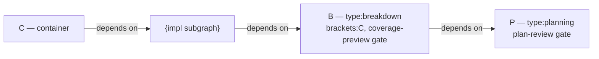
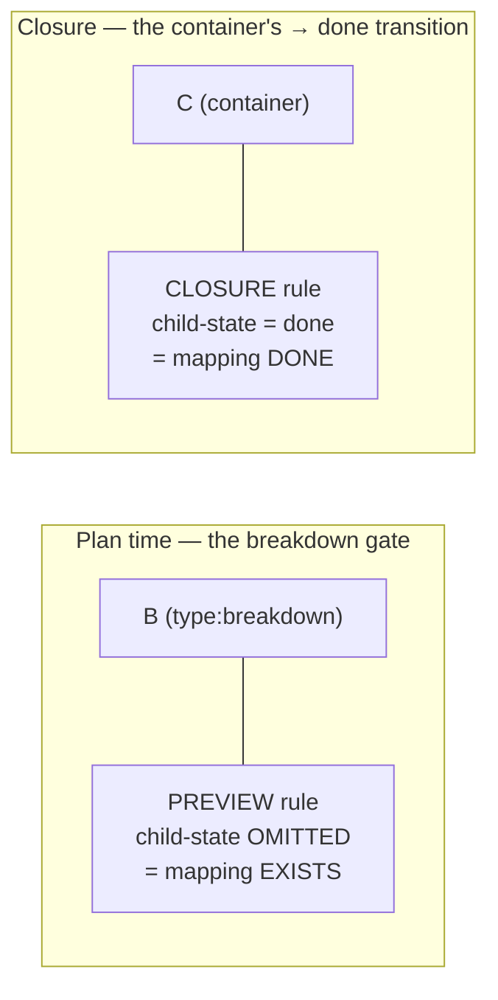

# The Plan-Before-Fan-Out Bracket

> **Diátaxis Type:** Explanation
> **Audience:** Users and ruleset authors who want to understand why planning is a gated node in the DAG, sequenced before work fans out

JIT can make planning a **first-class, reviewable, gated node** in the dependency
graph, sequenced *before* the implementation fan-out. This document explains the
shape of that structure — the **bracket** — the three gates it carries, and the
coverage split that lets the same rule kind check the decomposition twice: once
at plan time, once at closure.

The bracket is **opt-in configuration**, not engine behaviour. The engine stays
domain-agnostic; an adopting ruleset declares the vocabulary and wires the gates.
Two worked rulesets ship it: [`docs/examples/sdd/`](../examples/sdd/config.toml)
(software, `epic` breakable) and [`docs/examples/research/`](../examples/research/config.toml)
(research, `goal` breakable, no `epic` anywhere). To adopt it in your own project,
see [How-To: Adopt the Planning Bracket](../how-to/adopt-planning-bracket.md).

## The problem it solves

A container — an epic, a research goal, whatever a ruleset's top type is — usually
conflates three roles:

1. the **planning artifact** (a design doc, produced out of band);
2. the **fan-out trigger** (the breakdown into children, run speculatively); and
3. the **fan-in acceptance node** (coverage checked when the container closes).

Without a bracket, breakdown happens before anyone reviews whether the
decomposition is right, and plan review lives entirely outside the graph. There
is no checkpoint where a plan is reviewed and approved before work fans out, and
no place coverage can be checked at *plan* time rather than only at the very end.

[Methodology-agnostic validation](validation-engine.md) already enforces the
*back end* of planning rigor: coverage rules are lifecycle-scoped and bite at the
container's `→ done` transition. The bracket is the **front-end counterpart** —
it pulls plan review and a coverage check forward, in front of the fan-out.

## The bracket

A **breakable container** `C` — a type a ruleset *declares* as requiring planning
— is bracketed by two **function-typed children**:

- **`P` — the planning node** (`type:planning`). It produces the plan and carries
  an **agent plan-quality gate** (`plan-review`).
- **`B` — the breakdown node** (`type:breakdown`). It is created **by the
  breakdown step, not at scaffold**, carries **two gates** — a **deterministic
  coverage-preview gate** (`coverage-preview`) and an **agent breakdown-review
  gate** (`breakdown-review`) — and wears a `brackets:<C-id>` label naming the
  container it brackets.

"Function-typed" means the role lives in the **type axis**, not a separate `role:`
namespace: `planning` and `breakdown` are real types an adopting ruleset adds to
its hierarchy as valid children of breakable containers. (JIT types already mix
altitude and function — `bug`, `chore`, `spike` — so this fits the grain.)

### The spine

At scaffold time only `C` and `P` exist: the container simply depends on its
planning node.

The breakdown step then creates `B` and the implementation subgraph and splices
them into the `C → P` link, forming a **spine**:

Each arrow is a **dependency edge** (`A --> B` reads "A depends on B"). Read the
spine as precedence `P > B > impl > C`:

1. **plan first** (`P`, reviewed by the plan-review gate),
2. **then breakdown** (`B`, checked by the coverage-preview gate),
3. **then the work** (the impl subgraph),
4. **then the container closes** (`C`, checked by the closure coverage rule at
   `→ done`).

Because the implementation subgraph transitively depends on `B`, and `B` depends
on `P`, **no implementation issue becomes ready until the plan is approved and the
breakdown's coverage passes**. The gates are sequenced by the graph itself — no
ordering rule kind is needed, only dependency edges.

### Edge geometry

The DAG is always kept in **transitively-reduced** form (an invariant JIT already
maintains: dependencies reduce on add, and `jit validate` enforces/`--fix`es it).
That shapes the spine edges:

- **`C` → impl: sinks only.** Only the impl issues immediately before container
  completion carry an edge to `C`. Reduction drops any redundant `C → (non-sink)`
  edge.
- **impl → `B`: sources only.** Only entry impl issues (those with no
  intra-subgraph predecessor) depend on `B`; internal chains carry the rest. This
  transitively gates *all* impl work behind the approved breakdown.
- **`C → P` disappears after breakdown.** The scaffold's direct `C → P` edge is
  removed automatically by reduction once the spine connects
  `C → impl → B → P`.
- **`B → P`.** The breakdown depends on the plan (breakdown after plan approved).
- **Retrofit moves upstream deps onto `P`.** When you bracket an *existing*
  container (`jit plan <C>`), `C`'s pre-existing upstream dependencies **move onto
  `P`** — planning waits on that upstream work, and `C` becomes the pure closure
  node at the back of its own bracket.

## The three gates

The bracket carries three gates. One sits on `P`; the other two share `B` in a
deliberate **quality-vs-coverage split** — the same axis runs across the whole
bracket:

| Gate | Node | Mode | Checks |
|------|------|------|--------|
| `plan-review` | `P` | agent (command-backed) | Is the *plan itself* good? Reviews the planning issue's success criteria and linked design document. |
| `coverage-preview` | `B` | deterministic | Does the *decomposition* cover every `[hard]` criterion? Runs `jit validate --scope <C>`. |
| `breakdown-review` | `B` | agent (command-backed) | Is the *decomposition itself* good? Per-child content standards, dependency-DAG coherence, and right-sized depth. |

**`plan-review`** is an agent gate — the same command-backed AI-review mechanism
described in [Custom Gates](../how-to/custom-gates.md). It judges plan *quality*:
is the design sound, complete, the right approach? A FAIL leaves the drafted plan
in place for revision (drafts stay in Backlog; nothing is archived on rejection).

**`coverage-preview`** is deterministic. Its checker resolves the container `C`
from `B`'s `brackets:<C-id>` label and runs `jit validate --scope <C>`. That
scoped validation evaluates the **preview coverage rule** (below), which exits 4
— failing the gate — when the drafted children leave a `[hard]` criterion
uncovered. No human judgment, no agent: pure structural coverage over the drafted
decomposition.

**`breakdown-review`** is the agent counterpart of `coverage-preview` on the same
node — the *quality* half of `B`'s split. It is the command-backed AI-review
mechanism again, pointed at the drafted children: it audits each child against the
project's content standards, checks the **dependency DAG** for coherence (flagging
**both** a missing prerequisite that lets a task start too early **and** an
over-constraint that needlessly serializes parallel work), verifies decomposition
depth suits the work size, and confirms every root can start on a blank workspace.
It deliberately does **not** re-check `[hard]`-criterion coverage — that is
`coverage-preview`'s job. A FAIL reports concrete proposed fixes (the specific edge
to add/remove, the criterion to make verifiable) for the breakdown owner to apply;
the drafts stay in Backlog for revision.

The three answer different questions. `plan-review` asks *"is this plan any
good?"*; `coverage-preview` asks *"does this breakdown actually cover what the
container promised?"*; `breakdown-review` asks *"is the decomposition itself sound
— right pieces, right wiring?"* A plan can read beautifully and still leave a hard
requirement with no implementing child (the coverage gap), or cover every
requirement yet wire a dependency chain that stalls the fan-out (the structure
gap). Each gate catches a failure the others cannot, all before any work fans
out.

## Coverage at both ends: preview vs closure

The bracket's defining trick is that **coverage is checked twice by one rule
kind** (`label-coverage`), differing only in *when* it fires and *what "covered"
means*.

Both are `label-coverage` instances. They share every criteria knob —
`criteria-section`, `marker = "[hard]"`, `id-pattern`, the satisfies namespace,
`child-link = "dependencies"`, and `child-type-exclude`. They differ in exactly
two knobs:

- **The closure rule** sets `child-state = "done"` and fires on the container at
  `when = { type = "<container>", state = "done" }`. It asks *mapping DONE*: every
  `[hard]` criterion is satisfied by a child that carries the satisfies label **and
  is itself done**. This is the back-end enforcement that bites at the `→ done`
  transition, blocking completion (exit 4) if anything is uncovered.

- **The preview rule** **omits `child-state` entirely** and fires on the transient
  breakdown node at `when = { type = "<breakdown>" }`. An **absent `child-state`
  means "any state"** in the evaluator. At breakdown time the drafted children sit
  in Backlog, so the check is *mapping EXISTS*: every `[hard]` criterion has *some*
  child carrying the satisfies label, in **any** state. The literal `"any"` is
  **not** a valid token — "any state" is expressed by leaving the key out.

State-projection cannot bridge this gap, because the `child-state` *filter itself*
differs between the two checks. So the preview rule is **derived** from the closure
rule by dropping `child-state` and adding the breakdown indirection — the only
authored difference.

### Container indirection and bounded traversal

Two mechanics make the preview rule fire on `B` yet evaluate `C`'s criteria:

- **`container-from-label = "brackets"`.** The preview rule is *keyed* on
  `type:breakdown`, so it fires only while `B` exists — never on an in-progress
  container. But a breakdown node has no success criteria of its own; this knob
  redirects the criteria source from `B` to its container `C`, recovered from the
  `brackets:<C-id>` label. So a rule keyed on the breakdown node evaluates `C`'s
  coverage.

- **`child-type-exclude = ["planning", "breakdown"]`.** Coverage traversal is
  **transitive by default** — it walks `C`'s dependency closure, so a criterion
  satisfied by a *non-sink* impl issue deep in the subgraph is still credited.
  This exclusion drops the bracket nodes `P`/`B` from coverage *candidates* **and
  halts the walk at `B`**, so coverage tallies exactly the impl interior between
  `C` and `B`. A satisfies label on `P` (beyond the boundary) does not count.

One subtlety worth naming: `B` is simultaneously **in scope** for `jit validate
--scope <C>` (so its preview rule fires) *and* an **excluded coverage candidate**
(so it never counts as a coverer). Scope membership (whose rules are evaluated) and
coverage-candidate exclusion (what the coverage walk tallies) are two distinct
traversals; the bracket relies on both.

## Why this shape

- **Plan reviewed *before* fan-out.** The agent plan-quality gate sits on `P` at
  the front of the spine, so a weak plan is caught before any implementation issue
  becomes ready — not after the work is half-built.
- **Coverage checked *before* fan-out.** The preview gate catches an uncovered
  `[hard]` criterion at the moment the decomposition is drafted, when fixing it is
  cheap (add a child, redraft), rather than only at the `→ done` transition when
  the work is supposedly finished.
- **One engine, no baked-in vocabulary.** Nothing about `epic`, `planning`, or
  `breakdown` lives in the engine. The container type, the two node types, the
  gate presets, and the coverage knobs are all read from a ruleset. Swap the names
  and the same machinery drives a research program instead of software — which is
  exactly what the SDD and research examples demonstrate.
- **The same rule kind at both ends.** Because preview and closure are two
  instances of `label-coverage`, there is no new "preview coverage" subsystem to
  maintain — only a second rule that drops one knob.

## See Also

- [How-To: Adopt the Planning Bracket](../how-to/adopt-planning-bracket.md) — declare the vocabulary, wire the gates, scaffold a container
- [Methodology-Agnostic Validation](validation-engine.md) — why coverage is configuration, and the `→ done` closure enforcement the bracket front-ends
- [How-To: Author Validation Rules](../how-to/validation-rules.md) — the `label-coverage` rule kind and its knobs
- [How-To: Custom Gates](../how-to/custom-gates.md) — the agent gate mechanism the `plan-review` gate uses
- [`docs/examples/sdd/`](../examples/sdd/config.toml) — the bracket on a software `epic`
- [`docs/examples/research/`](../examples/research/config.toml) — the bracket on a research `goal`, with no software vocabulary
