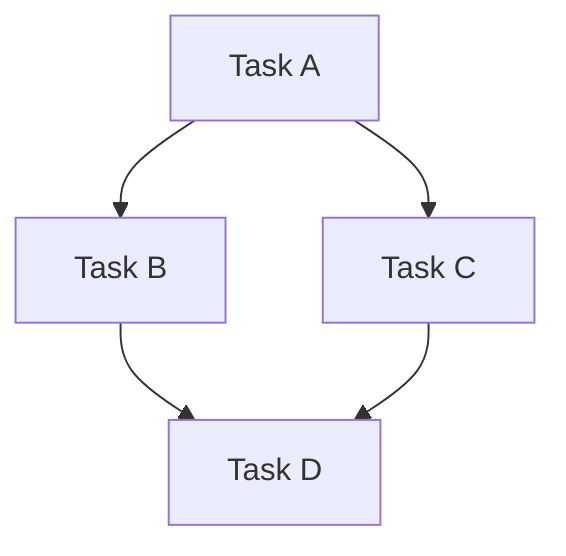

# How-To: Dependency Management

> **Diátaxis Type:** How-To Guide

Dependencies control work order by expressing "FROM depends on TO" relationships in a directed acyclic graph (DAG). This guide shows universal techniques for modeling, visualizing, and managing dependencies across any domain.

## Model Task Dependencies

### Express Work Order Constraints

Dependencies represent blocking relationships: "FROM cannot complete until TO is done."

**Basic syntax:**
```bash
# FROM depends on TO
jit dep add <from-id> <to-id>

# Example: Implementation waits for design
jit dep add f3a1b2c d9e8f7g
```

**Multiple dependencies:**
```bash
# Epic depends on all tasks
jit dep add <epic-id> <task1-id> <task2-id> <task3-id>

# Example: Release waits for all features
jit dep add release-1.0 auth-feature api-feature ui-feature
```

### Dependencies vs Labels: When to Use What

Both can flow in the same direction, but serve different purposes:

| Aspect | Dependencies | Labels |
|--------|--------------|--------|
| **Semantics** | "Blocks until complete" | "Belongs to group" |
| **Enforces** | Work order (workflow) | Organization (categorization) |
| **Dynamic** | Affects state transitions | Static metadata |
| **Structure** | Arbitrary DAG | Strict hierarchy |
| **Query use** | Find blocked/ready work | Filter by scope |

**Example - Same direction, different meanings:**
```bash
# Create tasks and epic
TASK=$(jit issue create --title "Implement login" --label "epic:auth")
EPIC=$(jit issue create --title "Auth system" --label "milestone:v1.0")

# Label: Task belongs to auth epic
#   → Used for grouping and reporting
#   → Query: jit query all --label "epic:auth"

# Dependency: Epic waits for task
#   → Used for workflow control
#   → Query: jit query blocked (shows epic is blocked)
jit dep add $EPIC $TASK
```

**When to use dependencies:**
- One piece of work must finish before another can start
- Enforcing execution order (A → B → C)
- Determining what's available to work on
- Controlling state transitions automatically

**When to use labels:**
- Organizing related work into groups (epic, milestone, component)
- Filtering issues by category or domain
- Reporting progress within a scope
- Creating hierarchical structure for navigation

### Universal Dependency Examples

**Software Development:**
```bash
# Feature depends on infrastructure
jit dep add user-registration database-setup

# Integration test waits for unit tests
jit dep add integration-tests unit-tests

# Deployment waits for CI passing
jit dep add production-deploy ci-green
```

**Research:**
```bash
# Experiment 2 needs Experiment 1 data
jit dep add experiment-2 experiment-1

# Analysis waits for data collection
jit dep add statistical-analysis data-collection

# Paper depends on all experiments
jit dep add research-paper exp-1 exp-2 exp-3
```

**Writing:**
```bash
# Chapter 3 needs Chapter 2 complete
jit dep add chapter-3 chapter-2

# Final draft waits for all chapters
jit dep add final-draft ch-1 ch-2 ch-3

# Proofreading depends on draft
jit dep add proofreading final-draft
```

**Project Management:**
```bash
# Phase 2 waits for Phase 1 completion
jit dep add phase-2-planning phase-1-delivery

# Budget approval needed before hiring
jit dep add start-hiring budget-approved

# Launch depends on marketing and product readiness
jit dep add product-launch marketing-campaign product-qa
```

### View Dependencies

**Show dependency tree:**
```bash
# View immediate dependencies (default)
jit graph deps <issue-id>

# View dependencies 2 levels deep
jit graph deps <issue-id> --depth 2

# View all transitive dependencies (entire chain)
jit graph deps <issue-id> --depth 0

# Example output with tree structure:
# Dependencies of abc123 (depth 2):
#   Summary: 2/5 complete
#
#   ○ def456 - Implement feature X [ready]
#   ├─ ○ ghi789 - Add tests [ready]
#   └─ ✓ jkl012 - Update docs [done]
#   ✓ mno345 - Fix bug Y [done]
```

## Avoid Circular Dependencies

### Understanding the DAG Property

JIT enforces that dependencies form a **Directed Acyclic Graph (DAG)** - no cycles allowed.

**Why no cycles?**
- **Deadlock prevention:** Circular dependencies prevent any work from completing
- **Clear execution order:** DAG allows topological sorting
- **Deterministic scheduling:** Agents can identify ready work reliably

### Detect Cycles Before They Happen

JIT validates dependencies on every add operation:

```bash
# Create tasks
TASK_A=$(jit issue create --title "Task A")
TASK_B=$(jit issue create --title "Task B")
TASK_C=$(jit issue create --title "Task C")

# Build chain: A → B → C
jit dep add $TASK_A $TASK_B  # ✓ OK
jit dep add $TASK_B $TASK_C  # ✓ OK

# Try to create cycle: C → A
jit dep add $TASK_C $TASK_A
# ✗ ERROR: Cycle detected
#   Adding dependency would create a cycle
```

### How Cycle Detection Works

JIT uses depth-first search (DFS) to detect potential cycles:

```
Adding edge FROM → TO creates a cycle if:
  There's already a path TO → ... → FROM

Algorithm: Check if FROM is reachable from TO
  If yes: Cycle would be created
  If no: Safe to add dependency
```

**Example:**
```
Current graph:
  A → B → C

Attempt: Add C → A

Check: Is A reachable from C?
  Start at C
  → Follow edge to B
  → Follow edge to A
  → Found A! (reachable)

Result: CYCLE - reject the add operation
```

### Validate Repository Health

**Check for integrity issues:**
```bash
# Validate all constraints
jit validate

# Output shows any problems:
# ✓ No cycles detected
# ✓ All dependencies reference valid issues
# ✓ Graph is well-formed
```

**Fix validation issues:**
```bash
# Some validators can auto-fix
jit validate --fix

# Example fixes:
# - Remove references to deleted issues
# - Clean up stale temporary files
# - Rebuild index if corrupted
```

### Common Cycle Patterns and Solutions

**Pattern 1: Simple cycle (A ↔ B)**
```bash
# Problem: Mutual dependency
A depends on B
B depends on A

# Solution: Pick the correct direction
# Ask: "Which truly must finish first?"
jit dep rm $TASK_B $TASK_A  # Remove one edge
```

**Pattern 2: Indirect cycle (A → B → C → A)**
```bash
# Problem: Circular chain
# Solution: Identify and break the weakest link
jit dep rm $TASK_C $TASK_A  # Break at weakest dependency
```

**Pattern 3: False dependency**
```bash
# Problem: Unnecessary constraint creating cycle
# Solution: Use labels instead of dependencies
# Before: Epic depends on task, task depends on epic (cycle)
# After: Task has label "epic:name" (no dependency)
```

### Refactor Dependencies Safely

**Remove dependencies:**
```bash
# Remove single dependency
jit dep rm <from-id> <to-id>

# Check impact before removing
jit graph downstream <to-id>  # Who depends on this?
```

**Restructure workflow:**
```bash
# Old: A → B, B → C, C → D (linear chain)
# New: A → [B, C], [B, C] → D (parallel work)

# Remove old dependencies
jit dep rm $A $B
jit dep rm $B $C

# Add new structure
jit dep add $A $B
jit dep add $A $C
jit dep add $D $B
jit dep add $D $C
```

## Visualize Dependency Graphs

### Export to Graphviz (DOT Format)

**Basic export:**
```bash
# Export entire graph
jit graph export --format dot --output deps.dot

# View with Graphviz
dot -Tpng deps.dot -o deps.png
open deps.png  # macOS
xdg-open deps.png  # Linux
```

**Advanced Graphviz rendering:**
```bash
# Horizontal layout (left to right)
dot -Tpng -Grankdir=LR deps.dot -o deps-horizontal.png

# SVG for web embedding
dot -Tsvg deps.dot -o deps.svg

# PDF for documentation
dot -Tpdf deps.dot -o deps.pdf
```

### Export to Mermaid

**For web-based visualization:**
```bash
# Export to Mermaid format
jit graph export --format mermaid --output deps.mmd

# View in Mermaid Live Editor
# https://mermaid.live/
# Paste contents of deps.mmd
```

**Embed in Markdown:**
````markdown

````

### Understanding Graph Output

**Node representation:**
```
┌─────────────────────┐
│ abc123              │  ← Short hash
│ Implement feature X │  ← Title
│ [in_progress]       │  ← Current state
└─────────────────────┘
```

**Edge representation:**
```
FROM ──→ TO
"FROM depends on TO"
"FROM is blocked until TO completes"
```

**Graph reading tips:**
- **No incoming edges** = Root issue (can start immediately)
- **Many incoming edges** = Bottleneck (blocks lots of work)
- **No outgoing edges** = Leaf issue (no dependencies)
- **Long chains** = Critical path (sequential work)
- **Wide graphs** = Parallelizable work

### Large Graph Management

**Filter by scope:**
```bash
# View dependencies for specific issue with depth control
jit graph deps <issue-id> --depth 0

# Focus on specific label
jit query all --label "epic:auth" --json | process_graph
```

**Simplify visualization:**
```bash
# Hide done issues in exports
jit query all --state backlog,ready,in_progress --json | \
  jq '.issues[] | .id' | \
  # Filter graph export to these IDs only
```

## Find Blocking Issues

### Query Blocked Work

**Find all blocked issues:**
```bash
# Show issues that cannot complete
jit query blocked

# With full details
jit query blocked --full --json | jq
```

**Output shows blocking reasons:**
```
Issue: Feature Integration [blocked]
  Blocked by:
    - Unit Tests (in_progress)
    - API Documentation (backlog)
  Labels: epic:v2.0, type:task
```

### Identify Upstream Blockers

**What blocks this specific issue?**
```bash
# Direct dependencies only
jit graph deps <issue-id>

# Full dependency chain
jit graph deps <issue-id> --depth 0

# Example output:
# Dependencies of abc123 (all transitive):
#   Summary: 1/3 complete
#
#   ✓ def456 - Database migration [done]
#   ○ xyz789 - API implementation [in_progress]
#   └─ ○ qrs012 - Schema definition [ready]
```

### Identify Downstream Dependents

**What depends on this issue?**
```bash
# Find downstream blockers
jit graph downstream <issue-id>

# Example output:
# Issue abc123 is blocking (3 dependents):
#   - def456 [blocked] - Integration tests
#   - xyz789 [blocked] - Feature rollout
#   - qrs012 [blocked] - Documentation update
```

**Use case: Prioritization**
```bash
# High downstream count = high priority (unblocks lots of work)
jit graph downstream <critical-issue>

# Example decision:
# "This issue blocks 10 others - prioritize it!"
```

### Find Root Issues (No Dependencies)

**Identify starting points:**
```bash
# Find issues with no dependencies
jit graph roots

# These can start immediately
# Example output:
# Root issues (3):
#   - abc123 [ready] - Database setup
#   - def456 [ready] - Design mockups
#   - xyz789 [backlog] - Requirements gathering
```

**Use case: Work distribution**
```bash
# Assign root issues to agents first
jit graph roots --json | jq -r '.[] | .id' | \
  while read issue_id; do
    jit claim acquire $issue_id --agent-id agent:worker-$RANDOM
  done
```

### Identify Critical Path

**Find longest chain (bottleneck):**
```bash
# Export graph and analyze
jit graph export --format dot --output deps.dot

# Use external tools to find longest path
# Or manually inspect for deepest chains
```

**Manual analysis:**
```bash
# Start from leaf (no dependencies)
# Walk backwards counting depth
jit graph deps <leaf-id> --depth 0 | wc -l
```

### Prioritize Work to Unblock Others

**Strategy: Maximize unblocking**
```bash
# 1. Find blocked issues
jit query blocked --json | jq -r '.issues[].id' > blocked.txt

# 2. For each blocker, count downstream
for blocker in $(cat blocked.txt); do
  count=$(jit graph downstream $blocker --json | jq 'length')
  echo "$count $blocker"
done | sort -rn

# 3. Work on highest-count issues first
```

**Example workflow:**
```bash
# Issue A blocks 10 others → Priority: Critical
# Issue B blocks 3 others → Priority: High
# Issue C blocks 0 others → Priority: Normal

# Focus on A to unblock maximum work
```

## Transitive Reduction

### Keep Graphs Clean

**What is transitive reduction?**

The **minimal set of edges** that preserves reachability:

```
Before (redundant):          After (reduced):
A → B                        A → B
B → C                        B → C
A → C  ← redundant          (A → C removed, still reachable via B)
```

### Why Simplification Matters

**Benefits:**
- **Clarity:** Fewer edges = easier to understand
- **Maintenance:** Less to update when refactoring
- **Performance:** Smaller graphs process faster
- **Documentation:** Shows direct dependencies only

**Example - Redundant dependencies:**
```bash
# Workflow: Design → Implementation → Testing

# Redundant: 
# Testing depends on Implementation ✓
# Testing depends on Design ← redundant (via Implementation)

# Minimal:
# Testing → Implementation → Design
# (Testing still blocked by Design transitively)
```

### Detect Redundant Edges

JIT doesn't automatically prevent redundant edges (they're technically valid):

```bash
# Both valid:
jit dep add $TESTING $IMPLEMENTATION
jit dep add $TESTING $DESIGN  # Redundant but allowed
```

**Manual detection:**
```bash
# Check transitive deps
jit graph deps $TESTING --depth 0

# If Design appears in transitive list,
# AND you have direct edge to Design,
# → Edge is redundant
```

### When to Keep Explicit Edges

**Sometimes redundancy improves documentation:**

```bash
# Epic → Task1, Task2, Task3
# Task3 → Task2 → Task1

# Epic → Task1 is redundant (via Task3)
# But keep it for clarity: "Epic needs ALL tasks"
```

**Use judgment:**
- **Keep:** When explicit edge clarifies intent
- **Remove:** When edge is truly redundant and confusing

### Simplify Complex Graphs

**Strategy 1: Remove redundant edges manually**
```bash
# Identify redundancy
jit graph deps $ISSUE --depth 0

# Remove redundant direct edge
jit dep rm $ISSUE $REDUNDANT_DEP
```

**Strategy 2: Rebuild from scratch**
```bash
# Export current dependencies
jit graph export --format dot > backup.dot

# Remove all dependencies for an issue
jit issue show $ISSUE --json | \
  jq -r '.dependencies[]' | \
  while read dep; do
    jit dep rm $ISSUE $dep
  done

# Re-add only direct dependencies
jit dep add $ISSUE $DIRECT_DEP1 $DIRECT_DEP2
```

## See Also

- [Core Model: Dependencies](../concepts/core-model.md#dependencies-vs-labels-understanding-the-difference) - Conceptual explanation
- [CLI Reference: Graph Commands](../reference/cli-commands.md#graph-commands) - Complete command syntax
- [CLI Reference: Dependency Commands](../reference/cli-commands.md#dependency-commands) - dep add/rm reference
- [System Guarantees](../concepts/guarantees.md#dag-property) - How cycle detection works
- [First Workflow Tutorial](../tutorials/first-workflow.md) - Dependencies in practice
