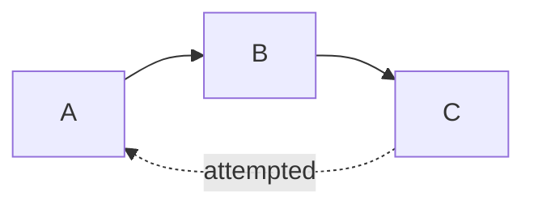
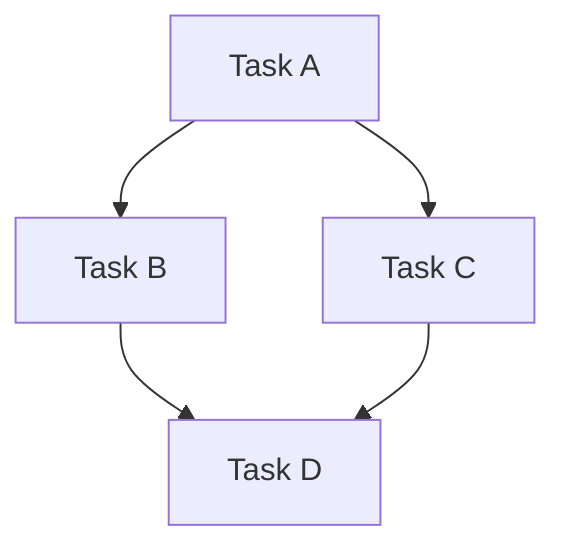
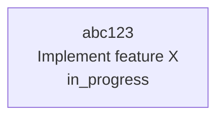
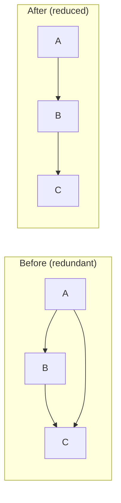

# How-To: Dependency Management

> **Diátaxis Type:** How-To Guide

Dependencies control work order by expressing "FROM depends on TO" relationships in a directed acyclic graph (DAG). This guide shows universal techniques for modeling, visualizing, and managing dependencies across any domain.

## Model Task Dependencies

### Express Work Order Constraints

Dependencies represent blocking relationships: "FROM stays blocked until TO reaches an effective terminal state (done, rejected, or archived from one)."

**Basic syntax:**
```bash
# FROM depends on TO
jit dep add <from-id> <to-id>

# Example: Implementation waits for design
jit dep add f3a1b2c d9e8f7g
```

**Multiple dependencies:**
```bash
# Epic depends on all tasks
jit dep add <epic-id> <task1-id> <task2-id> <task3-id>

# Example: Release waits for all features
jit dep add release-1.0 auth-feature api-feature ui-feature
```

### Dependencies vs Labels: When to Use What

Both can flow in the same direction, but serve different purposes:

| Aspect | Dependencies | Labels |
|--------|--------------|--------|
| **Semantics** | "Blocks until terminal" | "Belongs to group" |
| **Enforces** | Work order (workflow) | Organization (categorization) |
| **Dynamic** | Affects state transitions | Static metadata |
| **Structure** | Arbitrary DAG | Flat `namespace:value` pairs |
| **Query use** | Find blocked/ready work | Filter by scope |

**Example - Same direction, different meanings:**
```bash
# Create tasks and epic
TASK=$(jit issue create --title "Implement login" --label "epic:auth" --json | jq -r '.id')
EPIC=$(jit issue create --title "Auth system" --label "milestone:v1.0" --json | jq -r '.id')

# Label: Task belongs to auth epic
#   → Used for grouping and reporting
#   → Query: jit query all --label "epic:auth"

# Dependency: Epic waits for task
#   → Used for workflow control
#   → Query: jit query blocked (shows epic is blocked)
jit dep add $EPIC $TASK
```

**When to use dependencies:**
- One piece of work must reach a terminal state before another can start
- Enforcing execution order (A → B → C)
- Determining what's available to work on
- Controlling state transitions automatically

**When to use labels:**
- Organizing related work into groups (epic, milestone, component)
- Filtering issues by category or domain
- Reporting progress within a scope
- Navigating work by group and scope (the type hierarchy and DAG define hierarchy, not the labels)

### Universal Dependency Examples

**Software Development:**
```bash
# Feature depends on infrastructure
jit dep add user-registration database-setup

# Integration test waits for unit tests
jit dep add integration-tests unit-tests

# Deployment waits for CI passing
jit dep add production-deploy ci-green
```

**Research:**
```bash
# Experiment 2 needs Experiment 1 data
jit dep add experiment-2 experiment-1

# Analysis waits for data collection
jit dep add statistical-analysis data-collection

# Paper depends on all experiments
jit dep add research-paper exp-1 exp-2 exp-3
```

**Writing:**
```bash
# Chapter 3 needs Chapter 2 complete
jit dep add chapter-3 chapter-2

# Final draft waits for all chapters
jit dep add final-draft ch-1 ch-2 ch-3

# Proofreading depends on draft
jit dep add proofreading final-draft
```

**Project Management:**
```bash
# Phase 2 waits for Phase 1 completion
jit dep add phase-2-planning phase-1-delivery

# Budget approval needed before hiring
jit dep add start-hiring budget-approved

# Launch depends on marketing and product readiness
jit dep add product-launch marketing-campaign product-qa
```

### View Dependencies

**Show dependency tree:**
```bash
# View immediate dependencies (default)
jit graph deps <issue-id>

# View dependencies 2 levels deep
jit graph deps <issue-id> --depth 2

# View all transitive dependencies (entire chain)
jit graph deps <issue-id> --depth 0

# Example output with tree structure (○ = not effectively terminal, ✓ = effectively terminal (done, rejected, or archived from one of those)):
# Dependencies of abc123 (depth 2):
#   Summary: 2/5 complete
#
#   ○ def456 - Implement feature X
#   ├─ ○ ghi789 - Add tests
#   └─ ✓ jkl012 - Update docs
#   ✓ mno345 - Fix bug Y
```

## Avoid Circular Dependencies

### Understanding the DAG Property

JIT enforces that dependencies form a **Directed Acyclic Graph (DAG)** - no cycles allowed.

**Why no cycles?**
- **Deadlock prevention:** Circular dependencies prevent any work from completing
- **Clear execution order:** DAG allows topological sorting
- **Deterministic scheduling:** Agents can identify ready work reliably

### Detect Cycles Before They Happen

JIT validates dependencies on every add operation:

```bash
# Create tasks
TASK_A=$(jit issue create --title "Task A" --json | jq -r '.id')
TASK_B=$(jit issue create --title "Task B" --json | jq -r '.id')
TASK_C=$(jit issue create --title "Task C" --json | jq -r '.id')

# Build chain: A → B → C
jit dep add $TASK_A $TASK_B  # ✓ OK
jit dep add $TASK_B $TASK_C  # ✓ OK

# Try to create cycle: C → A
jit dep add $TASK_C $TASK_A
# ✗ ERROR: Cycle detected
#   Adding dependency would create a cycle
```

### How Cycle Detection Works

JIT uses depth-first search (DFS) to detect potential cycles:

```
Adding edge FROM → TO creates a cycle if:
  There's already a path TO → ... → FROM

Algorithm: Check if FROM is reachable from TO
  If yes: Cycle would be created
  If no: Safe to add dependency
```

**Example:**

The current graph chains A to B to C. Adding an edge from C back to A closes a loop:


```mermaid
flowchart LR
    A --> B
    B --> C
    C -.->|attempted| A
```

Check: is A reachable from C?

1. Start at C
2. Follow the edge to B
3. Follow the edge to A
4. Found A, so A is reachable

Result: CYCLE, reject the add operation.

### Validate Repository Health

**Check for integrity issues:**
```bash
# Validate all constraints (integrity checks + declarative rules)
jit validate

# On success:
# ✓ Repository validation passed
#
# On failure each finding prints on its own line, e.g.:
# ❌ Repository validation failed with 1 rule error(s)
# ❌ [dangling-item-link] <issue-id>: ...
```

**Fix validation issues:**
```bash
# Some validators can auto-fix
jit validate --fix

# What --fix applies:
# - Replaces an unknown/deprecated type label with its suggested valid type
# - Drops redundant (transitively-implied) dependency edges
# - Advances a pending state transition that is now unblocked
#
# Stale temp files, lock files, and a rebuildable index are NOT --fix's job;
# run `jit recover` for those.
```

### Common Cycle Patterns and Solutions

**Pattern 1: Simple cycle (A ↔ B)**
```bash
# Problem: Mutual dependency
A depends on B
B depends on A

# Solution: Pick the correct direction
# Ask: "Which truly must finish first?"
jit dep rm $TASK_B $TASK_A  # Remove one edge
```

**Pattern 2: Indirect cycle (A → B → C → A)**
```bash
# Problem: Circular chain
# Solution: Identify and break the weakest link
jit dep rm $TASK_C $TASK_A  # Break at weakest dependency
```

**Pattern 3: False dependency**
```bash
# Problem: Unnecessary constraint creating cycle
# Solution: Use labels instead of dependencies
# Before: Epic depends on task, task depends on epic (cycle)
# After: Task has label "epic:name" (no dependency)
```

### Refactor Dependencies Safely

**Remove dependencies:**
```bash
# Remove single dependency
jit dep rm <from-id> <to-id>

# Check impact before removing
jit graph downstream <to-id>  # Who depends on this?
```

**Restructure workflow:**
```bash
# Old: A → B, B → C, C → D (linear chain)
# New: A → [B, C], [B, C] → D (parallel work)

# Remove old dependencies
jit dep rm $A $B
jit dep rm $B $C

# Add new structure
jit dep add $A $B
jit dep add $A $C
jit dep add $D $B
jit dep add $D $C
```

## Visualize Dependency Graphs

### Export to Graphviz (DOT Format)

**Basic export:**
```bash
# Export entire graph
jit graph export --format dot --output deps.dot

# View with Graphviz
dot -Tpng deps.dot -o deps.png
open deps.png  # macOS
xdg-open deps.png  # Linux
```

**Advanced Graphviz rendering:**
```bash
# Horizontal layout (left to right)
dot -Tpng -Grankdir=LR deps.dot -o deps-horizontal.png

# SVG for web embedding
dot -Tsvg deps.dot -o deps.svg

# PDF for documentation
dot -Tpdf deps.dot -o deps.pdf
```

### Export to Mermaid

**For web-based visualization:**
```bash
# Export to Mermaid format
jit graph export --format mermaid --output deps.mmd

# View in Mermaid Live Editor
# https://mermaid.live/
# Paste contents of deps.mmd
```

**Embed in Markdown:**
````markdown

```mermaid
graph TD
  A[Task A] --> B[Task B]
  A --> C[Task C]
  B --> D[Task D]
  C --> D
```
````

### Understanding Graph Output

**Node representation:** short hash, title, current state.


```mermaid
flowchart TD
    N["abc123<br/>Implement feature X<br/>in_progress"]
```

**Edge representation:**


```mermaid
flowchart LR
    FROM --> TO
```

An edge reads "FROM depends on TO": FROM is blocked until TO reaches a terminal state.

**Graph reading tips:**
- **No outgoing edges** = Root issue (has no dependencies; it can become ready without dependency blockers)
- **Many incoming edges** = Bottleneck (blocks lots of work)
- **No incoming edges** = Leaf issue (nothing else depends on it)
- **Long chains** = Critical path (sequential work)
- **Wide graphs** = Parallelizable work

### Large Graph Management

**Filter by scope:**
```bash
# View dependencies for specific issue with depth control
jit graph deps <issue-id> --depth 0

# Focus on specific label
jit query all --label "epic:auth" --json | process_graph
```

**Simplify visualization:**
```bash
# Hide done issues in exports
jit query all --json | \
  jq -r '.issues[] | select(.state == "backlog" or .state == "ready" or .state == "in_progress") | .id' | \
  # Filter graph export to these IDs only
```

## Find Blocking Issues

### Query Blocked Work

**Find all blocked issues:**
```bash
# Show issues that cannot complete
jit query blocked

# With full details
jit query blocked --full --json | jq
```

**Output shows blocking reasons** (each `- ` line is one unmet dependency or
unpassed gate):
```
Blocked issues:
  abc123 | Feature Integration | High
    - dependency:def456 (Unit Tests:InProgress)
    - dependency:ghi789 (API Documentation:Backlog)

Total: 1
```

### Identify Upstream Blockers

**What blocks this specific issue?**
```bash
# Direct dependencies only
jit graph deps <issue-id>

# Full dependency chain
jit graph deps <issue-id> --depth 0

# Example output (○ = not effectively terminal, ✓ = effectively terminal (done, rejected, or archived from one of those)):
# Dependencies of abc123 (all transitive):
#   Summary: 1/3 complete
#
#   ✓ def456 - Database migration
#   ○ xyz789 - API implementation
#   └─ ○ qrs012 - Schema definition
```

### Identify Downstream Dependents

**What depends on this issue?**
```bash
# Find downstream dependents (alias of `jit graph rdeps`)
jit graph downstream <issue-id>

# Example output:
# Reverse dependencies of abc123:
#   def456 | Integration tests
#   xyz789 | Feature rollout
#   qrs012 | Documentation update
```

**Use case: Prioritization**
```bash
# High downstream count = high priority (unblocks lots of work)
jit graph downstream <critical-issue>

# Example decision:
# "This issue blocks 10 others - prioritize it!"
```

### Find Root Issues (No Dependencies)

**Identify starting points:**
```bash
# Find issues with no dependencies
jit graph roots

# Inspect each root's state and gates (jit issue status <id>) before assigning it
# Example output:
# Root issues (no dependencies):
#   abc123 | Database setup
#   def456 | Design mockups
#   xyz789 | Requirements gathering
```

**Use case: Work distribution**
```bash
# Assign root issues to agents first
jit graph roots --json | jq -r '.roots[] | .id' | \
  while read issue_id; do
    jit claim acquire $issue_id --agent-id agent:worker-$RANDOM
  done
```

### Identify Critical Path

**Find longest chain (bottleneck):**
```bash
# Export graph and analyze
jit graph export --format dot --output deps.dot

# Use external tools to find longest path
# Or manually inspect for deepest chains
```

**Manual analysis:**
```bash
# Start from a leaf (no dependents) and follow its prerequisite chain
# Walk backwards counting depth
jit graph deps <leaf-id> --depth 0 | wc -l
```

### Prioritize Work to Unblock Others

**Strategy: Maximize unblocking**
```bash
# 1. Find blocked issues
jit query blocked --json | jq -r '.issues[].id' > blocked.txt

# 2. For each blocker, count downstream
for blocker in $(cat blocked.txt); do
  count=$(jit graph downstream $blocker --json | jq '.dependents | length')
  echo "$count $blocker"
done | sort -rn

# 3. Work on highest-count issues first
```

**Example workflow:**
```bash
# Issue A blocks 10 others → Priority: Critical
# Issue B blocks 3 others → Priority: High
# Issue C blocks 0 others → Priority: Normal

# Focus on A to unblock maximum work
```

## Transitive Reduction

### Keep Graphs Clean

**What is transitive reduction?**

The **minimal set of edges** that preserves reachability:


```mermaid
flowchart LR
    subgraph Before["Before (redundant)"]
        A1[A] --> B1[B]
        B1 --> C1[C]
        A1 --> C1
    end
    subgraph After["After (reduced)"]
        A2[A] --> B2[B]
        B2 --> C2[C]
    end
```

The direct edge from A to C is dropped. C stays reachable from A through B.

### Why Simplification Matters

**Benefits:**
- **Clarity:** Fewer edges = easier to understand
- **Maintenance:** Less to update when refactoring
- **Performance:** Smaller graphs process faster
- **Documentation:** Shows direct dependencies only

**Example - Redundant dependencies:**
```bash
# Workflow: Design → Implementation → Testing

# Redundant: 
# Testing depends on Implementation ✓
# Testing depends on Design ← redundant (via Implementation)

# Minimal:
# Testing → Implementation → Design
# (Testing still blocked by Design transitively)
```

### Redundant Edges

`jit dep add` rejects a transitively-redundant edge by default — one that shadows
an existing direct edge, or is itself already reachable through other edges. The
add fails with a nonzero exit naming the offending pair, so a redundant edge never
silently enters the graph to fail a later `jit validate`:

```bash
jit dep add $TESTING $IMPLEMENTATION   # ok
jit dep add $TESTING $DESIGN           # rejected: redundant given TESTING → IMPLEMENTATION → DESIGN
```

Pass `--reduce` to add the edge anyway and drop the now-redundant edge(s) in the
same operation, leaving the graph transitively reduced:

```bash
jit dep add $TESTING $DESIGN --reduce  # adds the edge, drops the shadowed one
```

**Manual detection:**
```bash
# Check transitive deps
jit graph deps $TESTING --depth 0

# If Design appears in transitive list,
# AND you have direct edge to Design,
# → Edge is redundant
```

### Redundant Edges Are Not Retained

The dependency graph is kept transitively reduced: a redundant edge is rejected at
`jit dep add` time and reported as a violation by `jit validate`, so it cannot be
kept "for documentation". Reachability is unchanged by dropping it — if `Epic →
Task3 → Task2 → Task1`, then `Epic` still (transitively) depends on `Task1` without
a direct `Epic → Task1` edge.

To document that a parent needs *all* of its children, express it in the issue's
description or labels rather than in a redundant edge.

### Simplify Complex Graphs

**Strategy 1: Remove redundant edges manually**
```bash
# Identify redundancy
jit graph deps $ISSUE --depth 0

# Remove redundant direct edge
jit dep rm $ISSUE $REDUNDANT_DEP
```

**Strategy 2: Rebuild from scratch**
```bash
# Export current dependencies
jit graph export --format dot > backup.dot

# Remove all dependencies for an issue
jit issue show $ISSUE --json | \
  jq -r '.dependencies[]' | \
  while read dep; do
    jit dep rm $ISSUE $dep
  done

# Re-add only direct dependencies
jit dep add $ISSUE $DIRECT_DEP1 $DIRECT_DEP2
```

## See Also

- [Core Model: Dependencies](../concepts/core-model.md#dependencies-vs-labels-understanding-the-difference) - Conceptual explanation
- [CLI Reference: Graph Commands](../reference/cli-commands.md#graph-commands) - Complete command syntax
- [CLI Reference: Dependency Commands](../reference/cli-commands.md#dependency-commands) - dep add/rm reference
- [System Guarantees](../concepts/guarantees.md#dag-property) - How cycle detection works
- [First Workflow Tutorial](../tutorials/first-workflow.md) - Dependencies in practice
