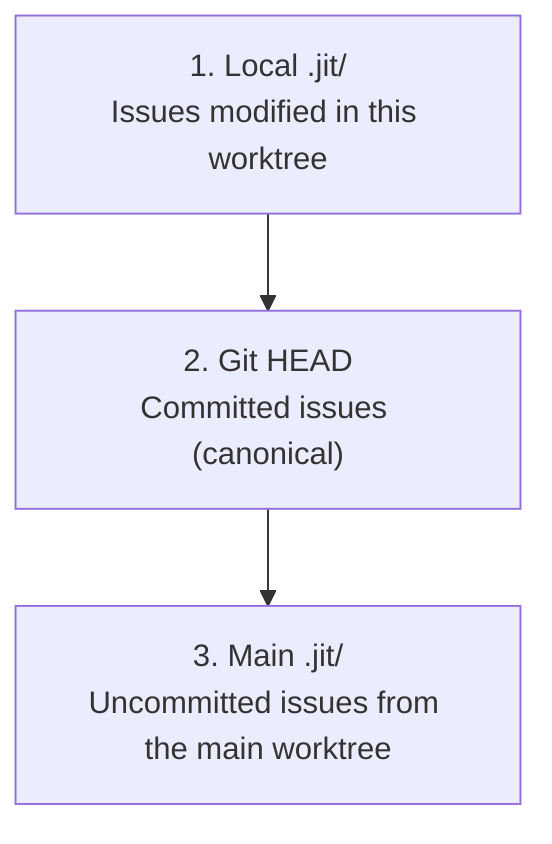

# How-to: Multi-Agent Coordination

> **Diátaxis Type:** How-to Guide  
> **Audience:** Users running multiple agents in parallel

This guide covers practical patterns for coordinating multiple agents working on the same repository.

## Choosing the Right Claim Command

JIT provides two ways to claim work:

| Command | Use Case | TTL | Lease Management |
|---------|----------|-----|------------------|
| `jit issue claim <id> <assignee>` | Single developer, simple workflows | None | No |
| `jit claim acquire <id> --ttl <seconds>` | Multi-agent coordination | Explicit; omitted `--ttl` uses the [default claim lease TTL](../reference/runtime-defaults.md) | Yes (renew/release) |

**Use `jit issue claim`** for simple, single-developer workflows where you don't need automatic expiry.

**Use `jit claim acquire --ttl <seconds>`** when running multiple agents in
parallel. Finite leases expire at their requested TTL if an agent crashes.

## Quick Reference

### Set Up Agent Identity

```bash
# Per-session (environment variable)
export JIT_AGENT_ID=agent:copilot-1

# Persistent (config file)
mkdir -p ~/.config/jit
echo '[agent]
id = "agent:copilot-1"
description = "Copilot session 1"' > ~/.config/jit/agent.toml
```

### Create a Worktree

A linked worktree is a non-primary checkout; jit refuses state-mutating
commands run inside one unless the repository declares the allowing write
stance first (see [Configuration for
Coordination](#configuration-for-coordination) below). Declare and commit
it once, from your primary checkout, before creating any worktree:

```bash
jit config set worktree.write_policy allow
git add .jit/config.toml && git commit -m "Allow linked-checkout writes"
```

Then create the worktree — `jit init` succeeds because it inherits the
committed stance:

```bash
git worktree add ../agent-1-worktree -b feature/agent-1-work
cd ../agent-1-worktree
jit init
```

### Claim and Work

```bash
# Claim an issue for ten minutes
jit claim acquire <issue-id> --ttl 600

# Work on it...
jit issue update <issue-id> --state done

# Release when done (or let it expire)
jit claim release <issue-id>
```

## Coordination Patterns

### Pattern 1: Parallel Agents on Different Issues

The simplest pattern: each agent works on a different issue.

```bash
# Agent 1
export JIT_AGENT_ID=agent:worker-1
jit claim acquire issue-A

# Agent 2 (different terminal/worktree)
export JIT_AGENT_ID=agent:worker-2
jit claim acquire issue-B  # Works - different issue

# Agent 2 trying Agent 1's issue
jit claim acquire issue-A  # FAILS - already claimed
```

### Pattern 2: Work Queue with Claim-Next

Agents poll for available work:

```bash
# Agent claims next available issue by priority
jit issue claim-next agent:worker-1

# If no work available, wait and retry
while ! jit issue claim-next agent:worker-1 2>/dev/null; do
  sleep 10
done
```

### Pattern 3: Dependency-Aware Work

Agents respect the dependency graph:

```bash
# Check what's actually ready (unblocked)
jit query available

# See why an issue is blocked
jit graph deps <issue-id>

# Only claim unblocked issues
jit claim acquire $(jit query available --json | jq -r '.issues[0].id')
```

### Pattern 4: Lease Renewal for Long Tasks

For work that takes longer than the default TTL:

```bash
# Claim with longer TTL
jit claim acquire <issue-id> --ttl 3600  # 1 hour

# Or renew during work
jit claim renew <lease-id> --extension 600  # Add 10 minutes
```

### Pattern 5: Indefinite Leases for Manual Oversight

For tasks requiring human oversight or unpredictable duration:

```bash
# Acquire indefinite lease (requires reason)
jit claim acquire <issue-id> --ttl 0 --reason "Manual review needed"

# Send periodic heartbeats to prevent staleness
jit claim heartbeat <lease-id>

# Check status (shows time since last heartbeat)
jit claim status
```

**Policy limits apply:**
- Max 2 indefinite leases per agent (configurable)
- Max 10 indefinite leases per repository (configurable)

Indefinite leases are marked **stale** after a hardcoded hour without a
heartbeat. Staleness is only a marker: a stale indefinite lease is not evicted
automatically — it remains until a heartbeat, a `jit claim release`, or a
`jit claim force-evict`. The threshold is not a pre-commit-hook setting and
`stale_threshold_secs` does not configure it.

## Handling Conflicts

### Conflict: Same Issue Claimed

```
Error: Issue abc123 already claimed by agent:worker-1 until 2026-02-02 17:30:00 UTC
```

**Solutions:**

1. **Wait for expiration** — A finite lease expires at its TTL and is evicted on the next claim acquisition (an indefinite lease does not expire; use Force evict)
2. **Coordinate** — Contact the other agent to release
3. **Force evict** — Admin operation for crashed agents:
   ```bash
   jit claim force-evict <lease-id> --reason "agent crashed"
   ```

### Conflict: Merge Conflicts in .jit/

When merging branches with overlapping issue edits:

```bash
git merge main

# Resolve the conflicts in the files themselves: git marks the .jit/issues/*.json
# both branches edited, and .jit/index.json whenever both added issues.
# `jit validate --fix` is not a resolver — it parses no file still holding
# conflict markers.
git add .jit/issues/ .jit/events.jsonl .jit/index.json
git commit

# Then check that the store is consistent:
jit validate
```

Merging one already-known-diverged branch, as above, is different from two
checkouts whose stores you haven't yet compared — see [Divergent Checkout
Stores](#divergent-checkout-stores) below for that starting point.

## Visibility Across Worktrees

### How Issue Resolution Works



### Reading Issues

```bash
# From any worktree - reads from all sources
jit issue show <issue-id>
jit query all
```

### Writing Issues

Writing from a linked checkout succeeds only once the repository declares
the allowing write stance — see [Configuration for
Coordination](#configuration-for-coordination) above.

```bash
# Writes go to LOCAL .jit/ only
jit issue update <issue-id> --state done

# To share: commit and merge
git add .jit/issues/ .jit/events.jsonl .jit/index.json
git commit -m "Complete issue"
git push
```

## Configuration for Coordination

### Repository Config (`.jit/config.toml`)

```toml
[worktree]
enforce_leases = "strict"  # "strict" | "warn" | "off"
write_policy = "allow"     # "refuse" (default) | "allow"

[coordination]
max_indefinite_leases_per_agent = 2
max_indefinite_leases_per_repo = 10
```

`enforce_leases` is the active repository policy for structural issue writes.
`write_policy` is the active repository policy for whether a linked
(non-primary) checkout may run state-mutating commands at all — every
worktree example in this guide relies on the repository declaring `allow`
here, or an invocation supplying `JIT_WORKTREE_WRITE_POLICY=allow`. See
[`write_policy`](../reference/configuration.md#write_policy) in the
Configuration Reference for its default, precedence, and the override.
The two coordination limits apply to `jit claim acquire --ttl 0`. Choose a
finite lease duration on each claim with `--ttl`; for an indefinite lease, run
`jit claim heartbeat <lease-id>` explicitly while it is active. An omitted
`--ttl` falls back to the built-in claim lease TTL listed in
[Runtime Coordination Defaults](../reference/runtime-defaults.md).

`worktree.mode`, `default_ttl_secs`, and `stale_threshold_secs` are parsed and
shown by configuration commands but do not control the current claim runtime.
Indefinite leases are currently marked stale after a hardcoded hour without an
explicit heartbeat; changing `stale_threshold_secs` does not alter that behavior.

### Agent Config (`~/.config/jit/agent.toml`)

```toml
[agent]
id = "agent:my-agent"
description = "My development agent"
```

`[agent].id` is the active persistent identity source. The agent TTL field is
parsed metadata; it does not override `jit claim acquire --ttl`.

### Environment Overrides

```bash
export JIT_AGENT_ID=agent:session-123
```

## Monitoring Active Work

### View All Claims

```bash
jit claim list
```

Output:
```
All active leases (2):

Lease: abc123...
  Issue:    issue-A
  Agent:    agent:worker-1
  Worktree: wt:def456
  Expires:  2026-02-02 17:30:00 UTC (540 seconds remaining)

Lease: ghi789...
  Issue:    issue-B
  Agent:    agent:worker-2
  ...
```

### Check Specific Claim

```bash
jit claim status --issue <issue-id>
jit claim status --agent agent:worker-1
```

## Recovery Scenarios

### Agent Crashed Mid-Work

```bash
# Find stale leases
jit claim list

# Force evict
jit claim force-evict <lease-id> --reason "agent crashed"

# Validate repository state
jit validate --fix
```

### Corrupted Control Plane

```bash
# Rebuild claims index from log
jit recover

# Validate everything
jit validate
```

### Divergent Checkout Stores

Two checkouts' `.jit/` stores can end up holding different issue or event
records under the same id — an agent's worktree that was never merged back,
or one that still holds work nobody committed. Reconcile before discarding
either checkout: git and the merge drivers this repository already declares
do the actual merging; this procedure only sequences them safely.

1. **Check for divergence first, from the linked checkout being inspected**
   — or from anywhere with that checkout's store selected as the data root,
   which is what an inspection run from the primary needs ([store
   selection](../reference/worktree-validate.md#store-selection)) — before
   committing, merging, or removing anything:
   ```bash
   jit worktree store-divergence
   ```
   This is a read-only report; it writes to neither store. See the [`jit
   worktree store-divergence`
   reference](../reference/worktree-validate.md#jit-worktree-store-divergence)
   for its finding classes and output shape. Read the `Reference store:` line
   before trusting an empty result: a run that inspects the primary's own
   store — a bare run there selects nothing else — and one outside version
   control have no second store to compare against, and print
   `No divergent records.` regardless, so that combination proves nothing.
   Only a report naming a real `Reference store:` and showing
   `No divergent records.` means there is nothing to preserve here — proceed
   with your normal merge or removal. Any other output names a record present
   in only one store, or held by both under conflicting values; continue
   below.

2. **Commit — this makes records durable enough to survive worktree removal,
   not preserved.** The check compares the stores as they physically sit,
   uncommitted work included, and that uncommitted copy is the most fragile:
   a plain `git worktree remove` refuses to discard modified or untracked
   files, but `--force` does not. Commit every reported record in whichever
   checkout(s) still hold it uncommitted:
   ```bash
   git add .jit/issues/ .jit/events.jsonl .jit/index.json && git commit
   ```
   Stage the records and their index, not `.jit/` wholesale. A live store also
   holds machine-local runtime files — the lock files and `worktree.json`
   among the set the [Storage Format
   reference](../reference/storage-format.md#directory-structure) names — and
   `jit init` writes no ignore rule for them, so a wholesale `git add` commits
   one machine's runtime state into a store every checkout shares. Ignore
   those paths locally instead: left untracked, they are enough on their own
   to make a plain `git worktree remove` refuse a checkout whose work is
   fully committed.

   A commit only lands a record on the one branch you committed it to. That
   is enough to survive a plain `git worktree remove`, which checks for a
   clean working tree, not a merged branch — but it is not enough on its own:
   the branch is still unmerged, `git branch -d` refuses it as not fully
   merged, and `git branch -D` deletes it, and every record only it holds,
   anyway. A record isn't preserved until it reaches a branch you are
   keeping; that happens in step 4, not here.

3. **Read each finding class and act on it:**

   | Record  | Class                            | Action |
   |---------|-----------------------------------|--------|
   | `event` | `local_only` / `reference_only`  | Nothing to decide. `.jit/events.jsonl` declares `merge=union` (`.gitattributes`), so a normal merge keeps both sides' disjoint lines automatically. |
   | `event` | `conflicting`                    | Needs a human decision. Events are meant to be written once per id (`@/inv/event-log`); the union driver merges by taking the union of *lines*, not by resolving same-id disagreement, so two differing lines under one id survive the merge as a duplicate, not a correct entry. Inspect both and remove the wrong one before merging. |
   | `issue` | `local_only` / `reference_only`  | Nothing to decide. Each issue is its own file under `.jit/issues/`; a normal merge picks up a file only one side has without conflict. |
   | `issue` | `conflicting`                    | Needs a human decision. No merge driver is declared for issue files, so the same id holding different values in both stores has no automatic resolution. Compare both versions and decide which is correct, or hand-merge the fields, before committing the merge. |

4. **Merge the checkout's branch into the branch you are keeping** —
   typically run from the primary checkout, `git merge <linked-branch>`.
   This is the step that actually preserves a record: landing it on a
   retained branch is what survives a later `git branch -D` of the
   checkout's own branch, which committing alone (step 2) did not.

   Expect a conflict in `.jit/index.json` even when no record conflicts: each
   side inserted its own ids into the same list over one common base, so git
   leaves the decision to you every time. Resolve it to the union of the ids
   present under `.jit/issues/` after the merge — keep every id from both
   sides of the conflict, minding the commas the markers hid — which is what
   step 3's one-sided rows already decided: keep both records. Conflict
   markers inside a record under `.jit/issues/` mean the same id was edited on
   both sides; resolve those files with the decision from step 3. Then stage
   every file you resolved — the same record paths step 2 stages, for the same
   reason — and commit the merge:
   ```bash
   git merge <linked-branch>
   # Edit .jit/index.json: keep every id both sides list.
   # Edit any .jit/issues/<id>.json git marked, per step 3.
   git add .jit/issues/ .jit/events.jsonl .jit/index.json && git commit --no-edit
   ```

   Verify with plain `jit validate`, not `jit validate --fix`: `--fix` parses
   no file that still holds conflict markers, and where it applies no fix it
   reports `No fixes needed` and exits 0 without re-checking the repository,
   so an index resolved to one side alone passes it while the store is still
   inconsistent. Plain `jit validate` names that disagreement —
   `issue files disagree with .jit/index.json`, listing the ids it expected
   against the record files it found — and the absence of *that* failure is
   the confirmation, not a zero exit code: other rules fail the same run for
   reasons this recovery did not cause, such as issues reported as isolated
   in a repository whose graph has no edges yet. Where the repository has no
   such finding of its own, the union-resolved store validates as it stands.

   Until the index agrees with the record files, the records you just
   preserved are invisible to everything that reads through it: `jit list`
   omits them and `jit issue show <id>` answers that the id is not found,
   with the record file sitting right there.

   A `conflicting` finding that merges silently — the two edits touched
   different lines, so git needed no markers — still needs the decision from
   step 3 applied by hand before you commit the merge.

5. **Bring the checkout onto the branch you kept** — from the linked
   checkout, `git merge <retained-branch>`. Step 4 moved records one
   direction only: the retained branch now holds both sides' records, while
   the linked checkout's store still lacks everything only the primary held.
   Do this even when you are about to remove the checkout; skip it and step 6
   keeps reporting the primary's records as `reference_only`, which is
   indistinguishable from a divergence the recovery failed to preserve.

6. **Confirm agreement, with the same invocation as step 1:**
   ```bash
   jit worktree store-divergence
   ```
   A clean re-run — naming the same real `Reference store:` as step 1 —
   reports `No divergent records.` If it still reports findings, a
   conflicting record still needs the decision from step 3, or one of the two
   merges has not landed. Only once this passes, with step 4's merge already
   landed on the branch you are keeping, is the checkout's own branch safe to
   delete.

### Orphaned Worktree

Run the divergence check *inside* the worktree before removing it — once the
worktree is gone there is no live checkout left to compare, only commit
history. See [Divergent Checkout Stores](#divergent-checkout-stores) above;
its step 1 explains why a bare run in the primary — which inspects the
primary's own store — proves nothing. Work through that procedure, including the merge in step 4, for
anything it reports: a worktree can hold issue or event records committed
nowhere else, and committing them (step 2) is not enough on its own — only a
completed merge onto a branch you keep survives deleting the worktree's own
branch afterward.

```bash
# From INSIDE the worktree being removed, so its own store is the one inspected:
jit worktree store-divergence

# Once it names a real reference store and reports no divergent records
# (or you've completed Divergent Checkout Stores' merge for what it found):
git worktree remove ../old-worktree

# The worktree's own branch is separate cleanup. Delete it only once its
# unique records have landed on a branch you keep (Divergent Checkout
# Stores, step 4) — `git branch -D` on it beforehand discards anything
# committed nowhere else; `git branch -d` refuses it for exactly that
# reason, so don't reach for `-D` here until that merge has landed.

# Finite leases from that worktree expire at their TTL and are evicted on the
# next claim acquisition; an indefinite lease left behind needs an explicit
# `jit claim force-evict` (or `jit recover`).
```

## Launching Parallel Copilot CLI Agents

This section covers the complete workflow for running multiple Copilot CLI agents in parallel on the same repository.

### Prerequisites

- Git repository with jit initialized
- The repository declares the allowing write stance for linked checkouts
  (see [Configuration for Coordination](#configuration-for-coordination)
  above) — every worktree below writes to its local `.jit/`
- Copilot CLI installed
- Issues available for work (`jit query available`)

### Step-by-Step: Launch Two Parallel Agents

**Terminal 1: Main agent (your current session)**

```bash
# Already in main worktree
export JIT_AGENT_ID=agent:main-agent
# Continue working...
```

**Terminal 2: Second agent for MCP work**

```bash
# 1. Create worktree with feature branch
git worktree add ../jit-mcp-work -b feature/mcp-tests

# 2. Enter worktree and set identity
cd ../jit-mcp-work
export JIT_AGENT_ID=agent:mcp-worker

# 3. Verify setup
jit worktree info
jit claim list  # See all active claims

# 4. Claim your issue
jit claim acquire e748afbb  # MCP test coverage issue

# 5. Launch Copilot CLI
copilot-cli
```

**Terminal 3: Third agent for documentation**

```bash
# Same pattern with different identity
git worktree add ../jit-docs -b feature/docs-tutorial
cd ../jit-docs
export JIT_AGENT_ID=agent:docs-worker
jit claim acquire 84c358ec  # Tutorial documentation
copilot-cli
```

### Instructing the Agent

When Copilot CLI starts, give it context:

```
You are agent:docs-worker. Your task is issue 84c358ec (Tutorial Documentation).

Check the issue with: jit issue show 84c358ec
Check dependencies with: jit graph deps 84c358ec

Follow the standard workflow:
1. Understand requirements from issue description
2. Implement the changes
3. Run tests/lints
4. Commit with conventional format
5. Mark issue done when complete
6. Release your lease when finished
```

### Monitoring All Agents

From any terminal:

```bash
# See all active work
jit claim list

# Check specific agent
jit claim status --agent agent:docs-worker

# View work distribution
jit query all --state in_progress
```

### Completing Parallel Work

When each agent finishes:

```bash
# In the agent's worktree
jit issue update <issue-id> --state done
git add -A && git commit -m "feat: complete issue description"
git push origin <branch-name>

# Clean up lease (or let it expire)
jit claim release <issue-id>
```

Then merge from main:

```bash
# Back in main worktree
git fetch origin
git merge origin/feature/mcp-tests
git merge origin/feature/docs-tutorial
git worktree remove ../jit-mcp-work
git worktree remove ../jit-docs
```

## Best Practices

### Do

- ✅ **Set unique agent IDs** — Each agent needs distinct identity
- ✅ **Acquire a lease before editing** — `jit claim acquire` serializes exclusive access
- ✅ **Commit frequently** — Makes work visible to others
- ✅ **Use dependencies** — Model work relationships explicitly
- ✅ **Clean up worktrees** — Remove when done

### Don't

- ❌ **Share agent IDs** — Causes claim confusion
- ❌ **Skip claiming** — Risks conflicting edits
- ❌ **Indefinite claims** — Blocks others unnecessarily
- ❌ **Ignore dependencies** — May break workflow

## Troubleshooting

### "No agent identity configured"

```bash
export JIT_AGENT_ID=agent:your-name
# or
jit claim acquire <issue-id> --agent-id agent:your-name
```

### "Issue already claimed"

Wait for expiration or coordinate with the claiming agent.

### "Lease not found"

The lease may have expired. Re-acquire if the issue is still available.

### "Cannot determine worktree location"

Ensure you're in a git repository with proper worktree setup:
```bash
git rev-parse --git-common-dir
```

## See Also

- [Tutorial: Parallel Work with Git Worktrees](../tutorials/parallel-work-worktrees.md)
- [jit worktree and jit validate Reference](../reference/worktree-validate.md)
- [Configuration Reference](../reference/configuration.md)
- [CLI Commands Reference](../reference/cli-commands.md)
- Design document: `dev/archive/ad601a15-parallel-work/design/worktree-parallel-work.md`
