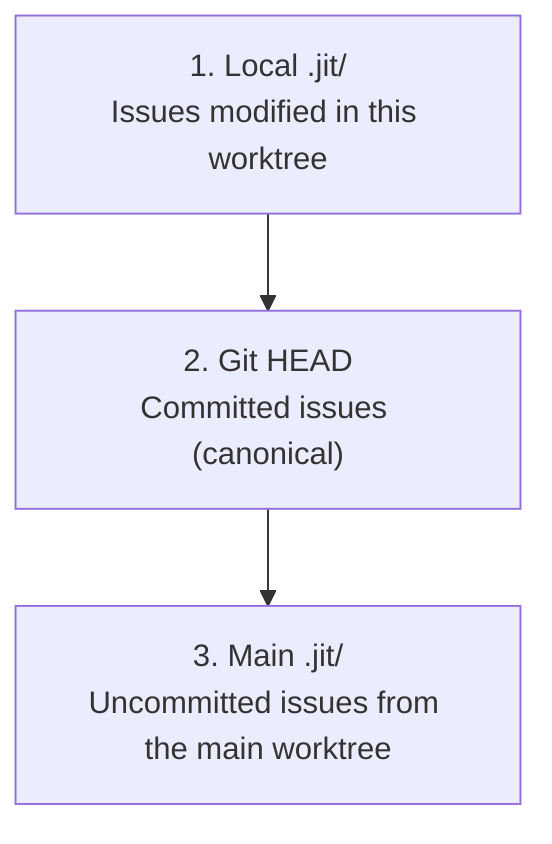

# How-to: Multi-Agent Coordination

> **Diátaxis Type:** How-to Guide  
> **Audience:** Users running multiple agents in parallel

This guide covers practical patterns for coordinating multiple agents working on the same repository.

## Choosing the Right Claim Command

JIT provides two ways to claim work:

| Command | Use Case | TTL | Lease Management |
|---------|----------|-----|------------------|
| `jit issue claim <id> <assignee>` | Single developer, simple workflows | None | No |
| `jit claim acquire <id> --ttl <seconds>` | Multi-agent coordination | Explicit; CLI default is 600 seconds | Yes (renew/release) |

**Use `jit issue claim`** for simple, single-developer workflows where you don't need automatic expiry.

**Use `jit claim acquire --ttl <seconds>`** when running multiple agents in
parallel. Finite leases expire at their requested TTL if an agent crashes.

## Quick Reference

### Set Up Agent Identity

```bash
# Per-session (environment variable)
export JIT_AGENT_ID=agent:copilot-1

# Persistent (config file)
mkdir -p ~/.config/jit
echo '[agent]
id = "agent:copilot-1"
description = "Copilot session 1"' > ~/.config/jit/agent.toml
```

### Create a Worktree

```bash
git worktree add ../agent-1-worktree -b feature/agent-1-work
cd ../agent-1-worktree
jit init
```

### Claim and Work

```bash
# Claim an issue for ten minutes
jit claim acquire <issue-id> --ttl 600

# Work on it...
jit issue update <issue-id> --state done

# Release when done (or let it expire)
jit claim release <issue-id>
```

## Coordination Patterns

### Pattern 1: Parallel Agents on Different Issues

The simplest pattern: each agent works on a different issue.

```bash
# Agent 1
export JIT_AGENT_ID=agent:worker-1
jit claim acquire issue-A

# Agent 2 (different terminal/worktree)
export JIT_AGENT_ID=agent:worker-2
jit claim acquire issue-B  # Works - different issue

# Agent 2 trying Agent 1's issue
jit claim acquire issue-A  # FAILS - already claimed
```

### Pattern 2: Work Queue with Claim-Next

Agents poll for available work:

```bash
# Agent claims next available issue by priority
jit issue claim-next agent:worker-1

# If no work available, wait and retry
while ! jit issue claim-next agent:worker-1 2>/dev/null; do
  sleep 10
done
```

### Pattern 3: Dependency-Aware Work

Agents respect the dependency graph:

```bash
# Check what's actually ready (unblocked)
jit query available

# See why an issue is blocked
jit graph deps <issue-id>

# Only claim unblocked issues
jit claim acquire $(jit query available --json | jq -r '.issues[0].id')
```

### Pattern 4: Lease Renewal for Long Tasks

For work that takes longer than the default TTL:

```bash
# Claim with longer TTL
jit claim acquire <issue-id> --ttl 3600  # 1 hour

# Or renew during work
jit claim renew <lease-id> --extension 600  # Add 10 minutes
```

### Pattern 5: Indefinite Leases for Manual Oversight

For tasks requiring human oversight or unpredictable duration:

```bash
# Acquire indefinite lease (requires reason)
jit claim acquire <issue-id> --ttl 0 --reason "Manual review needed"

# Send periodic heartbeats to prevent staleness
jit claim heartbeat <lease-id>

# Check status (shows time since last heartbeat)
jit claim status
```

**Policy limits apply:**
- Max 2 indefinite leases per agent (configurable)
- Max 10 indefinite leases per repository (configurable)

Indefinite leases are marked **stale** after a hardcoded hour without a
heartbeat. Staleness is only a marker: a stale indefinite lease is not evicted
automatically — it remains until a heartbeat, a `jit claim release`, or a
`jit claim force-evict`. The threshold is not a pre-commit-hook setting and
`stale_threshold_secs` does not configure it.

## Handling Conflicts

### Conflict: Same Issue Claimed

```
Error: Issue abc123 already claimed by agent:worker-1 until 2026-02-02 17:30:00 UTC
```

**Solutions:**

1. **Wait for expiration** — A finite lease expires at its TTL and is evicted on the next claim acquisition (an indefinite lease does not expire; use Force evict)
2. **Coordinate** — Contact the other agent to release
3. **Force evict** — Admin operation for crashed agents:
   ```bash
   jit claim force-evict <lease-id> --reason "agent crashed"
   ```

### Conflict: Merge Conflicts in .jit/

When merging branches with overlapping issue edits:

```bash
# Git will show conflicts in .jit/issues/*.json
# Resolve manually or use jit validate to check consistency

git merge main
# If conflicts in .jit/:
jit validate --fix
git add .jit/
git commit
```

## Visibility Across Worktrees

### How Issue Resolution Works



### Reading Issues

```bash
# From any worktree - reads from all sources
jit issue show <issue-id>
jit query all
```

### Writing Issues

```bash
# Writes go to LOCAL .jit/ only
jit issue update <issue-id> --state done

# To share: commit and merge
git add .jit/
git commit -m "Complete issue"
git push
```

## Configuration for Coordination

### Repository Config (`.jit/config.toml`)

```toml
[worktree]
enforce_leases = "strict"  # "strict" | "warn" | "off"

[coordination]
max_indefinite_leases_per_agent = 2
max_indefinite_leases_per_repo = 10
```

`enforce_leases` is the active repository policy for structural issue writes.
The two coordination limits apply to `jit claim acquire --ttl 0`. Choose a
finite lease duration on each claim with `--ttl`; for an indefinite lease, run
`jit claim heartbeat <lease-id>` explicitly while it is active. The current
CLI default for an omitted `--ttl` is 600 seconds.

`worktree.mode`, `default_ttl_secs`, `heartbeat_interval_secs`,
`stale_threshold_secs`, and automatic-renewal settings are parsed and shown by
configuration commands but do not control the current claim runtime. Indefinite
leases are currently marked stale after a hardcoded hour without an explicit
heartbeat; changing `stale_threshold_secs` does not alter that behavior.

### Agent Config (`~/.config/jit/agent.toml`)

```toml
[agent]
id = "agent:my-agent"
description = "My development agent"
```

`[agent].id` is the active persistent identity source. Agent TTL and behavior
fields are parsed metadata; they do not override `jit claim acquire --ttl` or
start a heartbeat runner.

### Environment Overrides

```bash
export JIT_AGENT_ID=agent:session-123
```

## Monitoring Active Work

### View All Claims

```bash
jit claim list
```

Output:
```
All active leases (2):

Lease: abc123...
  Issue:    issue-A
  Agent:    agent:worker-1
  Worktree: wt:def456
  Expires:  2026-02-02 17:30:00 UTC (540 seconds remaining)

Lease: ghi789...
  Issue:    issue-B
  Agent:    agent:worker-2
  ...
```

### Check Specific Claim

```bash
jit claim status --issue <issue-id>
jit claim status --agent agent:worker-1
```

## Recovery Scenarios

### Agent Crashed Mid-Work

```bash
# Find stale leases
jit claim list

# Force evict
jit claim force-evict <lease-id> --reason "agent crashed"

# Validate repository state
jit validate --fix
```

### Corrupted Control Plane

```bash
# Rebuild claims index from log
jit recover

# Validate everything
jit validate
```

### Orphaned Worktree

```bash
# Clean up abandoned worktree
git worktree remove ../old-worktree

# Finite leases from that worktree expire at their TTL and are evicted on the
# next claim acquisition; an indefinite lease left behind needs an explicit
# `jit claim force-evict` (or `jit recover`).
```

## Launching Parallel Copilot CLI Agents

This section covers the complete workflow for running multiple Copilot CLI agents in parallel on the same repository.

### Prerequisites

- Git repository with jit initialized
- Copilot CLI installed
- Issues available for work (`jit query available`)

### Step-by-Step: Launch Two Parallel Agents

**Terminal 1: Main agent (your current session)**

```bash
# Already in main worktree
export JIT_AGENT_ID=agent:main-agent
# Continue working...
```

**Terminal 2: Second agent for MCP work**

```bash
# 1. Create worktree with feature branch
git worktree add ../jit-mcp-work -b feature/mcp-tests

# 2. Enter worktree and set identity
cd ../jit-mcp-work
export JIT_AGENT_ID=agent:mcp-worker

# 3. Verify setup
jit worktree info
jit claim list  # See all active claims

# 4. Claim your issue
jit claim acquire e748afbb  # MCP test coverage issue

# 5. Launch Copilot CLI
copilot-cli
```

**Terminal 3: Third agent for documentation**

```bash
# Same pattern with different identity
git worktree add ../jit-docs -b feature/docs-tutorial
cd ../jit-docs
export JIT_AGENT_ID=agent:docs-worker
jit claim acquire 84c358ec  # Tutorial documentation
copilot-cli
```

### Instructing the Agent

When Copilot CLI starts, give it context:

```
You are agent:docs-worker. Your task is issue 84c358ec (Tutorial Documentation).

Check the issue with: jit issue show 84c358ec
Check dependencies with: jit graph deps 84c358ec

Follow the standard workflow:
1. Understand requirements from issue description
2. Implement the changes
3. Run tests/lints
4. Commit with conventional format
5. Mark issue done when complete
6. Release your lease when finished
```

### Monitoring All Agents

From any terminal:

```bash
# See all active work
jit claim list

# Check specific agent
jit claim status --agent agent:docs-worker

# View work distribution
jit query all --state in_progress
```

### Completing Parallel Work

When each agent finishes:

```bash
# In the agent's worktree
jit issue update <issue-id> --state done
git add -A && git commit -m "feat: complete issue description"
git push origin <branch-name>

# Clean up lease (or let it expire)
jit claim release <issue-id>
```

Then merge from main:

```bash
# Back in main worktree
git fetch origin
git merge origin/feature/mcp-tests
git merge origin/feature/docs-tutorial
git worktree remove ../jit-mcp-work
git worktree remove ../jit-docs
```

## Best Practices

### Do

- ✅ **Set unique agent IDs** — Each agent needs distinct identity
- ✅ **Acquire a lease before editing** — `jit claim acquire` serializes exclusive access
- ✅ **Commit frequently** — Makes work visible to others
- ✅ **Use dependencies** — Model work relationships explicitly
- ✅ **Clean up worktrees** — Remove when done

### Don't

- ❌ **Share agent IDs** — Causes claim confusion
- ❌ **Skip claiming** — Risks conflicting edits
- ❌ **Indefinite claims** — Blocks others unnecessarily
- ❌ **Ignore dependencies** — May break workflow

## Troubleshooting

### "No agent identity configured"

```bash
export JIT_AGENT_ID=agent:your-name
# or
jit claim acquire <issue-id> --agent-id agent:your-name
```

### "Issue already claimed"

Wait for expiration or coordinate with the claiming agent.

### "Lease not found"

The lease may have expired. Re-acquire if the issue is still available.

### "Cannot determine worktree location"

Ensure you're in a git repository with proper worktree setup:
```bash
git rev-parse --git-common-dir
```

## See Also

- [Tutorial: Parallel Work with Git Worktrees](../tutorials/parallel-work-worktrees.md)
- [Configuration Reference](../reference/configuration.md)
- [CLI Commands Reference](../reference/cli-commands.md)
- Design document: `dev/design/worktree-parallel-work.md`
