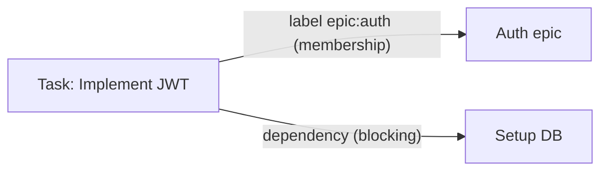

# JIT Labels Reference

**Canonical reference for JIT's label system**

Labels provide organizational membership and classification for issues. This guide covers label format, namespaces, validation rules, and usage patterns.

**Related:** For work ordering and blocking relationships, see [Core Model: Dependencies](../concepts/core-model.md#dependencies)

---

## Overview

### What Are Labels?

Labels are **namespace:value** pairs that provide:
- **Organizational membership** - Group issues by epic, milestone, component
- **Classification** - Mark issue types, priorities, status
- **Filtering** - Query and report on related work
- **Strategic planning** - Identify high-level vs tactical work

**Example:**
```bash
jit issue create --title "Add login" \
  --type task \
  --label epic:auth \
  --label component:backend \
  --label milestone:v1.0
```

### Labels vs Dependencies

**Labels** (membership/grouping):
- Purpose: Organization, filtering, reporting
- Relationship: "belongs to" (many-to-many)
- Query: `jit query all --label "epic:auth"` shows all members
- No workflow impact

**Dependencies** (work order/blocking):
- Purpose: Work sequencing, blocking relationships
- Relationship: "is required by" (directed acyclic graph)
- Query: `jit query blocked` shows blocked issues
- Blocks workflow until complete

**Example:**


The label makes the task a member of the Auth epic. The dependency stops the task from
starting until "Setup DB" reaches a terminal state (done or rejected).

Both can flow the same direction (task → epic → milestone) but serve different purposes and can be used independently.

---

## Label Format Specification

### Enforced Format

```
<namespace>:<value>

Where:
- namespace: [a-z][a-z0-9-]* (lowercase, alphanumeric, hyphens)
- value:     [a-zA-Z0-9][a-zA-Z0-9._/-]*   (alphanumeric, dots, hyphens,
                                            underscores, slashes)
             or an item address (see below)
- separator: exactly one colon ':'
```

A value never contains a colon: the colon is reserved as the sole namespace separator.

**Examples of VALID labels:**
- ✅ `milestone:v1.0`
- ✅ `epic:user-auth`
- ✅ `component:backend`
- ✅ `type:task`
- ✅ `priority:p0`
- ✅ `team:platform-eng`
- ✅ `enforces:@/rule/label-format`

**Examples of INVALID labels:**
- ❌ `auth` (no namespace)
- ❌ `milestone-v1.0` (wrong separator)
- ❌ `Milestone:v1.0` (uppercase namespace)
- ❌ `milestone:` (empty value)
- ❌ `milestone:v1.0:extra` (multiple colons)

### Values that carry item addresses

The value half may be a qualified [item address](item-addresses.md) instead of a
plain word, so a label can link an issue to a rule, gate, invariant, or to a
structured item inside another issue's description:

- `enforces:@/rule/label-format` — project-scoped address (`@/<kind>/<self-id>`)
- `enforces:@myproject/gate/cargo-ci` — address qualified by project name
- `satisfies:56ab0224/REQ-01` — `<short-id>/<self-id>`, an item inside an issue

The `satisfies:` namespace above is this repository's own configuration, not a
`jit init` default; the address *form* of a value is part of the shipped format.

### Enforcement

The `label-format` rule in `.jit/rules.toml` checks every label on write. A
malformed label blocks the write and names the offending label:

```bash
jit issue update <id> --label "Auth"
# Error: Blocked by validation rule(s); pass --force to override:
#   - [label-format] at raw_labels.0: "Auth" is not valid under the given pattern
```

The command exits 4 (validation failure) and the issue is left untouched.

---

## Standard Namespaces (Registry)

### Core Namespaces (Built-in)

Namespaces are declared in `.jit/config.toml` under `[namespaces.<name>]` tables.
`jit init` seeds a starter registry directly in the generated `config.toml`, ready
to customize. To see what the current repository declares, run `jit label namespaces`.

For example, the built-in `type` and `priority` namespaces both set `unique`:

```toml
[namespaces.type]
description = "Issue type (hierarchical). At most one per issue."
unique = true
examples = ["type:task", "type:story", "type:epic"]

[namespaces.priority]
description = "Work priority. Orthogonal to issue priority field; used for filtering."
unique = true
examples = ["priority:high", "priority:low"]

[namespaces.milestone]
description = "Release milestone membership (version tag)."
unique = false
examples = ["milestone:v1.0", "milestone:v1.2.3", "milestone:v2.0-rc1"]

[namespaces.component]
description = "Technical area or subsystem affected."
unique = false
examples = ["component:backend", "component:frontend", "component:cli"]

[namespaces.team]
description = "Owning team."
unique = true
examples = ["team:backend", "team:platform"]

[namespaces.resolution]
description = "Reason for issue closure (used with rejected state)."
unique = true
examples = ["resolution:wont-fix", "resolution:duplicate"]

[namespaces.enforces]
description = "Enforcement link: names an invariant, rule, or gate item that the labeled issue enforces."
unique = false
examples = ["enforces:@/invariant/label-format", "enforces:@/rule/label-format", "enforces:@/gate/cargo-ci"]
```

Membership namespaces for parent types (`epic:*`, `story:*`, `milestone:*`
when used as membership rather than as the version tag) are inferred from
`[type_hierarchy.label_associations]` and do not need to be redeclared.

### Namespace Properties

Each `[namespaces.<name>]` table declares TAXONOMY only:

- **description** (string, required): Human-readable purpose, shown by `jit config show` and the web UI.
- **unique** (bool, required): If true, an issue can carry at most one label from this namespace. Drives the `namespace-unique-<ns>` rule.
- **examples** (list of string, optional): Documentation-only examples; not enforced.

To add a namespace, add a `[namespaces.<name>]` table to `.jit/config.toml`. To
retire one, delete its table once no issue carries a label from it — `jit validate`
reports any label whose namespace is undeclared.

The registry drives default rules in `.jit/rules.toml`:
`namespace-registry` (an undeclared namespace fails `jit validate`) and
`namespace-unique-<ns>` (a unique namespace blocks a second label on
write).

Rule names are colon-free slugs. A rule's origin (`default` for the built-in
rules, `bracket` for those a bracket criterion installs) is a separate
`origin` field on its `.jit/rules.toml` entry, not part of its name. Every
rule is addressable at `@/rule/<self-id>` (`self-id` being its `name`), e.g.
`@/rule/namespace-registry`.

### The `enforces:` namespace

Work that changes an enforcement mechanism links to what it enforces with the
`enforces:` namespace, whose value is an item address: `enforces:@/rule/label-format`,
`enforces:@/gate/cargo-ci`, or `enforces:@/invariant/label-format`. The label
carries the address of the rule, gate, or invariant the issue implements or
maintains, so the mechanism and the work that backs it cross-reference by a
stable id rather than by copied text. The namespace is non-unique: one issue may
enforce several items.

> **Enforcement lives in `.jit/rules.toml`, the single source of truth.** Allowed
> values, value patterns, required namespaces, the canonical label format, and the
> orphan-leaf / strategic-consistency warnings are declarative rules there
> (scaffolded by `jit init`). A `[namespaces.<name>]` table declares taxonomy
> only: description, uniqueness, and examples. To restrict a namespace's values,
> author a rule in `rules.toml`, e.g.:

```toml
# .jit/rules.toml: restrict type:* to a fixed set (authored, not config-derived)
[[rules]]
name = "type-allowed-values"
severity = "error"
enforce = false
assert = { label-value-pattern = { namespace = "type", regex = '^(epic|story|task|bug|spike|chore|milestone)$' } }
```

When `jit validate` reports an unregistered namespace, the `namespace-registry` rule names the offending label so typos are caught.

### Type Labels

The configured `type` namespace permits **at most one** `type:*` label per
issue. A type label is not universally required.

The `type:*` namespace defines the kind of work an issue represents. The set of
valid type values is not built in: it is whatever `[type_hierarchy].types`
declares in `.jit/config.toml` (`@/inv/domain-agnostic`). The `jit init` scaffold
declares a four-level `milestone → epic → story → task` hierarchy; a project that
needs `bug`, `research`, or `theme` types adds them there. See
[Configuration](#configuration) below.

Write the type with `--type <kind>`, which is validated against the declared
types and rejects an undeclared kind:

```bash
jit issue create "Implement login endpoint" --type task
jit issue update <id> --type story
```

`jit issue create` without `--type` (and without a `type:*` label) applies
`[validation].default_type` only when that project configures it. A project can
also add a rule that requires a type; neither behavior is universal.

**Note on "research" vs "spike":** both name a time-boxed investigation
("spike" is the Agile term used in Jira, Rally, and similar tools). Pick one as
the declared type name and use the other only in prose.

### Epic and Milestone Labels: Membership vs Type

**KEY DISTINCTION:**

- **`type:epic`** = "This issue IS an epic" (the work item type)
- **`epic:auth`** = "This issue belongs to the auth epic" (membership/grouping)

- **`type:milestone`** = "This issue IS a milestone" (the work item type)
- **`milestone:v1.0`** = "This issue belongs to the v1.0 milestone" (membership/grouping)

**Examples:**

```bash
# Epic issue itself
jit issue create \
  --title "User Authentication System" \
  --type epic \
  --label "epic:auth" \
  --label "milestone:v1.0"
# type:epic = this IS an epic
# epic:auth = this epic is about auth (self-referential)
# milestone:v1.0 = this epic is part of v1.0 milestone

# Task under that epic
jit issue create \
  --title "Implement login endpoint" \
  --type task \
  --label "epic:auth" \
  --label "milestone:v1.0" \
  --label "component:backend"
# type:task = this IS a task
# epic:auth = this task belongs to auth epic
# milestone:v1.0 = this task contributes to v1.0 milestone
```

**Strategic View Filtering:**

`jit query strategic` selects issues whose `type:*` label names one of the types
in `[type_hierarchy].strategic_types`. To select by membership instead — every
issue that contributes to an epic, whatever its own type — filter on the
membership namespace with a wildcard:

```bash
jit query strategic                    # the epics and milestones themselves
jit query all --label "epic:*"         # everything filed under any epic
```

### Uniqueness and changing a unique label

A namespace declared `unique = true` admits at most one label per issue. Adding a
second one blocks the write (exit 4):

```bash
jit issue update <id> --label "type:bug"
# Error: Blocked by validation rule(s); pass --force to override:
#   - [namespace-unique-type] at labels.type: ["task","bug"] has more than 1 item
```

To change the value, remove the old label and add the new one in a single
invocation. `--remove-label` is applied after `--label`, so pairing them swaps
the value regardless of flag order, in one atomic write:

```bash
jit issue update <id> --remove-label "type:task" --label "type:bug"
```

For the `type` namespace specifically, prefer `--type`: it replaces the existing
`type:*` label in place and rejects a kind that `[type_hierarchy]` does not
declare, which the generic label flags do not.

```bash
jit issue update <id> --type bug
```

---

## Agent-Friendly CLI

### Discovery

```bash
# Show declared namespaces with description and uniqueness
jit label namespaces
# Output:
# Label Namespaces:
#
#   type
#     Description: Issue type (hierarchical). At most one per issue.
#     Unique: true
#
#   milestone
#     Description: Release milestone membership (version tag).
#     Unique: false
#   ...

# Show existing values for a namespace
jit label values milestone
# Output:
# Values in namespace 'milestone':
#
#   v1.0
#   v2.0
#
# Total: 2
```

Both accept `--json` and emit the list envelope:
`{"count": N, "namespaces": [...]}` and `{"count": N, "namespace": "...", "values": [...]}`.

### Atomic Label Operations

```bash
# Add single label (idempotent)
jit issue update <id> --label "epic:auth"
# If already present, no error (idempotent)

# Add multiple labels atomically (comma-separated)
jit issue update <id> --label epic:auth,component:backend
# Or use repeated flags
jit issue update <id> --label epic:auth --label component:backend
# All or nothing - if any invalid, none added

# Remove label
jit issue update <id> --remove-label "epic:auth"

# Swap a value within a namespace (one write)
jit issue update <id> --remove-label "epic:auth" --label "epic:billing"

# Replace the type label
jit issue update <id> --type bug
```

`--label` has the alias `--add-label` and the short form `-l`. Both `--label` and
`--remove-label` are repeatable and accept comma-separated values.

---

## MCP Tools

The [MCP server](../../mcp-server/README.md) generates its tools from the CLI
schema, so each tool mirrors the command of the same name:

| Tool | Purpose |
|------|---------|
| `jit_label_namespaces` | List declared namespaces, so an agent writes a label the `namespace-registry` rule accepts |
| `jit_label_values` | List values in use in a namespace, so an agent reuses the project vocabulary |
| `jit_issue_update` | Add (`label`) and remove (`remove-label`) labels on an issue |
| `jit_query_all` | Find issues by label pattern, including `namespace:*` wildcards |

### Agent Prompt Additions

In the MCP server description or system prompt:

```markdown
## Label Usage Rules

1. **Format**: Always use `namespace:value` format
   - ✅ Correct: "milestone:v1.0", "epic:auth"
   - ❌ Wrong: "auth", "milestone-v1.0"

2. **Namespaces**: Call `jit_label_namespaces` before writing a label —
   the registry is per-repository, and an undeclared namespace fails validation.

3. **Type**: `type:*` is unique. Change it with `jit_issue_update`'s `type`
   argument, not by adding a second `type:*` label.

4. **Strategic Issues**: `jit_query_strategic` returns the issues whose type is
   declared strategic (epics and milestones, by default).

5. **Query Examples**:
   - All milestone members: `jit_query_all` with label `milestone:*`
   - Specific epic: `jit_query_all` with label `epic:auth`
   - Backend work: `jit_query_all` with label `component:backend`
```

---

## Disambiguation Rules

### 1. Namespace Conflicts

**Problem**: `epic:backend` vs `component:backend` - which is correct?

**Solution**: Namespace defines meaning
- `epic:backend` = Epic-level initiative to build backend
- `component:backend` = Task is in backend area

Both can coexist:
```bash
jit issue create \
  --title "Backend Infrastructure Epic" \
  --type epic \
  --label "epic:backend" \
  --label "component:infra"
```

### 2. Value Conflicts

**Problem**: `milestone:v1.0` vs `milestone:1.0` - same milestone?

**Solution**: Exact string match
- These are DIFFERENT milestones
- Convention: Use consistent naming (recommend `v1.0` format)
- Values are matched literally; there is no fuzzy matching, so check the
  vocabulary already in use before inventing a value:

```bash
jit label values milestone
```

To restrict a namespace to a fixed vocabulary, author a `label-value-pattern`
rule in `.jit/rules.toml` (see [The `enforces:` namespace](#the-enforces-namespace)).

### 3. Case Sensitivity

**Solution**: Namespaces are lowercase-only (enforced by the `label-format` rule)
Values are case-sensitive:

```bash
jit issue update <id> --label "Epic:auth"
# Error: Blocked by validation rule(s); pass --force to override:
#   - [label-format] at raw_labels.0: "Epic:auth" is not valid under the given pattern

jit issue update <id> --label "epic:Auth"
# OK - value can be mixed case
```

### 4. Label Discovery

**Problem**: Agent doesn't know what labels exist

**Solution**: Provide discovery tools
```bash
# What milestones exist?
jit label values milestone

# What epics exist?
jit label values epic

# What labels does this issue have?
jit issue show <id> --json | jq '.labels'
```

---

## Agent Workflow Examples

### Example 1: Create Epic with Tasks

```bash
# 1. Agent checks declared namespaces
jit label namespaces

# 2. Creates epic issue
EPIC=$(jit issue create \
  --title "User Authentication System" \
  --type epic \
  --priority high \
  --label "epic:auth" \
  --label "milestone:v1.0" \
  --json | jq -r '.id')

# 3. Creates tasks under the epic, carrying the epic's grouping labels and
#    wiring each as a dependency of the epic.
for title in \
  "JWT token implementation" \
  "OAuth provider integration" \
  "Password reset flow"; do
  TASK=$(jit issue create \
    --title "$title" \
    --type task \
    --label "epic:auth" \
    --label "milestone:v1.0" \
    --json | jq -r '.id')
  jit dep add "$EPIC" "$TASK"
done

# All tasks carry:
# - epic:auth
# - milestone:v1.0

# 4. Agent adds component labels to the epic's tasks
for task in $(jit graph deps "$EPIC" --json | jq -r '.nodes[].id'); do
  jit issue update "$task" --label "component:backend"
done
```

### Example 2: Query Strategic View

```bash
# Agent wants to see high-level progress
jit query strategic
# Returns the epics and milestones themselves

# Check milestone progress: counts by state over the milestone's members
jit query count --by state --label "milestone:v1.0" --json
# {"total":17,"done":12,"open":5,"percent":70,
#  "by_state":[{"state":"done","count":12}, ...]}
```

### Example 3: Error Handling

```bash
# Agent tries malformed label
jit issue update <id> --label "backend"
# Error: Blocked by validation rule(s); pass --force to override:
#   - [label-format] at raw_labels.0: "backend" is not valid under the given pattern
# Exit code 4; nothing written.

# Agent corrects
jit issue update <id> --label "component:backend"
# Success

# Agent tries a second label in the unique `type` namespace
jit issue update <id> --label "type:bug"
# Error: Blocked by validation rule(s); pass --force to override:
#   - [namespace-unique-type] at labels.type: ["feature","bug"] has more than 1 item

# Agent corrects
jit issue update <id> --type bug
# Success
```

---

## Validation Integration

`jit validate` checks every issue against `.jit/rules.toml`, including the
`label-format` and `namespace-registry` rules. It exits 0 when the repository is
clean and non-zero when a rule error is found, so it drops straight into a hook
or a CI job.

### Pre-commit Validation

```bash
# In .git/hooks/pre-commit
jit validate
```

### CI Validation

```yaml
# .github/workflows/validate.yml
- name: Validate labels
  run: jit validate
```

---

## Machine-Readable Label Rules

Agents discover the label vocabulary and its constraints from three places:

```bash
jit label namespaces --json     # {"count": N, "namespaces": [...]}
jit label values <ns> --json    # {"count": N, "namespace": "...", "values": [...]}
jit --schema                    # JSON output shapes and the exit-code taxonomy
```

The rules themselves — format pattern, uniqueness, allowed values — are readable
as data in `.jit/rules.toml`, the single source of truth.

---

## Configuration

Labels are configured in `.jit/config.toml` under the `[type_hierarchy]` section:

```toml
[type_hierarchy]
# Type name to hierarchy level mapping (lower numbers = more strategic)
types = { milestone = 1, epic = 2, story = 3, task = 4 }

# List of type names that are considered strategic (for query strategic)
strategic_types = ["milestone", "epic"]

# Maps each parent type to its membership namespace
[type_hierarchy.label_associations]
epic = "epic"
milestone = "milestone"
story = "story"
```

**Customization examples:**

### Minimal 2-Level Hierarchy
```toml
[type_hierarchy]
types = { epic = 1, task = 2 }

[type_hierarchy.label_associations]
epic = "epic"
```

### Extended 5-Level Hierarchy
```toml
[type_hierarchy]
types = { program = 1, milestone = 2, epic = 3, story = 4, task = 5 }
strategic_types = ["program", "milestone", "epic"]

[type_hierarchy.label_associations]
program = "program"
milestone = "milestone"
epic = "epic"
story = "story"
```

### Custom Naming (Theme Instead of Epic)
```toml
[type_hierarchy]
types = { release = 1, theme = 2, task = 3 }
strategic_types = ["release", "theme"]

[type_hierarchy.label_associations]
theme = "epic"        # Map theme type to epic namespace
release = "milestone" # Map release type to milestone namespace
```

**See also:** [docs/reference/example-config.toml](example-config.toml) for complete configuration examples.

---

## Quick Reference

### The Golden Rules

**Rule 1: Keep Type Labels Singular**
```bash
# Explicit — validated against [type_hierarchy].types
jit issue create --title "Login API" --type task --label "epic:auth"

# Implicit only when this project configures [validation].default_type
jit issue create --title "Login API" --label "epic:auth"
```

The type namespace prevents more than one `type:*` value. A project rule or
configured default can require or supply one when that is part of its workflow.

**Rule 2: Type vs Membership Labels**

| Label | Meaning | Answers |
|-------|---------|---------|
| `type:*` | **What it IS** | "What kind of work item?" |
| `epic:*` | **What it BELONGS TO** | "Which epic does this contribute to?" |
| `milestone:*` | **What it BELONGS TO** | "Which release is this part of?" |

### Common Patterns

**Creating an Epic:**
```bash
jit issue create \
  --title "User Authentication System" \
  --type epic \                  # This IS an epic
  --label "epic:auth" \          # This epic is about auth (group ID)
  --label "milestone:v1.0"       # This epic is part of v1.0
```

Why both `type:epic` and `epic:auth`?
- `type:epic` = Tells you what it **is** (the type)
- `epic:auth` = Creates a **group identifier** for child tasks to reference
- Child tasks use `epic:auth` to show membership

**Creating Tasks Under an Epic:**
```bash
jit issue create \
  --title "Implement JWT validation" \
  --type task \                   # This IS a task
  --label "epic:auth" \           # Belongs to auth epic
  --label "milestone:v1.0" \      # Belongs to v1.0 milestone
  --label "component:backend"     # Additional metadata
```

**Creating a Milestone:**
```bash
jit issue create \
  --title "Release v1.0" \
  --type milestone \             # This IS a milestone
  --label "milestone:v1.0"       # Self-referential group ID
```

### Namespace Reference Table

The registry is per-repository; `jit label namespaces` is authoritative for yours.
The namespaces `jit init` scaffolds behave as follows.

**Carried by every issue:**

| Namespace | Unique? | Examples | Purpose |
|-----------|---------|----------|---------|
| `type:*` | ✅ Yes | `type:task`, `type:epic`, `type:milestone` | Defines what the issue IS |

**Membership labels (namespaces inferred from `label_associations`):**

| Namespace | Unique? | Examples | Purpose |
|-----------|---------|----------|---------|
| `epic:*` | ❌ No | `epic:auth`, `epic:billing` | Groups work under an epic |
| `milestone:*` | ❌ No | `milestone:v1.0`, `milestone:q1-2026` | Groups work in a release |
| `story:*` | ❌ No | `story:login-form` | Groups work under a story |

**Metadata labels:**

| Namespace | Unique? | Examples | Purpose |
|-----------|---------|----------|---------|
| `component:*` | ❌ No | `component:backend`, `component:frontend` | Technical area |
| `team:*` | ✅ Yes | `team:platform`, `team:api` | Owning team |
| `priority:*` | ✅ Yes | `priority:p0`, `priority:p1` | Priority level |
| `resolution:*` | ✅ Yes | `resolution:wont-fix` | Reason for closure |
| `enforces:*` | ❌ No | `enforces:@/rule/label-format` | Item this issue enforces |

### DO's and DON'Ts

**DO:**
- ✅ Use `--type task` + `--label epic:auth` for tasks
- ✅ Use `--type epic` + `--label epic:auth` + `--label milestone:v1.0` for epics
- ✅ Query by membership: `jit query all --label "epic:auth"`
- ✅ Use lowercase for namespaces

**DON'T:**
- ❌ Add a second label in a unique namespace instead of swapping it
- ❌ Use uppercase in namespaces (`Type:task`)
- ❌ Use hyphens instead of colons (`epic-auth`)
- ❌ Create freeform labels without namespaces

---

## Summary: Making Labels Unambiguous

### 1. Enforce Format
- Regex validation: `namespace:value`
- Rule violations block the write and name the offending label
- No freeform labels accepted

### 2. Namespace Registry
- Namespaces declared in `.jit/config.toml`
- Properties: description, uniqueness, examples
- Extensible for custom namespaces

### 3. Agent-Friendly Tools
- Discovery: `jit label namespaces`, `jit label values`
- Validation: rule errors before write, `jit validate` for the whole repository
- JSON envelopes on every listing, plus `jit --schema`

### 4. Atomic Operations
- Idempotent add
- Paired `--remove-label` / `--label` to swap a unique namespace's value
- Batch operations (all-or-nothing)

### 5. MCP Integration
- Tools generated from the CLI schema
- Prompt guidance on usage
- Error feedback loop

**Result**: Agents can reliably use labels without human intervention, with clear feedback when mistakes happen.
