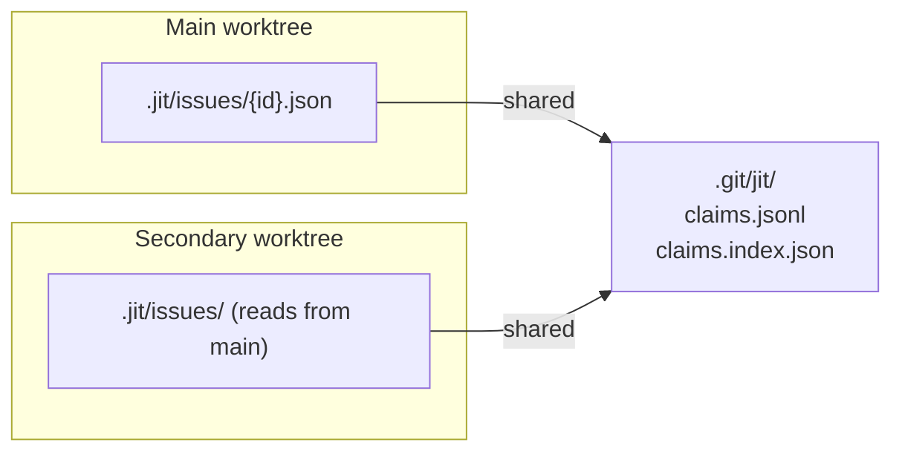

# Tutorial: Parallel Work with Git Worktrees

> **Diátaxis Type:** Tutorial  
> **Time to complete:** 15 minutes  
> **Prerequisites:** Basic familiarity with jit ([Quickstart](./quickstart.md))

This tutorial guides you through setting up parallel work using git worktrees. You'll learn how multiple agents can work on different issues in parallel, using leases to coordinate who is working on what.

## What You'll Learn

- Create a secondary worktree for parallel work
- Configure agent identity for coordination
- Claim issues with leases to coordinate parallel work
- Work in isolation and merge back

## Before You Start

You need:
- A git repository with jit initialized
- Basic understanding of git worktrees ([git-worktree docs](https://git-scm.com/docs/git-worktree))

## Step 1: Create a Secondary Worktree

A secondary worktree is a linked, non-primary checkout. By default, jit
refuses state-mutating commands run inside one — see
[`write_policy`](../reference/configuration.md#write_policy) in the
Configuration Reference for the stance and its per-invocation override.
Declare the allowing stance in your main worktree and commit it before
creating any secondary worktree, so every worktree you create afterward
inherits permission to write:

```bash
# From your main worktree
jit config set worktree.write_policy allow
git add .jit/config.toml
git commit -m "Allow linked-checkout writes for parallel work"
```

Now create a new worktree from your main branch:

```bash
git worktree add ../my-feature -b feature/my-work
cd ../my-feature
```

Initialize jit in the new worktree — this succeeds because the worktree
already carries the allowing stance you committed above:

```bash
jit init
```

Verify the worktree is detected:

```bash
jit worktree info
```

You should see output like:

```
Worktree Information:
  ID:         wt:abc12345
  Branch:     feature/my-work
  Root:       /path/to/my-feature
  Type:       secondary worktree
  Common dir: /path/to/main/.git
```

## Step 2: Configure Agent Identity

Agents need unique identities for claim coordination. Set yours:

```bash
# Option 1: Environment variable (recommended for sessions)
export JIT_AGENT_ID=agent:alice-feature

# Option 2: Persistent config file
mkdir -p ~/.config/jit
cat > ~/.config/jit/agent.toml << 'EOF'
[agent]
id = "agent:alice"
created_at = "2026-01-06T12:00:00Z"
description = "Alice's development session"
EOF
```

Verify your identity:

```bash
echo $JIT_AGENT_ID
```

## Step 3: View Available Issues

From your secondary worktree, you can see all issues from the main worktree:

```bash
jit query available
```

This shows issues that are:
- Unassigned
- In "ready" state
- Not blocked by dependencies

The issue visibility works through a 3-tier fallback:
1. **Local `.jit/`** — Issues you've modified in this worktree
2. **Git HEAD** — Committed issues (canonical state)
3. **Main worktree `.jit/`** — Uncommitted issues from main

## Step 4: Claim an Issue

Before working on an issue, acquire a lease on it to signal that you're working on it:

```bash
# Find an available issue
jit query available

# Claim it (requires agent identity)
jit claim acquire <issue-id>
```

You should see:

```
✓ Acquired lease: abc123-def456...
  Issue: <issue-id>
  TTL: 600 seconds
```

The `TTL: 600 seconds` shown is the default claim lease TTL — see
[Runtime Coordination Defaults](../reference/runtime-defaults.md), the
generated source of that value.

The claim creates a **lease** that:
- Is held exclusively — while your lease is active, another agent cannot acquire a lease on the same issue
- Expires after its TTL (see the [default claim lease TTL](../reference/runtime-defaults.md))
- Can be renewed if you need more time

A lease is advisory work coordination: it signals intent and hands out exclusive *ownership of the lease*, but by default it does not lock the issue's files against an agent that skips claiming. Whether write operations require a lease is configurable — see `enforce_leases` in the [Configuration Reference](../reference/configuration.md#enforce_leases).

View active claims:

```bash
jit claim list
```

## Step 5: Work on the Issue

Now work on your claimed issue. The key principle: **changes stay local until committed and merged**.

```bash
# Update issue state
jit issue update <issue-id> --state in_progress

# Do your work...
# (edit code, run tests, etc.)

# Inspect recorded gate runs when ready
jit gate status-all <issue-id>

# Complete the issue
jit issue update <issue-id> --state done
```

Your changes to `.jit/` are isolated to this worktree until you commit them.

## Step 6: Commit and Merge

When your work is complete:

```bash
# Stage changes (including .jit/)
git add -A

# Commit
git commit -m "Complete feature work

Closes issue <issue-id>"

# Push and create PR (or merge directly)
git push origin feature/my-work
```

After merging to main, another worktree sees your issue updates once it updates its own branch (`git pull`, `merge`, or `rebase`) — worktrees on different branches do not share each other's commits automatically.

## Step 7: Clean Up

Release your claim (if not expired):

```bash
jit claim release <issue-id>
```

Remove the worktree when done:

```bash
cd ..
git worktree remove my-feature
```

## How It All Works Together



- **Issue data** is per-worktree, carried on each worktree's branch
- **Claims** are shared across all worktrees (via `.git/jit/`)
- **Issue changes** sync between worktrees through git — another worktree sees them once its branch is updated (a secondary worktree can additionally read the main worktree's issues directly, as in Step 3)

If two worktrees' stores end up holding different records for the same ids,
[Divergent Checkout
Stores](../how-to/multi-agent-coordination.md#divergent-checkout-stores) walks
through checking, preserving, and reconciling them.

## Try It Yourself

1. Create two worktrees
2. Set different `JIT_AGENT_ID` in each
3. Try claiming the same issue from both — the second should fail
4. Complete an issue in one worktree and commit it, then update the other worktree's branch (merge/pull) to see the change there

## Common Scenarios

### Scenario: Agent Times Out

If an agent crashes or the lease expires:

```bash
# List stale leases
jit claim list

# Force evict if needed (admin operation)
jit claim force-evict <lease-id> --reason "agent crashed"
```

### Scenario: Need More Time

Renew your lease before it expires:

```bash
jit claim renew <lease-id> --extension 600
```

### Scenario: Check Dependencies

You can query an issue's dependencies from any worktree:

```bash
# See what blocks an issue (immediate deps)
jit graph deps <issue-id>

# See the full dependency tree
jit graph deps <issue-id> --depth 0
```

## What's Next?

- [How-to: Multi-Agent Coordination](../how-to/multi-agent-coordination.md) — Advanced coordination patterns
- [Configuration Reference](../reference/configuration.md) — Customize TTL, enforcement, and more
- [Troubleshooting Guide](../how-to/troubleshooting.md) — Common issues and solutions

## See Also

- [CLI Commands Reference](../reference/cli-commands.md) — Full command documentation
- Design document: `dev/archive/ad601a15-parallel-work/design/worktree-parallel-work.md`
